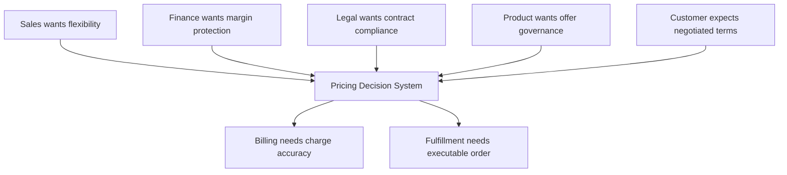
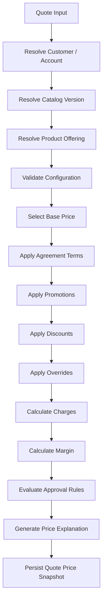
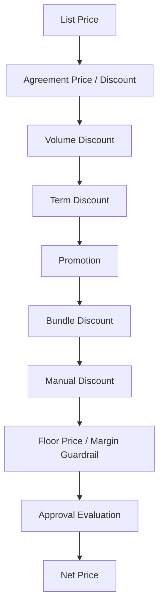
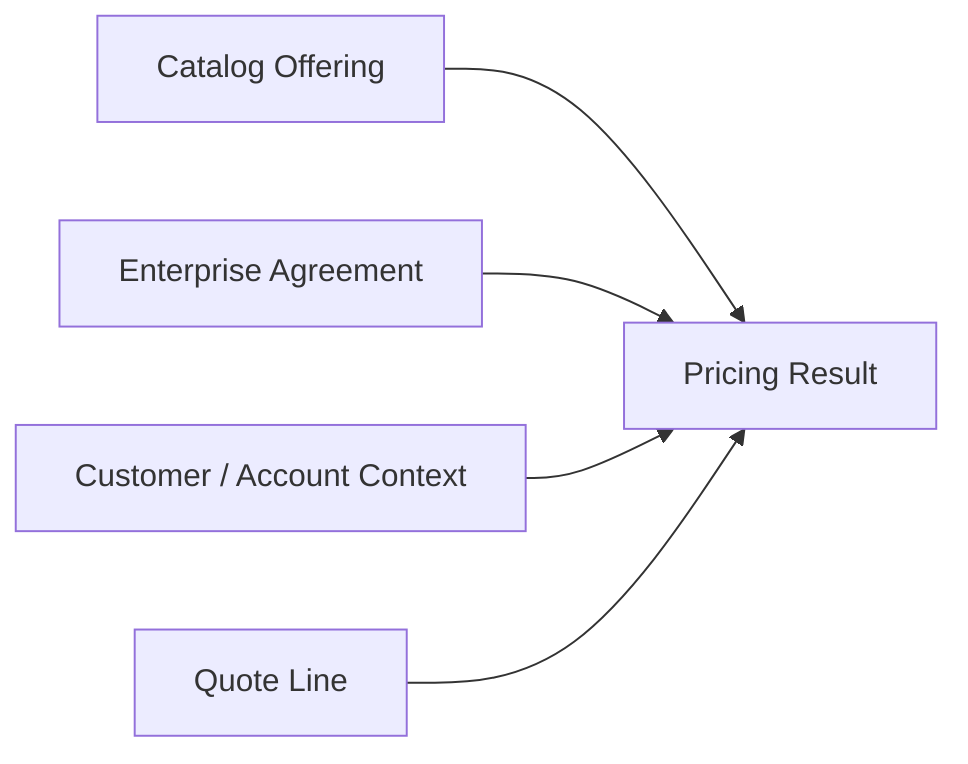
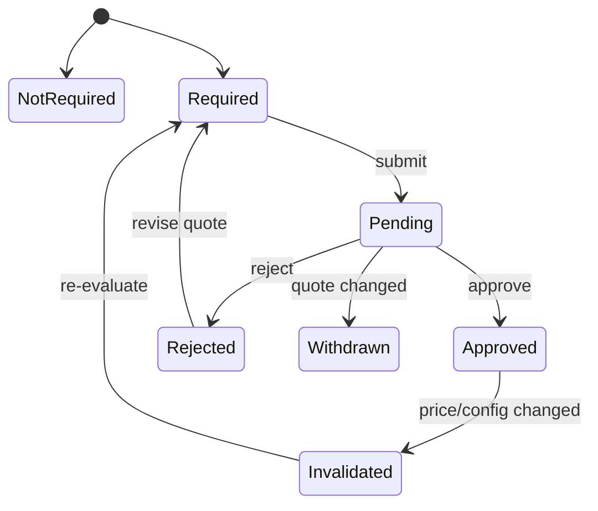
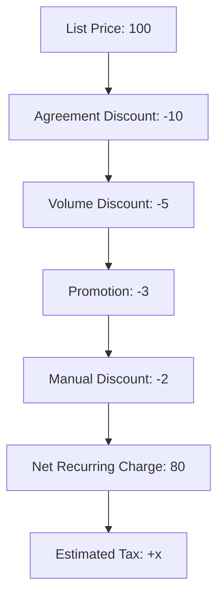

# Part 007 — Pricing, Discounting, Margin, and Financial Governance

## 1. Tujuan Part Ini

Part ini membahas pricing dalam CPQ enterprise bukan sebagai operasi matematika sederhana, tetapi sebagai **commercial decision system** yang menentukan apakah sebuah deal:

- boleh dijual;
- menguntungkan;
- sesuai agreement;
- butuh approval;
- bisa dipertanggungjawabkan ke finance;
- bisa dikirim ke billing;
- tidak menyebabkan revenue leakage;
- tidak membuat order fulfillment bekerja pada commercial promise yang salah.

Di banyak sistem enterprise, pricing bug tidak selalu terlihat sebagai exception. Pricing bug sering terlihat sebagai:

- quote terlihat valid, tetapi margin salah;
- discount diterapkan dua kali;
- enterprise agreement tidak dihormati;
- price yang sudah expired masih dipakai;
- approval tidak muncul padahal discount melewati threshold;
- quote accepted dengan stale price;
- billing menerima charge yang berbeda dari quote;
- customer menerima harga yang tidak bisa dipertahankan secara contract/legal;
- revenue leakage baru ketahuan setelah invoice, dispute, atau audit.

Tujuan part ini:

- membangun mental model pricing sebagai governance system;
- memahami primitive pricing: charge, price list, recurring charge, non-recurring charge, usage charge, currency, tax, discount, term, commitment, margin;
- memahami discount hierarchy dan stacking rule;
- memahami enterprise agreement sebagai overlay commercial policy;
- memahami margin guardrail dan approval threshold;
- memahami price explainability dan auditability;
- memahami freeze/reprice/snapshot trade-off;
- memahami failure mode pricing dalam quote-to-cash;
- menyiapkan cara membaca, menguji, dan mereview pricing-related PR.

Dari sumber publik, CSG Quote & Order diposisikan untuk complex selling, tailored pricing, enterprise agreements, dan accurate billing tracking. CSG juga mendeskripsikan quote-to-cash sebagai proses yang menghubungkan configure, price, quote, contract, order, orchestrate, fulfill, dan bill, dengan catalog-driven platform untuk menjaga konsistensi product dan pricing information. Ini adalah konteks publik. Detail engine pricing internal, rule model, approval workflow, dan margin source of truth tetap harus diverifikasi internal.

Prinsip utama part ini:

> Pricing is not just calculation. Pricing is controlled commitment.

---

## 2. Public Facts vs Internal Facts

### 2.1 Public facts yang aman dipakai

Aman untuk menggunakan fakta publik berikut sebagai konteks awal:

- CSG Quote & Order secara publik menjelaskan dukungan untuk complex products, multi-line, multi-site, multi-partner deals, tailored pricing, dan enterprise agreements.
- CSG quote-to-cash material menekankan automasi CPQ, order management, billing, dan revenue recognition untuk mengurangi manual handoff dan revenue leakage.
- Catalog-driven platform disebut sebagai mekanisme untuk menjaga product dan pricing information konsisten sepanjang quote-to-cash lifecycle.
- TM Forum TMF620 menyediakan konsep product offering price sebagai bagian dari product catalog management.
- TM Forum TMF648 Quote Management dan TMF622 Product Ordering relevan untuk membawa price dari quote ke order, tetapi implementasi internal bisa berbeda.

### 2.2 Hal yang wajib diverifikasi internal

Jangan mengasumsikan:

- ada satu pricing engine tunggal;
- semua price berasal dari product catalog;
- enterprise agreement selalu berada di service yang sama dengan quote;
- margin dihitung real-time;
- approval threshold didefinisikan di pricing engine;
- discount stacking sudah deterministic;
- price recalculation selalu terjadi saat quote dibuka ulang;
- quote menyimpan full price explanation;
- billing memakai charge snapshot yang sama dengan quote;
- tax dihitung di Quote & Order;
- currency conversion terjadi di CPQ;
- semua customer deployment memakai pricing behavior yang sama.

### 2.3 Pertanyaan pembuka saat onboarding

Saat masuk ke area pricing, tanyakan:

- Apa source of truth untuk list price?
- Apa source of truth untuk customer-specific price?
- Apa source of truth untuk enterprise agreement?
- Apakah pricing dihitung synchronous dalam quote request?
- Apakah pricing engine stateless atau menyimpan calculation result?
- Apa yang disimpan di quote item: final amount saja atau explanation lengkap?
- Kapan price boleh berubah setelah quote dibuat?
- Apakah quote accepted selalu memakai frozen price?
- Bagaimana approval threshold dihitung?
- Apakah margin calculation memakai cost internal, reference margin, atau external finance input?
- Apa contract antara quote price dan billing charge?

---

## 3. Mental Model: Pricing sebagai Commercial Control Plane

Pricing berada di tengah beberapa tekanan yang sering bertentangan:



Sistem pricing yang buruk biasanya jatuh ke salah satu ekstrem:

1. **Terlalu rigid**: semua harus sesuai list price; sales tidak bisa menangani deal enterprise nyata.
2. **Terlalu bebas**: semua bisa di-override; margin bocor, approval meaningless, audit sulit.
3. **Terlalu opaque**: angka final ada, tetapi tidak jelas datang dari mana.
4. **Terlalu dynamic**: hasil price berubah setiap kali quote dibuka, membuat customer trust rendah.
5. **Terlalu duplicated**: CPQ, order, billing, dan CRM menghitung price masing-masing.

Senior engineer harus melihat pricing sebagai sistem dengan tiga lapisan:

| Lapisan | Pertanyaan | Contoh |
|---|---|---|
| Calculation | Berapa angka finalnya? | MRC 100, discount 10%, NRC 50 |
| Governance | Apakah angka ini boleh dipakai? | Margin threshold, approval, agreement |
| Evidence | Bisakah angka ini dijelaskan kembali? | Price explanation, audit trail, snapshot |

Kalimat penting:

> A correct price without explanation is not enterprise-grade pricing.

---

## 4. Core Pricing Primitives

Terminologi internal bisa berbeda, tetapi primitive berikut sering muncul dalam CPQ/telco/enterprise pricing.

### 4.1 List Price

**List price** adalah harga dasar sebelum customer-specific adjustment, discount, bundle rule, promotion, tax, atau override.

Pertanyaan desain:

- Apakah list price berada di catalog?
- Apakah list price versioned?
- Apakah list price punya effective date?
- Apakah list price berbeda per market/geography/currency?
- Apakah quote menyimpan reference atau snapshot?

Failure mode:

- quote memakai list price terbaru, padahal quote dibuat terhadap catalog version lama;
- list price berubah tanpa reapproval;
- list price retired tetapi quote lama masih bisa dikonversi menjadi order tanpa policy jelas.

### 4.2 Product Offering Price

Dalam catalog-driven model, harga biasanya melekat pada **product offering**, bukan hanya product specification.

Product specification menjawab:

> Apa benda/layanan ini secara teknis atau komersial?

Product offering menjawab:

> Dalam bentuk apa benda/layanan ini dijual, ke market mana, dengan price dan term apa?

Product offering price dapat mencakup:

- recurring charge;
- non-recurring charge;
- usage charge;
- one-time installation charge;
- activation fee;
- cancellation fee;
- early termination charge;
- minimum commitment;
- tiered usage price;
- volume-based price.

### 4.3 Recurring Charge

Recurring charge adalah charge periodik, misalnya monthly recurring charge.

Hal yang perlu diperhatikan:

- billing frequency;
- contract term;
- proration;
- start date;
- end date;
- suspension;
- cancellation;
- amendment;
- upgrade/downgrade.

Bug umum:

- quote menghitung monthly price, billing butuh annualized amount;
- discount diterapkan ke monthly charge tetapi tidak ke annual commitment;
- proration tidak dijelaskan di quote;
- cancellation fee tidak terlihat saat quote amendment.

### 4.4 Non-Recurring Charge

Non-recurring charge mencakup one-time setup fee, installation fee, activation fee, professional service fee, device fee, atau migration fee.

Risiko:

- NRC waived tanpa approval;
- NRC tidak dikirim ke billing;
- NRC diterapkan dua kali saat order retry;
- NRC hilang saat quote versioning.

### 4.5 Usage Charge

Usage charge bergantung pada consumption.

Contoh umum:

- per GB;
- per API call;
- per minute;
- per SMS;
- per connected device;
- per bandwidth tier;
- per transaction.

Dalam CPQ, usage charge sering tidak menghasilkan total pasti. Sistem mungkin hanya bisa menunjukkan:

- rate;
- tier;
- estimated usage;
- minimum commitment;
- overage price;
- included allowance.

Senior engineer harus jelas membedakan:

- **quoted fixed amount**;
- **estimated amount**;
- **billing rate**;
- **usage commitment**;
- **not-to-exceed cap**.

### 4.6 Currency

Currency bukan formatting. Currency mempengaruhi:

- price list selection;
- rounding;
- approval threshold;
- margin calculation;
- tax;
- invoice;
- reporting;
- exchange rate timing.

Pertanyaan desain:

- Apakah quote multi-currency diperbolehkan?
- Apakah satu quote bisa punya line item berbeda currency?
- Apakah exchange rate snapshot disimpan?
- Apakah approval threshold dikonversi ke base currency?
- Apakah rounding dilakukan per line atau total?

### 4.7 Tax

Di banyak enterprise systems, tax calculation dilakukan oleh tax engine eksternal atau billing, bukan CPQ. Namun quote bisa perlu menampilkan estimated tax.

Hal yang harus jelas:

- tax included atau excluded;
- tax final atau estimated;
- jurisdiction source;
- tax exemption;
- invoice responsibility;
- legal disclaimer di quote.

Jangan mengasumsikan Quote & Order menghitung tax final. Verifikasi internal.

### 4.8 Cost and Margin

Margin membutuhkan cost. Cost bisa berasal dari:

- product cost;
- network cost;
- partner cost;
- service delivery cost;
- license cost;
- hardware cost;
- discount-adjusted revenue;
- internal finance model.

Margin bisa dihitung sebagai:

```text
margin_amount = net_revenue - cost
margin_percent = margin_amount / net_revenue
```

Tetapi realitas enterprise lebih rumit:

- recurring margin berbeda dari one-time margin;
- bundle margin bisa cross-subsidized;
- cost bisa customer-specific;
- cost bisa estimated;
- margin guardrail bisa berbeda per product family;
- finance mungkin melihat margin berdasarkan contract term, bukan line item.

---

## 5. Pricing Calculation Pipeline

Pricing calculation biasanya tidak satu langkah. Mental model yang lebih aman:



Setiap tahap harus menjawab:

- input apa yang dibutuhkan;
- source of truth-nya apa;
- apakah deterministic;
- apakah versioned;
- apakah hasilnya disimpan;
- failure-nya seperti apa;
- apakah perlu audit.

### 5.1 Resolve Customer / Account

Harga enterprise sering bergantung pada customer/account:

- customer segment;
- account hierarchy;
- master agreement;
- geography;
- channel;
- partner;
- contract status;
- credit status;
- existing installed base.

Risiko:

- customer lookup stale;
- account hierarchy berubah setelah quote dibuat;
- enterprise agreement parent account tidak diterapkan ke child account;
- partner/reseller context hilang.

### 5.2 Resolve Catalog Version

Pricing harus jelas terkait catalog version.

Pilihan:

1. Quote selalu memakai catalog active terbaru.
2. Quote mengunci catalog version saat dibuat.
3. Quote memakai catalog version per line item.
4. Quote bisa direprice ke catalog terbaru dengan explicit action.

Tidak ada jawaban universal. Trade-off:

| Strategy | Kelebihan | Risiko |
|---|---|---|
| Always latest | Product update langsung berlaku | Quote berubah tanpa seller sadar |
| Quote-level snapshot | Stabil dan audit-friendly | Catalog bug lama ikut terbawa |
| Line-level snapshot | Fleksibel untuk amendment | Kompleksitas tinggi |
| Explicit reprice | Controlled | Butuh UX dan process jelas |

### 5.3 Select Base Price

Base price selection harus mempertimbangkan:

- product offering;
- price list;
- region;
- currency;
- sales channel;
- customer segment;
- effective date;
- contract term;
- quantity;
- bundle membership.

Failure mode:

- wrong price list;
- expired price;
- wrong currency;
- wrong quantity tier;
- bundle price and component price both applied.

### 5.4 Apply Agreement Terms

Enterprise agreement bisa memberi:

- custom price;
- discount schedule;
- minimum annual commitment;
- volume band;
- allowed product family;
- term-specific discount;
- renewal terms;
- price protection;
- ramp schedule;
- special billing terms.

Agreement tidak boleh diperlakukan sebagai free-form note. Agreement adalah policy overlay.

### 5.5 Apply Promotions

Promotion berbeda dari discount manual.

Promotion biasanya:

- time-bound;
- campaign-bound;
- eligibility-driven;
- product/channel-specific;
- maybe stackable or exclusive.

Pertanyaan:

- Promotion otomatis atau dipilih seller?
- Apakah promotion bisa digabung dengan enterprise agreement?
- Apakah promotion butuh approval?
- Apa terjadi jika quote accepted setelah promotion expired?

### 5.6 Apply Discounts

Discount bisa berasal dari banyak sumber:

- agreement discount;
- campaign discount;
- volume discount;
- term discount;
- bundle discount;
- partner discount;
- discretionary seller discount;
- manager-approved discount;
- override discount.

Yang penting bukan hanya besar discount, tetapi **urutan dan stacking rule**.

Contoh:

```text
List price = 100
Agreement discount = 10%
Promotion discount = 10%

Sequential:
100 -> 90 -> 81
Total discount = 19%

Additive:
100 -> 80
Total discount = 20%
```

Jika tidak didefinisikan eksplisit, implementasi bisa berbeda antara CPQ, billing, dan finance.

### 5.7 Apply Overrides

Override adalah area rawan.

Override bisa berupa:

- manual price override;
- discount override;
- margin override;
- approval override;
- eligibility override;
- expiration override;
- billing term override.

Aturan minimal:

- override harus punya actor;
- override harus punya reason;
- override harus punya permission;
- override harus punya approval jika melewati threshold;
- override harus masuk audit trail;
- override harus terlihat dalam price explanation.

### 5.8 Calculate Margin

Margin calculation harus menjawab:

- margin dihitung per line, per bundle, per quote, atau per contract?
- cost source apa?
- apakah cost snapshot disimpan?
- apakah margin negatif diperbolehkan?
- apakah margin threshold berbeda per product family?
- apakah approval memakai gross margin, net margin, atau contribution margin?

### 5.9 Evaluate Approval Rules

Approval rules bisa bergantung pada:

- discount percent;
- discount amount;
- margin percent;
- contract value;
- deal size;
- customer risk;
- product family;
- term length;
- non-standard clause;
- waived charges;
- manual override;
- price below floor;
- agreement exception.

Approval bukan UI workflow saja. Approval adalah lifecycle invariant.

---

## 6. Discount Hierarchy and Stacking Rules

Discount logic harus eksplisit. Tanpa hierarchy, sistem akan menciptakan hasil yang tidak bisa dijelaskan.

Contoh hierarchy:



Tetapi hierarchy ini hanya contoh. Harus diverifikasi internal.

### 6.1 Stacking Dimensions

Discount dapat bertabrakan dalam beberapa dimensi:

| Dimension | Pertanyaan |
|---|---|
| Source | Agreement, promotion, manual, partner, system-generated? |
| Scope | Line, bundle, quote, account, contract? |
| Basis | List price, net price, recurring amount, total contract value? |
| Order | Sequential, additive, max discount, exclusive? |
| Duration | One-time, first 3 months, full term, renewal only? |
| Approval | Pre-approved atau approval-triggering? |

### 6.2 Discount as Value Object

Dalam Java domain model, discount sebaiknya tidak hanya `BigDecimal discountPercent`.

Model yang lebih defensible:

```java
public record Discount(
    DiscountId id,
    DiscountSource source,
    DiscountScope scope,
    DiscountType type,
    BigDecimal value,
    DiscountApplicationBasis basis,
    boolean stackable,
    Optional<EffectivePeriod> effectivePeriod,
    Optional<ApprovalRequirement> approvalRequirement,
    Optional<String> reasonCode
) {}
```

Kenapa?

Karena discount tanpa source/scope/basis tidak bisa diaudit.

### 6.3 Price Floor

Price floor adalah batas minimum harga atau margin.

Failure mode:

- price floor dicek sebelum semua discount diterapkan;
- price floor dicek per line, padahal bundle margin tetap sehat;
- price floor hanya warning, tetapi conversion to order tetap bisa terjadi;
- price floor tidak mempertimbangkan currency;
- price floor tidak masuk approval reason.

### 6.4 Rounding

Rounding adalah sumber bug besar.

Pertanyaan:

- Rounding per line atau total?
- Rounding sebelum atau sesudah discount?
- Rounding menggunakan currency minor unit?
- Rounding mode apa?
- Apakah billing memakai rounding yang sama?

Jangan pernah membiarkan rounding implicit di `BigDecimal.divide()` tanpa mode jelas.

Contoh:

```java
amount.divide(BigDecimal.valueOf(3), 2, RoundingMode.HALF_UP);
```

Tetapi mode rounding harus berasal dari policy, bukan preferensi developer.

---

## 7. Enterprise Agreement as Pricing Policy Overlay

Enterprise agreement adalah kontrak komersial yang dapat mengubah cara pricing bekerja.

Agreement bisa memuat:

- customer-specific price;
- discount entitlement;
- volume commitment;
- minimum spend;
- term commitment;
- renewal protection;
- product eligibility;
- partner-specific commercial term;
- service level term;
- billing term;
- ramp schedule;
- exception approval.

Mental model:



Agreement bukan pengganti catalog. Agreement adalah overlay terhadap catalog.

### 7.1 Agreement Must Be Versioned

Agreement berubah:

- renewal;
- amendment;
- addendum;
- price protection;
- discount revision;
- account hierarchy update;
- product inclusion/exclusion;
- term extension.

Jika quote dibuat berdasarkan agreement version tertentu, quote harus bisa menjelaskan version tersebut.

Checklist:

- agreement ID;
- agreement version;
- effective period;
- applied clauses;
- approval exception;
- expiry policy;
- source system.

### 7.2 Agreement Eligibility

Tidak semua customer/account berhak memakai agreement.

Eligibility bisa bergantung pada:

- account hierarchy;
- legal entity;
- geography;
- channel;
- contract term;
- product family;
- purchase volume;
- existing commitment;
- reseller/partner relationship.

Bug umum:

- child account tidak mendapat agreement yang seharusnya;
- child account mendapat agreement yang tidak seharusnya;
- expired agreement tetap dipakai;
- agreement applied ke product family yang tidak termasuk;
- manual override tidak jelas basis legalnya.

### 7.3 Agreement and Approval Interaction

Agreement discount bisa:

- pre-approved;
- still require approval above threshold;
- bypass approval only for eligible products;
- trigger approval if combined with manual discount;
- require legal approval if non-standard.

Jangan mengasumsikan agreement selalu berarti “tidak perlu approval”.

---

## 8. Margin Governance

Margin governance menjaga sistem agar tidak hanya menghasilkan deal, tetapi deal yang sehat.

### 8.1 Margin Levels

Margin bisa dievaluasi di beberapa level:

| Level | Kegunaan | Risiko |
|---|---|---|
| Line margin | Menemukan product rugi | Bisa menghambat bundle strategy |
| Bundle margin | Cocok untuk packaged offer | Bisa menyembunyikan rugi line penting |
| Quote margin | Melihat keseluruhan deal | Bisa terlalu kasar |
| Contract term margin | Cocok untuk enterprise agreement | Butuh assumptions lebih banyak |
| Customer lifetime margin | Strategis | Sulit untuk CPQ real-time |

### 8.2 Margin Guardrail

Guardrail bisa berupa:

- hard stop;
- warning;
- approval trigger;
- allowed with reason;
- allowed only for certain roles;
- allowed only for strategic customer.

Desain yang defensible harus menjawab:

- apakah guardrail blocking atau advisory;
- siapa bisa override;
- reason apa wajib;
- apakah approval diperlukan;
- apakah audit menyimpan before/after;
- apakah downstream billing tahu price tersebut exception.

### 8.3 Margin and Cost Freshness

Cost bisa berubah. Pertanyaan penting:

- cost diambil saat quote dibuat atau saat quote accepted?
- apakah cost snapshot disimpan?
- apakah reprice memperbarui cost?
- apakah margin approval invalid jika cost berubah?
- apakah quote expiry melindungi dari stale margin?

### 8.4 Revenue Leakage

Revenue leakage terjadi saat perusahaan gagal menagih, salah menagih, atau menjual di bawah commercial intent.

Contoh leakage:

- discount tidak punya expiry;
- waived NRC tidak tercatat;
- order dikirim tanpa billing charge;
- agreement price applied ke customer yang salah;
- quote line cancelled tetapi billing tetap aktif;
- amendment tidak memperbarui recurring charge;
- manual price override tidak terlihat oleh billing;
- bundle component charge hilang saat decomposition.

Pricing governance harus dirancang untuk mencegah leakage, bukan hanya menghitung amount.

---

## 9. Approval as a Control System

Approval bukan fitur administratif. Approval adalah control system untuk risiko bisnis.

### 9.1 Approval Trigger

Trigger umum:

- discount above threshold;
- price below floor;
- margin below threshold;
- total contract value above threshold;
- non-standard term;
- free months;
- waived NRC;
- manual override;
- expired agreement exception;
- restricted product;
- high-risk customer.

### 9.2 Approval Scope

Approval harus punya scope:

- line item;
- bundle;
- quote;
- agreement exception;
- customer-specific term;
- price override;
- margin exception.

Approval tanpa scope sulit diaudit.

### 9.3 Approval State Machine



Important invariant:

> Approval is valid only for the exact commercial proposal it approved.

Jika price, discount, quantity, term, customer, or agreement berubah, approval mungkin harus invalidated.

### 9.4 Approval Invalidation

Approval invalidation sering dilupakan.

Harus jelas perubahan apa yang invalidates approval:

- net price turun;
- discount naik;
- product line berubah;
- contract term berubah;
- customer/account berubah;
- agreement berubah;
- margin turun;
- override reason berubah;
- quote expiry diperpanjang.

### 9.5 Approval Audit

Audit minimal:

- approver;
- approver role/authority;
- timestamp;
- approved version;
- approved values;
- reason;
- threshold triggered;
- delegation if any;
- override flag;
- correlation ID.

---

## 10. Price Snapshot, Repricing, and Freeze Semantics

Pricing enterprise harus punya semantics jelas untuk price stability.

### 10.1 Live Price vs Frozen Price

| Model | Cocok untuk | Risiko |
|---|---|---|
| Live price | Product browsing, early configuration | Quote berubah tiba-tiba |
| Snapshot price | Formal quote, approval, audit | Stale price jika valid terlalu lama |
| Frozen accepted price | Contract/order handoff | Butuh expiry dan exception control |

### 10.2 Quote Expiry

Quote expiry melindungi perusahaan dari:

- catalog price change;
- cost change;
- promotion expiry;
- agreement expiry;
- currency movement;
- product retirement;
- margin policy change.

Expiry harus mempengaruhi conversion to order.

Invariant:

> Expired quote must not be converted to order unless explicitly renewed, repriced, or exception-approved.

### 10.3 Reprice Action

Reprice harus explicit jika quote sudah formal.

Reprice dapat:

- preserve manual discount;
- discard manual discount;
- re-evaluate approval;
- re-apply agreement;
- recalculate margin;
- create new quote version;
- keep original price explanation for audit.

Tidak boleh silent.

### 10.4 Quote-to-Order Price Transfer

Saat quote menjadi order, sistem harus jelas:

- order memakai quote price snapshot;
- order melakukan final validation;
- order melakukan final reprice;
- billing menerima charge snapshot;
- billing menghitung ulang.

Untuk enterprise defensibility, biasanya order harus punya cukup data untuk membuktikan commercial commitment saat order dibuat.

---

## 11. Price Explanation

Price explanation menjawab: **mengapa angka ini muncul?**

Contoh explanation tree:



Minimum explanation data:

- base price source;
- catalog version;
- price list ID;
- customer/account context;
- agreement ID/version;
- discount applied;
- discount source;
- discount basis;
- rounding step;
- margin result;
- approval requirement;
- final amount.

### 11.1 Explanation for Users vs Explanation for Audit

User-facing explanation:

- simple;
- readable;
- sales-friendly;
- avoids internal cost exposure.

Audit/internal explanation:

- detailed;
- deterministic;
- source-linked;
- includes rule IDs;
- includes before/after;
- includes actor and override.

Jangan mencampur keduanya tanpa sengaja. Margin/cost mungkin sensitive.

---

## 12. Implementation-Oriented Model in Java

### 12.1 Money Type

Jangan pakai `double` untuk money.

Minimal value object:

```java
public record Money(BigDecimal amount, Currency currency) {
    public Money {
        Objects.requireNonNull(amount, "amount");
        Objects.requireNonNull(currency, "currency");
    }

    public Money add(Money other) {
        requireSameCurrency(other);
        return new Money(amount.add(other.amount), currency);
    }

    public Money subtract(Money other) {
        requireSameCurrency(other);
        return new Money(amount.subtract(other.amount), currency);
    }

    private void requireSameCurrency(Money other) {
        if (!currency.equals(other.currency)) {
            throw new IllegalArgumentException("Currency mismatch");
        }
    }
}
```

Important:

- rounding policy jangan tersebar;
- currency mismatch harus fail fast;
- serialization harus jelas;
- DB precision/scale harus konsisten.

### 12.2 Price Calculation Result

Jangan hanya return amount.

```java
public record PriceCalculationResult(
    QuoteId quoteId,
    List<PricedLineItem> lineItems,
    Money subtotalRecurring,
    Money subtotalNonRecurring,
    Optional<MarginSummary> marginSummary,
    List<ApprovalTrigger> approvalTriggers,
    PriceExplanation explanation,
    PricingSnapshot snapshot
) {}
```

### 12.3 Pricing Context

Pricing context harus eksplisit.

```java
public record PricingContext(
    CustomerRef customer,
    AccountRef account,
    Optional<AgreementRef> agreement,
    CatalogVersion catalogVersion,
    SalesChannel salesChannel,
    Currency currency,
    LocalDate pricingDate,
    Optional<TenantId> tenantId
) {}
```

Jika context implicit dari thread-local atau global config, test dan audit akan sulit.

### 12.4 Rule Evaluation Boundary

Pricing service bisa punya beberapa komponen:

```text
PricingApplicationService
  -> PricingContextResolver
  -> CatalogPriceProvider
  -> AgreementPriceProvider
  -> DiscountPolicyEvaluator
  -> MarginEvaluator
  -> ApprovalPolicyEvaluator
  -> PriceExplanationBuilder
  -> PricingSnapshotRepository
```

Batas ideal:

- provider membaca source data;
- evaluator menjalankan policy;
- builder menyusun explanation;
- repository menyimpan snapshot;
- application service mengorkestrasi.

Jangan campur SQL, rule evaluation, dan HTTP response mapping dalam satu method.

---

## 13. PostgreSQL and MyBatis Considerations

### 13.1 Schema Patterns

Pricing snapshot sering butuh menyimpan struktur nested. Pilihan:

1. normalized tables;
2. JSONB snapshot;
3. hybrid: searchable columns + JSONB explanation.

Contoh hybrid:

```text
quote_price_snapshot
- id
- quote_id
- quote_version
- catalog_version
- agreement_id
- currency
- recurring_total
- non_recurring_total
- margin_percent
- approval_required
- explanation_jsonb
- created_at
```

Trade-off:

| Model | Kelebihan | Risiko |
|---|---|---|
| Normalized | Query/report kuat | Migration lebih berat |
| JSONB | Flexible, preserves explanation | Query/report sulit, schema drift |
| Hybrid | Balanced | Perlu discipline kuat |

### 13.2 Precision and Scale

Kolom money harus punya precision/scale jelas.

Contoh:

```sql
amount numeric(19, 4) not null
currency char(3) not null
```

Tetapi precision/scale harus mengikuti kebutuhan internal.

Checklist:

- Apakah scale cukup untuk usage pricing?
- Apakah rounding final ke currency minor unit dilakukan sebelum billing?
- Apakah reporting memakai amount yang sama?
- Apakah DB constraint mencegah currency null?

### 13.3 Optimistic Locking Quote Price

Saat quote dipriced, quote version harus konsisten.

```sql
update quote
set version = version + 1,
    pricing_status = 'PRICED'
where id = #{quoteId}
  and version = #{expectedVersion};
```

Jika affected rows = 0, ada concurrent modification. Jangan overwrite price diam-diam.

### 13.4 MyBatis Mapper Risk

Risiko umum:

- dynamic SQL discount filter salah;
- missing tenant filter;
- wrong join menghasilkan duplicate line;
- nullable agreement ID tidak ditangani;
- result mapping amount/currency terpisah tidak dijadikan Money value object;
- query tidak deterministic karena missing `order by`.

---

## 14. Kafka and Event-Driven Pricing Concerns

Pricing dapat mempublikasikan atau mengonsumsi event seperti:

- `CatalogPublished`;
- `AgreementUpdated`;
- `QuotePriced`;
- `QuoteRepriced`;
- `ApprovalRequired`;
- `ApprovalInvalidated`;
- `QuoteAccepted`;
- `OrderCreatedFromQuote`.

### 14.1 Event Payload

Event pricing harus cukup untuk consumer, tetapi tidak membocorkan data sensitive.

Contoh metadata:

```json
{
  "eventId": "...",
  "eventType": "QuotePriced",
  "aggregateId": "quote-123",
  "aggregateVersion": 7,
  "correlationId": "...",
  "causationId": "...",
  "occurredAt": "2026-07-08T10:15:30Z"
}
```

Domain payload bisa berisi summary, bukan full internal explanation.

### 14.2 Replay Safety

Consumer `QuotePriced` harus idempotent.

Jangan kirim side effect seperti approval email tanpa dedupe. Jika event di-replay, email approval bisa terkirim ulang.

### 14.3 Ordering

Jika event `QuotePriced`, `ApprovalRequired`, dan `QuoteAccepted` diproses out of order, consumer harus memakai aggregate version atau state guard.

---

## 15. Common Failure Modes

### 15.1 Discount Applied Twice

Penyebab:

- agreement discount dan manual discount memakai basis berbeda tetapi dianggap sama;
- promotion sudah included dalam list price tetapi diterapkan lagi;
- quote-to-order transformation menghitung ulang discount;
- billing menghitung ulang dari raw discount, bukan menerima snapshot.

Detection:

- compare net price against explanation tree;
- invariant: sum adjustment = base - net;
- reconciliation quote vs order vs billing.

### 15.2 Approval Bypass

Penyebab:

- approval checked only on UI;
- backend endpoint accepts already-approved flag;
- approval tidak invalidated saat price berubah;
- manual override tidak masuk trigger;
- role permission terlalu luas.

Detection:

- audit query: quote accepted with discount > threshold and no approval;
- negative tests for direct API call;
- approval state transition tests.

### 15.3 Stale Agreement

Penyebab:

- agreement cached tanpa invalidation;
- quote long-lived tanpa expiry;
- agreement renewed tetapi quote masih memakai old terms;
- account hierarchy changed.

Detection:

- quote snapshot agreement version vs current agreement version;
- revalidation before acceptance;
- event-driven invalidation.

### 15.4 Price Drift Between Quote and Billing

Penyebab:

- billing recalculates differently;
- product offering mapping changed;
- charge code missing;
- rounding difference;
- discount omitted during order transformation.

Detection:

- quote/order/billing reconciliation;
- charge code completeness check;
- contract test for billing handoff.

### 15.5 Margin Miscalculation

Penyebab:

- cost stale;
- currency mismatch;
- NRC and MRC mixed incorrectly;
- bundle cross-subsidy ignored;
- negative discount not handled;
- tax included in revenue incorrectly.

Detection:

- margin calculation golden tests;
- finance-approved test fixtures;
- anomaly detection for negative margin quotes.

---

## 16. Testing Strategy

### 16.1 Unit Tests

Unit tests harus mencakup:

- discount stacking;
- rounding;
- currency mismatch;
- agreement eligibility;
- price floor;
- approval trigger;
- approval invalidation;
- quote expiry;
- margin threshold;
- manual override audit.

Contoh test naming:

```text
shouldRequireApprovalWhenManualDiscountExceedsThreshold
shouldInvalidateApprovalWhenNetPriceChanges
shouldRejectPriceCalculationWhenCurrencyMismatch
shouldApplyAgreementDiscountBeforeManualDiscount
shouldPreservePriceSnapshotWhenCatalogPriceChanges
```

### 16.2 Table-Driven Tests

Pricing sangat cocok untuk table-driven tests.

| Case | List | Agreement | Promo | Manual | Expected Net | Approval |
|---|---:|---:|---:|---:|---:|---|
| no discount | 100 | 0 | 0 | 0 | 100 | no |
| agreement only | 100 | 10% | 0 | 0 | 90 | no |
| manual high | 100 | 0 | 0 | 30% | 70 | yes |
| sequential stack | 100 | 10% | 10% | 0 | 81 | maybe |

### 16.3 Integration Tests

Integration tests harus mencakup:

- price snapshot persistence;
- MyBatis mapping amount/currency;
- optimistic locking during concurrent reprice;
- quote version update;
- approval record persistence;
- event publication after transaction commit;
- outbox event exactly once under retry.

### 16.4 Contract Tests

Contract tests penting untuk:

- quote API price response;
- order creation from quote;
- billing charge handoff;
- Kafka event schema;
- TMF-compatible fields if exposed.

### 16.5 Migration Tests

Pricing schema migration berisiko tinggi.

Test:

- old quote snapshot still readable;
- new price explanation backward compatible;
- nullable field rollout;
- backfill correctness;
- downgrade/rollback assumption if supported.

---

## 17. PR Review Checklist for Pricing Changes

Saat mereview PR pricing, tanyakan:

### Domain correctness

- Rule bisnis apa yang berubah?
- Apakah discount source/scope/basis jelas?
- Apakah approval impact dijelaskan?
- Apakah margin impact dijelaskan?
- Apakah agreement interaction jelas?
- Apakah quote expiry/reprice impact jelas?

### Data correctness

- Apakah snapshot berubah?
- Apakah migration diperlukan?
- Apakah old quote tetap readable?
- Apakah amount/currency konsisten?
- Apakah rounding policy eksplisit?

### API/event compatibility

- Apakah response field baru backward compatible?
- Apakah enum baru aman untuk consumer?
- Apakah event schema berubah?
- Apakah billing handoff terdampak?

### Security/audit

- Apakah manual override audited?
- Apakah approval bypass mungkin?
- Apakah margin/cost exposed ke user yang salah?
- Apakah tenant filter aman?

### Operational readiness

- Apakah ada metric pricing failure?
- Apakah error explainable?
- Apakah ada dashboard untuk quote pricing latency?
- Apakah rollback aman?

---

## 18. Internal Verification Checklist

Gunakan checklist ini saat onboarding pricing area.

### Product/domain

- Daftar pricing use case utama.
- Product families paling kompleks.
- Customer-specific pricing behavior.
- Enterprise agreement examples.
- Discount types yang didukung.
- Pricing exceptions paling sering.

### Architecture

- Pricing engine/service location.
- Catalog-pricing relationship.
- Agreement-pricing relationship.
- Quote-pricing snapshot model.
- Billing handoff model.
- External pricing/tax/finance integrations.

### Codebase

- Pricing domain classes.
- Money/currency value objects.
- Discount model.
- Approval policy evaluator.
- Margin calculation code.
- MyBatis mappers for pricing tables.

### Data

- Price list tables.
- Quote price snapshot tables.
- Discount tables.
- Approval tables.
- Agreement reference fields.
- Audit records.

### Pipeline/testing

- Pricing unit tests.
- Pricing integration tests.
- Approval regression tests.
- Migration tests.
- Golden price fixtures.
- Contract tests with billing/order.

### Observability

- Pricing latency metrics.
- Pricing failure rate.
- Approval required rate.
- Discount distribution dashboard.
- Margin exception dashboard.
- Quote-to-billing reconciliation.

---

## 19. Practical Exercises

### Exercise 1 — Price Explanation Reconstruction

Ambil satu quote dari dev/test environment.

Rekonstruksi:

- catalog version;
- base price;
- agreement applied;
- discounts applied;
- final net price;
- approval requirement;
- order/billing handoff fields.

Output yang diharapkan:

```text
Quote X price explanation:
- Base price source:
- Agreement:
- Discount chain:
- Margin result:
- Approval status:
- Snapshot location:
- Billing charge mapping:
- Unknowns:
```

### Exercise 2 — Approval Invalidation Matrix

Buat matrix perubahan quote dan apakah approval harus invalidated.

| Change | Should invalidate approval? | Reason |
|---|---|---|
| Quantity increases | TBD | TBD |
| Manual discount increases | TBD | TBD |
| Contract term decreases | TBD | TBD |
| Customer account changes | TBD | TBD |
| Product removed | TBD | TBD |
| Promotion expires | TBD | TBD |

Validasi matrix dengan senior engineer/product owner.

### Exercise 3 — Pricing Failure Mode Review

Pilih satu pricing-related incident, bug, atau PR lama.

Jawab:

- apa invariant yang gagal;
- kenapa test tidak menangkap;
- apakah observability cukup;
- apakah audit bisa menjelaskan;
- apa prevention terbaik.

---

## 20. Summary

Pricing dalam CPQ/order enterprise adalah kombinasi calculation, governance, dan evidence.

Hal terpenting:

- price harus deterministic;
- discount harus punya source/scope/basis;
- agreement harus versioned dan eligible;
- margin harus dihitung dengan context yang jelas;
- approval harus invalidated saat proposal berubah;
- quote harus punya snapshot yang cukup untuk audit;
- order/billing handoff harus menjaga commercial commitment;
- pricing PR harus direview sebagai risiko bisnis, bukan hanya perubahan code.

Jika part ini dipahami dengan benar, Anda tidak hanya bisa membaca pricing code. Anda bisa mengajukan pertanyaan yang biasanya muncul dari engineer yang pernah menjaga sistem revenue-critical di production.

---

## 21. References

- CSG, `CSG Quote & Order`: https://www.csgi.com/products/quote-and-order
- CSG, `Quote to Cash Software for Enterprise Deals`: https://www.csgi.com/solutions/quote-to-cash
- CSG, `Configure, Price, Quote – CPQ Software for Enterprise Deals`: https://www.csgi.com/solutions/quote-to-cash/configure-price-quote
- TM Forum, `TMF620 Product Catalog Management API`: https://www.tmforum.org/resources/specifications/tmf620-product-catalog-management-api-user-guide-v5-0-0/
- TM Forum, `TMF648 Quote Management API`: https://www.tmforum.org/oda/open-apis/directory/quote-management-api-TMF648/
- TM Forum, `TMF622 Product Ordering API`: https://www.tmforum.org/oda/open-apis/directory/product-ordering-management-api-TMF622/
