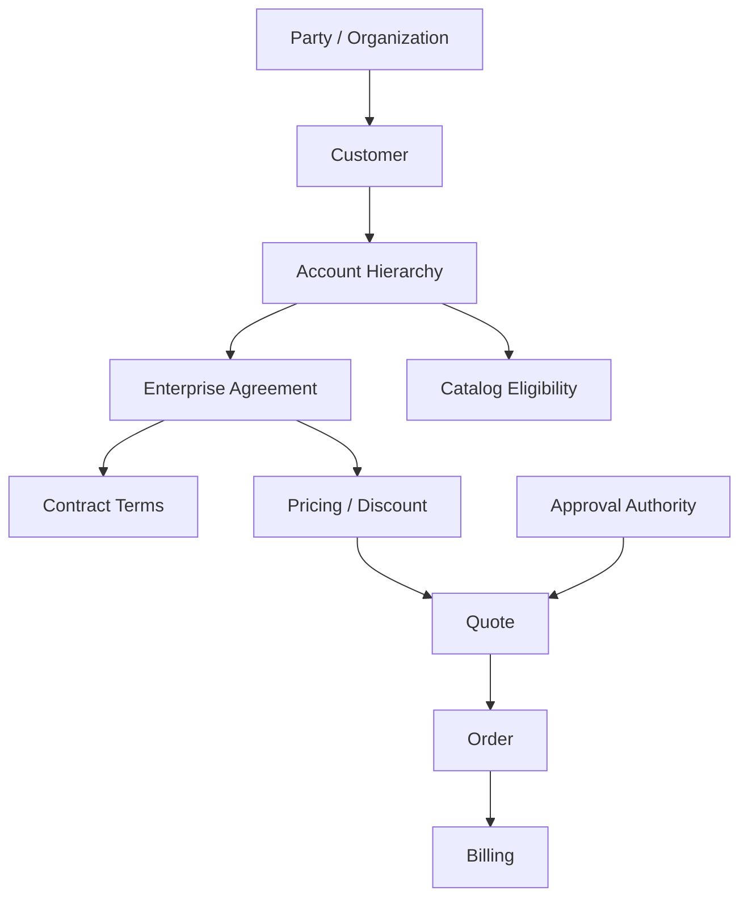
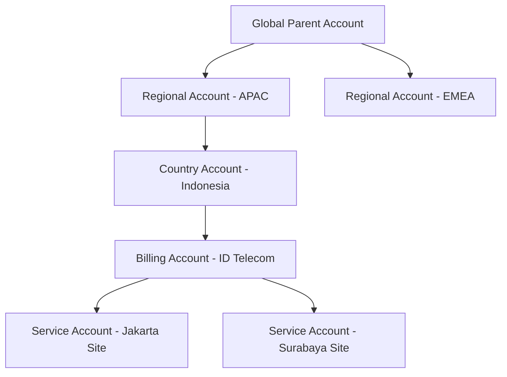
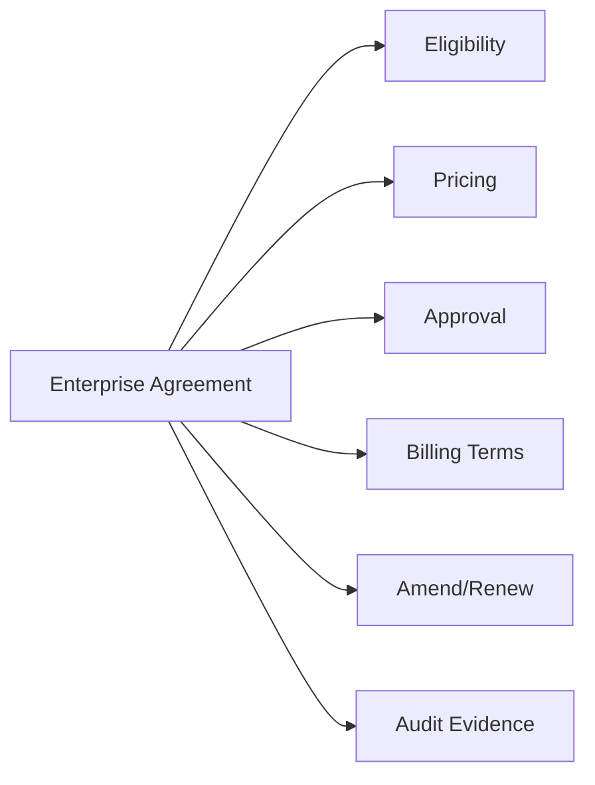
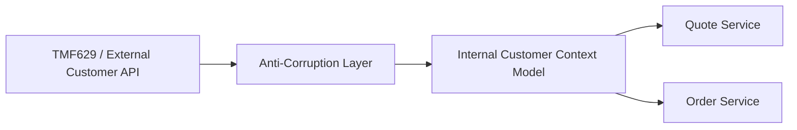

# Part 008 — Enterprise Agreement, Contract, Customer, and Account Context

## 1. Tujuan Part Ini

Part ini membahas konteks customer, account, enterprise agreement, dan contract sebagai bagian dari quote-to-cash enterprise.

Di sistem CPQ/order sederhana, customer sering terlihat seperti field biasa:

```text
customerId = "C123"
```

Di sistem enterprise/telco, customer context jauh lebih kompleks. Customer bisa punya:

- legal entity;
- billing account;
- service account;
- account hierarchy;
- parent/child organization;
- partner/reseller relationship;
- enterprise agreement;
- contract term;
- negotiated price;
- special entitlement;
- product eligibility;
- tax/billing/payment constraint;
- credit status;
- installed base;
- region/geography constraint;
- data privacy constraint.

Tujuan part ini:

- membangun mental model customer/account/agreement sebagai commercial context;
- memahami perbedaan party, customer, account, agreement, contract, entitlement, dan installed base;
- memahami bagaimana agreement memengaruhi CPQ, pricing, approval, order, billing, dan amendment;
- memahami TMF629 Customer Management sebagai referensi industri;
- memahami source-of-truth dan anti-corruption layer untuk customer data;
- memahami risiko PII, tenant isolation, dan audit;
- menyiapkan cara membaca dan mereview code yang menyentuh customer/agreement context.

Dari sumber publik, CSG Quote & Order menyebut enterprise agreements, customer-specific pricing, dan accurate billing tracking sebagai bagian dari complex selling. CSG quote-to-cash juga menekankan koneksi CPQ, order management, billing, dan revenue recognition. TM Forum TMF629 menyediakan standardized mechanism untuk customer/customer account management, termasuk create/update/retrieve/delete dan event notification. Ini adalah konteks publik/industri, bukan bukti model internal CSG.

Prinsip utama part ini:

> Customer context is not lookup data. It is commercial authority.

---

## 2. Public Facts vs Internal Facts

### 2.1 Public facts yang aman dipakai

Aman sebagai konteks:

- CSG Quote & Order secara publik menyebut support untuk enterprise agreements dan customer-specific pricing.
- CSG quote-to-cash menekankan integrasi CPQ, ordering, billing, dan revenue recognition untuk mengurangi manual handoff dan revenue leakage.
- TMF629 Customer Management API adalah referensi industri untuk customer dan customer account management.
- TMF620/TMF648/TMF622/TMF637/TMF641 relevan sebagai neighboring APIs karena customer context memengaruhi catalog eligibility, quote, product order, inventory, dan service order.

### 2.2 Hal yang wajib diverifikasi internal

Jangan mengasumsikan:

- customer master berada di Quote & Order;
- TMF629 exposed secara eksternal;
- account hierarchy disimpan locally;
- agreement model berada di database yang sama dengan quote;
- customer-specific pricing selalu berasal dari agreement;
- tenant sama dengan customer;
- billing account sama dengan customer account;
- service account sama dengan billing account;
- customer update langsung synchronous;
- PII selalu tersedia di order service;
- account hierarchy immutable selama quote lifecycle.

### 2.3 Pertanyaan pembuka saat onboarding

Untuk setiap workflow quote/order, tanyakan:

- customer ID apa yang dipakai?
- account type apa yang dipakai?
- siapa source of truth customer?
- apakah customer data replicated atau live lookup?
- apakah agreement lookup synchronous?
- apakah quote menyimpan customer snapshot?
- apakah order menyimpan account snapshot?
- apakah tenant ID sama dengan customer/account ID?
- apakah customer hierarchy bisa berubah setelah quote dibuat?
- bagaimana PII dilindungi?
- bagaimana agreement eligibility dihitung?

---

## 3. Mental Model: Commercial Context Boundary

Customer context bukan hanya “siapa pembeli”. Customer context menentukan **apakah sebuah commercial action sah**.



Dalam CPQ enterprise, quote tidak berdiri sendiri. Quote adalah proposal untuk customer/account tertentu, berdasarkan commercial authority tertentu.

Jika customer/account/agreement salah, maka hasil pricing yang secara matematis benar tetap salah secara bisnis.

---

## 4. Core Concepts

### 4.1 Party

Party adalah individu atau organisasi yang bisa berperan dalam banyak konteks.

Contoh party:

- legal organization;
- contact person;
- reseller;
- partner;
- supplier;
- enterprise customer group;
- subsidiary.

Party tidak selalu customer. Satu party bisa menjadi:

- customer;
- partner;
- bill payer;
- service recipient;
- approver;
- related party;
- account owner.

Kesalahan umum:

- menganggap party ID sama dengan customer ID;
- menyimpan contact person sebagai customer;
- mengabaikan related party dalam B2B2X scenario;
- membuat authorization berdasarkan party name, bukan stable identifier.

### 4.2 Customer

Customer adalah party yang membeli produk/layanan dari enterprise.

Customer dapat berupa:

- person;
- organization;
- service provider lain;
- reseller;
- enterprise legal entity;
- group account.

Dalam TMF629, customer management mencakup customer dan customer account management. Namun internal model bisa tidak mengikuti TMF629 secara langsung.

Pertanyaan desain:

- Apakah customer entity menyimpan PII?
- Apakah customer active/suspended/terminated?
- Apakah customer punya credit status?
- Apakah customer bisa punya banyak accounts?
- Apakah customer ID stabil lintas system?
- Apakah customer update event tersedia?

### 4.3 Account

Account adalah container bisnis/financial/operational untuk customer relationship.

Jenis account yang sering muncul:

- billing account;
- service account;
- customer account;
- parent account;
- child account;
- sold-to account;
- bill-to account;
- ship-to/service-location account.

Jangan mengasumsikan satu account cukup untuk semua workflow.

Contoh:

```text
Enterprise Customer: GlobalCorp
Parent Account: GlobalCorp Group
Billing Account: GlobalCorp Indonesia Billing
Service Account: GlobalCorp Jakarta Data Center
Sold-To Account: GlobalCorp Procurement
```

Quote bisa dibuat untuk parent account, tetapi order fulfillment mungkin butuh service account/site detail. Billing mungkin butuh billing account berbeda.

### 4.4 Agreement

Agreement adalah commercial arrangement antara enterprise dan customer/account.

Agreement bisa menentukan:

- product eligibility;
- custom price;
- discount entitlement;
- contract term;
- commitment;
- minimum spend;
- billing terms;
- renewal condition;
- special approval rule;
- allowed geography;
- partner terms;
- service-level commitment.

Agreement adalah policy overlay atas catalog/pricing.

### 4.5 Contract

Contract adalah legally binding commitment. Dalam banyak sistem, agreement dan contract dipakai bergantian, tetapi secara modeling sebaiknya dibedakan.

Possible distinction:

| Concept | Meaning |
|---|---|
| Agreement | Commercial framework/terms available for quoting |
| Contract | Accepted and legally binding commitment |
| Order | Operational execution of accepted commercial commitment |
| Subscription/Product Instance | Active realized product/service after fulfillment |

Internal terminology harus diverifikasi.

### 4.6 Entitlement

Entitlement adalah hak customer/account berdasarkan agreement atau product ownership.

Contoh:

- customer berhak membeli product family tertentu;
- customer berhak mendapat negotiated discount;
- customer berhak upgrade tanpa NRC;
- customer berhak support tier tertentu;
- customer berhak renew dengan price protection;
- customer berhak amend existing product.

Entitlement memengaruhi CPQ, pricing, order, dan support.

### 4.7 Installed Base

Installed base adalah produk/layanan yang sudah dimiliki customer.

Dalam TMF framing, ini dekat dengan product inventory. Installed base penting untuk:

- amendment;
- upgrade/downgrade;
- cross-sell;
- eligibility;
- migration;
- cancellation;
- dependency validation;
- service impact.

Quote untuk customer existing tidak bisa hanya melihat catalog. Ia juga harus melihat apa yang sudah aktif.

---

## 5. Customer vs Tenant vs Account

Ini sering membingungkan dan bisa menyebabkan bug security.

### 5.1 Customer

Customer adalah business entity yang membeli produk.

### 5.2 Tenant

Tenant adalah isolation boundary aplikasi/deployment/data.

Tenant bisa merepresentasikan:

- satu customer enterprise;
- satu CSP;
- satu business unit;
- satu deployment;
- satu logical partition dalam SaaS.

Tenant tidak selalu sama dengan customer.

### 5.3 Account

Account adalah financial/operational relationship di bawah customer atau tenant.

### 5.4 Why It Matters

Jika developer mencampur customer ID dan tenant ID, risiko:

- cross-tenant data leakage;
- wrong agreement applied;
- wrong billing account;
- wrong authorization;
- incorrect audit attribution;
- customer-specific configuration leak.

Rule:

> Tenant ID protects data boundary. Customer/account ID defines commercial context. Do not substitute one for the other without explicit mapping.

---

## 6. Account Hierarchy

Enterprise account jarang flat.



### 6.1 Why Hierarchy Matters

Account hierarchy memengaruhi:

- agreement inheritance;
- volume commitment;
- discount eligibility;
- approval authority;
- billing responsibility;
- service location;
- tax jurisdiction;
- credit exposure;
- reporting.

### 6.2 Inheritance Rules

Agreement inheritance harus eksplisit.

Pertanyaan:

- Apakah child account mewarisi parent agreement?
- Apakah inheritance bisa disabled?
- Apakah price berlaku global atau region-specific?
- Apakah volume commitment aggregated across child accounts?
- Apakah approval threshold dihitung per child atau parent?

### 6.3 Hierarchy Change

Account hierarchy bisa berubah:

- merger/acquisition;
- subsidiary restructuring;
- billing consolidation;
- customer migration;
- account correction;
- tenant restructuring.

Jika hierarchy berubah saat quote masih draft/pending approval, apa yang terjadi?

Pilihan:

- quote tetap memakai snapshot hierarchy;
- quote harus revalidate;
- quote automatically reprice;
- quote blocked until reviewed.

Tidak ada jawaban universal, tetapi harus ada policy.

---

## 7. Agreement as Policy Overlay

Agreement memengaruhi beberapa context sekaligus.



### 7.1 Agreement Eligibility

Agreement harus punya eligibility rule:

- customer/account;
- product family;
- geography;
- sales channel;
- partner;
- effective date;
- contract term;
- quantity/volume;
- existing product ownership.

### 7.2 Agreement Price

Agreement price bisa berupa:

- fixed custom price;
- discount off list;
- tiered discount;
- volume-based discount;
- negotiated bundle price;
- custom NRC waiver;
- usage rate card;
- price protection.

### 7.3 Agreement Term

Term memengaruhi:

- recurring charge duration;
- discount eligibility;
- minimum commitment;
- early termination charge;
- renewal rights;
- price lock;
- amendment policy.

### 7.4 Agreement Version

Agreement harus versioned atau setidaknya traceable.

Quote harus menjawab:

- agreement mana yang dipakai;
- version/effective date apa;
- clause/rule apa yang diterapkan;
- apakah agreement masih valid saat quote accepted;
- apakah approval berdasarkan agreement lama masih valid.

---

## 8. Customer Context in Quote-to-Cash Lifecycle

### 8.1 Configure

Customer context memengaruhi:

- product eligibility;
- allowed bundle;
- available site/location;
- existing installed base;
- customer-specific configuration;
- partner/channel constraint.

### 8.2 Price

Customer context memengaruhi:

- agreement price;
- discount entitlement;
- currency;
- tax context;
- volume tier;
- credit risk;
- margin threshold.

### 8.3 Quote

Quote harus menyimpan cukup customer context untuk:

- audit;
- approval;
- acceptance;
- conversion to order;
- dispute resolution;
- later reconstruction.

### 8.4 Approve

Approval bisa bergantung pada:

- customer segment;
- account owner;
- revenue size;
- strategic customer flag;
- risk status;
- special agreement exception.

### 8.5 Order

Order membutuhkan:

- customer reference;
- billing account;
- service account;
- contact/site information;
- product instance target;
- external customer identifier;
- fulfillment context.

### 8.6 Fulfill

Fulfillment membutuhkan lebih banyak operational context:

- service address/site;
- network resource context;
- customer technical contact;
- SLA;
- service account;
- installed base dependency.

### 8.7 Bill

Billing membutuhkan:

- bill-to account;
- billing cycle;
- payment term;
- tax context;
- charge code;
- contract term;
- recurring/non-recurring/usage rate.

---

## 9. TMF629 Customer Management as Reference Model

TMF629 menyediakan standardized mechanism untuk customer dan customer account management. Dalam onboarding, gunakan TMF629 untuk vocabulary dan integration alignment, bukan untuk mengasumsikan internal schema.

### 9.1 Useful Concepts

Concept yang berguna:

- Customer;
- Customer Account;
- Related Party;
- Contact Medium;
- Credit Profile;
- Agreement reference;
- Event notification;
- create/update/retrieve/delete semantics.

### 9.2 Practical Use

TMF629 berguna untuk:

- menyamakan vocabulary dengan external systems;
- membangun anti-corruption layer;
- mapping internal customer model ke public API;
- menghindari custom API yang terlalu proprietary;
- contract testing external integration.

### 9.3 Anti-Corruption Layer

Jika internal customer model berbeda dari TMF629, buat mapping eksplisit.



Jangan biarkan external model bocor ke semua domain service tanpa kontrol.

---

## 10. Source of Truth and Data Replication

Customer/agreement data bisa berasal dari sistem lain.

### 10.1 Source-of-Truth Map

Buat table seperti ini saat onboarding:

| Data | Source of Truth | Local Copy? | Freshness SLA | Used By |
|---|---|---|---|---|
| Customer name | TBD | TBD | TBD | Quote UI, audit |
| Account hierarchy | TBD | TBD | TBD | Pricing, approval |
| Agreement | TBD | TBD | TBD | Pricing, quote |
| Billing account | TBD | TBD | TBD | Order, billing handoff |
| Service location | TBD | TBD | TBD | Fulfillment |
| Credit status | TBD | TBD | TBD | Approval/order block |

### 10.2 Live Lookup vs Local Snapshot

| Strategy | Kelebihan | Risiko |
|---|---|---|
| Live lookup | Fresh data | Availability coupling, latency |
| Local replicated read model | Fast, resilient | Stale data, reconciliation needed |
| Snapshot on quote/order | Audit-friendly | May become outdated |
| Hybrid | Balanced | More complexity |

### 10.3 Customer Update Events

Jika customer data replicated, event handling harus jelas:

- event ordering;
- idempotency;
- duplicate handling;
- delete/anonymize behavior;
- stale update detection;
- replay safety;
- tenant scoping.

### 10.4 Snapshot Strategy

Quote/order biasanya perlu snapshot minimal.

Contoh:

```json
{
  "customerId": "cust-123",
  "customerNameAtQuoteTime": "GlobalCorp Indonesia",
  "accountId": "acct-456",
  "billingAccountId": "bill-789",
  "agreementId": "agr-001",
  "agreementVersion": "v5",
  "capturedAt": "2026-07-08T10:15:30Z"
}
```

Tetapi hati-hati dengan PII. Tidak semua data boleh disnapshot atau disimpan lama.

---

## 11. Customer-Specific Catalog and Pricing

Customer-specific behavior bisa muncul di beberapa layer:

- catalog availability;
- product eligibility;
- price list;
- discount;
- configuration option;
- quote approval;
- fulfillment route;
- billing term.

### 11.1 Healthy Customization

Customization sehat:

- explicit;
- versioned;
- testable;
- visible to support;
- documented;
- audit-friendly;
- bounded to customer/tenant/account;
- has retirement path.

### 11.2 Dangerous Customization

Customization berbahaya:

- hidden `if customerId == ...`;
- environment-specific behavior tanpa documentation;
- one-off DB patch;
- undocumented feature flag;
- manual pricing override as permanent policy;
- customization yang tidak masuk test matrix;
- customer-specific code branch tanpa ownership.

Senior engineer harus menolak “quick fix” customer-specific yang menciptakan future outage.

### 11.3 Configuration Debt

Customer-specific config bisa menjadi debt jika:

- tidak ada owner;
- tidak ada expiry;
- tidak ada validation;
- tidak ada observability;
- tidak ada tests;
- tidak ada migration plan;
- tidak ada documentation.

---

## 12. Security, PII, and Tenant Isolation

Customer/account domain membawa risiko security tinggi.

### 12.1 PII Classification

Data mungkin termasuk:

- contact name;
- email;
- phone;
- billing address;
- service address;
- tax ID;
- payment-related metadata;
- contract documents;
- legal identifiers.

Engineer harus tahu:

- data mana PII;
- boleh log atau tidak;
- boleh masuk event atau tidak;
- retention berapa lama;
- masking policy;
- access role;
- right-to-erasure/anonymization jika relevan.

### 12.2 Tenant Isolation

Every query touching customer/account must enforce tenant boundary jika sistem multi-tenant.

Contoh bahaya:

```sql
select * from customer_account where account_id = #{accountId};
```

Lebih aman:

```sql
select *
from customer_account
where tenant_id = #{tenantId}
  and account_id = #{accountId};
```

Tetapi tenant enforcement sebaiknya bukan hanya convention. Perlu framework/pattern/test.

### 12.3 Authorization

Tidak semua user yang bisa melihat quote boleh melihat semua customer/agreement data.

Pertanyaan:

- Siapa boleh melihat agreement detail?
- Siapa boleh melihat margin/cost?
- Siapa boleh memilih billing account?
- Siapa boleh override customer eligibility?
- Siapa boleh melihat PII?
- Siapa boleh export customer/quote data?

### 12.4 Audit

Audit customer/agreement action harus mencakup:

- actor;
- role;
- tenant;
- customer/account;
- old/new value;
- reason;
- approval if required;
- correlation ID;
- source system.

---

## 13. Lifecycle Changes: Amendment, Renewal, Cancellation

### 13.1 Amendment

Amendment membutuhkan installed base dan contract context.

Pertanyaan:

- Product instance mana yang diubah?
- Agreement mana yang berlaku untuk amendment?
- Apakah price protection berlaku?
- Apakah term reset?
- Apakah cancellation fee muncul?
- Apakah billing proration diperlukan?
- Apakah fulfillment perlu modify existing service?

### 13.2 Renewal

Renewal bisa:

- keep same price;
- apply uplift;
- require reprice;
- require new approval;
- update term;
- preserve entitlements;
- retire unavailable products.

### 13.3 Cancellation

Cancellation bukan delete.

Cancellation harus mempertimbangkan:

- contract term;
- early termination charge;
- service deactivation;
- billing stop date;
- product inventory update;
- customer notification;
- regulatory/legal constraints.

### 13.4 Account Move or Merge

Account move/merge bisa memengaruhi:

- agreement inheritance;
- billing account;
- ownership;
- quote draft;
- active order;
- audit continuity;
- reporting.

Policy harus jelas: apakah active quote/order mengikuti account move atau tetap pada snapshot lama.

---

## 14. Implementation-Oriented Domain Model

### 14.1 Customer Reference vs Customer Snapshot

Jangan campur reference dan snapshot.

```java
public record CustomerRef(
    String customerId,
    Optional<String> externalCustomerId
) {}

public record CustomerSnapshot(
    String customerId,
    String displayName,
    String accountId,
    Optional<String> billingAccountId,
    Optional<String> agreementId,
    Instant capturedAt
) {}
```

Reference dipakai untuk lookup. Snapshot dipakai untuk audit/historical reconstruction.

### 14.2 Account Context

```java
public record AccountContext(
    String customerId,
    String accountId,
    AccountType accountType,
    Optional<String> parentAccountId,
    List<String> inheritedAgreementIds,
    TenantId tenantId
) {}
```

### 14.3 Agreement Reference

```java
public record AgreementRef(
    String agreementId,
    String version,
    LocalDate effectiveFrom,
    Optional<LocalDate> effectiveTo
) {
    public boolean isEffectiveOn(LocalDate date) {
        return !date.isBefore(effectiveFrom)
            && effectiveTo.map(date::isAfter).map(v -> !v).orElse(true);
    }
}
```

Hati-hati: contoh di atas hanya ilustrasi. Production code harus diuji untuk boundary date dengan jelas.

### 14.4 Commercial Context Object

Quote/pricing sering membutuhkan object context eksplisit.

```java
public record CommercialContext(
    TenantId tenantId,
    CustomerRef customer,
    AccountContext account,
    Optional<AgreementRef> agreement,
    SalesChannel salesChannel,
    LocalDate effectiveDate,
    Currency currency
) {}
```

Keuntungan:

- dependency jelas;
- test lebih mudah;
- audit lebih mudah;
- context tidak tersebar di parameter method panjang;
- easier to pass across domain services.

### 14.5 Validation Layer

Customer/agreement validation harus dipisahkan dari persistence.

```text
QuoteApplicationService
  -> CommercialContextResolver
  -> CustomerEligibilityValidator
  -> AgreementEligibilityValidator
  -> PricingService
  -> ApprovalPolicyEvaluator
  -> QuoteRepository
```

Jangan taruh semua validasi customer/account dalam mapper SQL atau controller.

---

## 15. PostgreSQL and MyBatis Considerations

### 15.1 Tenant Filter Discipline

Mapper MyBatis harus konsisten memfilter tenant/account.

Contoh pattern:

```xml
<select id="findAgreementForAccount" resultMap="AgreementResultMap">
  select *
  from agreement
  where tenant_id = #{tenantId}
    and account_id = #{accountId}
    and effective_from <= #{date}
    and (effective_to is null or effective_to >= #{date})
</select>
```

Risiko:

- lupa tenant filter;
- lupa effective date;
- join account hierarchy menghasilkan duplicate agreement;
- account ID dari tenant lain diterima.

### 15.2 Agreement Versioning Schema

Contoh schema konseptual:

```text
agreement
- agreement_id
- tenant_id
- customer_id
- account_id
- current_version
- status

agreement_version
- agreement_id
- version
- effective_from
- effective_to
- terms_jsonb
- created_at
- created_by
```

Ini hanya contoh. Real schema internal harus diverifikasi.

### 15.3 Snapshot Tables

Quote/order bisa menyimpan customer/agreement snapshot.

```text
quote_commercial_snapshot
- quote_id
- quote_version
- tenant_id
- customer_id
- account_id
- billing_account_id
- agreement_id
- agreement_version
- captured_at
- snapshot_jsonb
```

Trade-off:

- terlalu sedikit snapshot membuat audit sulit;
- terlalu banyak snapshot meningkatkan PII/retention risk;
- JSONB fleksibel tetapi perlu schema governance.

### 15.4 Referential Integrity

Jika customer master external, FK langsung mungkin tidak mungkin.

Alternatif:

- external reference table;
- local customer cache;
- application-level validation;
- periodic reconciliation;
- foreign key hanya untuk local projection.

Jangan menganggap absennya FK berarti tidak perlu integrity check.

---

## 16. Kafka and Event-Driven Customer Context

Customer/agreement changes dapat memicu event:

- `CustomerCreated`;
- `CustomerUpdated`;
- `AccountHierarchyChanged`;
- `AgreementCreated`;
- `AgreementUpdated`;
- `AgreementExpired`;
- `CustomerStatusChanged`;
- `BillingAccountChanged`.

### 16.1 Event Impact on Draft Quotes

Saat agreement berubah, apa yang terjadi pada draft quote?

Pilihan:

- ignore until reprice;
- mark quote stale;
- auto-reprice;
- block acceptance;
- create notification task;
- invalidate approval.

Harus ada policy.

### 16.2 Event Idempotency

Customer update event bisa duplicate atau out of order.

Local projection harus memakai:

- event ID;
- source version;
- updated timestamp;
- aggregate version;
- tenant boundary;
- idempotent upsert.

### 16.3 Privacy in Events

Jangan masukkan PII ke event jika tidak perlu.

Event bisa membawa reference dan summary minimal:

```json
{
  "eventType": "AgreementUpdated",
  "tenantId": "tenant-1",
  "agreementId": "agr-123",
  "version": "v6",
  "affectedAccountIds": ["acct-1", "acct-2"],
  "occurredAt": "2026-07-08T10:15:30Z"
}
```

Consumer yang butuh detail bisa lookup dengan authorization yang tepat.

---

## 17. Common Failure Modes

### 17.1 Wrong Agreement Applied

Penyebab:

- account hierarchy salah;
- agreement inheritance tidak jelas;
- expired agreement;
- missing geography/channel eligibility;
- agreement selected manually tanpa validation.

Detection:

- audit quote agreement ID/version;
- eligibility test;
- anomaly: discount unusually high for account;
- reconciliation with agreement source.

### 17.2 Cross-Tenant Customer Leak

Penyebab:

- mapper missing tenant filter;
- cache key tidak include tenant;
- event consumer tidak validate tenant;
- support/admin endpoint terlalu luas.

Detection:

- negative tests cross-tenant;
- query review;
- security scanning;
- audit anomaly.

### 17.3 Stale Customer/Account Data

Penyebab:

- local cache stale;
- event lag;
- live lookup fallback gagal;
- quote long-lived;
- account move terjadi setelah approval.

Detection:

- projection lag metric;
- customer version in snapshot;
- stale quote marker;
- revalidation before acceptance.

### 17.4 Billing Account Mismatch

Penyebab:

- quote uses sold-to account;
- order expects bill-to account;
- account mapping missing;
- customer hierarchy changed;
- billing system rejects account.

Detection:

- order validation;
- billing handoff contract test;
- fallout reason dashboard.

### 17.5 PII Leakage in Logs or Events

Penyebab:

- logging full DTO;
- exception includes request body;
- event payload includes customer address;
- debug logs enabled in production;
- audit export unmasked.

Detection:

- log scanning;
- code review;
- data classification tests;
- security review.

---

## 18. Testing Strategy

### 18.1 Unit Tests

Test domain logic:

```text
shouldRejectAgreementWhenAccountNotEligible
shouldApplyParentAgreementWhenInheritanceAllowed
shouldRejectExpiredAgreementForQuoteAcceptance
shouldInvalidateApprovalWhenAgreementVersionChanges
shouldBlockCrossTenantAccountReference
shouldRequireBillingAccountForOrderConversion
```

### 18.2 Integration Tests

Test with database:

- account hierarchy lookup;
- agreement effective date;
- tenant filtering;
- customer snapshot persistence;
- MyBatis result mapping;
- duplicate agreement prevention;
- stale version conflict.

### 18.3 Contract Tests

Test integration with:

- customer master;
- CRM;
- billing account service;
- agreement service;
- TMF629-compatible API if exposed;
- quote/order APIs that include customer references.

### 18.4 Security Tests

Security tests wajib:

- user from tenant A cannot access tenant B account;
- user without permission cannot view agreement detail;
- PII fields masked in response where required;
- customer ID tampering rejected;
- admin/support endpoint audited.

### 18.5 Event Tests

Event tests:

- duplicate customer update ignored;
- out-of-order agreement update handled;
- deleted/anonymized customer projection handled;
- agreement update marks quote stale;
- event does not expose sensitive fields.

---

## 19. PR Review Checklist

Saat mereview PR yang menyentuh customer/account/agreement:

### Domain

- Apakah customer, tenant, account, billing account, dan service account dibedakan?
- Apakah agreement eligibility jelas?
- Apakah account hierarchy impact dipahami?
- Apakah quote/order snapshot behavior jelas?
- Apakah amendment/renewal/cancel impact dipertimbangkan?

### Data

- Apakah tenant filter ada di semua query?
- Apakah effective date digunakan?
- Apakah agreement version disimpan?
- Apakah PII disimpan hanya jika perlu?
- Apakah migration/backfill aman?

### API

- Apakah customer/account reference backward compatible?
- Apakah field baru expose PII?
- Apakah error model tidak membocorkan data?
- Apakah external ID vs internal ID jelas?

### Security

- Apakah authorization dicek server-side?
- Apakah cross-tenant access dicegah?
- Apakah audit lengkap?
- Apakah support/admin path aman?

### Operations

- Apakah ada metric untuk customer lookup failure?
- Apakah agreement lookup latency terlihat?
- Apakah stale projection bisa dideteksi?
- Apakah fallback behavior jelas?

---

## 20. Internal Verification Checklist

### Product/domain

- Customer/account glossary internal.
- Agreement vs contract terminology.
- Account hierarchy examples.
- Billing account/service account model.
- Enterprise agreement examples.
- Customer-specific pricing scenarios.

### Architecture

- Customer source of truth.
- Agreement source of truth.
- Account hierarchy source.
- Customer data replication model.
- Agreement integration model.
- TMF629 exposure or mapping.

### Codebase

- Customer context resolver.
- Agreement resolver.
- Account hierarchy resolver.
- Tenant enforcement utilities.
- Customer snapshot classes.
- Quote/order commercial context classes.

### Data

- Customer reference tables.
- Agreement tables/projections.
- Account hierarchy tables/projections.
- Snapshot tables.
- PII fields.
- Audit tables.

### Security

- Tenant isolation tests.
- PII classification docs.
- Masking/redaction utilities.
- Authorization rules.
- Support/admin access policy.
- Audit export process.

### Operations

- Customer service dependency dashboard.
- Agreement lookup latency metric.
- Customer projection lag metric.
- Account hierarchy update process.
- Reconciliation jobs.
- Data correction runbooks.

---

## 21. Practical Exercises

### Exercise 1 — Customer Context Trace

Ambil satu quote dari environment non-production.

Trace:

```text
Quote ID:
Tenant ID:
Customer ID:
Account ID:
Billing Account ID:
Service Account/Site:
Agreement ID/version:
Customer snapshot location:
Agreement eligibility decision:
Pricing impact:
Approval impact:
Order conversion impact:
Unknowns:
```

### Exercise 2 — Account Hierarchy Impact Review

Pilih satu account hierarchy nyata atau sample.

Jawab:

- parent account apa;
- child account apa;
- agreement diwariskan atau tidak;
- billing account mana;
- service account mana;
- volume/discount dihitung di level mana;
- apa terjadi jika hierarchy berubah.

### Exercise 3 — Cross-Tenant Threat Model

Buat threat model sederhana:

- endpoint mana menerima customer/account ID;
- query mana butuh tenant filter;
- cache key mana butuh tenant ID;
- event mana membawa customer/account data;
- test negatif apa yang sudah ada;
- gap apa yang harus ditutup.

---

## 22. Summary

Customer/account/agreement context adalah fondasi commercial correctness.

Hal terpenting:

- party, customer, account, tenant, agreement, contract, dan entitlement bukan konsep yang sama;
- agreement adalah policy overlay, bukan sekadar note;
- account hierarchy memengaruhi eligibility, pricing, approval, billing, dan fulfillment;
- quote/order butuh snapshot untuk audit, tetapi snapshot harus menjaga PII dan retention;
- source-of-truth map harus jelas;
- TMF629 berguna sebagai vocabulary dan integration reference, bukan bukti internal model;
- tenant isolation harus enforced, tested, dan reviewed;
- customer-specific behavior harus eksplisit, versioned, testable, dan supportable.

Jika part ini dipahami, Anda akan lebih siap membaca requirement enterprise yang tampak sederhana seperti “apply agreement price for this customer”, tetapi sebenarnya menyentuh identity, hierarchy, pricing, contract, security, audit, and billing.

---

## 23. References

- CSG, `CSG Quote & Order`: https://www.csgi.com/products/quote-and-order
- CSG, `Quote to Cash Software for Enterprise Deals`: https://www.csgi.com/solutions/quote-to-cash
- TM Forum, `TMF629 Customer Management API User Guide v5.0.0`: https://www.tmforum.org/resources/specifications/tmf629-customer-management-api-user-guide-v5-0-0/
- TM Forum, `TMF620 Product Catalog Management API User Guide v5.0.0`: https://www.tmforum.org/resources/specifications/tmf620-product-catalog-management-api-user-guide-v5-0-0/
- TM Forum, `TMF637 Product Inventory Management API`: https://www.tmforum.org/oda/open-apis/directory/product-inventory-management-api-TMF637/
