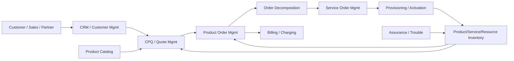
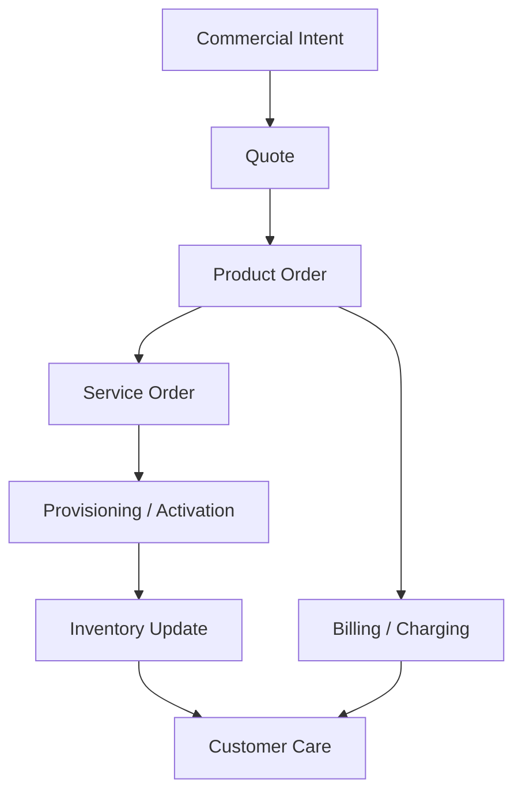
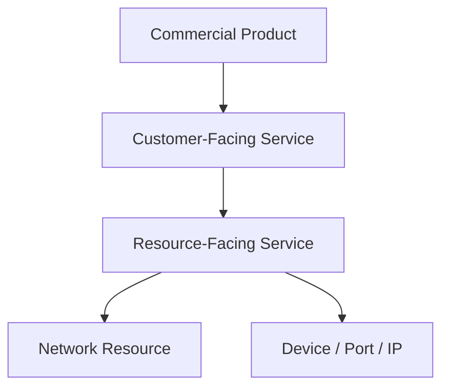
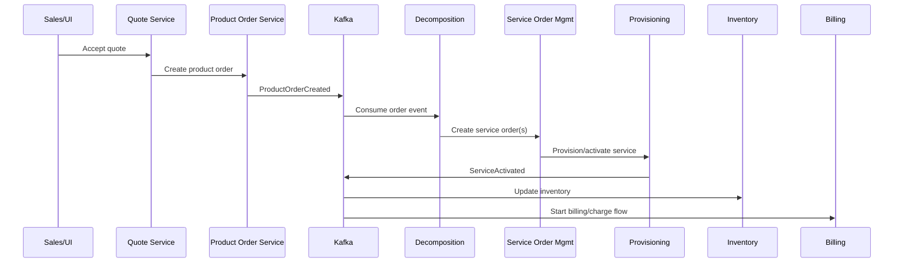

# Part 009 — Telco BSS/OSS Mental Model for Quote & Order Engineers

## 1. Tujuan Part Ini

Part ini membangun mental model **telco BSS/OSS** untuk engineer yang bekerja di area CPQ, quote management, order management, catalog-driven architecture, dan quote-to-cash.

Di luar telco, order management sering dipahami sebagai:

```text
Customer buys item -> System creates order -> Warehouse ships item -> Invoice generated
```

Di telco, terutama B2B/enterprise telco, model itu terlalu sederhana.

Sebuah quote/order bisa merepresentasikan:

- konektivitas multi-site;
- layanan fixed/mobile/cloud/connectivity;
- product bundle dengan technical service decomposition;
- customer-specific agreement;
- multi-party atau partner-involved delivery;
- network availability dan service feasibility;
- installation appointment;
- activation dan provisioning;
- billing account dan charge plan;
- amendment terhadap installed base;
- cancellation sebelum atau selama fulfillment;
- fallout manual karena downstream system gagal;
- long-running process yang berjalan berhari-hari atau berminggu-minggu.

CSG secara publik memosisikan CSG Quote & Order sebagai CPQ dan order management platform untuk B2B telecom dan complex enterprise, dengan dukungan complex selling, tailored pricing, enterprise agreements, catalog-driven tools/APIs, issue detection, standard APIs, secure cloud-native platform, dan microservices-based architecture. Itu konteks publik yang aman dipakai. Detail internal CSG tentang service boundary, downstream integration, event model, database schema, workflow engine, atau deployment topology tetap harus diverifikasi internal.

Tujuan part ini:

- memahami perbedaan BSS dan OSS tanpa terjebak definisi textbook;
- menempatkan CPQ, quote management, product ordering, service ordering, inventory, fulfillment, assurance, dan billing dalam satu peta;
- memahami kenapa quote/order engineer harus peduli dengan OSS meskipun bekerja di BSS;
- mengenali failure mode khas telco order lifecycle;
- membangun vocabulary agar diskusi dengan product, architect, delivery, support, dan customer lebih presisi;
- menyiapkan foundation untuk TM Forum ODA/SID/eTOM/Open APIs di part berikutnya.

Prinsip utama part ini:

> In telco, a product order is a commercial commitment that eventually has to become operational reality.

---

## 2. Public Facts vs Internal Facts

### 2.1 Public facts yang aman dipakai

Aman untuk memakai fakta publik berikut sebagai konteks awal:

- CSG Quote & Order diposisikan secara publik sebagai CPQ dan order management platform untuk B2B telecom, financial services, dan complex enterprises.
- Materi publik CSG menyebut complex selling, multi-line, multi-site, multi-partner deals, tailored pricing, enterprise agreements, catalog-driven tools/APIs, issue detection, interoperability dengan standard APIs, secure cloud-native platform, dan microservices-based architecture.
- TM Forum ODA memosisikan ODA sebagai blueprint untuk CSP dan supplier/SI dalam mengubah IT dan network systems, mengganti pendekatan OSS/BSS tradisional dengan pendekatan yang menyederhanakan design, modernize build, dan automate operation.
- TM Forum Open APIs merupakan suite REST APIs untuk lifecycle service end-to-end dan environment yang melibatkan banyak partner.
- TM Forum SID menyediakan information/data reference model dan vocabulary untuk CSP, sedangkan eTOM menyediakan process framework untuk business process service provider.

### 2.2 Hal yang tidak boleh diasumsikan

Jangan mengasumsikan bahwa di implementasi internal:

- ada pemisahan BSS/OSS yang sempurna secara service boundary;
- CPQ hanya berada di satu service;
- product order selalu langsung menghasilkan service order;
- inventory selalu external;
- catalog selalu satu source-of-truth global;
- semua customer memakai TM Forum API secara langsung;
- semua order fulfillment dilakukan asynchronous;
- Kafka dipakai untuk semua integration event;
- billing integration selalu downstream dari order;
- fulfillment engine adalah bagian dari Quote & Order;
- order decomposition menggunakan rule engine tertentu;
- customer-specific integration mengikuti pola yang sama.

Semua itu harus diverifikasi di codebase, dokumentasi internal, environment, PR history, diagram internal, dan diskusi tim.

### 2.3 Pertanyaan onboarding yang harus dijawab

Untuk memahami posisi Quote & Order di landscape telco internal, jawab pertanyaan ini:

```text
1. Sistem apa yang menjadi source of truth untuk catalog?
2. Sistem apa yang menjadi source of truth untuk customer/account?
3. Sistem apa yang menjadi source of truth untuk product inventory/installed base?
4. Sistem apa yang menjadi source of truth untuk product order state?
5. Sistem apa yang menjadi source of truth untuk service order state?
6. Sistem apa yang menjadi source of truth untuk billing account/charge?
7. Siapa yang melakukan order decomposition?
8. Siapa yang melakukan orchestration?
9. Siapa yang menangani fallout?
10. API/event apa yang menjadi boundary antara BSS dan OSS?
```

Jika jawaban untuk pertanyaan ini belum jelas, jangan membuat perubahan besar pada quote/order lifecycle.

---

## 3. Mental Model: BSS dan OSS Bukan Sekadar Dua Folder

Secara praktis:

- **BSS** lebih dekat ke customer-facing dan commercial-facing operations.
- **OSS** lebih dekat ke service/network/resource-facing operations.

Namun di sistem enterprise nyata, batasnya tidak selalu bersih. BSS dan OSS sering berinteraksi melalui order, service, inventory, activation, assurance, appointment, billing, dan trouble workflows.

### 3.1 BSS: commercial and customer intent

BSS biasanya mencakup area seperti:

- customer management;
- account management;
- product catalog;
- product offering;
- CPQ;
- quote management;
- product order capture;
- product order management;
- customer agreement;
- billing account;
- charging/billing;
- invoice;
- payment;
- customer care;
- revenue management.

Dari sudut pandang Quote & Order, BSS menjawab:

```text
Apa yang ingin dibeli customer?
Apakah customer eligible?
Berapa harganya?
Agreement apa yang berlaku?
Siapa yang boleh approve?
Apa yang committed secara commercial?
Apa yang harus menjadi order?
Bagaimana charge harus dibawa ke billing?
```

### 3.2 OSS: operational and technical realization

OSS biasanya mencakup area seperti:

- service catalog;
- service inventory;
- resource inventory;
- service order management;
- service design and assign;
- provisioning;
- activation;
- network configuration;
- workforce/field service;
- assurance;
- fault management;
- performance management;
- trouble ticket;
- network/service topology.

Dari sudut pandang Quote & Order, OSS menjawab:

```text
Bagaimana commercial product diwujudkan sebagai service teknis?
Apakah resource/network tersedia?
Apa dependency antar service?
Apa yang harus diprovision?
Apa status aktivasi?
Apa yang gagal?
Apakah service sudah siap ditagih?
```

### 3.3 Diagram sederhana



Diagram ini bukan arsitektur internal CSG. Ini peta mental umum untuk membaca sistem telco.

---

## 4. Quote & Order di Tengah BSS/OSS

CPQ dan order management berada di posisi yang berbahaya sekaligus strategis.

Ia menerima intensi bisnis dari sisi sales/customer, lalu harus menghasilkan commitment yang executable oleh downstream systems.



Kesalahan di quote/order bisa menyebar ke seluruh landscape:

- price salah -> billing dispute;
- product configuration salah -> fulfillment gagal;
- customer account salah -> invoice salah;
- inventory stale -> amendment salah;
- order decomposition salah -> provisioning salah;
- cancellation tidak konsisten -> customer tetap ditagih;
- duplicate event -> duplicate activation atau duplicate charge;
- missing audit -> sulit membela keputusan approval;
- cross-tenant leakage -> security incident.

Karena itu Quote & Order engineer harus memiliki pandangan lintas BSS/OSS, bukan hanya melihat endpoint dan table lokal.

---

## 5. BSS/OSS Layer Map untuk Quote-to-Cash

Berikut peta high-level dari quote-to-cash di telco enterprise.

| Stage | Primary Concern | Typical Layer | Engineering Risk |
|---|---|---|---|
| Product definition | Apa yang bisa dijual | BSS catalog | Catalog drift, incompatible offering |
| Eligibility/qualification | Siapa boleh membeli apa | BSS + OSS dependency | Network/resource availability stale |
| Configure | Product combination valid | CPQ/BSS | Invalid bundle, missing mandatory characteristic |
| Price | Commercial value | CPQ/BSS | Wrong discount, stale agreement, margin leakage |
| Quote | Commercial proposal | BSS | Versioning, expiry, approval bypass |
| Accept | Customer commitment | BSS | Stale price acceptance, wrong actor |
| Product order | Commercial order | BSS/order | Duplicate submit, invalid state transition |
| Decomposition | Product to service/resource work | BSS/OSS bridge | Wrong mapping, unhandled dependency |
| Fulfillment | Technical execution | OSS | Partial failure, timeout, manual fallout |
| Inventory update | Installed reality | BSS/OSS | Inventory not updated, stale installed base |
| Billing handoff | Charge execution | BSS/billing | Charge mismatch, duplicate billing |
| Assurance/care | Support lifecycle | BSS/OSS | No trace from complaint to order/service |

Kunci mental model:

> Quote-to-cash is not a pipeline of screens. It is a chain of commitments across commercial, operational, and financial systems.

---

## 6. Product, Service, Resource: Tiga Level yang Sering Tercampur

Salah satu kesalahan umum engineer baru di telco adalah mencampur **product**, **service**, dan **resource**.

### 6.1 Product

Product adalah sesuatu yang dibeli customer secara commercial.

Contoh konseptual:

- Business Internet 1 Gbps;
- Managed Router;
- SD-WAN Package;
- Mobile Corporate Plan;
- Cloud Connectivity;
- Security Add-on;
- Installation Fee;
- Static IP Add-on.

Product menjawab:

```text
Apa yang dijual?
Bagaimana customer memahami value-nya?
Bagaimana ia dipricing?
Agreement apa yang berlaku?
Bagaimana ia muncul di quote/invoice?
```

### 6.2 Service

Service adalah realisasi teknis/logis dari product.

Contoh konseptual:

- internet access service;
- VPN service;
- router management service;
- authentication service;
- connectivity service;
- monitoring service.

Service menjawab:

```text
Apa kemampuan teknis yang harus diaktifkan?
Apa lifecycle teknisnya?
Apa dependency antar service?
Service mana yang harus ada sebelum service lain?
```

### 6.3 Resource

Resource adalah asset fisik/logis yang digunakan untuk menyediakan service.

Contoh konseptual:

- port;
- circuit;
- router;
- SIM;
- IP address;
- VLAN;
- network element;
- capacity pool;
- site equipment.

Resource menjawab:

```text
Apa resource yang dikonsumsi?
Apakah tersedia?
Bagaimana dialokasikan?
Bagaimana dilepas saat cancel/terminate?
```

### 6.4 Mapping sederhana



Dalam sistem nyata, mapping ini bisa satu-ke-satu, satu-ke-banyak, banyak-ke-satu, atau conditional berdasarkan catalog rule, location, customer agreement, atau existing installed base.

---

## 7. Catalog dalam Landscape Telco

Catalog sering menjadi titik pertemuan BSS dan OSS.

Ada beberapa jenis catalog yang perlu dibedakan:

| Catalog Type | Purpose | Main Consumer |
|---|---|---|
| Product Catalog | Apa yang dijual | CPQ, sales, quote, order |
| Product Offering Catalog | Package/offer yang bisa dipilih customer | CPQ/UI/API |
| Pricing Catalog | Charge/price/discount model | CPQ/pricing |
| Service Catalog | Service teknis/logis yang harus dibuat | SOM/fulfillment |
| Resource Catalog | Resource capability dan technical template | OSS/provisioning |
| Commercial Policy Catalog | Eligibility, approval, agreement constraint | CPQ/governance |

Catalog-driven architecture tidak berarti semua logic disimpan di satu catalog. Maksud yang lebih sehat:

- behavior runtime dikendalikan oleh versioned definitions;
- product launch tidak selalu butuh code change;
- quote/order dapat menyimpan snapshot catalog version;
- downstream dapat memahami product/service mapping;
- impact dari perubahan catalog dapat dianalisis.

### 7.1 Failure mode catalog-driven di telco

Catalog-driven architecture gagal jika:

- catalog terlalu ekspresif sampai menjadi programming language tanpa testing;
- catalog publish tidak punya validation gate;
- quote memakai live catalog tanpa snapshot;
- order decomposition memakai catalog version berbeda dari quote;
- catalog cache stale tetapi tidak terdeteksi;
- customer-specific catalog override tidak terdokumentasi;
- service mapping berubah dan merusak fulfillment untuk in-flight order;
- catalog model terlalu generik sehingga semua rule masuk custom code.

---

## 8. Product Order vs Service Order

Dalam telco, product order dan service order sebaiknya dibedakan.

### 8.1 Product order

Product order adalah order atas product yang dibeli customer.

Ia membawa:

- customer/account context;
- product offering references;
- order item actions;
- commercial attributes;
- price/charge references atau snapshots;
- requested dates;
- relationship antar product items;
- status lifecycle;
- correlation ke quote.

Product order menjawab:

```text
Customer membeli/mengubah/membatalkan product apa?
```

### 8.2 Service order

Service order adalah order untuk mewujudkan service teknis yang mendukung product.

Ia membawa:

- service specification;
- service characteristics;
- service order item actions;
- dependency;
- resource/service references;
- provisioning/activation instructions;
- fulfillment state.

Service order menjawab:

```text
Service teknis apa yang harus dibuat/diubah/dihentikan?
```

### 8.3 Why this matters

Jika product order dan service order dicampur:

- commercial lifecycle dan technical lifecycle menjadi sulit dibedakan;
- quote/order UI bisa terpapar detail OSS;
- cancellation semantics menjadi kacau;
- product order completion criteria menjadi tidak jelas;
- billing bisa dimulai sebelum service benar-benar aktif;
- service fallout sulit dikembalikan ke customer-facing order state.

Namun pemisahan ini juga memiliki trade-off:

- butuh mapping/decomposition layer;
- butuh correlation ID kuat;
- butuh reconciliation antar state;
- butuh observability lintas service;
- butuh ownership boundary yang jelas.

---

## 9. Installed Base, Product Inventory, dan Amendment

Banyak order telco bukan pembelian baru. Banyak order adalah perubahan atas sesuatu yang sudah aktif.

Contoh:

- add service;
- upgrade bandwidth;
- downgrade plan;
- change site;
- move service;
- suspend;
- resume;
- terminate;
- replace device;
- add static IP;
- change billing account;
- renew contract.

Untuk itu CPQ/order perlu memahami **installed base** atau **product inventory**.

### 9.1 Product inventory bukan catalog

Catalog menjawab:

```text
Apa yang mungkin dijual?
```

Product inventory menjawab:

```text
Apa yang sudah dimiliki/digunakan customer?
```

Jika quote amendment tidak membaca installed base dengan benar, sistem bisa:

- menjual add-on untuk product yang tidak aktif;
- menghapus service dependency yang masih dipakai;
- menghitung price delta salah;
- mengirim modify action padahal harus add;
- mengirim terminate action pada item yang salah;
- membuat duplicate product instance.

### 9.2 Snapshot vs live inventory

Saat quote dibuat, inventory bisa berubah sebelum quote diterima.

Trade-off:

| Strategy | Benefit | Risk |
|---|---|---|
| Live inventory at submit | Lebih fresh | Quote berubah saat conversion |
| Snapshot inventory at quote time | Auditable | Bisa stale saat accept/order |
| Revalidate before order | Balance | Butuh conflict handling |
| Lock inventory | Stronger consistency | Mahal dan sulit untuk long-running quote |

Dalam telco enterprise, biasanya perlu kombinasi snapshot + revalidation + conflict resolution.

---

## 10. Fulfillment dan Fallout

Fulfillment telco jarang hanya satu API call.

Ia bisa melibatkan:

- service feasibility;
- resource reservation;
- appointment scheduling;
- provisioning;
- activation;
- device shipment;
- field technician;
- partner dependency;
- manual approval;
- network change window;
- billing activation trigger.

### 10.1 Fallout

**Fallout** adalah kondisi ketika order tidak bisa diproses otomatis dan membutuhkan handling khusus.

Contoh fallout:

- product configuration tidak bisa didecompose;
- resource tidak tersedia;
- downstream adapter timeout;
- customer address tidak valid;
- service activation gagal;
- partner API reject;
- manual data correction dibutuhkan;
- order item dependency conflict;
- duplicate external order ID;
- billing account tidak ditemukan.

### 10.2 Engineer mindset untuk fallout

Fallout bukan sekadar error state. Fallout adalah operational workflow.

Pertanyaan yang harus dijawab:

```text
Siapa yang melihat fallout?
Apa actionable reason-nya?
Apa data yang dibutuhkan untuk memperbaiki?
Apakah bisa retry?
Apakah retry idempotent?
Apakah bisa resume dari checkpoint?
Apakah customer perlu diberi notifikasi?
Apakah billing harus ditahan?
Apakah audit trail lengkap?
```

Jika sistem hanya menyimpan `FAILED`, maka sistem belum siap untuk production order management.

---

## 11. Billing Handoff dan Revenue Integrity

Quote/order tidak selesai saat order status menjadi completed. Dalam quote-to-cash, commercial commitment harus menjadi charge yang benar.

Billing handoff harus menjawab:

- charge apa yang harus dibuat;
- kapan charge mulai berlaku;
- charge recurring atau one-time;
- currency apa;
- tax treatment apa;
- billing account mana;
- customer account mana;
- product instance mana;
- agreement/contract term apa;
- apakah charge harus prorated;
- apakah activation trigger sudah terjadi;
- apakah cancellation menghasilkan credit/refund;
- apakah amendment menghasilkan delta charge.

### 11.1 Common billing failure modes

- quote price berbeda dari billing charge;
- discount tidak terbawa;
- charge start date salah;
- duplicate charge karena duplicate event;
- cancelled order tetap ditagih;
- fulfilled product tidak ditagih;
- wrong billing account;
- agreement term tidak terbawa;
- manual override tidak terekam;
- tax/currency handling tidak konsisten.

### 11.2 Design implication

Order system harus memiliki traceability:

```text
Quote price -> Order item charge -> Fulfillment activation -> Billing charge -> Invoice line
```

Tanpa traceability, dispute dan audit menjadi sulit.

---

## 12. Assurance, Customer Care, dan Closed Loop

Setelah service aktif, customer care dan assurance perlu memahami konteks order.

Contoh pertanyaan support:

```text
Mengapa service belum aktif?
Order item mana yang gagal?
Apa downstream task yang stuck?
Apakah appointment belum selesai?
Apakah billing sudah dimulai?
Apa quote/agreement yang menjadi dasar order ini?
Siapa yang approve discount?
Apakah ada known incident?
```

Jika order traceability lemah, customer care akan membuat workaround manual. Workaround manual kemudian menciptakan data inconsistency baru.

Good order management harus memungkinkan:

- trace dari customer complaint ke order item;
- trace dari order item ke service order;
- trace dari service order ke provisioning task;
- trace dari fulfillment result ke product inventory;
- trace dari product inventory ke billing charge;
- trace dari charge ke invoice;
- trace dari quote approval ke final commercial commitment.

---

## 13. Event-Driven View of BSS/OSS

BSS/OSS telco modern sering menggunakan event-driven integration, tetapi event-driven tidak otomatis berarti loosely coupled.

### 13.1 Event categories

| Event Category | Example | Consumer Risk |
|---|---|---|
| Business lifecycle event | `QuoteAccepted`, `ProductOrderCompleted` | Consumer menganggap terlalu banyak detail |
| Integration event | `BillingChargeRequested` | Duplicate side effect |
| State change event | `OrderStatusChanged` | Missing transition semantics |
| Audit event | `DiscountApproved` | Tidak boleh hilang |
| Projection event | `CustomerSnapshotUpdated` | Staleness |
| Technical event | `AdapterTimeout` | Noise jika tidak actionable |

### 13.2 BSS/OSS event trace



Critical questions:

- Apa partition key event?
- Apa correlation ID dan causation ID?
- Apa aggregate ID?
- Apakah event immutable?
- Apakah event membawa snapshot atau reference?
- Apakah consumer replay-safe?
- Apakah duplicate event aman?
- Apakah event order penting?
- Apa retention policy?
- Apa DLQ strategy?

---

## 14. Where Quote & Order Bugs Become Production Incidents

Berikut failure mode khas yang harus dikenali sejak awal.

### 14.1 Commercial-to-operational mismatch

Quote menjual kombinasi product yang terlihat valid secara commercial, tetapi tidak bisa diwujudkan secara technical.

Root cause umum:

- eligibility tidak memeriksa feasibility;
- catalog product-service mapping salah;
- inventory stale;
- service dependency tidak dimodelkan;
- customer site data incomplete.

### 14.2 State divergence

Product order state dan service order state tidak sinkron.

Contoh:

```text
Product order: IN_PROGRESS
Service order: FAILED
Provisioning task: COMPLETED
Inventory: not updated
Billing: started
```

Ini bukan sekadar bug UI. Ini data inconsistency lintas lifecycle.

### 14.3 Duplicate side effect

Retry event/order menyebabkan duplicate external call.

Contoh:

- duplicate service order;
- duplicate provisioning request;
- duplicate charge;
- duplicate shipment;
- duplicate notification;
- duplicate customer commitment.

### 14.4 Hidden manual correction

Support melakukan correction di downstream system, tetapi Quote & Order tidak tahu.

Akibat:

- order stuck;
- inventory berbeda;
- audit tidak lengkap;
- next amendment salah;
- billing mismatch.

### 14.5 Long-running lifecycle ambiguity

Order berjalan lama, tetapi system tidak punya konsep checkpoint dan timeout yang jelas.

Akibat:

- retry tidak aman;
- cancel tidak jelas;
- customer status misleading;
- operator tidak tahu action berikutnya.

---

## 15. BSS/OSS Boundary Design Principles

### 15.1 Define source of truth per entity

Jangan desain berdasarkan “service mana yang paling mudah dipanggil”. Desain berdasarkan source of truth.

```text
Customer/account -> ?
Catalog -> ?
Quote -> ?
Product order -> ?
Service order -> ?
Product inventory -> ?
Billing charge -> ?
Audit -> ?
```

Setiap entity harus punya owner.

### 15.2 Use anti-corruption layer for external models

Jika downstream OSS memakai model berbeda, jangan bocorkan semua detailnya ke quote/order domain.

Gunakan boundary seperti:

```text
Internal ProductOrder -> DecompositionPlan -> ExternalServiceOrderRequest
```

Bukan:

```text
QuoteItem langsung berisi semua field provisioning vendor
```

### 15.3 Treat integration as product behavior

Integration bukan plumbing. Dalam telco, integration menentukan business outcome.

Adapter harus memiliki:

- contract;
- retry policy;
- idempotency;
- timeout;
- observability;
- error taxonomy;
- reconciliation;
- ownership.

### 15.4 Model lifecycle explicitly

Jangan bergantung pada boolean seperti:

```text
isSubmitted
isProcessed
isCompleted
isCancelled
```

Gunakan state machine dan transition guard.

### 15.5 Persist enough evidence

Untuk setiap order, sistem harus bisa menjawab:

```text
Kenapa order dibuat?
Quote mana sumbernya?
Catalog version mana?
Agreement mana?
Price apa?
Siapa approve?
Event apa yang dikirim?
Downstream apa yang dipanggil?
Apa hasilnya?
Apa yang gagal?
Apa yang diperbaiki manual?
```

---

## 16. Readiness Questions for a Quote & Order Engineer

Sebelum mengubah logic quote/order di telco system, tanyakan:

### Domain questions

- Apakah ini product-level, service-level, atau resource-level change?
- Apakah ini memengaruhi new order, amend order, cancel order, atau all?
- Apakah ini memengaruhi installed base?
- Apakah ini memengaruhi billing?
- Apakah ini memengaruhi customer agreement?

### Architecture questions

- Service mana owner entity ini?
- Apakah perubahan ini synchronous atau asynchronous?
- Apakah membutuhkan event baru?
- Apakah event lama tetap compatible?
- Apakah downstream consumer terdampak?
- Apakah perlu reconciliation?

### Production questions

- Bagaimana mendeteksi jika ini gagal?
- Bagaimana retry dilakukan?
- Apakah retry idempotent?
- Bagaimana cancel saat proses berjalan?
- Bagaimana operator memperbaiki fallout?
- Apakah audit lengkap?
- Apakah rollback aman?

---

## 17. Internal Verification Checklist

Gunakan checklist ini saat onboarding ke area BSS/OSS internal.

### 17.1 System map

- Daftar service/module di Quote & Order.
- Daftar external systems.
- Diagram BSS/OSS integration.
- Ownership tiap service.
- Deployment topology.
- Customer-specific integration variants.

### 17.2 Entity ownership

- Source of truth untuk customer.
- Source of truth untuk account.
- Source of truth untuk catalog.
- Source of truth untuk quote.
- Source of truth untuk product order.
- Source of truth untuk service order.
- Source of truth untuk product inventory.
- Source of truth untuk billing charge.

### 17.3 Lifecycle map

- Quote lifecycle.
- Product order lifecycle.
- Order item lifecycle.
- Service order lifecycle.
- Fulfillment task lifecycle.
- Fallout lifecycle.
- Cancellation lifecycle.
- Amendment lifecycle.

### 17.4 Integration map

- API integrations.
- Kafka topics.
- Batch/file integrations.
- Partner integrations.
- Retry/DLQ policy.
- Reconciliation jobs.
- Adapter ownership.

### 17.5 Operational map

- Dashboards.
- Alerts.
- Runbooks.
- On-call ownership.
- Incident history.
- Data repair process.
- Known bottlenecks.
- Known customer pain points.

---

## 18. PR Review Checklist untuk BSS/OSS-Related Changes

Saat mereview PR di area Quote & Order, gunakan pertanyaan ini:

### Domain correctness

- Apakah perubahan ini jelas berada di product, service, atau resource layer?
- Apakah quote/order invariant tetap terjaga?
- Apakah installed base diperhitungkan?
- Apakah amendment/cancel/retry terdampak?
- Apakah billing handoff tetap benar?

### Integration correctness

- Apakah external contract berubah?
- Apakah event contract berubah?
- Apakah consumer lama tetap aman?
- Apakah duplicate event/request aman?
- Apakah timeout/retry policy eksplisit?
- Apakah error downstream dipetakan ke business state yang benar?

### Operational readiness

- Apakah ada log dengan correlation ID?
- Apakah metric cukup untuk mendeteksi failure?
- Apakah alert dibutuhkan?
- Apakah runbook perlu update?
- Apakah data repair/reconciliation dibutuhkan?

### Security and audit

- Apakah tenant/customer boundary aman?
- Apakah permission check tepat?
- Apakah audit event lengkap?
- Apakah PII tidak bocor ke log/event?

---

## 19. Common Anti-Patterns

### 19.1 Treating OSS as just a downstream API

OSS sering memiliki lifecycle sendiri. Jika dianggap sekadar endpoint, sistem akan gagal saat downstream asynchronous, partial, atau manual.

### 19.2 Product order as a bag of fields

Order harus memiliki lifecycle dan invariant. Jika hanya menjadi payload carrier, correctness pindah ke tempat lain secara tidak terlihat.

### 19.3 Ignoring installed base

Banyak requirement enterprise terkait perubahan existing service. Tanpa installed base, amendment akan rapuh.

### 19.4 Using status strings without transition semantics

Status tanpa transition guard menyebabkan illegal state dan sulit debug.

### 19.5 Hiding integration failure as generic technical error

Downstream failure harus diklasifikasi: retryable, non-retryable, manual fallout, validation failure, duplicate, timeout, partial success.

### 19.6 No reconciliation loop

Dalam distributed BSS/OSS, inconsistency pasti terjadi. Sistem yang tidak punya reconciliation hanya menunggu incident.

---

## 20. Practical Exercises

### Exercise 1 — BSS/OSS Trace untuk Satu Order

Ambil satu order dari environment non-production.

Isi template:

```text
Order ID:
Quote ID:
Customer/account:
Product offering(s):
Catalog version:
Product order state:
Order item states:
Service order reference:
Fulfillment reference:
Inventory reference:
Billing reference:
Kafka events:
External API calls:
Fallout/manual task:
Correlation ID:
Unknowns:
```

Target: Anda bisa menjelaskan order tersebut dari customer intent sampai operational execution.

### Exercise 2 — Product/Service/Resource Mapping

Pilih satu product offering.

Jawab:

```text
Product name:
Commercial characteristics:
Required services:
Required resources:
Eligibility rules:
Pricing rules:
Service decomposition rules:
Billing charges:
Inventory impact:
Amend/cancel behavior:
```

Target: Anda tidak lagi melihat product hanya sebagai row catalog.

### Exercise 3 — Failure Scenario Review

Ambil satu skenario:

```text
Customer accepts quote for multi-site connectivity.
Product order created successfully.
One site fails provisioning because resource is unavailable.
Another site is activated.
Billing event is emitted for the entire order.
```

Jawab:

- Apa state product order?
- Apa state order item per site?
- Apakah billing boleh dimulai?
- Apakah customer perlu notified?
- Apakah retry aman?
- Apakah cancel partial boleh?
- Apakah inventory harus update partial?
- Apa audit evidence yang dibutuhkan?

---

## 21. Summary

BSS/OSS mental model membantu Quote & Order engineer memahami bahwa CPQ/order management bukan hanya aplikasi sales workflow.

Hal terpenting:

- BSS berfokus pada commercial/customer intent; OSS berfokus pada operational/technical realization;
- product, service, dan resource harus dibedakan;
- product order tidak sama dengan service order;
- installed base penting untuk amendment;
- catalog-driven architecture adalah control plane, tetapi hanya aman jika versioned, validated, dan observable;
- fulfillment failure harus menjadi workflow, bukan hanya error;
- billing handoff membutuhkan traceability dari quote sampai invoice;
- event-driven architecture harus memperhatikan idempotency, ordering, replay, schema evolution, dan causation;
- source-of-truth map adalah alat onboarding paling penting;
- detail internal CSG harus diverifikasi, bukan diasumsikan dari istilah umum.

Jika part ini dipahami, Anda akan lebih siap masuk ke TM Forum ODA/SID/eTOM/Open APIs dengan sikap yang tepat: standard sebagai alat reasoning dan integration alignment, bukan kebenaran absolut yang menggantikan observasi sistem nyata.

---

## 22. References

- CSG, `CSG Quote & Order`: https://www.csgi.com/products/quote-and-order
- CSG, `Quote to Cash Software for Enterprise Deals`: https://www.csgi.com/solutions/quote-to-cash
- TM Forum, `Open Digital Architecture (ODA)`: https://www.tmforum.org/open-digital-architecture/
- TM Forum, `Open APIs`: https://www.tmforum.org/open-digital-architecture/implementation/open-apis/
- TM Forum, `Information Framework (SID)`: https://www.tmforum.org/open-digital-architecture/information-framework-sid/
- TM Forum, `Process Framework (eTOM)`: https://www.tmforum.org/open-digital-architecture/process-framework-etom/
