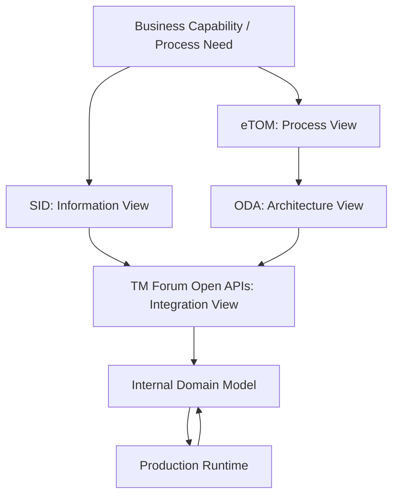
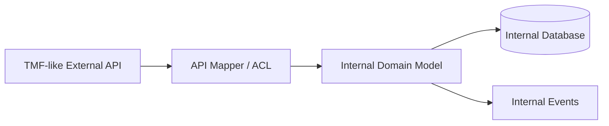
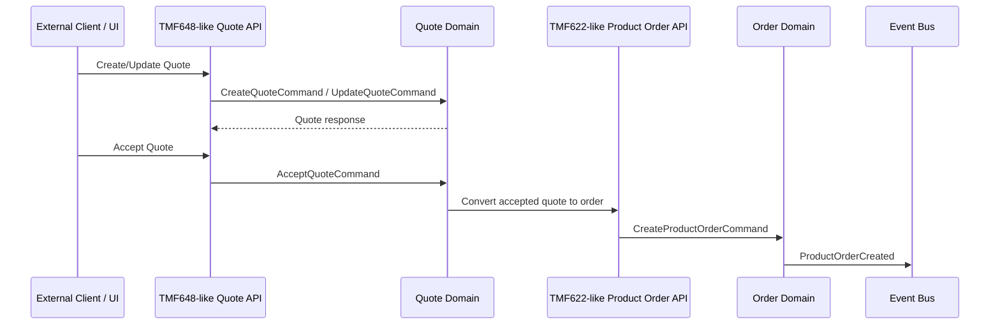
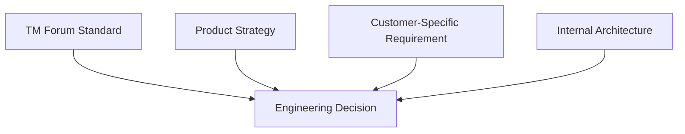

# Part 010 — TM Forum ODA, SID, and eTOM: How to Use Standards Without Worshipping Them

## 1. Tujuan Part Ini

Part ini membahas TM Forum ODA, SID, eTOM, dan Open APIs dari sudut pandang engineer yang harus membangun, membaca, mereview, dan mengoperasikan sistem CPQ/order enterprise nyata.

Tujuan part ini bukan membuat Anda menghafal standard. Tujuannya adalah membuat Anda bisa memakai standard sebagai:

- vocabulary bersama untuk berdiskusi dengan telco customer, architect, product, delivery, dan partner;
- reference model untuk memahami entity, process, dan integration boundary;
- contract alignment tool untuk API dan event design;
- governance tool untuk menghindari model internal yang kacau;
- comparison framework untuk membaca gap antara ideal standard dan real implementation;
- cara membuat architecture decision lebih defensible.

Namun ada prinsip penting:

> Standards are maps. Production systems are terrain.

Peta membantu navigasi. Tetapi jika peta dan terrain berbeda, terrain yang menang. Engineer senior harus bisa menggunakan TM Forum sebagai alat reasoning tanpa mengarang bahwa sistem internal pasti mengikuti TM Forum secara penuh.

TM Forum secara publik menjelaskan ODA sebagai blueprint untuk CSP dan supplier/SI dalam mengubah IT dan network systems, mengganti pendekatan OSS/BSS tradisional dengan pendekatan yang menyederhanakan design, modernize build, dan automate operation. TM Forum juga menjelaskan Open APIs sebagai suite REST APIs untuk lifecycle management end-to-end dan multi-partner service delivery. TM Forum SID menyediakan information/data reference model dan common vocabulary untuk CSP. TM Forum eTOM membantu organisasi memahami, mendesain, mengembangkan, dan mengelola IT/network applications berdasarkan business process requirements.

Semua itu adalah konteks industri. Apakah CSG Quote & Order memakai shape TMF tertentu secara internal, eksternal, sebagian, atau melalui anti-corruption layer adalah hal yang harus diverifikasi internal.

---

## 2. The Problem TM Forum Tries to Solve

Telco enterprise landscape biasanya memiliki masalah klasik:

- terlalu banyak sistem;
- model data berbeda-beda;
- process boundary tidak jelas;
- integration point berkembang organik;
- customer/order/service/resource terminology tidak konsisten;
- product launch lambat karena perubahan menyentuh banyak sistem;
- OSS/BSS modernization sulit karena legacy dependency;
- partner integration mahal;
- vendor system punya model sendiri;
- reporting dan reconciliation sulit;
- transformation program gagal karena tidak ada shared vocabulary.

TM Forum frameworks mencoba memberi struktur:

| Framework | Pertanyaan yang dijawab | Bentuk bantuan |
|---|---|---|
| ODA | Bagaimana menyusun digital telco architecture? | Blueprint architecture, component thinking, governance |
| SID | Apa entity/information yang penting? | Information/data model dan vocabulary |
| eTOM | Proses bisnis apa yang terjadi? | Business process framework |
| Open APIs | Bagaimana sistem berintegrasi? | REST API specifications dan resource models |

Jika disederhanakan:

```text
ODA  -> architecture view
SID  -> information view
ETOM -> process view
Open APIs -> integration contract view
```

Keempatnya saling melengkapi, tetapi tidak menggantikan desain internal yang harus mempertimbangkan runtime, backward compatibility, customer-specific extension, performance, security, operations, dan existing codebase.

---

## 3. Mental Model: ODA, SID, eTOM, Open APIs



Cara membacanya:

- eTOM membantu menjelaskan proses bisnis;
- SID membantu menjelaskan entity dan relasi informasi;
- ODA membantu menjelaskan architecture/component direction;
- Open APIs membantu menjelaskan external contract;
- internal domain model menerjemahkan standard ke implementation yang benar-benar bisa dijalankan;
- production runtime memberikan feedback apakah desain itu sehat.

---

## 4. ODA: Architecture Blueprint, Not Magic Architecture

### 4.1 Apa itu ODA secara praktis

Secara praktis, ODA membantu CSP dan supplier/SI berpikir tentang:

- modular architecture;
- separation of concerns;
- standardized components;
- standardized APIs;
- business architecture;
- information systems;
- deployment and runtime;
- implementation;
- governance;
- migration dari traditional OSS/BSS.

Untuk Quote & Order engineer, ODA berguna karena memberi bahasa untuk berdiskusi tentang:

- component boundary;
- API-first integration;
- catalog/order/customer/inventory placement;
- modernization path;
- separation antara business capability dan technical implementation;
- governance atas interface dan lifecycle.

### 4.2 Cara sehat menggunakan ODA

Gunakan ODA untuk bertanya:

```text
Capability apa yang sedang kita ubah?
Komponen mana yang seharusnya memiliki capability ini?
Apakah boundary internal kita mencerminkan capability atau historical accident?
Apakah API kita reusable dan discoverable?
Apakah kita membuat coupling baru yang bertentangan dengan modularity?
Apakah deployment/runtime mendukung ownership boundary?
```

### 4.3 Cara salah menggunakan ODA

Anti-pattern:

```text
TM Forum bilang ada component X, maka kita harus punya service X dengan nama sama.
```

Masalahnya:

- standard component tidak selalu sama dengan microservice boundary;
- internal legacy constraint bisa membuat direct mapping berbahaya;
- customer deployment bisa berbeda;
- performance dan transaction boundary bisa membutuhkan grouping berbeda;
- team ownership bisa tidak mengikuti standard map;
- product evolution bisa lebih cepat dari standard adoption.

### 4.4 ODA as review lens

Dalam architecture review, ODA bisa dipakai sebagai lensa:

| Review Question | Why It Matters |
|---|---|
| Capability apa yang dimiliki perubahan ini? | Menghindari logic ditempatkan sembarang |
| Apakah component boundary jelas? | Mengurangi distributed monolith behavior |
| Apakah API external mengikuti standard/consistent style? | Mengurangi integration cost |
| Apakah internal model terlalu bocor ke external API? | Menjaga evolvability |
| Apakah deployment/runtime mendukung isolation? | Mengurangi blast radius |
| Apakah governance lifecycle jelas? | Mengurangi uncontrolled API/model drift |

---

## 5. SID: Information Model and Vocabulary

### 5.1 Apa itu SID secara praktis

TM Forum menjelaskan SID sebagai information/data reference model dan common vocabulary untuk CSP. SID membantu mengidentifikasi business entities penting dan menyediakan foundation untuk common data model, common data dictionary, function, application, component, dan API development.

Dalam praktik engineering, SID berguna untuk menjawab:

```text
Apa perbedaan Party, Customer, Account, Product, Service, Resource, Agreement?
Entity mana yang seharusnya memiliki relationship?
Apakah kita memakai istilah yang sama dengan customer/partner/telco architect?
Apakah API kita memakai vocabulary yang bisa dipahami telco ecosystem?
```

### 5.2 SID domains yang relevan

TM Forum menyebut SID domains seperti Market & Sales, Customer, Product, Service, Resource, Business Partner, Enterprise, dan Common.

Untuk Quote & Order, domain yang paling sering muncul:

| SID Domain | Relevance to Quote & Order |
|---|---|
| Market & Sales | Quote, sales process, offering, campaign, opportunity-adjacent concepts |
| Customer | Customer, account, contact, related party |
| Product | Product offering, product specification, product inventory |
| Service | Service specification, service order, service inventory |
| Resource | Resource capability, physical/logical resources |
| Business Partner | Partner-involved sales/fulfillment |
| Enterprise | Agreement, policy, organization-level concerns |
| Common | Common entities, time period, characteristic, relationship patterns |

### 5.3 SID sebagai vocabulary, bukan database schema

Ini penting.

SID bukan perintah untuk membuat tabel seperti:

```text
customer
party
product
service
resource
agreement
```

dengan struktur sama persis.

SID lebih tepat dipakai sebagai:

- vocabulary alignment;
- conceptual model;
- gap analysis;
- API model reference;
- anti-corruption layer guide;
- naming guide;
- domain discussion tool.

Internal database schema harus tetap mempertimbangkan:

- transaction boundary;
- query pattern;
- indexing;
- migration;
- historical data;
- performance;
- tenant isolation;
- audit;
- backward compatibility;
- reporting;
- customer-specific customization.

### 5.4 Example: Party, Customer, Account

Kesalahan umum:

```text
customer_id == account_id == party_id == tenant_id
```

Dalam telco/enterprise, ini hampir selalu terlalu sederhana.

Conceptual distinction:

| Concept | Meaning |
|---|---|
| Party | Legal person/organization or individual |
| Customer | Party in role of buyer/consumer of provider services |
| Account | Commercial/billing/service relationship bucket |
| Tenant | Deployment/security isolation unit |
| Billing Account | Account used for invoice/charge relationship |
| Service Account/Site | Location/service ownership context |

Jika internal model mencampur ini, bug authorization, billing, pricing, and audit akan muncul.

---

## 6. eTOM: Process View

### 6.1 Apa itu eTOM secara praktis

TM Forum menjelaskan eTOM sebagai business process framework untuk service-oriented enterprises. eTOM membantu organisasi memahami, mendesain, mengembangkan, dan mengelola IT/network applications dalam konteks business process requirements. eTOM juga memberi reference point untuk internal process reengineering, partnership, alliances, dan working agreements.

Untuk engineer, eTOM berguna karena membantu memetakan requirement ke process capability.

Contoh pertanyaan:

```text
Apakah requirement ini bagian dari selling?
Apakah bagian dari order handling?
Apakah bagian dari service configuration and activation?
Apakah bagian dari assurance?
Apakah bagian dari billing?
Apakah bagian dari customer management?
```

### 6.2 eTOM bukan workflow engine

Jangan menganggap eTOM sebagai definisi state machine internal.

Misalnya eTOM bisa membantu menyatakan bahwa ada proses order handling atau service configuration. Tetapi eTOM tidak otomatis memberi jawaban:

- field status apa yang harus dipakai;
- state transition apa yang valid;
- retry policy apa;
- event apa yang harus dipublish;
- table apa yang harus dibuat;
- siapa owner service internal;
- bagaimana rollback dilakukan.

Itu tetap tugas design internal.

### 6.3 eTOM as process decomposition lens

Gunakan eTOM untuk bertanya:

```text
Proses bisnis apa yang sebenarnya sedang berubah?
Apakah proses ini customer-facing, resource-facing, atau enterprise management?
Apakah requirement ini mencampur selling dengan fulfillment?
Apakah approval commercial dicampur dengan activation technical?
Apakah billing trigger ditaruh terlalu awal?
Apakah manual fallout memiliki process owner?
```

---

## 7. Open APIs: Integration Contracts

### 7.1 Apa itu TM Forum Open APIs secara praktis

TM Forum Open APIs adalah suite REST APIs. TM Forum menjelaskan API ini mendukung service lifecycle management end-to-end dan environment dengan multiple partners. TM Forum juga menjelaskan bahwa Open APIs berbasis REST, technology-agnostic, dan dapat digunakan dalam skenario digital service termasuk B2B, IoT, NFV, Next Generation OSS/BSS, dan lainnya.

Untuk Quote & Order, Open APIs yang relevan meliputi:

| API | Relevance |
|---|---|
| TMF620 Product Catalog Management | Product catalog, offering, specification, price |
| TMF648 Quote Management | Quote, quote item, pricing representation, quote lifecycle |
| TMF622 Product Ordering | Product order, order item, action, order lifecycle |
| TMF629 Customer Management | Customer/account/related party context |
| TMF637 Product Inventory | Installed base/product instance |
| TMF641 Service Ordering | Service order and fulfillment-facing order lifecycle |

### 7.2 API compatibility is more important than internal purity

Jika public/external API mengikuti TMF shape, internal model tidak harus identik.

Pola yang lebih sehat:



Keuntungan:

- internal model bisa evolve tanpa mematahkan external contract;
- TMF extensions bisa dikontrol;
- domain invariant tetap internal;
- database tidak terikat langsung ke API payload;
- compatibility testing lebih jelas.

### 7.3 Common Open API mistakes

- Menyimpan payload external mentah sebagai domain model utama.
- Menganggap semua optional field bisa diabaikan tanpa semantics.
- Memodifikasi enum tanpa backward compatibility review.
- Mengubah meaning field tanpa mengubah contract/version.
- Menambahkan extension field tanpa naming/version policy.
- Membuat internal service bergantung pada shape API external.
- Mengabaikan conformance/compatibility test.
- Menggunakan TMF model untuk justify ambiguous domain rule.

---

## 8. How to Map TM Forum to Internal Domain Model

Gunakan mapping step-by-step.

### Step 1 — Identify business capability

Contoh:

```text
Capability: create quote for customer-specific product bundle
```

Pertanyaan:

- Ini capability apa?
- Apakah terkait sales, quote, catalog, pricing, customer, atau order?
- Siapa actor-nya?
- Apa output bisnisnya?

### Step 2 — Identify TMF reference area

```text
Catalog -> TMF620
Quote -> TMF648
Customer -> TMF629
Product Order -> TMF622
Product Inventory -> TMF637
Service Order -> TMF641
```

### Step 3 — Identify internal aggregate

Contoh:

```text
Internal aggregate: Quote
Related aggregate: QuoteItem, PriceSnapshot, ApprovalDecision
External references: CustomerRef, ProductOfferingRef, AgreementRef
```

### Step 4 — Define anti-corruption mapping

```text
TMF648 Quote Resource
  -> ApiQuoteRequest
  -> CreateQuoteCommand
  -> Quote aggregate
  -> QuoteCreated event
  -> ApiQuoteResponse
```

### Step 5 — Define invariant not visible in TMF spec

Contoh:

- quote cannot be accepted after expiry;
- accepted quote must have valid price snapshot;
- discount above threshold requires approval;
- quote conversion must be idempotent;
- order must reference immutable quote version;
- customer/tenant scope must match.

### Step 6 — Define compatibility contract

- field additive or breaking?
- enum expansion safe?
- default value behavior?
- nullability impact?
- extension namespace?
- error response standard?
- conformance target?

---

## 9. Example Mapping: Quote to Product Order



Important design questions:

```text
Apakah Quote API langsung memanggil Order API?
Apakah conversion asynchronous?
Apakah quote accepted dan order created satu transaction?
Apakah perlu outbox?
Apakah duplicate accept safe?
Apakah quote version immutable?
Apakah product order menyimpan quote snapshot/reference?
Apakah order creation failure mengembalikan quote ke state apa?
```

TMF membantu bahasa API. TMF tidak menjawab semua runtime trade-off tersebut.

---

## 10. Standards vs Product Requirements vs Customer Extensions

Dalam enterprise product, ada tiga tekanan:



### 10.1 Standard pressure

Standard mendorong:

- interoperability;
- vocabulary consistency;
- lower integration cost;
- customer trust;
- conformance possibility.

### 10.2 Product pressure

Product mendorong:

- differentiated capability;
- faster feature delivery;
- customer usability;
- roadmap alignment;
- maintainable implementation;
- operational supportability.

### 10.3 Customer extension pressure

Customer mendorong:

- field tambahan;
- process custom;
- integration legacy;
- local regulatory requirement;
- deployment constraint;
- specific lifecycle behavior.

Senior engineer harus menjaga agar customer extension tidak menghancurkan product architecture.

---

## 11. Extension Strategy

TMF APIs sering perlu extension dalam implementasi enterprise.

Extension bisa sehat jika:

- memiliki namespace jelas;
- documented;
- versioned;
- optional jika memungkinkan;
- tidak mengubah semantics field standar;
- tidak bocor ke semua internal layer;
- diuji compatibility-nya;
- memiliki deprecation plan.

### 11.1 Good extension example

```json
{
  "@type": "Quote",
  "id": "Q-123",
  "state": "approved",
  "csgExtension": {
    "approvalPolicyVersion": "2026.07",
    "marginRiskLevel": "HIGH"
  }
}
```

Catatan: ini contoh konseptual, bukan format internal CSG.

### 11.2 Bad extension example

```json
{
  "internalDbStatusFlag17": "Y",
  "oracleLegacyCustomerType": "X9",
  "kafkaRetryCounter": 3
}
```

Masalah:

- external consumer melihat detail internal;
- migration internal menjadi breaking change;
- contract kehilangan business meaning;
- security/operational detail bocor.

---

## 12. Versioning and Compatibility

TMF API version bukan satu-satunya versioning concern.

Anda perlu memikirkan:

- external API version;
- internal API version;
- event schema version;
- domain model version;
- database schema version;
- catalog version;
- customer extension version;
- deployment version;
- documentation version.

### 12.1 Compatibility matrix

| Change | Usually Safe? | Review Needed |
|---|---:|---|
| Add optional field | Usually | Default behavior and consumers |
| Add enum value | Risky | Consumer unknown enum handling |
| Remove field | Breaking | Migration/deprecation |
| Change field meaning | Breaking | New field/version likely needed |
| Change requiredness | Risky | Create/update compatibility |
| Change validation rule | Risky | Existing customer payloads |
| Change lifecycle state | Risky | UI, integration, reporting, workflow |
| Add extension object | Usually | Namespace and docs |
| Change ID format | Very risky | Persistence, references, consumers |

### 12.2 Principal-level question

Sebelum mengubah contract, tanyakan:

```text
Who consumes this field today?
Who stores it?
Who forwards it?
Who validates it?
Who logs it?
Who reports on it?
Who will break if meaning changes?
```

---

## 13. Internal Canonical Model vs TMF Model

Salah satu keputusan arsitektur penting: apakah internal model mengikuti TMF langsung atau memakai canonical/internal domain model sendiri.

### 13.1 Direct TMF model internally

Keuntungan:

- mapping external lebih sederhana;
- vocabulary standard terlihat konsisten;
- customer integration bisa lebih cepat;
- API documentation alignment mudah.

Risiko:

- internal domain terseret optional/extension complexity;
- database dan business logic terlalu terikat payload API;
- sulit optimize untuk query/transaction;
- sulit support customer-specific variant;
- standard evolution menjadi internal migration risk;
- invariant domain bisa tersembunyi di mapping.

### 13.2 Internal canonical model with TMF adapter

Keuntungan:

- domain invariant lebih jelas;
- internal model bisa optimized untuk lifecycle dan transaction;
- external contract bisa evolve terpisah;
- customer-specific mapping bisa diisolasi;
- compatibility strategy lebih kuat.

Risiko:

- mapping layer kompleks;
- membutuhkan testing lebih banyak;
- risk semantic drift antara internal dan external;
- perlu documentation discipline;
- debugging butuh trace dari API payload ke domain command.

### 13.3 Decision heuristic

Gunakan direct TMF internally jika:

- domain sederhana;
- conformance lebih penting daripada internal optimization;
- sedikit customer extension;
- lifecycle internal mirip TMF resource lifecycle;
- tim siap menjaga model standard.

Gunakan internal canonical model jika:

- domain memiliki invariant kompleks;
- banyak customer-specific behavior;
- lifecycle internal berbeda;
- performance/query pattern penting;
- ada legacy integration;
- API external harus backward-compatible jangka panjang.

Untuk enterprise CPQ/order, internal canonical model + adapter sering lebih aman, tetapi harus diverifikasi terhadap kondisi internal nyata.

---

## 14. TM Forum as Architecture Review Tool

Saat review design doc, gunakan checklist ini.

### 14.1 Vocabulary alignment

- Apakah entity disebut dengan nama yang tepat?
- Apakah Customer, Party, Account, Product, Service, Resource dibedakan?
- Apakah Agreement berbeda dari Price/Discount?
- Apakah Product Offering berbeda dari Product Instance?
- Apakah Product Order berbeda dari Service Order?

### 14.2 Process alignment

- Proses bisnis apa yang berubah?
- Apakah selling, ordering, fulfillment, billing, assurance dicampur?
- Apakah process owner jelas?
- Apakah manual process/fallout dimodelkan?

### 14.3 API alignment

- Apakah API mirip TMF API relevan?
- Apakah field mapping jelas?
- Apakah extension terdokumentasi?
- Apakah error model konsisten?
- Apakah lifecycle state compatible?

### 14.4 Architecture alignment

- Capability owner jelas?
- Component boundary masuk akal?
- Anti-corruption layer ada?
- Source of truth jelas?
- Deployment/runtime supportable?
- Governance dan versioning jelas?

---

## 15. TMF and Event-Driven Architecture

TMF Open APIs banyak berbentuk REST resource API. Namun production architecture bisa memakai Kafka/event-driven integration di belakangnya.

Penting untuk membedakan:

```text
External REST contract != internal event model
```

### 15.1 Example

External client melakukan:

```text
POST /productOrder
```

Internal system bisa melakukan:

```text
CreateProductOrderCommand
ProductOrderCreated event
ProductOrderValidationRequested event
ProductOrderValidated event
DecompositionRequested event
ServiceOrderCreated event
FulfillmentStarted event
```

TMF API memberi shape external. Event model memberi lifecycle internal.

### 15.2 Event naming should be business meaningful

Hindari event seperti:

```text
TMF622PayloadReceived
ProductOrderJsonSaved
StatusUpdated
```

Lebih baik:

```text
ProductOrderCreated
ProductOrderValidated
ProductOrderDecompositionFailed
ProductOrderCancelled
ServiceOrderActivationCompleted
```

Event harus merepresentasikan business fact, bukan detail transport.

---

## 16. Standards and Database Design

Jangan membuat database langsung dari TMF payload tanpa analisis.

TMF resource model biasanya didesain untuk API contract, bukan selalu untuk:

- transaction isolation;
- high-volume query;
- indexing;
- audit;
- history;
- versioning;
- multi-tenancy;
- migration;
- data repair;
- reporting.

### 16.1 Bad pattern

```text
tmf_quote_payload jsonb
```

lalu semua business logic membaca JSON besar tersebut.

Ini mungkin cepat untuk MVP, tetapi berisiko:

- query lambat;
- invariant sulit diuji;
- migration sulit;
- compatibility ambigu;
- data repair sulit;
- audit tidak terstruktur;
- indexing rumit.

### 16.2 Better pattern

Gabungkan:

- normalized core tables untuk lifecycle/invariant/query utama;
- JSONB untuk extension/snapshot jika memang dibutuhkan;
- explicit version field;
- audit table;
- mapping layer;
- validation tests;
- migration plan.

---

## 17. Internal Verification Checklist

### 17.1 TMF adoption

- API TMF mana yang diekspos secara external?
- API TMF mana yang hanya dipakai sebagai reference?
- Version TMF apa yang didukung?
- Apakah ada conformance target?
- Apakah ada customer yang mensyaratkan TMF compatibility?
- Apakah ada internal TMF style guide?

### 17.2 Mapping and model

- Apakah internal model sama dengan TMF model atau memakai canonical model?
- Di mana mapping layer berada?
- Apakah mapping tested?
- Apakah extension namespace jelas?
- Apakah ada field-level mapping documentation?
- Apakah ada source-of-truth map?

### 17.3 API governance

- Bagaimana API change direview?
- Apakah OpenAPI spec generated atau hand-written?
- Apakah breaking change dideteksi otomatis?
- Apakah deprecation policy ada?
- Apakah API changelog dijaga?
- Siapa owner contract external?

### 17.4 Process and architecture

- Apakah ada ODA/component map internal?
- Apakah ada process map yang relate ke eTOM?
- Apakah ada SID-based glossary?
- Apakah team memakai vocabulary yang konsisten?
- Apakah architecture review memakai standard sebagai reference?

### 17.5 Runtime and operations

- Apakah external API request bisa ditrace ke internal command/event?
- Apakah TMF resource ID mapping jelas?
- Apakah error response punya business meaning?
- Apakah extension field masuk log/audit dengan aman?
- Apakah schema evolution punya test?
- Apakah customer-specific payload punya compatibility suite?

---

## 18. PR Review Checklist untuk TMF/Standard-Related Changes

### 18.1 Contract review

- Apakah perubahan external API additive atau breaking?
- Apakah enum baru aman bagi consumer lama?
- Apakah nullability berubah?
- Apakah required field berubah?
- Apakah field meaning berubah?
- Apakah error model berubah?
- Apakah OpenAPI spec ikut berubah?

### 18.2 Mapping review

- Apakah mapping TMF -> internal command jelas?
- Apakah internal invariant tidak bergantung pada optional external field secara rapuh?
- Apakah extension mapping terdokumentasi?
- Apakah unknown field handling jelas?
- Apakah response mapping menjaga backward compatibility?

### 18.3 Domain review

- Apakah konsep TMF dipakai dengan tepat?
- Apakah Product vs ProductOffering vs ProductSpecification jelas?
- Apakah ProductOrder vs ServiceOrder jelas?
- Apakah Customer vs Account vs Party jelas?
- Apakah ProductInventory vs Catalog jelas?

### 18.4 Operational review

- Apakah request/response observable?
- Apakah correlation ID dipropagasi?
- Apakah error dapat ditindaklanjuti?
- Apakah metric per endpoint/event cukup?
- Apakah support bisa debug payload customer?

---

## 19. Common Anti-Patterns

### 19.1 Standard cargo cult

Menggunakan nama TMF tetapi tidak memahami semantics.

Contoh:

```text
Kita namakan endpoint ProductOrder supaya TMF-compliant.
```

Tetapi lifecycle, state, order item action, cancellation, dan event semantics tidak jelas.

### 19.2 Internal model enslaved by external schema

Setiap optional API field menjadi field domain utama. Akhirnya domain model menjadi payload mirror, bukan business model.

### 19.3 Extension explosion

Setiap customer meminta field baru, lalu semua masuk extension tanpa governance. Dalam beberapa tahun, extension menjadi produk sebenarnya, tetapi tanpa design.

### 19.4 Treating conformance as correctness

API bisa tampak conformant tetapi tetap salah secara business:

- quote accepted setelah expiry;
- order duplicate;
- billing charge salah;
- authorization bypass;
- wrong tenant data exposed.

Conformance tidak menggantikan domain correctness.

### 19.5 Ignoring process model

Tim hanya fokus API resource tetapi tidak memahami process. Akibatnya endpoint ada, tetapi lifecycle dan operational flow tidak defensible.

---

## 20. How to Think Like a Senior/Principal Engineer

Saat standard terlibat, senior/principal engineer tidak bertanya hanya:

```text
Apakah ini sesuai TMF?
```

Tetapi bertanya:

```text
Apa tujuan bisnisnya?
Apakah TMF resource yang dipilih benar?
Apakah internal model menjaga invariant?
Apakah external contract backward-compatible?
Apakah mapping explicit dan tested?
Apakah extension terkendali?
Apakah customer-specific behavior tidak merusak product core?
Apakah runtime observable?
Apakah failure/retry/replay aman?
Apakah support bisa debug?
Apakah audit evidence cukup?
```

Standard dipakai untuk memperkuat keputusan, bukan menggantikan reasoning.

---

## 21. Practical Exercises

### Exercise 1 — TMF Mapping for One Endpoint

Pilih satu endpoint quote/order/catalog di environment internal atau dokumentasi.

Isi template:

```text
Endpoint:
Closest TMF API:
TMF resource:
Internal command/domain model:
Mapping layer:
Fields with direct mapping:
Fields with transformed mapping:
Extension fields:
Internal-only fields:
Compatibility risks:
Unknowns:
```

Target: Anda tahu apakah endpoint tersebut benar-benar TMF-aligned atau hanya superficially similar.

### Exercise 2 — SID Vocabulary Cleanup

Ambil satu domain object internal.

Jawab:

```text
Internal name:
Closest SID concept:
Related TMF API resource:
Is naming accurate?
Is it product/service/resource/customer/account/agreement?
Where is source of truth?
Where is it cached/copied?
What invariants exist?
What terms are ambiguous?
```

Target: Anda bisa menemukan ambiguity terminology yang berbahaya.

### Exercise 3 — eTOM Process Placement

Ambil satu requirement:

```text
"When a customer upgrades bandwidth, validate eligibility, reprice the service, create an amendment order, provision changes, and adjust billing."
```

Pecah menjadi process concerns:

```text
Selling/quote concern:
Catalog concern:
Pricing concern:
Product order concern:
Service order/fulfillment concern:
Inventory concern:
Billing concern:
Customer care concern:
```

Target: Requirement tidak lagi diperlakukan sebagai satu user story flat.

### Exercise 4 — Extension Governance Review

Pilih satu extension field atau customer-specific field.

Jawab:

```text
Field name:
Business purpose:
Customer-specific or product-wide?
External or internal?
Required or optional?
Version introduced:
Backward compatibility impact:
Validation rule:
Audit/logging concern:
Deprecation plan:
```

Target: Anda bisa membedakan healthy extension dari architecture debt.

---

## 22. Summary

TM Forum ODA, SID, eTOM, dan Open APIs sangat berguna untuk engineer Quote & Order, tetapi hanya jika digunakan secara pragmatis.

Hal terpenting:

- ODA adalah architecture blueprint, bukan instruksi langsung untuk membuat microservice tertentu;
- SID adalah information/reference vocabulary, bukan database schema;
- eTOM adalah process framework, bukan workflow engine;
- Open APIs adalah integration contract reference, bukan domain model internal yang wajib disalin;
- TMF compatibility harus diseimbangkan dengan domain correctness, performance, security, operability, dan customer-specific reality;
- internal canonical model + anti-corruption layer sering lebih sehat untuk domain enterprise yang kompleks;
- extension harus governed, documented, versioned, dan tested;
- conformance tidak sama dengan correctness;
- standard harus memperkuat reasoning, bukan menggantikannya.

Jika part ini dipahami, Anda siap masuk ke part berikutnya: TMF620 Product Catalog Management, di mana kita akan mulai membedah API/domain catalog secara lebih spesifik.

---

## 23. References

- TM Forum, `Open Digital Architecture (ODA)`: https://www.tmforum.org/open-digital-architecture/
- TM Forum, `Open APIs`: https://www.tmforum.org/open-digital-architecture/implementation/open-apis/
- TM Forum, `Information Framework (SID)`: https://www.tmforum.org/open-digital-architecture/information-framework-sid/
- TM Forum, `Process Framework (eTOM)`: https://www.tmforum.org/open-digital-architecture/process-framework-etom/
- TM Forum, `Open API Directory`: https://www.tmforum.org/open-digital-architecture/open-apis
- CSG, `CSG Quote & Order`: https://www.csgi.com/products/quote-and-order
- CSG, `Quote to Cash Software for Enterprise Deals`: https://www.csgi.com/solutions/quote-to-cash
