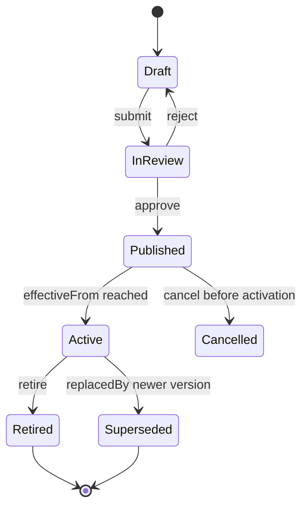
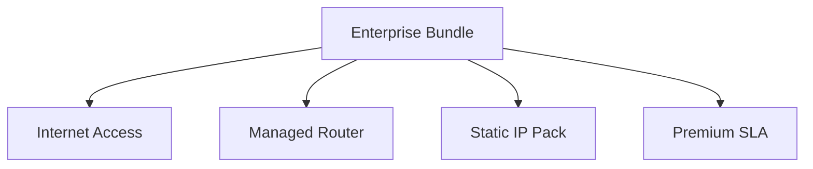
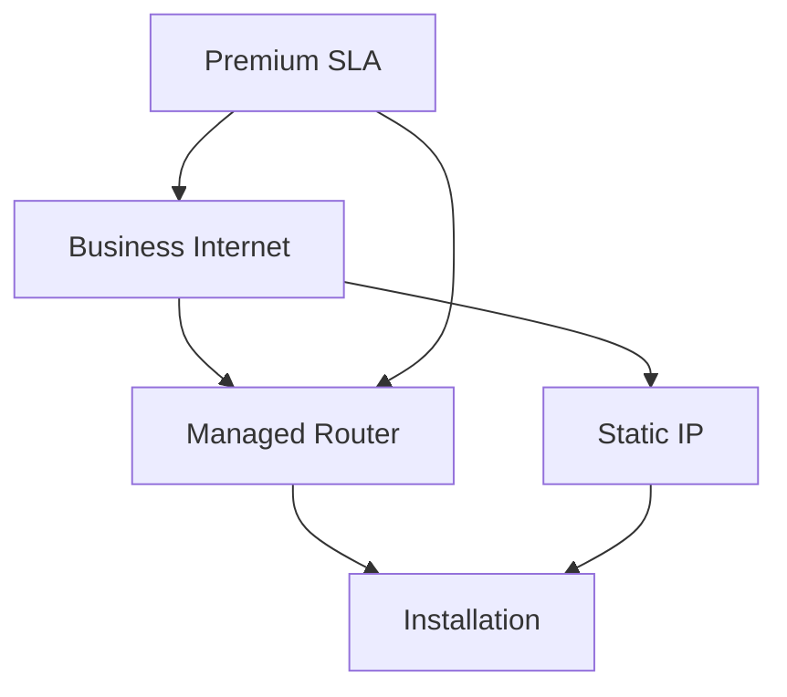
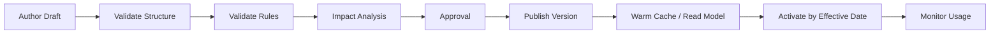

# Part 011 — TMF620 Product Catalog Management

## 1. Tujuan Part Ini

Part ini membahas **TMF620 Product Catalog Management** dari sudut pandang engineer Quote & Order yang harus memahami catalog sebagai sumber definisi commercial product, integration contract, dan decision input untuk CPQ/order lifecycle.

TM Forum secara publik menjelaskan Product Catalog Management API sebagai API untuk mengelola lifecycle catalog elements dan memungkinkan konsultasi catalog elements oleh proses seperti ordering, campaign management, dan sales management. Pada halaman Open API directory, TMF620 tersedia sebagai salah satu Product API, termasuk versi v4 dan v5. Halaman user guide TMF620 v5.0.0 juga dipublikasikan sebagai General Availability dan menjelaskan tujuan API untuk lifecycle catalog elements dan consultation selama proses ordering/sales/campaign.

Namun part ini bukan pengganti specification resmi. Tujuan engineering-nya adalah membentuk mental model:

- apa peran catalog dalam CPQ/order;
- apa perbedaan product specification, product offering, dan product offering price;
- bagaimana TMF620 membantu integration alignment;
- kapan internal model sebaiknya berbeda dari external TMF contract;
- bagaimana menjaga compatibility saat catalog berubah;
- failure mode apa yang sering muncul di catalog-driven systems;
- checklist apa yang harus diverifikasi di internal CSG.

Prinsip utama:

> Catalog is not a lookup table. Catalog is a versioned commercial control plane.

Kalau catalog salah, quote bisa salah. Kalau quote salah, order bisa salah. Kalau order salah, fulfillment dan billing bisa salah. Dalam enterprise quote-to-cash, catalog correctness adalah revenue correctness.

---

## 2. Boundary: Apa yang Publik, Apa yang Harus Diverifikasi

### 2.1 Informasi publik yang aman digunakan

Informasi publik yang bisa digunakan sebagai dasar pembelajaran:

- TMF620 adalah Product Catalog Management API dalam keluarga TM Forum Open APIs.
- API ini berfokus pada lifecycle management dan consultation terhadap catalog elements.
- Catalog elements dapat digunakan dalam proses ordering, sales, campaign, dan integration.
- TMF620 v5.0.0 memiliki halaman user guide publik dengan maturity General Availability.
- TMF620 tersedia dalam Open API directory TM Forum sebagai Product Catalog Management API.
- Secara industri, product catalog biasanya menjadi referensi bagi CPQ, product ordering, qualification, inventory, fulfillment, dan billing alignment.

### 2.2 Hal yang tidak boleh diasumsikan tentang CSG internal

Jangan mengasumsikan bahwa:

- internal catalog model CSG identik dengan TMF620;
- semua field TMF620 disimpan persis dalam database internal;
- API eksternal langsung membaca tabel internal tanpa anti-corruption layer;
- semua customer memakai versi TMF620 yang sama;
- CSG Quote & Order expose TMF620 secara penuh;
- catalog runtime hanya satu service;
- catalog publish/versioning mengikuti lifecycle TMF secara literal;
- pricing engine tinggal membaca `ProductOfferingPrice` tanpa logic tambahan;
- product specification otomatis cukup untuk fulfillment decomposition.

### 2.3 Internal verification checklist

Saat onboarding, verifikasi:

- Apakah TMF620 diekspos sebagai public/customer-facing API, partner API, internal API, atau hanya menjadi mapping reference?
- Versi TMF620 yang didukung: v4, v5, custom profile, atau mixed?
- Apakah ada OpenAPI/OAS internal untuk TMF620 endpoint?
- Apakah ada conformance target atau hanya compatibility target?
- Apakah internal catalog punya canonical model berbeda?
- Di mana anti-corruption layer TMF berada?
- Bagaimana extension field dikelola?
- Bagaimana catalog publish, activation, retirement, dan rollback dilakukan?
- Apakah quote menyimpan catalog snapshot atau hanya reference?
- Apakah order menyimpan catalog snapshot atau inherited quote snapshot?
- Apakah ada catalog cache/read model?
- Bagaimana customer-specific catalog/pricing/eligibility direpresentasikan?

---

## 3. Why TMF620 Matters in Quote & Order

Dalam sistem CPQ/order enterprise, catalog menjawab pertanyaan:

```text
Apa yang boleh dijual?
Kepada siapa?
Di market/channel mana?
Dengan kombinasi apa?
Dengan karakteristik apa?
Dengan harga apa?
Pada periode waktu apa?
Dengan constraint dan dependency apa?
```

TMF620 penting karena memberi vocabulary standar untuk integration:

- `Catalog` sebagai container logis;
- `Category` untuk pengelompokan commercial/product taxonomy;
- `ProductOffering` sebagai sesuatu yang bisa dijual;
- `ProductSpecification` sebagai definisi product capability atau blueprint;
- `ProductOfferingPrice` sebagai definisi charge/price yang terkait offering;
- characteristic sebagai configurable attributes;
- relationship untuk dependency, substitute, bundle, atau association;
- lifecycle metadata untuk govern availability.

Dalam praktik enterprise, catalog jarang sesederhana “daftar produk”. Catalog menjadi sumber dependency bagi:

| Consumer | Mengapa butuh catalog |
|---|---|
| CPQ configurator | Menentukan offering, bundle, compatible option, required characteristic |
| Pricing engine | Menentukan price component, charge type, discount eligibility, agreement override |
| Quote management | Menyimpan snapshot product offering, characteristic, price, dan validity |
| Product ordering | Membuat order item berdasarkan offering yang valid |
| Order decomposition | Menentukan service/resource/technical work item berdasarkan product definition |
| Billing | Menafsirkan charge, recurrence, one-time fee, tax basis, billing account impact |
| Product inventory | Menyimpan product instance yang berasal dari catalog definition |
| Reporting | Menjawab product revenue, adoption, churn, and configuration analytics |

Mental model senior engineer:

> Catalog is upstream of business truth. Treat catalog changes like code changes, not data entry.

---

## 4. First Principles: Product Specification vs Product Offering

Banyak bug CPQ muncul karena engineer mencampur **what the product is** dengan **how the product is sold**.

### 4.1 Product Specification

`ProductSpecification` menjawab:

```text
Apa capability/produk yang didefinisikan?
Karakteristik teknis atau logical apa yang dimiliki?
Apa structure dasar produk tersebut?
Apa relasi produk ini dengan specification lain?
```

Contoh konseptual:

```text
ProductSpecification: Business Internet Access
- accessType
- bandwidthDown
- bandwidthUp
- installationType
- routerIncluded
- serviceLevel
```

Product specification bukan selalu sellable secara langsung. Ia lebih dekat ke definisi capability atau blueprint.

### 4.2 Product Offering

`ProductOffering` menjawab:

```text
Bagaimana product specification ini dijual?
Kepada market/channel/customer segment mana?
Dalam bundle apa?
Dengan price apa?
Dengan lifecycle availability apa?
```

Contoh konseptual:

```text
ProductOffering: Business Internet 1Gbps Premium - Jakarta Enterprise
- based on ProductSpecification: Business Internet Access
- market: Jakarta Enterprise
- channel: Direct Sales
- bundled with: Managed Router
- price: monthly recurring charge + installation fee
- available from: 2026-01-01
- valid until: 2026-12-31
```

### 4.3 Mengapa pemisahan ini penting

Tanpa pemisahan ini:

- pricing bisa tertanam di specification;
- technical capability tercampur dengan commercial packaging;
- bundle menjadi sulit divalidasi;
- customer-specific offering menjadi copy-paste product definition;
- order decomposition sulit memisahkan commercial order dari technical fulfillment;
- catalog versioning menjadi kacau;
- audit quote tidak bisa menjawab “offering mana yang berlaku saat quote dibuat”.

Rule praktis:

```text
ProductSpecification = what the product is capable of being
ProductOffering      = how it is sold commercially
ProductOfferingPrice = how commercial value is expressed
QuoteItem            = customer-specific proposed commercial commitment
OrderItem            = customer-approved commercial execution request
ProductInventory     = actual owned/active product instance
```

---

## 5. TMF620 as External Contract vs Internal Model

Ada dua cara salah menggunakan standard:

1. Mengabaikan standard total sehingga integrasi customer/partner menjadi custom dan mahal.
2. Menyalin standard mentah ke internal domain model sehingga business logic menjadi anemic dan sulit dievolusi.

Pendekatan yang lebih sehat:

```text
External TMF620 Contract
        |
        v
Anti-Corruption / Mapping Layer
        |
        v
Internal Catalog Domain Model
        |
        v
Runtime Read Models / Cache / CPQ Consumers
```

Dalam banyak enterprise systems, TMF620 sebaiknya diperlakukan sebagai **contract boundary**, bukan bukti bahwa internal aggregate harus sama persis.

### 5.1 Kapan internal model boleh berbeda

Internal model boleh berbeda jika:

- internal invariant lebih kuat daripada standard resource model;
- ada performance requirement yang butuh read model berbeda;
- ada customer-specific extension yang tidak cocok masuk core model;
- catalog publish lifecycle internal lebih kompleks;
- pricing engine butuh normalized structure berbeda;
- decomposition engine butuh technical metadata yang tidak ideal diekspos ke external consumer;
- system harus mendukung beberapa versi TMF API sekaligus.

### 5.2 Kapan perbedaan menjadi berbahaya

Perbedaan menjadi berbahaya jika:

- mapping tidak deterministic;
- mapping kehilangan semantic penting;
- extension tidak terdokumentasi;
- response external berubah tanpa compatibility review;
- internal rename dianggap aman padahal external contract ikut berubah;
- field optional di TMF menjadi required diam-diam;
- enum internal bocor ke public API;
- API consumer tidak diberi deprecation path.

### 5.3 Internal verification checklist

Cek:

- Apakah ada mapper TMF620 <-> internal catalog DTO/domain?
- Apakah mapper dites dengan golden contract examples?
- Apakah ada extension namespace convention?
- Apakah internal field documented sebagai exposed/non-exposed?
- Apakah ada API compatibility gate?
- Apakah customer-specific behavior masuk mapping layer atau core domain?

---

## 6. Catalog Lifecycle: Draft, Published, Active, Retired

Catalog lifecycle bukan sekadar status field. Lifecycle menentukan apakah offering boleh dipakai oleh CPQ/order.

Model konseptual:



### 6.1 Status bukan satu-satunya dimensi

Sebuah product offering bisa punya:

- lifecycle status;
- effective start date;
- effective end date;
- version;
- market/channel availability;
- customer segment eligibility;
- customer agreement applicability;
- regulatory/region constraints;
- feature flag/config flag;
- publish batch/version.

Karena itu validasi “offering aktif atau tidak” biasanya bukan:

```java
if (offering.status == ACTIVE) { ... }
```

Melainkan:

```text
isAvailable(offering, customer, account, channel, market, quoteDate, agreement, tenant)
```

### 6.2 Failure modes lifecycle

| Failure | Dampak |
|---|---|
| Offering retired tapi masih bisa dipilih | Quote/order dibuat dari produk tidak valid |
| Offering active tapi price expired | Quote price tidak lengkap atau salah |
| Effective date timezone salah | Produk muncul/hilang lebih awal/terlambat |
| Draft catalog bocor ke production | Customer melihat produk belum disetujui |
| Retired product tidak bisa dibaca | Historical quote/order tidak bisa direkonstruksi |
| New version overwrite old version | Audit kehilangan konteks harga/karakteristik saat quote dibuat |

Rule production:

> Never hard-delete catalog data that is referenced by quote, order, billing, or inventory history.

---

## 7. Versioning and Snapshot Semantics

Catalog-driven system harus menjawab dua pertanyaan berbeda:

```text
Apa definisi produk terbaru sekarang?
Apa definisi produk saat quote/order dibuat?
```

Keduanya tidak boleh dicampur.

### 7.1 Live reference

Live reference berarti quote/order hanya menyimpan ID offering dan selalu membaca definisi terbaru.

Kelebihan:

- data lebih kecil;
- perubahan catalog langsung terlihat;
- tidak perlu menyimpan banyak snapshot.

Kekurangan:

- historical quote bisa berubah makna;
- audit lemah;
- order replay bisa tidak deterministic;
- repricing bisa terjadi tanpa intent eksplisit;
- customer dispute sulit dijelaskan.

### 7.2 Snapshot

Snapshot berarti quote/order menyimpan representasi penting dari offering, price, characteristic, version, dan validity pada saat transaksi dibuat.

Kelebihan:

- audit kuat;
- order conversion deterministic;
- quote acceptance bisa memvalidasi stale snapshot;
- dispute resolution lebih mudah;
- replay lebih aman.

Kekurangan:

- storage lebih besar;
- schema evolution snapshot lebih kompleks;
- ada risiko snapshot tidak lengkap;
- perlu reconciliation antara snapshot dan live catalog.

### 7.3 Hybrid pattern

Pattern umum enterprise:

```text
QuoteItem stores:
- productOfferingId
- productOfferingVersion
- productOfferingNameSnapshot
- selectedCharacteristicsSnapshot
- priceSnapshot
- catalogPublishId/catalogVersion
- validity/effective date used
```

Lalu sistem tetap bisa membaca live catalog untuk:

- revalidate;
- reprice;
- suggest migration;
- detect retired offering;
- compare against current version.

Rule senior engineer:

> Store enough snapshot to explain the commercial commitment. Store enough reference to revalidate against the current catalog.

---

## 8. Characteristic Modelling

Characteristic adalah salah satu bagian paling kuat dan paling berbahaya di catalog model.

Contoh characteristic:

```text
bandwidth = 1Gbps
contractTerm = 36 months
installationType = professional
routerIncluded = true
staticIpCount = 5
sla = premium
```

### 8.1 Characteristic sebagai data vs rule

Jangan memperlakukan characteristic hanya sebagai map:

```json
{
  "bandwidth": "1Gbps",
  "sla": "premium"
}
```

Untuk CPQ, characteristic biasanya punya metadata:

- name;
- value type;
- allowed values;
- default value;
- min/max;
- cardinality;
- configurable atau fixed;
- required atau optional;
- visible atau hidden;
- depends-on rule;
- price-affecting flag;
- fulfillment-affecting flag;
- compatibility constraints.

### 8.2 Failure modes characteristic

| Failure | Contoh |
|---|---|
| Cardinality salah | Multiple static IP allowed padahal billing hanya support satu |
| Type tidak konsisten | `1000`, `1Gbps`, `1 GBPS`, dan `1000Mbps` dianggap berbeda |
| Default value berubah | Quote lama berubah saat dibuka ulang |
| Hidden characteristic hilang | Fulfillment tidak punya technical parameter |
| Price-affecting characteristic tidak snapshot | Dispute harga tidak bisa dijelaskan |
| Required characteristic tidak divalidasi | Order masuk downstream tanpa data wajib |

### 8.3 Implementation guideline

Untuk Java backend:

```java
public record CharacteristicDefinition(
    String code,
    CharacteristicValueType valueType,
    boolean required,
    boolean configurable,
    boolean priceAffecting,
    boolean fulfillmentAffecting,
    List<AllowedValue> allowedValues,
    Cardinality cardinality
) {}
```

Hindari domain logic yang bergantung pada display name:

```java
// Bad
if (characteristic.getName().equals("Bandwidth")) { ... }

// Better
if (characteristic.getCode().equals("bandwidth")) { ... }
```

Lebih baik lagi, centralize code dalam registry/constant yang governed.

---

## 9. Bundle and Relationship Modelling

Bundle adalah sumber kompleksitas CPQ.

Contoh:

```text
Enterprise Connectivity Bundle
- Business Internet Access
- Managed Router
- Static IP Pack
- Premium SLA
- Installation Service
```

Pertanyaan engineering:

- Item mana required?
- Item mana optional?
- Apakah quantity child mengikuti parent?
- Apakah child bisa dipilih sendiri?
- Apakah child punya price sendiri?
- Apakah discount berlaku ke parent, child, atau bundle total?
- Apakah cancellation parent membatalkan child?
- Apakah decomposition mengikuti parent atau child?
- Apakah fulfillment dependency berurutan?

### 9.1 Bundle as tree vs graph

Bundle sering terlihat seperti tree:



Tetapi relationship dunia nyata sering menjadi graph:



Jika sistem mengasumsikan tree padahal realitas graph, bug muncul saat:

- dependency shared;
- optional item tergantung beberapa item;
- cancellation partial;
- amendment bundle;
- price allocation;
- fulfillment sequencing.

### 9.2 Circular relationship detection

Catalog publish pipeline harus mendeteksi circular dependency:

```text
A requires B
B requires C
C requires A
```

Jika tidak, configurator bisa infinite loop, pricing bisa double-count, atau decomposition bisa gagal.

---

## 10. Product Offering Price and Pricing Boundary

TMF620 dapat merepresentasikan product offering price, tetapi jangan langsung menyimpulkan bahwa TMF620 adalah pricing engine.

Dalam enterprise CPQ, price calculation bisa melibatkan:

- base price;
- one-time charge;
- recurring charge;
- usage charge;
- discount;
- promotion;
- customer agreement;
- region/currency;
- tax-related attributes;
- contract term;
- commitment volume;
- margin guardrail;
- approval rule;
- manual override.

Catalog menyimpan **price definition**. Pricing engine menghitung **price result**.

```text
Catalog price definition + Customer/account/agreement context + Quote configuration
= Quote price result
```

### 10.1 Price definition vs price result

| Concept | Example | Mutability |
|---|---|---|
| ProductOfferingPrice | Monthly recurring charge: 100 USD | Catalog-governed |
| Discount rule | 10% discount for 36-month term | Catalog/pricing-governed |
| Agreement override | Customer A gets 80 USD | Agreement-governed |
| Quote price result | Customer A, Quote Q, Item I = 80 USD/month | Quote snapshot |

### 10.2 Failure mode

Jika quote hanya menyimpan reference ke ProductOfferingPrice, maka saat catalog price berubah, historical quote bisa terlihat berubah.

Safer model:

```text
QuoteItemPriceSnapshot
- sourceProductOfferingPriceId
- sourceProductOfferingPriceVersion
- baseAmount
- discountAmount
- finalAmount
- currency
- chargeType
- recurringPeriod
- calculationTraceId
```

---

## 11. Query and Payload Strategy

Catalog API bisa menghasilkan payload besar. Product offering dapat membawa specification, price, characteristics, category, relationship, attachment, constraint, and extension.

Problem umum:

- response terlalu besar untuk browse catalog;
- frontend hanya butuh summary tapi API mengembalikan detail penuh;
- CPQ butuh resolved structure tapi public API hanya butuh resource representation;
- nested expansion membuat query berat;
- cache invalidation sulit;
- customer-specific filtering mahal.

### 11.1 API strategy

Pertimbangkan pattern:

```text
GET /productOffering?fields=id,name,version,lifecycleStatus
GET /productOffering/{id}
GET /productOffering/{id}?expand=price,characteristic,relationship
GET /productOffering/{id}/resolved-configuration-template
```

Catatan: endpoint aktual harus mengikuti OAS/API style internal. Pattern di atas adalah conceptual design, bukan klaim endpoint CSG.

### 11.2 Database/read model strategy

Untuk PostgreSQL:

- normalized write model untuk governance;
- denormalized read model untuk browse/search;
- JSONB snapshot untuk versioned published artifact;
- GIN index hanya jika query pattern jelas;
- materialized view hanya jika refresh behavior aman;
- effective-date index untuk availability lookup.

Contoh query concern:

```sql
SELECT po.id, po.version, po.name
FROM product_offering po
WHERE po.tenant_id = #{tenantId}
  AND po.lifecycle_status = 'ACTIVE'
  AND po.effective_from <= #{asOf}
  AND (po.effective_to IS NULL OR po.effective_to > #{asOf})
ORDER BY po.name
LIMIT #{limit}
OFFSET #{offset};
```

Review pertanyaan:

- Apakah `tenant_id` selalu dipakai?
- Apakah effective date memakai timezone konsisten?
- Apakah pagination offset aman untuk large catalog?
- Apakah filter channel/market/customer segment hilang?
- Apakah index mendukung predicate ini?

---

## 12. Publish Pipeline and Catalog Governance

Catalog change harus diperlakukan seperti software release.

Pipeline konseptual:



Validation seharusnya mencakup:

- required field completeness;
- characteristic type validity;
- circular bundle detection;
- price completeness;
- currency validity;
- effective date conflict;
- retired dependency;
- incompatible version reference;
- market/channel eligibility;
- duplicate code;
- breaking change against active quote/order;
- downstream fulfillment compatibility.

### 12.1 Impact analysis

Sebelum publish, sistem idealnya bisa menjawab:

```text
Produk/offer mana yang berubah?
Quote aktif mana yang terdampak?
Order in-flight mana yang masih memakai version lama?
Pricing rule mana yang berubah?
Customer agreement mana yang bergantung pada offering ini?
Downstream mapping mana yang harus diperbarui?
Apakah change ini breaking untuk existing configuration?
```

Tanpa impact analysis, catalog publish menjadi production gamble.

---

## 13. Internal Implementation Pattern

### 13.1 Layering

```text
API Layer
- TMF620 DTO / OpenAPI generated contract

Application Layer
- Catalog query use case
- Catalog publish use case
- Catalog validation use case

Domain Layer
- ProductOffering
- ProductSpecification
- PriceDefinition
- CharacteristicDefinition
- CatalogVersion
- AvailabilityPolicy

Infrastructure Layer
- PostgreSQL repository
- MyBatis mapper
- Kafka publisher
- Cache adapter
- Search/read model adapter
```

### 13.2 Domain object sketch

```java
public final class ProductOffering {
    private final ProductOfferingId id;
    private final CatalogVersion version;
    private final ProductSpecificationRef specification;
    private final LifecycleStatus status;
    private final ValidFor validFor;
    private final List<CharacteristicDefinition> characteristics;
    private final List<ProductOfferingPriceRef> prices;
    private final List<OfferingRelationship> relationships;

    public boolean isAvailableFor(AvailabilityContext context) {
        return status == LifecycleStatus.ACTIVE
            && validFor.contains(context.asOf())
            && context.market().isAllowedFor(this)
            && context.channel().isAllowedFor(this)
            && context.tenant().isAllowedFor(this);
    }
}
```

### 13.3 Mapper caution

Do not let MyBatis mapper become business logic.

Bad smell:

```xml
<select id="findAvailableOfferings" resultMap="OfferingMap">
  SELECT *
  FROM product_offering
  WHERE status = 'ACTIVE'
    AND channel = #{channel}
    AND customer_segment = #{segment}
    AND complex_rule_json @> #{ruleJson}
</select>
```

If availability logic becomes SQL fragments scattered across mappers, different endpoints will disagree.

Better:

- centralize availability query candidates;
- centralize domain validation;
- test availability matrix;
- document which logic is DB pre-filter vs domain decision.

---

## 14. Eventing Around Catalog Changes

Catalog changes usually need event publication:

```text
CatalogPublished
ProductOfferingCreated
ProductOfferingUpdated
ProductOfferingRetired
ProductOfferingPriceChanged
ProductSpecificationChanged
CatalogVersionActivated
```

But event design must distinguish:

| Event type | Meaning |
|---|---|
| Draft changed | Authoring workspace changed; usually not for runtime consumers |
| Published | New version is approved and available for activation |
| Activated | Runtime consumers may use this version |
| Retired | New quotes should not use this item |
| Superseded | A newer version replaces the old version |

### 14.1 Consumer behavior

Catalog event consumers might include:

- CPQ cache;
- quote validation service;
- pricing service;
- order decomposition service;
- search index;
- UI browse catalog cache;
- reporting/read model;
- downstream partner sync.

Each consumer must be replay-safe.

### 14.2 Failure modes

| Failure | Consequence |
|---|---|
| Event emitted before DB commit | Consumer reads missing catalog version |
| Event lost | Cache/search remains stale |
| Event duplicated | Consumer creates duplicate read model entry |
| Event out of order | Retired version appears active again |
| Event lacks version | Consumer cannot decide freshness |
| Event lacks tenant | Cross-tenant cache pollution risk |

Use transactional outbox for catalog events if event publication and database update must remain consistent.

---

## 15. Testing TMF620 and Catalog Behavior

### 15.1 Unit tests

Test domain rules:

- offering availability by date/channel/tenant;
- characteristic cardinality;
- bundle required/optional rule;
- circular dependency rejection;
- retired dependency rejection;
- price completeness;
- version comparison;
- snapshot extraction.

### 15.2 Integration tests

Test with PostgreSQL/Testcontainers:

- effective date query;
- tenant isolation predicate;
- versioned lookup;
- mapper result mapping;
- JSONB snapshot read/write if used;
- index-supported query plan for hot lookup;
- migration compatibility for catalog schema.

### 15.3 Contract tests

Test external TMF620 representation:

- required fields;
- enum compatibility;
- extension fields;
- unknown field tolerance;
- OpenAPI response schema;
- backward-compatible additive changes;
- generated client compatibility.

### 15.4 Scenario tests

High-value scenarios:

```text
Scenario 1: Sales creates quote using active offering version v3.
Scenario 2: Catalog publishes v4 before quote is accepted.
Scenario 3: Quote acceptance validates whether v3 remains orderable.
Scenario 4: Order conversion stores v3 snapshot.
Scenario 5: Fulfillment decomposition uses correct versioned technical mapping.
```

Expected behavior must be explicit. There is no universal answer; the product must define it.

---

## 16. PR Review Checklist for TMF620/Catalog Changes

When reviewing catalog-related PRs, ask:

### Domain correctness

- Does this change alter product specification, offering, price, or availability?
- Is product specification being confused with product offering?
- Are lifecycle/effective-date rules explicit?
- Are characteristic type/cardinality/default rules preserved?
- Are bundle relationships validated?

### API compatibility

- Does response shape change?
- Is the change additive or breaking?
- Are enum changes backward compatible?
- Are extension fields documented?
- Are version-specific mappings tested?

### Data safety

- Does migration preserve historical quote/order references?
- Is hard-delete avoided for referenced catalog records?
- Are effective dates timezone-safe?
- Is tenant isolation enforced?

### Runtime behavior

- Are caches invalidated?
- Are read models updated?
- Are Kafka events emitted after commit?
- Are events idempotent and versioned?
- Is fallback behavior defined if catalog lookup fails?

### Observability

- Can we trace catalog version used by quote/order?
- Are publish failures visible?
- Are cache staleness metrics available?
- Are validation failures structured and searchable?

---

## 17. Internal Verification Checklist

Use this checklist during onboarding:

### API and standard adoption

- [ ] Is TMF620 externally exposed?
- [ ] Which TMF620 version/profile is supported?
- [ ] Is there an internal OpenAPI contract?
- [ ] Are TMF extensions documented?
- [ ] Is there conformance testing?

### Domain model

- [ ] Where is `ProductSpecification` represented?
- [ ] Where is `ProductOffering` represented?
- [ ] Where is price definition represented?
- [ ] How are characteristics represented?
- [ ] How are bundles/relationships represented?
- [ ] Is product catalog separated from product inventory?

### Lifecycle/versioning

- [ ] How is catalog versioned?
- [ ] What does publish mean?
- [ ] What does activate mean?
- [ ] Can old versions be read?
- [ ] Are quote/order snapshots stored?
- [ ] How are retired offerings handled?

### Runtime and operations

- [ ] Is there catalog cache?
- [ ] How is cache invalidated?
- [ ] Are catalog events published?
- [ ] Is there outbox?
- [ ] Are catalog publish failures monitored?
- [ ] Is there rollback for catalog publish?

### Testing

- [ ] Are catalog lifecycle tests present?
- [ ] Are effective-date tests present?
- [ ] Are TMF620 contract tests present?
- [ ] Are migration tests present?
- [ ] Are customer-specific catalog tests present?

---

## 18. Common Anti-Patterns

### 18.1 Catalog as static reference data

If catalog is treated as static data, teams skip lifecycle, versioning, audit, and compatibility.

Better: treat catalog as governed business configuration with release discipline.

### 18.2 Product offering as free-form JSON

Free-form JSON is flexible early but painful later.

Risk:

- no type safety;
- inconsistent characteristic code;
- hard query;
- weak validation;
- poor migration;
- hidden breaking changes.

Better: typed core model plus controlled extension area.

### 18.3 Internal enum leaked to external API

Internal status values often reflect implementation workflow. External API needs stable business semantics.

Better: map internal status to external lifecycle representation.

### 18.4 Catalog hard delete

Deleting referenced offering/spec/price breaks quote/order history.

Better: retire/supersede and keep historical readability.

### 18.5 Availability logic duplicated across services

If UI, quote service, pricing service, and order service each implement availability differently, production inconsistencies are guaranteed.

Better: centralize policy or centralize tested policy library/service.

---

## 19. Practical Exercises

### Exercise 1 — Catalog source-of-truth map

Create a diagram:

```text
Catalog authoring -> publish -> runtime catalog API/cache -> CPQ -> quote -> order -> fulfillment/billing
```

Mark:

- source of truth;
- read model;
- cache;
- event topic;
- version boundary;
- customer-specific override;
- failure/retry point.

### Exercise 2 — Product offering review

Pick one product offering from internal sandbox/demo.

Document:

- product specification;
- offering lifecycle;
- price components;
- characteristics;
- bundle relationships;
- eligibility constraints;
- where it appears in quote/order;
- what happens if it is retired.

### Exercise 3 — Breaking change analysis

For one hypothetical catalog change:

```text
Change bandwidth characteristic from free text to enum.
```

Analyze:

- active quotes affected;
- existing orders affected;
- product inventory affected;
- API consumers affected;
- migration plan;
- compatibility strategy;
- rollback strategy.

---

## 20. Key Takeaways

- TMF620 is best understood as a Product Catalog Management contract and vocabulary, not automatically as an internal database model.
- Product specification, product offering, and product offering price must remain conceptually distinct.
- Catalog lifecycle and versioning are core correctness mechanisms for quote-to-cash systems.
- Quote/order should store enough catalog snapshot to preserve commercial auditability.
- Catalog publish should be treated like production release.
- Characteristic and bundle modelling are major sources of CPQ complexity.
- Senior engineers must review catalog changes for business correctness, API compatibility, data safety, runtime behavior, and observability.

---

## 21. Source Notes

Public sources used for orientation:

- TM Forum Open API directory lists Product Catalog Management API TMF620 and shows v4/v5 availability.
- TM Forum TMF620 v5.0.0 user guide page describes Product Catalog Management API as managing lifecycle of catalog elements and supporting consultation during processes such as ordering, campaign management, and sales management.
- TM Forum Product Catalog Management API v5.0 page describes TMF620 as a standardized solution for rapidly adding partners' products to an existing catalog.

These sources describe industry-standard API positioning. They do not reveal or prove CSG internal implementation details.
