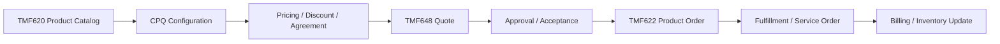
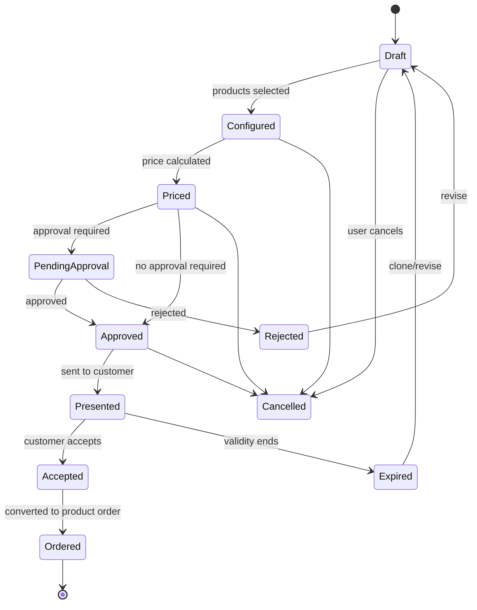
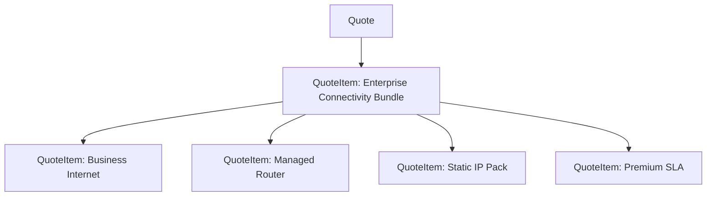
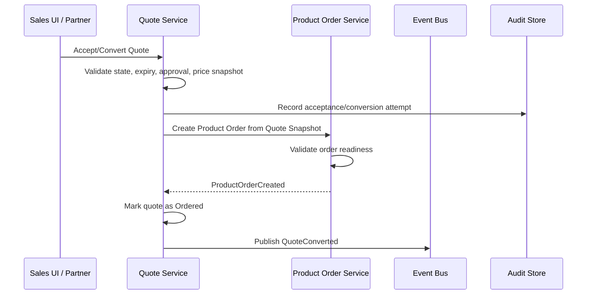

# Part 012 — TMF648 Quote Management

## 1. Tujuan Part Ini

Part ini membahas **TMF648 Quote Management** dari sudut pandang engineer yang bekerja pada CPQ/Quote & Order enterprise system.

TM Forum secara publik menjelaskan Quote API sebagai salah satu Pre-Ordering Management APIs. API ini menyediakan mekanisme standar untuk menempatkan customer quote dengan parameter quote yang diperlukan. Spesifikasi TMF648 terdahulu juga menjelaskan operasi create, update, dan retrieve customer quote, serta bahwa customer quote dibuat berdasarkan product offer yang didefinisikan di catalog.

Tujuan part ini bukan menghafal semua field TMF648. Tujuannya adalah memahami:

- quote sebagai commercial proposal, bukan sekadar request payload;
- bagaimana quote item merepresentasikan proposed customer commitment;
- bagaimana quote terhubung ke product catalog, pricing, agreement, customer, dan product order;
- bagaimana TMF648 bisa menjadi public integration contract;
- bagaimana lifecycle, approval, versioning, dan acceptance harus dijaga;
- kapan internal quote model perlu berbeda dari TMF648 representation;
- apa failure mode yang harus dipikirkan senior engineer saat mereview quote API.

Prinsip utama:

> A quote is not a cart. A quote is an auditable commercial proposal that may become an order.

---

## 2. Boundary: Public Standard vs Internal Implementation

### 2.1 Informasi publik yang aman digunakan

Informasi publik yang bisa dijadikan orientasi:

- TMF648 adalah Quote Management API dalam keluarga TM Forum Open APIs.
- Quote API termasuk area Pre-Ordering Management.
- Customer Quote API menyediakan mekanisme standar untuk membuat customer quote dengan parameter yang diperlukan.
- Spesifikasi lama TMF648 menyebut operasi seperti create, update, dan retrieve customer quotes.
- Customer quote dibuat berdasarkan product offer yang didefinisikan di catalog.
- Halaman publik TMF648 v5 menunjukkan adanya v5.0.0 preview/release history; versi yang dipakai internal tetap harus diverifikasi.

### 2.2 Hal yang tidak boleh diasumsikan

Jangan mengasumsikan bahwa:

- internal quote aggregate sama persis dengan TMF648 resource;
- semua field TMF648 di-support penuh;
- approval workflow ada di TMF648 core tanpa extension;
- quote versioning internal sama dengan API versioning;
- quote API langsung mengubah order;
- createQuote selalu synchronous full pricing;
- updateQuote selalu allowed untuk semua state;
- quote response harus selalu membawa seluruh quote detail;
- TMF648 v5 sudah dipakai internal;
- state mapping CSG sama persis dengan TMF lifecycle status.

### 2.3 Internal verification checklist

Verifikasi:

- Apakah TMF648 diekspos ke customer/partner atau hanya dipakai sebagai internal alignment?
- Versi TMF648 apa yang didukung?
- Apakah ada custom profile atau extension?
- Apakah OpenAPI internal tersedia?
- Bagaimana internal quote state dipetakan ke external state?
- Apakah quote approval direpresentasikan dalam extension/resource terpisah?
- Apakah quote versioning tersedia?
- Apakah quote response full detail, summary, atau configurable expansion?
- Bagaimana quote converted menjadi product order?
- Apakah idempotency key didukung untuk create/submit/convert?

---

## 3. What a Quote Really Is

Dalam CPQ enterprise, quote adalah hasil dari proses:

```text
Customer/account/agreement context
+ Selected product offerings
+ Configuration choices
+ Eligibility checks
+ Pricing calculation
+ Discount/margin/approval rules
+ Commercial terms
+ Validity period
= Auditable commercial proposal
```

Quote bukan hanya:

- shopping cart;
- draft order;
- pricing response;
- PDF document;
- temporary UI state.

Quote adalah artifact yang harus bisa menjawab:

```text
Siapa customer-nya?
Apa yang ditawarkan?
Berdasarkan catalog version apa?
Dengan konfigurasi apa?
Dengan harga apa?
Diskon mana yang diterapkan?
Siapa yang menyetujui?
Sampai kapan valid?
Apa yang berubah dari version sebelumnya?
Kapan quote diterima?
Order mana yang dibuat dari quote ini?
```

Jika sistem tidak bisa menjawab pertanyaan ini, quote tidak cukup defensible untuk enterprise.

---

## 4. TMF648 in the Quote-to-Cash Chain

TMF648 berada di antara catalog/pricing dan product ordering.



Quote biasanya mengikat:

- customer/related party;
- product offering references;
- quote items;
- selected product characteristics;
- prices;
- terms and validity;
- state/lifecycle;
- external references;
- notes/attachments;
- approval/commercial metadata;
- conversion relationship to order.

### 4.1 Why quote is not product order

Quote:

```text
Proposed commercial commitment.
```

Product order:

```text
Accepted execution request.
```

Quote boleh berisi alternatif, draft, negotiation, pending approval, expired offer, atau proposed discount. Product order harus siap dieksekusi atau divalidasi sebagai execution request.

Jangan membuat downstream fulfillment bergantung pada quote draft.

---

## 5. Quote Lifecycle Model

Lifecycle konseptual:



Ini bukan klaim state internal CSG. Ini model reasoning.

### 5.1 Invariant penting

Contoh invariant:

- Quote tidak bisa accepted jika expired.
- Quote tidak bisa converted dua kali tanpa idempotent handling.
- Quote yang membutuhkan approval tidak bisa accepted sebelum approved.
- Quote price tidak boleh berubah diam-diam setelah presented tanpa new version/reprice event.
- Quote item harus reference valid product offering/catalog snapshot.
- Quote cannot be ordered if required characteristic missing.
- Quote cannot be ordered if customer/account/agreement context invalid.
- Quote acceptance harus mencatat actor/time/channel/source.

### 5.2 Transition guard

Setiap transition harus menjawab:

```text
Dari state apa?
Ke state apa?
Aktor siapa?
Permission apa?
Business rule apa?
Side effect apa?
Event apa?
Audit apa?
Idempotency key apa?
```

Contoh transition `acceptQuote`:

```java
public Quote accept(AcceptQuoteCommand command, Clock clock) {
    requireState(QuoteState.PRESENTED, QuoteState.APPROVED);
    requireNotExpired(clock.instant());
    requireApprovalSatisfied();
    requirePriceStillValidOrExplicitlyAcceptedAsSnapshot();
    requireActorCanAccept(command.actor());

    return this.withState(QuoteState.ACCEPTED)
        .withAcceptedAt(clock.instant())
        .withAcceptedBy(command.actor())
        .recordEvent(new QuoteAccepted(this.id, command.correlationId()));
}
```

---

## 6. Quote Item: The Core of Commercial Meaning

Quote header is context. Quote item is where commercial meaning lives.

A quote item usually represents:

- a proposed product offering;
- selected product characteristics;
- quantity;
- action intent;
- relationship to other quote items;
- price result;
- discount/adjustment;
- eligibility/validation status;
- source catalog version;
- installed base reference for amendment;
- dependency/bundle position.

### 6.1 Quote item hierarchy

For bundle quote:



The structure can become graph-like if dependencies are shared. But API representation often prefers nested or related item references.

### 6.2 Action semantics

Quote item may represent:

- add new product;
- modify existing product;
- delete/remove product;
- no change but included for context;
- replace/swap;
- renew;
- suspend/resume in some domains.

TMF622 product order has clearer order item action semantics, but quote management often needs similar intent earlier in the lifecycle.

Internal verification:

- Does quote item have action?
- Is action aligned with product order item action?
- How are amendments represented?
- Is installed product inventory reference captured?
- Can quote contain both add and modify in one commercial proposal?

---

## 7. Quote Pricing Representation

A quote must preserve price meaning at the time of proposal.

### 7.1 Price components

Possible price components:

- one-time charge;
- monthly recurring charge;
- annual recurring charge;
- usage-based charge;
- discount;
- promotion;
- penalty/fee;
- tax-related amount;
- installation charge;
- device charge;
- managed service charge.

### 7.2 Price snapshot

Do not store only `priceId`.

A robust quote item price snapshot may include:

```text
sourceProductOfferingPriceId
sourceProductOfferingPriceVersion
baseAmount
discountAmount
finalAmount
currency
chargeType
recurringPeriod
quantity
calculationTraceId
pricingRuleVersion
agreementId/agreementVersion
manualOverrideReason
approvalRequired
```

### 7.3 Price recalculation

A quote can be repriced because:

- catalog price changed;
- discount changed;
- agreement changed;
- quantity changed;
- characteristic changed;
- customer segment changed;
- validity date changed;
- promotion expired;
- margin rule changed;
- manual override applied.

Critical question:

```text
Does repricing mutate the existing quote, create a new quote version, or create a new price version inside the same quote?
```

There is no universal answer. But the behavior must be explicit, tested, and auditable.

---

## 8. Approval and Commercial Governance

TMF648 core quote resource may not capture all enterprise approval semantics needed by CPQ products. Enterprise systems often extend quote management with approval workflows.

Approval may be triggered by:

- discount above threshold;
- margin below threshold;
- non-standard term;
- customer-specific contract exception;
- manual price override;
- product combination risk;
- regulatory/region rule;
- sales role authority limit;
- total contract value.

### 8.1 Approval invariant

Important invariant:

```text
Approval must be tied to the exact commercial state that was approved.
```

If quote changes after approval, approval may need invalidation.

Examples of approval-invalidating changes:

- price changed;
- discount changed;
- quantity changed;
- term changed;
- product added/removed;
- customer/account changed;
- agreement changed;
- validity changed;
- manual override changed.

### 8.2 Approval trace

Audit should answer:

```text
Who requested approval?
What was approved?
Which thresholds were exceeded?
Who approved?
When?
Based on what authority?
Was approval still valid at acceptance?
```

### 8.3 Internal verification checklist

- Is approval inside Quote service or separate workflow service?
- Is approval synchronous or asynchronous?
- Are approvals tied to quote version/hash?
- What invalidates approval?
- Is approval event emitted?
- Is approval audit immutable?
- Are manual overrides separated from calculated discount?

---

## 9. Versioning, Revision, and Negotiation

Enterprise quote is often negotiated.

Possible patterns:

### 9.1 Mutable draft, immutable presented versions

```text
Draft can change freely.
Once presented to customer, create immutable version.
Revision creates new version.
```

This is usually safer for audit.

### 9.2 Fully mutable quote

```text
Same quote ID changes until accepted.
Audit captures history.
```

This can work if audit is excellent, but it is easier to make mistakes.

### 9.3 Quote clone for revision

```text
Expired/rejected quote is cloned into a new quote.
```

Useful for negotiation history but can create linking complexity.

### 9.4 Quote version hash

To tie approval and acceptance to exact state:

```text
quoteVersionHash = hash(normalizedCommercialState)
```

Approval stores hash. Acceptance verifies hash unchanged.

This avoids subtle bugs where approved quote content changes but state remains `APPROVED`.

---

## 10. Quote-to-Order Handoff

Quote-to-order conversion is a critical boundary.



### 10.1 Conversion mapping

Mapping must handle:

- quote header -> order header;
- quote item -> order item;
- quote item action -> order item action;
- selected product characteristics;
- price snapshot;
- customer/account/agreement reference;
- delivery/appointment info;
- related party;
- external IDs;
- catalog version reference;
- quote/order relationship.

### 10.2 Conversion failure modes

| Failure | Example |
|---|---|
| Double conversion | User clicks twice, two orders created |
| Quote expired during conversion | Race between expiry job and acceptance |
| Price stale | Catalog price changed but quote accepted without policy |
| Approval invalid | Approved quote changed before conversion |
| Partial order created | Order created but quote not marked ordered |
| Mapping loss | Quote item characteristic lost in order item |
| Downstream validation stricter | Quote passed but order rejects missing field |

### 10.3 Idempotency

`convertQuoteToOrder` must be idempotent.

Use one or more:

- idempotency key;
- quote ID + target action uniqueness;
- conversion attempt table;
- unique constraint on `source_quote_id` in order relation;
- transactional outbox;
- retry-safe response returning existing order.

Example DB protection:

```sql
CREATE UNIQUE INDEX uq_product_order_source_quote
ON product_order(source_quote_id)
WHERE source_quote_id IS NOT NULL;
```

This is conceptual. Actual schema must be verified.

---

## 11. API Design Concerns for TMF648-Compatible Interfaces

### 11.1 Create quote

Create quote may be:

- lightweight draft creation;
- full CPQ create+price;
- asynchronous quote request;
- partner-submitted quote proposal;
- quote clone/revision.

The API contract must define whether create is:

```text
command to create draft
or
command to validate and price immediately
or
request to start asynchronous quote calculation
```

### 11.2 Update quote

Update quote must be state-aware.

Bad:

```text
PATCH /quote/{id}
```

with arbitrary fields allowed in any state.

Better:

```text
Commands with transition semantics:
- addQuoteItem
- updateConfiguration
- repriceQuote
- submitForApproval
- approveQuote
- presentQuote
- acceptQuote
- cancelQuote
- reviseQuote
```

TMF-compatible facade can still expose resource-oriented shape, but internal domain should preserve command meaning.

### 11.3 Response payload size

Quote response can be huge.

Potential strategy:

```text
GET /quote/{id} -> default useful detail
GET /quote/{id}?fields=id,state,validFor,totalPrice
GET /quote/{id}?expand=quoteItem,price,approval,auditSummary
```

Actual endpoint style must follow internal API standards and TMF profile.

### 11.4 Error model

Quote API errors should distinguish:

- validation error;
- eligibility error;
- pricing error;
- approval required;
- state transition not allowed;
- concurrency conflict;
- stale catalog/price;
- authorization failure;
- tenant boundary violation;
- downstream integration unavailable;
- retryable vs non-retryable error.

Example conceptual error:

```json
{
  "code": "QUOTE_APPROVAL_REQUIRED",
  "message": "Quote requires approval before it can be accepted.",
  "reason": "DISCOUNT_EXCEEDS_THRESHOLD",
  "quoteId": "Q-12345",
  "correlationId": "..."
}
```

---

## 12. Internal Architecture Pattern

### 12.1 Layering

```text
API Layer
- TMF648 DTO / OpenAPI contract
- Request validation
- Contract-level mapping

Application Layer
- CreateQuoteUseCase
- UpdateQuoteItemUseCase
- PriceQuoteUseCase
- SubmitQuoteForApprovalUseCase
- AcceptQuoteUseCase
- ConvertQuoteToOrderUseCase

Domain Layer
- Quote aggregate
- QuoteItem
- QuotePrice
- QuoteStateMachine
- ApprovalPolicy
- ExpiryPolicy
- VersioningPolicy

Infrastructure Layer
- PostgreSQL repositories
- MyBatis mappers
- Kafka event publisher/outbox
- Pricing client
- Catalog client/cache
- Customer/agreement client
- Order service client
```

### 12.2 Aggregate boundary

Quote aggregate should protect:

- quote state;
- quote item consistency;
- price snapshot consistency;
- version/approval relation;
- acceptance/conversion invariant;
- audit/domain event generation.

It should not own:

- full product catalog authoring;
- full customer master;
- full order fulfillment;
- full billing lifecycle;
- full approval org hierarchy if managed elsewhere.

### 12.3 Command-first internal model

Even if external API is resource-oriented, internal logic should be command-oriented:

```java
sealed interface QuoteCommand permits
    CreateQuote,
    AddQuoteItem,
    UpdateQuoteConfiguration,
    RepriceQuote,
    SubmitForApproval,
    ApproveQuote,
    RejectQuote,
    PresentQuote,
    AcceptQuote,
    ConvertQuoteToOrder,
    CancelQuote {
}
```

This makes state transition and audit explicit.

---

## 13. PostgreSQL and Persistence Concerns

Possible relational structure:

```text
quote
quote_version
quote_item
quote_item_characteristic
quote_price
quote_approval
quote_event/audit
quote_order_relation
```

### 13.1 Transaction boundary

Critical operations:

- create quote with items;
- update quote item and invalidate price/approval;
- reprice quote and store price snapshot;
- approve quote tied to version/hash;
- accept quote;
- mark quote ordered;
- publish event after commit.

### 13.2 Optimistic locking

Quote update should likely use optimistic locking:

```sql
UPDATE quote
SET state = #{newState}, version = version + 1
WHERE id = #{quoteId}
  AND version = #{expectedVersion};
```

If update count is zero, return concurrency conflict.

### 13.3 Query design

Common queries:

- get quote by ID;
- list quotes for customer/account;
- list pending approval quotes;
- list expiring quotes;
- search by external reference;
- load quote with items/prices;
- find quote by source opportunity/order relation.

Avoid loading huge quote graphs for list pages.

---

## 14. Kafka Events Around Quote Management

Important events:

```text
QuoteCreated
QuoteItemAdded
QuotePriced
QuoteApprovalRequested
QuoteApproved
QuoteRejected
QuotePresented
QuoteAccepted
QuoteExpired
QuoteCancelled
QuoteConvertedToOrder
```

### 14.1 Event payload rule

Event should include enough identity and metadata:

```text
quoteId
tenantId
customerId/accountId if safe
state
previousState
quoteVersion
correlationId
causationId
actor/system
occurredAt
sourceCommandId/idempotencyKey
```

Avoid putting sensitive full quote detail into broad Kafka topics unless security, retention, and consumer scope are clear.

### 14.2 Event correctness

Failure modes:

- `QuoteAccepted` emitted before transaction commit;
- duplicate `QuoteConvertedToOrder` creates duplicate downstream action;
- event lacks version, consumer applies stale update;
- quote price event exposes confidential pricing to unauthorized consumer;
- replay causes approval notification to resend;
- event schema change breaks consumer.

Use outbox and idempotent consumers for critical events.

---

## 15. Observability for Quote Management

A production-ready quote system should expose:

### Business metrics

- quote created count;
- quote priced count;
- quote approval required count;
- quote approved/rejected count;
- quote accepted count;
- quote expired count;
- quote converted-to-order count;
- quote conversion failure rate;
- average quote value if allowed;
- average quote lifecycle duration;
- approval cycle time;
- pricing latency.

### Technical metrics

- API latency per endpoint/command;
- pricing service latency;
- catalog lookup latency;
- DB query latency;
- optimistic lock conflict count;
- Kafka publish/outbox lag;
- event consumer lag;
- error rate by code;
- payload size distribution.

### Logs/traces

Every quote flow should include:

- correlation ID;
- causation ID;
- quote ID;
- quote version;
- customer/account ID if allowed;
- tenant ID;
- actor/system;
- state transition;
- pricing trace ID;
- order ID after conversion.

---

## 16. Testing TMF648 and Quote Behavior

### 16.1 Unit tests

Focus on:

- state transition matrix;
- approval invalidation;
- expiry guard;
- quote item validation;
- price snapshot immutability;
- version/hash calculation;
- authorization decisions;
- conversion preconditions.

### 16.2 Integration tests

Use PostgreSQL/Testcontainers for:

- quote creation transaction;
- optimistic locking conflict;
- quote item persistence;
- price snapshot persistence;
- approval tied to version;
- unique conversion constraint;
- outbox event creation.

### 16.3 Contract tests

For TMF648-compatible API:

- OpenAPI schema validation;
- required/optional field behavior;
- enum compatibility;
- nullability compatibility;
- extension fields;
- error response consistency;
- generated client compatibility;
- backward-compatible changes.

### 16.4 Journey tests

High-value E2E scenario:

```text
1. Create quote for enterprise customer.
2. Add bundle offering.
3. Configure characteristics.
4. Price quote.
5. Apply discount exceeding threshold.
6. Submit for approval.
7. Approve quote.
8. Present quote.
9. Accept quote.
10. Convert quote to product order.
11. Verify order items preserve quote item commercial meaning.
12. Verify audit and events.
```

Also test failure paths:

- accept expired quote;
- convert same quote twice;
- update approved quote;
- order service fails after quote accepted;
- catalog retired before acceptance;
- pricing service timeout;
- approval rejection and revision.

---

## 17. PR Review Checklist for Quote Management

### Domain correctness

- Does the change preserve quote lifecycle invariants?
- Are state transitions explicit?
- Are illegal transitions rejected?
- Is approval invalidated on material changes?
- Is quote versioning/snapshot behavior clear?
- Are quote item relationships preserved?

### API compatibility

- Does response/request schema change?
- Are enum changes safe?
- Are optional fields becoming required?
- Are TMF extensions documented?
- Is error behavior compatible?
- Are generated clients impacted?

### Data correctness

- Are quote/item/price writes transactional?
- Is optimistic locking used where needed?
- Are historical quotes readable after catalog changes?
- Are price snapshots immutable after presentation/acceptance?
- Is conversion uniquely constrained?

### Integration safety

- Is quote-to-order idempotent?
- Are events emitted after commit?
- Are consumers protected from duplicates/replay?
- Are pricing/catalog/customer downstream failures handled?
- Is retry behavior safe?

### Security and audit

- Is actor identity recorded?
- Is tenant isolation enforced?
- Are pricing details protected?
- Is approval authority checked?
- Is audit evidence complete?

### Observability

- Can one quote be traced end-to-end?
- Are business failures visible as structured errors?
- Are conversion failures monitored?
- Are approval bottlenecks measurable?

---

## 18. Internal Verification Checklist

### TMF/API adoption

- [ ] Is TMF648 exposed externally?
- [ ] Which TMF648 version/profile is supported?
- [ ] Is there an internal OpenAPI/OAS?
- [ ] Are extensions documented?
- [ ] Is there contract/conformance testing?

### Quote lifecycle

- [ ] What are actual quote states?
- [ ] Is there transition matrix?
- [ ] Are state guards centralized?
- [ ] How is quote expiry handled?
- [ ] How is quote cancellation handled?
- [ ] How is quote revision handled?

### Pricing and approval

- [ ] Where is pricing calculated?
- [ ] Is price snapshot stored?
- [ ] What invalidates price?
- [ ] What triggers approval?
- [ ] What invalidates approval?
- [ ] Is approval tied to version/hash?

### Quote-to-order

- [ ] How is quote converted to order?
- [ ] Is conversion synchronous or asynchronous?
- [ ] Is conversion idempotent?
- [ ] Is source quote linked to product order?
- [ ] What happens if order creation fails?
- [ ] Are quote item actions mapped to order item actions?

### Observability and operations

- [ ] Are quote IDs in logs/traces?
- [ ] Are correlation/causation IDs propagated?
- [ ] Is quote conversion dashboard available?
- [ ] Are approval bottlenecks monitored?
- [ ] Are expired quote jobs monitored?
- [ ] Are repair/reconciliation procedures documented?

---

## 19. Common Anti-Patterns

### 19.1 Quote as cart

Shopping cart mental model underestimates approval, versioning, audit, commercial terms, and acceptance.

Better: quote as auditable commercial proposal.

### 19.2 State as display label

If state is only for UI, backend invariants become weak.

Better: state drives allowed commands and side effects.

### 19.3 Approval not tied to quote content

Approval of “quote ID” is insufficient if quote content can change.

Better: approval tied to quote version/hash.

### 19.4 Repricing without versioning

Silent repricing destroys customer trust and auditability.

Better: explicit reprice command and version/audit record.

### 19.5 Quote-to-order without idempotency

Double-click, retry, or timeout can create duplicate orders.

Better: unique conversion relation and idempotent command handling.

### 19.6 Full quote payload everywhere

Returning complete quote graph for every API call hurts latency and leaks data.

Better: fields/expand/summary strategy and strict authorization.

---

## 20. Practical Exercises

### Exercise 1 — Quote state transition matrix

Create a table:

```text
From State | Command | To State | Actor | Guard | Event | Audit | Failure Code
```

Fill it for:

- create;
- add item;
- price;
- submit approval;
- approve;
- reject;
- present;
- accept;
- convert;
- cancel;
- expire;
- revise.

### Exercise 2 — Quote-to-order mapping

Take one internal/demo quote and map:

```text
Quote field -> Product order field
Quote item -> Order item
Quote price -> Order price/reference
Quote characteristic -> Order product characteristic
Quote customer/account -> Order related party/account
Quote agreement -> Order agreement reference
```

Mark any lossy mapping.

### Exercise 3 — Approval invalidation scenario

Scenario:

```text
Quote approved with 20% discount.
Sales changes contract term from 36 months to 12 months.
```

Answer:

- Does approval remain valid?
- Does price remain valid?
- Does quote need new version?
- What audit event is required?
- What API response should update command return?

### Exercise 4 — Double conversion test

Design an integration test where two concurrent requests convert the same quote.

Expected:

- only one order created;
- both callers receive deterministic result;
- audit shows one conversion;
- duplicate attempt is recorded or safely ignored;
- no duplicate Kafka event with different order ID.

---

## 21. Key Takeaways

- TMF648 is best used as quote management contract/vocabulary, not automatically as internal aggregate shape.
- Quote is an auditable commercial proposal that may become an order.
- Quote lifecycle, approval, versioning, pricing snapshot, and quote-to-order idempotency are core correctness areas.
- Approval must be tied to exact quote content, not merely quote ID.
- Quote-to-order conversion is a high-risk boundary and must be idempotent.
- Senior engineers should review quote changes through domain, compatibility, data, integration, security, audit, and observability lenses.

---

## 22. Source Notes

Public sources used for orientation:

- TM Forum Quote Management API TMF648 v5 page describes Quote API as a Pre-Ordering Management API and says it provides a standardized mechanism for placing a customer quote with necessary quote parameters.
- TM Forum older TMF648 REST specification pages describe create, update, and retrieve operations for customer quotes.
- TM Forum older TMF648 pages state that a customer quote is created based on a product offer defined in a catalog.

These sources describe public standard positioning. They do not reveal or prove CSG internal implementation details.
