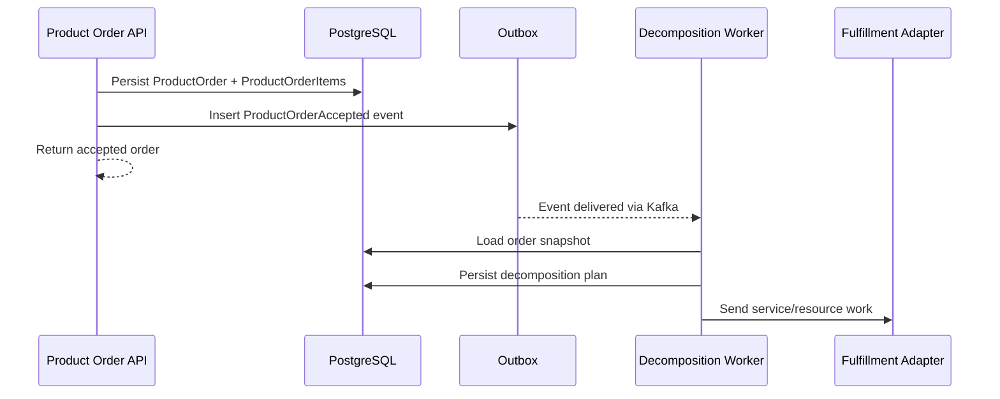

# Part 013 — TMF622 Product Ordering

## 1. Tujuan Part Ini

Part ini membahas **TMF622 Product Ordering** dari sudut pandang engineer yang bekerja pada produk enterprise CPQ, quote management, dan order management.

TM Forum secara publik menjelaskan Product Ordering Management API sebagai mekanisme standar untuk menempatkan product order dengan parameter order yang diperlukan. API ini berinteraksi dengan CRM/order negotiation systems secara konsisten. Product order dibuat berdasarkan product offer/product offering yang didefinisikan di catalog, dan offering tersebut membawa informasi seperti pricing, product options, dan market.

Tujuan part ini bukan menghafal semua field TMF622. Tujuan part ini adalah membangun mental model:

- product order sebagai **commercially authorized execution request**;
- product order item sebagai unit perubahan terhadap product/customer installed base;
- action semantics seperti add/modify/delete/noChange sebagai business intent, bukan sekadar enum;
- order lifecycle sebagai state machine yang harus tahan terhadap partial failure;
- order creation sebagai boundary yang membutuhkan idempotency, validation, audit, dan contract compatibility;
- product order sebagai input ke decomposition, service ordering, fulfillment, billing, dan inventory update;
- TMF622 sebagai external contract/vocabulary, bukan bukti bentuk aggregate internal.

Prinsip utama:

> A product order is not a persistence event. It is a controlled business commitment to change a customer's product state.

---

## 2. Boundary: Public Standard vs Internal Implementation

### 2.1 Informasi publik yang aman digunakan

Informasi publik yang aman dijadikan orientasi:

- TMF622 adalah Product Ordering Management API dalam keluarga TM Forum Open APIs.
- Halaman Open API Directory menunjukkan Product Ordering Management API TMF622 tersedia dalam keluarga Open APIs dan memiliki versi v4/v5.
- Halaman TMF622 v5 menyatakan API ini menyediakan mekanisme standar untuk placing product order dengan parameter order yang diperlukan.
- Spesifikasi/user guide publik TMF622 menjelaskan bahwa product order dibuat berdasarkan product offer/product offering yang didefinisikan di catalog.
- Product offering membawa karakteristik seperti pricing, product options, dan market.

### 2.2 Hal yang tidak boleh diasumsikan

Jangan mengasumsikan bahwa:

- internal order aggregate identik dengan TMF622 `ProductOrder`;
- semua TMF622 resource, sub-resource, event, dan operations di-support penuh;
- lifecycle internal sama persis dengan lifecycle status TMF622;
- order submission selalu synchronous;
- product order langsung menjadi service order tanpa process manager/orchestrator;
- amendment/cancel/retry sudah otomatis aman hanya karena ada status field;
- external API state dan internal workflow state harus satu field yang sama;
- TMF622 v5 pasti versi yang sedang dipakai internal;
- custom extension tidak diperlukan;
- order item action cukup divalidasi di controller.

### 2.3 Internal verification checklist

Verifikasi:

- Apakah TMF622 diekspos ke customer/partner atau hanya dipakai sebagai internal alignment?
- Versi TMF622 apa yang didukung?
- Apakah OpenAPI internal compatible dengan TMF622 v4, v5, atau custom profile?
- Apa mapping internal `Order`/`OrderItem` ke external `ProductOrder`/`ProductOrderItem`?
- Apa daftar state internal order dan order item?
- Apakah order item mempunyai action semantics eksplisit?
- Apakah `add`, `modify`, `delete`, `noChange`, atau action sejenis didukung?
- Apakah amendment dan cancellation memakai resource/task terpisah?
- Apakah product order creation idempotent?
- Apa partition key Kafka untuk order event?
- Bagaimana order state diekspos ke UI, customer API, dan downstream integration?
- Apakah fulfillment/decomposition synchronous, async, atau hybrid?

---

## 3. What a Product Order Really Is

Dalam quote-to-cash, product order biasanya muncul setelah commercial intent sudah cukup matang:

```text
Catalog offering selected
+ Configuration validated
+ Price calculated
+ Discount/margin governed
+ Approval completed when required
+ Customer/account/agreement context resolved
+ Quote accepted or order captured directly
= Product order candidate
```

Product order adalah instruksi bisnis untuk mengubah keadaan customer product footprint:

```text
Before:
Customer owns no product / owns old product / owns package A

Order intent:
Add new product / modify existing product / disconnect product / renew / move / upgrade

After:
Customer installed base must eventually reflect the completed order
```

Karena itu order tidak boleh diperlakukan seperti:

- form submission biasa;
- shopping cart checkout sederhana;
- database row tanpa lifecycle;
- event tunggal yang langsung sukses;
- request yang aman diulang tanpa idempotency;
- fulfillment job tanpa commercial audit.

Order harus bisa menjawab:

```text
Siapa customer/account-nya?
Apa commercial basis-nya?
Quote mana yang menjadi sumber, jika ada?
Product offering apa yang diminta?
Catalog version apa yang digunakan?
Order item mana yang add/modify/delete/noChange?
Installed base mana yang disentuh?
Apa dependency antar item?
Apa state saat ini?
Apa yang sudah dikirim ke downstream?
Apa yang gagal?
Apa yang bisa di-retry?
Apa yang butuh manual fallout?
Apa bukti audit-nya?
```

---

## 4. TMF622 in the Quote-to-Cash Chain

TMF622 biasanya berada setelah quote acceptance atau direct order capture, dan sebelum fulfillment/service ordering.

```mermaid
flowchart LR
    A[TMF620 Product Catalog] --> B[CPQ / Configuration]
    B --> C[TMF648 Quote]
    C --> D[Approval / Acceptance]
    D --> E[TMF622 Product Order]
    E --> F[Order Validation]
    F --> G[Order Decomposition]
    G --> H[TMF641 Service Order / Fulfillment]
    H --> I[TMF637 Product Inventory]
    I --> J[Billing / Assurance / Care]
```



TMF622 sebaiknya dipahami sebagai API boundary untuk **product-level ordering intent**. Ia bukan otomatis fulfillment engine, billing engine, inventory master, atau orchestration runtime.

A good engineering split:

```text
TMF622 API boundary:
- Accept product order intent.
- Validate syntactic and semantic contract.
- Persist order request safely.
- Return deterministic response.
- Emit order-created/order-accepted event.

Order management domain:
- Enforce lifecycle invariant.
- Manage order item state.
- Coordinate decomposition.
- Track fallout and retry.
- Expose status.

Fulfillment/service layer:
- Convert product intent to service/resource actions.
- Call OSS/SOM/activation/inventory systems.
- Report progress/failure.
```

---

## 5. ProductOrder vs Internal Order Aggregate

A common mistake is using external API model as internal aggregate without thinking.

### 5.1 External API model responsibilities

External TMF-style model should optimize for:

- interoperability;
- standard vocabulary;
- stable contract;
- external consumer understanding;
- lifecycle visibility;
- extensibility;
- compatibility across versions.

### 5.2 Internal aggregate responsibilities

Internal order aggregate should optimize for:

- invariant enforcement;
- transaction safety;
- lifecycle correctness;
- event emission;
- idempotency;
- decomposition coordination;
- auditability;
- support tooling;
- operational repair.

### 5.3 Anti-corruption layer

The safest pattern is often:

```text
External ProductOrder DTO
    -> API validation
    -> mapping / anti-corruption layer
    -> internal command
    -> domain aggregate
    -> persistence model
    -> events / read models
```

This avoids leaking external representation into every service class.

Example mapping boundary:

```java
public final class ProductOrderApiMapper {

    public CreateProductOrderCommand toCommand(
        ProductOrderRequest request,
        RequestContext context
    ) {
        return new CreateProductOrderCommand(
            context.tenantId(),
            context.requestId(),
            context.idempotencyKey(),
            mapCustomer(request),
            mapOrderItems(request.getProductOrderItem()),
            mapRequestedCompletionDate(request),
            mapExternalReferences(request),
            mapRelatedParties(request)
        );
    }
}
```

The domain command should not be forced to look exactly like TMF622.

---

## 6. Product Order Item as the Real Unit of Work

Most real order complexity is inside order items.

An order with one top-level ID may contain:

- parent bundle item;
- child product item;
- add item;
- modify item;
- delete/disconnect item;
- no-change contextual item;
- dependency between items;
- relationship to existing installed product;
- relationship to quote item;
- product characteristic changes;
- requested dates and locations;
- separate fulfillment paths.

A simplified mental model:

```text
ProductOrder
  ProductOrderItem[1]
    action: add
    offering: Enterprise Internet
    children:
      ProductOrderItem[1.1]
        action: add
        offering: Access Circuit
      ProductOrderItem[1.2]
        action: add
        offering: Router
  ProductOrderItem[2]
    action: modify
    existingProductRef: Static IP Block
```

The root order lifecycle is derived from item lifecycle, but it should not hide item-level reality.

```text
Order = Completed
only when all mandatory order items are completed or terminally resolved according to policy.
```

---

## 7. Action Semantics: Add, Modify, Delete, NoChange

In TMF-style product ordering, product order item action semantics represent the intended change to customer product state.

### 7.1 Add

`add` means:

```text
Customer does not currently own this product instance.
Create/provision a new product instance if the order completes.
```

Risks:

- duplicate provisioning from duplicate order submission;
- missing eligibility check;
- product offering version drift;
- activation succeeds but product inventory update fails;
- price snapshot not connected to order.

Senior review questions:

- What makes this add idempotent?
- What existing installed base conflict check is required?
- What happens if downstream provisions but callback is lost?

### 7.2 Modify

`modify` means:

```text
Customer owns an existing product instance.
The order changes its characteristics, plan, location, bandwidth, term, or related configuration.
```

Risks:

- stale installed base snapshot;
- modifying wrong product instance;
- incompatible change path;
- billing proration mismatch;
- fulfillment cannot support in-place modification;
- partial modification leaves inventory inconsistent.

Senior review questions:

- Which inventory snapshot was used?
- What is the concurrency guard against simultaneous amendments?
- Is this modify implemented as in-place update or disconnect + add?

### 7.3 Delete / Disconnect

`delete` or disconnect-like action means:

```text
Customer product instance should be terminated, removed, or disconnected according to business policy.
```

Risks:

- treating delete as hard deletion;
- missing cancellation charges;
- terminating dependent products accidentally;
- losing audit;
- billing stop date mismatch;
- fulfillment disconnect fails after billing update.

Senior review questions:

- What does delete mean commercially?
- What is retained for audit?
- Are dependent products validated?
- Is termination effective immediately or at future date?

### 7.4 NoChange

`noChange` or equivalent contextual action often means:

```text
This product is included for context or relationship but is not itself changed.
```

Risks:

- accidentally sending noChange item to fulfillment;
- repricing noChange item incorrectly;
- misinterpreting it as modify;
- losing bundle context.

Senior review questions:

- Why is noChange item present?
- Does it affect pricing, eligibility, or dependency only?
- Is downstream aware it should not execute work for this item?

### 7.5 Internal verification checklist

Verify exact internal semantics:

- supported action enum;
- mapping to TMF action values;
- behavior for unsupported action;
- validation per action;
- fulfillment mapping per action;
- billing/inventory behavior per action;
- tests for action-specific invariants.

---

## 8. Order Lifecycle Model

A robust order lifecycle separates **capture**, **acceptance**, **execution**, and **completion**.

Possible conceptual lifecycle:

```text
acknowledged / received
    -> validating
    -> accepted
    -> rejected
    -> decomposing
    -> inProgress
    -> partiallyCompleted
    -> completed
    -> failed
    -> held / fallout
    -> cancelling
    -> cancelled
```

Do not assume these exact state names. They are conceptual. Internal states must be verified.

### 8.1 Why lifecycle state matters

State controls:

- allowed commands;
- actor permissions;
- downstream side effects;
- retry behavior;
- cancellation behavior;
- audit event emission;
- UI display;
- customer API response;
- SLA measurement;
- fallout routing.

### 8.2 State transition guard

A transition should be guarded by explicit rules:

```java
public void accept(ValidationResult validationResult, Actor actor) {
    requireState(OrderState.VALIDATING);
    require(validationResult.isAccepted(), "Cannot accept invalid order");
    require(actor.canAcceptOrder(), "Actor cannot accept order");

    this.state = OrderState.ACCEPTED;
    this.acceptedAt = Instant.now();
    this.recordEvent(new ProductOrderAccepted(this.id));
}
```

Do not allow arbitrary state mutation:

```java
// Dangerous
order.setState(request.getState());
```

State transition is a business operation, not a setter.

---

## 9. Order Item Lifecycle vs Order Lifecycle

Root order state often derives from item states.

Example:

```text
Order state: inProgress

Items:
- Internet Access: completed
- Router Shipment: inProgress
- Static IP: failed
```

A root status of `failed` may be too coarse. Ask:

- Did the whole order fail or one optional item?
- Can the failed item be retried?
- Can the order be partially completed?
- Does customer see partial success?
- Does billing start for completed items?
- Does cancellation affect completed items?

A defensible model distinguishes:

```text
Technical state:
- submitted
- processing
- failed

Business outcome:
- fully completed
- partially completed
- cancelled
- rejected
- pending manual action

Customer-visible status:
- order received
- in progress
- action required
- completed
- cancelled
```

These may not be the same field.

---

## 10. Validation Layers

Order validation is not one thing.

```text
Layer 1: Contract validation
- JSON shape
- required fields
- enum values
- date format
- reference format

Layer 2: Security/context validation
- tenant access
- customer access
- actor permission
- account ownership

Layer 3: Catalog validation
- offering exists
- offering active/effective
- characteristics valid
- bundle structure valid

Layer 4: Commercial validation
- price basis valid
- quote still valid
- agreement applicable
- approval complete

Layer 5: Installed base validation
- existing product exists
- modification allowed
- disconnect allowed
- dependency safe

Layer 6: Fulfillment feasibility
- serviceability
- capacity
- downstream capability
- requested date feasible
```

A good system makes failure precise:

```json
{
  "code": "ORDER_ITEM_ACTION_NOT_ALLOWED",
  "message": "Product order item action modify is not allowed for product inventory item status pendingDisconnect.",
  "target": "productOrderItem[2].action",
  "reason": "INSTALLED_BASE_STATE_CONFLICT",
  "correlationId": "..."
}
```

Avoid generic errors like:

```text
Invalid order
```

They are operationally useless.

---

## 11. Quote-to-Order Conversion

Many product orders come from accepted quotes.

The conversion boundary is high risk:

```text
Quote Accepted -> Product Order Created
```

### 11.1 Required invariants

Before conversion:

- quote exists;
- quote belongs to tenant/customer/account;
- quote is accepted or in convertible state;
- quote has not expired;
- quote price snapshot is valid;
- quote approval is valid for current quote version;
- quote is not already converted;
- catalog version references are resolvable;
- order idempotency key is stable;
- actor has permission.

### 11.2 Double conversion failure mode

Two requests may attempt conversion:

```text
T1: Convert quote Q-123
T2: Convert quote Q-123
```

Bad outcome:

```text
Order O-1 created
Order O-2 created
Quote points to O-2
Kafka emitted two different order-created events
Downstream starts duplicate fulfillment
```

Safer strategy:

```text
Unique constraint: quote_id converted once
Idempotency key: quote_id + conversion command
Transaction: create order + mark quote converted + outbox event
Duplicate request: returns existing order deterministically
```

Pseudo transaction:

```sql
BEGIN;

SELECT * FROM quote
WHERE id = :quote_id
FOR UPDATE;

-- if already converted, return existing order_id

INSERT INTO product_order (...)
VALUES (...)
RETURNING id;

UPDATE quote
SET state = 'CONVERTED', converted_order_id = :order_id
WHERE id = :quote_id;

INSERT INTO outbox_event (... product_order_created ...);

COMMIT;
```

The exact SQL depends on internal schema, but the invariant is universal.

---

## 12. Idempotency for Product Order Creation

Enterprise order creation must handle retries safely.

Sources of retry:

- API client timeout;
- gateway retry;
- user double-click;
- service crash after DB commit before response;
- Kafka producer retry;
- integration partner replay;
- batch re-submission;
- operator retry after incident.

Idempotency design:

```text
Idempotency key scope:
tenant_id + client_id + operation + idempotency_key

Stored result:
request_hash + order_id + response_status + created_at + expiry

Duplicate behavior:
same key + same request -> return same result
same key + different request -> 409 conflict
```

Pseudo table:

```sql
CREATE TABLE idempotency_record (
    tenant_id text NOT NULL,
    client_id text NOT NULL,
    operation text NOT NULL,
    idempotency_key text NOT NULL,
    request_hash text NOT NULL,
    result_ref text,
    status text NOT NULL,
    created_at timestamptz NOT NULL,
    PRIMARY KEY (tenant_id, client_id, operation, idempotency_key)
);
```

Senior review questions:

- Is idempotency required for create order?
- What is the idempotency key scope?
- What happens after service crash post-commit pre-response?
- Can duplicate create emit duplicate events?
- How long are idempotency records retained?
- Is request hash checked?

---

## 13. Product Order Events

A product order system usually emits events for other services.

Possible event categories:

```text
ProductOrderCreated
ProductOrderAccepted
ProductOrderRejected
ProductOrderStateChanged
ProductOrderItemStateChanged
ProductOrderDecompositionStarted
ProductOrderFulfillmentStarted
ProductOrderFalloutRaised
ProductOrderCompleted
ProductOrderCancelled
```

### 13.1 Event design rule

Events should represent something that happened, not something the consumer should do.

Good:

```text
ProductOrderAccepted
```

Risky:

```text
StartFulfillmentNow
```

Commands and events have different semantics.

```text
Command: Please do X.
Event: X happened.
```

### 13.2 Event metadata

Minimum useful metadata:

```json
{
  "eventId": "...",
  "eventType": "ProductOrderAccepted",
  "eventVersion": "1.0",
  "occurredAt": "2026-07-08T10:00:00Z",
  "tenantId": "...",
  "aggregateType": "ProductOrder",
  "aggregateId": "...",
  "aggregateVersion": 7,
  "correlationId": "...",
  "causationId": "...",
  "source": "quote-order-service"
}
```

For order systems, include enough business identifiers to support tracing, but avoid leaking sensitive data.

---

## 14. Kafka Partitioning and Ordering

Partition key matters.

Common options:

```text
partition key = order_id
```

Pros:

- events for one order are ordered;
- easy to replay per order;
- consumer state machine simpler.

Cons:

- hot order unlikely but possible for large bulk order;
- cannot guarantee ordering across related orders.

```text
partition key = customer_id
```

Pros:

- customer-level ordering;
- useful for installed base updates.

Cons:

- high-volume enterprise customers can become hot partitions;
- one noisy customer can affect processing.

```text
partition key = tenant_id
```

Usually risky for high volume because it creates hot partitions.

Senior review questions:

- Which consumers require ordering?
- Ordering per order, per customer, per account, or per product instance?
- What is the expected volume distribution?
- How are bulk orders handled?
- Can consumer tolerate out-of-order events?
- Is aggregate version included?

---

## 15. Decomposition Trigger

After product order acceptance, the system may decompose the order into fulfillment actions.



Important:

- do not call downstream before order is durably persisted;
- do not publish event outside transaction unless outbox or equivalent exists;
- decomposition should be replay-safe;
- downstream calls should be idempotent;
- failure should produce visible fallout, not disappear in logs.

---

## 16. Cancellation Semantics

Cancellation is not deletion.

A cancellation request may mean different things depending on order state:

```text
Before acceptance:
- simple cancellation or rejection may be possible.

After decomposition starts:
- need cancel downstream work.

After partial fulfillment:
- may require compensation or new disconnect order.

After completion:
- cancellation may be disallowed; use amend/disconnect order instead.
```

Possible strategy:

```text
ProductOrderCancellationRequest
    -> validate order state
    -> create cancellation task
    -> update order state to cancelling
    -> send cancel commands to active fulfillment steps
    -> resolve as cancelled / cancellationFailed / partiallyCancelled
```

Senior review questions:

- What states allow cancellation?
- Is cancellation synchronous or async?
- Are completed items reversible?
- Is cancellation audited separately?
- What happens if downstream cannot cancel?
- Is billing/inventory already updated?

---

## 17. Amendment and Change Orders

Amendment is harder than create order because it touches existing commitments.

Types:

```text
Pre-submission amendment:
- edit captured order before acceptance.

In-flight amendment:
- modify an order that is already being fulfilled.

Post-completion amendment:
- create new order to change installed product.
```

A defensible system usually treats post-completion changes as new orders referencing existing inventory.

```text
Existing ProductInventory item
    -> New ProductOrder item action=modify/delete/add
    -> New lifecycle, pricing, approval, fulfillment
```

Do not mutate completed historical order to represent a new business change.

---

## 18. Product Inventory Relationship

TMF622 product order often needs to refer to product inventory when modifying or disconnecting existing products.

Conceptual mapping:

```text
ProductOrderItem.action = modify
ProductOrderItem.product.id = existing product inventory item id
ProductOrderItem.product.productCharacteristic = requested new values
```

The exact shape depends on spec version and internal profile. The important invariant:

> A modify/delete order item must unambiguously identify the installed product instance being changed.

Failure modes:

- ambiguous inventory reference;
- stale inventory state;
- cross-account product reference;
- customer owns similar products;
- inventory updated by another order concurrently;
- product inventory not synchronized with fulfillment reality.

Mitigation:

- validate ownership;
- validate state;
- use version/eTag if available;
- lock or reserve product instance for in-flight amendment;
- reconcile after fulfillment.

---

## 19. Error Model for Product Ordering

Order API errors should be actionable.

Categories:

```text
CONTRACT_ERROR
SECURITY_ERROR
CUSTOMER_CONTEXT_ERROR
CATALOG_ERROR
CONFIGURATION_ERROR
PRICING_ERROR
QUOTE_ERROR
APPROVAL_ERROR
INSTALLED_BASE_ERROR
FULFILLMENT_FEASIBILITY_ERROR
IDEMPOTENCY_CONFLICT
STATE_CONFLICT
```

Example:

```json
{
  "code": "QUOTE_ALREADY_CONVERTED",
  "message": "Quote Q-123 has already been converted to product order O-456.",
  "target": "quote.id",
  "correlationId": "c-789",
  "recoverable": true,
  "existingResource": "/productOrder/O-456"
}
```

Avoid errors that force customer support to search logs.

---

## 20. PostgreSQL Model Considerations

A product order database model often needs at least:

```text
product_order
product_order_item
product_order_item_relationship
product_order_state_history
product_order_event_outbox
product_order_external_reference
product_order_fallout
idempotency_record
```

### 20.1 Order table

Example conceptual schema:

```sql
CREATE TABLE product_order (
    id uuid PRIMARY KEY,
    tenant_id text NOT NULL,
    customer_id text NOT NULL,
    account_id text,
    source_quote_id uuid,
    state text NOT NULL,
    state_version bigint NOT NULL DEFAULT 0,
    requested_completion_date timestamptz,
    created_at timestamptz NOT NULL,
    updated_at timestamptz NOT NULL,
    created_by text NOT NULL
);
```

### 20.2 Order item table

```sql
CREATE TABLE product_order_item (
    id uuid PRIMARY KEY,
    product_order_id uuid NOT NULL REFERENCES product_order(id),
    parent_item_id uuid NULL REFERENCES product_order_item(id),
    item_number text NOT NULL,
    action text NOT NULL,
    product_offering_id text,
    product_offering_version text,
    product_inventory_id text,
    state text NOT NULL,
    created_at timestamptz NOT NULL,
    updated_at timestamptz NOT NULL
);
```

These are conceptual examples. Internal schema may differ.

### 20.3 Constraints that matter

Examples:

```sql
CREATE UNIQUE INDEX uq_order_source_quote
ON product_order(tenant_id, source_quote_id)
WHERE source_quote_id IS NOT NULL;
```

This can prevent duplicate quote conversion.

```sql
CREATE INDEX idx_product_order_customer_state
ON product_order(tenant_id, customer_id, state);
```

This supports customer order history and operational search.

---

## 21. MyBatis Mapper Considerations

Order mappers often become complex because order is hierarchical.

Risks:

- N+1 query for order items;
- incomplete loading of item relationships;
- dynamic SQL injection risk;
- accidentally ignoring tenant predicate;
- mapping enum string incorrectly;
- wide join causing duplicate rows;
- update without optimistic lock.

Safer pattern:

```java
@Mapper
public interface ProductOrderMapper {

    ProductOrderRecord findOrderForUpdate(
        @Param("tenantId") String tenantId,
        @Param("orderId") UUID orderId
    );

    List<ProductOrderItemRecord> findItemsByOrderId(
        @Param("tenantId") String tenantId,
        @Param("orderId") UUID orderId
    );

    int updateState(
        @Param("tenantId") String tenantId,
        @Param("orderId") UUID orderId,
        @Param("expectedVersion") long expectedVersion,
        @Param("newState") String newState
    );
}
```

Every query should make tenant boundary explicit unless enforced elsewhere.

---

## 22. Observability for Product Orders

Order observability must support customer support, engineering, and operations.

### 22.1 Required identifiers

Log and trace should include:

```text
tenant_id
customer_id
account_id
product_order_id
product_order_item_id
source_quote_id
external_order_id
correlation_id
causation_id
request_id
actor_id
```

### 22.2 Metrics

Useful metrics:

```text
orders_created_total
orders_accepted_total
orders_rejected_total
orders_completed_total
orders_failed_total
orders_cancelled_total
order_creation_latency
order_validation_latency
order_decomposition_latency
order_fulfillment_duration
order_fallout_count
order_retry_count
order_stuck_count
kafka_consumer_lag_by_order_topic
db_lock_wait_time
```

### 22.3 Dashboard questions

A good dashboard answers:

- Are orders being accepted?
- Are orders stuck in validation/decomposition/fulfillment?
- Which customers/tenants are impacted?
- Are downstream adapters failing?
- Are retries increasing?
- Are cancellations stuck?
- Did a release change order failure rate?

---

## 23. Security and Authorization

Product order APIs must enforce:

- tenant isolation;
- customer/account access;
- permission to create order;
- permission to cancel/amend;
- permission to override validation;
- permission to view sensitive commercial fields;
- audit attribution.

High-risk cases:

```text
User can create order for customer outside tenant.
User can convert quote they cannot access.
User can cancel order belonging to another account.
System accepts external customer ID without resolving ownership.
Admin override is not audited.
```

Order creation should not trust customer/account IDs blindly. Resolve them through authorized context.

---

## 24. Testing Strategy

### 24.1 Unit tests

Test:

- state transitions;
- action-specific validation;
- quote-to-order conversion invariant;
- cancellation allowed/disallowed states;
- amendment rules;
- authorization guard;
- error mapping.

### 24.2 Integration tests

Test with PostgreSQL:

- concurrent quote conversion;
- optimistic locking conflict;
- idempotency duplicate request;
- unique constraint behavior;
- outbox insert in same transaction;
- hierarchical order item loading.

### 24.3 Kafka tests

Test:

- event emitted once;
- duplicate event ignored by consumer;
- replay produces same state;
- out-of-order event handled or rejected;
- poison event goes to DLQ/fallout.

### 24.4 Contract tests

Test:

- TMF-style response shape;
- OpenAPI backward compatibility;
- enum expansion behavior;
- optional field compatibility;
- error response contract;
- customer-specific API profile.

---

## 25. Common Failure Modes

### 25.1 Duplicate product order

Cause:

- no idempotency;
- retry after timeout;
- quote conversion race.

Impact:

- duplicate fulfillment;
- duplicate billing;
- inventory inconsistency;
- customer trust damage.

Detection:

- duplicate source quote orders;
- duplicate external reference;
- duplicate product inventory creation;
- Kafka duplicate events.

Mitigation:

- idempotency record;
- unique constraint;
- transactional outbox;
- deterministic duplicate response.

### 25.2 Order stuck in inProgress

Cause:

- missing callback;
- consumer lag;
- downstream failure;
- lost event;
- unhandled exception.

Detection:

- age-in-state alert;
- no item progress;
- missing causation trace;
- fallout queue increase.

Mitigation:

- timeout watcher;
- reconciliation job;
- manual fallout;
- replay-safe worker.

### 25.3 Cancellation accepted but not executed

Cause:

- cancellation state changed before downstream cancel confirmed;
- no compensation;
- missing item-level cancellation.

Impact:

- customer thinks order cancelled;
- fulfillment continues;
- billing starts.

Mitigation:

- cancellation task lifecycle;
- item-level cancellation tracking;
- downstream acknowledgement;
- customer-visible state carefully defined.

### 25.4 Modify wrong installed product

Cause:

- weak product inventory reference;
- missing customer/account ownership validation;
- stale installed base cache.

Impact:

- wrong service changed;
- support incident;
- regulatory/customer escalation.

Mitigation:

- strict ownership check;
- inventory version check;
- audit;
- manual verification for high-risk actions.

---

## 26. PR Review Checklist for TMF622/Product Ordering Changes

Ask:

### Domain correctness

- What business invariant is introduced or changed?
- Is order item action semantics clear?
- Are root order state and item state consistent?
- Does cancellation/amendment behavior remain correct?
- Does quote-to-order conversion remain idempotent?

### API compatibility

- Is the API change backward compatible?
- Are enum changes safe for consumers?
- Does OpenAPI reflect implementation?
- Are error responses stable?
- Are TMF extension fields documented?

### Data correctness

- Are transaction boundaries explicit?
- Are unique constraints needed?
- Is optimistic/pessimistic locking used correctly?
- Are migrations safe for existing orders?
- Are tenant predicates present?

### Event correctness

- Is event emitted from transactionally safe path?
- Is partition key correct?
- Is event schema backward compatible?
- Can consumers handle replay?
- Are duplicate events harmless?

### Security

- Are tenant/customer/account permissions enforced?
- Are cancel/amend permissions separate?
- Are admin overrides audited?
- Are PII/commercial fields protected?

### Observability

- Can support trace order by external reference?
- Are age-in-state metrics available?
- Are failure reasons visible?
- Is correlation/causation propagated?

### Operations

- What happens if downstream is down?
- What happens if Kafka is delayed?
- What is rollback plan?
- Is data repair possible?
- Is there a runbook update?

---

## 27. Internal Verification Checklist

Use this as onboarding worksheet:

```text
API exposure
[ ] Find Product Ordering API controller/resource.
[ ] Find OpenAPI specification.
[ ] Identify TMF622 version/profile.
[ ] List extension fields.
[ ] Identify consumers.

Domain model
[ ] Locate order aggregate/domain service.
[ ] List order states.
[ ] List order item states.
[ ] List supported actions.
[ ] Identify transition guards.

Data
[ ] Locate product_order tables.
[ ] Find uniqueness constraints.
[ ] Find idempotency implementation.
[ ] Find state history/audit tables.
[ ] Review migrations for order schema.

Events
[ ] List order topics.
[ ] Identify event schema versions.
[ ] Identify partition key.
[ ] Find outbox/producer implementation.
[ ] Review replay procedure.

Fulfillment
[ ] Locate decomposition component.
[ ] Map order item to service/fulfillment work.
[ ] Identify fallout handling.
[ ] Identify cancellation path.
[ ] Identify retry/resume policy.

Operations
[ ] Find dashboards.
[ ] Find order runbook.
[ ] Review recent incidents involving orders.
[ ] Check support tooling.
[ ] Check data repair workflow.
```

---

## 28. Exercises

### Exercise 1 — Map one real order

Pick one internal/demo product order.

Map:

```text
External API field -> Internal command -> Domain aggregate -> DB table -> Kafka event -> Downstream adapter
```

Mark any lossy transformation.

### Exercise 2 — State transition table

Create a transition matrix:

```text
current_state | command | actor | guard | next_state | event | audit
```

Include at least:

- create;
- validate;
- accept;
- reject;
- decompose;
- item complete;
- item fail;
- cancel;
- retry;
- complete.

### Exercise 3 — Duplicate order scenario

Scenario:

```text
Client submits product order.
Server commits DB transaction.
Network times out before response.
Client retries same request.
```

Answer:

- What does API return?
- Is a second order created?
- Are events duplicated?
- How is request hash checked?
- How would support prove what happened?

### Exercise 4 — Cancellation during fulfillment

Scenario:

```text
Order has 3 items.
Item A completed.
Item B in progress.
Item C not started.
Customer requests cancellation.
```

Answer:

- What root order state should be visible?
- What item states are possible?
- What downstream cancel commands are sent?
- What audit record is required?
- What happens if item B cannot be cancelled?

---

## 29. Key Takeaways

- TMF622 is best understood as a standard product ordering contract/vocabulary, not necessarily the internal order aggregate.
- Product order represents a controlled business commitment to change customer product state.
- Order item action semantics are central to correctness.
- Quote-to-order conversion, idempotency, lifecycle state, cancellation, amendment, and decomposition are high-risk areas.
- Root order state must not hide item-level partial failure.
- Senior engineers should review product ordering changes through domain, API, data, event, security, observability, and operations lenses.

---

## 30. Source Notes

Public sources used for orientation:

- TM Forum Product Ordering Management API TMF622 v5 public page describes the API as a standardized mechanism for placing a product order with necessary order parameters.
- TM Forum TMF622 user guide/specification public pages state that product order is created based on product offer/product offering defined in a catalog, and that the offering identifies products available to a customer with characteristics such as pricing, product options, and market.
- TM Forum Open API Directory lists Product Ordering Management API TMF622 among Open APIs and shows v4/v5 availability.

These sources describe public standard positioning. They do not reveal or prove CSG internal implementation details.
