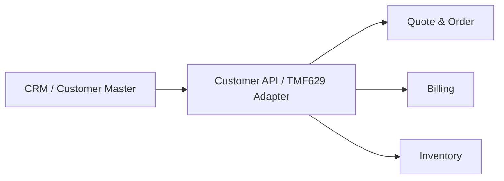
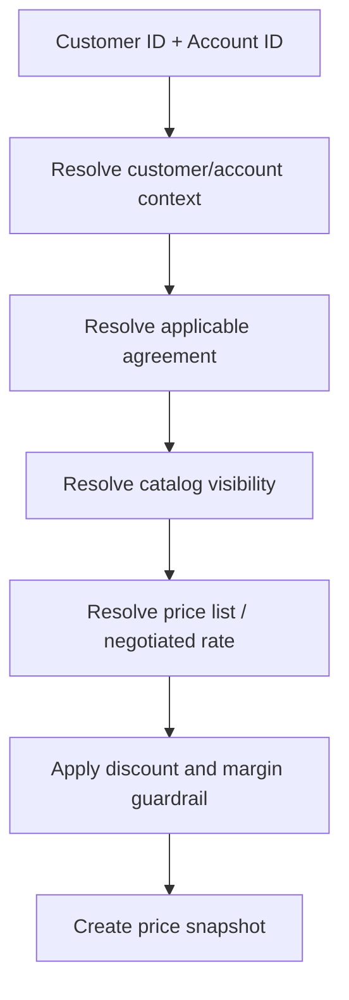

# Part 014 — TMF629 Customer Management

## 1. Tujuan Part Ini

Part ini membahas **TMF629 Customer Management** dari sudut pandang engineer Quote & Order.

TM Forum secara publik menjelaskan Customer Management API sebagai mekanisme standar untuk customer dan customer account management, termasuk creation, update, retrieval, deletion, dan event notification. Halaman user guide publik juga menjelaskan bahwa customer dapat berupa person, organization, atau service provider yang membeli produk dari enterprise. API ini mengelola data resource seperti `Customer` dan informasi terkait identification/financial information.

Dalam sistem CPQ/order management, customer data bukan sekadar nama di payload. Customer context memengaruhi:

- eligibility;
- catalog visibility;
- pricing;
- enterprise agreement;
- approval authority;
- account hierarchy;
- tenant isolation;
- PII handling;
- order ownership;
- installed base;
- billing responsibility;
- supportability.

Prinsip utama:

> Customer context is not decoration. It is authority, ownership, eligibility, risk, and audit boundary.

---

## 2. Boundary: Public Standard vs Internal Implementation

### 2.1 Informasi publik yang aman digunakan

Informasi publik yang aman dijadikan orientasi:

- TMF629 adalah Customer Management API dalam keluarga TM Forum Open APIs.
- Halaman TMF629 v5 menjelaskan API ini menyediakan mekanisme standar untuk customer dan customer account management.
- Operasi yang disebut secara publik mencakup creation, update, retrieval, deletion, dan notification of events.
- Customer dapat berupa person, organization, atau service provider yang membeli produk dari enterprise.
- API mengelola data resource seperti Customer dan informasi identification/financial.
- Open API Directory menunjukkan TMF629 tersedia dalam keluarga API product/customer area dan memiliki v4/v5 availability.

### 2.2 Hal yang tidak boleh diasumsikan

Jangan mengasumsikan bahwa:

- Quote & Order adalah source of truth untuk customer;
- internal customer model identik dengan TMF629 `Customer`;
- customer, party, account, billing account, service account, dan tenant adalah hal yang sama;
- semua customer data boleh disalin ke order database;
- external customer ID cukup untuk authorization;
- customer update bisa langsung mengubah historical quote/order;
- customer deletion berarti hard delete data dari quote/order audit;
- TMF629 v5 pasti versi internal;
- TMF629 dipakai langsung tanpa anti-corruption layer;
- PII fields aman untuk log/debugging.

### 2.3 Internal verification checklist

Verifikasi:

- Siapa source of truth customer?
- Apakah TMF629 diekspos external, dipakai internal, atau hanya alignment vocabulary?
- Versi/profile TMF629 yang didukung?
- Apa perbedaan internal `customer`, `account`, `party`, `tenant`, dan `billing account`?
- Apakah customer data direplikasi ke Quote & Order?
- Jika direplikasi, apa freshness SLA-nya?
- Bagaimana customer ID external dipetakan ke internal ID?
- Bagaimana PII diklasifikasikan dan dimasking?
- Apakah customer/account update memicu event ke quote/order?
- Bagaimana cross-tenant access dicegah?
- Bagaimana historical quote/order mempertahankan audit saat customer berubah?

---

## 3. Customer Is Not Just a Name

Dalam enterprise quote/order system, customer context menjawab:

```text
Who is buying?
Who is legally responsible?
Who is billed?
Who can approve?
Who can request change?
Which agreement applies?
Which catalog is visible?
Which prices are allowed?
Which installed products belong to this customer/account?
Which tenant boundary applies?
Which support and audit policy applies?
```

Jika sistem hanya menyimpan:

```text
customerName = "Acme Corp"
```

maka sistem tidak cukup kuat untuk enterprise CPQ/order.

Minimal mental model:

```text
Party
  -> Person / Organization

Customer
  -> Party in role of buyer/customer

Account
  -> Commercial or billing grouping under customer

Agreement
  -> Commercial contract/terms applying to customer/account

Tenant
  -> Deployment/security/isolation boundary

Product Inventory
  -> Installed products owned/used by customer/account
```

Do not collapse all of these into one string.

---

## 4. Party, Customer, Account, and Tenant

### 4.1 Party

Party represents a real-world actor:

- individual/person;
- organization;
- group;
- partner;
- service provider.

Party answers:

```text
Who exists in the real world?
```

### 4.2 Customer

Customer is usually party in a commercial role.

Customer answers:

```text
Who buys products from the enterprise?
```

A party can have multiple roles. An organization could be:

- customer;
- partner;
- supplier;
- reseller;
- service provider.

### 4.3 Account

Account is a grouping for commercial, billing, operational, or hierarchy purposes.

Account answers:

```text
Under which commercial/billing/operational grouping does this transaction happen?
```

Possible account types:

- customer account;
- billing account;
- service account;
- enterprise hierarchy node;
- cost center;
- regional account.

Exact account model must be verified internally.

### 4.4 Tenant

Tenant is a system isolation boundary.

Tenant answers:

```text
Which customer/operator/deployment boundary controls data access and configuration?
```

Do not confuse tenant with customer.

In B2B SaaS or managed deployments:

```text
Tenant = CSP/operator/customer deployment boundary
End customer = subscriber/enterprise buying telecom products from CSP
```

In on-prem/dedicated deployment:

```text
Tenant may be implicit or mapped differently.
```

Internal verification is mandatory.

---

## 5. Why Customer Context Matters to Quote and Order

### 5.1 Eligibility

Customer context determines what can be offered.

Examples:

```text
Enterprise customer can buy private network.
Small business customer cannot buy product requiring enterprise agreement.
Customer in region A cannot buy product available only in region B.
Customer under suspended status cannot place new order.
```

### 5.2 Pricing

Pricing may depend on:

- customer segment;
- account tier;
- contract term;
- enterprise agreement;
- negotiated rates;
- location;
- volume commitment;
- sales channel;
- tax/billing context.

### 5.3 Approval

Approval may depend on:

- customer strategic tier;
- discount size;
- margin threshold;
- contract exception;
- account owner;
- sales region;
- legal requirement.

### 5.4 Installed base

Modify/delete orders require knowing what customer already owns.

```text
Customer/account -> ProductInventory lookup -> allowed modifications -> order item validation
```

### 5.5 Audit

Historical quote/order must preserve enough customer context to answer:

```text
At the time of quote/order, who was the customer/account?
Which agreement was applied?
Who had authority?
What data was used?
```

---

## 6. Customer Source of Truth

Quote & Order systems often should not be customer master.

Possible source-of-truth patterns:

### 6.1 External CRM/customer master is source of truth



Pros:

- single ownership;
- fewer duplicate updates;
- CRM remains customer authority.

Cons:

- dependency on external availability;
- need caching/snapshot;
- consistency challenges.

### 6.2 Quote & Order stores customer snapshot

```text
Order stores customer reference + snapshot fields used at order time.
```

Pros:

- historical audit stable;
- order display resilient to customer changes;
- downstream payload can include point-in-time context.

Cons:

- PII duplication;
- stale data;
- data retention complexity;
- correction workflow needed.

### 6.3 Quote & Order owns limited customer profile

Sometimes product has local customer/account model for domain-specific needs.

Risk:

- duplicated master data;
- inconsistent updates;
- unclear ownership;
- difficult enterprise integration.

Senior engineer should ask:

```text
Is this field authoritative here, cached here, derived here, or merely displayed here?
```

---

## 7. Reference vs Snapshot

Customer data in quote/order can be represented as reference, snapshot, or both.

### 7.1 Reference

```json
{
  "customerRef": {
    "id": "CUST-123",
    "href": "/customer/CUST-123"
  }
}
```

Pros:

- avoids duplication;
- latest customer data can be fetched;
- clear source of truth.

Cons:

- historical quote may change display unexpectedly;
- external system dependency;
- customer deletion/status change complicates audit.

### 7.2 Snapshot

```json
{
  "customerSnapshot": {
    "id": "CUST-123",
    "displayName": "Acme Corp",
    "segment": "Enterprise",
    "accountId": "ACC-456",
    "capturedAt": "2026-07-08T10:00:00Z"
  }
}
```

Pros:

- preserves historical context;
- improves audit;
- reduces runtime dependency.

Cons:

- duplicates data;
- PII risk;
- requires retention/redaction policy;
- can become stale.

### 7.3 Best practical strategy

For quote/order:

```text
Use authoritative references for current operations.
Use minimal snapshots for historical/audit/commercial basis.
Never snapshot more PII than needed.
```

---

## 8. Customer Account Hierarchy

Enterprise/telco customers often have hierarchy:

```text
Global Customer: Acme Group
  Region: APAC
    Country: Indonesia
      Account: Enterprise Sales Account
      Billing Account: Acme Indonesia Billing
      Service Account: Jakarta HQ
  Region: EMEA
    ...
```

This matters because:

- agreement may apply at parent level;
- pricing may apply at group level;
- billing account may be child-specific;
- installed base may be under service account;
- approver may belong to region;
- order permission may depend on account ownership.

Do not use only `customerId` if the actual business action needs account context.

Bad:

```text
createOrder(customerId, productOfferingId)
```

Better:

```text
createOrder(tenantId, customerId, accountId, billingAccountId, agreementId, productOfferingId, requestedAction)
```

Exact fields depend on internal domain.

---

## 9. Customer Lifecycle and Its Impact

Customer lifecycle state may include concepts like:

```text
prospect
active
suspended
closed
blacklisted
merged
inactive
```

Do not assume exact values. Verify internal and TMF profile.

### 9.1 Lifecycle effects

Examples:

```text
Prospect:
- quote allowed
- order may require conversion to active customer

Active:
- quote/order allowed

Suspended:
- new order blocked
- payment-related changes may be allowed
- disconnect may be allowed

Closed:
- new quote/order blocked
- historical view allowed

Merged:
- redirect to surviving customer
- historical records preserved
```

### 9.2 PR review question

When customer status is used in logic, ask:

- Is status fresh enough?
- Is status authoritative?
- What happens if status changes between quote and order?
- Are historical quotes invalidated?
- Are in-flight orders cancelled, held, or allowed?
- Is customer merge handled?

---

## 10. Customer Merge, Split, and Identity Mapping

Enterprise customer data is messy.

Possible events:

```text
Customer merged into another customer.
Customer split into multiple accounts.
External ID changed.
Legal entity name changed.
Billing account migrated.
Customer hierarchy reorganized.
```

Quote/order system must decide:

- Does historical quote keep old customer reference?
- Does current order follow merged customer?
- Can in-flight order survive customer merge?
- Are external references updated?
- How is audit preserved?
- How are downstream systems notified?

A defensible approach:

```text
Historical records preserve original reference and snapshot.
Operational reads resolve alias/merge mapping through customer master.
New orders use surviving/current customer/account.
Audit records merge event and decision basis.
```

Internal behavior must be verified.

---

## 11. PII and Sensitive Data Boundary

Customer management can involve sensitive data:

- name;
- contact details;
- government/national ID;
- tax ID;
- address;
- email;
- phone;
- financial status;
- credit rating;
- billing details;
- contract contact;
- user identity.

Rules for Quote & Order engineering:

```text
Do not log PII by default.
Do not put PII in Kafka events unless required and approved.
Do not duplicate PII into snapshots without purpose.
Do not expose PII in error messages.
Do not include sensitive customer data in metric labels.
Do not store access tokens or identity documents in order notes.
```

### 11.1 Masking example

Bad log:

```text
Failed to create order for customer John Doe, email john.doe@example.com, nationalId 123456
```

Better log:

```text
Failed to create order tenant=T1 customerId=C123 accountId=A456 reason=CUSTOMER_STATUS_BLOCKED correlationId=...
```

### 11.2 Internal verification checklist

Verify:

- PII classification policy;
- log redaction library;
- Kafka event PII rules;
- retention policy;
- right-to-erasure/legal hold handling;
- customer data export policy;
- production support access policy.

---

## 12. Tenant Isolation and Customer Access

Customer ID alone is not enough.

Every customer read/write should be scoped:

```text
tenant_id + customer_id
```

Often also:

```text
tenant_id + customer_id + account_id
```

Risky query:

```sql
SELECT * FROM customer_snapshot WHERE customer_id = #{customerId};
```

Safer query:

```sql
SELECT *
FROM customer_snapshot
WHERE tenant_id = #{tenantId}
  AND customer_id = #{customerId};
```

High-risk bug:

```text
Customer IDs are globally unique in one environment but not in another.
A query missing tenant predicate passes tests and leaks data in multi-tenant deployment.
```

Tests must include same customer/account-like IDs across tenants.

---

## 13. Customer Data in Kafka Events

Customer-related events can be useful but dangerous.

### 13.1 Event types

Possible events:

```text
CustomerCreated
CustomerUpdated
CustomerStatusChanged
CustomerAccountCreated
CustomerAccountUpdated
CustomerMerged
CustomerDeletedOrAnonymized
```

Quote/order may consume these to update cache/read model or invalidate stale context.

### 13.2 Payload strategy

Prefer minimal event payload:

```json
{
  "eventType": "CustomerStatusChanged",
  "tenantId": "T1",
  "customerId": "C123",
  "oldStatus": "ACTIVE",
  "newStatus": "SUSPENDED",
  "occurredAt": "2026-07-08T10:00:00Z",
  "correlationId": "..."
}
```

Avoid full customer profile unless required.

### 13.3 Consumer behavior

If Quote & Order consumes customer updates:

- updates must be idempotent;
- out-of-order events must be handled;
- customer version/timestamp should be checked;
- stale cache should be invalidated;
- in-flight quote/order impact should be explicit;
- PII changes should not rewrite audit snapshots blindly.

---

## 14. Customer Context in Pricing and Agreement Resolution

Pricing engine often needs customer/account/agreement context.

Conceptual flow:



Failure modes:

- wrong agreement selected;
- parent account agreement ignored;
- expired agreement still used;
- customer-specific price list missing;
- customer moved account during quote lifecycle;
- customer status changed after quote approval.

Mitigation:

- explicit agreement selection record;
- effective-date validation;
- price snapshot with basis;
- approval invalidation if context changes;
- reconciliation report for agreement/pricing mismatches.

---

## 15. Customer Context in Order Validation

Product order validation should verify:

```text
Customer exists.
Customer belongs to tenant.
Customer status allows requested action.
Account exists and belongs to customer.
Billing account is valid for order.
Agreement applies to customer/account.
Actor is allowed to order for this customer/account.
Installed product belongs to customer/account.
Product offering is eligible for customer/account.
```

Pseudo-code:

```java
public CustomerOrderContext resolveForOrder(
    TenantId tenantId,
    CustomerId customerId,
    AccountId accountId,
    Actor actor
) {
    Customer customer = customerClient.getCustomer(tenantId, customerId);
    require(customer.exists(), "Customer not found");
    require(customer.isOrderable(), "Customer status does not allow order");

    Account account = customerClient.getAccount(tenantId, accountId);
    require(account.belongsTo(customerId), "Account does not belong to customer");

    require(authorization.canCreateOrder(actor, customer, account), "Not allowed");

    return new CustomerOrderContext(customer, account);
}
```

Actual implementation may use local cache, adapter, or customer service.

---

## 16. Historical Audit and Customer Changes

Historical quote/order must survive customer changes.

Scenario:

```text
Quote created for Acme Telecom Ltd.
Customer legal name changes to Acme Digital Services Ltd.
Quote is accepted after name change.
```

Questions:

- Should quote display old name or current name?
- Which name appears on contract/PDF?
- Which name is sent to billing?
- Does approval need revalidation?
- Is audit able to show original and current context?

Common strategy:

```text
Reference current customer for operational actions.
Store snapshot of commercial identity used at quote/order time.
Store audit event when customer context is refreshed or changed.
```

Do not silently rewrite history.

---

## 17. Deletion, Anonymization, Retention, and Legal Hold

Customer API may include deletion operation, but enterprise systems rarely treat customer deletion as simple hard delete.

Consider:

- regulatory retention;
- contract retention;
- financial audit;
- legal hold;
- billing disputes;
- support history;
- PII minimization;
- anonymization;
- soft delete.

Quote/order implication:

```text
Historical order cannot simply vanish if it is needed for audit or billing evidence.
PII may need to be removed/masked while business record remains.
```

Internal verification is mandatory:

- retention policy;
- deletion/anonymization process;
- legal hold rules;
- audit record treatment;
- customer export process;
- data subject request process if applicable.

---

## 18. API Design: Customer Reference in Quote/Order

A quote/order API should avoid ambiguous customer context.

Weak request:

```json
{
  "customerName": "Acme",
  "productOfferingId": "PO-1"
}
```

Better request:

```json
{
  "customer": {
    "id": "CUST-123"
  },
  "account": {
    "id": "ACC-456"
  },
  "agreement": {
    "id": "AGR-789"
  },
  "productOrderItem": [
    {
      "action": "add",
      "productOffering": {
        "id": "PO-1"
      }
    }
  ]
}
```

But API shape depends on TMF version/profile and internal contract.

Design rule:

> The API should capture enough customer context to avoid guessing, but not duplicate the whole customer master.

---

## 19. Error Model for Customer Context

Customer-related errors must be precise.

Categories:

```text
CUSTOMER_NOT_FOUND
CUSTOMER_NOT_ACCESSIBLE
CUSTOMER_STATUS_BLOCKED
ACCOUNT_NOT_FOUND
ACCOUNT_NOT_UNDER_CUSTOMER
BILLING_ACCOUNT_INVALID
AGREEMENT_NOT_APPLICABLE
CUSTOMER_CONTEXT_STALE
TENANT_SCOPE_VIOLATION
PII_ACCESS_DENIED
```

Example:

```json
{
  "code": "ACCOUNT_NOT_UNDER_CUSTOMER",
  "message": "Account ACC-456 is not valid for customer CUST-123.",
  "target": "account.id",
  "correlationId": "..."
}
```

Avoid exposing sensitive details:

```text
Customer exists in another tenant.
```

Prefer:

```text
Customer not found or not accessible.
```

---

## 20. PostgreSQL Model Considerations

If Quote & Order keeps customer snapshots/cache, possible tables:

```text
customer_reference_cache
customer_account_reference_cache
customer_snapshot_on_quote
customer_snapshot_on_order
customer_context_event_log
customer_alias_mapping
```

### 20.1 Reference cache

```sql
CREATE TABLE customer_reference_cache (
    tenant_id text NOT NULL,
    customer_id text NOT NULL,
    display_name text NOT NULL,
    status text NOT NULL,
    segment text,
    source_version text,
    source_updated_at timestamptz,
    cached_at timestamptz NOT NULL,
    PRIMARY KEY (tenant_id, customer_id)
);
```

### 20.2 Snapshot table

```sql
CREATE TABLE order_customer_snapshot (
    tenant_id text NOT NULL,
    order_id uuid NOT NULL,
    customer_id text NOT NULL,
    account_id text,
    display_name text,
    segment text,
    captured_at timestamptz NOT NULL,
    PRIMARY KEY (tenant_id, order_id)
);
```

These are conceptual examples, not internal schema claims.

### 20.3 Data minimization

Before adding a field, ask:

```text
Is this field needed for current operation?
Is this field needed for audit?
Is this field PII?
Can it be fetched on demand instead?
What is retention requirement?
Who can view it?
Will it appear in logs/events/backups?
```

---

## 21. MyBatis Mapper Considerations

Customer/account lookups must be tenant-safe.

Risky mapper:

```xml
<select id="findCustomer" resultType="CustomerRecord">
  SELECT * FROM customer_reference_cache
  WHERE customer_id = #{customerId}
</select>
```

Safer mapper:

```xml
<select id="findCustomer" resultType="CustomerRecord">
  SELECT tenant_id,
         customer_id,
         display_name,
         status,
         segment,
         source_version,
         cached_at
  FROM customer_reference_cache
  WHERE tenant_id = #{tenantId}
    AND customer_id = #{customerId}
</select>
```

For account validation:

```xml
<select id="findAccountForCustomer" resultType="AccountRecord">
  SELECT tenant_id,
         account_id,
         customer_id,
         status,
         account_type
  FROM customer_account_reference_cache
  WHERE tenant_id = #{tenantId}
    AND customer_id = #{customerId}
    AND account_id = #{accountId}
</select>
```

Every customer/account query should be reviewed for tenant scoping and PII minimization.

---

## 22. Observability for Customer Context

Logs should help debug without leaking sensitive data.

Include:

```text
tenant_id
customer_id
account_id
operation
correlation_id
causation_id
source_system
context_version/cache_age
```

Avoid:

```text
full name
email
phone
address
national ID
tax ID
free-form notes with sensitive content
```

Metrics:

```text
customer_lookup_latency
customer_lookup_failure_total
customer_cache_age_seconds
customer_context_stale_total
customer_status_blocked_order_total
customer_account_validation_failure_total
cross_tenant_access_denied_total
```

Dashboard questions:

- Is customer master slow/unavailable?
- Are quote/order failures caused by customer lookup?
- Is cache stale?
- Are customer status blocks increasing?
- Are account validation failures caused by integration data drift?

---

## 23. Security Review for Customer Management

Security risks:

```text
Cross-tenant customer lookup.
IDOR: user guesses customer ID and reads/uses it.
PII leakage through logs/events/errors.
Unauthorized order for customer account.
Over-broad admin role.
Customer data exported through report endpoint.
Customer update event rewrites protected historical data.
```

Controls:

- tenant-scoped queries;
- object-level authorization;
- deny-by-default;
- PII redaction;
- audit access to sensitive data;
- field-level filtering;
- negative tests;
- support access governance.

PR review question:

```text
Can a user with valid token but wrong account relationship use this endpoint to infer or modify customer data?
```

---

## 24. Testing Strategy

### 24.1 Unit tests

Test:

- customer status rule;
- account belongs-to-customer validation;
- agreement applicability;
- PII masking function;
- authorization guard;
- snapshot creation;
- stale context handling.

### 24.2 Integration tests

Test:

- customer lookup adapter failure;
- cache fallback behavior;
- tenant-scoped DB query;
- customer update event consumer;
- out-of-order customer events;
- customer merge/alias mapping.

### 24.3 Contract tests

Test:

- TMF629 profile shape;
- OpenAPI compatibility;
- optional field tolerance;
- event schema compatibility;
- error response contract.

### 24.4 Security tests

Test:

- same customer ID in two tenants;
- user can access customer A but not customer B;
- account from another customer rejected;
- PII absent from logs;
- PII absent from metrics labels;
- sensitive field hidden for unauthorized role.

---

## 25. Common Failure Modes

### 25.1 Wrong customer/account used for quote

Cause:

- ambiguous external ID;
- missing account validation;
- stale CRM cache;
- UI sends display name only.

Impact:

- wrong pricing;
- wrong agreement;
- wrong approval;
- wrong billing/order ownership.

Detection:

- quote account mismatch report;
- agreement mismatch;
- customer support complaint;
- audit inconsistency.

Mitigation:

- require stable customer/account IDs;
- validate account ownership;
- snapshot basis;
- approval invalidation.

### 25.2 Cross-tenant customer leak

Cause:

- query missing tenant predicate;
- globally unique ID assumed but false;
- cache key missing tenant;
- integration adapter not scoped.

Impact:

- severe security incident;
- customer trust damage;
- compliance exposure.

Detection:

- access logs;
- anomaly detection;
- negative tests;
- audit review.

Mitigation:

- tenant in primary key/cache key;
- object-level authorization;
- automated tests with duplicate IDs across tenants;
- secure code review checklist.

### 25.3 Historical quote changes after customer update

Cause:

- quote displays live customer profile only;
- no snapshot;
- customer update overwrites historical fields.

Impact:

- audit inconsistency;
- contract/PDF mismatch;
- dispute resolution difficulty.

Mitigation:

- immutable quote/order snapshot;
- separate live display from historical basis;
- audit customer context refresh.

### 25.4 PII leaked to logs or Kafka

Cause:

- logging request body;
- full customer payload in event;
- exception includes sensitive field;
- metric label uses email/name.

Impact:

- compliance incident;
- retention and deletion complexity;
- unauthorized data exposure.

Mitigation:

- structured logging with allowlist;
- event payload minimization;
- redaction tests;
- log access governance.

---

## 26. PR Review Checklist for TMF629/Customer Context Changes

Ask:

### Domain correctness

- Is this customer field authoritative, cached, derived, or snapshot?
- Is account relationship validated?
- Does customer status affect quote/order correctly?
- Does agreement resolution use correct account hierarchy?
- Is historical behavior defined when customer changes?

### API compatibility

- Is TMF629 profile/version clear?
- Are extensions documented?
- Are response changes backward compatible?
- Are sensitive fields exposed intentionally?
- Are error responses safe?

### Security

- Is tenant scope enforced?
- Is object-level authorization enforced?
- Could this endpoint leak customer existence?
- Is PII redacted from logs/errors/events?
- Are support/admin privileges audited?

### Data

- Is customer data duplicated unnecessarily?
- Is snapshot minimal?
- Is retention policy considered?
- Are cache keys tenant-safe?
- Are migrations safe for existing data?

### Integration

- What happens if customer master is down?
- Is cache fallback allowed?
- How stale can context be?
- Are customer update events idempotent?
- Is merge/alias behavior defined?

### Operations

- Can support trace customer context resolution?
- Are customer lookup failures visible?
- Is cache freshness observable?
- Is there a runbook for customer/account mismatch?

---

## 27. Internal Verification Checklist

Use this as onboarding worksheet:

```text
Source of truth
[ ] Identify customer master/source system.
[ ] Identify account master/source system.
[ ] Identify agreement master/source system.
[ ] Identify owner team.

API/profile
[ ] Find TMF629 API/controller if present.
[ ] Find OpenAPI specification.
[ ] Identify version/profile/extensions.
[ ] Identify consumers.

Model
[ ] Define internal difference between customer, party, account, tenant, billing account.
[ ] Locate customer reference/cache tables.
[ ] Locate quote/order customer snapshots.
[ ] Identify external/internal ID mapping.

Security
[ ] Verify tenant-scoped queries.
[ ] Verify object-level authorization.
[ ] Verify PII redaction.
[ ] Verify support/admin access audit.
[ ] Verify cross-tenant tests.

Integration
[ ] Identify customer lookup adapter.
[ ] Identify customer update events.
[ ] Identify cache freshness policy.
[ ] Identify customer merge/alias handling.
[ ] Identify fallback behavior when customer source is unavailable.

Operations
[ ] Find dashboard for customer lookup failures.
[ ] Find logs/traces for customer context resolution.
[ ] Find runbook for customer/account mismatch.
[ ] Review incidents related to customer data.
```

---

## 28. Exercises

### Exercise 1 — Map customer context

Pick one real/demo quote.

Map:

```text
Quote customer field -> customer master -> account -> agreement -> pricing context -> approval context -> order context
```

Mark what is reference vs snapshot.

### Exercise 2 — Same customer ID in two tenants

Design a test:

```text
Tenant T1 has customer C123.
Tenant T2 also has customer C123.
User in T1 tries to create quote/order for C123 under T2.
```

Expected:

- access denied or not found;
- no data leak;
- no customer existence inference;
- audit event recorded;
- logs contain IDs but no PII.

### Exercise 3 — Customer status changes between quote and order

Scenario:

```text
Quote approved while customer is active.
Before quote conversion, customer becomes suspended.
```

Answer:

- Can quote be converted?
- Does approval remain valid?
- Is revalidation required?
- What error should be returned?
- What audit event is required?

### Exercise 4 — Customer legal name change

Scenario:

```text
Customer legal name changes after quote generation but before order completion.
```

Answer:

- Which name appears in quote PDF?
- Which name appears in order status?
- Which name goes to billing?
- What snapshot is preserved?
- What event is emitted?

---

## 29. Key Takeaways

- TMF629 is a useful customer/account management contract/vocabulary, but it should not be assumed to be the internal customer model.
- Customer context controls eligibility, pricing, approval, account ownership, tenant isolation, audit, and installed base validation.
- Customer, party, account, tenant, billing account, and agreement are different concepts and must not be collapsed casually.
- Quote/order systems usually need references to authoritative customer data plus minimal historical snapshots.
- PII minimization, tenant scoping, object-level authorization, and audit are central engineering concerns.
- Senior engineers should review customer-context changes for domain correctness, security, data retention, integration failure, and production supportability.

---

## 30. Source Notes

Public sources used for orientation:

- TM Forum Customer Management API TMF629 v5 public page describes the API as a standardized mechanism for customer and customer account management, including creation, update, retrieval, deletion, and event notification.
- TM Forum TMF629 user guide public page describes customer as a person, organization, or another service provider that buys products from an enterprise.
- TM Forum TMF629 public pages describe management of customer-related resources and identification/financial information.
- TM Forum Open API Directory lists Customer Management API TMF629 among Open APIs and shows v4/v5 availability.

These sources describe public standard positioning. They do not reveal or prove CSG internal implementation details.
