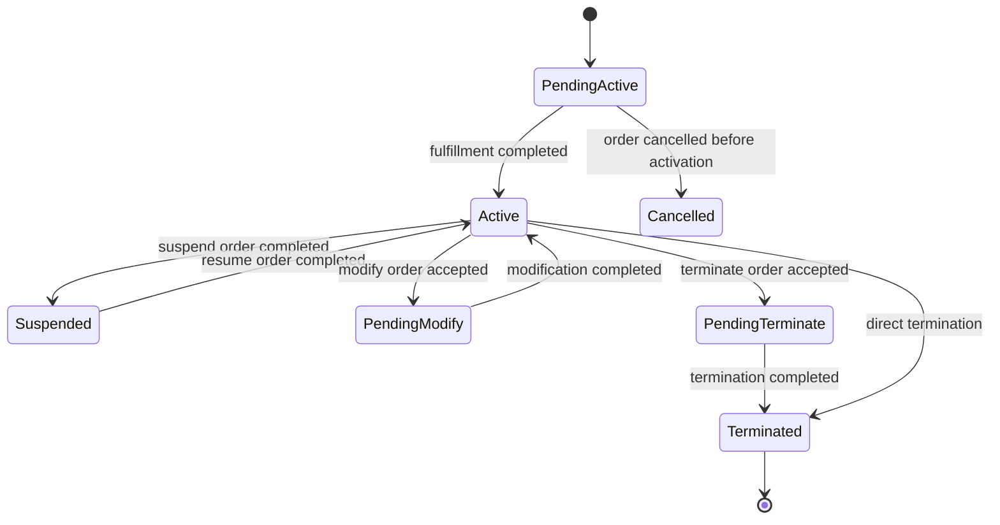
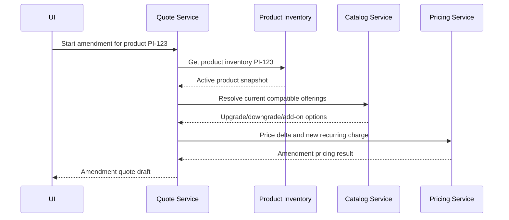
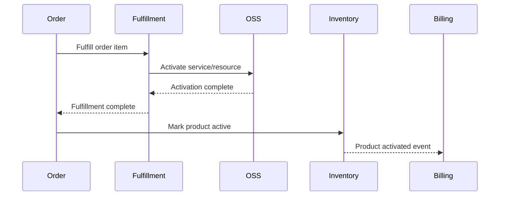

# Part 015 — TMF637 Product Inventory

## 1. Tujuan Part Ini

Part ini membahas **TMF637 Product Inventory Management** dari sudut pandang engineer Quote & Order.

Dalam CPQ dan order management enterprise, product inventory bukan hanya daftar produk. Product inventory adalah representasi **installed base**: produk yang sudah dimiliki, sedang aktif, pernah aktif, sedang dimodifikasi, sedang dipindahkan, atau sedang dihentikan untuk customer/account tertentu.

TM Forum secara publik menjelaskan Product Inventory API sebagai mekanisme standar untuk product inventory management, termasuk creation, partial/full update, retrieval of product representation in inventory, dan event notification terkait product lifecycle.

Dalam konteks Quote & Order, product inventory memengaruhi:

- amendment;
- upgrade;
- downgrade;
- add-on eligibility;
- renewal;
- migration;
- cancellation;
- product relationship;
- installed base validation;
- customer care;
- product-to-service traceability;
- billing/fulfillment reconciliation.

Prinsip utama:

> Product catalog describes what can be sold. Product inventory describes what has been sold, instantiated, and is now part of customer reality.

---

## 2. Boundary: Public Standard vs Internal Implementation

### 2.1 Informasi publik yang aman digunakan

Informasi publik yang aman dijadikan orientasi:

- TMF637 adalah Product Inventory Management API dalam keluarga TM Forum Open APIs.
- Halaman publik TMF637 v5 menjelaskan API ini menyediakan mekanisme standar untuk product inventory management.
- Operasi yang disebut secara publik mencakup creation, partial/full update, dan retrieval atas representation of product in inventory.
- API juga mendukung notification of events related to product lifecycle.
- User guide v5.0.0 secara publik menyebut specification of REST API for Product Inventory Management, model definition, dan available operations.
- Open API Directory menunjukkan TMF637 tersedia untuk v4 dan v5.

### 2.2 Hal yang tidak boleh diasumsikan

Jangan mengasumsikan bahwa:

- Quote & Order adalah source of truth untuk product inventory;
- product inventory berada di database yang sama dengan quote/order;
- internal product instance model identik dengan TMF637 `Product`;
- `Product` inventory sama dengan catalog `ProductOffering`;
- inventory update selalu synchronous;
- inventory selalu fresh saat quote dibuat;
- inventory lookup cukup untuk authorization;
- inventory record boleh di-hard-delete saat cancellation;
- TMF637 v5 pasti versi yang dipakai internal;
- TMF637 dipakai langsung tanpa anti-corruption layer;
- product inventory sama dengan service inventory;
- product inventory sama dengan network/resource inventory;
- product inventory adalah reservation system.

### 2.3 Internal verification checklist

Verifikasi:

- Apakah Quote & Order membaca product inventory langsung, via adapter, via cached read model, atau via external system.
- System of record untuk product inventory.
- Version TMF637 yang didukung.
- Mapping internal product instance ke TMF637 `Product`.
- Apakah installed base disimpan sebagai snapshot di quote/order.
- Apakah inventory update berasal dari order completion, fulfillment event, billing event, atau OSS event.
- Event yang dipakai untuk inventory change.
- Consistency SLA inventory lookup.
- Product relationship model.
- Tenant scoping untuk inventory.
- Authorization rule saat membaca inventory customer.
- Amendment flow yang memakai existing product.
- Cancellation/termination semantics.
- Data retention policy untuk disconnected/terminated product.
- Reconciliation process antara order, inventory, billing, dan fulfillment.

---

## 3. Mental Model: Catalog vs Quote vs Order vs Inventory

Empat konsep ini sering tertukar:

```text
Catalog        = definition of what may be sold
Quote          = proposed commercial commitment
Order          = accepted execution request
Inventory      = record of instantiated customer product
```

Contoh:

```text
Catalog:
  ProductOffering: Enterprise Fiber 1Gbps
  Price: recurring 1000/month
  Characteristics: bandwidth, SLA, access type

Quote:
  Customer A wants Enterprise Fiber 1Gbps at Site X
  Discount: 10%
  Contract term: 36 months

Order:
  Fulfill quoted Enterprise Fiber 1Gbps at Site X
  Action: add
  Requested completion date: 2026-08-01

Inventory:
  Customer A owns active Enterprise Fiber 1Gbps at Site X
  Product instance ID: PI-123
  Status: active
  Start date: 2026-08-01
  Related services: CFS-456
```

Catalog is possible reality.
Quote is negotiated intent.
Order is execution commitment.
Inventory is customer reality.

---

## 4. Why Product Inventory Matters to Quote & Order

Product inventory matters because many enterprise/telco orders are not greenfield.

A quote may ask:

```text
Add a new product.
```

But many real flows ask:

```text
Upgrade existing product.
Downgrade existing product.
Move existing product.
Suspend existing product.
Resume existing product.
Terminate existing product.
Replace existing product.
Bundle new add-on with existing base product.
Renew existing contract.
Amend existing agreement.
```

These flows require knowing what the customer already has.

Without product inventory, the system cannot reliably answer:

- Does the customer already own this product?
- Is the product active?
- Is the product still under contract?
- Is the product eligible for upgrade?
- Is the product part of a bundle?
- Is the product already pending cancellation?
- Which account owns it?
- Which service/resource fulfills it?
- Is another order already modifying it?

---

## 5. Installed Base as a Business Constraint

Installed base is not only informational. It is a constraint source.

Examples:

```text
Customer cannot add static IP add-on unless base connectivity product is active.
Customer cannot downgrade during minimum contract term without penalty.
Customer cannot cancel a child product while required parent bundle remains active.
Customer cannot create two active mutually-exclusive products on the same site.
Customer cannot amend product already under in-flight modification order.
```

A senior engineer should ask:

> Which invariants depend on current installed base, and what happens if installed base is stale?

---

## 6. Product Inventory Is Not Product Catalog

### 6.1 Catalog object

Catalog object answers:

```text
What can be sold?
How is it configured?
What price rules apply?
What characteristics exist?
Which products can be bundled?
```

### 6.2 Inventory object

Inventory object answers:

```text
What does this customer own?
When did it start?
What state is it in?
Which product offering/specification created it?
Which services/resources realize it?
What relationships does it have?
Which order created or changed it?
```

### 6.3 Common bug

A common design bug is to use product offering ID as if it were product instance ID.

Wrong:

```text
Terminate ProductOffering: enterprise-fiber-1gbps
```

Correct:

```text
Terminate Product instance PI-123 owned by Customer A at Site X,
created from ProductOffering enterprise-fiber-1gbps version 2026.04,
currently active and eligible for termination.
```

---

## 7. Product Inventory Is Not Service Inventory

In telco systems:

```text
Product inventory = customer-facing commercial product instance
Service inventory = instantiated service capability, often CFS/RFS oriented
Resource inventory = physical/logical network resource assignment
```

Example:

```text
Product Inventory:
  Enterprise Fiber 1Gbps for Customer A

Service Inventory:
  Internet Access Service at Site X

Resource Inventory:
  ONT device, fiber port, VLAN, IP block, circuit ID
```

Do not collapse them.

A product can map to multiple services.
A service can use multiple resources.
A product lifecycle may differ from technical resource lifecycle.

---

## 8. Product Inventory Is Not Reservation

Inventory record describes instantiated product reality.

Reservation answers:

```text
Can this resource/capacity/number/device be held for a future order?
```

Product inventory should not become a generic reservation system unless the architecture explicitly defines it so.

Internal verification:

- Is there resource reservation?
- Is there service qualification?
- Is there product offering qualification?
- Is there inventory availability check?
- Which API/system owns each one?

---

## 9. TMF637 Resource Framing

At a high level, TMF637 revolves around product instances in inventory.

A product inventory resource often contains concepts like:

```text
Product
  id
  href
  name
  status
  startDate
  terminationDate
  productOffering reference
  productSpecification reference
  productCharacteristic[]
  productRelationship[]
  relatedParty[]
  billingAccount reference
  place[]
  realizingService[]
  realizingResource[]
```

Exact fields depend on API version and internal implementation.
Always verify with the OpenAPI specification actually used by the team.

---

## 10. The Product Instance Lifecycle

A practical product inventory lifecycle may look like:



Do not assume these are the internal states.
Use this as a reasoning model.

Internal verification:

- What states exist?
- Which transitions are legal?
- Which actor/system can transition state?
- Are pending states represented in inventory or only in order?
- Is there a lock while modification order is in-flight?
- Are historical product versions preserved?

---

## 11. Product Inventory and In-Flight Orders

The hardest design area is not active inventory. It is inventory under change.

Example:

```text
Product PI-123 is active.
Order O-100 modifies PI-123 from 500Mbps to 1Gbps.
Before O-100 completes, user creates Order O-101 to terminate PI-123.
```

Questions:

- Should O-101 be allowed?
- Should O-101 wait?
- Should O-101 cancel O-100?
- Should O-101 be rejected?
- Which system owns the lock?
- Does inventory status change to pendingModify?
- Does order table maintain modification lock separately?

Never treat product inventory as static read data in order systems.

---

## 12. Source of Truth Patterns

### 12.1 External inventory as source of truth

```text
Quote & Order --> Inventory API --> External Inventory System
```

Pros:

- clear ownership;
- less duplication;
- consistent with customer care/OSS;
- lower risk of conflicting inventory records.

Cons:

- quote/order latency depends on external system;
- availability risk;
- stale cache risk if replicated;
- harder local testing;
- integration failure affects CPQ flow.

### 12.2 Local replicated inventory read model

```text
Inventory Events --> Quote & Order Read Model
```

Pros:

- fast lookup;
- local query flexibility;
- resilience to external API downtime;
- easier eligibility calculation.

Cons:

- eventual consistency;
- replay complexity;
- reconciliation required;
- duplicate/out-of-order events;
- source-of-truth confusion.

### 12.3 Local ownership

```text
Quote & Order owns product inventory directly
```

Pros:

- strong transaction boundary with order completion;
- simpler quote/order behavior;
- direct audit and lifecycle control.

Cons:

- may duplicate OSS/customer care inventory;
- harder integration with fulfillment/billing;
- higher ownership burden;
- risky if multiple systems update inventory.

A senior engineer should map the actual architecture, not infer it.

---

## 13. Reference vs Snapshot

When a quote or order uses inventory data, it must decide what to store.

### 13.1 Reference

```json
{
  "productInventoryId": "PI-123"
}
```

Good for:

- current lookup;
- small payload;
- clear ownership.

Bad for:

- historical audit;
- reproducibility;
- stale reference if inventory changes;
- external dependency during audit.

### 13.2 Snapshot

```json
{
  "productInventoryId": "PI-123",
  "productOfferingId": "enterprise-fiber-1gbps",
  "statusAtQuoteTime": "active",
  "bandwidthAtQuoteTime": "500Mbps",
  "siteAtQuoteTime": "Jakarta-HQ",
  "snapshotTimestamp": "2026-07-08T10:15:00Z"
}
```

Good for:

- audit;
- deterministic pricing;
- approval evidence;
- debugging;
- customer dispute resolution.

Bad for:

- payload bloat;
- PII leakage risk;
- stale snapshot misuse;
- schema evolution complexity.

### 13.3 Rule of thumb

Use reference for ownership and current lookup.
Use snapshot for business evidence.

---

## 14. Installed Base Validation in CPQ

A CPQ flow may need installed base validation:

```text
User selects add-on A.
System checks whether base product B is active.
System checks whether add-on A already exists.
System checks whether active contract permits add-on.
System checks whether no in-flight order conflicts.
```

Pseudo-code:

```java
InstalledBaseContext installedBase = inventoryClient.getInstalledBase(customerId, accountId);

EligibilityResult result = eligibilityEngine.evaluate(
    quoteRequest,
    catalogSnapshot,
    agreementSnapshot,
    installedBase
);

if (!result.isEligible()) {
    throw new QuoteValidationException(result.violations());
}
```

Important:

- Do not call inventory repeatedly inside nested pricing loops.
- Capture snapshot time.
- Capture inventory source/version if available.
- Handle unavailable inventory explicitly.

---

## 15. Inventory Unavailable: Fail Open or Fail Closed?

If inventory lookup fails during quote creation, what should happen?

Options:

### 15.1 Fail closed

Reject quote operation.

Good when:

- inventory is required for correctness;
- wrong quote can create expensive downstream failure;
- compliance/audit requires current installed base.

Bad when:

- inventory system is flaky;
- quote creation becomes unavailable;
- users cannot progress even for flows not needing installed base.

### 15.2 Fail open

Allow quote with warning or pending validation.

Good when:

- quote can be draft-only;
- validation can happen before submit/accept;
- business prefers sales continuity.

Bad when:

- invalid quote can be accepted;
- approval may rely on wrong assumptions;
- downstream order may fail later.

### 15.3 Degraded mode

Allow limited operations:

```text
Draft quote allowed.
Submit for approval blocked.
Quote acceptance blocked.
Order conversion blocked.
```

This is often the best enterprise trade-off.

---

## 16. Amendment Flow Using Product Inventory

A typical amendment starts from existing product instance.



Key design questions:

- Does amendment price full new product or delta from current product?
- Is contract term reset, extended, or preserved?
- Are existing discounts retained?
- Are penalties applied?
- Are pending product changes allowed?
- Is inventory snapshot immutable in the quote?

---

## 17. Product Relationship Model

Product inventory often needs relationships.

Examples:

```text
Bundle parent -> child add-on
Connectivity product -> static IP add-on
Mobile plan -> SIM product
Enterprise agreement product group -> individual service products
Old product -> replacement product
Product instance -> migrated product instance
```

Relationship bugs are dangerous.

Common failures:

- deleting child without validating parent;
- allowing duplicate child add-on;
- modifying parent without cascading validation;
- losing relationship during migration;
- creating cyclic relationships;
- confusing catalog relationship with inventory relationship.

Senior review question:

> Is this relationship definitional, commercial, lifecycle, dependency, or historical?

---

## 18. Product Inventory and Product Order Actions

Product order item actions often depend on existing inventory.

```text
action = add       -> creates new product inventory instance
action = modify    -> changes existing product inventory instance
action = delete    -> terminates existing product inventory instance
action = noChange  -> references existing product as dependency/context
```

The action should not be interpreted without product inventory context.

Example:

```json
{
  "action": "modify",
  "product": {
    "id": "PI-123",
    "productCharacteristic": [
      { "name": "bandwidth", "value": "1Gbps" }
    ]
  }
}
```

This means:

```text
Modify product instance PI-123 to desired state bandwidth=1Gbps.
```

It does not mean:

```text
Modify catalog offering enterprise-fiber.
```

---

## 19. Inventory Update Timing

When should inventory be updated?

### 19.1 At order acceptance

Bad default.

It may mark product active before fulfillment.

### 19.2 At fulfillment completion

Often safer.

```text
Order completed -> inventory product active
```

### 19.3 At intermediate fulfillment states

Useful for pending states:

```text
Order accepted -> inventory pendingActive
Fulfillment completed -> inventory active
```

### 19.4 Via external authoritative event

```text
Fulfillment system emits ServiceActivated
Inventory updates ProductActive
Order observes inventory updated
```

This can be correct but requires strong correlation and reconciliation.

---

## 20. Reconciliation Between Order and Inventory

Reconciliation is necessary when systems are distributed.

Examples:

```text
Order completed but inventory not active.
Inventory active but order still in progress.
Inventory terminated but billing still active.
Inventory active but service inventory missing.
Duplicate active product instances exist.
```

A reconciliation job may compare:

```text
product_order_item
product_inventory
billing_subscription
service_inventory
fulfillment_task
```

Expected output:

```text
Mismatch type
Severity
Customer/account/product identifier
Expected state
Actual state
Suggested remediation
Owner
Audit reference
```

---

## 21. Product Inventory Events

Inventory lifecycle should produce events if other systems depend on it.

Examples:

```text
ProductCreated
ProductActivated
ProductModified
ProductSuspended
ProductResumed
ProductTerminated
ProductRelationshipChanged
```

Event payload should include:

```text
productInventoryId
tenantId
customerId/accountId reference
productOfferingId/productSpecificationId reference
status
previousStatus
orderId/orderItemId if caused by order
correlationId
causationId
eventVersion
effectiveDate
eventTime
```

Avoid putting too much PII in events.

---

## 22. Event Ordering and Product Inventory

Inventory events must be ordered per product instance.

Bad partition key:

```text
customerId
```

May overload large enterprise customers.

Potential partition key:

```text
productInventoryId
```

Good for per-product ordering.

But if product relationships require grouped ordering, you may need:

```text
bundleRootProductId
accountId + relationshipGroupId
```

There is no universal answer. The key must follow the invariant.

---

## 23. Idempotency for Inventory Updates

Inventory updates often come from retries.

Example:

```text
FulfillmentCompleted event delivered twice.
```

Without idempotency, the system may:

- create duplicate product inventory;
- emit duplicate active events;
- double-trigger billing;
- corrupt audit history.

Use idempotency key such as:

```text
sourceSystem + sourceEventId
orderId + orderItemId + targetState
business operation ID
```

Pseudo-table:

```sql
create table processed_inventory_event (
    source_system text not null,
    source_event_id text not null,
    processed_at timestamptz not null default now(),
    product_inventory_id text,
    primary key (source_system, source_event_id)
);
```

---

## 24. PostgreSQL Model If Inventory Is Locally Stored

If the service owns or replicates inventory, a simplified relational model may look like:

```sql
create table product_inventory (
    id uuid primary key,
    tenant_id text not null,
    customer_id text not null,
    account_id text,
    product_offering_id text not null,
    product_specification_id text,
    status text not null,
    start_date timestamptz,
    termination_date timestamptz,
    created_by_order_id uuid,
    last_modified_by_order_id uuid,
    version bigint not null default 0,
    created_at timestamptz not null default now(),
    updated_at timestamptz not null default now()
);

create index idx_product_inventory_customer_status
    on product_inventory (tenant_id, customer_id, status);

create index idx_product_inventory_account_status
    on product_inventory (tenant_id, account_id, status);

create index idx_product_inventory_offering_status
    on product_inventory (tenant_id, product_offering_id, status);
```

For characteristics:

```sql
create table product_inventory_characteristic (
    product_inventory_id uuid not null references product_inventory(id),
    name text not null,
    value jsonb not null,
    primary key (product_inventory_id, name)
);
```

Trade-off:

- JSONB is flexible for characteristic value.
- It can become painful for query-heavy eligibility rules.
- Index only known hot characteristics.

---

## 25. Preventing Duplicate Active Products

Some products must be unique per account/site.

Example invariant:

```text
Only one active primary internet access product per site.
```

Potential enforcement:

```sql
create unique index uq_active_primary_access_per_site
on product_inventory (tenant_id, account_id, product_offering_id, site_id)
where status in ('active', 'pendingActive');
```

But beware:

- product offering version may change;
- equivalent offerings may not share same ID;
- site identity may come from external system;
- bundle products may allow multiples;
- migration period may temporarily allow old and new product.

This invariant may need domain logic plus DB guard.

---

## 26. Optimistic Locking for Product Modification

When modifying inventory:

```sql
update product_inventory
set status = 'pendingModify',
    version = version + 1,
    updated_at = now()
where id = :id
  and version = :expectedVersion;
```

If zero rows updated:

```text
Another command modified this product.
Reload and re-evaluate.
```

This prevents lost updates.

For high-contention products, explicit row lock may be needed:

```sql
select *
from product_inventory
where id = :id
for update;
```

Use carefully to avoid lock storms.

---

## 27. MyBatis Mapper Considerations

Example mapper boundary:

```java
public interface ProductInventoryMapper {
    ProductInventoryRecord findById(
        @Param("tenantId") String tenantId,
        @Param("id") UUID id
    );

    List<ProductInventoryRecord> findActiveByCustomer(
        @Param("tenantId") String tenantId,
        @Param("customerId") String customerId
    );

    int updateStatusWithVersion(
        @Param("tenantId") String tenantId,
        @Param("id") UUID id,
        @Param("expectedVersion") long expectedVersion,
        @Param("newStatus") String newStatus
    );
}
```

Review concerns:

- tenant filter present;
- no unbounded query;
- status filtering correct;
- pagination for large enterprise customers;
- characteristic query indexes;
- no string interpolation in dynamic SQL;
- transaction boundary clear.

---

## 28. Inventory Lookup Performance

Installed base lookup can become expensive.

Large customers may have:

```text
10 accounts
500 sites
10,000 product instances
50,000 characteristics
many active and terminated products
```

Avoid:

```text
Load all inventory for customer, filter in Java.
```

Prefer:

```text
Query by tenant + account/site + status + offering/spec/category.
```

Common indexes:

```text
tenant_id, customer_id, status
tenant_id, account_id, status
tenant_id, site_id, status
tenant_id, product_offering_id, status
tenant_id, external_inventory_id
```

Measure with `EXPLAIN ANALYZE` before adding indexes blindly.

---

## 29. Inventory Cache Strategy

Caching inventory is risky because installed base affects correctness.

Possible cache use:

- short-lived read cache for UI display;
- precomputed installed base summary;
- event-driven local read model;
- quote draft snapshot.

Avoid using stale cache for:

- order acceptance;
- amendment validation;
- cancellation eligibility;
- mutually exclusive product enforcement;
- approval threshold calculation if inventory affects price.

If cache is used, expose freshness:

```json
{
  "inventorySnapshotTime": "2026-07-08T10:15:00Z",
  "inventorySource": "external-product-inventory",
  "freshnessSeconds": 8
}
```

---

## 30. Security and Tenant Isolation

Inventory data is sensitive.

It can reveal:

- products owned;
- sites/locations;
- service status;
- contract relationships;
- customer infrastructure;
- operational footprint.

Rules:

- every inventory query must be tenant-scoped;
- customer/account authorization must be checked;
- inventory IDs must not be globally enumerable;
- logs must not dump full inventory payload;
- events must avoid unnecessary PII/location details;
- support/admin access must be audited.

PR review question:

> Can a user from tenant A infer anything about tenant B's installed base?

---

## 31. Audit and Evidence

Inventory lifecycle changes must be explainable.

For each product inventory change, capture:

```text
who/what caused it
source order/order item
previous state
new state
effective date
event timestamp
source system
correlation ID
causation ID
reason/statusReason
```

Business audit is different from debug log.

A debug log says:

```text
Updated product PI-123 to active.
```

Audit evidence says:

```text
Product PI-123 changed from pendingActive to active because service activation event SAE-789 was received for order O-456 item OI-1, processed by inventory-updater v2.3 at time T, under tenant X.
```

---

## 32. Product Inventory and Billing

Billing often depends on product inventory or related subscription records.

Questions:

- Does inventory activation trigger billing activation?
- Does billing activation trigger inventory activation?
- Are they both downstream of fulfillment completion?
- What happens if inventory active but billing failed?
- What happens if billing active but inventory terminated?
- Is effective date aligned?

Avoid hidden circular dependencies:

```text
Order waits for Inventory.
Inventory waits for Billing.
Billing waits for Order.
```

Define causality explicitly.

---

## 33. Product Inventory and Fulfillment

Fulfillment may create service/resource state first, then product inventory is updated.

Potential flow:



Alternative flow:

```text
Fulfillment emits activation event directly to Inventory.
Order observes Inventory event.
```

Both can work. The important thing is clear ownership and reconciliation.

---

## 34. Failure Mode Catalogue

### 34.1 Stale installed base

Symptom:

```text
Quote allows add-on although base product was terminated yesterday.
```

Detection:

- quote validation failure at order conversion;
- reconciliation mismatch;
- customer support complaint;
- inventory freshness metric.

Mitigation:

- validate again at submit/accept/convert;
- store snapshot time;
- block critical transitions if inventory stale.

### 34.2 Duplicate active product

Symptom:

```text
Two active primary products exist for same account/site.
```

Detection:

- uniqueness query;
- billing duplicate charge;
- reconciliation report.

Mitigation:

- DB partial unique index where possible;
- domain invariant;
- idempotent order completion.

### 34.3 Wrong tenant inventory exposure

Symptom:

```text
User sees product inventory belonging to another tenant/customer.
```

Detection:

- security test;
- audit anomaly;
- customer report.

Mitigation:

- tenant filter in every query;
- authorization guard;
- no cross-tenant cache key collision.

### 34.4 Inventory updated before fulfillment

Symptom:

```text
Product appears active but service is not provisioned.
```

Detection:

- order/inventory/service reconciliation;
- fallout dashboard;
- customer trouble ticket.

Mitigation:

- use pending states;
- update active only on fulfillment completion;
- repair workflow.

### 34.5 Event replay corrupts inventory

Symptom:

```text
Replay creates duplicate product or reverts status.
```

Detection:

- duplicate event processing count;
- product sequence violation;
- audit sequence anomaly.

Mitigation:

- idempotency key;
- product version check;
- event sequence guard.

---

## 35. Observability

Inventory observability should expose:

### 35.1 Business metrics

```text
active_product_count
pending_activation_count
pending_termination_count
inventory_update_count
inventory_reconciliation_mismatch_count
duplicate_active_product_count
```

### 35.2 Technical metrics

```text
inventory_lookup_latency
inventory_lookup_error_rate
inventory_event_consumer_lag
inventory_update_conflict_count
inventory_cache_freshness_seconds
inventory_replay_processed_count
```

### 35.3 Logs

Every important log should include:

```text
tenantId
customerId/accountId
productInventoryId
orderId/orderItemId
correlationId
causationId
state/status
sourceSystem
```

Avoid logging full characteristic payload if it contains sensitive values.

---

## 36. API Design If Exposing Inventory Internally

Internal API should be deliberate:

```http
GET /customers/{customerId}/products?status=active
GET /accounts/{accountId}/products?siteId=...
GET /product-inventory/{productInventoryId}
GET /product-inventory/{productInventoryId}/relationships
```

For command/update endpoints, be careful:

```http
PATCH /product-inventory/{id}
```

Generic PATCH may bypass lifecycle invariants.

Prefer domain commands when behavior matters:

```http
POST /product-inventory/{id}/suspend
POST /product-inventory/{id}/resume
POST /product-inventory/{id}/terminate
POST /product-inventory/{id}/mark-active
```

This makes authorization, audit, and transition validation explicit.

---

## 37. Anti-Corruption Layer

Do not let TMF637 external model leak everywhere.

Suggested layers:

```text
TMF637 DTO
  -> InventoryAdapter
  -> InstalledBaseSnapshot
  -> Domain validation/pricing/order logic
```

Domain model example:

```java
public record InstalledProduct(
    ProductInventoryId id,
    CustomerId customerId,
    AccountId accountId,
    ProductOfferingId offeringId,
    ProductStatus status,
    Map<String, CharacteristicValue> characteristics,
    Instant effectiveFrom,
    Optional<Instant> terminatedAt
) {
    public boolean isActive() {
        return status == ProductStatus.ACTIVE;
    }
}
```

The domain model should express business rules, not API transport quirks.

---

## 38. Testing Strategy

### 38.1 Unit tests

Test:

- eligibility based on installed base;
- illegal amendment target;
- duplicate add-on detection;
- product relationship validation;
- lifecycle transition rules.

### 38.2 Integration tests

Test:

- inventory lookup adapter;
- tenant-scoped queries;
- MyBatis mapper behavior;
- optimistic lock conflict;
- transaction rollback.

### 38.3 Contract tests

Test:

- TMF637-compatible payload mapping;
- nullable/missing fields;
- unknown enum values;
- extension fields;
- backward-compatible schema changes.

### 38.4 Event tests

Test:

- duplicate event;
- out-of-order event;
- replay;
- poison message;
- event version evolution.

### 38.5 Reconciliation tests

Test:

- order completed but inventory missing;
- inventory active but billing inactive;
- terminated product still in active order path;
- duplicated active product.

---

## 39. PR Review Checklist

When reviewing inventory-related PRs, ask:

### 39.1 Domain correctness

- Is this catalog object or inventory object?
- Is product offering ID confused with product instance ID?
- Are product relationships preserved?
- Are lifecycle transitions valid?
- Are pending/in-flight states handled?

### 39.2 Consistency

- Is inventory read fresh enough for this decision?
- Is validation repeated at critical transition?
- Are snapshots stored where evidence is needed?
- Is reconciliation possible?

### 39.3 Data safety

- Is tenant scoping enforced?
- Is PII/location data minimized?
- Are audit records complete?
- Is hard delete avoided for lifecycle history?

### 39.4 Integration

- Is TMF637 version assumed or verified?
- Are unknown fields/enums tolerated?
- Is adapter boundary clean?
- Is downstream failure handled?

### 39.5 Operations

- Are metrics/logs/traces sufficient?
- Is there a runbook for mismatch?
- Is replay safe?
- Is duplicate event processing idempotent?

---

## 40. Internal Verification Questions for Onboarding

Ask the team:

1. Which system owns product inventory?
2. Does Quote & Order maintain a local installed base read model?
3. What is the supported TMF637 version?
4. Is TMF637 used as external API, internal API, or mapping reference only?
5. How do amendments find existing product instances?
6. How are in-flight product modifications locked?
7. Does order completion create/update inventory?
8. Does fulfillment completion create/update inventory?
9. How are product relationships represented?
10. How are terminated products retained?
11. What are the highest-volume inventory lookup paths?
12. What are known inventory/order reconciliation issues?
13. Are inventory events replayable?
14. How is tenant isolation enforced?
15. What dashboard shows inventory health?

---

## 41. Mini Design Exercise: Add-On Eligibility

Scenario:

```text
Customer wants to buy Static IP add-on.
Static IP requires an active Internet Access product at the same site.
Customer has Internet Access product PI-100, but there is an in-flight termination order.
```

Design questions:

- Should the add-on quote be allowed as draft?
- Should submit/accept be blocked?
- Which inventory status matters?
- Should in-flight order state be consulted?
- What snapshot is stored?
- What error is shown to user?
- What audit record is created?

Expected senior-level answer:

```text
Do not validate solely against active inventory.
Installed base context must include in-flight modification/termination.
Draft may be allowed with warning, but acceptance/conversion should block unless business policy allows dependent future-dated behavior.
```

---

## 42. Mini Design Exercise: Replay Inventory Events

Scenario:

```text
A Kafka topic containing ProductActivated events is replayed to rebuild a read model.
Some events were already processed before replay.
```

Design questions:

- How do you avoid duplicate product inventory?
- What idempotency key is used?
- How do you preserve event ordering per product?
- How do you handle old schema version?
- What metrics prove replay success?

Expected design elements:

- processed event table;
- product inventory natural/business key;
- event version handling;
- deterministic upsert;
- reconciliation after replay;
- replay-specific dashboard.

---

## 43. Mini Design Exercise: Inventory Snapshot in Quote

Scenario:

```text
Quote for upgrade is created based on active product PI-123.
Before quote acceptance, PI-123 is modified by another order.
```

Questions:

- Should quote remain valid?
- Should revalidation be required?
- Should approval be invalidated?
- Which snapshot should be shown to approver?
- What state transition blocks stale acceptance?

Expected answer:

```text
Quote can remain as historical draft, but acceptance/conversion must revalidate against current installed base or explicit version. If inventory version changed, quote should require refresh/reprice/reapproval depending on impact.
```

---

## 44. Key Takeaways

- TMF637 is a useful reference for product inventory, but it must not be assumed to be the internal inventory model.
- Product inventory is installed customer reality, not catalog definition, not service inventory, and not reservation.
- Quote/order systems depend on inventory for amendment, upgrade, cancellation, eligibility, and reconciliation.
- Stale inventory is a correctness risk, not just a UX issue.
- Inventory decisions should distinguish reference, snapshot, source of truth, and freshness.
- Lifecycle transitions, event idempotency, tenant isolation, and audit evidence are central production concerns.
- Senior engineers should review inventory-related changes for domain correctness, consistency, security, performance, and recovery.

---

## 45. Source Notes

Public sources used for orientation:

- TM Forum Product Inventory Management API TMF637 v5 public page describes the API as a standardized mechanism for product inventory management, including creation, partial/full update, retrieval of product representation in inventory, and notification of product lifecycle events.
- TM Forum TMF637 Product Inventory Management API User Guide v5.0.0 public page describes it as a REST API specification including model definition and available operations.
- TM Forum Open API Directory lists Product Inventory Management API TMF637 with v4/v5 availability.

These sources describe public standard positioning. They do not reveal or prove CSG internal implementation details.
