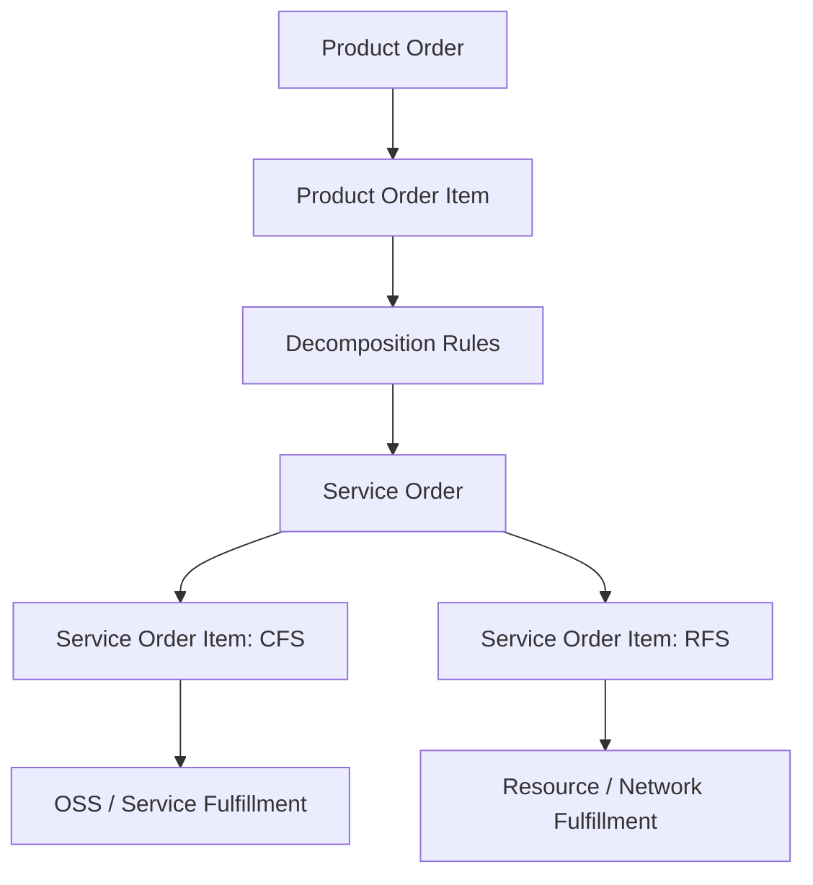
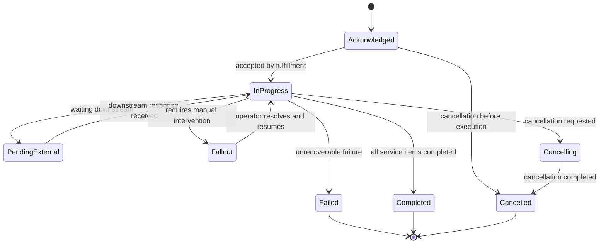
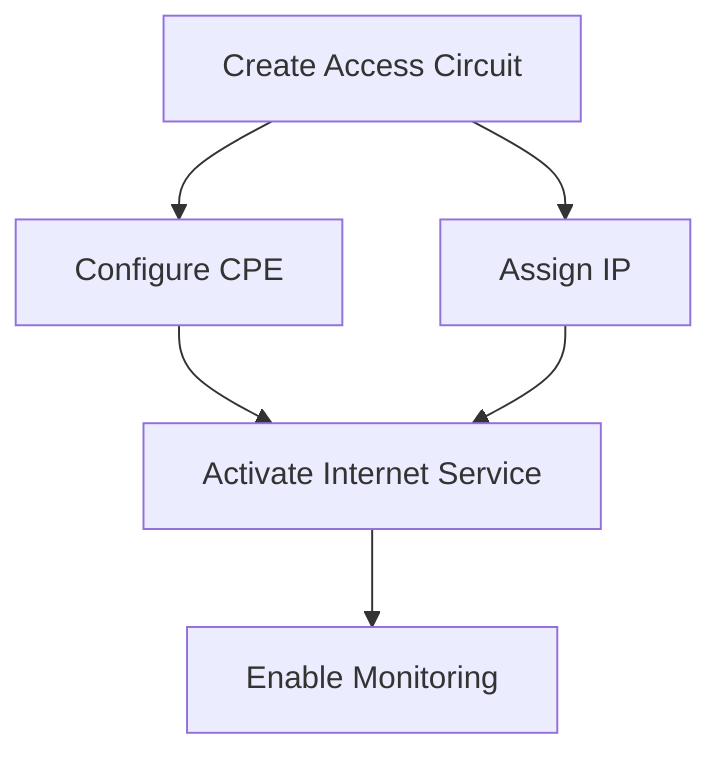

# Part 016 — TMF641 Service Ordering

## 1. Tujuan Part Ini

Part ini membahas **TMF641 Service Ordering Management** dari sudut pandang engineer Quote & Order.

TM Forum secara publik menjelaskan Service Ordering Management API sebagai mekanisme standar untuk placing service order dengan order parameters yang diperlukan. API ini memungkinkan create, update, retrieve service orders, dan mengelola related notifications.

Dalam quote-to-cash dan telco BSS/OSS, service order adalah bridge penting antara:

```text
Product Order / Commercial Order
        ↓
Service Order / Fulfillment Intent
        ↓
Service Activation / OSS Work
        ↓
Resource Assignment / Network Reality
```

Part ini tidak mengasumsikan bahwa CSG Quote & Order internal memakai TMF641 secara langsung. TMF641 dipakai sebagai reference contract dan vocabulary untuk memahami service-ordering boundary.

Prinsip utama:

> Product order says what the customer bought. Service order says what service capabilities must be created, changed, or removed to realize that commercial commitment.

---

## 2. Boundary: Public Standard vs Internal Implementation

### 2.1 Informasi publik yang aman digunakan

Informasi publik yang aman dijadikan orientasi:

- TMF641 adalah Service Ordering Management API dalam keluarga TM Forum Open APIs.
- Halaman publik TMF641 v5 menjelaskan API ini menyediakan mekanisme standar untuk placing service order dengan required order parameters.
- API memungkinkan create, update, retrieve service orders, dan related notifications.
- Spesifikasi REST publik lama menjelaskan service order berisi list of service order items.
- Spesifikasi REST publik lama juga menjelaskan service order item references an action on an existing or future service.
- Dokumentasi publik lama menyebut service dalam konteks Customer-Facing Service atau Resource-Facing Service.
- User guide publik v4.1.1 menyebut task-based resource untuk request Service Order Cancellation.

### 2.2 Hal yang tidak boleh diasumsikan

Jangan mengasumsikan bahwa:

- setiap product order selalu menghasilkan service order;
- service order selalu dibuat oleh Quote & Order;
- TMF641 adalah API internal yang exposed;
- service order model internal identik dengan TMF641 `ServiceOrder`;
- Product Order item satu-ke-satu dengan Service Order item;
- service order lifecycle sama dengan product order lifecycle;
- cancellation selalu synchronous;
- service order failure otomatis membatalkan product order;
- CFS/RFS modeling internal mengikuti TM Forum secara literal;
- fulfillment orchestration dimiliki oleh Quote & Order;
- service inventory dan product inventory selalu diperbarui oleh service order system yang sama.

### 2.3 Internal verification checklist

Verifikasi:

- Apakah Quote & Order membuat service order secara langsung.
- Apakah ada SOM atau fulfillment orchestrator terpisah.
- Supported TMF641 version, jika ada.
- Mapping product order item ke service order item.
- Decomposition rule source.
- CFS/RFS model internal.
- Service specification model.
- Service order state model.
- Cancellation task semantics.
- Retry/resume/fallout handling.
- Service order notification/event contract.
- Ownership of service inventory.
- Correlation from quote/order to service order to fulfillment task.
- Manual fallout process.
- Dashboard/runbook untuk service order failure.

---

## 3. Mental Model: Product Order vs Service Order

### 3.1 Product order

Product order is commercial execution request.

It says:

```text
Customer accepted this product configuration.
Fulfill the commercial commitment.
```

Example:

```text
Product Order:
  Add Enterprise Fiber 1Gbps for Customer A at Site X.
```

### 3.2 Service order

Service order is technical/service fulfillment intent.

It says:

```text
Create or change the service capabilities required to realize the product.
```

Example:

```text
Service Order:
  Create Internet Access Service at Site X.
  Configure SLA monitoring.
  Allocate static IP service.
  Activate customer-facing service.
```

### 3.3 Why the distinction matters

A single product may require multiple services.

```text
Product: Enterprise SD-WAN Bundle
  -> CFS: Internet Access
  -> CFS: SD-WAN Overlay
  -> CFS: Managed Firewall
  -> RFS: Access Circuit
  -> RFS: CPE Configuration
```

A single service may support multiple products.

```text
Shared connectivity service supports multiple add-ons.
```

Product order and service order have different lifecycle, owner, SLA, retry policy, and failure modes.

---

## 4. Commercial Intent vs Fulfillment Intent

A product order item is often written in commercial language:

```text
Add Premium Broadband 1Gbps with Static IP and Managed Router.
```

A service order must express fulfillable service work:

```text
Create access service.
Allocate line profile.
Ship router.
Configure CPE.
Assign static IP.
Activate monitoring profile.
```

The decomposition step translates commercial intent into fulfillment intent.

This is where many enterprise order systems become complex.

---

## 5. Service Order Resource Framing

At a high level, service order concepts may include:

```text
ServiceOrder
  id
  externalId
  state
  requestedStartDate
  requestedCompletionDate
  serviceOrderItem[]
  relatedParty[]
  orderRelationship[]
  note[]
  notification/contact info

ServiceOrderItem
  id
  action
  state
  service
  serviceOrderItemRelationship[]
  appointment/reference
```

Exact fields depend on TMF641 version and internal implementation.
Always verify against the OpenAPI spec/version actually used internally.

---

## 6. CFS and RFS Mental Model

In TM Forum vocabulary:

```text
CFS = Customer-Facing Service
RFS = Resource-Facing Service
```

### 6.1 Customer-Facing Service

CFS is visible or meaningful at customer/product level.

Example:

```text
Internet Access Service
Managed Firewall Service
Voice Service
VPN Service
```

### 6.2 Resource-Facing Service

RFS is closer to network/resource implementation.

Example:

```text
VLAN configuration
Access circuit configuration
IP allocation service
Router configuration
Optical path setup
```

### 6.3 Practical warning

Do not force every internal concept into CFS/RFS if the system has different boundaries.

Use CFS/RFS as vocabulary for reasoning:

```text
Is this customer-visible service behavior?
Or is this resource-level technical work?
```

---

## 7. Product-to-Service Decomposition

Decomposition converts product order into service order.



Inputs:

- product offering;
- product specification;
- product characteristics;
- customer/account/site context;
- existing product inventory;
- service specification;
- fulfillment capability;
- appointment or requested date;
- agreement/SLA.

Outputs:

- service order;
- service order items;
- item relationships;
- execution dependencies;
- downstream adapter payloads;
- correlation metadata.

---

## 8. Decomposition Rule Ownership

Key question:

> Where do decomposition rules live?

Possible owners:

### 8.1 Catalog-driven decomposition

Catalog defines mapping:

```text
ProductOffering -> ServiceSpecification -> ResourceSpecification
```

Pros:

- business/config-driven;
- less code deployment;
- customer-specific product definition easier.

Cons:

- complex rules may become opaque;
- harder to test like code;
- versioning can be painful;
- bad catalog publish can break fulfillment.

### 8.2 Code-driven decomposition

Application code defines mapping.

Pros:

- testable;
- type-safe;
- clear review path;
- easier complex logic.

Cons:

- requires deployment for product changes;
- may not scale for many customer-specific variants;
- product team less autonomous.

### 8.3 Hybrid

Catalog provides declarative metadata.
Code interprets and validates.

Often practical for enterprise systems.

Internal verification:

- Is decomposition catalog-driven, code-driven, or external?
- How are decomposition rules versioned?
- Who approves changes?
- How are they tested?

---

## 9. Service Order Item Action Semantics

Service order item action usually expresses desired operation.

Examples:

```text
add       -> create new service
modify    -> change existing service
delete    -> remove/terminate existing service
noChange  -> reference service dependency/context
```

Semantics must be precise.

Wrong:

```text
action=modify means update any field in payload.
```

Better:

```text
action=modify means transition existing service from current state to desired service state, subject to eligibility, dependency, and fulfillment constraints.
```

Questions:

- What existing service is modified?
- Which characteristics changed?
- Is change disruptive?
- Does change need appointment?
- Does change require resource reallocation?
- Is rollback possible?

---

## 10. Service Order Lifecycle

A practical service order lifecycle may look like:



Do not assume these are internal states.
Use this as a reasoning baseline.

---

## 11. Product Order and Service Order State Coupling

A product order should not blindly mirror service order state.

Example:

```text
Product order has 3 items.
Item 1 creates access service.
Item 2 creates managed firewall service.
Item 3 configures static IP.

Service order for item 1 completes.
Service order for item 2 is in fallout.
Service order for item 3 is pending dependency.
```

What is product order state?

Options:

```text
inProgress
partiallyCompleted
fallout
pendingManualIntervention
failed
```

The answer depends on product order state model and customer-facing semantics.

Senior question:

> Is the state understandable to business users and actionable by operations?

---

## 12. Service Order Item Dependency Graph

Service order items are often dependent.

Example:

```text
1. Create access circuit
2. Configure CPE
3. Assign IP
4. Activate internet service
5. Enable monitoring
```

Dependencies:

```text
2 depends on 1
3 depends on 1
4 depends on 2 and 3
5 depends on 4
```

Mermaid:



This graph controls:

- execution order;
- parallelism;
- retry;
- cancellation;
- compensation;
- progress reporting;
- failure blast radius.

---

## 13. Orchestration vs Choreography

### 13.1 Orchestration

Central process manager controls steps.

```text
Order Orchestrator -> Service Fulfillment A
Order Orchestrator -> Service Fulfillment B
Order Orchestrator -> Inventory
```

Pros:

- clear visibility;
- easier status aggregation;
- easier manual recovery;
- central timeout handling.

Cons:

- orchestrator can become god service;
- tight coupling to downstream systems;
- complex state machine.

### 13.2 Choreography

Systems react to events.

```text
ProductOrderAccepted -> Decomposer
ServiceOrderCreated -> Fulfillment
ServiceActivated -> Inventory
InventoryUpdated -> Billing
```

Pros:

- decoupled;
- scalable;
- each service owns reaction.

Cons:

- harder global reasoning;
- hidden process state;
- harder recovery;
- event storm risk.

### 13.3 Practical answer

Mission-critical order flows often need explicit process state somewhere.

Even if integration is event-driven, the business process needs observability and recovery ownership.

---

## 14. Service Order Creation Timing

When should service order be created?

### 14.1 Immediately after product order acceptance

Good when:

- order is execution-ready;
- decomposition deterministic;
- no additional validation needed.

Risk:

- creates downstream work before all constraints are validated.

### 14.2 After validation/decomposition checkpoint

Good when:

- product order needs enrichment;
- installed base must be locked;
- appointment/resource checks required.

Risk:

- extra lifecycle complexity.

### 14.3 Just-in-time per dependency

Good when:

- long-running workflows;
- dependencies become available over time;
- external systems have strict timing.

Risk:

- harder global tracking.

---

## 15. Idempotency in Service Order Creation

Duplicate service order creation is dangerous.

Scenario:

```text
Product order accepted event is delivered twice.
Decomposition service creates two identical service orders.
Fulfillment executes both.
```

Consequences:

- duplicate provisioning;
- duplicate billing triggers;
- duplicate inventory products/services;
- manual cleanup;
- customer outage.

Use idempotency key:

```text
productOrderId + productOrderItemId + decompositionVersion
```

Or:

```text
sourceOrderItemId -> serviceOrderItemId mapping table
```

Example table:

```sql
create table service_order_mapping (
    tenant_id text not null,
    product_order_id uuid not null,
    product_order_item_id text not null,
    decomposition_version text not null,
    service_order_id text not null,
    service_order_item_id text,
    created_at timestamptz not null default now(),
    primary key (tenant_id, product_order_id, product_order_item_id, decomposition_version)
);
```

---

## 16. Cancellation Semantics

Cancellation is not deletion.

Service order cancellation may mean:

```text
Stop before execution.
Cancel pending downstream task.
Compensate already executed step.
Prevent further execution.
Mark remaining items cancelled.
Leave completed items as completed.
```

Questions:

- Is the service order already in progress?
- Which service order items completed?
- Which downstream systems support cancellation?
- Is compensation possible?
- Does product order become cancelled or partially completed?
- Does customer see cancellation, fallout, or manual review?

A task-based cancellation resource can be safer than generic status PATCH because cancellation itself is a process.

---

## 17. Fallout Handling

Fallout means the order cannot progress automatically.

Examples:

```text
Address validation failed.
Resource unavailable.
External OSS timeout.
Technician appointment missed.
Device shipment failed.
Service activation error.
Manual approval required.
```

Fallout should be modeled explicitly.

Minimum fields:

```text
falloutId
serviceOrderId
serviceOrderItemId
severity
category
rootCause/sourceSystem
human-readable message
machine-readable code
retryable flag
required action
owner queue
createdAt
lastAttemptAt
correlationId
```

Do not hide fallout as generic `FAILED`.

---

## 18. Retry and Resume

Retries must be safe.

### 18.1 Retryable failures

Examples:

```text
timeout
transient 5xx
rate limit
temporary lock
message delivery failure
```

### 18.2 Non-retryable failures

Examples:

```text
invalid address
missing service qualification
incompatible service specification
customer not authorized
resource unavailable permanently
```

### 18.3 Resume checkpoint

Long-running service order needs checkpoint.

```text
Step 1 completed.
Step 2 completed.
Step 3 failed.
Resume from Step 3, not Step 1.
```

If retry restarts from beginning, it must be idempotent per step.

---

## 19. Compensation

Not every service action can be rolled back.

Example:

```text
Access circuit installed physically.
```

Rollback may require:

- new work order;
- technician visit;
- billing adjustment;
- customer communication.

Compensation is business operation, not magic undo.

Design question:

> For each service order item, what is the compensation action and who owns it?

---

## 20. Correlation Across Product Order and Service Order

Every service order must be traceable back to commercial intent.

Required correlation:

```text
quoteId
quoteItemId
productOrderId
productOrderItemId
serviceOrderId
serviceOrderItemId
customerId/accountId
tenantId
correlationId
causationId
```

Without this, production debugging becomes guesswork.

Example log:

```json
{
  "event": "service_order_item_failed",
  "tenantId": "tenant-a",
  "productOrderId": "PO-100",
  "productOrderItemId": "1",
  "serviceOrderId": "SO-900",
  "serviceOrderItemId": "3",
  "failureCode": "RESOURCE_UNAVAILABLE",
  "correlationId": "corr-123",
  "causationId": "event-789"
}
```

---

## 21. Service Order Events

Useful service order events:

```text
ServiceOrderCreated
ServiceOrderAcknowledged
ServiceOrderInProgress
ServiceOrderItemStarted
ServiceOrderItemCompleted
ServiceOrderItemFailed
ServiceOrderFalloutRaised
ServiceOrderCancellationRequested
ServiceOrderCancelled
ServiceOrderCompleted
```

Event design concerns:

- partition key;
- event version;
- aggregate sequence;
- idempotency;
- PII minimization;
- replay safety;
- status reason taxonomy.

Partitioning by service order ID gives ordering per service order.
But product order aggregation may need correlation across multiple service orders.

---

## 22. Product Inventory and Service Inventory Updates

After service order completion, systems may update:

```text
Product Inventory
Service Inventory
Resource Inventory
Billing Subscription
Order Status
```

These updates may be owned by different services.

Dangerous assumption:

```text
If service order completes, everything else is automatically consistent.
```

Realistic design:

```text
Service order completion emits event.
Inventory updater processes event idempotently.
Billing activation processes event idempotently.
Order status aggregator reconciles downstream states.
```

Reconciliation remains necessary.

---

## 23. Service Qualification vs Service Ordering

Service ordering should not replace service qualification.

Qualification asks:

```text
Can this service be delivered at this location/customer/site?
```

Ordering asks:

```text
Create/change/remove this service.
```

If service qualification is skipped, service order may fail late.

Internal verification:

- Is there service qualification API/process?
- Does CPQ call it?
- Is qualification result snapshotted?
- Does order revalidate qualification before fulfillment?
- How long is qualification valid?

---

## 24. Appointment and Requested Dates

Service orders often interact with appointment windows.

Examples:

```text
technician visit
customer site access
device delivery
network change window
customer-requested activation date
```

Fields like requested start/completion date are not decoration.

They impact:

- SLA;
- fulfillment scheduling;
- billing effective date;
- customer communication;
- cancellation policy;
- retry timing;
- escalation.

PR review question:

> Does this code treat dates as mere timestamps, or as contractual/operational commitments?

---

## 25. Service Order and Billing Effective Date

Billing start should align with actual service/product activation policy.

Possible policies:

```text
start billing at product order completion
start billing at service order completion
start billing at service activation event
start billing at customer acceptance
start billing at requested activation date
```

Wrong policy can cause revenue leakage or customer dispute.

Service order status alone may not be sufficient. You may need:

```text
actual activation date
effective date
completion date
customer acceptance date
billing trigger date
```

---

## 26. Service Order State Aggregation

If one product order creates multiple service orders, aggregate state carefully.

Example:

```text
SO-1 completed
SO-2 completed
SO-3 fallout
SO-4 pending
```

Product order status should not be:

```text
completed
```

unless completion policy explicitly allows partial completion.

Aggregation function should account for:

- item criticality;
- dependencies;
- partial fulfillment policy;
- customer-visible impact;
- manual fallout;
- cancellation state;
- compensating action.

---

## 27. PostgreSQL Model for Service Order Tracking

If Quote & Order tracks service orders locally, a simplified model:

```sql
create table service_order_ref (
    id uuid primary key,
    tenant_id text not null,
    product_order_id uuid not null,
    external_service_order_id text not null,
    state text not null,
    source_system text not null,
    correlation_id text,
    created_at timestamptz not null default now(),
    updated_at timestamptz not null default now(),
    unique (tenant_id, external_service_order_id)
);

create table service_order_item_ref (
    id uuid primary key,
    service_order_ref_id uuid not null references service_order_ref(id),
    product_order_item_id text,
    external_service_order_item_id text,
    action text not null,
    state text not null,
    failure_code text,
    updated_at timestamptz not null default now()
);

create index idx_service_order_ref_product_order
    on service_order_ref (tenant_id, product_order_id);

create index idx_service_order_ref_state
    on service_order_ref (tenant_id, state);
```

This is not a required model. It is a reasoning scaffold.

---

## 28. MyBatis and Service Order Tracking

Mapper design should preserve tenant and order boundary.

```java
public interface ServiceOrderRefMapper {
    ServiceOrderRefRecord findByExternalId(
        @Param("tenantId") String tenantId,
        @Param("externalServiceOrderId") String externalServiceOrderId
    );

    List<ServiceOrderRefRecord> findByProductOrderId(
        @Param("tenantId") String tenantId,
        @Param("productOrderId") UUID productOrderId
    );

    int updateState(
        @Param("tenantId") String tenantId,
        @Param("externalServiceOrderId") String externalServiceOrderId,
        @Param("state") String state
    );
}
```

Review concerns:

- no missing tenant filter;
- no blind overwrite of state;
- status reason preserved;
- idempotent update;
- unknown external state handled;
- item-level update does not incorrectly complete parent.

---

## 29. State Transition Guard

Do not allow arbitrary state overwrite.

Bad:

```java
serviceOrder.setState(incomingState);
mapper.update(serviceOrder);
```

Better:

```java
ServiceOrderState next = transitionPolicy.transition(
    currentState,
    incomingEvent.state(),
    incomingEvent.reason()
);

mapper.updateStateWithExpectedVersion(
    serviceOrderId,
    currentVersion,
    next
);
```

This prevents regressions like:

```text
Completed -> InProgress
Cancelled -> Completed
Failed -> Completed without recovery action
```

---

## 30. External State Mapping

External service systems may use different states.

Example:

```text
External: RECEIVED, ASSIGNED, DISPATCHED, ACTIVATED, CLOSED, JEOPARDY
Internal: acknowledged, inProgress, completed, fallout
```

Use explicit mapping:

```java
public ServiceOrderState mapExternalState(String externalState) {
    return switch (externalState) {
        case "RECEIVED" -> ACKNOWLEDGED;
        case "ASSIGNED", "DISPATCHED" -> IN_PROGRESS;
        case "ACTIVATED", "CLOSED" -> COMPLETED;
        case "JEOPARDY" -> FALLOUT;
        default -> UNKNOWN;
    };
}
```

Unknown state should not be silently treated as completed.

---

## 31. Security Boundary

Service order data may expose:

- customer site;
- service topology;
- network identifiers;
- technician appointments;
- operational status;
- outage/failure information.

Security rules:

- tenant scope all reads;
- authorize access by customer/account/order ownership;
- avoid exposing technical resource identifiers to inappropriate users;
- redact sensitive service details in logs;
- audit manual retry/cancel/fallout actions;
- protect service order callbacks/webhooks.

Callback/webhook security is especially important.

Verify:

- authentication of incoming notifications;
- replay protection;
- signature validation if used;
- source IP/network restrictions if applicable;
- idempotency of notification processing.

---

## 32. Observability

Service ordering observability should answer:

```text
Where is this order stuck?
Which service order item failed?
Which downstream system owns the failure?
Can we retry?
Is manual action needed?
What customer/product/order is affected?
```

### 32.1 Metrics

```text
service_order_created_count
service_order_completed_count
service_order_failed_count
service_order_fallout_count
service_order_cancellation_count
service_order_item_latency_seconds
service_order_downstream_error_rate
service_order_retry_count
service_order_stuck_age_seconds
```

### 32.2 Business dashboard

Useful dimensions:

```text
tenant/customer
product order type
service type
downstream system
state
fallout category
age bucket
SLA breach risk
```

### 32.3 Traces

Trace should connect:

```text
quote acceptance
product order creation
decomposition
service order creation
fulfillment call
notification callback
inventory update
order completion
```

---

## 33. Failure Mode Catalogue

### 33.1 Duplicate service order

Symptom:

```text
Same product order item creates two service orders.
```

Detection:

- duplicate mapping table violation;
- downstream duplicate warning;
- reconciliation.

Mitigation:

- idempotency key;
- unique mapping;
- deterministic service order external ID.

### 33.2 Service order completed but product order stuck

Symptom:

```text
Fulfillment done, customer active, order still in progress.
```

Detection:

- service/order reconciliation;
- stuck order dashboard;
- SLA breach alert.

Mitigation:

- event replay;
- status repair workflow;
- idempotent aggregation.

### 33.3 Product order completed while service order failed

Symptom:

```text
Customer sees order complete, but service not active.
```

Detection:

- inventory/service/order mismatch;
- customer ticket;
- fallout dashboard.

Mitigation:

- completion guard;
- item-level state aggregation;
- service order dependency check.

### 33.4 Cancellation after partial fulfillment

Symptom:

```text
Some service items completed, cancellation requested.
```

Detection:

- cancellation task state;
- incomplete compensation;
- manual fallout.

Mitigation:

- cancellation as workflow;
- compensation plan;
- clear customer-facing status.

### 33.5 Callback replay or spoofing

Symptom:

```text
External callback changes state incorrectly.
```

Detection:

- invalid signature;
- duplicate event ID;
- illegal transition;
- unexpected source.

Mitigation:

- authenticate callback;
- idempotency;
- transition guard;
- event sequence validation.

---

## 34. Testing Strategy

### 34.1 Unit tests

Test:

- decomposition rules;
- service order item action mapping;
- state transition rules;
- aggregation logic;
- cancellation behavior;
- retry classification.

### 34.2 Integration tests

Test:

- service order adapter;
- notification processing;
- transaction boundaries;
- mapping table uniqueness;
- outbox event creation;
- fallback behavior.

### 34.3 Contract tests

Test:

- TMF641-compatible payload;
- unknown fields;
- enum evolution;
- nullable service fields;
- cancellation task resource if supported;
- callback schema.

### 34.4 E2E tests

Test journeys:

```text
add product -> service order completed -> product order completed
modify product -> service order fallout -> manual recovery -> completed
cancel order before service execution -> cancelled
cancel order after partial execution -> compensation/fallout
service callback replay -> idempotent no-op
```

---

## 35. PR Review Checklist

### 35.1 Domain correctness

- Does product order mean commercial intent and service order mean fulfillment intent?
- Is decomposition explicit?
- Is product order item incorrectly assumed one-to-one with service order item?
- Are CFS/RFS concepts used carefully?
- Are item dependencies preserved?

### 35.2 Lifecycle correctness

- Are illegal state transitions blocked?
- Is cancellation modeled as workflow?
- Is partial completion handled?
- Is fallout explicit?
- Is retry/resume safe?

### 35.3 Integration correctness

- Is TMF641 version verified?
- Are external states mapped explicitly?
- Are unknown states safe?
- Are duplicate callbacks idempotent?
- Are downstream failures classified?

### 35.4 Operational readiness

- Can support see where the order is stuck?
- Are correlation IDs propagated?
- Are dashboard metrics sufficient?
- Is there a runbook for service order fallout?
- Is reconciliation possible?

### 35.5 Security

- Are callbacks authenticated?
- Is tenant scope enforced?
- Are service/resource details protected?
- Are manual actions audited?

---

## 36. Internal Verification Questions for Onboarding

Ask the team:

1. Does Quote & Order create service orders directly?
2. Is TMF641 exposed externally, used internally, or only used as mapping reference?
3. Which TMF641 version is relevant?
4. What system owns service ordering/orchestration?
5. Where are product-to-service decomposition rules stored?
6. Are service orders persisted locally?
7. What are service order states?
8. How is product order status derived from service order status?
9. How are service order item dependencies modeled?
10. How is cancellation handled after partial fulfillment?
11. How is fallout represented and assigned?
12. How are retries triggered?
13. How are callbacks authenticated and deduplicated?
14. What dashboards show service fulfillment health?
15. What recent incidents involved service order or fulfillment integration?

---

## 37. Mini Design Exercise: Product Order to Multiple Service Orders

Scenario:

```text
Product order adds Enterprise Fiber with Managed Firewall.
It decomposes into access service order and firewall service order.
Access completes, firewall fails because appliance shipment failed.
```

Questions:

- What is product order state?
- What is customer-facing status?
- Is billing activated?
- Is product inventory active, pending, or partial?
- Can access service remain active?
- Who owns fallout?
- What retry or compensation is allowed?

Expected senior-level answer:

```text
Do not mark product order complete until completion policy is satisfied. Item-level state and product criticality matter. Billing and inventory activation must follow explicit policy, not merely first service completion. Fallout should be actionable, correlated, and recoverable.
```

---

## 38. Mini Design Exercise: Duplicate Callback

Scenario:

```text
OSS sends ServiceOrderCompleted callback twice due to retry.
```

Questions:

- How do you identify duplicate callback?
- Does second callback update state?
- Does second callback emit ProductOrderCompleted event again?
- Does second callback activate billing again?
- What audit record is kept?

Expected design:

- callback event ID or deterministic idempotency key;
- processed event table;
- state transition guard;
- idempotent event publication;
- duplicate metric;
- no duplicate side effects.

---

## 39. Mini Design Exercise: Cancellation During Execution

Scenario:

```text
Customer cancels order after access circuit is provisioned but before managed router is configured.
```

Questions:

- Is cancellation accepted immediately?
- Which service items are cancelled?
- Which completed items require compensation?
- Does product order become cancelled, fallout, or pending cancellation?
- How is customer informed?
- What audit evidence is required?

Expected answer:

```text
Cancellation is a workflow with per-item state. Completed work may require compensation, not deletion. Product order should reflect pending cancellation or partial fallout until downstream cancellation/compensation finishes.
```

---

## 40. Key Takeaways

- TMF641 is a useful reference for service order management, but it must not be assumed to be CSG internal implementation.
- Product order is commercial execution request; service order is fulfillment intent.
- Product-to-service decomposition is a core correctness boundary.
- Service order item dependencies, cancellation, retry, resume, and fallout must be modeled explicitly.
- Service order state should not blindly overwrite product order state.
- Correlation across quote, product order, service order, inventory, and billing is mandatory for production support.
- Senior engineers should review service-ordering changes through lifecycle, idempotency, integration, security, observability, and recovery lenses.

---

## 41. Source Notes

Public sources used for orientation:

- TM Forum Service Ordering Management API TMF641 v5 public page describes the API as a standardized mechanism for placing a service order with necessary order parameters, including create, update, retrieve service orders, and related notifications.
- TM Forum TMF641 public v4.1 page describes similar service order management behavior and notes v4.2.0 version history changes.
- TM Forum older public REST specification states that a service order contains service order items, and that a service order item references an action on an existing or future service.
- TM Forum older public REST specification describes service in terms of Customer-Facing Service and Resource-Facing Service.
- TM Forum TMF641 user guide v4.1.1 public page mentions a task-based resource to request Service Order Cancellation.

These sources describe public standard positioning. They do not reveal or prove CSG internal implementation details.
