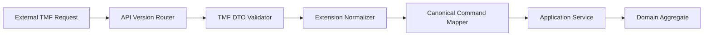
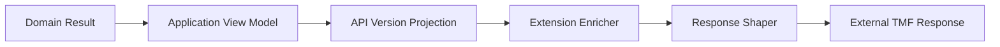
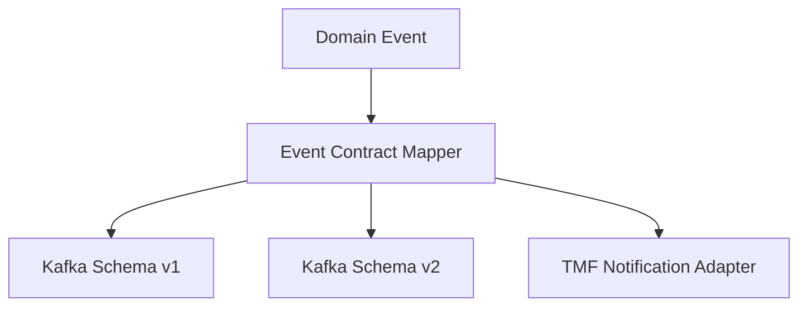
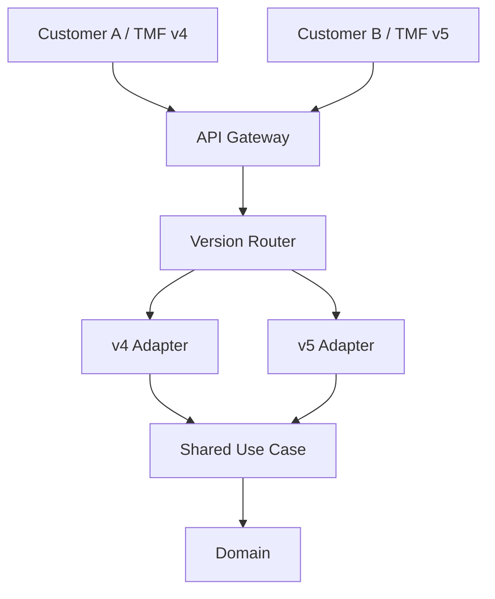

# Part 017 — TMF API Versioning, Extensions, and Compatibility Strategy

## 1. Tujuan Part Ini

Part ini membahas **strategi versioning, extension, dan compatibility** untuk API berbasis atau terinspirasi TM Forum Open APIs dalam konteks Quote & Order enterprise.

Setelah mempelajari TMF620, TMF648, TMF622, TMF629, TMF637, dan TMF641, mudah sekali jatuh ke asumsi yang salah:

> "Kalau API-nya mengikuti TMF, berarti integration problem sudah selesai."

Di sistem enterprise nyata, masalah utamanya bukan hanya apakah payload mirip standard. Masalah yang lebih sulit adalah:

- versi TMF mana yang dipakai customer;
- versi mana yang dipakai internal product;
- apakah API exposed langsung atau lewat adapter/facade;
- extension mana yang masih compatible;
- perubahan mana yang terlihat additive tetapi sebenarnya breaking;
- bagaimana menjaga customer lama tetap berjalan saat product berevolusi;
- bagaimana menguji compatibility lintas versi dan lintas customer;
- bagaimana menghindari standard-compliant API yang secara bisnis tetap salah.

Prinsip utama part ini:

> Compatibility is not an API documentation concern. Compatibility is a product capability, an operations constraint, and a customer trust contract.

---

## 2. Boundary: Public Standard vs Internal Implementation

### 2.1 Informasi publik yang aman digunakan

Informasi publik yang aman dijadikan orientasi:

- TM Forum menyediakan keluarga **Open APIs** untuk ODA dan telco/digital platform integration.
- TM Forum menyatakan bahwa Open APIs menggunakan shared API data model yang berbasis pada Information Framework/SID.
- TM Forum Open API Directory memuat API dari berbagai domain, termasuk product, customer, service, resource, dan partner APIs.
- TMF630 REST API Design Guidelines adalah dokumen guideline/design pattern untuk pengembangan TM Forum REST APIs.
- TM Forum menyediakan program Open API Conformance untuk memverifikasi implementasi Open APIs dalam commercial product dan real-world deployments.
- Halaman publik TM Forum menunjukkan beberapa API tersedia dalam versi berbeda, misalnya v4 dan v5.

### 2.2 Hal yang tidak boleh diasumsikan

Jangan mengasumsikan bahwa:

- CSG Quote & Order exposed semua TMF API secara langsung;
- versi TMF publik terbaru otomatis dipakai internal;
- internal domain model identik dengan TMF resource model;
- semua customer memakai versi API yang sama;
- conformance TMF adalah requirement semua customer;
- extension field boleh ditambahkan sembarangan tanpa governance;
- `@type`, `@baseType`, `@schemaLocation`, atau characteristic extension dipakai internal dengan cara tertentu;
- OpenAPI spec internal sama dengan dokumentasi publik;
- API v5 selalu lebih baik untuk customer yang sudah live di v4;
- backward compatibility hanya masalah JSON field presence;
- event contract ikut aman hanya karena REST API compatible.

### 2.3 Internal verification checklist

Cek secara internal:

- daftar TMF API yang benar-benar exposed;
- versi TMF yang didukung per customer/deployment;
- apakah ada facade/API gateway/adapter layer;
- OpenAPI specification source of truth;
- compatibility policy internal;
- deprecation policy;
- API extension convention;
- conformance target;
- CTK/conformance test usage;
- customer integration matrix;
- event schema compatibility rule;
- changelog API;
- policy untuk breaking change;
- policy untuk enum extension;
- apakah ada generated SDK;
- apakah ada API version negotiation;
- apakah API version terikat pada deployment version atau independent.

---

## 3. Mental Model: Three Models, Three Clocks

Dalam enterprise API, kita harus memisahkan tiga model:

```text
External Contract Model
  apa yang dilihat customer/partner/integrator

Internal Domain Model
  bagaimana product menjaga invariant dan lifecycle

Persistence Model
  bagaimana data disimpan, dimigrasi, dan di-query
```

Ketiganya punya **clock** yang berbeda:

| Model | Perubahan dipicu oleh | Ritme perubahan | Risiko utama |
|---|---|---:|---|
| External contract | Customer integration, standard adoption, public API roadmap | Lambat | Breaking integration |
| Internal domain | Product feature, correctness fix, refactor | Sedang | Domain leakage / invalid invariant |
| Persistence | Performance, schema evolution, scale, operational repair | Cepat atau batch | Migration failure / data incompatibility |

Kesalahan umum adalah memperlakukan TMF resource sebagai semua model sekaligus.

Contoh buruk:

```text
TMF622 ProductOrder JSON
        ↓ direct mapping
Java entity
        ↓ direct mapping
PostgreSQL table
```

Dampaknya:

- field external menjadi constraint internal yang tidak diinginkan;
- database migration menjadi breaking API change;
- internal refactor memaksa customer migration;
- extension customer bocor ke domain core;
- testing compatibility menjadi sulit;
- lifecycle invariant tersebar di mapper/controller.

Desain yang lebih sehat:

```text
TMF/API DTO
   ↓ anti-corruption mapping
Application command/query
   ↓ domain model
Aggregate / lifecycle policy
   ↓ repository mapping
Persistence model
```

---

## 4. Compatibility Is a Multi-Dimensional Contract

API compatibility bukan hanya:

```text
Can old client still parse JSON?
```

Compatibility harus dilihat dari beberapa dimensi.

### 4.1 Request compatibility

Pertanyaan:

- Apakah request lama masih diterima?
- Apakah field lama masih bermakna sama?
- Apakah default value berubah?
- Apakah field yang dulu optional menjadi mandatory?
- Apakah validation rule menjadi lebih ketat?
- Apakah endpoint lama masih tersedia?

Contoh breaking yang sering tidak terasa breaking:

```text
Sebelumnya:
  discountReason optional

Sekarang:
  discountReason required kalau discount > 10%
```

Secara schema mungkin masih optional. Secara business contract, request lama bisa mulai gagal.

### 4.2 Response compatibility

Pertanyaan:

- Apakah response lama masih memuat field yang dibutuhkan consumer?
- Apakah field meaning berubah?
- Apakah enum value baru bisa membuat client gagal?
- Apakah nested object berubah menjadi reference saja?
- Apakah field order/format/timestamp precision berubah?
- Apakah nullability berubah?

Contoh breaking tersembunyi:

```text
statusReason: null
```

berubah menjadi:

```text
statusReason: "PENDING_EXTERNAL_APPROVAL"
```

Client yang tidak tolerant terhadap enum baru bisa gagal walaupun perubahan tampak additive.

### 4.3 Behavioral compatibility

Ini paling sering diabaikan.

Pertanyaan:

- Apakah create quote masih langsung menghasilkan priced quote?
- Apakah submit order masih synchronous atau sekarang async?
- Apakah idempotency key punya retention window yang sama?
- Apakah cancellation masih best-effort atau sekarang strict validation?
- Apakah retry menghasilkan status yang sama?

API schema bisa sama, tetapi behavior berubah dan mematahkan customer journey.

### 4.4 Event compatibility

Jika REST API compatible tetapi event berubah, downstream tetap bisa rusak.

Pertanyaan:

- Apakah event type berubah?
- Apakah event payload masih backward-compatible?
- Apakah ordering semantics berubah?
- Apakah event emitted pada transition yang sama?
- Apakah event idempotency key stabil?
- Apakah replay safe untuk old consumer?

### 4.5 Operational compatibility

Pertanyaan:

- Apakah customer on-prem bisa upgrade tanpa downtime?
- Apakah DB migration butuh lock panjang?
- Apakah API v4 dan v5 bisa berjalan berdampingan?
- Apakah rollback masih bisa dilakukan setelah data migration?
- Apakah support team tahu perubahan behavior?

---

## 5. Versioning Vocabulary yang Harus Dibedakan

Gunakan vocabulary yang presisi.

| Istilah | Arti | Jangan dikacaukan dengan |
|---|---|---|
| TMF spec version | Versi spesifikasi TMF, misalnya v4/v5 | Versi aplikasi internal |
| API contract version | Versi endpoint/payload yang exposed | Versi database |
| Product release version | Versi release product | Versi TMF |
| Internal model version | Versi domain atau serialized model internal | API version |
| Event schema version | Versi contract Kafka/event | REST API version |
| Customer adapter version | Versi mapping untuk customer tertentu | Core service version |
| Deployment version | Versi runtime environment | Contract version |

Prinsip:

> A single product release may support multiple external contract versions.

Misalnya:

```text
Quote & Order release 2026.07
  supports TMF648-like API v4 for Customer A
  supports TMF648-like API v5 for Customer B
  supports internal canonical API for UI
  emits Kafka QuoteAcceptedEvent v3
  persists quote schema version 12
```

Jangan memaksa semua versioning bergerak bersama. Itu menciptakan upgrade yang terlalu besar dan terlalu riskan.

---

## 6. Four Adoption Modes for TMF APIs

### 6.1 Direct TMF exposure

```text
External Client → TMF API Controller → Domain Service
```

Cocok jika:

- internal domain model sangat dekat dengan TMF model;
- customization minimal;
- customer butuh standard contract langsung;
- compatibility strategy sudah matang.

Risiko:

- domain core mudah terseret standard resource shape;
- extension governance sulit;
- setiap perubahan TMF/customer langsung menekan service core.

### 6.2 Facade over internal API

```text
External Client → TMF Facade → Internal API → Domain Service
```

Cocok jika:

- internal model berbeda dari TMF;
- perlu support banyak versi;
- perlu customer-specific mapping;
- ingin melindungi domain core.

Risiko:

- mapping layer kompleks;
- latency bertambah;
- observability harus lintas layer;
- duplicate validation bisa muncul.

### 6.3 Adapter per customer/partner

```text
Customer A Adapter ┐
Customer B Adapter ├→ Canonical Internal Command → Domain Service
Customer C Adapter ┘
```

Cocok jika:

- customer contract sangat bervariasi;
- ada legacy integration;
- sebagian customer tidak benar-benar TMF-compliant;
- deployment on-prem punya constraints khusus.

Risiko:

- adapter sprawl;
- inconsistent behavior;
- testing matrix besar;
- customization menjadi product debt.

### 6.4 Canonical internal model with TMF mapping

```text
TMF DTO
  ↓ mapper
Canonical API model
  ↓ application layer
Domain model
```

Cocok sebagai long-term architecture jika:

- banyak standard/API harus didukung;
- domain core ingin stabil;
- integration layer bisa berevolusi independen;
- perlu governance kuat.

Risiko:

- canonical model bisa menjadi god model;
- mapping semantics harus jelas;
- owner canonical model harus tegas.

---

## 7. Extension Strategy: Jangan Jadikan Extension sebagai Tempat Sampah

TMF APIs menyediakan pola extensibility. Namun, extension yang tidak dikendalikan bisa menjadi sumber coupling terburuk.

### 7.1 Pertanyaan sebelum menambah extension

Sebelum menambah field/extension, tanyakan:

1. Apakah field ini benar-benar external contract?
2. Apakah field ini customer-specific atau product-wide?
3. Apakah field ini bisa direpresentasikan sebagai characteristic?
4. Apakah field ini harus searchable/filterable?
5. Apakah field ini memengaruhi business invariant?
6. Apakah field ini perlu audit?
7. Apakah field ini perlu eventing?
8. Apakah field ini akan dipakai downstream?
9. Apakah field ini punya lifecycle?
10. Apakah field ini boleh hilang saat mapping ke versi lain?

Jika field memengaruhi invariant, jangan perlakukan sebagai opaque extension.

### 7.2 Characteristic vs explicit field

Gunakan characteristic ketika:

- attribute benar-benar dynamic;
- attribute berasal dari catalog;
- attribute bervariasi per product offering;
- attribute tidak perlu strongly typed domain logic;
- attribute tidak menjadi lifecycle guard utama.

Gunakan explicit field ketika:

- attribute memengaruhi authorization;
- attribute memengaruhi approval;
- attribute memengaruhi pricing/margin;
- attribute dipakai untuk state transition;
- attribute perlu index/query intensif;
- attribute perlu audit formal;
- attribute menjadi integration key.

Contoh:

```text
Good characteristic:
  bandwidth = 1Gbps
  routerModel = X123
  contractTermMonths = 24  // jika catalog-defined characteristic

Probably explicit field:
  tenantId
  quoteState
  approvalStatus
  orderExternalId
  pricingSnapshotVersion
  sourceSystem
```

### 7.3 Customer-specific extension

Customer-specific extension harus punya batas.

Jangan:

```text
if customer == "A" then interpret customField1 as approval code
if customer == "B" then interpret customField1 as sales channel
```

Lebih sehat:

```text
CustomerAdapterA maps A-specific payload → canonical ApprovalContext
CustomerAdapterB maps B-specific payload → canonical SalesContext
Core domain sees typed canonical concepts
```

### 7.4 Extension registry

Untuk produk enterprise, extension perlu registry:

| Field | Owner | Scope | Type | Used by | Lifecycle | Compatibility rule |
|---|---|---|---|---|---|---|
| `xSalesChannel` | CPQ | product-wide | enum | pricing, approval | active | additive enum only |
| `xEnterpriseAgreementId` | Agreement | product-wide | string | pricing | active | cannot remove |
| `xCustomerLegacyRef` | Adapter A | customer-specific | string | integration only | deprecated | adapter-only |

Tanpa registry, extension menjadi undocumented API surface.

---

## 8. Breaking Change Taxonomy

### 8.1 Obvious breaking changes

- remove endpoint;
- rename field;
- remove field;
- change field type;
- change URL path;
- change authentication mechanism;
- change required header;
- remove enum value;
- change event type name.

### 8.2 Subtle breaking changes

- optional field menjadi required secara behavioral;
- default value berubah;
- validation menjadi lebih strict;
- enum value baru muncul dan client tidak tolerant;
- string format berubah;
- timestamp timezone berubah;
- pagination order berubah;
- sorting default berubah;
- response yang dulu embedded menjadi reference;
- field yang dulu always present menjadi nullable;
- synchronous behavior menjadi asynchronous;
- idempotency window berubah;
- retry response code berubah;
- error code taxonomy berubah;
- event emission timing berubah;
- duplicate event frequency meningkat;
- correlation ID propagation berubah.

### 8.3 Domain-breaking changes

Ini paling berbahaya karena schema bisa terlihat sama.

Contoh:

```text
Before:
  Quote accepted means price is final and orderable.

After:
  Quote accepted means customer accepted commercial terms, but approval may still be pending.
```

Schema sama. Semantik berubah total.

### 8.4 Operational breaking changes

Contoh:

- migration butuh downtime tetapi customer contract menjanjikan rolling upgrade;
- new API version butuh PostgreSQL extension yang tidak tersedia on-prem;
- new field butuh backfill 500M rows;
- old deployment tidak bisa rollback setelah schema berubah;
- CTK baru butuh network/proxy yang tidak tersedia di customer environment;
- new Kafka event retention policy membuat replay customer lama gagal.

---

## 9. Compatibility Decision Framework

Gunakan decision framework ini saat review API change.

### 9.1 Pertanyaan contract

- Siapa consumer-nya?
- Apakah consumer internal, customer, partner, UI, batch, atau support tool?
- Apakah consumer diketahui semua?
- Apakah ada generated client?
- Apakah ada consumer yang strict terhadap schema?
- Apakah ada customer yang tidak bisa upgrade cepat?

### 9.2 Pertanyaan semantic

- Apakah meaning field berubah?
- Apakah lifecycle transition berubah?
- Apakah validation rule berubah?
- Apakah error semantics berubah?
- Apakah idempotency semantics berubah?
- Apakah ordering semantics berubah?

### 9.3 Pertanyaan operational

- Apakah change bisa di-rollout gradual?
- Apakah bisa rollback?
- Apakah membutuhkan data migration?
- Apakah butuh feature flag?
- Apakah observability cukup untuk mendeteksi breakage?
- Apakah support team tahu cara diagnose issue?

### 9.4 Pertanyaan standard/conformance

- Apakah change masih conformant ke target TMF version?
- Apakah extension mengikuti convention internal?
- Apakah conformance test perlu di-update?
- Apakah documentation perlu versioned?
- Apakah example payload perlu di-update?

---

## 10. Versioning Patterns

### 10.1 URI versioning

```http
GET /tmf-api/productOrdering/v4/productOrder/{id}
GET /tmf-api/productOrdering/v5/productOrder/{id}
```

Kelebihan:

- eksplisit;
- mudah di-route;
- mudah support parallel versions;
- cocok untuk enterprise integration.

Kekurangan:

- bisa mendorong duplicate controller;
- migration antar versi terlihat besar;
- developer bisa malas menjaga shared semantics.

### 10.2 Header-based versioning

```http
GET /productOrder/{id}
Accept: application/json;version=5
```

Kelebihan:

- URL stabil;
- terlihat bersih.

Kekurangan:

- debugging lebih sulit;
- proxy/cache behavior harus hati-hati;
- customer support lebih sulit;
- API docs bisa membingungkan.

### 10.3 Media type versioning

```http
Accept: application/vnd.company.product-order.v5+json
```

Kelebihan:

- contract formal;
- cocok untuk mature API ecosystem.

Kekurangan:

- adoption lebih berat;
- tooling/customer familiarity bisa rendah.

### 10.4 Capability negotiation

```http
GET /capabilities
```

atau:

```json
{
  "supportedApiVersions": ["TMF622-v4", "TMF622-v5"],
  "supportedFeatures": ["cancellation", "amendment", "asyncCreate"],
  "extensions": ["xEnterpriseAgreement"]
}
```

Cocok untuk product yang mendukung banyak deployment mode dan customer-specific capability.

---

## 11. Evolution Rules: Additive Tidak Selalu Aman

### 11.1 Add field

Biasanya aman jika:

- field optional;
- consumer tolerant;
- tidak mengubah existing field semantics;
- tidak membuat payload terlalu besar;
- tidak mengubah validation path.

Tidak aman jika:

- client strict JSON parser;
- field mengandung PII;
- field memicu downstream behavior;
- field menambah expensive join;
- field membuat response payload terlalu besar.

### 11.2 Add enum value

Sering dianggap aman, padahal berbahaya.

Contoh:

```json
{
  "state": "held"
}
```

Jika old consumer hanya tahu:

```text
draft, acknowledged, inProgress, completed, failed, cancelled
```

maka new state bisa menyebabkan:

- UI crash;
- batch job skip;
- report salah;
- retry loop;
- support tool tidak bisa filter.

Aturan senior:

> Treat enum expansion as potentially breaking unless consumers are known to be tolerant.

### 11.3 Tighten validation

Menambah validation bisa memperbaiki correctness tetapi mematahkan integration lama.

Strategi aman:

1. observe invalid traffic;
2. warn/deprecate;
3. expose validation warnings;
4. add feature flag/gate per customer;
5. enforce for new customers first;
6. migrate old consumers;
7. enforce globally only after evidence.

### 11.4 Change error response

Error response adalah contract.

Jangan mengubah sembarangan:

```json
{
  "code": "INVALID_QUOTE_STATE",
  "message": "Quote cannot be converted from EXPIRED state"
}
```

menjadi:

```json
{
  "error": "BAD_REQUEST"
}
```

Old clients dan support tooling bisa kehilangan diagnostic capability.

---

## 12. Anti-Corruption Layer for TMF Compatibility

### 12.1 Mapping inbound request



Setiap layer punya tanggung jawab:

| Layer | Responsibility |
|---|---|
| API Version Router | pilih contract version |
| DTO Validator | validasi syntactic/schema |
| Extension Normalizer | resolve customer/TMF extension |
| Canonical Command Mapper | ubah ke internal command |
| Application Service | orchestrate use case |
| Domain Aggregate | enforce invariant |

Jangan meletakkan domain invariant di DTO validator.

### 12.2 Mapping outbound response



Prinsip:

- domain result tidak harus sama dengan response shape;
- response v4 dan v5 boleh berasal dari domain result yang sama;
- extension enrichment harus jelas sumbernya;
- missing internal field harus diputuskan: omit, null, default, or error.

### 12.3 Mapping event

REST response compatibility tidak cukup.



Jika external API mengikuti TMF tetapi event internal tidak, tetap perlu mapping/conformance boundary.

---

## 13. Java Implementation Shape

Struktur package yang defensible:

```text
com.company.quoteorder
  api
    tmf
      v4
        ProductOrderController
        ProductOrderDto
        ProductOrderMapper
      v5
        ProductOrderController
        ProductOrderDto
        ProductOrderMapper
    internal
      QuoteOrderController
  application
    command
    query
    handler
  domain
    quote
    order
    catalog
    pricing
  infrastructure
    persistence
    messaging
    integration
```

Alternatif:

```text
api-contracts/
  tmf622-v4/
  tmf622-v5/
quote-order-service/
  application/
  domain/
  infra/
adapters/
  customer-a/
  customer-b/
```

Yang penting bukan nama folder, tetapi dependency direction:

```text
API DTO → Application Command → Domain Model

Domain Model must not depend on TMF DTO.
```

### 13.1 DTO mapper rule

Mapper harus eksplisit.

Buruk:

```java
ProductOrderEntity entity = objectMapper.convertValue(dto, ProductOrderEntity.class);
```

Lebih baik:

```java
CreateProductOrderCommand command = CreateProductOrderCommand.builder()
    .externalOrderId(dto.getId())
    .requestedStartDate(mapRequestedStartDate(dto))
    .items(mapItems(dto.getProductOrderItem()))
    .customerRef(mapCustomer(dto.getRelatedParty()))
    .sourceContract(ApiContract.TMF622_V5)
    .build();
```

Kenapa?

- mapping decisions visible;
- extension handling explicit;
- validation location clear;
- compatibility testable;
- audit metadata preserved.

### 13.2 Version-specific controller, shared use case

Hindari duplicate domain logic:

```text
TMF622 v4 Controller ┐
                     ├→ SubmitProductOrderUseCase
TMF622 v5 Controller ┘
```

Version-specific layer boleh berbeda di DTO dan mapping, tetapi business use case harus konsisten kecuali ada intentional divergence.

---

## 14. PostgreSQL and Schema Compatibility

API compatibility sering gagal karena database evolution.

### 14.1 Jangan expose DB shape

Jika response langsung reflect table:

```sql
SELECT * FROM product_order;
```

maka schema change bisa menjadi API change.

Gunakan projection layer:

```sql
SELECT
  id,
  external_id,
  state,
  created_at,
  updated_at
FROM product_order
WHERE id = #{id};
```

lalu mapping ke response contract.

### 14.2 Store source contract metadata

Untuk audit dan debugging:

```sql
ALTER TABLE inbound_request_audit
ADD COLUMN api_contract_version text NOT NULL,
ADD COLUMN source_system text,
ADD COLUMN request_id text,
ADD COLUMN idempotency_key text;
```

Manfaat:

- tahu customer mengirim versi apa;
- reproduce bug berdasarkan payload contract;
- support compatibility regression analysis;
- memudahkan migration customer.

### 14.3 Extension persistence

Opsi:

| Strategy | Cocok untuk | Risiko |
|---|---|---|
| Typed columns | invariant/query/audit penting | migration lebih sering |
| JSONB extension bag | customer-specific metadata | hidden semantics |
| Separate extension table | banyak optional extension | join/complexity |
| Adapter-only mapping | extension tidak masuk core | informasi bisa hilang |

Rule:

> If the value affects business correctness, do not hide it in an opaque extension bag.

---

## 15. Kafka/Event Compatibility

### 15.1 Event versioning rule

Event harus punya metadata:

```json
{
  "eventId": "...",
  "eventType": "ProductOrderStateChanged",
  "eventVersion": 3,
  "occurredAt": "2026-07-08T10:15:30Z",
  "correlationId": "...",
  "causationId": "...",
  "aggregateId": "...",
  "aggregateVersion": 42,
  "sourceApiContract": "TMF622-v5"
}
```

`sourceApiContract` membantu debugging jika behavior berbeda berdasarkan external contract.

### 15.2 REST v5 tidak berarti event v5

Jangan mengikat REST version langsung ke event version.

```text
REST TMF622-v5 request
  → internal command
  → domain event ProductOrderSubmitted v3
  → external notification adapter emits TMF-compatible notification if needed
```

### 15.3 Replay safety

Saat event schema berubah, consumer harus bisa:

- membaca event lama;
- mengabaikan field baru;
- menangani enum baru;
- memproses replay tanpa duplicate side effect;
- membedakan historical event vs live event jika perlu.

---

## 16. Conformance Is Evidence, Not a Substitute for Architecture

TM Forum conformance/certification berguna sebagai evidence bahwa implementasi memenuhi standard target. Tetapi conformance bukan jawaban untuk semua pertanyaan production.

Conformance tidak otomatis menjawab:

- apakah lifecycle internal benar;
- apakah idempotency aman;
- apakah tenant isolation benar;
- apakah pricing snapshot defensible;
- apakah customer-specific extension terkendali;
- apakah deployment on-prem upgradeable;
- apakah observability cukup;
- apakah rollback aman;
- apakah data repair bisa dilakukan.

Gunakan conformance sebagai salah satu quality gate, bukan satu-satunya gate.

---

## 17. Migration Strategy Across API Versions

### 17.1 Parallel support



Parallel support mengurangi migration shock, tetapi menambah test matrix.

### 17.2 Expand-migrate-contract for API

1. **Expand**: tambahkan versi/field baru tanpa mematahkan lama.
2. **Observe**: ukur traffic lama/baru.
3. **Migrate**: bantu consumer pindah.
4. **Deprecate**: umumkan batas waktu.
5. **Contract**: hapus setelah evidence dan approval.

### 17.3 Customer migration checklist

- current version;
- target version;
- gap analysis;
- field mapping;
- behavior mapping;
- auth changes;
- error model changes;
- test scenarios;
- rollback plan;
- production monitoring;
- support readiness.

---

## 18. Observability for Compatibility

Minimal telemetry:

- request count by API version;
- error rate by API version;
- validation failure by field/error code;
- unknown enum/extension usage;
- deprecated endpoint usage;
- payload size distribution;
- latency by API version;
- downstream failure by source contract;
- event consumer failures by event version;
- customer-specific adapter errors.

Structured log fields:

```json
{
  "correlationId": "...",
  "sourceSystem": "crm-a",
  "customerTenant": "...",
  "apiFamily": "TMF622",
  "apiVersion": "v5",
  "operation": "createProductOrder",
  "contractMapperVersion": "2026.07.1",
  "idempotencyKey": "...",
  "domainCommand": "SubmitProductOrder"
}
```

Tanpa telemetry ini, compatibility issue akan terlihat seperti random 400/500 error.

---

## 19. Testing Strategy

### 19.1 OpenAPI compatibility diff

Gate PR dengan pertanyaan:

- apakah ada removed endpoint;
- apakah field removed/renamed;
- apakah field changed type;
- apakah required field bertambah;
- apakah enum berubah;
- apakah response code berubah;
- apakah error schema berubah.

### 19.2 Consumer-driven contract tests

Untuk consumer besar:

```text
Consumer expectation
  → contract test
  → provider verification in CI
```

Gunakan terutama untuk:

- CRM integration;
- billing integration;
- fulfillment integration;
- customer portal;
- partner gateway;
- customer-specific adapter.

### 19.3 Golden payload tests

Simpan payload representative:

```text
fixtures/
  tmf622-v4/create-product-order-basic.json
  tmf622-v4/create-product-order-amend.json
  tmf622-v5/create-product-order-with-related-party.json
  tmf648-v5/create-quote-enterprise-agreement.json
```

Test:

- parse;
- validate;
- map to command;
- enforce invariant;
- project response;
- emit event.

### 19.4 Backward compatibility tests

Test bahwa payload lama masih diterima.

```text
Old request payload + new service version → expected same domain command
```

### 19.5 Conformance/CTK tests

Jika internal policy/customer contract membutuhkan TMF conformance, CTK harus menjadi part dari release evidence.

Checklist:

- CTK version;
- target API version;
- environment requirement;
- known deviations;
- extension handling;
- report artifact;
- approval owner.

---

## 20. Failure Modes

### 20.1 Hidden breaking enum

Symptom:

- API success rate normal;
- customer UI mulai gagal;
- support ticket naik;
- logs menunjukkan unknown state.

Root cause:

- new state added without consumer tolerance.

Prevention:

- enum expansion review;
- consumer contract test;
- compatibility telemetry;
- default unknown handling guidance.

### 20.2 Extension becomes business-critical without governance

Symptom:

- order validation bergantung pada `xCustomField`;
- customer B memakai field sama dengan meaning berbeda;
- migration tidak tahu cara backfill.

Root cause:

- extension registry tidak ada;
- domain invariant tersembunyi di extension bag.

Prevention:

- extension registry;
- typed canonical model;
- field ownership;
- PR checklist.

### 20.3 API v5 facade breaks v4 semantics

Symptom:

- customer lama melihat behavior berubah setelah upgrade;
- endpoint v4 masih ada, tetapi validation mengikuti v5.

Root cause:

- shared validator tidak version-aware.

Prevention:

- version-specific adapter/validator;
- behavioral compatibility tests;
- release notes per contract version.

### 20.4 OpenAPI updated but implementation not aligned

Symptom:

- docs menunjukkan field supported;
- runtime mengabaikan field;
- customer integration fails.

Root cause:

- OpenAPI generated manually or detached from tests.

Prevention:

- spec-as-contract;
- provider tests;
- example payload tests;
- documentation CI.

### 20.5 Event change breaks downstream despite REST compatibility

Symptom:

- REST integration works;
- billing/fulfillment/analytics consumer fails.

Root cause:

- event schema/semantics changed without consumer review.

Prevention:

- event schema registry;
- compatibility mode;
- consumer contract tests;
- replay test.

---

## 21. Senior Engineer PR Review Checklist

Saat review perubahan API/TMF compatibility, tanyakan:

### Contract

- Apakah OpenAPI berubah?
- Apakah perubahan additive, breaking, atau behavioral?
- Apakah enum bertambah?
- Apakah field required berubah?
- Apakah error response berubah?
- Apakah endpoint lama masih valid?

### Mapping

- Apakah DTO mapping eksplisit?
- Apakah domain model bebas dari TMF DTO?
- Apakah extension handling jelas?
- Apakah customer-specific logic berada di adapter, bukan core?
- Apakah source contract version disimpan untuk audit/debugging?

### Compatibility

- Consumer mana yang terdampak?
- Apakah consumer-driven contract test ada?
- Apakah golden payload lama masih pass?
- Apakah CTK/conformance perlu dijalankan?
- Apakah release note/deprecation note diperlukan?

### Operational

- Apakah telemetry by API version tersedia?
- Apakah rollback aman?
- Apakah migration/backfill diperlukan?
- Apakah feature flag diperlukan?
- Apakah support team bisa diagnose issue?

### Security

- Apakah extension membawa PII?
- Apakah new field tenant-scoped?
- Apakah authorization berubah?
- Apakah audit event perlu update?

---

## 22. Internal Verification Checklist

Gunakan checklist ini saat onboarding:

### API inventory

- List semua API public/internal.
- Mapping API ke TMF family jika ada.
- Version supported per API.
- Customer/deployment yang memakai masing-masing version.

### Contract source of truth

- Lokasi OpenAPI specs.
- Cara specs di-generate.
- Apakah specs diverifikasi di CI.
- Apakah examples disimpan/versioned.

### Extension governance

- Extension naming convention.
- Extension registry.
- Customer-specific extension policy.
- Characteristic vs explicit field guideline.

### Compatibility testing

- OpenAPI diff tool.
- Consumer-driven contract framework.
- Golden payload suite.
- Event schema compatibility test.
- CTK/conformance test usage.

### Migration/deprecation

- Deprecation policy.
- Customer migration process.
- Parallel version support strategy.
- Rollback process.
- Support escalation playbook.

---

## 23. Practical Exercise

Buat dokumen kecil berjudul:

```text
TMF API Compatibility Map for Quote & Order
```

Isi minimal:

1. API families yang relevan:
   - TMF620;
   - TMF648;
   - TMF622;
   - TMF629;
   - TMF637;
   - TMF641.
2. Versi yang didukung internal.
3. Apakah exposed directly, facade, adapter, atau internal-only.
4. Consumer utama.
5. Known extensions.
6. Known deviations from standard.
7. Compatibility tests yang ada.
8. Observability by API version.
9. Deprecation/migration risk.
10. Top 5 questions untuk principal/team lead.

---

## 24. Ringkasan

Key takeaways:

- TMF API compatibility adalah capability enterprise, bukan sekadar endpoint shape.
- Pisahkan external contract model, internal domain model, dan persistence model.
- Versioning TMF, product release, DB schema, dan event schema tidak harus bergerak bersama.
- Extension harus punya governance; jika memengaruhi invariant, jadikan typed domain concept.
- Additive change bisa tetap breaking secara behavioral atau operational.
- Conformance berguna sebagai evidence, bukan pengganti architecture review.
- Senior engineer harus mereview API change dari sisi contract, semantic, operational, security, testing, dan migration.

---

## 25. Source Notes

Sumber publik untuk orientasi:

- TM Forum Open APIs / ODA Open APIs: shared API data model, Open API assets, API directory.
- TM Forum TMF630 REST API Design Guidelines: guideline/design patterns untuk TM Forum REST APIs.
- TM Forum Open API Conformance overview: conformance certification untuk commercial products dan real-world deployments.
- TM Forum ODA Toolkit/About ODA: ODA assets, Open APIs, SID/eTOM/ODA framing.

Catatan:

> Detail field, mandatory attributes, extension semantics, CTK behavior, dan supported version harus selalu dicek ke specification artifact dan repository internal yang benar-benar dipakai tim.
