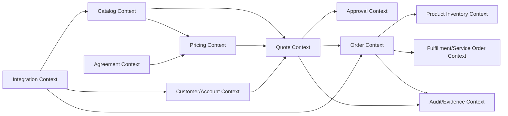
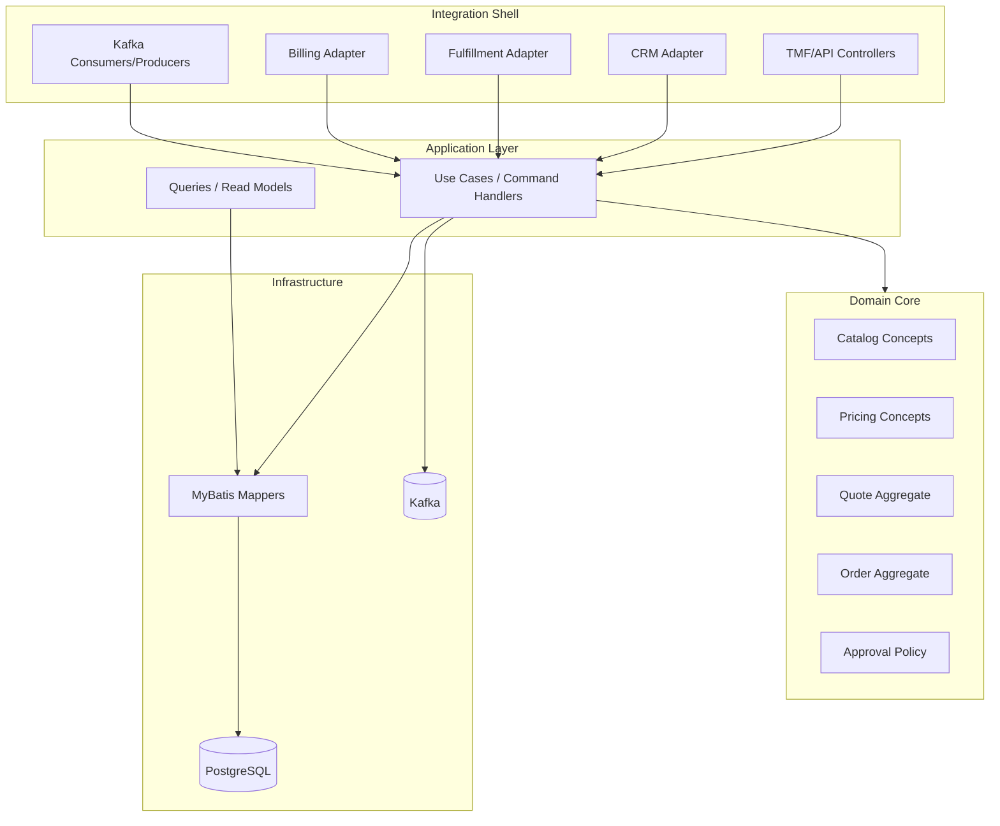
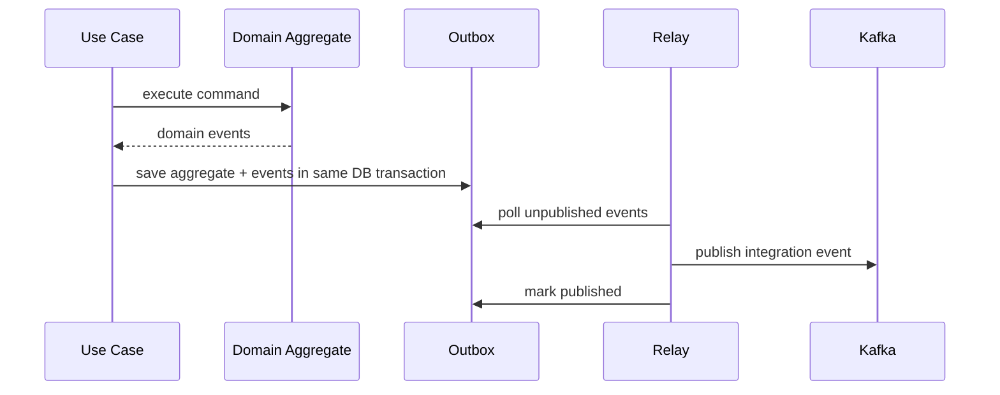

# Part 018 — Domain Modelling and Bounded Contexts for Quote & Order

## 1. Tujuan Part Ini

Part ini membahas **domain modelling** dan **bounded contexts** untuk sistem Quote & Order enterprise.

Setelah mempelajari domain CPQ, quote-to-cash, catalog-driven architecture, telco BSS/OSS, dan TM Forum Open APIs, sekarang kita masuk ke pertanyaan yang lebih fundamental:

> Bagaimana membagi sistem agar business logic tidak berubah menjadi lumpur besar bernama `OrderService`?

Dalam sistem enterprise, istilah seperti `Product`, `Order`, `Customer`, `Price`, dan `Agreement` terlihat sederhana, tetapi sebenarnya punya makna berbeda di context berbeda.

Contoh:

| Istilah | Di Catalog | Di Quote | Di Order | Di Inventory | Di Billing |
|---|---|---|---|---|---|
| Product | definisi yang bisa dijual | offering yang dipilih | commitment yang harus dipenuhi | instance yang dimiliki customer | item yang ditagih |
| Price | published price | calculated quote price | committed commercial term | mungkin tidak relevan langsung | charge/fee/invoice basis |
| Customer | target segment/eligibility | buyer/prospect/account | party penerima order | owner installed base | billing account |

Jika semua makna ini dipaksa masuk ke satu model global, sistem akan sulit diubah, sulit diuji, dan sulit dijaga correctness-nya.

Prinsip utama:

> The same noun can mean different things in different parts of the business. A strong system makes those meanings explicit instead of hiding them in one shared model.

---

## 2. Boundary: Industry Concept vs Internal Implementation

### 2.1 Konsep industri umum yang aman digunakan

Konsep berikut aman dipakai sebagai mental model umum:

- quote-to-cash terdiri dari beberapa capability berbeda;
- catalog, quote, pricing, order, inventory, fulfillment, billing, dan customer management memiliki concern yang berbeda;
- TM Forum/SID/Open APIs membantu memberi vocabulary lintas BSS/OSS;
- microservices biasanya mencoba memisahkan capability dan ownership;
- bounded context membantu membatasi makna domain model;
- anti-corruption layer membantu memisahkan external contract dari internal domain;
- event-driven consistency sering dipakai untuk koordinasi lintas context.

### 2.2 Hal yang tidak boleh diasumsikan

Jangan mengasumsikan bahwa:

- setiap bounded context pasti menjadi microservice;
- nama service internal sama dengan bounded context;
- CSG Quote & Order punya context boundary tertentu tanpa verifikasi;
- semua context punya database sendiri;
- shared library internal selalu buruk;
- TMF resource adalah aggregate root internal;
- DDD tactical pattern harus diterapkan formal di semua tempat;
- existing architecture salah hanya karena tidak mengikuti textbook DDD;
- domain model harus bebas 100% dari persistence concern;
- semua consistency harus diselesaikan dengan event.

### 2.3 Internal verification checklist

Cek secara internal:

- service/module map;
- repository/module boundary;
- database ownership;
- team ownership;
- API ownership;
- event ownership;
- glossary internal;
- domain model classes;
- shared libraries;
- known circular dependencies;
- pain point akibat shared model;
- source of truth per entity;
- architecture diagrams;
- old ADR/design docs;
- recent PR yang mengubah domain model.

---

## 3. Why Domain Modelling Matters in Quote & Order

Quote & Order bukan sistem CRUD.

Ia adalah sistem yang menjaga transformasi:

```text
Commercial intent
  → configured solution
  → priced commitment
  → approved quote
  → accepted quote
  → product order
  → fulfillment work
  → installed product/service
  → billing/commercial record
```

Setiap panah punya invariant.

Contoh invariant:

- quote yang expired tidak boleh dikonversi ke order;
- accepted quote tidak boleh diam-diam direprice;
- order item tidak boleh fulfilled sebelum prerequisite item selesai;
- cancellation tidak boleh menghapus audit trail;
- price snapshot harus menjelaskan keputusan harga saat quote diterima;
- customer-specific agreement harus berlaku pada tanggal quote/order yang tepat;
- product inventory tidak boleh dianggap fresh tanpa freshness contract;
- tenant ID tidak boleh hilang di event, query, atau audit.

Jika domain model buruk, invariant ini tersebar di:

- controller;
- mapper;
- SQL;
- UI;
- Kafka consumer;
- background job;
- integration adapter;
- stored procedure;
- test fixture;
- support script.

Akibatnya, sistem tampak bekerja sampai ada edge case production.

---

## 4. Bounded Context Candidates

Berikut candidate bounded contexts untuk Quote & Order enterprise. Ini bukan klaim tentang arsitektur internal CSG. Ini adalah model analisis untuk onboarding dan review.



### 4.1 Catalog Context

Concern:

- product specification;
- product offering;
- product offering price;
- characteristic definition;
- compatibility/eligibility rule source;
- bundle structure;
- lifecycle/version/effective date;
- publish process.

Core question:

> What can be sold, under what commercial/technical constraints, and from which effective version?

Not responsible for:

- calculating customer-specific final quote price;
- approving a discount;
- deciding order fulfillment state;
- representing installed product instance.

Common leakage:

- quote logic mutates catalog definition;
- pricing logic depends on draft catalog unexpectedly;
- order stores live reference without snapshot;
- catalog characteristic becomes general-purpose custom field bag.

### 4.2 Pricing Context

Concern:

- base price resolution;
- recurring/non-recurring charge;
- discount application;
- enterprise agreement overlay;
- margin guardrail;
- tax/fee handoff if applicable;
- pricing explanation;
- price snapshot.

Core question:

> What price is defensible for this configured solution, customer context, agreement, and time?

Not responsible for:

- quote negotiation lifecycle;
- customer identity master;
- catalog publish lifecycle;
- order fulfillment.

Common leakage:

- pricing calculation reads mutable quote state directly;
- discount approval is mixed with price calculation;
- pricing result has no explanation/audit basis;
- margin guardrail buried in UI validation.

### 4.3 Quote Context

Concern:

- quote lifecycle;
- quote item hierarchy;
- quote versioning;
- quote validity/expiry;
- quote acceptance;
- quote-to-order eligibility;
- commercial snapshot.

Core question:

> What commercial commitment is being proposed, negotiated, approved, and accepted?

Not responsible for:

- being the customer master;
- managing catalog lifecycle;
- executing fulfillment;
- representing product inventory after completion.

Common leakage:

- quote becomes a dump of catalog/customer/order fields;
- quote state transition is controlled by UI;
- quote acceptance does not lock price/configuration;
- quote versioning is implemented as overwrite.

### 4.4 Approval Context

Concern:

- approval policy;
- threshold;
- approver authority;
- maker-checker separation;
- approval task lifecycle;
- delegation/escalation;
- approval evidence.

Core question:

> Who is authorized to approve this exception and based on what evidence?

Not responsible for:

- calculating price;
- owning quote lifecycle entirely;
- storing all customer data.

Common leakage:

- approval rules duplicated in quote and UI;
- approval status treated as a boolean;
- approval evidence not tied to the quote version approved;
- approver authority checked only in frontend.

### 4.5 Customer/Account Context

Concern:

- customer reference;
- account hierarchy;
- billing account reference;
- related party;
- segment;
- customer status;
- external identity mapping;
- PII boundary.

Core question:

> Who is the commercial/customer entity involved, and what references are trusted?

Not responsible for:

- catalog lifecycle;
- pricing calculation details;
- order decomposition.

Common leakage:

- quote/order duplicates customer master data without freshness semantics;
- tenant ID confused with customer ID;
- account hierarchy snapshot not captured when needed;
- PII replicated into logs/events.

### 4.6 Agreement Context

Concern:

- enterprise agreement;
- contract term;
- entitlement;
- negotiated discount;
- commercial constraint;
- effective date;
- renewal/amendment condition.

Core question:

> What contractual conditions govern this customer’s commercial options?

Not responsible for:

- calculating full quote price alone;
- deciding order fulfillment;
- managing product catalog definition.

Common leakage:

- agreement represented as plain string ID;
- expired agreement still used in pricing;
- agreement amendment not propagated to active quote;
- entitlement logic duplicated across services.

### 4.7 Order Context

Concern:

- product order lifecycle;
- order item action;
- order validation;
- decomposition trigger;
- orchestration state;
- cancellation/amendment/retry;
- fallout handling;
- completion criteria.

Core question:

> What committed customer request must now be executed and tracked to completion?

Not responsible for:

- acting as product catalog;
- calculating quote price after acceptance;
- owning service activation implementation;
- being product inventory master unless explicitly designed that way.

Common leakage:

- order state and fulfillment state collapsed into one field;
- order item dependencies implicit;
- retry creates duplicate downstream side effect;
- cancellation treated as delete.

### 4.8 Product Inventory Context

Concern:

- installed base;
- product instance lifecycle;
- customer-owned products;
- product relationship;
- inventory freshness;
- amendment input;
- reconciliation with fulfillment/billing.

Core question:

> What does the customer currently have, and how reliable is that view?

Not responsible for:

- defining sellable offers;
- approving discounts;
- executing service activation.

Common leakage:

- catalog offering confused with inventory product instance;
- quote assumes inventory lookup is strongly consistent;
- amendment relies on stale installed base;
- inventory update has no causation link to order.

### 4.9 Fulfillment/Service Order Context

Concern:

- service order;
- task plan;
- dependency graph;
- service/resource activation;
- downstream adapter;
- fallout;
- retry/resume;
- compensation.

Core question:

> What operational work must be done to realize the product order?

Not responsible for:

- quote approval;
- product catalog ownership;
- customer commercial agreement.

Common leakage:

- product order item maps one-to-one to service order item without rule;
- fulfillment failure directly mutates quote;
- downstream error taxonomy leaks to customer API without translation;
- retry strategy ignores idempotency.

### 4.10 Audit/Evidence Context

Concern:

- immutable business event;
- actor attribution;
- before/after values;
- approval evidence;
- compliance retention;
- correlation/causation;
- support reconstruction.

Core question:

> Can we explain who did what, when, why, and with what business evidence?

Not responsible for:

- domain state mutation decisions;
- being a debug log replacement;
- storing unbounded sensitive payloads.

Common leakage:

- audit is implemented as application log;
- audit event missing actor or tenant;
- audit not tied to version approved;
- sensitive data logged without redaction.

### 4.11 Integration Context

Concern:

- external API mapping;
- CRM/billing/fulfillment/customer adapter;
- TMF facade;
- protocol transformation;
- retry/backoff;
- external correlation;
- reconciliation.

Core question:

> How do we isolate external system variability from the core domain?

Not responsible for:

- owning core business invariant;
- changing domain semantics per customer without explicit policy.

Common leakage:

- customer-specific logic in core order service;
- adapter mutates internal state without command boundary;
- external error code becomes domain state;
- integration retry causes duplicate order.

---

## 5. Bounded Context Is Not Always a Microservice

A bounded context is a **semantic boundary**. A microservice is a **deployment boundary**.

They often correlate, but they are not identical.

### 5.1 Possible mappings

| Context relation | Implementation option |
|---|---|
| Small team, early stage | multiple contexts inside one modular monolith |
| Mature product, clear ownership | separate services per context |
| High integration variance | adapter services around core domain |
| Strong transaction needs | keep related contexts in one service/module |
| High scale difference | split read-heavy/search context |

### 5.2 When not to split into microservice

Do not split only because:

- the noun is different;
- a diagram looks cleaner;
- a standard has separate API;
- a team wants ownership boundary;
- current code is messy.

Split only when there is a strong reason:

- independent scaling;
- independent lifecycle;
- independent data ownership;
- independent team ownership;
- isolation of failure/blast radius;
- integration variability;
- compliance boundary;
- deployment frequency difference.

### 5.3 Microservice split can make correctness worse

Example:

```text
Quote Service
Pricing Service
Approval Service
Agreement Service
```

If quote acceptance needs atomic guarantee that:

- quote version is latest;
- price snapshot is approved;
- agreement is still valid;
- approval applies to this exact price;
- quote is not expired;

then splitting everything without a consistency strategy creates bugs.

Pattern:

- keep invariant-critical decision in one transactional boundary when possible;
- otherwise model it as explicit saga/process with compensation and audit;
- never rely on “eventual consistency” without defining allowed inconsistency window and recovery.

---

## 6. Context Map Patterns

### 6.1 Upstream/downstream

Catalog is usually upstream of quote and pricing.

```text
Catalog → Quote/Pricing
```

Risk:

- downstream assumes catalog is immutable;
- upstream changes break quote calculation;
- catalog version not captured.

Mitigation:

- effective dating;
- catalog version snapshot;
- publish event;
- compatibility validation.

### 6.2 Customer/supplier

Order may depend on fulfillment system.

```text
Order Context → Fulfillment Context
```

Order is customer of fulfillment capability.

Risk:

- fulfillment exposes technical failure that order cannot interpret;
- order blocks forever waiting for downstream;
- retry duplicates side effect.

Mitigation:

- explicit contract;
- timeout;
- idempotency;
- fallout state;
- service order abstraction.

### 6.3 Conformist

A context may conform to external standard or upstream model.

```text
TMF API → Internal Facade
```

Use if standard alignment is valuable.

Risk:

- internal model becomes dictated by external contract.

Mitigation:

- anti-corruption layer;
- versioned mapping;
- internal canonical command.

### 6.4 Anti-corruption layer

Use when external model is necessary but not identical to internal model.

```text
External TMF622 ProductOrder
  → ProductOrderAdapter
  → SubmitOrderCommand
  → Order Aggregate
```

ACL responsibilities:

- map vocabulary;
- normalize extension;
- validate contract-level syntax;
- preserve source metadata;
- translate errors;
- prevent external coupling.

### 6.5 Shared kernel

Shared kernel can be useful for stable primitives:

- tenant ID;
- correlation ID;
- money value object;
- date range;
- pagination;
- error envelope;
- audit metadata.

But shared kernel becomes dangerous when it includes mutable domain concepts:

- `Product`;
- `Customer`;
- `Order`;
- `Price`;
- `Agreement`.

Rule:

> Share primitives and contracts carefully. Do not share domain meaning casually.

---

## 7. Aggregate Design Candidates

### 7.1 Quote Aggregate

Possible aggregate root:

```text
Quote
  quoteId
  tenantId
  customerRef
  accountRef
  catalogVersionRef
  state
  version
  items[]
  priceSnapshot
  approvalSnapshot
  validityPeriod
  auditMetadata
```

Responsibilities:

- add/remove/configure quote item;
- apply price result;
- request approval;
- mark approved/rejected;
- accept quote;
- expire quote;
- convert to order command.

Invariant examples:

- cannot accept expired quote;
- cannot accept unpriced quote;
- cannot convert rejected quote;
- cannot modify accepted quote without new version;
- approval must match quote version and price snapshot.

### 7.2 Order Aggregate

Possible aggregate root:

```text
ProductOrder
  orderId
  tenantId
  quoteRef
  customerRef
  state
  items[]
  submittedAt
  requestedCompletionDate
  orchestrationPlanRef
  sourceContract
  auditMetadata
```

Responsibilities:

- validate captured order;
- acknowledge order;
- decompose order;
- mark item progress;
- handle fallout;
- cancel;
- retry/resume;
- complete.

Invariant examples:

- cannot complete order while required item is incomplete;
- cannot cancel completed order without reversal/amendment path;
- cannot retry non-idempotent task without dedupe key;
- cannot decompose invalid order;
- item dependency must not form cycle.

### 7.3 Catalog Offering Aggregate

Possible aggregate root:

```text
ProductOffering
  offeringId
  catalogId
  version
  lifecycleState
  validityPeriod
  specifications
  prices
  characteristics
  relationships
```

Invariant examples:

- published offering cannot be mutated in place;
- effective date range must be valid;
- retired offering cannot be used for new quote unless grandfathering rule allows;
- characteristic value constraint must be valid.

### 7.4 Approval Aggregate

Possible aggregate root:

```text
ApprovalRequest
  approvalId
  quoteRef
  quoteVersion
  priceSnapshotRef
  requestedBy
  requiredAuthority
  state
  decisions[]
```

Invariant examples:

- approver cannot approve own request if segregation of duties applies;
- approval cannot apply to changed quote version;
- rejected approval cannot be reused;
- expired approval cannot authorize order conversion.

---

## 8. Value Objects that Matter

Use value objects to make invalid states harder to represent.

### 8.1 Money

Do not pass money as raw `BigDecimal` everywhere.

```java
public record Money(BigDecimal amount, Currency currency) {
    public Money {
        Objects.requireNonNull(amount);
        Objects.requireNonNull(currency);
        if (amount.scale() > currency.getDefaultFractionDigits()) {
            throw new IllegalArgumentException("Invalid scale for currency");
        }
    }
}
```

Consider:

- currency;
- precision;
- rounding mode;
- tax inclusion/exclusion;
- recurring vs non-recurring;
- price period.

### 8.2 Date range / validity period

```java
public record ValidityPeriod(Instant start, Instant end) {
    public boolean contains(Instant instant) { ... }
}
```

Important for:

- catalog effective date;
- quote validity;
- agreement term;
- price validity;
- promotion window.

### 8.3 Tenant ID

Never treat tenant as optional metadata.

```java
public record TenantId(String value) { }
```

Tenant must propagate through:

- API;
- command;
- domain;
- repository;
- Kafka event;
- audit;
- log;
- trace.

### 8.4 External reference

External IDs should be typed.

```java
public record ExternalReference(
    String sourceSystem,
    String externalId,
    String referenceType
) {}
```

Avoid:

```java
String crmId;
String externalId;
String ref;
```

because their meaning drifts.

---

## 9. Entity vs Value Object vs Reference vs Snapshot

This distinction is critical in Quote & Order.

| Concept | Use when | Example |
|---|---|---|
| Entity | identity and lifecycle matter | Quote, ProductOrder, ApprovalRequest |
| Value Object | equality by value | Money, ValidityPeriod, Address snapshot |
| Reference | external source remains authoritative | CustomerRef, ProductOfferingRef |
| Snapshot | historical correctness matters | PriceSnapshot, CatalogSnapshot, AgreementSnapshot |

### 9.1 Reference vs snapshot decision

Ask:

- Do we need historical reconstruction?
- Can source data change later?
- Would future changes alter past business decision?
- Is data needed for audit?
- Is data needed for order fulfillment after quote acceptance?

Examples:

```text
Customer legal name:
  maybe reference + selected snapshot fields for audit

Product offering definition:
  snapshot version/reference needed for quote/order correctness

Price calculation result:
  snapshot required

Inventory current status:
  reference/query may be enough, but amendment may need snapshot
```

### 9.2 Snapshot is not uncontrolled duplication

Snapshot should be intentional:

```json
{
  "catalogVersion": "CAT-2026-07-01",
  "offeringId": "enterprise-fiber-1g",
  "offeringVersion": "14",
  "priceComponents": [
    {"type": "MRC", "amount": "1000.00", "currency": "USD"}
  ],
  "calculatedAt": "2026-07-08T10:00:00Z",
  "pricingPolicyVersion": "pricing-policy-2026.07"
}
```

Purpose:

- explain historical decision;
- support audit;
- avoid live catalog mutation changing accepted quote;
- support dispute resolution.

---

## 10. Commands, Events, and Queries

### 10.1 Commands

Commands express intent.

Examples:

```text
ConfigureQuoteItem
CalculateQuotePrice
SubmitQuoteForApproval
ApproveQuote
AcceptQuote
ConvertQuoteToOrder
SubmitProductOrder
CancelProductOrder
RetryFulfillmentTask
```

Command should include:

- tenant;
- actor;
- correlation ID;
- causation ID;
- idempotency key when external;
- source system;
- expected version if optimistic locking;
- reason/comment if business action.

### 10.2 Domain events

Events state that something happened.

Examples:

```text
QuotePriced
QuoteSubmittedForApproval
QuoteApproved
QuoteAccepted
QuoteConvertedToOrder
ProductOrderSubmitted
ProductOrderDecomposed
ProductOrderItemFailed
ProductOrderCompleted
```

Good event names are past tense and business meaningful.

Avoid vague events:

```text
QuoteUpdated
OrderChanged
StatusModified
```

unless they are purely technical/audit events.

### 10.3 Queries

Queries serve views.

Do not overload aggregate model for every read need.

Possible read models:

- quote search view;
- order operational dashboard;
- fallout queue;
- customer quote history;
- pricing explanation view;
- integration status view;
- audit reconstruction view.

Read model can be denormalized, but must have freshness semantics.

---

## 11. State Machines Belong in Domain, Not in Random Status Updates

Bad pattern:

```java
order.setStatus(request.getStatus());
orderRepository.save(order);
```

Better:

```java
order.markFulfillmentStarted(command.actor(), command.reason(), command.occurredAt());
```

The method should enforce:

- current state allowed;
- actor permission if domain-level;
- required data;
- event emission;
- audit metadata;
- item-level consistency.

### 11.1 Transition matrix

For each lifecycle, create transition matrix:

| From | Action | To | Guard | Event | Audit required |
|---|---|---|---|---|---|
| Draft | submitForPricing | Pricing | quote has items | QuotePricingRequested | yes |
| Priced | submitForApproval | PendingApproval | discount exceeds threshold | QuoteApprovalRequested | yes |
| Approved | accept | Accepted | not expired | QuoteAccepted | yes |
| Accepted | convertToOrder | Ordered | idempotency key unique | QuoteConvertedToOrder | yes |

If no matrix exists, state machine likely lives in developer memory.

---

## 12. Avoiding the God Order Model

A common enterprise anti-pattern:

```java
class Order {
  String customerName;
  String accountNumber;
  String productName;
  String productSpec;
  BigDecimal price;
  String discountRule;
  String agreementTerm;
  String quoteStatus;
  String serviceStatus;
  String billingStatus;
  String inventoryStatus;
  String fulfillmentError;
  String approvalStatus;
  String crmPayload;
  String billingPayload;
  String customField1;
  String customField2;
  String customField3;
}
```

This class is not a domain model. It is an integration landfill.

Symptoms:

- every feature modifies Order;
- tests require huge fixture;
- fields are null in many states;
- validation has many `if status == ...` branches;
- no one knows source of truth;
- customer-specific fields leak everywhere;
- reporting, fulfillment, and pricing fight over same table.

Refactoring direction:

```text
Order Aggregate
  owns order lifecycle and item dependency

Order Commercial Snapshot
  captures committed commercial terms

Fulfillment Plan
  tracks operational decomposition

Integration References
  tracks external system IDs

Audit Events
  reconstruct business decisions

Read Models
  serve operational/search needs
```

---

## 13. Service Boundary Heuristics

When evaluating a service/module boundary, ask:

### 13.1 Business ownership

- Who owns the rule?
- Who changes it?
- Who gets paged if it fails?
- Who explains it to product/customer?

### 13.2 Data ownership

- Who writes the data?
- Who is source of truth?
- Is data mutable?
- Is historical snapshot required?
- Is reconciliation required?

### 13.3 Transaction boundary

- Which invariants must be atomic?
- Which updates can be eventually consistent?
- What is the allowed inconsistency window?
- How is inconsistency detected?
- How is inconsistency repaired?

### 13.4 Scale and performance

- Is workload read-heavy or write-heavy?
- Is latency-sensitive?
- Is batch-heavy?
- Does it need caching?
- Does it have different scaling behavior?

### 13.5 Integration volatility

- Does this boundary interact with many external systems?
- Does it vary by customer?
- Does it need adapter isolation?
- Does it have different release cadence?

---

## 14. Context Coupling Smells

### 14.1 Shared mutable model

Smell:

```text
common-domain.jar contains Product, Customer, Quote, Order, Price, Agreement
```

Risk:

- all services depend on same model;
- changes require coordinated release;
- domain semantics become ambiguous;
- compatibility breaks silently.

Better:

- share IDs/value primitives;
- share explicit API contracts;
- duplicate small models when meaning differs;
- map across context boundaries.

### 14.2 Database coupling

Smell:

```text
Quote service reads order tables directly.
Billing adapter updates order state directly.
Fulfillment job joins catalog draft tables.
```

Risk:

- source of truth unclear;
- transaction boundary hidden;
- schema migration dangerous;
- audit incomplete.

Better:

- expose query API/read model;
- publish events;
- create controlled database views only if explicitly governed;
- document ownership.

### 14.3 Event as shared database

Smell:

```text
Every event contains full aggregate snapshot, and every consumer depends on every field.
```

Risk:

- event schema becomes global model;
- changing field becomes breaking;
- PII leaks;
- replay becomes expensive.

Better:

- event purpose explicit;
- contract owner defined;
- minimal stable payload;
- versioned schema;
- dedicated read model events if needed.

### 14.4 Customer-specific branching in core

Smell:

```java
if (tenant.isCustomerA()) {
    applySpecialPricingBehavior();
}
```

Risk:

- product behavior forks invisibly;
- tests explode;
- bugs become customer-specific mystery;
- core becomes impossible to reason about.

Better:

- customer config;
- strategy/policy object;
- adapter-level mapping;
- feature flag with lifecycle;
- explicit product variant only if intentional.

---

## 15. Architecture Shape: Modular Core with Integration Shell

One useful mental model:



Dependency direction:

```text
Integration Shell → Application → Domain
Infrastructure implements ports used by Application
Domain does not depend on API DTO, Kafka record, MyBatis mapper, or PostgreSQL table.
```

In real systems, this ideal is often imperfect. The goal is not purity. The goal is controlled coupling.

---

## 16. Implementation Pattern in Java

### 16.1 Application command

```java
public record AcceptQuoteCommand(
    TenantId tenantId,
    QuoteId quoteId,
    UserId actorId,
    Instant acceptedAt,
    String idempotencyKey,
    String correlationId,
    String causationId,
    long expectedQuoteVersion
) {}
```

### 16.2 Use case

```java
public final class AcceptQuoteUseCase {
    private final QuoteRepository quoteRepository;
    private final AuthorizationService authorizationService;
    private final DomainEventPublisher eventPublisher;

    public AcceptQuoteResult handle(AcceptQuoteCommand command) {
        authorizationService.requirePermission(
            command.actorId(),
            command.tenantId(),
            Permission.ACCEPT_QUOTE
        );

        Quote quote = quoteRepository.findForUpdate(
            command.tenantId(),
            command.quoteId()
        ).orElseThrow(QuoteNotFoundException::new);

        quote.accept(
            command.actorId(),
            command.acceptedAt(),
            command.expectedQuoteVersion()
        );

        quoteRepository.save(quote);
        eventPublisher.publishAll(quote.pullDomainEvents());

        return new AcceptQuoteResult(quote.id(), quote.state());
    }
}
```

### 16.3 Domain method

```java
public void accept(UserId actorId, Instant acceptedAt, long expectedVersion) {
    ensureVersion(expectedVersion);
    ensureState(QuoteState.APPROVED);
    ensureNotExpired(acceptedAt);
    ensurePriceSnapshotExists();
    ensureApprovalMatchesCurrentVersion();

    this.state = QuoteState.ACCEPTED;
    this.acceptedAt = acceptedAt;
    this.version++;

    recordEvent(new QuoteAccepted(
        this.id,
        this.tenantId,
        this.version,
        actorId,
        acceptedAt,
        this.priceSnapshot.id(),
        this.approvalSnapshot.id()
    ));
}
```

The point is not exact code style. The point is that lifecycle invariant is visible and testable.

---

## 17. Persistence Mapping Without Letting DB Own the Domain

MyBatis mapper should not become domain logic.

### 17.1 Repository boundary

```java
public interface QuoteRepository {
    Optional<Quote> findForUpdate(TenantId tenantId, QuoteId quoteId);
    void save(Quote quote);
}
```

### 17.2 Mapper layer

```java
@Mapper
interface QuoteMapper {
    QuoteRow selectForUpdate(@Param("tenantId") String tenantId,
                             @Param("quoteId") String quoteId);

    List<QuoteItemRow> selectItems(@Param("tenantId") String tenantId,
                                   @Param("quoteId") String quoteId);

    int updateQuote(QuoteRow row);
}
```

### 17.3 Reconstitution

Repository maps rows to domain:

```text
QuoteRow + QuoteItemRows + SnapshotRows → Quote aggregate
```

Keep decisions explicit:

- which fields are part of aggregate;
- which fields are read model only;
- which fields are snapshots;
- which fields are external references;
- which fields are audit metadata.

---

## 18. Events Across Contexts

### 18.1 Domain event vs integration event

Domain event:

```text
QuoteAccepted
```

Internal meaning:

- quote state changed from Approved to Accepted;
- price snapshot locked;
- approval snapshot matched;
- actor accepted quote.

Integration event:

```text
QuoteAcceptedNotificationForCRM
```

External meaning:

- CRM can update opportunity/quote status;
- payload shape follows CRM/TMF/customer contract.

Do not confuse them.

### 18.2 Event publication ownership

Possible pattern:



This protects against:

- DB commit succeeds but event lost;
- event emitted before transaction commits;
- crash between save and publish.

---

## 19. Testing Domain Boundaries

### 19.1 Unit tests for aggregate invariants

Example test names:

```text
acceptQuote_fails_whenQuoteExpired
acceptQuote_fails_whenQuoteNotApproved
acceptQuote_fails_whenApprovalSnapshotDoesNotMatchVersion
convertQuoteToOrder_isIdempotent_forSameIdempotencyKey
cancelOrder_doesNotDeleteAuditTrail
completeOrder_fails_whenRequiredItemIncomplete
```

### 19.2 Contract tests for boundary mapping

Test:

```text
TMF622 v5 ProductOrder payload
  → SubmitProductOrderCommand
  → expected canonical fields
```

and:

```text
ProductOrder domain result
  → TMF622 v4 response
  → compatible with old consumer fixture
```

### 19.3 Repository tests

Test:

- reconstitution from DB rows;
- optimistic locking;
- `SELECT FOR UPDATE` behavior;
- tenant filtering;
- JSONB extension mapping if any;
- migration compatibility.

### 19.4 Event tests

Test:

- event emitted on transition;
- event metadata complete;
- correlation/causation propagated;
- event schema compatible;
- replay idempotent.

---

## 20. Failure Modes

### 20.1 Shared Product model corrupts semantics

Symptom:

- same `Product` class used by catalog, quote, order, inventory;
- fields added for one context break another;
- null checks explode.

Root cause:

- noun reused without context boundary.

Prevention:

- context-specific models;
- explicit mapping;
- bounded context glossary.

### 20.2 Invariant split across services without process model

Symptom:

- quote accepted but approval later rejected;
- order created from stale price;
- fulfillment starts before validation complete.

Root cause:

- invariant-critical steps split without saga/state machine.

Prevention:

- define atomic boundary;
- define process manager;
- snapshot decision evidence;
- use version checks.

### 20.3 Customer-specific logic leaks into core

Symptom:

- bug only occurs for Customer A;
- codebase full of tenant conditionals;
- tests duplicate per customer.

Root cause:

- customization not isolated.

Prevention:

- adapter boundary;
- policy objects;
- config registry;
- feature flag lifecycle.

### 20.4 Read model mistaken for source of truth

Symptom:

- support dashboard correction changes business state;
- search index stale data used for validation;
- reconciliation finds impossible state.

Root cause:

- read model ownership unclear.

Prevention:

- label read models;
- source-of-truth map;
- command-only mutation;
- freshness SLA.

### 20.5 Domain event becomes integration landfill

Symptom:

- every consumer asks for more fields;
- event payload includes PII, catalog, pricing, fulfillment, billing fields;
- schema changes constantly.

Root cause:

- no distinction between domain event and integration/read model events.

Prevention:

- define event purpose;
- create specific projections;
- version contracts;
- avoid global event model.

---

## 21. Senior Engineer Review Checklist

Saat mereview desain/domain model, tanyakan:

### Context boundary

- Context apa yang sedang diubah?
- Apakah model ini punya makna yang sama di context lain?
- Apakah ada leakage dari external API ke domain?
- Apakah customer-specific behavior masuk core?

### Invariant

- Invariant apa yang dijaga?
- Di mana invariant ditegakkan?
- Apakah invariant butuh transaction boundary?
- Apakah test invariant ada?
- Apakah stale data bisa melanggar invariant?

### Data ownership

- Siapa source of truth?
- Apakah data reference atau snapshot?
- Apakah historical reconstruction diperlukan?
- Apakah tenant boundary enforced?
- Apakah direct DB access lintas context terjadi?

### Integration

- Apakah mapping external contract eksplisit?
- Apakah anti-corruption layer ada?
- Apakah error translation jelas?
- Apakah idempotency dipertahankan?
- Apakah event contract sesuai purpose?

### Operations

- Bagaimana mendeteksi state invalid?
- Bagaimana memperbaiki data salah?
- Bagaimana tracing lintas context?
- Bagaimana rollback/migration?
- Apakah support bisa menjelaskan behavior?

---

## 22. Internal Verification Checklist

Gunakan ini sebagai tugas onboarding.

### Architecture and ownership

- Buat daftar service/module.
- Catat owner setiap service/module.
- Catat database/schema ownership.
- Catat event topic ownership.
- Catat API ownership.

### Domain model inventory

- Temukan class utama: Quote, Order, Product, Customer, Agreement, Price.
- Catat package/module masing-masing.
- Catat apakah model dipakai lintas context.
- Catat field yang tampak overloaded.
- Catat lifecycle methods vs setter langsung.

### Context map

- Gambar context map aktual.
- Tandai upstream/downstream.
- Tandai shared kernel.
- Tandai anti-corruption layer.
- Tandai direct DB coupling.
- Tandai event coupling.

### Invariant discovery

Cari invariant dari:

- tests;
- controller validation;
- domain service;
- SQL constraints;
- migration scripts;
- support scripts;
- incident/postmortem;
- PR discussion;
- business docs.

### Pain point discovery

Tanyakan ke tim:

- Model mana yang paling sulit diubah?
- Service mana yang paling sering menyebabkan regression?
- Field mana yang meaning-nya ambigu?
- Integration mana yang paling brittle?
- State mana yang paling sering stuck?
- Data inconsistency apa yang paling sering direpair?

---

## 23. Practical Exercise

Buat artifact onboarding:

```text
Quote & Order Context Map v0.1
```

Isi:

1. Candidate bounded contexts.
2. Actual services/modules.
3. Mapping context → service/module.
4. Source of truth per major entity.
5. Main commands per context.
6. Main events per context.
7. Shared models/libraries.
8. Known coupling.
9. Top 5 invariant-critical flows.
10. Top 5 architecture questions untuk team lead/principal.

Gunakan format sederhana:

```md
## Context: Quote

Owner:
Service/module:
Database tables:
Main commands:
Main events:
External APIs:
Upstream dependencies:
Downstream dependencies:
Invariants:
Known risks:
Questions:
```

---

## 24. Ringkasan

Key takeaways:

- Domain modelling penting karena Quote & Order menjaga commercial, operational, financial, and audit correctness.
- Bounded context adalah semantic boundary, bukan otomatis microservice.
- Noun yang sama seperti Product, Order, Customer, Price bisa punya meaning berbeda di context berbeda.
- Jangan biarkan TMF DTO, database row, Kafka event, dan domain aggregate menjadi satu model yang sama.
- Pisahkan reference vs snapshot secara eksplisit.
- State transition harus menjadi domain behavior, bukan random status update.
- Anti-corruption layer melindungi domain core dari external contract/customer-specific variability.
- Senior engineer harus melihat coupling, invariant, ownership, source of truth, and recovery path.

---

## 25. Next Part

Part berikutnya akan masuk ke:

```text
Part 019 — Quote Aggregate, Order Aggregate, and Lifecycle Invariants
```

Kita akan mengambil model boundary dari part ini, lalu memperdalam aggregate design, invariant taxonomy, lifecycle guard, optimistic locking, command handling, and correctness tests.
