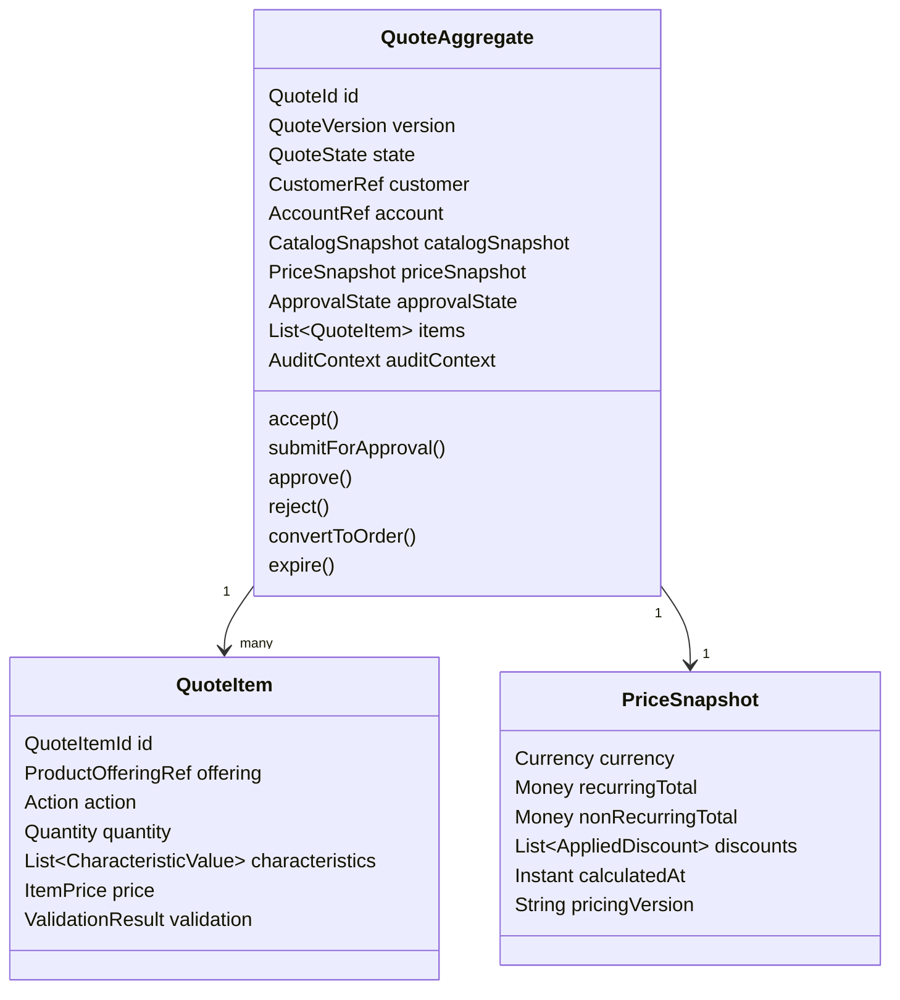
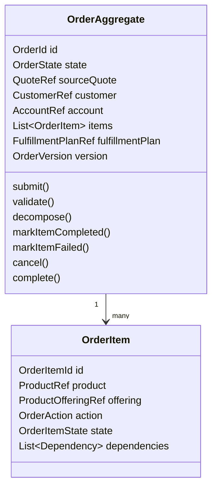
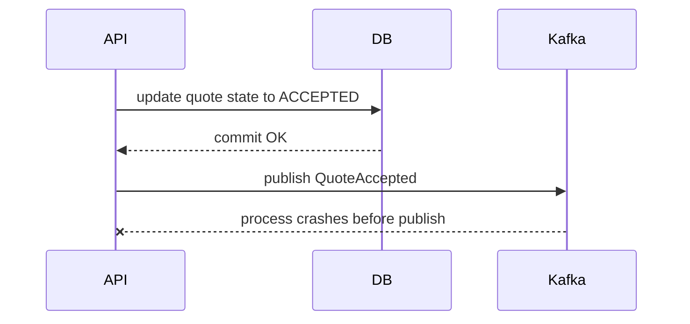
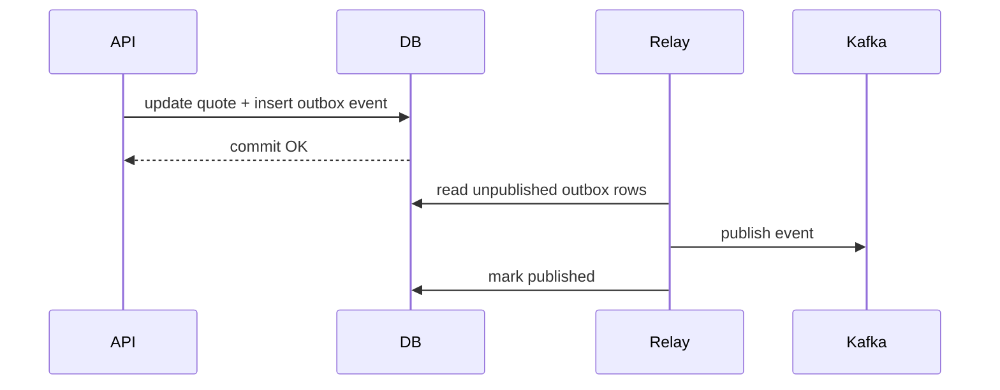

# Part 019 — Quote Aggregate, Order Aggregate, and Lifecycle Invariants

> **Core idea:** sistem Quote & Order yang kuat bukan dimulai dari endpoint, tabel, atau event. Sistem yang kuat dimulai dari pertanyaan: **apa yang harus selalu benar?**

Part ini membahas quote dan order sebagai domain aggregate, bukan sekadar DTO atau database record. Tujuannya adalah membuat mental model yang cukup kuat untuk membaca codebase, mereview PR, mendesain perubahan domain, dan mendeteksi bug lifecycle sebelum berubah menjadi incident produksi.

---

## 1. Source Boundary

Bagian ini menggunakan tiga jenis sumber pengetahuan:

1. **Informasi publik CSG**  
   CSG secara publik memosisikan Quote & Order sebagai produk CPQ dan order management untuk complex enterprise/telco selling, quote-to-cash, catalog-driven tools/APIs, enterprise agreements, tailored pricing, dan order lifecycle automation.

2. **Konsep industri umum**  
   Aggregate, invariant, state machine, transactional boundary, outbox, idempotency, optimistic locking, dan event-driven consistency adalah konsep engineering umum yang digunakan di banyak sistem enterprise.

3. **TM Forum sebagai vocabulary industri**  
   TMF648 Quote Management dan TMF622 Product Ordering memberi vocabulary untuk quote dan product order API. Namun, TMF model **tidak otomatis sama** dengan model internal CSG. Mapping internal wajib diverifikasi.

> Jangan menyimpulkan bahwa contoh aggregate, state, tabel, atau event di part ini adalah arsitektur internal CSG. Anggap ini sebagai reference mental model untuk onboarding dan review.

---

## 2. Why Aggregate Thinking Matters

Di sistem quote/order, bug yang mahal sering bukan bug syntax atau bug endpoint. Bug yang mahal biasanya berupa:

- quote accepted dengan price yang sudah stale,
- order dibuat dua kali dari quote yang sama,
- approval dilewati karena transition guard tidak konsisten,
- discount diubah setelah approval tanpa re-approval,
- order item completed padahal dependent item gagal,
- cancellation dianggap deletion,
- event duplicate membuat downstream fulfillment dua kali,
- manual correction tidak meninggalkan audit evidence,
- catalog version berubah tapi quote lama dihitung ulang dengan rule baru.

Semua contoh tersebut adalah **invariant failure**.

Aggregate membantu kita menentukan:

- data apa yang harus berubah bersama,
- command apa yang boleh mengubah state,
- rule apa yang harus dicek sebelum perubahan,
- event apa yang harus diterbitkan setelah perubahan,
- race condition apa yang harus dicegah di transaction boundary.

Tanpa aggregate boundary, sistem biasanya berubah menjadi kumpulan service method dan mapper SQL yang saling mengubah state tanpa satu tempat yang jelas untuk business correctness.

---

## 3. Aggregate vs Entity vs DTO vs Table

Sebelum membahas quote/order, pisahkan empat konsep ini.

| Concept | Fungsi | Boleh berisi behavior? | Harus stabil sebagai domain language? | Contoh |
|---|---:|---:|---:|---|
| DTO | Bentuk payload API/event | Tidak ideal | Tidak selalu | `QuoteRequest`, `ProductOrderResponse` |
| Table row | Bentuk persistence | Tidak | Tidak selalu | `quote`, `quote_item`, `order_item` |
| Entity | Object dengan identity lifecycle | Ya | Ya | `Quote`, `Order`, `QuoteItem` |
| Aggregate | Consistency boundary untuk entity/value object | Ya | Sangat ya | `QuoteAggregate`, `OrderAggregate` |

Kesalahan umum: menganggap aggregate harus 1:1 dengan table atau API resource. Dalam sistem enterprise, mapping sering berbeda:

- API quote bisa berisi nested quote item dan pricing detail.
- Database bisa menyimpan quote di banyak tabel.
- Event quote bisa hanya membawa delta/status.
- Aggregate domain menentukan command/invariant, bukan bentuk wire/storage.

---

## 4. Aggregate Boundary Heuristic

Gunakan pertanyaan berikut untuk menemukan aggregate boundary:

1. **Apa yang harus atomic?**  
   Jika dua perubahan harus commit bersama agar rule bisnis benar, keduanya mungkin berada dalam aggregate yang sama.

2. **Apa yang bisa eventually consistent?**  
   Jika perubahan dapat menyusul lewat event/reconciliation, jangan paksa masuk aggregate yang sama.

3. **Siapa yang memiliki lifecycle?**  
   Object yang lifecycle-nya tidak bermakna tanpa parent biasanya child entity/value object.

4. **Apa command utama?**  
   Aggregate bukan sekadar kumpulan data; aggregate adalah target command.

5. **Apa invariant paling penting?**  
   Boundary harus mendukung invariant, bukan mengikuti struktur UI.

6. **Apa concurrency hotspot?**  
   Boundary terlalu besar menciptakan lock contention. Boundary terlalu kecil menciptakan invariant leak.

---

## 5. Quote Aggregate Mental Model

Quote aggregate merepresentasikan commercial proposal yang sedang dibangun, dinegosiasikan, divalidasi, disetujui, diterima, atau dikonversi menjadi order.



Quote aggregate biasanya menjaga invariant seperti:

- quote harus punya customer/account yang valid,
- quote item harus refer ke product offering yang valid pada catalog version tertentu,
- price snapshot harus konsisten dengan item configuration,
- discount tertentu harus memicu approval,
- quote tidak boleh accepted setelah expired,
- quote tidak boleh converted lebih dari sekali,
- quote accepted tidak boleh dimodifikasi tanpa membuat version/amendment baru,
- quote converted harus punya immutable conversion evidence.

---

## 6. Quote Aggregate: Candidate Fields and Semantics

| Field | Domain meaning | Common trap |
|---|---|---|
| `quoteId` | Stable identity quote | Menggunakan ID external sebagai internal primary key tanpa mapping layer |
| `quoteVersion` | Version komersial proposal | Version dianggap sama dengan optimistic lock |
| `state` | Lifecycle state | State hanya string tanpa guard transition |
| `customerRef` | Reference ke customer context | Mengambil live customer data tanpa snapshot saat acceptance |
| `accountRef` | Billing/commercial account context | Account hierarchy diabaikan |
| `catalogSnapshot` | Catalog basis quote | Repricing memakai catalog terbaru secara diam-diam |
| `priceSnapshot` | Price evidence quote | Total disimpan tanpa breakdown/explainability |
| `approvalState` | Commercial governance state | Approval tidak invalidated setelah price/discount berubah |
| `items` | Proposed product structure | Child item update bypass aggregate rule |
| `auditContext` | Actor/correlation/causation | Audit hanya log text, bukan evidence |

---

## 7. Quote Aggregate Invariants

| Invariant | Why it exists | Failure if violated | Enforcement point |
|---|---|---|---|
| Quote must not be accepted after expiry | Commercial validity | Customer accepts stale terms | `acceptQuote` command guard |
| Accepted quote must have valid price snapshot | Revenue correctness | Wrong billing/order price | Pricing validation before accept |
| Discount above threshold requires approval | Margin governance | Revenue leakage | Discount update and acceptance guard |
| Approved quote cannot be changed without invalidating approval | Approval defensibility | Approval evidence becomes false | Mutating commands |
| Quote can be converted to order once | Duplicate order prevention | Double fulfillment/billing | Transaction + unique constraint |
| Quote item must match catalog snapshot | Configuration correctness | Invalid product sold | Add/update item command |
| Accepted quote must be immutable except allowed lifecycle transition | Contract evidence | Dispute risk | Aggregate guard + persistence lock |
| Actor must be authorized for transition | Security/compliance | Approval bypass | Authorization + domain policy |

A strong domain model does not merely store `state = ACCEPTED`; it proves that all preconditions for acceptance were true at the time of acceptance.

---

## 8. Order Aggregate Mental Model

Order aggregate merepresentasikan committed request to deliver/change/cancel products. Order berbeda dari quote: quote adalah proposal, order adalah operational commitment.



Order aggregate menjaga invariant seperti:

- order harus berasal dari accepted quote atau valid direct order path,
- order item action harus jelas: add, modify, delete, noChange, atau semantics internal setara,
- order tidak boleh completed sampai semua required item terminal success,
- item dependent tidak boleh diproses sebelum prerequisite selesai,
- cancellation harus menghormati state fulfillment,
- retry harus idempotent,
- fulfillment failure harus terlihat sebagai fallout/manual task bila tidak otomatis pulih,
- order status harus merupakan aggregate view dari item states dan fulfillment states.

---

## 9. Order Aggregate: Candidate Fields and Semantics

| Field | Domain meaning | Common trap |
|---|---|---|
| `orderId` | Stable order identity | Menggunakan downstream order ID sebagai identity utama |
| `sourceQuoteRef` | Evidence dari quote | Hanya menyimpan quote ID tanpa snapshot accepted version |
| `state` | Aggregated lifecycle | State di-update langsung oleh downstream callback tanpa validation |
| `items` | Operational units | Item state tidak konsisten dengan parent state |
| `action` | Intent per item | Modify/delete disamakan dengan add |
| `dependencyGraph` | Processing constraint | Fulfillment parallelism merusak dependency |
| `fulfillmentPlanRef` | Link ke orchestration plan | Plan regenerated tanpa idempotency |
| `version` | Concurrency control | Optimistic lock diabaikan di batch update |
| `auditContext` | Evidence | Manual operation tidak meninggalkan audit trail |

---

## 10. Order Aggregate Invariants

| Invariant | Why it exists | Failure if violated | Enforcement point |
|---|---|---|---|
| Order cannot be created twice from same accepted quote version | Prevent duplicate revenue/fulfillment | Double order | Unique constraint + idempotency |
| Order item action must be explicit | Fulfillment correctness | Wrong change applied | Order creation validation |
| Parent order cannot complete before required items complete | Lifecycle correctness | False completion | Completion command guard |
| Failed item must drive parent fallout/failed/partial state | Operability | Hidden failure | State aggregation logic |
| Cancellation cannot ignore already-completed downstream work | Real-world consistency | Ghost service or billing mismatch | Cancel command + fulfillment policy |
| Retry must not repeat irreversible side effects | Safe recovery | Duplicate activation/provisioning | Idempotency + side-effect ledger |
| Manual override must be audited | Compliance/support | Undebuggable correction | Admin command + audit write |
| Order status must be derivable or explainable | Supportability | Status mismatch | State reducer or transition log |

---

## 11. Lifecycle Invariant vs Validation Rule

Not every validation rule is an invariant.

| Type | Example | Can change frequently? | Failure severity | Where to encode |
|---|---|---:|---:|---|
| Syntax validation | Quantity must be number | Yes | Low | API/request validation |
| Catalog validation | Offering supports characteristic X | Yes | Medium/high | Catalog/configuration domain |
| Commercial rule | Discount > 20% requires VP approval | Yes | High | Pricing/approval policy |
| Lifecycle invariant | Accepted quote cannot be edited in place | Rarely | Very high | Aggregate command guard |
| Security invariant | User cannot approve own quote if SoD applies | Policy-driven | Very high | Authz + approval domain |
| Data invariant | One order per accepted quote version | Rarely | Critical | DB unique constraint + aggregate |

Senior-level design distinguishes between **configurable rules** and **hard invariants**. Configurable rules may live in rule/config/policy systems. Hard invariants must be enforced consistently in domain and persistence.

---

## 12. Transaction Boundary and Aggregate Boundary

A useful rule:

> An aggregate boundary is the default transaction boundary for business invariants.

For quote acceptance, one transaction might need to:

1. Load quote with version lock.
2. Verify state is acceptable.
3. Verify price snapshot is current enough.
4. Verify approval state is valid.
5. Change state to `ACCEPTED`.
6. Append audit event.
7. Append domain event to outbox.
8. Commit.

For quote-to-order conversion, one transaction might need to:

1. Load accepted quote.
2. Verify quote has not already produced an order.
3. Create order header.
4. Create order items from accepted quote snapshot.
5. Insert conversion evidence.
6. Append `OrderCreated` event to outbox.
7. Commit.

The downstream fulfillment does **not** need to be in the same transaction. That is a separate process, usually asynchronous.

---

## 13. What Should Be Strongly Consistent?

| Data/decision | Strong consistency needed? | Reason |
|---|---:|---|
| Quote state transition | Yes | Prevent illegal lifecycle |
| Quote accepted price snapshot | Yes | Commercial evidence |
| Approval validity | Yes | Governance defensibility |
| One order per quote version | Yes | Duplicate prevention |
| Audit append for transition | Yes | Evidence should commit with state |
| Kafka publication | Not directly, but outbox should be transactional | Prevent lost event |
| Downstream fulfillment status | Usually eventual | External/async system |
| Product inventory view | Often eventual/snapshot | External source and reconciliation |
| Analytics/reporting read model | Eventual | Not command source of truth |

---

## 14. Command-Oriented Design

A weak service exposes setters:

```java
quote.setState("ACCEPTED");
quote.setApproved(true);
quoteMapper.update(quote);
```

A stronger service exposes business commands:

```java
Quote quote = quoteRepository.getForUpdate(command.quoteId());
quote.accept(command.actor(), command.acceptedAt(), pricingPolicy, approvalPolicy);
quoteRepository.save(quote);
outbox.append(QuoteAccepted.from(quote));
```

Why this matters:

- `accept()` can check state, expiry, price, approval, actor, and audit context.
- Callers cannot accidentally skip lifecycle rules.
- Tests can target command behavior.
- PR reviewers know where to inspect domain correctness.

---

## 15. Example Java Domain Skeleton

```java
public final class Quote {
    private final QuoteId id;
    private QuoteVersion businessVersion;
    private long rowVersion;
    private QuoteState state;
    private CustomerRef customerRef;
    private CatalogSnapshot catalogSnapshot;
    private PriceSnapshot priceSnapshot;
    private ApprovalState approvalState;
    private List<QuoteItem> items;

    public void accept(Actor actor, Instant now, AuthorizationPolicy authorizationPolicy) {
        requireState(QuoteState.APPROVED, QuoteState.PRICED);
        ensureNotExpired(now);
        ensurePriceSnapshotIsValid();
        ensureApprovalStillValid();
        authorizationPolicy.assertCanAccept(actor, this);

        this.state = QuoteState.ACCEPTED;
        recordDomainEvent(new QuoteAccepted(id, businessVersion, actor.id(), now));
    }

    public void changeDiscount(QuoteItemId itemId, Discount discount, Actor actor) {
        requireMutable();
        findItem(itemId).applyDiscount(discount);
        this.priceSnapshot = PriceSnapshot.invalidated("discount changed");
        this.approvalState = approvalState.invalidated("commercial terms changed");
        recordDomainEvent(new QuoteCommercialTermsChanged(id, actor.id(), Instant.now()));
    }

    private void requireMutable() {
        if (state == QuoteState.ACCEPTED || state == QuoteState.ORDERED || state == QuoteState.EXPIRED) {
            throw new IllegalQuoteTransitionException(id, state, "change commercial terms");
        }
    }
}
```

Important: this is a reference style, not an assumption about internal CSG implementation.

---

## 16. Persistence Guardrails in PostgreSQL

Domain guards are necessary but not sufficient. Some invariants deserve database enforcement.

```sql
-- Example: prevent creating two orders from the same accepted quote version.
CREATE UNIQUE INDEX uq_order_source_quote_version
ON product_order(source_quote_id, source_quote_version)
WHERE source_quote_id IS NOT NULL;
```

```sql
-- Example: optimistic locking column.
ALTER TABLE quote
ADD COLUMN row_version BIGINT NOT NULL DEFAULT 0;
```

```sql
-- Example update pattern.
UPDATE quote
SET state = #{newState},
    row_version = row_version + 1,
    updated_at = now()
WHERE id = #{quoteId}
  AND row_version = #{expectedRowVersion}
  AND state = #{expectedState};
```

If this update affects 0 rows, the system should treat it as:

- stale command,
- illegal transition,
- concurrent update,
- or missing aggregate.

Do not silently ignore it.

---

## 17. MyBatis Repository Shape

A clean MyBatis data access layer should not leak random update statements everywhere. Prefer repository methods aligned with aggregate operations.

```java
public interface QuoteRepository {
    Quote getForUpdate(QuoteId quoteId);
    void save(Quote quote);
}
```

```xml
<select id="getForUpdate" resultMap="QuoteAggregateResultMap">
  SELECT *
  FROM quote q
  WHERE q.id = #{quoteId}
  FOR UPDATE
</select>
```

```xml
<update id="updateQuoteState">
  UPDATE quote
  SET state = #{state},
      row_version = row_version + 1,
      updated_at = now()
  WHERE id = #{id}
    AND row_version = #{expectedRowVersion}
</update>
```

Review concern: if the codebase allows `quoteMapper.updateState(id, "ACCEPTED")` to be called from many services, lifecycle invariants become distributed and fragile.

---

## 18. Event Boundary

Domain event should describe something that happened after invariant was satisfied.

Good event names:

- `QuotePriced`
- `QuoteSubmittedForApproval`
- `QuoteApproved`
- `QuoteAccepted`
- `QuoteExpired`
- `QuoteConvertedToOrder`
- `ProductOrderCreated`
- `ProductOrderValidated`
- `ProductOrderDecomposed`
- `ProductOrderItemCompleted`
- `ProductOrderMovedToFallout`

Weak event names:

- `QuoteUpdated`
- `OrderChanged`
- `StatusChanged`
- `DataSynced`

Generic events are sometimes unavoidable, but they carry less business meaning and are harder to consume safely.

---

## 19. Outbox and Aggregate Events

If state update and event publication are separate operations, a crash can create inconsistency:



Use transactional outbox:



Aggregate event generation should happen inside the same logical command handling as state change. Actual Kafka publication can be asynchronous.

---

## 20. State Aggregation for Order

Parent order state should not be arbitrary. It should be explainable from order item states and orchestration state.

Example reducer:

| Item states | Parent state candidate |
|---|---|
| All `PENDING` | `ACKNOWLEDGED` or `PENDING` |
| Some `IN_PROGRESS`, none terminal failed | `IN_PROGRESS` |
| All required items `COMPLETED` | `COMPLETED` |
| Any required item `FAILED` and recoverable | `FALLOUT` |
| Any required item `FAILED` and unrecoverable | `FAILED` |
| Cancellation accepted, work not fully stopped | `CANCELLING` |
| Cancellation completed | `CANCELLED` |

If parent state is set independently from item state, production support will eventually face impossible states.

---

## 21. Illegal State Example

Bad state:

```json
{
  "orderId": "O-123",
  "state": "COMPLETED",
  "items": [
    { "id": "1", "state": "COMPLETED" },
    { "id": "2", "state": "FAILED" }
  ]
}
```

This might be valid only if item `2` is optional or non-blocking. If not, this is an invariant failure.

The model must make this explicit:

```json
{
  "id": "2",
  "state": "FAILED",
  "completionPolicy": "NON_BLOCKING",
  "failureHandling": "WARN_ONLY"
}
```

---

## 22. Common Aggregate Smells

| Smell | Symptom | Risk |
|---|---|---|
| Anemic aggregate | All logic in service classes | Rules duplicated and bypassed |
| Mapper-driven lifecycle | SQL updates state directly | Illegal transitions |
| God aggregate | One aggregate owns catalog, customer, pricing, order, fulfillment | Lock contention and coupling |
| Live lookup everywhere | Quote recomputes from current catalog/customer | Non-reproducible commercial evidence |
| Event-as-command confusion | Consumers treat events as imperative commands | Replay side effects |
| Missing transition audit | State changed but no evidence why | Compliance/support gap |
| Generic status string | No transition matrix | Impossible states |
| No persistence constraints | Domain tests pass but race wins in DB | Production duplicate/invalid state |

---

## 23. Failure Modes to Model Explicitly

### 23.1 Double Quote Acceptance

Scenario:

- User opens quote in two browser tabs.
- Both tabs submit accept.
- Backend lacks optimistic lock/idempotency.
- Two accepted events or two conversion requests happen.

Control:

- Optimistic locking.
- Idempotency key.
- Accepted state guard.
- Single conversion constraint.

### 23.2 Approval Becomes Stale

Scenario:

- Quote approved at 10% discount.
- Sales user changes discount to 30%.
- Approval flag remains true.
- Quote accepted with invalid approval.

Control:

- Any commercial mutation invalidates approval.
- Approval evidence references quote version/hash.
- Accept command verifies approval still matches current commercial terms.

### 23.3 Catalog Drift

Scenario:

- Quote built on catalog version A.
- Catalog version B changes compatibility/pricing.
- Quote acceptance recomputes with B silently.

Control:

- Quote stores catalog snapshot/version.
- Reprice command explicit.
- Acceptance validates snapshot policy.

### 23.4 Order Completed with Failed Item

Scenario:

- Downstream sends completion for parent process.
- One item failure event arrives later.
- Parent order already completed.

Control:

- Parent completion derived from item terminal states.
- Late event handling policy.
- Aggregate sequence/version.
- Reconciliation job.

### 23.5 Retry Repeats Side Effect

Scenario:

- Activation call times out.
- Retry sends activation again.
- Downstream performs duplicate provisioning.

Control:

- Downstream idempotency key.
- Side-effect ledger.
- Retry only from safe checkpoint.
- Reconciliation with downstream.

---

## 24. Testing Strategy for Aggregates and Invariants

### 24.1 Transition Tests

Use table-driven tests for allowed and rejected transitions.

```java
@ParameterizedTest
@MethodSource("illegalQuoteTransitions")
void rejectsIllegalQuoteTransitions(QuoteState initialState, QuoteCommand command) {
    Quote quote = quoteInState(initialState);

    assertThrows(IllegalQuoteTransitionException.class, () -> command.applyTo(quote));
}
```

### 24.2 Invariant Tests

Examples:

- Accept quote with expired timestamp must fail.
- Accept quote with invalidated approval must fail.
- Convert same accepted quote version twice must fail.
- Change commercial term after approval must invalidate approval.
- Complete order with required failed item must fail.
- Cancel completed order should follow explicit business policy.

### 24.3 Concurrency Tests

Use integration tests with PostgreSQL/Testcontainers for:

- optimistic lock conflict,
- duplicate order unique constraint,
- concurrent accept/expire,
- concurrent approve/change-discount,
- outbox event atomicity.

### 24.4 Replay Tests

For event-driven consumers:

- replay same event twice,
- replay events out of order if possible,
- process stale event version,
- process unknown future schema field,
- process poison message.

---

## 25. PR Review Checklist

When reviewing changes to quote/order domain, ask:

1. What aggregate does this command mutate?
2. What invariant is added, changed, or weakened?
3. Is the invariant enforced in domain code, DB constraint, or both?
4. Can the command be called concurrently?
5. What happens on retry?
6. Is the operation idempotent?
7. Does the state transition have an audit event?
8. Does the operation publish a domain event?
9. Is the event published through outbox or equivalent reliable mechanism?
10. Does this change break existing API/event consumers?
11. Does this affect quote-to-order conversion?
12. Does this affect pricing/approval validity?
13. Is there a migration/backfill concern?
14. Can production support explain the resulting state?
15. Are failure modes tested, not only happy path?

---

## 26. Internal Verification Checklist

Use this checklist during onboarding:

- Identify actual quote aggregate root, if any.
- Identify actual order aggregate root, if any.
- Find where quote state transitions are implemented.
- Find where order state transitions are implemented.
- Find whether state transitions are centralized or scattered.
- Find quote/order state enum definitions.
- Find transition matrix documentation.
- Find DB constraints for duplicate quote-to-order conversion.
- Find optimistic locking strategy.
- Find usage of `SELECT FOR UPDATE` or equivalent.
- Find pricing/approval invalidation rules.
- Find audit append path for domain transition.
- Find outbox/event publication path.
- Find how failed order items affect parent order state.
- Find manual override/fallout correction path.
- Find tests for illegal transitions.
- Find tests for concurrency/race conditions.
- Ask team which invariant failures have happened historically.

---

## 27. Practical Exercise

Pick one real quote/order lifecycle operation in the codebase, for example:

- accept quote,
- submit quote for approval,
- convert quote to order,
- cancel order,
- retry fulfillment,
- mark fallout resolved.

Create a short analysis:

1. Command name.
2. Aggregate mutated.
3. Current state required.
4. Target state.
5. Actor/permission required.
6. Data required.
7. Invariants checked.
8. DB transaction boundary.
9. Events emitted.
10. Audit evidence written.
11. Idempotency behavior.
12. Known failure modes.
13. Missing tests.

This exercise usually reveals whether lifecycle correctness is centralized or accidental.

---

## 28. Summary

A senior engineer should not merely ask, “Does this endpoint work?”

For Quote & Order systems, ask:

- What aggregate owns this behavior?
- What invariant must always hold?
- What state transition is being performed?
- What can race?
- What must be atomic?
- What can be eventual?
- What evidence is written?
- What event is emitted?
- What happens during retry, replay, cancellation, and manual correction?

The point of aggregate modelling is not academic purity. The point is production defensibility: when customer revenue, fulfillment, billing, and audit depend on the state, the system must be able to explain why the state is valid.

---

## 29. Source Notes

- CSG Quote & Order public product page: `https://www.csgi.com/products/quote-and-order`
- CSG Quote-to-Cash public solution page: `https://www.csgi.com/solutions/quote-to-cash`
- TM Forum TMF648 Quote Management API public page/specification: `https://www.tmforum.org/open-digital-architecture/open-apis/quote-management-api-TMF648/`
- TM Forum TMF622 Product Ordering Management API public page/specification: `https://www.tmforum.org/open-digital-architecture/open-apis/product-ordering-management-api-TMF622/`

