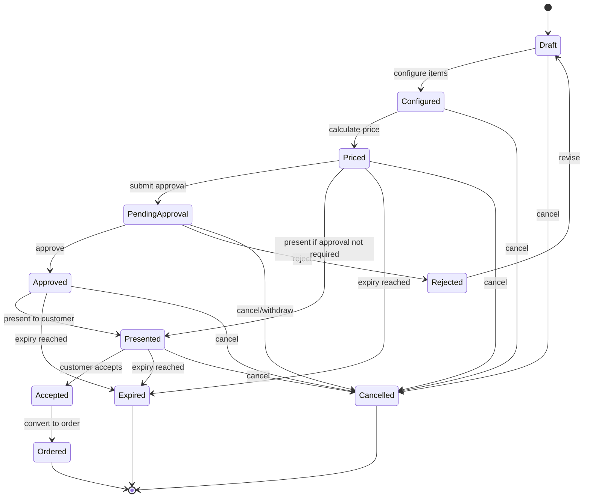
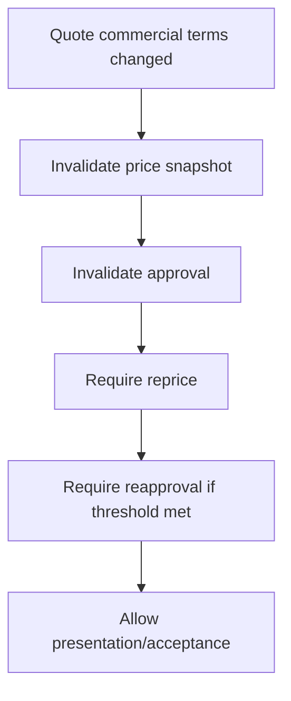
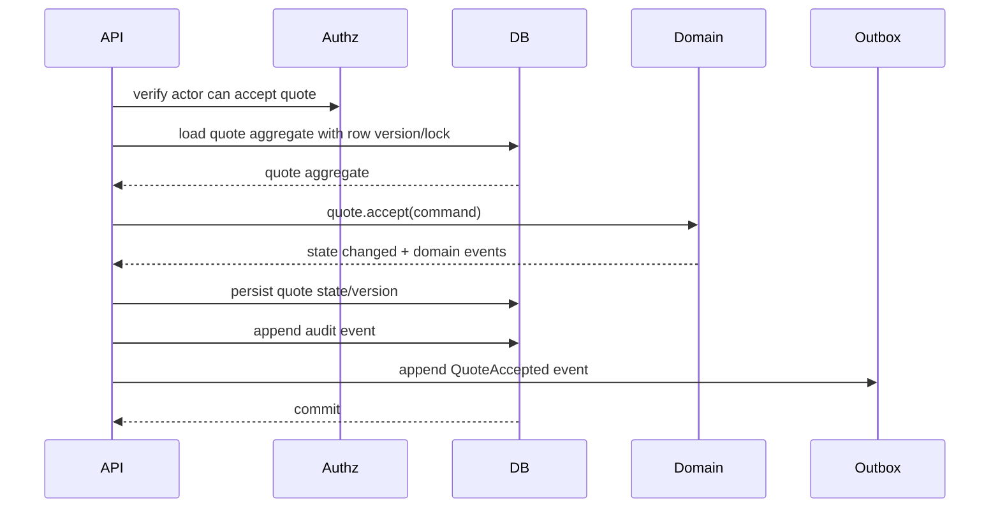
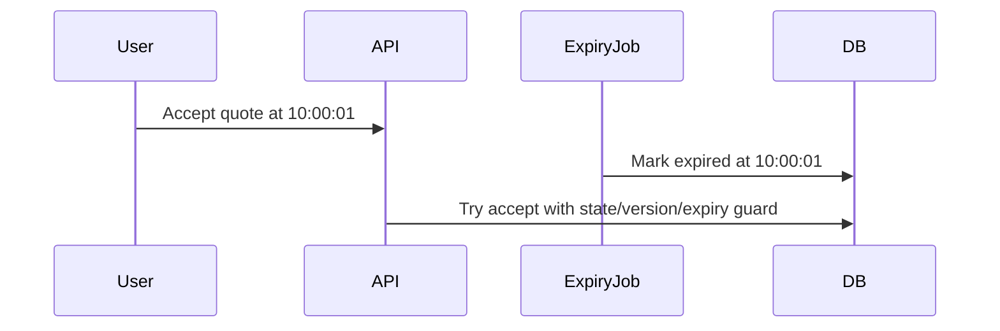

# Part 020 — Quote State Machine: Draft to Accepted to Ordered

> **Core idea:** quote state is not a label. Quote state is a legal/commercial/operational commitment boundary.

Part ini membangun quote lifecycle sebagai state machine yang eksplisit. Fokusnya bukan menggambar diagram cantik, tetapi mendefinisikan state, transition, guard, actor, evidence, failure mode, dan test yang membuat quote lifecycle defensible di sistem CPQ/order enterprise.

---

## 1. Source Boundary

Bagian ini memakai:

1. **Informasi publik CSG** tentang Quote & Order sebagai CPQ/order management platform dan quote-to-cash automation.
2. **TM Forum TMF648** sebagai vocabulary industri untuk Quote Management API.
3. **Engineering practice umum** untuk state machine, transition guard, optimistic locking, audit, outbox, dan idempotency.

Detail state internal CSG, nama enum aktual, transition rule, approval workflow, pricing service, dan conversion behavior harus diverifikasi di codebase/dokumentasi internal.

---

## 2. Why Quote Needs a State Machine

Quote adalah proposal komersial yang dapat berubah menjadi order. Selama lifecycle, quote melewati perubahan yang punya konsekuensi:

- boleh/tidak boleh diedit,
- perlu/tidak perlu pricing ulang,
- perlu/tidak perlu approval,
- boleh/tidak boleh dikirim ke customer,
- boleh/tidak boleh diterima,
- boleh/tidak boleh dikonversi menjadi order,
- harus/tidak harus meninggalkan audit evidence.

Jika quote state hanya string bebas, sistem rentan terhadap:

- transition illegal,
- approval bypass,
- accepted stale price,
- expired quote accepted,
- duplicated order conversion,
- quote modified after acceptance,
- unclear responsibility between UI/backend/workflow engine,
- production support tidak bisa menjelaskan status.

State machine membuat lifecycle menjadi eksplisit.

---

## 3. Quote Lifecycle: Reference Model

Ini reference model, bukan asumsi internal CSG.



A real product may use fewer/more states. The principle is more important than names: **each state must mean something operationally different**.

---

## 4. State Definitions

| State | Meaning | Editable? | Price valid? | Approval valid? | Can accept? | Can convert to order? |
|---|---|---:|---:|---:|---:|---:|
| `DRAFT` | Quote being created | Yes | No/unknown | No | No | No |
| `CONFIGURED` | Items/options selected and structurally valid | Yes | No/unknown | No | No | No |
| `PRICED` | Price calculated and snapshot stored | Limited | Yes | Maybe not needed | Maybe | No |
| `PENDING_APPROVAL` | Awaiting approval due to policy | Usually no or limited | Yes | Pending | No | No |
| `APPROVED` | Commercial approval granted | No or controlled | Yes | Yes | Yes | No |
| `PRESENTED` | Sent/presented to customer | Usually no | Yes | If required | Yes | No |
| `ACCEPTED` | Customer accepted terms | No | Frozen | Frozen | Already accepted | Yes |
| `ORDERED` | Converted to order | No | Frozen | Frozen | No | Already converted |
| `EXPIRED` | Quote no longer commercially valid | No | Historical only | Historical only | No | No |
| `CANCELLED` | Quote withdrawn/cancelled | No | Historical only | Historical only | No | No |
| `REJECTED` | Approval/customer rejected | Usually revisable via new version | Invalidated | Rejected | No | No |

The table should be adapted to the real system. During onboarding, find the real state enum and compare it to this reference.

---

## 5. State Should Encode Capability, Not Just Status

A state should answer questions:

- Can this quote be edited?
- Can pricing be recalculated?
- Can approval be requested?
- Can approval be granted?
- Can it be presented to customer?
- Can it be accepted?
- Can it be converted to order?
- Can it be cancelled?
- Can it be expired automatically?
- Must it create a new version for change?

If two states have identical capability matrix, they may be redundant. If one state has multiple incompatible meanings, it may be overloaded.

---

## 6. Commands, Not Setters

A quote state machine should be driven by commands, not arbitrary `setState` calls.

| Command | Typical from-state | Target state | Actor | Main guard |
|---|---|---|---|---|
| `CreateQuote` | none | `DRAFT` | Sales/API client | Customer/account context valid |
| `ConfigureQuote` | `DRAFT`, `CONFIGURED`, maybe `REJECTED` | `CONFIGURED` | Sales/configurator | Catalog/product config valid |
| `PriceQuote` | `CONFIGURED`, maybe `DRAFT` | `PRICED` | Sales/system | Items priceable |
| `SubmitForApproval` | `PRICED` | `PENDING_APPROVAL` | Sales | Approval required and price valid |
| `ApproveQuote` | `PENDING_APPROVAL` | `APPROVED` | Approver | Actor authority and SoD |
| `RejectQuote` | `PENDING_APPROVAL` | `REJECTED` | Approver | Actor authority |
| `PresentQuote` | `PRICED`, `APPROVED` | `PRESENTED` | Sales/system | Price/approval valid |
| `AcceptQuote` | `PRESENTED`, maybe `APPROVED` | `ACCEPTED` | Customer/sales proxy | Not expired, price valid, approval valid |
| `ConvertQuoteToOrder` | `ACCEPTED` | `ORDERED` | System/sales | Not already converted |
| `ExpireQuote` | non-terminal eligible states | `EXPIRED` | Scheduler/system | Expiry time reached |
| `CancelQuote` | non-terminal states | `CANCELLED` | Sales/system | Policy allows cancellation |

---

## 7. Transition Matrix

A transition matrix is often clearer than scattered `if` statements.

| From \ To | CONFIGURED | PRICED | PENDING_APPROVAL | APPROVED | PRESENTED | ACCEPTED | ORDERED | EXPIRED | CANCELLED | REJECTED |
|---|---:|---:|---:|---:|---:|---:|---:|---:|---:|---:|
| DRAFT | Yes | Maybe | No | No | No | No | No | Yes | Yes | No |
| CONFIGURED | Yes | Yes | No | No | No | No | No | Yes | Yes | No |
| PRICED | Yes* | Yes | Yes | No | Yes | Maybe | No | Yes | Yes | No |
| PENDING_APPROVAL | No* | No* | No | Yes | No | No | No | Yes | Yes | Yes |
| APPROVED | No* | Maybe* | No | No | Yes | Yes | No | Yes | Yes | No |
| PRESENTED | No* | Maybe* | No | No | No | Yes | No | Yes | Yes | No |
| ACCEPTED | No | No | No | No | No | No | Yes | No | Maybe | No |
| ORDERED | No | No | No | No | No | No | No | No | No | No |
| EXPIRED | No | Maybe new version | No | No | No | No | No | No | No | No |
| CANCELLED | No | No | No | No | No | No | No | No | No | No |
| REJECTED | Yes* | No | No | No | No | No | No | Yes | Yes | No |

`*` means allowed only through explicit revise/new-version command, not arbitrary mutation.

---

## 8. Guard Conditions

A transition is valid only when all relevant guards pass.

### 8.1 Accept Quote Guard

To accept a quote, verify:

- current state allows acceptance,
- quote has not expired,
- price snapshot exists,
- price snapshot is not invalidated,
- approval is valid if required,
- actor is allowed to accept or record customer acceptance,
- quote version has not changed concurrently,
- customer/account/agreement references are still acceptable under policy,
- quote has not already been accepted/ordered,
- audit context is present.

### 8.2 Convert to Order Guard

To convert a quote to order, verify:

- state is `ACCEPTED`,
- accepted version is immutable,
- order has not already been created for this quote version,
- quote items can map to order items,
- required customer/account/billing context exists,
- catalog/pricing snapshots needed by order are present,
- idempotency key or unique constraint protects duplicate conversion.

### 8.3 Approval Guard

To approve a quote, verify:

- state is `PENDING_APPROVAL`,
- actor has approval authority,
- actor is not violating segregation-of-duties policy,
- approval amount/discount/margin threshold matches current quote terms,
- quote commercial hash/version equals the version submitted for approval,
- approval comment/evidence is captured if required.

---

## 9. Pricing Validity and Approval Validity

Do not model state alone. Model validity of dependent evidence.



A quote can be in a state like `APPROVED`, but the approval may become invalid if commercial terms change. Better design choices:

1. Prevent mutation in approved/presented states.
2. Force new quote version for mutation.
3. Invalidate approval and move state backward explicitly.
4. Store approval against quote commercial hash/version.

Avoid silent mutation.

---

## 10. Commercial Hash Pattern

For defensibility, compute a hash/fingerprint over commercial terms submitted for approval or accepted by customer.

Candidate inputs:

- quote version,
- catalog version/snapshot ID,
- customer/account/agreement IDs,
- quote items,
- characteristics,
- quantities,
- recurring charges,
- non-recurring charges,
- discount details,
- effective dates,
- currency,
- contract terms.

Then approval references this fingerprint:

```json
{
  "approvalId": "APR-123",
  "quoteId": "Q-100",
  "quoteVersion": 4,
  "commercialHash": "sha256:...",
  "approvedBy": "user-456",
  "approvedAt": "2026-07-08T10:00:00Z"
}
```

Acceptance can verify current commercial hash equals approved hash.

---

## 11. Quote Versioning and State Machine

State and version are related but not the same.

| Concept | Meaning |
|---|---|
| Business quote version | Customer/commercial proposal version |
| Row version | Optimistic locking/concurrency token |
| API version | External contract version |
| Catalog version | Product/pricing rule basis |
| Event schema version | Kafka/event contract version |

Common mistake: using a single `version` field for all meanings.

Recommended mental model:

- `quoteVersion`: business revision visible/auditable.
- `rowVersion`: database concurrency control.
- `catalogVersion`: catalog basis.
- `apiVersion`: wire contract.
- `eventVersion`: event schema.

---

## 12. Terminal States

Terminal states should be hard to escape.

Usually terminal:

- `ORDERED`,
- `EXPIRED`,
- `CANCELLED`,
- maybe `REJECTED` depending business process.

Changing terminal states should require explicit exceptional workflow:

- reopen expired quote as new version,
- cancel accepted quote before order conversion if policy allows,
- correct ordered quote through amendment/order correction, not by editing old quote.

A production system should avoid “admin just sets state back” except via audited correction command.

---

## 13. Java State Machine Implementation Options

### Option A — Enum with Transition Methods

Good for smaller state machine.

```java
public enum QuoteState {
    DRAFT,
    CONFIGURED,
    PRICED,
    PENDING_APPROVAL,
    APPROVED,
    PRESENTED,
    ACCEPTED,
    ORDERED,
    EXPIRED,
    CANCELLED,
    REJECTED;

    public boolean canTransitionTo(QuoteState target) {
        return switch (this) {
            case DRAFT -> target == CONFIGURED || target == EXPIRED || target == CANCELLED;
            case CONFIGURED -> target == PRICED || target == CONFIGURED || target == EXPIRED || target == CANCELLED;
            case PRICED -> target == PENDING_APPROVAL || target == PRESENTED || target == EXPIRED || target == CANCELLED;
            case PENDING_APPROVAL -> target == APPROVED || target == REJECTED || target == EXPIRED || target == CANCELLED;
            case APPROVED -> target == PRESENTED || target == ACCEPTED || target == EXPIRED || target == CANCELLED;
            case PRESENTED -> target == ACCEPTED || target == EXPIRED || target == CANCELLED;
            case ACCEPTED -> target == ORDERED;
            case ORDERED, EXPIRED, CANCELLED -> false;
            case REJECTED -> target == CONFIGURED || target == EXPIRED || target == CANCELLED;
        };
    }
}
```

### Option B — Explicit Transition Registry

Better when transition needs actor, guard, audit, and side-effect metadata.

```java
public record TransitionRule(
    QuoteState from,
    QuoteState to,
    QuoteCommandType command,
    Set<Role> allowedRoles,
    List<Guard> guards,
    AuditEventType auditEventType
) {}
```

### Option C — Workflow Engine

Useful when approval/human workflow is complex, but do not let workflow engine become the only source of domain truth. The domain still needs hard invariants.

---

## 14. Recommended Service Flow: Accept Quote



Key point: audit and outbox should commit atomically with state transition.

---

## 15. PostgreSQL Persistence Pattern

### 15.1 Quote Table Sketch

```sql
CREATE TABLE quote (
  id UUID PRIMARY KEY,
  business_version INTEGER NOT NULL,
  row_version BIGINT NOT NULL DEFAULT 0,
  state TEXT NOT NULL,
  customer_id TEXT NOT NULL,
  account_id TEXT,
  catalog_snapshot_id UUID,
  price_snapshot_id UUID,
  approval_state TEXT,
  expires_at TIMESTAMPTZ,
  accepted_at TIMESTAMPTZ,
  ordered_at TIMESTAMPTZ,
  created_at TIMESTAMPTZ NOT NULL DEFAULT now(),
  updated_at TIMESTAMPTZ NOT NULL DEFAULT now()
);
```

### 15.2 Conditional Update for Transition

```sql
UPDATE quote
SET state = 'ACCEPTED',
    accepted_at = now(),
    row_version = row_version + 1,
    updated_at = now()
WHERE id = :quoteId
  AND state IN ('PRESENTED', 'APPROVED')
  AND row_version = :expectedRowVersion
  AND expires_at > now();
```

This SQL guard is not a replacement for domain guard. It is a second line of defense against race conditions.

### 15.3 Unique Conversion Constraint

```sql
CREATE TABLE quote_order_conversion (
  quote_id UUID NOT NULL,
  quote_business_version INTEGER NOT NULL,
  order_id UUID NOT NULL,
  converted_at TIMESTAMPTZ NOT NULL DEFAULT now(),
  PRIMARY KEY (quote_id, quote_business_version),
  UNIQUE (order_id)
);
```

This makes duplicate conversion structurally hard.

---

## 16. API Semantics

A REST API should not expose arbitrary state mutation unless strongly controlled.

Prefer command-like endpoints for lifecycle actions:

```http
POST /quotes/{quoteId}/actions/price
POST /quotes/{quoteId}/actions/submit-approval
POST /quotes/{quoteId}/actions/approve
POST /quotes/{quoteId}/actions/present
POST /quotes/{quoteId}/actions/accept
POST /quotes/{quoteId}/actions/convert-to-order
POST /quotes/{quoteId}/actions/cancel
```

Why not just `PATCH /quotes/{id}` with `{ "state": "ACCEPTED" }`?

Because state transition is not a field update. It is a business operation requiring authorization, guard validation, audit, event publication, and idempotency.

---

## 17. Error Model for Illegal Transition

A clear error should explain:

- quote ID,
- current state,
- attempted command,
- reason,
- whether retry could help,
- correlation ID.

Example:

```json
{
  "code": "QUOTE_ILLEGAL_TRANSITION",
  "message": "Quote cannot be accepted from state DRAFT.",
  "details": {
    "quoteId": "Q-123",
    "currentState": "DRAFT",
    "command": "AcceptQuote",
    "allowedStates": ["PRESENTED", "APPROVED"],
    "retryable": false
  },
  "correlationId": "..."
}
```

Avoid generic `400 Bad Request` without domain details.

---

## 18. Kafka Events for Quote State Changes

Event should represent business facts:

| Transition | Event |
|---|---|
| `DRAFT -> CONFIGURED` | `QuoteConfigured` |
| `CONFIGURED -> PRICED` | `QuotePriced` |
| `PRICED -> PENDING_APPROVAL` | `QuoteSubmittedForApproval` |
| `PENDING_APPROVAL -> APPROVED` | `QuoteApproved` |
| `PENDING_APPROVAL -> REJECTED` | `QuoteRejected` |
| `APPROVED/PRICED -> PRESENTED` | `QuotePresented` |
| `PRESENTED/APPROVED -> ACCEPTED` | `QuoteAccepted` |
| `ACCEPTED -> ORDERED` | `QuoteConvertedToOrder` |
| eligible state -> `EXPIRED` | `QuoteExpired` |
| eligible state -> `CANCELLED` | `QuoteCancelled` |

Event metadata should include:

- event ID,
- aggregate ID,
- aggregate type,
- aggregate version/sequence,
- quote business version,
- previous state,
- new state,
- actor/system identity,
- correlation ID,
- causation ID,
- occurredAt,
- schema version.

---

## 19. State Machine and Idempotency

Lifecycle commands must define idempotency behavior.

| Command | Safe idempotency behavior |
|---|---|
| `CreateQuote` | Same client request ID returns same quote or conflict |
| `PriceQuote` | Recalculate if inputs changed, otherwise return existing price snapshot |
| `SubmitForApproval` | If already pending with same version, return existing approval request |
| `ApproveQuote` | If already approved by same decision/version, return success |
| `AcceptQuote` | If already accepted same version, return success/idempotent result |
| `ConvertQuoteToOrder` | If order already exists for quote version, return existing order |
| `CancelQuote` | If already cancelled, return success with terminal state |

Idempotency is not “ignore duplicate requests.” Idempotency is **same intent produces same durable result without repeating side effects**.

---

## 20. Expiry Handling

Quote expiry can be implemented as:

1. **Lazy expiry**  
   On read/command, if `expiresAt < now`, treat as expired or transition.

2. **Scheduled expiry job**  
   Periodically scans eligible quotes and marks expired.

3. **Hybrid**  
   Lazy guard for correctness + scheduled job for visibility/read model.

Important guard: acceptance must check expiry at command time, not rely only on scheduled job.

Potential race:



Use row version/conditional update/transaction lock to ensure only one terminal transition wins.

---

## 21. Audit Model

Every significant transition should write audit evidence.

Audit event should answer:

- Who initiated it?
- Was it user/system/scheduler/integration?
- What command was executed?
- What was previous state?
- What is new state?
- What quote version?
- What commercial hash?
- What approval ID if relevant?
- What correlation/causation ID?
- What timestamp?
- What reason/comment?

Example audit event:

```json
{
  "type": "QUOTE_ACCEPTED",
  "quoteId": "Q-123",
  "quoteVersion": 4,
  "previousState": "PRESENTED",
  "newState": "ACCEPTED",
  "actorType": "USER",
  "actorId": "u-456",
  "commercialHash": "sha256:...",
  "approvalId": "APR-789",
  "correlationId": "corr-...",
  "causationId": "cmd-...",
  "occurredAt": "2026-07-08T10:00:00Z"
}
```

---

## 22. Authorization and Segregation of Duties

State machine guard must include authorization. Do not rely only on UI buttons.

Examples:

- Sales can configure quote.
- Sales can submit approval.
- Sales may not approve own high-discount quote.
- Approver must have threshold authority.
- System can expire quote.
- Customer acceptance proxy may require specific permission.
- Admin correction must require elevated role and explicit reason.

Authorization should be tested on negative cases.

---

## 23. Failure Modes

### 23.1 Accepted Without Current Price

Cause:

- Price invalidated but state remained `PRICED` or `APPROVED`.
- Acceptance guard checked only state.

Control:

- Separate `priceSnapshot.status` or commercial hash.
- Accept guard checks price validity.
- Commercial mutation invalidates price.

### 23.2 Approved Terms Changed After Approval

Cause:

- Discount or item changed after approval.
- Approval record not tied to quote version/hash.

Control:

- Approved/presented quote immutable.
- Revision creates new version.
- Approval references commercial hash.

### 23.3 Expired Quote Accepted

Cause:

- Expiry job delayed.
- Accept endpoint checks state only.

Control:

- Accept guard checks `expiresAt`.
- DB conditional update checks expiry.
- Expiry event reconciled.

### 23.4 Double Conversion to Order

Cause:

- Two requests convert accepted quote.
- No unique constraint/idempotency.

Control:

- Unique quote-version conversion table.
- Idempotency key.
- Conditional transition to `ORDERED`.

### 23.5 State Changed Without Audit

Cause:

- Direct DB update or maintenance script.
- Mapper method bypasses domain service.

Control:

- Central transition service.
- Audit required in transaction.
- Production correction workflow.

### 23.6 Event Published But State Rollback

Cause:

- Event published before DB commit.

Control:

- Transactional outbox.
- Publish only committed events.

---

## 24. Testing Strategy

### 24.1 State Transition Unit Tests

```java
@Test
void cannotAcceptDraftQuote() {
    Quote quote = QuoteFixtures.draft();

    assertThrows(IllegalQuoteTransitionException.class,
        () -> quote.accept(actor, Instant.now(), authzPolicy));
}
```

### 24.2 Guard Tests

Test each guard independently:

- expired quote,
- invalid price,
- missing approval,
- stale approval,
- unauthorized actor,
- concurrent version mismatch,
- already converted quote.

### 24.3 Property/Table Tests

Create a matrix of from-state/command and verify allowed/forbidden behavior.

### 24.4 Integration Tests

With PostgreSQL/Testcontainers:

- concurrent accept vs expire,
- concurrent accept vs commercial update,
- concurrent convert-to-order,
- outbox append atomic with state update,
- audit append atomic with state update.

### 24.5 Contract Tests

For API:

- illegal transition returns stable error code,
- accepted quote response includes immutable evidence,
- conversion response idempotently returns existing order,
- unknown future state does not crash tolerant consumers if applicable.

---

## 25. Observability

Metrics to consider:

- quote count by state,
- transition rate by command,
- illegal transition count,
- quote expiry count,
- approval pending age,
- quote accepted-to-ordered latency,
- conversion duplicate attempts,
- price invalidation count,
- approval invalidation count,
- quote acceptance failure reason distribution.

Logs should include:

- quote ID,
- quote version,
- previous state,
- new state,
- command,
- actor,
- correlation ID,
- causation ID,
- idempotency key.

Dashboards should show lifecycle health, not just HTTP latency.

---

## 26. PR Review Checklist

For any PR touching quote lifecycle:

1. Does it add/change a state?
2. Does it add/change a transition?
3. Is the transition matrix updated?
4. Are illegal transitions tested?
5. Does the command check actor authorization?
6. Does it check price validity?
7. Does it check approval validity?
8. Does it handle expiry?
9. Does it handle idempotency?
10. Does it protect against concurrent updates?
11. Does it write audit evidence?
12. Does it publish a business event through outbox?
13. Does it avoid direct `setState` from random services?
14. Does it preserve API compatibility?
15. Does production support get enough observability?

---

## 27. Internal Verification Checklist

During onboarding, verify:

- Actual quote state enum/list.
- Actual quote transition diagram or matrix.
- Whether state transitions are centralized.
- Whether state is updated directly in SQL/mappers.
- Whether quote versioning exists and what it means.
- Whether optimistic locking exists.
- Whether quote acceptance checks expiry.
- Whether price validity is modelled explicitly.
- Whether approval validity is tied to quote version/hash.
- Whether commercial mutation invalidates approval.
- Whether accepted quote is immutable.
- Whether quote-to-order conversion is idempotent.
- Whether unique constraint prevents duplicate conversion.
- Whether audit is written atomically with transition.
- Whether outbox is used for quote events.
- Whether state transition errors have stable error codes.
- Whether dashboards track quote lifecycle health.
- Historical bugs involving quote state or quote conversion.

---

## 28. Practical Exercise

Build a real transition matrix from the codebase:

1. Find all quote states.
2. Find all code paths that change quote state.
3. For each path, record:
   - command/action,
   - previous allowed states,
   - target state,
   - actor/role,
   - guard conditions,
   - DB transaction boundary,
   - audit event,
   - Kafka/domain event,
   - tests.
4. Compare actual behavior to documented behavior.
5. Identify direct state mutation paths.
6. Propose one small improvement PR.

Good first improvement candidates:

- add missing illegal transition test,
- add stable error code,
- add metric for failed transition,
- centralize duplicated guard,
- document transition matrix,
- add DB constraint for duplicate conversion.

---

## 29. Summary

A quote state machine is not bureaucracy. It is the defense system around commercial correctness.

A strong quote lifecycle design ensures:

- only legal transitions happen,
- pricing and approval evidence remain valid,
- acceptance is defensible,
- expiry is enforced,
- conversion to order is idempotent,
- audit is complete,
- events are reliable,
- support can explain every state.

Senior/principal-level review should focus less on whether a state string changed and more on whether the business meaning of that state remains true under concurrency, retry, replay, expiry, approval, and production correction.

---

## 30. Source Notes

- CSG Quote & Order public product page: `https://www.csgi.com/products/quote-and-order`
- CSG Quote-to-Cash public solution page: `https://www.csgi.com/solutions/quote-to-cash`
- TM Forum TMF648 Quote Management API public page/specification: `https://www.tmforum.org/open-digital-architecture/open-apis/quote-management-api-TMF648/`
- TM Forum TMF622 Product Ordering Management API public page/specification: `https://www.tmforum.org/open-digital-architecture/open-apis/product-ordering-management-api-TMF622/`

