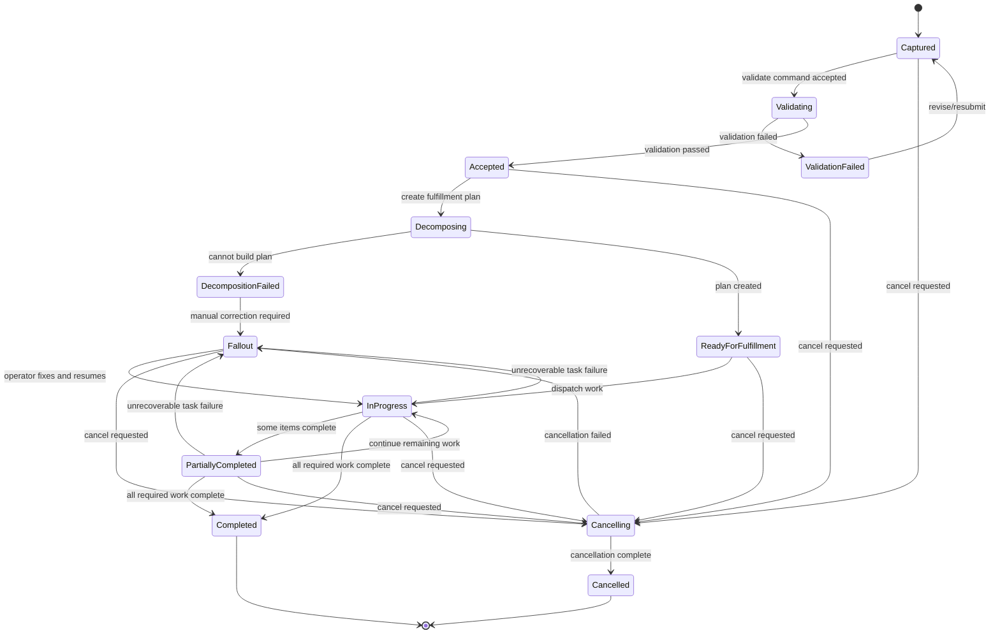

# Part 021 — Order State Machine: Capture, Validate, Decompose, Fulfill, Complete

> **Core idea:** an order is not a request payload. An order is a durable business commitment whose lifecycle must survive validation errors, async fulfillment, retries, cancellation, partial failure, human fallout, and audit reconstruction.

Part ini membangun mental model order lifecycle untuk sistem CPQ/order enterprise. Fokusnya bukan sekadar enum status, tetapi **state machine yang menjelaskan apa yang boleh terjadi, siapa yang boleh melakukan, efek samping apa yang boleh keluar, dan bagaimana recovery dilakukan ketika dunia nyata gagal**.

---

## 1. Source Boundary

Bagian ini memakai:

1. **Informasi publik CSG** tentang Quote & Order sebagai CPQ dan order management platform untuk B2B telecom/complex enterprise.
2. **TM Forum TMF622 Product Ordering** sebagai vocabulary industri untuk product order dan product order item.
3. **TM Forum TMF641 Service Ordering** sebagai vocabulary industri untuk service order yang sering menjadi downstream fulfillment boundary.
4. **Engineering practice umum** untuk state machine, transaction boundary, event-driven consistency, idempotency, audit, and recovery.

Yang **tidak boleh diasumsikan**:

- nama state internal CSG,
- apakah order orchestration internal memakai workflow engine, custom process manager, atau pattern lain,
- apakah TMF622/TMF641 diekspos langsung ke customer atau hanya dipakai sebagai mapping/reference,
- detail internal DB schema, Kafka topic, retry topic, DLQ, atau operational runbook.

Semua detail tersebut masuk ke `Internal verification checklist`.

---

## 2. Why Order State Is More Dangerous Than Quote State

Quote adalah proposal komersial. Order adalah instruksi eksekusi.

Perubahan kecil di order state bisa memicu konsekuensi besar:

- fulfillment downstream dimulai,
- service order dibuat,
- inventory berubah,
- billing preparation dimulai,
- technician/workforce task dibuat,
- customer notification terkirim,
- SLA clock dimulai,
- cancellation menjadi mahal,
- audit dan support harus bisa menjelaskan apa yang terjadi.

Karena itu, order state tidak boleh diperlakukan sebagai field kosmetik.

Order state harus menjawab:

1. **Apa fakta bisnis saat ini?**
2. **Apa pekerjaan teknis yang sudah dimulai?**
3. **Apa side effect yang sudah keluar dari sistem?**
4. **Apa yang masih aman untuk diubah?**
5. **Apa yang bisa di-retry?**
6. **Apa yang butuh human intervention?**
7. **Apa yang sudah terminal?**

Jika jawaban ini tidak eksplisit, sistem akan menghasilkan incident yang sulit dipulihkan.

---

## 3. Product Order vs Service Order vs Fulfillment Task

Dalam telco/enterprise order management, penting membedakan beberapa level.

| Level | Meaning | Example | Primary audience |
|---|---|---|---|
| Product Order | Customer/commercial order for product offering | Add enterprise internet bundle | BSS, sales, order management |
| Product Order Item | Item/action inside product order | Add site A circuit, modify bandwidth | CPQ/order service |
| Service Order | Technical/service-level order | Provision CFS/RFS service | OSS/service fulfillment |
| Fulfillment Task | Concrete execution unit | Reserve resource, activate service, ship device | Orchestrator/adapters/operators |

A product order says: **what the customer bought**.

A service order says: **what service layer must realize**.

A fulfillment task says: **what work must happen**.

A common modelling bug is collapsing all three into one status enum. That produces impossible states like:

```text
order.status = COMPLETED
but service activation failed
and billing was already notified
and inventory is partially updated
```

That is not a state. That is data corruption wearing a status label.

---

## 4. Reference Order Lifecycle

Ini reference model, bukan asumsi internal.



Names are less important than semantics. The system needs explicit answers for:

- has the order passed business validation?
- has decomposition happened?
- has downstream side effect started?
- can the order still be safely cancelled?
- is fulfillment still progressing?
- is failure automatic-retryable or human-fallout?
- is the order terminal?

---

## 5. State Definitions

| State | Meaning | Editable? | Downstream side effect? | Retryable? | Terminal? |
|---|---|---:|---:|---:|---:|
| `CAPTURED` | Order request persisted but not fully validated | Limited | No | Yes | No |
| `VALIDATING` | Business/technical validation running | No or locked | Usually no | Yes | No |
| `VALIDATION_FAILED` | Order cannot proceed as submitted | Yes via revise/resubmit | No | After correction | No |
| `ACCEPTED` | Order is valid and accepted for processing | No or controlled | Not yet or minimal | Yes | No |
| `DECOMPOSING` | Fulfillment plan/service orders being derived | No | Maybe internal only | Yes | No |
| `DECOMPOSITION_FAILED` | No valid decomposition plan can be produced | Controlled | Maybe partial internal | After correction | No |
| `READY_FOR_FULFILLMENT` | Plan exists and can be dispatched | No | Not yet external or ready | Yes | No |
| `IN_PROGRESS` | Fulfillment started | No | Yes | Yes with care | No |
| `PARTIALLY_COMPLETED` | Some items complete, others pending/failed | No | Yes | Yes with care | No |
| `FALLOUT` | Needs manual/operator intervention | Controlled | Possibly yes | After operator action | No |
| `CANCELLING` | Cancellation workflow started | No | Yes | Yes with care | No |
| `CANCELLED` | Cancellation finished | No | Historical only | No | Yes |
| `COMPLETED` | All required order items completed | No | Yes | No | Yes |

The lifecycle should be backed by a transition matrix, not spread across controller `if` statements.

---

## 6. Order Header State vs Order Item State

A product order often contains many order items.

Example:

```text
Order O-1001
  Item 1: Add enterprise internet at Jakarta HQ
  Item 2: Add backup link at Surabaya branch
  Item 3: Add managed router for Jakarta HQ
  Item 4: Modify existing VPN bandwidth
```

Each item can have different state:

| Item | Action | State |
|---|---|---|
| Item 1 | add | completed |
| Item 2 | add | in_progress |
| Item 3 | add | fallout |
| Item 4 | modify | completed |

The order header might be `PARTIALLY_COMPLETED` or `FALLOUT`, depending on policy.

Never assume:

```text
order state = max(item states)
```

Aggregation policy must be explicit.

---

## 7. Item Action Semantics

TMF-style product ordering commonly represents an action per order item. Typical semantics:

| Action | Meaning | Common risk |
|---|---|---|
| `add` | Add new product/service | Duplicate provisioning if retried unsafely |
| `modify` | Change existing product/service | Stale installed-base snapshot |
| `delete` | Remove/disconnect existing product/service | Partial disconnect or billing mismatch |
| `noChange` | Preserve existing item in a bundle/amendment context | Accidentally treated as work to execute |

Action semantics determine validation, decomposition, fulfillment, cancellation, and compensation.

For example:

- `add` may require availability check.
- `modify` may require existing product inventory reference.
- `delete` may require active service validation.
- `noChange` must not trigger unnecessary fulfillment.

---

## 8. Validation Is Not One Thing

Order validation is layered.

| Validation layer | Question answered | Example failure |
|---|---|---|
| Syntax/schema | Is payload structurally valid? | Missing required field |
| Contract/API | Is request compatible with API contract? | Unknown enum value |
| Identity/security | Can actor submit this order? | User cannot order for tenant |
| Customer/account | Is customer/account valid? | Suspended account |
| Catalog | Are product offerings valid? | Retired offering |
| Configuration | Are item characteristics compatible? | Invalid bandwidth option |
| Pricing/commercial | Does accepted quote/pricing still hold? | Quote expired |
| Inventory | Does installed base support modify/delete? | Product instance not active |
| Fulfillment feasibility | Can this be provisioned? | Site not serviceable |
| Policy/compliance | Are approvals/controls satisfied? | Missing required approval |

A senior engineer should ask: **which validation failures are synchronous, which are async, and which require fallout?**

---

## 9. Capture State: Persist Before or After Validation?

There are two common strategies.

### Strategy A — Validate before persisting order

Pros:

- fewer invalid orders in DB,
- simpler reporting,
- easier mental model for basic cases.

Cons:

- harder to audit failed submissions,
- harder to retry async validation,
- payload may be lost if downstream validation times out,
- not ideal when validation is long-running.

### Strategy B — Persist captured order first, then validate

Pros:

- durable audit of submission,
- supports async validation,
- supports operator review,
- enables idempotency by business key,
- useful for enterprise integrations.

Cons:

- DB contains non-executable orders,
- lifecycle must distinguish captured vs accepted,
- reporting must filter carefully.

For mission-critical enterprise systems, Strategy B is often more defensible, but internal implementation must be verified.

---

## 10. Transition Guards

Every transition should have guard logic.

Example transition guard matrix:

| Transition | Guard examples |
|---|---|
| `CAPTURED -> VALIDATING` | actor authorized; idempotency key accepted; order not terminal |
| `VALIDATING -> ACCEPTED` | all required validation passed; quote valid; catalog snapshot valid |
| `VALIDATING -> VALIDATION_FAILED` | validation result contains blocking errors |
| `ACCEPTED -> DECOMPOSING` | order accepted; no existing active decomposition plan |
| `DECOMPOSING -> READY_FOR_FULFILLMENT` | plan persisted; tasks have dependency graph; no unresolved decomposition error |
| `READY_FOR_FULFILLMENT -> IN_PROGRESS` | dispatch lock acquired; downstream adapter available |
| `IN_PROGRESS -> FALLOUT` | retry exhausted or non-retryable failure |
| `FALLOUT -> IN_PROGRESS` | operator action recorded; resume point valid |
| `IN_PROGRESS -> COMPLETED` | all required items terminal-success; billing/inventory handoff rules satisfied |
| `* -> CANCELLING` | order not already terminal; cancellation policy permits |
| `CANCELLING -> CANCELLED` | all required cancellation/compensation tasks done |

Transition guard failure should not be a vague `400 Bad Request`. It should produce domain-specific reason codes.

---

## 11. State Transition as a Domain Command

A healthy order state machine usually has commands like:

```text
SubmitOrder
StartValidation
AcceptValidatedOrder
RejectInvalidOrder
StartDecomposition
MarkDecompositionFailed
DispatchFulfillment
MarkItemInProgress
MarkItemCompleted
MarkItemFailed
MoveToFallout
ResumeFromFallout
RequestCancellation
CompleteCancellation
CompleteOrder
```

Avoid letting random services update status directly:

```sql
UPDATE orders SET status = 'COMPLETED' WHERE id = ?;
```

That bypasses:

- guard validation,
- audit,
- event publication,
- invariant checks,
- downstream side-effect consistency.

---

## 12. Java Domain Skeleton

A simplified example:

```java
public final class ProductOrder {
    private final OrderId id;
    private OrderStatus status;
    private long version;
    private final List<OrderItem> items;
    private final List<DomainEvent> pendingEvents = new ArrayList<>();

    public void startValidation(Actor actor, Clock clock) {
        requireNotTerminal();
        requireStatus(OrderStatus.CAPTURED);
        requirePermission(actor, OrderPermission.VALIDATE_ORDER);

        this.status = OrderStatus.VALIDATING;
        pendingEvents.add(OrderValidationStarted.of(id, actor.id(), clock.instant()));
    }

    public void acceptValidation(ValidationResult result, Actor actor, Clock clock) {
        requireStatus(OrderStatus.VALIDATING);

        if (result.hasBlockingErrors()) {
            throw new IllegalTransitionException("Cannot accept invalid order");
        }

        this.status = OrderStatus.ACCEPTED;
        pendingEvents.add(OrderAccepted.of(id, actor.id(), clock.instant()));
    }

    public void moveToFallout(FulfillmentFailure failure, Actor actor, Clock clock) {
        requireOneOf(OrderStatus.IN_PROGRESS, OrderStatus.PARTIALLY_COMPLETED, OrderStatus.CANCELLING);

        this.status = OrderStatus.FALLOUT;
        pendingEvents.add(OrderMovedToFallout.of(
            id,
            failure.code(),
            failure.message(),
            actor.id(),
            clock.instant()
        ));
    }

    public void complete(Actor actor, Clock clock) {
        requireOneOf(OrderStatus.IN_PROGRESS, OrderStatus.PARTIALLY_COMPLETED);

        if (!items.stream().allMatch(OrderItem::isSuccessfullyCompletedOrNotApplicable)) {
            throw new InvariantViolationException("Cannot complete order with unfinished items");
        }

        this.status = OrderStatus.COMPLETED;
        pendingEvents.add(OrderCompleted.of(id, actor.id(), clock.instant()));
    }
}
```

The exact code style may differ, but the invariant should not be optional.

---

## 13. Persistence Model

A minimal conceptual model:

```sql
CREATE TABLE product_order (
    id UUID PRIMARY KEY,
    tenant_id TEXT NOT NULL,
    external_order_id TEXT,
    quote_id UUID,
    status TEXT NOT NULL,
    status_reason TEXT,
    version BIGINT NOT NULL,
    submitted_by TEXT NOT NULL,
    submitted_at TIMESTAMPTZ NOT NULL,
    accepted_at TIMESTAMPTZ,
    completed_at TIMESTAMPTZ,
    cancelled_at TIMESTAMPTZ,
    created_at TIMESTAMPTZ NOT NULL,
    updated_at TIMESTAMPTZ NOT NULL,
    UNIQUE (tenant_id, external_order_id)
);

CREATE TABLE product_order_item (
    id UUID PRIMARY KEY,
    order_id UUID NOT NULL REFERENCES product_order(id),
    parent_item_id UUID,
    action TEXT NOT NULL,
    status TEXT NOT NULL,
    product_offering_id TEXT,
    product_inventory_id TEXT,
    sequence_no INT NOT NULL,
    version BIGINT NOT NULL,
    created_at TIMESTAMPTZ NOT NULL,
    updated_at TIMESTAMPTZ NOT NULL
);

CREATE TABLE order_state_transition (
    id UUID PRIMARY KEY,
    order_id UUID NOT NULL REFERENCES product_order(id),
    from_status TEXT,
    to_status TEXT NOT NULL,
    reason_code TEXT,
    actor_id TEXT NOT NULL,
    correlation_id TEXT NOT NULL,
    causation_id TEXT,
    occurred_at TIMESTAMPTZ NOT NULL
);
```

The transition table is not optional in serious systems. Without it, support cannot reconstruct how an order reached a bad state.

---

## 14. Optimistic Locking

Order lifecycle transitions are race-prone.

Examples:

- API retry submits same order twice.
- UI attempts cancel while orchestrator completes item.
- Kafka event arrives after manual fallout fix.
- Two workers pick the same order for decomposition.
- Customer integration sends duplicate update.

Use optimistic locking for aggregate update:

```sql
UPDATE product_order
SET status = :newStatus,
    version = version + 1,
    updated_at = now()
WHERE id = :orderId
  AND version = :expectedVersion
  AND status = :expectedStatus;
```

If zero rows are updated, it is not a random DB error. It means the command raced with another transition.

The application must decide whether to:

- retry after reload,
- reject as stale command,
- treat as idempotent success,
- move to operational investigation.

---

## 15. Idempotency for Order Submission

Order submission is commonly called by external systems. External systems retry.

The system must answer:

```text
If the same order submission arrives twice, do we create two orders?
```

Usually, no.

Idempotency can be based on:

- `Idempotency-Key` header,
- external order ID,
- quote ID + customer acceptance version,
- business transaction ID,
- combination of tenant + source system + source order ID.

Conceptual table:

```sql
CREATE TABLE idempotency_record (
    tenant_id TEXT NOT NULL,
    idempotency_key TEXT NOT NULL,
    request_hash TEXT NOT NULL,
    response_reference TEXT,
    status TEXT NOT NULL,
    created_at TIMESTAMPTZ NOT NULL,
    updated_at TIMESTAMPTZ NOT NULL,
    PRIMARY KEY (tenant_id, idempotency_key)
);
```

Important invariant:

```text
Same key + same request = same result.
Same key + different request = conflict.
```

---

## 16. Order Completion Is an Invariant, Not a Timestamp

Do not complete an order because “the last event arrived”.

Complete an order only when completion criteria are true.

Example completion criteria:

1. every required item is terminal-success or not-applicable,
2. no unresolved blocking fallout exists,
3. required inventory updates are confirmed or queued with guaranteed processing,
4. billing handoff rule is satisfied,
5. cancellation is not active,
6. audit transition is persisted,
7. completion event is published via outbox.

This is why `completeOrder()` should be a domain operation, not a direct SQL update.

---

## 17. Partial Completion

Partial completion is not always failure.

It can mean:

- multi-site order where site A completed and site B is pending,
- device shipped but service activation pending,
- add action completed but modify action pending,
- optional item failed but base item succeeded,
- order is waiting for customer appointment.

The key question:

```text
Can the customer/business consider this order partially useful, or is partial completion only an internal transient state?
```

This affects:

- customer notification,
- billing trigger,
- SLA measurement,
- inventory visibility,
- cancellation semantics,
- support workflow.

---

## 18. Fallout Is a First-Class State

Fallout means the automated path cannot safely continue without intervention or external correction.

Fallout must include:

- failure category,
- blocking item/task,
- retry history,
- downstream system reference,
- suggested operator action,
- resume point,
- audit trail,
- customer impact flag.

Bad fallout model:

```text
order.status = FAILED
error_message = "Something went wrong"
```

Good fallout model:

```text
order.status = FALLOUT
fallout.code = SERVICE_ACTIVATION_TIMEOUT
fallout.itemId = item-3
fallout.downstreamSystem = SOM-X
fallout.downstreamReference = SO-12345
fallout.retryCount = 5
fallout.nextAction = OPERATOR_VERIFY_SERVICE_ORDER
fallout.resumeCommand = RESUME_FULFILLMENT_FROM_TASK
```

---

## 19. Cancellation Is a Workflow, Not a Boolean

Cancellation is easy before fulfillment starts. It becomes complex after side effects.

| Order phase | Cancellation complexity |
|---|---|
| Captured | Simple mark cancelled |
| Validating | Cancel validation job or mark obsolete |
| Accepted | Cancel before decomposition/dispatch |
| Ready for fulfillment | Cancel plan before dispatch |
| In progress | Send cancellation/compensation downstream |
| Partially completed | Cancel remaining work, maybe reverse completed work |
| Fallout | Cancel may require operator judgement |
| Completed | Usually not cancel; may require disconnect/return/amendment order |

Important distinction:

```text
Cancel order processing != delete business record.
```

Orders are audit artifacts. Deleting them destroys evidence.

---

## 20. Retry and Resume

Retry means repeat an operation.

Resume means continue from a checkpoint.

They are not the same.

| Mechanism | Use when | Risk |
|---|---|---|
| Retry | transient failure before side effect or idempotent side effect | duplicate downstream action |
| Resume | long-running workflow with persisted state | corrupted checkpoint |
| Manual resume | operator fixed data/downstream state | unauthorized or unsafe continuation |
| Rebuild plan | decomposition rules changed or plan invalid | inconsistent execution history |

Every retryable task needs:

- idempotency key,
- attempt count,
- last error,
- next attempt time,
- max retry policy,
- side-effect boundary knowledge.

---

## 21. Kafka Events for Order Lifecycle

A reference event set:

```text
ProductOrderCaptured
ProductOrderValidationStarted
ProductOrderValidationFailed
ProductOrderAccepted
ProductOrderDecompositionStarted
ProductOrderDecompositionFailed
ProductOrderReadyForFulfillment
ProductOrderFulfillmentStarted
ProductOrderItemStateChanged
ProductOrderMovedToFallout
ProductOrderResumed
ProductOrderCancellationRequested
ProductOrderCancelled
ProductOrderCompleted
```

Events must include enough metadata for traceability:

```json
{
  "eventId": "evt-123",
  "eventType": "ProductOrderAccepted",
  "eventVersion": 1,
  "tenantId": "tenant-a",
  "orderId": "order-123",
  "aggregateVersion": 7,
  "correlationId": "corr-789",
  "causationId": "cmd-456",
  "occurredAt": "2026-07-08T10:15:30Z"
}
```

Do not rely on Kafka offset as business sequence. Offset is broker position, not aggregate lifecycle sequence.

---

## 22. Outbox Boundary

When state changes, event publication must not be a best-effort afterthought.

State transition and event creation should happen in one database transaction:

```text
BEGIN
  update product_order status/version
  insert order_state_transition
  insert outbox_event
COMMIT
```

Then an outbox relay publishes events to Kafka.

This prevents:

- DB updated but event missing,
- event published but DB rolled back,
- consumer sees state that cannot be queried,
- replay cannot reconstruct transition.

---

## 23. API Semantics

Good API design exposes commands, not raw status mutation.

Prefer:

```http
POST /product-orders/{id}/cancel
POST /product-orders/{id}/resume
POST /product-orders/{id}/validate
POST /product-orders/{id}/decompose
```

Be careful with:

```http
PATCH /product-orders/{id}
{
  "status": "COMPLETED"
}
```

Direct status patch is dangerous unless heavily controlled for internal operations.

A better internal admin operation includes reason and evidence:

```json
{
  "command": "resumeFromFallout",
  "reasonCode": "DOWNSTREAM_CORRECTED",
  "operatorNote": "Service order SO-12345 manually corrected in SOM-X",
  "expectedVersion": 42
}
```

---

## 24. Observability Model

For any order, production support should answer:

1. when was it captured?
2. what quote did it come from?
3. which catalog version/pricing snapshot was used?
4. when did validation pass/fail?
5. when did decomposition start?
6. what fulfillment plan was generated?
7. what downstream references exist?
8. which items are done/pending/failed?
9. what retries happened?
10. why is it in fallout?
11. who manually changed it?
12. what event should downstream consumers have received?

Minimum telemetry:

- `order_id`,
- `quote_id`,
- `tenant_id`,
- `customer_id`,
- `external_order_id`,
- `correlation_id`,
- `causation_id`,
- `order_status`,
- `order_item_id`,
- `order_item_status`,
- `downstream_system`,
- `downstream_reference`,
- `transition_name`,
- `failure_code`.

---

## 25. Metrics

Useful metrics:

```text
orders_captured_total
orders_accepted_total
orders_validation_failed_total
orders_decomposition_failed_total
orders_in_fallout_total
orders_completed_total
order_state_transition_duration_seconds
order_time_to_accept_seconds
order_time_to_decompose_seconds
order_time_to_complete_seconds
order_item_failure_total
order_cancellation_total
order_retry_total
order_manual_resume_total
```

Business-facing metrics:

```text
quote_to_order_conversion_rate
order_fallout_rate_by_product
order_fallout_rate_by_downstream_system
orders_stuck_in_state_count
orders_older_than_sla_count
partial_completion_rate
```

Avoid high-cardinality labels like raw `order_id` in metrics. Put identifiers in logs/traces.

---

## 26. Failure Modes

| Failure | Symptom | Detection | Defensive design |
|---|---|---|---|
| Duplicate order creation | Same external order creates multiple internal orders | unique constraint; duplicate metric | idempotency key + unique business key |
| Double fulfillment dispatch | Same order item provisioned twice | downstream duplicate; event replay | idempotent dispatch + task state lock |
| Premature completion | Order completed while item still pending | invariant test; reconciliation | completion guard over item states |
| Lost event | DB state changed but Kafka event missing | outbox lag; reconciliation | transactional outbox |
| Stuck state | Order remains `VALIDATING` for hours | stuck-state dashboard | timeout and watchdog |
| Cancellation race | Order completes while cancellation requested | audit inconsistency | transition lock and cancellation guard |
| Fallout without context | Support cannot recover | incident ticket noise | structured fallout record |
| Stale quote conversion | Expired/repriced quote converted | revenue leakage | quote snapshot/version guard |
| Wrong tenant access | Order visible across tenant | security incident | tenant scope everywhere |
| Manual override abuse | Operator completes invalid order | audit finding | permission + reason + approval |

---

## 27. Testing Strategy

### 27.1 State transition table tests

Build tests from matrix:

```text
given status CAPTURED
when completeOrder
then reject illegal transition
```

```text
given status IN_PROGRESS with unfinished item
when completeOrder
then reject invariant violation
```

### 27.2 Idempotency tests

- same key, same request returns same order,
- same key, different request returns conflict,
- retry after crash does not duplicate order,
- duplicate Kafka event does not duplicate transition.

### 27.3 Concurrency tests

- cancel vs complete race,
- duplicate decomposition worker race,
- two item completion events arrive concurrently,
- retry after optimistic lock conflict.

### 27.4 Integration tests

Use real PostgreSQL and Kafka when possible:

- transaction + outbox atomicity,
- MyBatis mapper correctness,
- order state transition insert,
- event consumer idempotency,
- stuck order query.

### 27.5 Operational tests

- simulate downstream timeout,
- simulate poison event,
- simulate fallout recovery,
- simulate replay,
- simulate cancellation after partial fulfillment.

---

## 28. PR Review Checklist

When reviewing order lifecycle changes, ask:

- Does this change introduce a new state or transition?
- Is the transition matrix updated?
- Are illegal transitions tested?
- Are order header and item state aggregation rules clear?
- Are side effects protected by idempotency?
- Is the transition auditable?
- Does the change publish an event?
- Is event publication transactional via outbox or equivalent?
- Does it handle duplicate command/event?
- Does it handle retry after crash?
- Is cancellation behavior defined?
- Is fallout behavior defined?
- Are tenant and authorization checks present?
- Are observability fields included?
- Is migration/backward compatibility considered?

---

## 29. Internal Verification Checklist

Check in codebase/docs/team sessions:

- real product order status enum,
- real product order item status enum,
- transition matrix or equivalent logic,
- where state transitions are implemented,
- whether status can be patched directly,
- order validation pipeline,
- decomposition trigger,
- fulfillment dispatch mechanism,
- cancellation workflow,
- fallout model,
- retry/resume mechanism,
- idempotency key strategy,
- unique constraints for external order IDs,
- optimistic locking/version column,
- audit transition table,
- Kafka event topics and schemas,
- outbox implementation,
- stuck order dashboard,
- recent incidents involving order state.

---

## 30. Onboarding Exercises

1. **Draw the real state machine.**
   - Find real order states.
   - Build a Mermaid diagram.
   - Mark unknown transitions.

2. **Trace one successful order.**
   - From API request to DB rows to Kafka events to downstream references.

3. **Trace one failed order.**
   - Find a fallout/failed order in lower environment.
   - Identify root cause and recovery mechanism.

4. **Review one PR touching order status.**
   - Apply the checklist above.
   - Look for missing audit, event, idempotency, or tests.

5. **Ask the team one sharp question.**
   - “What is the most dangerous order state transition in production?”

---

## 31. Summary

Order state machine is the backbone of order correctness.

A production-grade order lifecycle must define:

- header state,
- item state,
- transition guards,
- validation stages,
- decomposition boundary,
- fulfillment progress,
- partial completion policy,
- fallout recovery,
- cancellation workflow,
- retry/resume semantics,
- audit evidence,
- event publication,
- observability,
- test coverage.

The mental shift:

```text
status field thinking -> lifecycle invariant thinking
```

A senior engineer does not ask only “what status should we set?”

A senior engineer asks:

```text
What business fact changed?
What side effect has already happened?
Can this be retried safely?
Can this be reconstructed during an incident?
What invariant prevents corruption?
```

---

## 32. Source Notes

Public references to verify externally:

- CSG Quote & Order public product positioning: `https://www.csgi.com/products/quote-and-order`
- CSG Quote-to-Cash public solution page: `https://www.csgi.com/solutions/quote-to-cash`
- TM Forum TMF622 Product Ordering Management API: `https://www.tmforum.org/open-digital-architecture/open-apis/product-ordering-management-api-TMF622/v5.0`
- TM Forum TMF641 Service Ordering Management API: `https://www.tmforum.org/open-digital-architecture/open-apis/service-ordering-management-api-TMF641/v5.0`

Use these as public/industry references only. Internal implementation must be verified in CSG repositories, architecture docs, deployment docs, onboarding sessions, and production runbooks.
