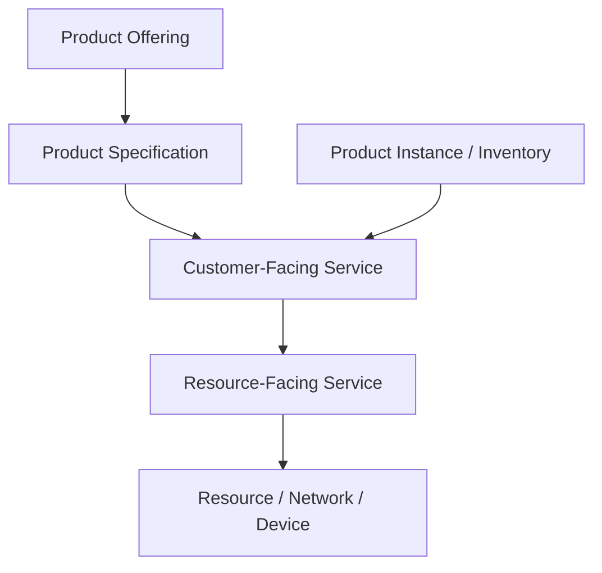
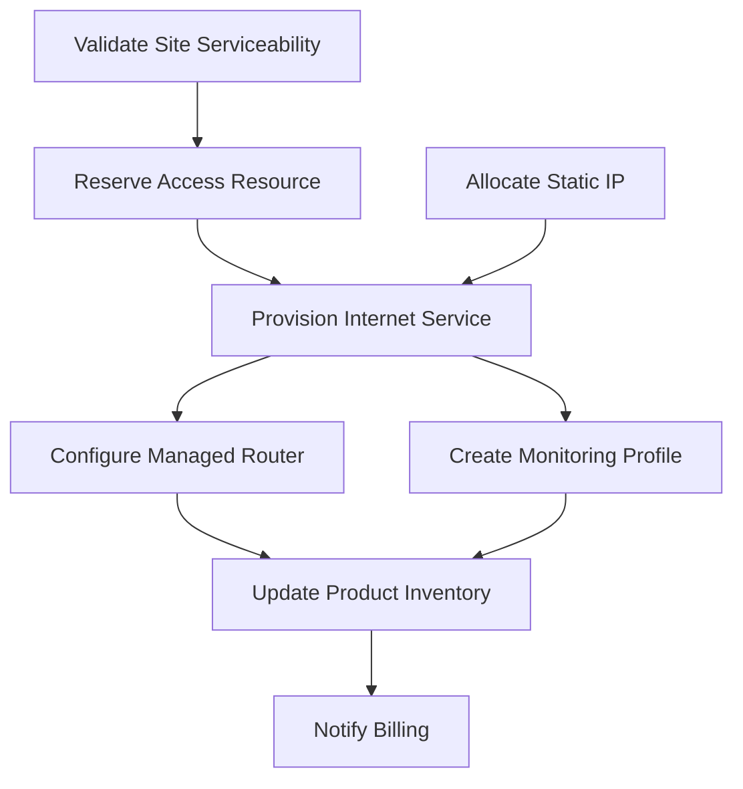
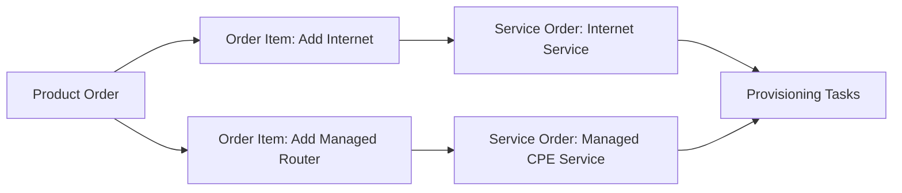
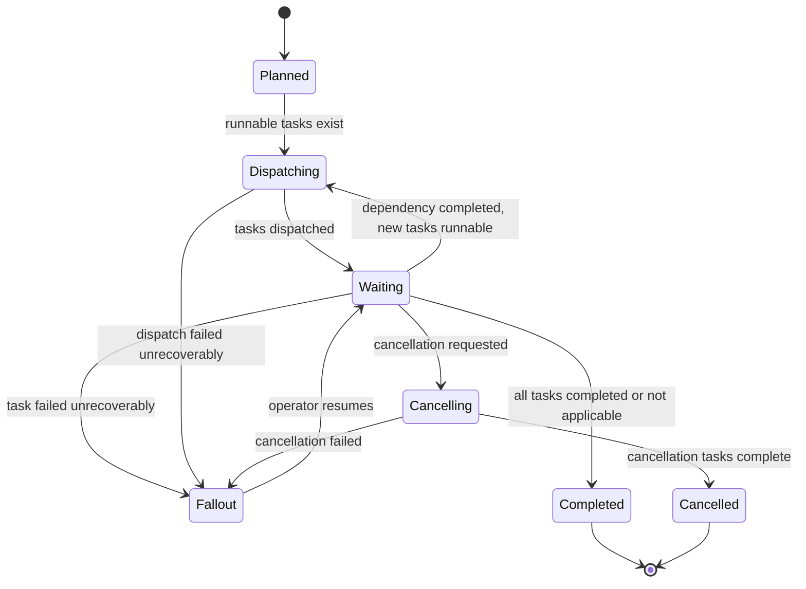
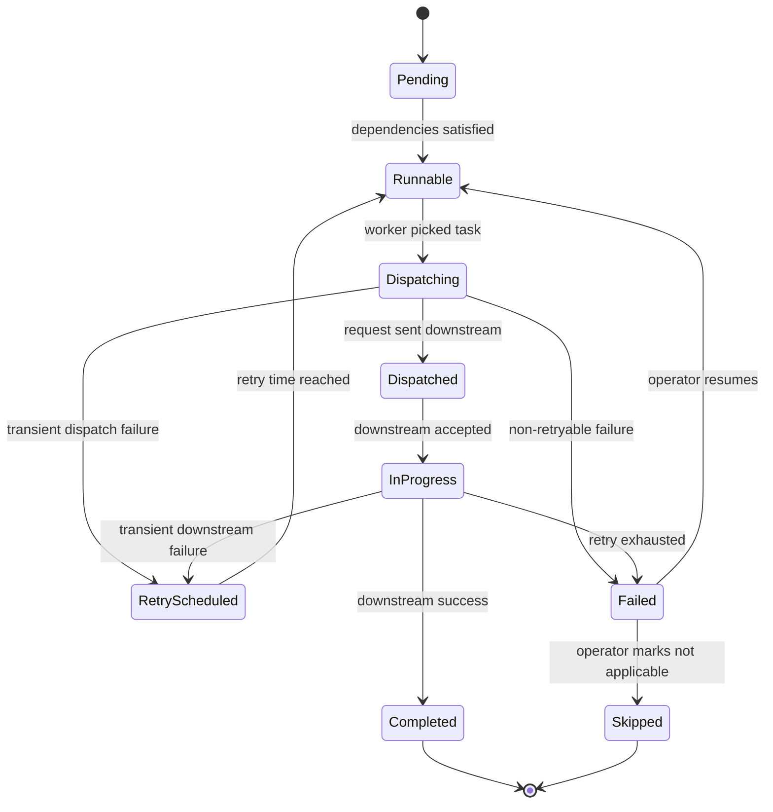

# Part 022 — Order Decomposition and Fulfillment Orchestration

> **Core idea:** decomposition is where a commercial order becomes executable work. If decomposition is wrong, the system may faithfully execute the wrong business intent.

Part ini membahas decomposition dan fulfillment orchestration dari sudut pandang engineer yang harus menjaga correctness, reliability, observability, dan recovery. Fokusnya adalah bagaimana product order berubah menjadi plan, service order, task, adapter call, event, dan eventual completion.

---

## 1. Source Boundary

Bagian ini memakai:

1. **Informasi publik CSG** bahwa Quote & Order berada di area CPQ/order management dan quote-to-cash untuk complex enterprise/telco.
2. **TM Forum TMF622** sebagai vocabulary product order.
3. **TM Forum TMF641** sebagai vocabulary service ordering.
4. **Telco BSS/OSS practice umum** tentang product-to-service/resource mapping.
5. **Distributed systems practice umum** tentang saga, process manager, outbox, idempotency, retry, and compensation.

Yang harus diverifikasi internal:

- apakah decomposition dilakukan oleh Quote & Order atau sistem downstream,
- apakah ada service order object internal,
- apakah menggunakan workflow engine, BPMN, custom orchestrator, Kafka choreography, atau hybrid,
- model rule decomposition,
- mapping product offering ke service/resource,
- ownership adapter downstream,
- fallout and operator tooling.

---

## 2. What Decomposition Really Means

Decomposition adalah proses menerjemahkan:

```text
Customer/commercial intent
```

menjadi:

```text
Executable operational work
```

Contoh:

```text
Customer buys:
  Enterprise Internet 1Gbps + Managed Router + Static IP + SLA Gold

Decomposed into:
  - validate site serviceability
  - reserve access resource
  - provision internet service
  - configure managed router
  - allocate static IP
  - create monitoring profile
  - notify billing
  - update product inventory
```

The original order says **what**.

The decomposition plan says **how**.

---

## 3. Why Decomposition Is High-Risk

Decomposition bugs are expensive because they may not fail immediately.

They can create:

- wrong service provisioned,
- missing add-on,
- duplicate activation,
- billing mismatch,
- inventory drift,
- impossible cancellation,
- order stuck in progress,
- customer-visible service outage,
- revenue leakage,
- compliance/audit gap.

A wrong decomposition plan can be worse than a failed order. A failed order stops. A wrong plan executes.

---

## 4. Product, Service, and Resource Layers

A simplified telco mental model:



Not every system explicitly models all layers. But the reasoning is useful:

- product layer is commercial,
- service layer is customer-facing technical realization,
- resource layer is network/device/platform realization.

Do not leak low-level resource details into quote unless the business truly needs them.

---

## 5. Decomposition Inputs

A decomposition engine/process usually needs:

| Input | Why it matters |
|---|---|
| Product order | Customer intent and item actions |
| Quote snapshot | Accepted commercial configuration |
| Catalog version | Product/service mapping rules |
| Product offering characteristics | Selected options |
| Customer/account context | Eligibility and routing |
| Installed base/product inventory | Modify/delete/amend context |
| Site/location | Serviceability and resource selection |
| Agreement/SLA | Fulfillment priority and obligations |
| Tenant/customer configuration | Customer-specific mapping |
| Downstream capability map | Which system fulfills which work |

If one input is stale, decomposition may be incorrect.

---

## 6. Decomposition Output: The Fulfillment Plan

A fulfillment plan should be a durable artifact.

It can include:

- plan ID,
- order ID,
- catalog version used,
- decomposition rule version,
- generated service orders,
- generated tasks,
- dependency graph,
- task idempotency keys,
- downstream target system,
- compensation/cancellation rules,
- created timestamp,
- plan version,
- audit metadata.

A decomposition plan should answer:

```text
Given this order, what exactly will we execute, in what order, and why?
```

---

## 7. Dependency Graph

Many fulfillment activities cannot run linearly.

Example:



The dependency graph controls:

- parallelism,
- ordering,
- retry scope,
- cancellation scope,
- compensation order,
- progress aggregation,
- critical path latency.

A flat list of tasks is insufficient for complex orders.

---

## 8. DAG Invariants

A fulfillment plan should satisfy graph invariants:

1. no cycle,
2. all task IDs unique,
3. every dependency references existing task,
4. every required product order item maps to at least one executable or not-applicable task,
5. no task has missing executor/downstream target,
6. no task lacks idempotency identity,
7. cancellation/compensation strategy is known for side-effecting tasks,
8. terminal completion can be computed from task states.

Cycle example:

```text
Task A depends on Task B
Task B depends on Task C
Task C depends on Task A
```

This is not a runtime problem. It is a decomposition correctness problem.

---

## 9. Rule Models for Decomposition

Common decomposition approaches:

| Approach | How it works | Strength | Risk |
|---|---|---|---|
| Hard-coded Java logic | Branching logic in code | Easy to debug initially | Becomes rigid and scattered |
| Rule table | DB/config drives mapping | Easier customer variation | Hard to validate globally |
| Catalog-driven mapping | Catalog contains service/resource mapping | Strong product governance | Catalog complexity grows |
| Workflow template | Predefined orchestration template | Operational visibility | Template explosion |
| External rule engine | Rules outside app code | Business configurability | Debug/test/deploy complexity |
| Hybrid | Code + catalog + config | Practical | Requires governance |

The best choice depends on product complexity, customer variation, release model, and internal ownership.

---

## 10. Catalog-Driven Decomposition

In catalog-driven architecture, product offering/configuration should influence decomposition.

Example:

```text
Product Offering: Enterprise Internet
Selected characteristics:
  bandwidth = 1Gbps
  accessType = fiber
  managedRouter = true
  staticIpCount = 8
  sla = gold
```

Possible mapping:

```text
bandwidth=1Gbps      -> access capacity validation
accessType=fiber     -> fiber provisioning path
managedRouter=true   -> device shipment/config task
staticIpCount=8      -> IP allocation task
sla=gold             -> monitoring profile + priority SLA marker
```

The key invariant:

```text
The accepted commercial configuration must be explainably mapped to executable work.
```

---

## 11. Product Order to Service Order

A product order may produce one or more service orders.

Example:



The boundary matters:

- Product order is BSS-facing.
- Service order is OSS/fulfillment-facing.
- They may have separate lifecycle and IDs.
- Mapping must be traceable.

---

## 12. Orchestration vs Choreography

### Orchestration

A central process manager decides next steps.

Pros:

- easier to observe,
- explicit state,
- good for long-running workflows,
- easier cancellation/resume,
- better for complex dependency graph.

Cons:

- orchestrator can become central bottleneck,
- requires careful state design,
- can become god workflow.

### Choreography

Services react to events and emit events.

Pros:

- loose coupling,
- independent services,
- natural event-driven architecture,
- easier local autonomy.

Cons:

- harder to know global state,
- harder cancellation,
- harder debugging,
- hidden dependency chains,
- replay can surprise downstream.

### Hybrid

Common in enterprise systems:

```text
Process manager owns order/plan state.
Adapters and services communicate via APIs/events.
Downstream completion is consumed asynchronously.
```

A senior engineer chooses based on failure and observability, not ideology.

---

## 13. Process Manager Mental Model

A process manager is a durable coordinator.

It stores:

- current plan state,
- task states,
- dependencies,
- retries,
- downstream references,
- timers,
- compensation state,
- event history.

It reacts to:

- command from order service,
- task completion event,
- downstream callback,
- timeout,
- operator action,
- cancellation request.

Simplified loop:

```text
load plan
compute runnable tasks
dispatch idempotently
persist task state + outbox event
wait for completion/failure/callback/timeout
repeat until completed/fallout/cancelled
```

---

## 14. Fulfillment Plan State Machine



Notice order state and plan state are related but not identical.

Order may be `IN_PROGRESS` while plan is `WAITING`.

Order may be `FALLOUT` because plan is `FALLOUT`.

Order completion should be derived from plan/task completion policy.

---

## 15. Task State Machine



Task state must be idempotent. A duplicate callback should not create a second completion transition.

---

## 16. Idempotent Dispatch

Downstream calls must include stable identity.

Example:

```text
idempotencyKey = tenantId + orderId + planId + taskId + attemptGroup
```

Do not use random UUID per retry if downstream interprets it as a new request.

Bad:

```text
Retry 1 sends requestId=req-1
Retry 2 sends requestId=req-2
Downstream provisions twice
```

Good:

```text
Retry 1 sends fulfillmentCommandId=task-123
Retry 2 sends fulfillmentCommandId=task-123
Downstream returns existing operation
```

---

## 17. Plan Persistence Model

Conceptual schema:

```sql
CREATE TABLE fulfillment_plan (
    id UUID PRIMARY KEY,
    tenant_id TEXT NOT NULL,
    order_id UUID NOT NULL,
    status TEXT NOT NULL,
    catalog_version TEXT,
    rule_version TEXT,
    version BIGINT NOT NULL,
    created_at TIMESTAMPTZ NOT NULL,
    updated_at TIMESTAMPTZ NOT NULL,
    UNIQUE (tenant_id, order_id)
);

CREATE TABLE fulfillment_task (
    id UUID PRIMARY KEY,
    plan_id UUID NOT NULL REFERENCES fulfillment_plan(id),
    order_item_id UUID,
    task_type TEXT NOT NULL,
    status TEXT NOT NULL,
    downstream_system TEXT NOT NULL,
    downstream_reference TEXT,
    idempotency_key TEXT NOT NULL,
    retry_count INT NOT NULL DEFAULT 0,
    next_retry_at TIMESTAMPTZ,
    last_error_code TEXT,
    last_error_message TEXT,
    version BIGINT NOT NULL,
    created_at TIMESTAMPTZ NOT NULL,
    updated_at TIMESTAMPTZ NOT NULL,
    UNIQUE (plan_id, idempotency_key)
);

CREATE TABLE fulfillment_task_dependency (
    plan_id UUID NOT NULL REFERENCES fulfillment_plan(id),
    task_id UUID NOT NULL REFERENCES fulfillment_task(id),
    depends_on_task_id UUID NOT NULL REFERENCES fulfillment_task(id),
    PRIMARY KEY (plan_id, task_id, depends_on_task_id)
);
```

This is conceptual. Real schema may differ.

---

## 18. Java Decomposition Shape

A clean architecture separates:

- decomposition input loading,
- rule evaluation,
- plan validation,
- plan persistence,
- dispatch scheduling.

Example shape:

```java
public interface DecompositionRule {
    boolean appliesTo(DecompositionContext context, ProductOrderItem item);
    List<FulfillmentTaskDraft> createTasks(DecompositionContext context, ProductOrderItem item);
}

public final class DecompositionService {
    private final List<DecompositionRule> rules;
    private final PlanValidator validator;

    public FulfillmentPlanDraft decompose(DecompositionContext context) {
        var tasks = new ArrayList<FulfillmentTaskDraft>();

        for (var item : context.order().items()) {
            var applicableRules = rules.stream()
                .filter(rule -> rule.appliesTo(context, item))
                .toList();

            if (applicableRules.isEmpty() && item.requiresFulfillment()) {
                throw new DecompositionException("No rule for order item " + item.id());
            }

            for (var rule : applicableRules) {
                tasks.addAll(rule.createTasks(context, item));
            }
        }

        var plan = FulfillmentPlanDraft.of(context.order().id(), tasks);
        validator.validate(plan);
        return plan;
    }
}
```

Key point: rules create a draft. Validation decides whether the plan is executable.

---

## 19. Plan Validator

The validator should catch bad plans before they execute.

Checks:

```java
public final class PlanValidator {
    public void validate(FulfillmentPlanDraft plan) {
        assertNoDuplicateTaskIds(plan);
        assertNoDuplicateIdempotencyKeys(plan);
        assertAllDependenciesExist(plan);
        assertNoCycles(plan);
        assertEveryRequiredItemMapped(plan);
        assertEveryTaskHasExecutor(plan);
        assertEverySideEffectTaskHasCancellationPolicy(plan);
    }
}
```

This is not overengineering. It is the safety rail preventing wrong work from being dispatched.

---

## 20. Dispatch Scheduler

Dispatch should be dependency-aware and concurrency-safe.

Pseudo-flow:

```text
find plans in PLANNED/WAITING
for each plan:
  acquire plan lock or optimistic claim
  find runnable tasks:
    status = PENDING/RUNNABLE
    all dependencies are terminal-success/skipped
  mark tasks DISPATCHING
  insert outbox dispatch commands
commit
```

The actual downstream call can happen from outbox/worker.

This avoids holding DB transaction during network calls.

---

## 21. Do Not Call Downstream Inside the Domain Transaction

Bad pattern:

```text
BEGIN
  update task status
  call downstream API
  update downstream reference
COMMIT
```

Problems:

- DB transaction open during network call,
- lock held too long,
- timeout ambiguity,
- if commit fails after downstream success, state is inconsistent,
- retry may duplicate side effect.

Better:

```text
BEGIN
  mark task ready to dispatch
  insert outbox command
COMMIT

worker reads outbox command
worker calls downstream idempotently
worker records result/callback
```

---

## 22. Downstream Adapter Boundary

Adapters should isolate downstream-specific behavior.

Adapter responsibilities:

- transform canonical task command to downstream request,
- apply idempotency identity,
- handle auth/token/certificates,
- map downstream response to internal result,
- classify error as retryable/non-retryable,
- capture downstream reference,
- emit structured logs/metrics,
- avoid leaking downstream quirks into domain logic.

Do not let every order service class know every downstream API detail.

---

## 23. Error Classification

A fulfillment failure is not just `Exception`.

| Category | Example | Action |
|---|---|---|
| Transient technical | timeout, 503 | retry with backoff |
| Permanent validation | downstream rejects invalid data | fallout or decomposition fix |
| Conflict/idempotency | duplicate request exists | query downstream and reconcile |
| Dependency unavailable | required service not ready | wait/retry |
| Security/auth | token/certificate failure | alert platform/security |
| Data mismatch | inventory/product not found | fallout/reconciliation |
| Unknown | unexpected response | controlled retry then fallout |

The adapter should return structured result:

```java
sealed interface DispatchResult {
    record Accepted(String downstreamReference) implements DispatchResult {}
    record Completed(String downstreamReference) implements DispatchResult {}
    record RetryableFailure(String code, String message) implements DispatchResult {}
    record NonRetryableFailure(String code, String message) implements DispatchResult {}
    record DuplicateExisting(String downstreamReference) implements DispatchResult {}
}
```

---

## 24. Compensation and Cancellation

Compensation is not magic rollback.

Once external side effects happen, rollback may be impossible. You can only perform a compensating business action.

Examples:

| Original task | Possible compensation |
|---|---|
| Reserve resource | Release reservation |
| Allocate static IP | Release IP allocation |
| Provision service | Disconnect/deactivate service |
| Ship device | Create return/cancel shipment |
| Notify billing | Send cancellation/adjustment |
| Update inventory | Mark product cancelled/disconnected |

Compensation must be designed per task type.

A task without cancellation/compensation policy should not be silently cancellable.

---

## 25. Fallout Handling

Fallout should preserve enough data to continue.

Minimum fields:

```text
fallout_id
order_id
plan_id
task_id
tenant_id
failure_code
failure_category
failure_message
downstream_system
downstream_reference
retry_count
last_attempt_at
suggested_action
resume_policy
operator_notes
audit_actor
audit_time
```

Fallout UX/process should support:

- inspect order context,
- inspect task graph,
- inspect downstream references,
- retry task,
- skip task when safe,
- edit limited correction fields,
- resume from checkpoint,
- cancel order,
- escalate to support/downstream owner.

---

## 26. Event Model

Reference events:

```text
FulfillmentPlanCreated
FulfillmentPlanValidationFailed
FulfillmentTaskBecameRunnable
FulfillmentTaskDispatchRequested
FulfillmentTaskDispatched
FulfillmentTaskAcceptedByDownstream
FulfillmentTaskCompleted
FulfillmentTaskFailed
FulfillmentTaskRetryScheduled
FulfillmentPlanMovedToFallout
FulfillmentPlanResumed
FulfillmentPlanCompleted
FulfillmentCancellationRequested
FulfillmentPlanCancelled
```

Events should include:

- order ID,
- plan ID,
- task ID if applicable,
- order item ID if applicable,
- downstream system,
- downstream reference,
- aggregate/task version,
- correlation ID,
- causation ID,
- tenant ID,
- event version.

---

## 27. Reconciliation

Even with good events, distributed systems drift.

Reconciliation asks:

```text
Does our internal plan/task state match downstream reality?
```

Examples:

- internal task says `DISPATCHED`, downstream says completed,
- internal task says retrying, downstream has duplicate existing request,
- internal order says in progress, all downstream service orders are complete,
- inventory updated but order did not receive event,
- cancellation completed downstream but internal task stuck.

Reconciliation can be:

- scheduled job,
- manual support tool,
- event-driven correction,
- incident-specific script,
- dashboard plus operator workflow.

Reconciliation must be auditable.

---

## 28. Observability

A decomposed order should be traceable at every layer.

Required identifiers:

```text
tenant_id
customer_id
quote_id
order_id
order_item_id
plan_id
task_id
service_order_id
downstream_system
downstream_reference
correlation_id
causation_id
```

Useful logs:

```text
plan.created
plan.validation_failed
task.runnable
task.dispatch_requested
task.dispatch_succeeded
task.dispatch_failed
task.retry_scheduled
task.completed
task.moved_to_fallout
plan.completed
```

Useful metrics:

```text
fulfillment_plan_created_total
fulfillment_plan_completed_total
fulfillment_plan_fallout_total
fulfillment_task_dispatch_total
fulfillment_task_failure_total
fulfillment_task_retry_total
fulfillment_task_duration_seconds
fulfillment_plan_duration_seconds
fulfillment_task_stuck_count
fulfillment_downstream_error_total
```

---

## 29. Performance and Scalability

Decomposition can become expensive.

Hotspots:

- loading large quote/order graphs,
- catalog/rule lookup,
- installed-base lookup,
- graph validation,
- large task plan persistence,
- task scheduling query,
- polling downstream systems,
- high-cardinality observability.

Design considerations:

- cache read-only catalog/rule data carefully,
- snapshot accepted configuration to reduce live lookups,
- batch insert tasks/dependencies,
- index runnable task queries,
- partition by tenant/order when needed,
- avoid one huge transaction for extremely large orders,
- avoid chatty downstream calls,
- limit concurrent dispatch per downstream system.

---

## 30. Security and Tenant Isolation

Decomposition may touch sensitive customer/order data.

Security checks:

- tenant ID propagated into plan/task,
- no cross-tenant catalog/customer/inventory lookup,
- downstream credentials scoped correctly,
- operator fallout action authorized,
- manual resume audited,
- PII not leaked in task payload/logs,
- downstream request only contains required data,
- secrets/certificates are not stored in plan/task tables.

Multi-tenant bugs in fulfillment are severe because they can provision customer A’s service using customer B’s data.

---

## 31. Testing Strategy

### 31.1 Rule tests

For each product offering/configuration:

```text
given accepted quote item with bandwidth=1Gbps and managedRouter=true
when decompose
then create internet provisioning task and router configuration task
```

### 31.2 Graph tests

- no cycles,
- dependency ordering correct,
- required items mapped,
- optional items skipped correctly,
- cancellation policy exists.

### 31.3 Idempotency tests

- duplicate decomposition command does not create duplicate plan,
- duplicate dispatch command does not duplicate downstream request,
- duplicate callback does not duplicate task completion.

### 31.4 Failure tests

- downstream timeout -> retry scheduled,
- retry exhausted -> fallout,
- non-retryable validation error -> fallout,
- cancellation during in-progress task -> cancellation workflow,
- plan validation failure -> no task dispatched.

### 31.5 Integration tests

Use PostgreSQL/Testcontainers where possible:

- plan persistence,
- task dependency queries,
- outbox creation,
- scheduler claiming concurrency,
- optimistic lock conflict,
- stuck-task query.

### 31.6 Replay tests

- replay `FulfillmentTaskCompleted`,
- replay duplicate downstream callback,
- replay order accepted event,
- replay after plan already completed.

---

## 32. Failure Modes

| Failure | Symptom | Detection | Defensive design |
|---|---|---|---|
| Missing decomposition rule | order cannot create plan | decomposition failed metric | explicit rule coverage test |
| Wrong rule match | wrong task generated | customer incident; reconciliation | explainable rule trace |
| Cyclic dependency | plan never progresses | plan validation | DAG validation |
| Duplicate plan | same order executed twice | unique constraint | idempotent plan creation |
| Duplicate task dispatch | downstream duplicate provisioning | duplicate downstream reference | stable idempotency key |
| Task stuck runnable | no worker picked task | stuck task dashboard | scheduler metrics/alerts |
| Callback lost | task remains in progress | reconciliation | downstream polling/reconcile |
| Retry storm | downstream overloaded | retry metric spike | backoff/circuit breaker |
| Cancellation unsafe | completed work not compensated | audit/support issue | task-level cancellation policy |
| Manual resume corrupts state | workflow jumps incorrectly | audit anomaly | guarded resume command |
| Tenant leakage | task uses wrong customer data | security incident | tenant-scoped reads/writes |

---

## 33. PR Review Checklist

When reviewing decomposition/orchestration changes, ask:

- What product offering/configuration does this affect?
- Is the rule versioned or traceable?
- Does every generated task have an idempotency key?
- Are dependencies valid and acyclic?
- Does the plan validator cover this case?
- What happens if downstream times out after doing the work?
- Is retry safe?
- Is cancellation/compensation defined?
- Is fallout actionable?
- Is tenant/customer/account context scoped correctly?
- Are events emitted via outbox or equivalent?
- Does observability include plan/task/downstream reference?
- Are migration/backward compatibility concerns handled?
- Are tests covering add/modify/delete/noChange actions?
- Are large order performance implications considered?

---

## 34. Internal Verification Checklist

Check in codebase/docs/team sessions:

- where decomposition happens,
- whether decomposition is synchronous or asynchronous,
- whether fulfillment plan is persisted,
- real plan/task state model,
- real dependency graph model,
- decomposition rule source,
- catalog-to-service mapping,
- product inventory dependency,
- service order integration,
- downstream adapters,
- retry policy,
- compensation/cancellation policy,
- fallout UI/process,
- operator permissions,
- observability dashboard,
- reconciliation jobs,
- common production failure modes,
- biggest historical decomposition incident.

---

## 35. Onboarding Exercises

1. **Find one real product order and trace decomposition.**
   - Which order items produced which tasks/service orders?
   - Which catalog/rule version was used?

2. **Draw the plan graph.**
   - Use Mermaid.
   - Mark parallel and sequential work.

3. **Inspect one fallout case.**
   - Identify task, downstream system, error, retry history, and resume path.

4. **Review one decomposition-related PR.**
   - Apply the PR checklist.
   - Look specifically for idempotency, cancellation, and test gaps.

5. **Ask the team one sharp question.**
   - “What decomposition rule is the most dangerous to change and why?”

---

## 36. Summary

Order decomposition is where commercial intent becomes operational work.

Production-grade decomposition needs:

- explicit input snapshot,
- catalog/rule version awareness,
- durable fulfillment plan,
- dependency graph,
- graph validation,
- idempotent task dispatch,
- adapter boundary,
- retry/fallout/cancellation semantics,
- reconciliation,
- observability,
- security/tenant isolation,
- strong tests.

The mental shift:

```text
order processing as code path -> order processing as durable executable plan
```

A senior engineer asks:

```text
Can we explain why this task exists?
Can we prove it is safe to retry?
Can we cancel it after partial execution?
Can support see where it is stuck?
Can we reconcile it with downstream truth?
```

If not, the decomposition design is not production-grade yet.

---

## 37. Source Notes

Public references to verify externally:

- CSG Quote & Order public product positioning: `https://www.csgi.com/products/quote-and-order`
- CSG Quote-to-Cash public solution page: `https://www.csgi.com/solutions/quote-to-cash`
- TM Forum TMF622 Product Ordering Management API: `https://www.tmforum.org/open-digital-architecture/open-apis/product-ordering-management-api-TMF622/v5.0`
- TM Forum TMF641 Service Ordering Management API: `https://www.tmforum.org/open-digital-architecture/open-apis/service-ordering-management-api-TMF641/v5.0`

Use these as public/industry references only. Internal implementation must be verified in CSG repositories, architecture docs, deployment docs, onboarding sessions, and production runbooks.
