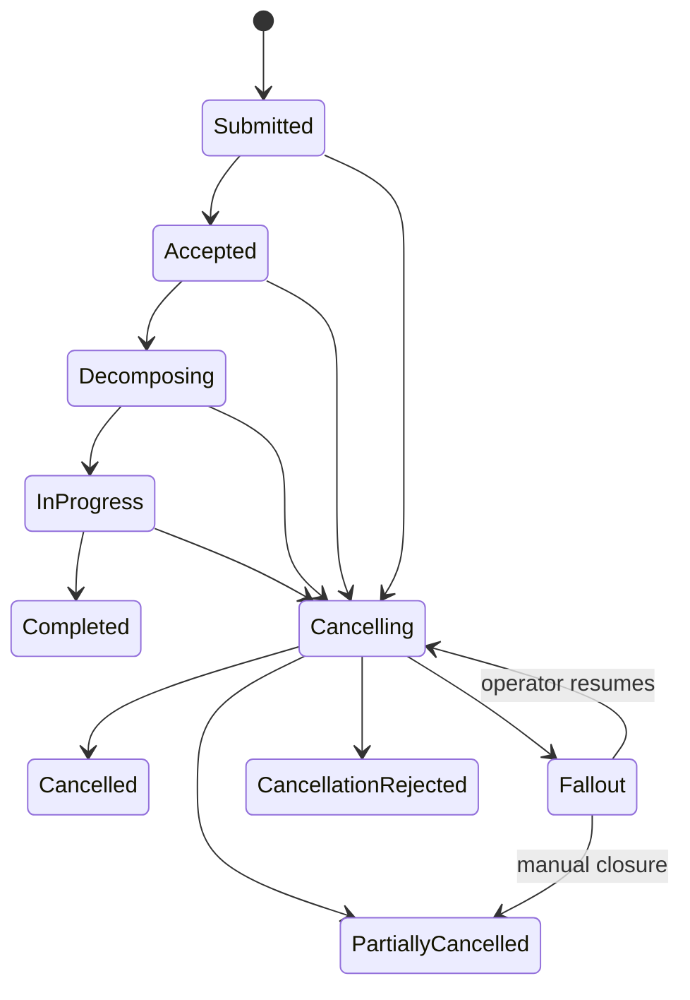
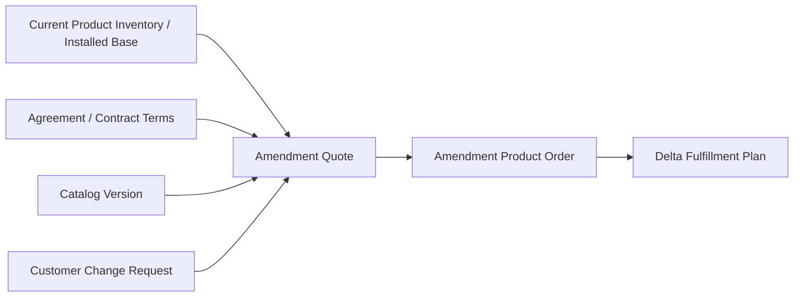
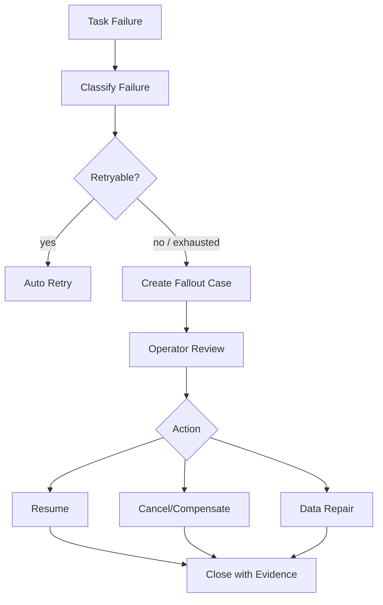
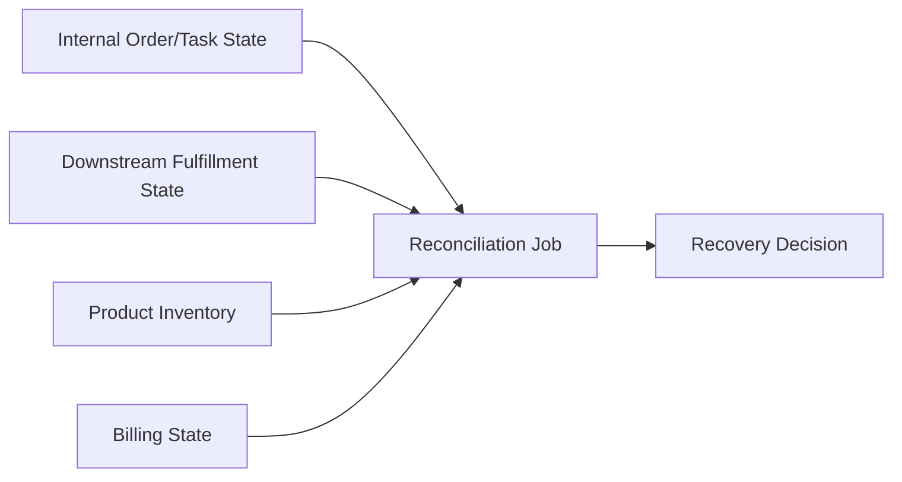

# Part 023 — Amend, Cancel, Retry, Resume, and Fallout Recovery

> **Core idea:** production order management is mostly about the unhappy path. Happy-path order submission is easy; safe amendment, cancellation, retry, resume, and fallout recovery are where enterprise systems prove their maturity.

Part ini membahas lifecycle recovery untuk sistem Quote & Order mission-critical. Fokusnya bukan hanya “bagaimana mengulang proses”, tetapi bagaimana menjaga invariant bisnis ketika order sudah sebagian berjalan, downstream sebagian berhasil, event mungkin duplicate, dan operator perlu melakukan intervensi tanpa merusak audit.

---

## 1. Source Boundary

Bagian ini memakai:

1. **Informasi publik CSG** bahwa Quote & Order berada di area CPQ/order management dan quote-to-cash untuk complex enterprise/telco.
2. **TM Forum TMF622** sebagai vocabulary product order dan product order lifecycle.
3. **TM Forum TMF641** sebagai vocabulary service ordering dan service order cancellation.
4. **Telco BSS/OSS practice umum** tentang fallout, manual intervention, provisioning failure, cancellation, and installed-base correction.
5. **Distributed systems practice umum** tentang idempotency, retry, compensation, saga/process manager, and reconciliation.

Yang harus diverifikasi internal:

- apakah amendment didukung penuh, terbatas, atau customer-specific,
- apakah cancellation memakai task/resource khusus atau state patch,
- apakah retry dilakukan otomatis, manual, atau keduanya,
- apakah ada fulfillment plan yang bisa di-resume,
- apakah fallout dikelola di UI/operator queue,
- apakah ada script/data repair workflow,
- apakah ada integration-specific recovery playbook,
- apakah recovery menghasilkan audit event yang lengkap.

---

## 2. Why Recovery Is Harder Than Submission

Order submission biasanya dimulai dari state bersih:

```text
quote accepted -> order captured -> validate -> decompose -> fulfill
```

Recovery dimulai dari state yang sudah berubah:

```text
some tasks completed
some events emitted
some downstream calls succeeded
some downstream calls timed out
some inventory records changed
some billing handoff may have started
some operator may already have intervened
```

Ini berarti recovery tidak boleh dianggap sebagai “run again”.

Recovery harus menjawab:

- apa yang sudah pasti berhasil,
- apa yang gagal,
- apa yang statusnya tidak diketahui,
- side effect mana yang irreversible,
- transition mana yang masih legal,
- customer impact apa yang sudah terjadi,
- data mana yang menjadi source of truth,
- operator boleh memperbaiki apa,
- audit evidence apa yang dibutuhkan.

A senior engineer does not ask only:

```text
Can this be retried?
```

They ask:

```text
What exact side effects are safe to repeat, skip, compensate, or escalate?
```

---

## 3. Recovery Vocabulary

| Term | Meaning | Dangerous misconception |
|---|---|---|
| Retry | Re-attempting the same operation after failure | Retry is always safe |
| Resume | Continue from a known checkpoint | Resume can infer state magically |
| Cancel | Stop future processing and possibly undo/request reversal | Cancel means delete |
| Amend | Change an existing commercial/order intent | Amend is just update |
| Fallout | Business/technical failure requiring intervention | Fallout is just an error log |
| Compensation | Follow-up action that semantically reverses/neutralizes prior work | Compensation equals rollback |
| Reconciliation | Compare internal state with downstream/source-of-truth state | Reconciliation fixes automatically |
| Data repair | Controlled correction of inconsistent persisted state | Data repair is an ad-hoc SQL update |

These distinctions matter because each has a different invariant and audit requirement.

---

## 4. Cancellation Is Not Deletion

A cancellation request usually means:

```text
Stop or reverse the business process safely.
```

It does not mean:

```text
DELETE FROM orders WHERE id = ?
```

Deletion destroys evidence. Cancellation creates evidence.

A production-grade cancellation model should capture:

- requested by,
- requested at,
- reason,
- order version/state at request time,
- cancellability decision,
- affected order items,
- downstream cancellation tasks,
- compensation actions,
- final cancellation outcome,
- residual customer/billing/inventory impact.

Example model:



The key point: cancellation is itself a workflow.

---

## 5. Cancellability Depends on State and Side Effects

A simple state-only rule is not enough.

```text
if order.state == IN_PROGRESS then cancellationAllowed = true
```

This is usually too weak.

Better cancellability decision uses:

- order state,
- order item state,
- fulfillment task state,
- downstream system capability,
- whether service has been activated,
- whether resource has been reserved,
- whether inventory has been updated,
- whether billing handoff has happened,
- whether contract/approval constraints allow cancellation,
- customer-specific policy,
- legal/regulatory restrictions,
- time window.

Example decision table:

| Condition | Cancellation behavior |
|---|---|
| Order captured but not accepted | Cancel internally |
| Accepted but not decomposed | Cancel order and emit event |
| Decomposed but no task dispatched | Cancel plan/tasks |
| Some tasks dispatched but none completed | Send downstream cancel where supported |
| Some tasks completed | Need compensation or partial cancellation |
| Service active | Cancellation becomes cease/terminate workflow |
| Billing already notified | Billing reversal or credit workflow may be needed |
| Downstream status unknown | Reconcile before final cancellation decision |

---

## 6. Cancellation Request as a Separate Resource

TMF-style APIs often model cancellation as a task/resource rather than treating cancellation as a blind order update. The reason is good: cancellation has its own lifecycle.

Conceptual shape:

```text
POST /productOrder/{id}/cancelProductOrder
POST /serviceOrder/{id}/cancelServiceOrder
```

or an internal equivalent:

```text
POST /orders/{id}/cancellation-requests
```

A cancellation request can be:

```text
received -> validating -> accepted -> executing -> completed
                                      -> rejected
                                      -> failed/fallout
```

This avoids ambiguous semantics like:

```http
PATCH /orders/123
{ "state": "cancelled" }
```

A patch changes representation. A cancellation request starts a controlled business process.

---

## 7. Amendment Is Not Update

An amendment changes an existing commercial commitment or installed base.

It may mean:

- add new product,
- modify existing product,
- remove existing product,
- upgrade bandwidth,
- downgrade service,
- change SLA,
- change site/contact,
- change billing terms,
- replace equipment,
- reprice existing commitment,
- renew contract.

A naive update says:

```text
order.items = newItems
```

A defensible amendment says:

```text
Given current installed base and contractual state,
create a new commercial/operational delta that explicitly says what changes.
```

The difference matters because fulfillment needs actions, not just final state.

---

## 8. Amendment Mental Model: Current State + Desired Delta

Amendment should be modeled as a delta from current truth.



This avoids losing the reason behind each change.

Example:

```text
Existing:
  Enterprise Internet 500Mbps + SLA Silver

Requested:
  Enterprise Internet 1Gbps + SLA Gold

Amendment actions:
  MODIFY bandwidth 500Mbps -> 1Gbps
  MODIFY SLA Silver -> Gold
  CHECK access capacity
  UPDATE billing recurring charge
  UPDATE monitoring profile
```

Not:

```text
overwrite product characteristics
```

---

## 9. TMF622-Style Item Action Semantics

Product order item actions are useful because they make change intent explicit.

Typical action vocabulary:

- `add`,
- `modify`,
- `delete`,
- `noChange`.

A senior engineer reviews whether code preserves action semantics all the way through:

```text
API payload -> domain command -> aggregate -> decomposition -> task -> downstream adapter -> event -> inventory update
```

Common bug:

```text
Action is present in API DTO but lost after mapping to internal model.
```

Another common bug:

```text
modify is decomposed like add, causing duplicate provisioning.
```

---

## 10. Retry Is Not a Loop

A bad retry strategy:

```java
while (true) {
    tryCallDownstream();
}
```

A production retry strategy defines:

- what is retried,
- why it is safe,
- max attempts,
- backoff,
- jitter,
- timeout,
- idempotency key,
- dedupe key,
- terminal error classification,
- retry ownership,
- visibility,
- escalation path.

Retry must be tied to failure classification.

| Failure | Retry? | Reason |
|---|---:|---|
| Network timeout | Maybe | Operation may or may not have succeeded |
| HTTP 503 | Yes, bounded | Temporary downstream unavailability |
| HTTP 400 validation | No | Same request will likely fail again |
| HTTP 409 conflict | Maybe | Requires re-read / concurrency handling |
| Auth failure | No automatic blind retry | Configuration/credential issue |
| Unknown response after write | Reconcile first or retry idempotently | Side effect may already exist |

---

## 11. Idempotency Key Design for Recovery

Retry safety depends on stable idempotency keys.

Bad key:

```text
UUID.randomUUID() per retry
```

Good key:

```text
tenantId + orderId + planId + taskId + downstreamAction + actionVersion
```

Examples:

```text
tenant-7:order-123:task-45:reserve-port:v1
tenant-7:order-123:task-46:activate-service:v1
tenant-7:order-123:cancel-request-9:cancel-activation:v1
```

Idempotency key must represent the business side effect, not the HTTP request attempt.

---

## 12. Retry Ownership

Avoid ambiguous ownership:

```text
API client retries
service retries
Kafka consumer retries
scheduler retries
operator retries
```

If every layer retries, you get retry storms.

Define ownership explicitly:

| Operation | Retry owner | Notes |
|---|---|---|
| Synchronous validation | Caller or service | Short timeout, small retry budget |
| Kafka event publish | Outbox relay | Durable retry until published |
| Downstream provisioning call | Fulfillment task worker | Bounded retry, fallout after limit |
| Manual correction | Operator workflow | Requires permission and audit |
| Reconciliation | Scheduled job | Read/compare/update with evidence |

---

## 13. Resume Requires Durable Checkpoints

Resume means:

```text
Continue from a known persisted point.
```

It cannot rely on in-memory state.

A resumable process persists:

- process/order state,
- plan version,
- task states,
- last successful step,
- downstream references,
- idempotency keys,
- retry attempts,
- error reason,
- operator decision,
- event publication status.

Example tables:

```sql
CREATE TABLE fulfillment_task (
  id                  uuid PRIMARY KEY,
  tenant_id           text NOT NULL,
  order_id            uuid NOT NULL,
  plan_id             uuid NOT NULL,
  task_type           text NOT NULL,
  task_state          text NOT NULL,
  idempotency_key     text NOT NULL,
  downstream_ref      text,
  attempt_count       integer NOT NULL DEFAULT 0,
  last_error_code     text,
  last_error_message  text,
  next_attempt_at     timestamptz,
  created_at          timestamptz NOT NULL,
  updated_at          timestamptz NOT NULL,
  UNIQUE (tenant_id, idempotency_key)
);
```

Without checkpointing, “resume” is just guessing.

---

## 14. Fallout Is a Business State, Not Just an Exception

A Java exception is local.

Fallout is operational.

A fallout record should capture:

- affected tenant/customer/order/order item/task,
- failure category,
- failure source,
- current lifecycle state,
- last known downstream state,
- customer impact,
- retry history,
- next recommended action,
- owner/team/queue,
- SLA/priority,
- permission required,
- audit trail.

Conceptual fallout queue:



---

## 15. Failure Classification

Do not model every failure as `FAILED`.

A useful taxonomy:

| Category | Example | Typical handling |
|---|---|---|
| Validation failure | Missing required characteristic | Reject/fallout to data correction |
| Business rule failure | Not eligible, contract conflict | Reject or operator review |
| Downstream unavailable | 503/timeout | Retry with backoff |
| Downstream rejected | Fulfillment cannot provision | Fallout/manual decision |
| Unknown outcome | Timeout after command | Reconcile |
| Duplicate request | Same idempotency key | Return previous result |
| Concurrency conflict | Version mismatch | Re-read and retry command |
| Data inconsistency | Inventory mismatch | Reconciliation/data repair |
| Security failure | Unauthorized tenant/action | Reject and audit |
| System bug | Null/mapper/serialization bug | Incident + fix + repair |

This taxonomy is more useful than stack traces during incident response.

---

## 16. Unknown Outcome Is the Most Dangerous Failure

Timeout after a write command creates ambiguity:

```text
Did downstream receive and execute the command?
Did it receive but fail?
Did it execute but fail to respond?
Did network drop response?
```

This is why idempotency and reconciliation are essential.

Unsafe behavior:

```text
timeout -> assume failed -> send another create activation request
```

Safer behavior:

```text
timeout -> mark UNKNOWN_OUTCOME -> query downstream by idempotency/correlation/business key -> resume or retry idempotently
```

Unknown is a real state.

Do not collapse unknown into failed.

---

## 17. Compensation Is Not Rollback

Rollback means returning system state exactly to the previous state.

In distributed telco/order systems, exact rollback is often impossible.

Compensation means creating a new business action that neutralizes or reverses prior work as much as possible.

Examples:

| Completed side effect | Possible compensation |
|---|---|
| Resource reserved | Release resource |
| Service activated | Cease/deactivate service |
| Device shipment created | Cancel shipment / create return |
| Billing notified | Send billing adjustment/reversal |
| Inventory product active | Terminate product instance |
| Customer notification sent | Send correction notification |

Compensation must itself be:

- authorized,
- auditable,
- idempotent,
- observable,
- potentially fallible.

---

## 18. Partial Completion

Many order systems must represent partial outcomes.

Example:

```text
Order:
  item A: completed
  item B: failed
  item C: in progress
```

Bad aggregate behavior:

```text
order.state = FAILED
```

Better aggregate behavior:

```text
order.state = PARTIALLY_COMPLETED or FALLOUT
order completion summary records item-level truth
operator decision required for unresolved items
```

Order-level state should not erase item-level truth.

---

## 19. State Aggregation Rules

Define how order state is derived from item/task states.

Example:

```text
if all items completed -> COMPLETED
if all items cancelled -> CANCELLED
if any item in fallout and no auto retry remains -> FALLOUT
if some completed and some cancelled -> PARTIALLY_COMPLETED or PARTIALLY_CANCELLED
if any item in progress -> IN_PROGRESS
```

But make this explicit. Do not scatter it across services.

Potential Java shape:

```java
public enum OrderState {
    CAPTURED,
    VALIDATING,
    ACCEPTED,
    DECOMPOSING,
    IN_PROGRESS,
    FALLOUT,
    PARTIALLY_COMPLETED,
    COMPLETED,
    CANCELLING,
    PARTIALLY_CANCELLED,
    CANCELLED,
    REJECTED
}

public final class OrderStateAggregator {
    public OrderState aggregate(List<OrderItemState> items, List<TaskState> tasks) {
        if (items.stream().allMatch(OrderItemState::isCompleted)) {
            return OrderState.COMPLETED;
        }
        if (tasks.stream().anyMatch(TaskState::requiresFallout)) {
            return OrderState.FALLOUT;
        }
        if (items.stream().anyMatch(OrderItemState::isCompleted)
                && items.stream().anyMatch(OrderItemState::isTerminalNegative)) {
            return OrderState.PARTIALLY_COMPLETED;
        }
        return OrderState.IN_PROGRESS;
    }
}
```

The exact states must match internal policy, but aggregation must be centralized and tested.

---

## 20. Operator Actions Must Be Domain Commands

Avoid operator actions like:

```sql
UPDATE orders SET state = 'COMPLETED' WHERE id = ?;
```

Prefer domain commands:

```text
resumeTask(taskId, reason)
markTaskExternallyCompleted(taskId, evidenceRef, reason)
requestCancellation(orderId, reason)
forceCloseFallout(caseId, resolution, evidenceRef)
attachDownstreamReference(taskId, downstreamRef, reason)
```

Each command should:

- validate permission,
- validate lifecycle transition,
- record reason,
- record actor,
- emit audit event,
- update state consistently,
- publish domain event if needed.

Operator tooling is part of the system, not outside it.

---

## 21. Data Repair Workflow

Data repair should be treated like a production change.

A defensible workflow:

```text
1. Detect inconsistency
2. Identify source of truth
3. Classify customer impact
4. Write dry-run query/script
5. Review with domain owner
6. Review with DB/platform owner if needed
7. Execute in controlled window
8. Capture before/after evidence
9. Emit or reconstruct audit event if policy requires
10. Verify reconciliation passes
11. Document root cause and prevention
```

Data repair without evidence creates future audit risk.

---

## 22. Reconciliation-Driven Recovery

Reconciliation compares internal state with downstream/source-of-truth state.

Example:



Reconciliation should produce decisions such as:

- internal state correct,
- downstream state correct; update internal,
- inventory missing update,
- duplicate downstream activation,
- billing handoff missing,
- unknown; operator review required.

Never assume reconciliation is always automatic. Some mismatches require human decision.

---

## 23. PostgreSQL Patterns for Recovery

Important recovery-friendly database patterns:

### 23.1 Optimistic Locking

```sql
UPDATE product_order
SET state = ?, version = version + 1, updated_at = now()
WHERE id = ?
  AND tenant_id = ?
  AND version = ?;
```

If zero rows updated, re-read and decide.

### 23.2 Unique Idempotency Constraint

```sql
CREATE UNIQUE INDEX ux_task_idempotency
ON fulfillment_task (tenant_id, idempotency_key);
```

### 23.3 Append-Only Event/Audit Log

```sql
CREATE TABLE order_audit_event (
  id              uuid PRIMARY KEY,
  tenant_id       text NOT NULL,
  order_id        uuid NOT NULL,
  event_type      text NOT NULL,
  actor_id        text,
  reason          text,
  before_state    text,
  after_state     text,
  evidence_ref    text,
  created_at      timestamptz NOT NULL
);
```

### 23.4 Recovery Case Table

```sql
CREATE TABLE order_fallout_case (
  id                 uuid PRIMARY KEY,
  tenant_id          text NOT NULL,
  order_id           uuid NOT NULL,
  order_item_id      uuid,
  task_id            uuid,
  category           text NOT NULL,
  severity           text NOT NULL,
  status             text NOT NULL,
  owner_queue        text,
  last_error_code    text,
  last_error_message text,
  recommended_action text,
  created_at         timestamptz NOT NULL,
  updated_at         timestamptz NOT NULL
);
```

---

## 24. Kafka Patterns for Recovery

Recovery with Kafka requires care.

Key principles:

- Emit state-change events only after database commit using outbox or equivalent.
- Include aggregate version/sequence.
- Include correlation ID and causation ID.
- Include idempotency key for side effects.
- Make consumers replay-safe.
- Do not use Kafka offset as business state.
- Record processing outcome in application tables when side effects matter.

Example event metadata:

```json
{
  "eventId": "evt-001",
  "eventType": "OrderFalloutCreated",
  "tenantId": "tenant-7",
  "aggregateId": "order-123",
  "aggregateType": "ProductOrder",
  "aggregateVersion": 18,
  "correlationId": "corr-abc",
  "causationId": "cmd-retry-task-45",
  "occurredAt": "2026-07-08T10:15:30Z"
}
```

Replay safety means the same event can be processed again without corrupting state.

---

## 25. REST API Semantics for Recovery

Recovery APIs should be command-like and auditable.

Examples:

```http
POST /orders/{orderId}/cancellation-requests
POST /orders/{orderId}/amendments
POST /orders/{orderId}/tasks/{taskId}/retry
POST /orders/{orderId}/tasks/{taskId}/resume
POST /fallout-cases/{caseId}/assign
POST /fallout-cases/{caseId}/resolve
```

Avoid unsafe generic endpoints:

```http
PATCH /orders/{orderId}
{ "state": "COMPLETED" }
```

Command endpoints should require:

- reason,
- actor identity,
- expected version if relevant,
- idempotency key,
- evidence reference for manual correction.

---

## 26. Observability for Recovery

Recovery observability needs business and technical dimensions.

Important fields in logs/traces:

- tenantId,
- customerId/accountId when allowed,
- quoteId,
- orderId,
- orderItemId,
- planId,
- taskId,
- cancellationRequestId,
- amendmentId,
- falloutCaseId,
- downstreamSystem,
- downstreamReference,
- idempotencyKey,
- correlationId,
- causationId,
- actorId for operator actions.

Important metrics:

- order fallout rate,
- average time in fallout,
- retry success rate,
- retry exhaustion count,
- cancellation success rate,
- partial cancellation count,
- amendment failure rate,
- unknown outcome count,
- reconciliation mismatch count,
- data repair count,
- manual closure count.

A system is not operable if support cannot answer:

```text
Where is this order stuck and what is the safe next action?
```

---

## 27. Security and Permission Concerns

Recovery operations are high-privilege.

Risks:

- unauthorized cancellation,
- approval bypass through amendment,
- operator force-complete without evidence,
- cross-tenant repair,
- hidden price/margin modification,
- audit deletion or mutation,
- privilege escalation through admin endpoint.

Controls:

- RBAC per recovery command,
- maker-checker for high-impact correction,
- tenant scoping in every query,
- immutable audit event,
- reason/evidence required,
- separation between retry and force-close,
- alerting for high-risk operator actions.

---

## 28. Testing Recovery Logic

Recovery tests should include:

### 28.1 State Machine Tests

- cannot cancel completed order unless terminate/cease workflow exists,
- cannot amend cancelled order,
- cannot retry terminal non-retryable failure,
- cannot force-complete without permission/evidence,
- cannot move from fallout to completed without item/task resolution.

### 28.2 Idempotency Tests

- duplicate cancellation request returns existing cancellation workflow,
- duplicate task retry does not duplicate downstream side effect,
- replayed fallout event does not create duplicate case.

### 28.3 Unknown Outcome Tests

- downstream timeout after write creates unknown state,
- reconciliation resolves unknown state,
- unsafe retry is blocked unless idempotent.

### 28.4 Integration Tests

- DB transaction rollback does not publish event,
- outbox eventually publishes recovery event,
- retry worker respects backoff,
- operator resolution creates audit record.

### 28.5 E2E Tests

- order partially fulfilled then cancelled,
- amendment after installed base exists,
- downstream failure creates fallout,
- operator resumes and order completes,
- billing/inventory reconciliation catches mismatch.

---

## 29. Common Failure Modes

### 29.1 Duplicate Provisioning

Cause:

- retry uses new downstream request ID each attempt,
- downstream treats retry as new request.

Prevention:

- stable idempotency key,
- downstream reference lookup,
- reconciliation before duplicate side effect.

### 29.2 Order Stuck Forever

Cause:

- no timeout,
- no terminal failure,
- no fallout escalation,
- no dashboard.

Prevention:

- state age alerts,
- retry exhaustion policy,
- fallout case creation,
- operator queue.

### 29.3 Cancellation Completes Internally but Downstream Keeps Working

Cause:

- internal order state set to cancelled without downstream cancellation.

Prevention:

- cancellation as workflow,
- downstream cancellation tasks,
- reconciliation after cancellation.

### 29.4 Amendment Loses Installed Base Context

Cause:

- modify treated as add,
- no product inventory lookup,
- stale installed base snapshot.

Prevention:

- action semantics preserved,
- installed base version captured,
- amendment validation.

### 29.5 Fallout Closed Without Fixing Root State

Cause:

- operator closes case for queue hygiene,
- order/task remains inconsistent.

Prevention:

- fallout resolution command must update domain state or link to repair evidence.

---

## 30. Senior Engineer Review Heuristics

When reviewing recovery-related changes, ask:

```text
What happens if this request is sent twice?
What happens if downstream succeeds but response times out?
What happens if cancellation arrives after partial fulfillment?
What state is durable enough to resume after pod crash?
Can support see the next safe action?
Can we prove who performed manual correction and why?
Can we reconcile internal state with downstream truth?
Can this create duplicate customer-visible side effects?
```

If the answer is “we assume it won’t happen”, the design is not production-grade.

---

## 31. PR Review Checklist

When reviewing amend/cancel/retry/fallout changes, check:

- Is the lifecycle transition explicit?
- Are illegal transitions rejected?
- Is cancellation modeled as workflow/task, not deletion?
- Are amendment action semantics preserved?
- Is installed base/product inventory consulted when needed?
- Is retry bounded and classified by failure type?
- Is idempotency key stable across attempts?
- Is unknown outcome represented explicitly?
- Is resume based on persisted checkpoint?
- Is fallout actionable and assigned?
- Is operator action authorized and audited?
- Are outbox/event emissions transactionally safe?
- Are cross-tenant boundaries enforced?
- Are reconciliation and data repair paths defined?
- Are state machine, integration, and replay tests present?
- Are dashboards/alerts updated for new failure modes?

---

## 32. Internal Verification Checklist

Check in codebase/docs/team sessions:

- amendment support scope,
- real order/item/task state machine,
- cancellation resource or command pattern,
- retry framework,
- backoff and retry exhaustion policy,
- idempotency key standard,
- outbox usage for recovery events,
- fallout case model,
- operator UI/workflow,
- RBAC for recovery commands,
- audit event schema,
- reconciliation jobs,
- data repair policy,
- known stuck-order incidents,
- downstream cancellation capabilities,
- manual closure process,
- support escalation path,
- dashboards for fallout/retry/cancellation.

---

## 33. Onboarding Exercises

1. **Trace a historical fallout.**
   - What failed?
   - Was the outcome known or unknown?
   - Was retry safe?
   - How was it resolved?

2. **Find one cancellation flow.**
   - Is cancellation a state patch or a workflow?
   - Does it create downstream cancellation tasks?

3. **Review retry behavior for one adapter.**
   - What failures are retryable?
   - Is idempotency stable?
   - What happens after retry exhaustion?

4. **Inspect one operator action.**
   - Is it authorized?
   - Does it record reason and evidence?
   - Does it emit audit event?

5. **Ask the team one sharp question.**
   - “What order recovery scenario causes the most support pain today?”

---

## 34. Summary

Recovery is not an afterthought. In enterprise order management, recovery is the product.

Production-grade recovery requires:

- cancellation as workflow,
- amendment as explicit delta,
- action semantics preservation,
- stable idempotency keys,
- failure classification,
- unknown outcome handling,
- durable checkpoints,
- actionable fallout,
- operator commands with audit,
- reconciliation,
- controlled data repair,
- observability,
- security boundaries,
- tests for unhappy paths.

The mental shift:

```text
retry the code -> recover the business process
```

A senior engineer designs for the moment when the system is half right, half wrong, and the customer is waiting.

---

## 35. Source Notes

Public references to verify externally:

- CSG Quote & Order public product positioning: `https://www.csgi.com/products/quote-and-order`
- CSG Quote-to-Cash public solution page: `https://www.csgi.com/solutions/quote-to-cash`
- TM Forum TMF622 Product Ordering Management API: `https://www.tmforum.org/open-digital-architecture/open-apis/product-ordering-management-api-TMF622/v5.0`
- TM Forum TMF641 Service Ordering Management API: `https://www.tmforum.org/open-digital-architecture/open-apis/service-ordering-management-api-TMF641/v5.0`

Use these as public/industry references only. Internal recovery behavior must be verified in CSG repositories, architecture docs, deployment docs, onboarding sessions, production dashboards, support runbooks, and incident history.
