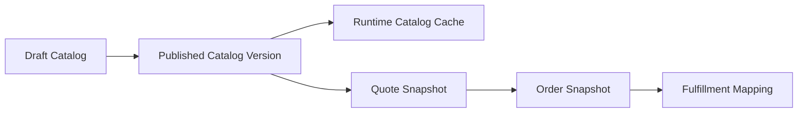
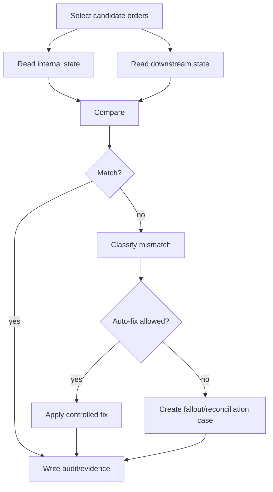

# Part 024 — Consistency Model: Strong, Eventual, Snapshot, and Reconciliation

> **Core idea:** consistency is not one setting. It is a set of explicit promises: which facts must be correct immediately, which may lag, which are frozen as snapshots, and how the system repairs drift.

Part ini membahas consistency model untuk sistem Quote & Order enterprise. Fokusnya adalah cara membuat trade-off yang eksplisit antara correctness, latency, availability, integration complexity, and operational recoverability.

---

## 1. Source Boundary

Bagian ini memakai:

1. **Informasi publik CSG** bahwa Quote & Order berada di area CPQ/order management dan quote-to-cash, dengan catalog-driven consistency sebagai positioning publik.
2. **TM Forum Open API vocabulary** untuk catalog, quote, product order, customer, product inventory, and service ordering.
3. **Distributed systems practice umum** tentang strong consistency, eventual consistency, snapshots, outbox, event replay, reconciliation, idempotency, and source-of-truth boundaries.
4. **PostgreSQL/Kafka practice umum** untuk transaction boundary, event-driven integration, read model, and repair workflow.

Yang harus diverifikasi internal:

- service mana yang menjadi source of truth untuk setiap entity,
- data mana yang disnapshot di quote/order,
- data mana yang direferensikan live,
- Kafka event ordering/retention/schema policy,
- reconciliation jobs yang sudah ada,
- manual data repair policy,
- SLO freshness untuk read model,
- consistency contract yang dijanjikan ke customer/integration.

---

## 2. Why Consistency Is a Product Decision

Consistency bukan hanya keputusan teknis.

Dalam quote-to-cash, consistency memengaruhi:

- validitas harga,
- approval correctness,
- customer commitment,
- contract compliance,
- order fulfillment,
- billing accuracy,
- product inventory truth,
- audit defensibility,
- support experience,
- revenue leakage.

Contoh:

```text
Quote accepted at price A.
Catalog price changes to price B five minutes later.
Order is created tomorrow.
Which price is valid?
```

Jawaban tidak bisa hanya “ambil latest”.

Untuk enterprise CPQ, accepted quote sering perlu membawa snapshot commercial truth. Jika tidak, customer bisa menerima satu harga tetapi order/billing memakai harga lain.

---

## 3. Consistency Vocabulary

| Term | Meaning | Example |
|---|---|---|
| Strong consistency | Read after write must reflect committed change | Quote state transition guard |
| Eventual consistency | Data may lag but should converge | Search/read model update after order event |
| Snapshot | Frozen copy of facts at decision time | Accepted quote price/catalog version |
| Reference | Pointer to source-of-truth entity | customerId, productOfferingId |
| Materialized view | Derived query-optimized representation | order summary dashboard |
| Reconciliation | Compare and repair divergence | internal order vs downstream fulfillment |
| Source of truth | Authority for a fact | catalog service for offering definition |
| Cache | Temporary copy for performance | product catalog cache |
| Staleness | Age/delay of copied data | inventory snapshot 15 minutes old |

A senior engineer names the consistency type explicitly.

---

## 4. The Core Question

For every field in a domain model, ask:

```text
Is this field a source-of-truth fact, a reference, a snapshot, a derived value, or a cache?
```

If the answer is unclear, bugs follow.

Example quote item:

```json
{
  "productOfferingId": "po-internet-1g",
  "productOfferingNameSnapshot": "Enterprise Internet 1Gbps",
  "catalogVersion": "2026.07.01",
  "recurringPriceSnapshot": 1200.00,
  "currency": "USD",
  "selectedCharacteristics": {
    "bandwidth": "1Gbps",
    "sla": "Gold"
  }
}
```

Here:

- `productOfferingId` is reference,
- `productOfferingNameSnapshot` is snapshot,
- `catalogVersion` is decision evidence,
- `recurringPriceSnapshot` is commercial commitment,
- `selectedCharacteristics` are quote-specific configuration facts.

---

## 5. Strong Consistency Candidates

Some operations should usually be strongly consistent inside one service/database boundary.

Examples:

- quote state transition,
- approval decision persistence,
- accepted quote price snapshot,
- order creation from accepted quote,
- order version increment,
- idempotency record creation,
- outbox record insertion,
- audit event creation,
- optimistic lock update,
- task state transition.

Why?

Because these operations protect invariants.

Example transaction:

```text
1. Validate quote is ACCEPTED and not already converted.
2. Create product_order.
3. Link quote to order.
4. Insert audit event.
5. Insert outbox event.
6. Commit.
```

If these are split incorrectly, you can get:

- order created without quote link,
- quote converted twice,
- event emitted for order that rolled back,
- audit missing for commercial commitment.

---

## 6. Eventual Consistency Candidates

Some data can lag if the system makes that lag explicit.

Examples:

- search index,
- dashboard counters,
- customer summary view,
- reporting projection,
- notification status,
- derived order timeline,
- fulfillment progress summary from async events,
- cached catalog read model,
- replicated customer/account read model.

Eventual consistency is acceptable when:

- stale reads do not violate business commitment,
- user experience communicates pending status,
- write path does not depend on stale projection for invariant enforcement,
- reconciliation/refresh exists,
- staleness is observable.

Eventual consistency is dangerous when used for:

- approval authority,
- price commitment,
- tenant authorization,
- idempotency dedupe,
- irreversible fulfillment decision,
- billing commitment.

---

## 7. Snapshot vs Live Lookup

This is one of the most important CPQ/order decisions.

### Snapshot

Use snapshot when the fact must be preserved as decision evidence.

Examples:

- accepted quote price,
- catalog version used for configuration,
- selected product characteristics,
- discount basis,
- approval threshold basis,
- agreement terms used at quote acceptance,
- tax/charge basis if relevant,
- customer-visible product name at quote time.

### Live Lookup

Use live lookup when the latest fact is required.

Examples:

- current user permission,
- current tenant enablement,
- current service availability before provisioning,
- current installed base before amendment,
- current downstream fulfillment status,
- current customer lock/suspension if policy requires.

### Hybrid

Many systems need both:

```text
store snapshot for evidence
lookup live data for safety check
```

Example:

```text
Order uses accepted quote price snapshot,
but validates customer/account is still allowed before order submission.
```

---

## 8. Catalog Consistency

Catalog changes are dangerous because they affect future quoting, ordering, and fulfillment.

A production-grade catalog-driven system should distinguish:

- draft catalog,
- published catalog,
- effective date,
- retired offering,
- catalog version,
- quote snapshot,
- order snapshot,
- runtime cache.

Mermaid mental model:



Catalog cache must not erase catalog version semantics.

A cache hit should still know:

```text
which catalog version produced this quote/order decision?
```

---

## 9. Pricing Consistency

Pricing consistency is about commercial truth.

Common models:

### 9.1 Recalculate Always

```text
Every view/order recalculates from latest pricing rules.
```

Pros:

- latest pricing always used,
- fewer stored values.

Cons:

- accepted quote may change unexpectedly,
- audit difficult,
- customer commitment unstable.

### 9.2 Snapshot at Quote Acceptance

```text
Draft quote can reprice.
Accepted quote freezes price basis.
Order uses accepted quote snapshot.
```

Pros:

- stable commitment,
- audit defensibility,
- predictable quote-to-order handoff.

Cons:

- must handle expiry/reprice rules,
- snapshot storage complexity.

### 9.3 Snapshot + Revalidation

```text
Accepted quote freezes price, but order creation checks quote is not expired and terms still valid.
```

Usually the best enterprise pattern.

---

## 10. Customer and Agreement Consistency

Customer/account/agreement data often comes from external systems.

Risk cases:

- customer renamed,
- account hierarchy changed,
- agreement expired,
- customer suspended,
- credit status changed,
- tenant/account mapping corrected,
- contact medium updated,
- approval authority changed.

Design question:

```text
Which customer/agreement facts are decision snapshots, and which must be latest at execution time?
```

Example:

| Fact | Recommended treatment |
|---|---|
| Customer ID | Reference |
| Customer display name on quote | Snapshot |
| Agreement ID | Reference + version/effective date |
| Agreement discount used | Snapshot |
| Current customer suspension | Live check before order |
| Account hierarchy for approval | Snapshot or versioned reference depending policy |

---

## 11. Product Inventory Consistency

Product inventory represents installed base/current customer reality.

It is usually problematic because multiple systems may influence it:

- fulfillment,
- activation,
- billing,
- customer care,
- migration jobs,
- manual repair,
- external inventory system.

For amendment/order validation, stale inventory can cause:

- duplicate add,
- invalid modify,
- cancelling non-existing product,
- wrong billing adjustment,
- wrong service order decomposition.

Patterns:

### Read Live Before Irreversible Action

```text
Before modify/delete/cease, read latest installed base or require recent snapshot.
```

### Capture Inventory Version

```text
amendmentQuote.installedBaseVersion = inventory.version
```

### Revalidate Before Order Conversion

```text
if inventory.version changed since quote -> require revalidation or reprice/reconfigure
```

---

## 12. Order and Fulfillment Consistency

Order state and fulfillment state may diverge.

Example:

```text
internal task = DISPATCHED
downstream service order = COMPLETED
internal completion event lost
```

Or:

```text
internal order = CANCELLED
downstream provisioning still IN_PROGRESS
```

This is why order systems need reconciliation.

A robust design separates:

- internal intended state,
- downstream observed state,
- reconciled state,
- final business decision.

Do not pretend a downstream API response instantly becomes truth everywhere.

---

## 13. Source-of-Truth Map

Create a source-of-truth map early in onboarding.

Example template:

| Fact | Source of truth | Local copy? | Snapshot? | Reconciliation? |
|---|---|---:|---:|---:|
| Product offering definition | Catalog service | Yes/cache | Quote/order snapshot | Catalog publish validation |
| Quote price | Quote/pricing context | Yes | Yes | Quote audit/reprice check |
| Customer legal identity | Customer/CRM system | Maybe | Display snapshot | Customer sync/reconcile |
| Product order state | Order service | Yes | No | Order/fallback reconciliation |
| Service order state | SOM/fulfillment | Yes | No | Fulfillment reconciliation |
| Product inventory active state | Inventory system | Maybe | Amendment snapshot | Inventory reconciliation |
| Billing account state | Billing system | Maybe | Billing handoff snapshot | Billing reconciliation |

This table prevents vague debates.

---

## 14. Transaction Boundary

A transaction boundary should protect one aggregate/invariant boundary.

Good transaction boundary:

```text
Quote state transition + audit + outbox in one transaction
```

Bad transaction boundary:

```text
Update quote
Call downstream HTTP
Update order
Publish Kafka event
Commit DB
```

External calls inside DB transactions create:

- long locks,
- timeouts,
- partial side effects,
- deadlocks,
- unknown outcome after rollback,
- poor retry behavior.

Pattern:

```text
DB transaction records intent and outbox.
Async worker performs side effect idempotently.
State updates based on result.
```

---

## 15. Outbox as Consistency Bridge

Outbox solves a common problem:

```text
DB commit succeeds but Kafka publish fails.
```

Instead:

```text
same DB transaction:
  - update aggregate
  - insert outbox event
commit

relay:
  - read outbox
  - publish Kafka
  - mark published
```

Example:

```sql
CREATE TABLE outbox_event (
  id                uuid PRIMARY KEY,
  tenant_id         text NOT NULL,
  aggregate_type    text NOT NULL,
  aggregate_id      uuid NOT NULL,
  aggregate_version integer NOT NULL,
  event_type        text NOT NULL,
  payload           jsonb NOT NULL,
  status            text NOT NULL,
  created_at        timestamptz NOT NULL,
  published_at      timestamptz
);
```

Outbox does not remove the need for consumer idempotency. It makes publication reliable, not globally exactly-once.

---

## 16. Event Ordering and Aggregate Version

Kafka ordering is usually per partition, not global.

If order events for one aggregate must be ordered, partition by stable aggregate key:

```text
partition key = tenantId + orderId
```

Include version:

```json
{
  "aggregateId": "order-123",
  "aggregateVersion": 17,
  "eventType": "OrderStateChanged"
}
```

Consumer can detect:

- duplicate event,
- stale event,
- missing event,
- out-of-order event.

But do not assume all event streams are globally ordered.

---

## 17. Read Models and Staleness SLO

A read model is a projection optimized for query.

Examples:

- order search screen,
- customer order summary,
- fallout dashboard,
- quote timeline,
- fulfillment progress view.

Every read model should have a freshness expectation.

Example:

| Read model | Freshness target | Safe for decisions? |
|---|---:|---:|
| Order search index | < 60 seconds | No |
| Quote detail from source DB | Immediate | Yes |
| Customer dashboard summary | < 5 minutes | No |
| Fallout queue | < 30 seconds | Yes for triage, verify before action |
| Catalog cache | Depends on publish policy | Only with version awareness |

If a stale read model is used for validation, correctness bugs appear.

---

## 18. Cache Consistency

Catalog/pricing/customer caches can improve performance, but cache invalidation must respect business semantics.

Questions:

- Is cache per tenant?
- Is cache versioned?
- Is cache invalidated on publish event?
- What happens if invalidation event is lost?
- Is there TTL?
- Is stale cache allowed for quote draft?
- Is stale cache allowed for accepted quote/order?
- Can operator see cache version?

Dangerous cache bug:

```text
node A uses catalog v10
node B uses catalog v11
same quote request produces different price/configuration
```

Mitigation:

- explicit catalog version selection,
- cache warmup after publish,
- versioned cache key,
- publish readiness check,
- cache version metric.

---

## 19. Reconciliation as a First-Class Capability

Reconciliation is not a background cleanup script. It is a correctness mechanism.

A reconciliation job should define:

- scope,
- source of truth,
- comparison keys,
- mismatch categories,
- allowed automatic fixes,
- required manual review,
- audit output,
- rate limiting,
- retry policy,
- dashboard metrics.

Example reconciliation flow:



---

## 20. Reconciliation Categories

Useful mismatch categories:

| Category | Example | Handling |
|---|---|---|
| Missing internal update | Downstream completed but internal task in progress | Update internal if evidence strong |
| Missing downstream work | Internal says dispatched but downstream has no record | Retry or create fallout |
| Duplicate downstream work | Two activations for one task | Manual review/compensation |
| State conflict | Internal cancelled, downstream completed | Business decision needed |
| Inventory drift | Product active downstream, absent in inventory | Inventory repair |
| Billing drift | Order completed, billing not notified | Replay billing event or fallout |
| Unknown identity mapping | Downstream reference missing | Manual investigation |

Classification matters because not all mismatches are safe to auto-fix.

---

## 21. Data Repair vs Reconciliation

Reconciliation detects and sometimes corrects divergence.

Data repair is a controlled change to persisted state.

Relationship:

```text
reconciliation finds mismatch -> decision -> repair command/script -> audit -> verify reconciliation passes
```

Do not let data repair become invisible business logic.

If a repair changes business state, it must have:

- reason,
- approver if required,
- before/after snapshot,
- customer impact assessment,
- event/audit consideration,
- rollback or compensation plan.

---

## 22. Consistency Failure Modes

### 22.1 Quote Price Drift

Cause:

- order recalculates from latest pricing instead of accepted quote snapshot.

Impact:

- customer-visible price mismatch,
- revenue leakage,
- dispute risk.

Prevention:

- accepted quote price snapshot,
- quote expiry/reprice rules,
- price basis audit.

### 22.2 Catalog Version Drift

Cause:

- quote configured on one catalog version, order decomposed using another without compatibility check.

Impact:

- wrong fulfillment tasks,
- missing characteristics,
- provisioning failure.

Prevention:

- catalog version captured,
- compatibility validation,
- versioned decomposition rules.

### 22.3 Duplicate Order Creation

Cause:

- idempotency key missing on quote-to-order conversion.

Impact:

- duplicate fulfillment,
- duplicate billing,
- support incident.

Prevention:

- unique conversion key,
- quote converted flag/version lock,
- idempotent create order command.

### 22.4 Stale Inventory Amendment

Cause:

- amendment quote based on old installed base.

Impact:

- invalid modify/delete,
- duplicate service,
- cancellation failure.

Prevention:

- installed base version snapshot,
- revalidation before order,
- inventory reconciliation.

### 22.5 Event Projection Lag Used as Truth

Cause:

- read model used for validation.

Impact:

- incorrect approval/order decision.

Prevention:

- source DB read for invariant checks,
- read model freshness warning,
- clear API contract.

---

## 23. PostgreSQL Implementation Concerns

### 23.1 Unique Constraints for Business Idempotency

```sql
CREATE UNIQUE INDEX ux_order_from_quote
ON product_order (tenant_id, source_quote_id)
WHERE source_quote_id IS NOT NULL;
```

This prevents double order creation from the same quote if policy allows only one conversion.

### 23.2 Versioned Updates

```sql
UPDATE quote
SET state = 'ORDERED', version = version + 1
WHERE id = :quoteId
  AND tenant_id = :tenantId
  AND state = 'ACCEPTED'
  AND version = :expectedVersion;
```

### 23.3 Snapshot Tables

```sql
CREATE TABLE quote_price_snapshot (
  id              uuid PRIMARY KEY,
  tenant_id       text NOT NULL,
  quote_id        uuid NOT NULL,
  quote_version   integer NOT NULL,
  catalog_version text NOT NULL,
  pricing_version text,
  currency        text NOT NULL,
  total_amount    numeric(19, 4) NOT NULL,
  snapshot_json   jsonb NOT NULL,
  created_at      timestamptz NOT NULL
);
```

### 23.4 Reconciliation Evidence

```sql
CREATE TABLE reconciliation_result (
  id                uuid PRIMARY KEY,
  tenant_id         text NOT NULL,
  scope_type        text NOT NULL,
  scope_id          text NOT NULL,
  mismatch_category text,
  internal_state    jsonb,
  external_state    jsonb,
  decision          text NOT NULL,
  evidence_ref      text,
  created_at        timestamptz NOT NULL
);
```

---

## 24. MyBatis Implementation Concerns

For consistency-sensitive operations:

- avoid mapper methods that update by ID without tenant/version/state guard,
- avoid dynamic SQL that silently omits critical predicates,
- return affected row count and enforce it,
- use explicit transaction boundary,
- map snapshot JSON intentionally,
- do not hide locking behavior in generic repository methods.

Bad mapper shape:

```java
void updateState(UUID orderId, String state);
```

Better:

```java
int transitionOrderState(
    String tenantId,
    UUID orderId,
    OrderState expectedState,
    OrderState newState,
    int expectedVersion
);
```

The affected row count is part of correctness.

---

## 25. API Contract Implications

API responses should communicate consistency semantics when needed.

Examples:

```json
{
  "id": "order-123",
  "state": "inProgress",
  "stateUpdatedAt": "2026-07-08T10:10:00Z",
  "fulfillmentSummary": {
    "status": "pendingExternalUpdate",
    "lastSyncedAt": "2026-07-08T10:09:30Z"
  }
}
```

Avoid pretending async data is immediate truth.

For command APIs, use:

- idempotency key,
- expected version,
- accepted/processing response,
- status resource for async operations,
- correlation ID.

---

## 26. Observability for Consistency

Important metrics:

- outbox backlog,
- outbox publish latency,
- Kafka consumer lag,
- projection lag,
- read model freshness,
- reconciliation mismatch count,
- auto-fix count,
- manual review count,
- stale catalog cache count,
- optimistic lock conflict count,
- duplicate idempotency hit count,
- unknown outcome count.

Important logs:

- aggregate ID,
- aggregate version,
- expected version,
- state transition,
- snapshot version,
- catalog version,
- pricing version,
- source-of-truth reference,
- reconciliation decision,
- repair evidence.

Consistency bugs are hard to debug without version and causation metadata.

---

## 27. Testing Consistency

### 27.1 Transaction Tests

- DB update and outbox insert commit together.
- Failed transaction does not publish event.
- optimistic lock conflict prevents stale transition.
- duplicate idempotency key returns existing result.

### 27.2 Snapshot Tests

- accepted quote price does not change after catalog/pricing update.
- expired quote requires reprice.
- order uses quote snapshot, not latest draft values.

### 27.3 Eventual Consistency Tests

- projection eventually reflects source event.
- replayed event does not duplicate projection.
- out-of-order event is ignored or corrected.
- missing event can be recovered by reconciliation.

### 27.4 Reconciliation Tests

- downstream completed/internal in progress -> internal correction or case.
- internal completed/downstream missing -> fallout.
- billing missing after order complete -> replay/repair.
- inventory drift after amendment -> case or repair.

### 27.5 Cache Tests

- cache key includes catalog version.
- publish invalidates/warmups cache.
- stale cache cannot produce accepted quote without version check.

---

## 28. Trade-Off Framework

When deciding consistency model, evaluate:

| Question | Strong | Eventual | Snapshot |
|---|---|---|---|
| Does this protect a business invariant? | Usually yes | Usually no | Maybe |
| Is latest value required? | Yes | Maybe | No |
| Is historical evidence required? | Maybe | No | Yes |
| Can stale data cause financial/legal impact? | Prefer strong/snapshot | Risky | Often needed |
| Is latency more important than immediate correctness? | Costly | Useful | Depends |
| Can reconciliation repair safely? | Less needed | Required | Required for divergence |
| Does customer see this as commitment? | Strong/snapshot | Avoid | Often yes |

Do not choose eventual consistency because it is fashionable. Choose it because the business can tolerate and repair lag.

---

## 29. Senior Engineer Review Heuristics

Ask these during design/PR review:

```text
What is the source of truth for this field?
Is this value a snapshot or live reference?
What happens if the referenced entity changes tomorrow?
What happens if event publication fails after DB commit?
What happens if consumer processes the same event twice?
What happens if projection lags by 10 minutes?
What happens if catalog cache is stale?
How do we detect drift?
How do we repair drift?
Can we prove which version of business facts was used?
```

If the design cannot answer these, it has hidden consistency assumptions.

---

## 30. PR Review Checklist

When reviewing consistency-sensitive changes, check:

- Is source of truth identified?
- Are snapshots vs references explicit?
- Is transaction boundary correct?
- Are external calls outside DB transactions?
- Is outbox or equivalent used for event publication?
- Are consumers idempotent/replay-safe?
- Is aggregate version included in events?
- Is partition key/order key correct?
- Are read models marked as eventually consistent?
- Are stale reads prevented from enforcing invariants?
- Are catalog/pricing versions captured?
- Are customer/agreement/inventory freshness rules explicit?
- Is reconciliation path defined?
- Are repair actions audited?
- Are tests covering concurrency, replay, duplicate, and lag?
- Are dashboards/alerts updated for new consistency risk?

---

## 31. Internal Verification Checklist

Check in codebase/docs/team sessions:

- source-of-truth map,
- quote snapshot model,
- order snapshot model,
- catalog versioning behavior,
- pricing version/snapshot behavior,
- customer/account replication model,
- product inventory freshness policy,
- transaction boundaries,
- outbox implementation,
- Kafka partition key standard,
- event metadata standard,
- event schema compatibility,
- read model freshness SLO,
- reconciliation jobs,
- data repair process,
- cache invalidation strategy,
- optimistic locking usage,
- duplicate prevention constraints,
- historical consistency incidents.

---

## 32. Onboarding Exercises

1. **Build a source-of-truth table.**
   - Choose 20 important fields from quote/order/catalog/customer/inventory.
   - Mark each as source, reference, snapshot, derived, or cache.

2. **Trace quote-to-order transaction boundary.**
   - What is committed atomically?
   - What is emitted asynchronously?
   - What happens if publish fails?

3. **Inspect one accepted quote.**
   - Does it store catalog version?
   - Does it store price snapshot?
   - Can you prove pricing basis later?

4. **Measure projection lag.**
   - Pick one event-driven read model.
   - Find its freshness metric or infer how to measure it.

5. **Review one reconciliation process.**
   - What mismatches are auto-fixed?
   - What mismatches require operator review?

6. **Ask the team one sharp question.**
   - “Which consistency assumption has caused the most production pain?”

---

## 33. Summary

Consistency must be designed, not assumed.

Production-grade quote/order systems need:

- explicit source-of-truth map,
- clear snapshot/reference distinction,
- strong consistency for invariants,
- eventual consistency for tolerable lag,
- catalog/pricing version awareness,
- customer/agreement freshness rules,
- product inventory revalidation,
- outbox for DB-to-Kafka consistency,
- idempotent consumers,
- aggregate version metadata,
- observable projection lag,
- reconciliation and repair workflows,
- tests for concurrency, replay, drift, and stale reads.

The mental shift:

```text
data is stored -> data has consistency promises
```

A senior engineer makes those promises explicit and tests whether production can keep them.

---

## 34. Source Notes

Public references to verify externally:

- CSG Quote & Order public product positioning: `https://www.csgi.com/products/quote-and-order`
- CSG Quote-to-Cash public solution page: `https://www.csgi.com/solutions/quote-to-cash`
- TM Forum Open APIs directory: `https://www.tmforum.org/oda/open-apis/`
- TM Forum TMF620 Product Catalog Management API: `https://www.tmforum.org/open-digital-architecture/open-apis/product-catalog-management-api-TMF620/v5.0`
- TM Forum TMF648 Quote Management API: `https://www.tmforum.org/open-digital-architecture/open-apis/quote-management-api-TMF648/v5.0`
- TM Forum TMF622 Product Ordering Management API: `https://www.tmforum.org/open-digital-architecture/open-apis/product-ordering-management-api-TMF622/v5.0`
- TM Forum TMF637 Product Inventory Management API: `https://www.tmforum.org/open-digital-architecture/open-apis/product-inventory-management-api-TMF637/v5.0`
- TM Forum TMF641 Service Ordering Management API: `https://www.tmforum.org/open-digital-architecture/open-apis/service-ordering-management-api-TMF641/v5.0`

Use these as public/industry references only. Internal consistency behavior must be verified in CSG repositories, architecture docs, deployment docs, onboarding sessions, production dashboards, incident history, and customer integration contracts.
