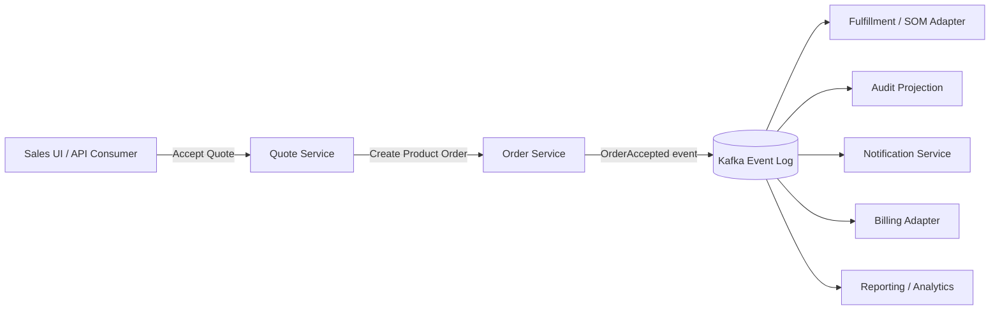
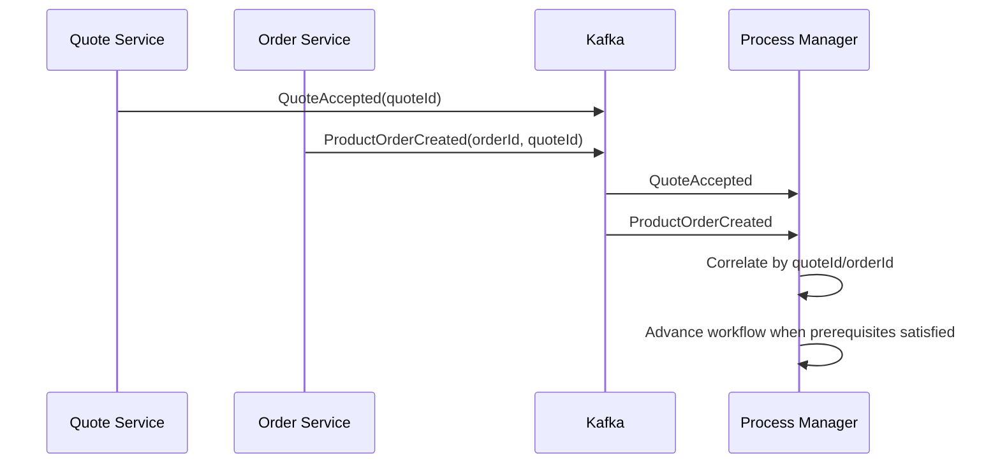
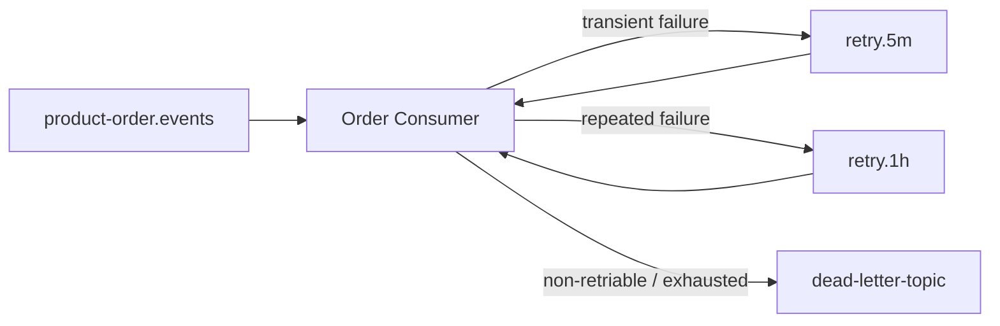
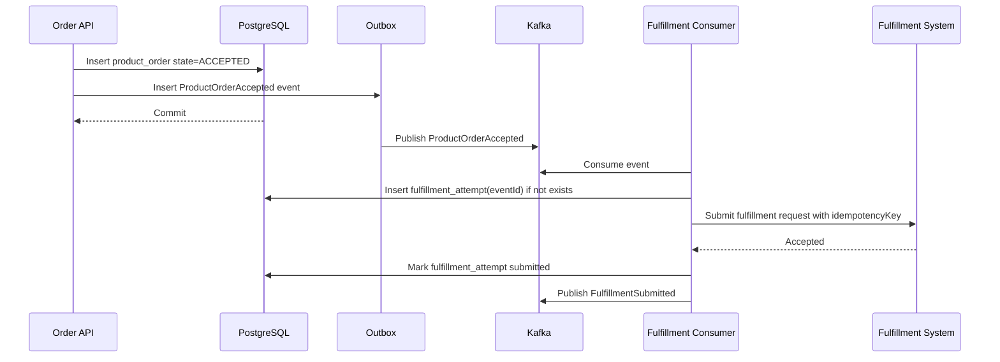

# Kafka Event-Driven Architecture for Quote and Order Systems

> **Scope:** Part ini membahas Kafka sebagai backbone event-driven architecture untuk sistem Quote & Order enterprise. Fokusnya bukan “cara kirim message”, tetapi bagaimana event stream dipakai untuk menjaga workflow quote-to-cash tetap traceable, replayable, evolvable, dan operationally safe.

> **Boundary note:** Materi ini menggunakan konsep umum Apache Kafka dan domain quote/order/telco. Detail topic, schema, broker topology, cluster ownership, retention, security, dan production convention di CSG harus diverifikasi secara internal.

## 1. Mental Model: Kafka Is Not Just a Queue

Dalam sistem Quote & Order, Kafka sering terlihat seperti “alat async”. Itu cara pandang yang terlalu dangkal.

Kafka lebih tepat dipahami sebagai:

1. **durable event log** untuk mencatat fakta bisnis/teknis yang sudah terjadi,
2. **integration backbone** antar bounded context,
3. **replay substrate** untuk membangun ulang read model, audit projection, atau downstream state,
4. **decoupling mechanism** antara producer dan consumer,
5. **operational signal surface** untuk melihat lag, backlog, retry, poison message, dan throughput.

Apache Kafka secara resmi mendeskripsikan dirinya sebagai distributed event streaming platform; dokumentasi desainnya menekankan topic partition, append-only log, consumer-controlled offsets, replay, partitioned processing, dan delivery semantics. Gunakan ini sebagai first principle: Kafka bukan RPC yang disembunyikan dalam message broker.

Source notes:

- Apache Kafka Documentation: <https://kafka.apache.org/documentation/>
- Apache Kafka 4.3 Design: <https://kafka.apache.org/43/design/design/>

## 2. Why Event-Driven Architecture Exists in Quote & Order

Quote & Order enterprise memiliki karakter yang membuat synchronous-only architecture cepat rapuh:

- Quote conversion dapat memicu order creation, validation, decomposition, fulfillment, notification, audit, reporting, dan billing handoff.
- Order fulfillment bisa memakan menit, jam, atau hari.
- Downstream system dapat tidak stabil, lambat, legacy, customer-specific, atau punya maintenance window.
- Customer deployment bisa cloud, hybrid, atau on-prem.
- Data perlu dapat direkonstruksi untuk incident, audit, dan support.
- Tidak semua consumer perlu blocking user journey.

Event-driven architecture muncul karena workflow quote-to-cash memiliki banyak efek samping yang **penting**, tetapi tidak semuanya harus terjadi dalam request transaction yang sama.

Contoh:



Core rule:

> Use synchronous calls for decisions that must complete before a command is accepted. Use events for facts that occurred and can be consumed independently.

## 3. Command vs Event vs Notification

A common source of bad Kafka design is treating every message as “just a message”. In enterprise systems, the semantic distinction matters.

### 3.1 Command

A command asks another component to do something.

Examples:

- `ValidateProductOrderCommand`
- `DecomposeOrderCommand`
- `CancelServiceOrderCommand`
- `RetryFulfillmentTaskCommand`

A command can be rejected. It has intent, target, and authorization concerns.

### 3.2 Event

An event states that something already happened.

Examples:

- `QuoteAccepted`
- `ProductOrderCreated`
- `ProductOrderValidationFailed`
- `OrderDecompositionCompleted`
- `FulfillmentTaskFailed`
- `OrderCompleted`

An event should not be phrased as an instruction. Consumers react to it, but producers should not assume which consumers exist.

### 3.3 Notification

A notification is often an integration-facing or UI-facing signal that may be derived from events.

Examples:

- `OrderStatusChangedNotification`
- `ApprovalReminderNotification`
- `CustomerOrderUpdateNotification`

In many systems, notifications are less durable as source-of-truth than domain events. Verify internal conventions.

## 4. Event Taxonomy for Quote & Order

A good event taxonomy reflects bounded contexts and business lifecycle.

### 4.1 Quote Events

Possible event families:

- `QuoteCreated`
- `QuoteConfigured`
- `QuotePriced`
- `QuoteApprovalRequested`
- `QuoteApproved`
- `QuoteRejected`
- `QuoteAccepted`
- `QuoteExpired`
- `QuoteCancelled`
- `QuoteConvertedToOrder`

Important design question:

> Is `QuoteAccepted` enough, or do we need `QuoteConvertedToOrder` separately?

They are not identical. Acceptance is a commercial event. Conversion is an operational handoff event. A system may accept a quote but fail to create an order due to integration/transaction failure. Collapsing both can hide failures.

### 4.2 Product Order Events

Possible event families:

- `ProductOrderCreated`
- `ProductOrderValidated`
- `ProductOrderValidationFailed`
- `ProductOrderAccepted`
- `ProductOrderRejected`
- `ProductOrderDecompositionStarted`
- `ProductOrderDecompositionCompleted`
- `ProductOrderFulfillmentStarted`
- `ProductOrderFalloutRaised`
- `ProductOrderCancellationRequested`
- `ProductOrderCancelled`
- `ProductOrderCompleted`

### 4.3 Order Item Events

For complex orders, order-level events may be too coarse.

Examples:

- `OrderItemValidated`
- `OrderItemDecomposed`
- `OrderItemFulfillmentStarted`
- `OrderItemCompleted`
- `OrderItemFailed`
- `OrderItemCancelled`

Use item-level events when consumers must react to partial fulfillment, dependency graph progress, or fallout isolation.

### 4.4 Catalog Events

Catalog events affect quote correctness and cache invalidation.

Examples:

- `ProductOfferingPublished`
- `ProductOfferingRetired`
- `CatalogVersionPublished`
- `PriceListPublished`
- `EligibilityRulePublished`

Catalog events should usually include version/effective-date metadata. A consumer must know whether a quote/order should use the new catalog state or a previously captured snapshot.

### 4.5 Customer and Agreement Events

Customer/account/agreement events can affect eligibility, pricing, approval, and tenant scope.

Examples:

- `CustomerUpdated`
- `AccountHierarchyChanged`
- `AgreementActivated`
- `AgreementExpired`
- `ContractTermChanged`

These events are dangerous if consumers silently reinterpret existing quotes/orders using latest state. Decide explicitly whether the system uses references, snapshots, or both.

## 5. Event Naming: Past Tense and Domain Language

Good names are not cosmetic. They encode semantics.

Prefer:

- `QuoteAccepted`
- `OrderValidationFailed`
- `ServiceOrderSubmitted`
- `FulfillmentTaskTimedOut`

Avoid:

- `ProcessQuote`
- `OrderMessage`
- `KafkaEvent`
- `StatusUpdate`
- `SendToFulfillment`

Bad naming causes ambiguous consumers. Ambiguous consumers cause hidden coupling.

Naming heuristic:

> If the message name cannot answer “what fact became true?”, it is probably not a domain event.

## 6. Event Payload Design

Event payload should be intentionally designed. It is not automatically “whatever entity JSON we already have”.

### 6.1 Minimal Event

A minimal event contains identifiers and metadata:

```json
{
  "eventId": "4f32d884-0f6b-4c2f-9d4b-3b4a5e2c1010",
  "eventType": "ProductOrderAccepted",
  "eventVersion": 1,
  "occurredAt": "2026-07-08T10:15:30Z",
  "tenantId": "tenant-001",
  "productOrderId": "po-12345",
  "correlationId": "corr-abc",
  "causationId": "cmd-quote-accept-789"
}
```

Pros:

- Smaller payload.
- Less schema churn.
- Less risk of leaking PII or stale fields.
- Consumer fetches details when needed.

Cons:

- Consumers may create read amplification.
- Consumer result depends on current state, not event-time state.
- Replays may not reproduce historical behavior unless snapshots exist.

### 6.2 Fat Event

A fat event includes a snapshot of relevant business state:

```json
{
  "eventId": "...",
  "eventType": "ProductOrderAccepted",
  "eventVersion": 1,
  "occurredAt": "2026-07-08T10:15:30Z",
  "tenantId": "tenant-001",
  "productOrder": {
    "id": "po-12345",
    "state": "ACCEPTED",
    "orderDate": "2026-07-08",
    "catalogVersion": "catalog-2026.07",
    "quoteId": "q-999",
    "items": [
      {
        "id": "poi-1",
        "action": "ADD",
        "productOfferingId": "offer-fiber-1g",
        "state": "ACCEPTED"
      }
    ]
  }
}
```

Pros:

- Consumers can act without synchronous lookup.
- Better for audit/replay/read models.
- Captures event-time snapshot.

Cons:

- Larger payload.
- More compatibility responsibility.
- More PII/security risk.
- More schema evolution burden.

### 6.3 Practical Rule

For Quote & Order systems:

- Use **event metadata + identifiers** for internal signals that consumers can safely dereference.
- Use **snapshot payload** when historical correctness matters or consumer must not depend on current mutable state.
- Avoid dumping entire persistence entity into events.
- Do not expose internal database shape as event contract.

## 7. Required Event Metadata

A production event should usually include:

| Field | Purpose |
|---|---|
| `eventId` | Deduplication, audit, idempotent processing. |
| `eventType` | Routing and semantic identification. |
| `eventVersion` | Schema and semantic evolution. |
| `occurredAt` | Business event time. |
| `publishedAt` | Broker/publication time, if distinct. |
| `tenantId` | Tenant isolation and routing. |
| `aggregateType` | Quote, ProductOrder, CatalogVersion, etc. |
| `aggregateId` | Business aggregate identifier. |
| `aggregateVersion` | Ordering and stale-event detection. |
| `correlationId` | End-to-end trace across request/workflow. |
| `causationId` | Event/command that caused this event. |
| `actor` | User/service identity, if safe. |
| `sourceService` | Producer ownership. |
| `schemaVersion` | Payload compatibility management. |

Minimum senior review question:

> Can this event be deduplicated, traced, authorized, replayed, and interpreted six months later?

## 8. Topic Design

Topic design controls coupling, ordering, retention, security, and operational blast radius.

### 8.1 Topic Per Domain Event Family

Example:

- `quote.events`
- `product-order.events`
- `catalog.events`
- `customer.events`
- `fulfillment.events`

Pros:

- Clear ownership.
- Easier ACL boundary.
- Easier retention policy per domain.
- Easier consumer discovery.

Cons:

- Consumers must filter event types.
- Topic can contain many schemas unless envelope is disciplined.

### 8.2 Topic Per Event Type

Example:

- `quote.accepted`
- `quote.expired`
- `product-order.created`
- `product-order.completed`

Pros:

- Simple subscription semantics.
- Stronger per-event retention/ACL options.

Cons:

- Topic sprawl.
- Harder lifecycle governance.
- More operations burden.

### 8.3 Topic Per Consumer Use Case

Example:

- `billing.order-events`
- `analytics.order-events`
- `notification.quote-events`

This is often a smell unless the topic is a projection/integration topic intentionally owned by the producer or platform team. If every consumer gets custom topics, producer/consumer decoupling degrades into integration spaghetti.

### 8.4 Recommended Starting Point

For enterprise Quote & Order:

- Start with **domain-owned event topics**.
- Use envelope metadata consistently.
- Use schema registry or equivalent governance.
- Create integration-specific projection topics only when there is a real compatibility/security/performance reason.

## 9. Partition Key Strategy

Partition key decides ordering and parallelism.

Kafka guarantees order within a partition, not globally across all partitions. Therefore, partition key is not just performance configuration; it is correctness design.

### 9.1 Candidate Keys

| Key | When useful | Risk |
|---|---|---|
| `quoteId` | Quote lifecycle ordering. | Quote-to-order handoff may cross aggregate. |
| `productOrderId` | Order lifecycle ordering. | Customer-level workflows may interleave. |
| `customerId` | Customer/account ordering. | Hot large enterprise customers. |
| `tenantId` | Tenant isolation. | Terrible parallelism if few tenants. |
| `catalogVersionId` | Catalog publish workflows. | Not useful for quote/order events. |
| composite key | Domain-specific locality. | Harder routing/debugging. |

### 9.2 Quote/Order Rule

Use the aggregate ID whose lifecycle must be ordered.

- Quote lifecycle events: partition by `quoteId`.
- Product order lifecycle events: partition by `productOrderId`.
- Order item events: often partition by `productOrderId`, not `orderItemId`, if order-level aggregation requires ordered item signals.
- Customer/agreement events: partition by `customerId` or `accountId` if consumers need customer-scoped ordering.

### 9.3 Cross-Aggregate Ordering Is a Trap

If a workflow needs strict ordering across quote, order, customer, inventory, and fulfillment, Kafka partitioning alone will not solve it.

Use explicit process state:



Cross-aggregate ordering should be modelled as state correlation, not assumed from broker order.

## 10. Producer Responsibility

A producer owns event truth. It must not publish an event for a business fact that is not durable.

### 10.1 Unsafe Producer Pattern

```java
orderRepository.save(order);
kafkaTemplate.send("product-order.events", event);
```

This looks fine but is unsafe if:

- DB commit succeeds but Kafka send fails.
- Kafka send succeeds but DB transaction rolls back.
- process crashes between DB and send.
- retry publishes duplicate event.

This is why Part 030 goes deep into outbox and idempotency. For now, remember:

> Event publication must be coordinated with the state change that makes the event true.

### 10.2 Producer Checklist

Before emitting an event:

- Is the business fact durable?
- Is the event type specific and past-tense?
- Does the event have an immutable event ID?
- Does it include correlation and causation metadata?
- Is tenant ID present and correct?
- Is schema version explicit?
- Is payload free from accidental PII/internal leakage?
- Is the partition key selected from correctness needs?
- Is publication observable?
- Is failure/retry path safe?

## 11. Consumer Responsibility

A consumer is not entitled to assume it sees each event exactly once, in perfect time, with no duplicates, no schema changes, and no replays.

A production consumer must be prepared for:

- duplicate events,
- delayed events,
- out-of-order events across partitions,
- rebalances,
- poison messages,
- schema evolution,
- replay,
- downstream failure,
- partial side effects,
- tenant authorization mistakes,
- producer bugs.

Consumer rule:

> Consume facts, validate assumptions, apply idempotent state transitions, and emit new facts only after durable change.

## 12. Consumer Groups and Ownership

A consumer group represents one logical subscription.

Examples:

- `fulfillment-orchestrator`
- `audit-projection`
- `billing-adapter`
- `order-search-indexer`
- `notification-service`

Do not share one consumer group across unrelated use cases. That causes confusing offset ownership and operational coupling.

Each consumer group needs:

- owner team,
- purpose,
- topic subscriptions,
- lag dashboard,
- replay policy,
- DLQ/retry policy,
- schema compatibility expectation,
- on-call routing.

## 13. Retention Strategy

Retention is a product and operations decision.

Questions:

- How long do we need order lifecycle events for replay?
- Are audit events legally/commercially required to be retained longer than operational events?
- Can event topics be compacted?
- Are there PII fields in events?
- What is the storage cost of fat payloads?
- Is replay from Kafka the official recovery mechanism, or only a diagnostic tool?

Typical topic categories:

| Topic type | Example | Retention idea |
|---|---|---|
| Domain event log | `product-order.events` | Long enough for replay/recovery window. |
| Audit event log | `audit.events` | Based on compliance/legal retention. |
| Retry topic | `product-order.retry.5m` | Shorter, operational. |
| DLQ topic | `product-order.dlq` | Until triaged/resolved. |
| Projection topic | `billing.order-projection` | Consumer-specific. |
| Compacted reference topic | `catalog.latest` | Latest value per key. |

Internal policy must decide exact retention values.

## 14. Ordering, Rebalancing, and Stateful Consumers

Kafka consumers can be reassigned partitions during rebalance. If a consumer maintains local state or in-flight work, rebalancing can create subtle bugs.

Risk examples:

- Consumer A starts processing `OrderAccepted` but pauses before committing offset.
- Rebalance assigns partition to Consumer B.
- Consumer B processes the same event.
- Both call downstream fulfillment if side effects are not idempotent.

Mitigations:

- Keep consumer processing idempotent.
- Commit offset only after durable processing.
- Bound processing time per record/batch.
- Use stable idempotency keys for downstream calls.
- Use database constraints to enforce one effect per event/command.
- Track event processing state.
- Understand rebalance protocol and max poll interval settings.

## 15. Retry and DLQ Strategy

Not all failures are equal.

### 15.1 Failure Classes

| Class | Example | Strategy |
|---|---|---|
| Transient | network timeout | retry with bounded backoff |
| Rate limit | downstream throttling | backoff + bulkhead |
| Dependency outage | fulfillment API down | pause/retry, circuit breaker |
| Data validation | missing required field | DLQ or fallout, not blind retry |
| Schema incompatibility | unknown required field | stop/alert, compatibility fix |
| Poison event | malformed payload | DLQ with triage |
| Business conflict | order already cancelled | idempotent no-op or domain error |

### 15.2 Retry Topics

A common pattern:



Retry topics must preserve enough metadata:

- original topic,
- original partition,
- original offset,
- original event ID,
- failure reason,
- attempt count,
- first failure time,
- last failure time,
- stack/error category,
- consumer group.

## 16. Domain Example: Order Accepted to Fulfillment



Important details:

- `ProductOrderAccepted` is inserted in outbox within the same transaction as order acceptance.
- Fulfillment consumer deduplicates by `eventId` or domain idempotency key.
- Downstream call uses stable idempotency key.
- Consumer commits offset only after durable result.
- If crash occurs after downstream accepted but before DB update, retry must not create duplicate fulfillment.

## 17. Event-Driven Read Models

Read models are derived views optimized for query.

Examples:

- order search index,
- quote dashboard,
- customer order history,
- fulfillment progress view,
- audit timeline,
- reporting projection.

Read model principle:

> A projection is disposable only if it can be rebuilt from durable source-of-truth events or source tables.

Questions:

- Is Kafka event log complete enough to rebuild this projection?
- Is projection rebuild documented?
- Are event versions backward-compatible enough for replay?
- Does projection need current state or historical timeline?
- How do we detect projection drift?

## 18. Event-Driven Audit vs Audit Log

Domain events and audit logs overlap but are not identical.

Domain event:

- describes business fact,
- consumed by services,
- may omit actor details if not needed,
- optimized for integration.

Audit record:

- must answer who/what/when/why/before/after,
- optimized for evidence reconstruction,
- may need immutability and retention controls,
- may not be safe to replay as integration input.

Do not assume Kafka domain events are sufficient audit evidence. Verify audit requirements.

## 19. Schema Governance

Event schema is an enterprise contract.

Governance areas:

- schema format: JSON Schema, Avro, Protobuf, or internal convention,
- schema registry,
- compatibility mode,
- required vs optional fields,
- enum expansion policy,
- default value policy,
- field deprecation,
- PII classification,
- consumer compatibility tests,
- producer contract tests.

Compatibility mindset:

> A schema can be syntactically compatible but semantically breaking.

Example:

- Adding enum value `PARTIALLY_CANCELLED` may be syntactically additive.
- A consumer with exhaustive switch may crash or misroute.
- A dashboard may classify it as unknown failure.
- A billing adapter may ignore it.

## 20. Security and Tenant Isolation in Events

Kafka does not magically enforce business isolation. You must design it.

Security questions:

- Are topics shared across tenants?
- Is `tenantId` required in every event?
- Can a consumer read all tenants or only assigned tenants?
- Are topic ACLs aligned with service ownership?
- Is PII present in payload?
- Are secrets accidentally emitted?
- Are event logs retained longer than allowed for sensitive data?
- Are DLQs protected like production data?

Potential patterns:

- shared topic with tenant field and strict service-level filtering,
- tenant-specific topics for stronger isolation but higher operational complexity,
- domain topic plus sanitized external integration topic,
- PII-minimized events with lookup through authorized API.

## 21. Observability for Kafka Workflows

Kafka observability must answer both technical and business questions.

Technical signals:

- producer send rate,
- producer error rate,
- publish latency,
- consumer lag,
- rebalance count,
- processing latency,
- retry count,
- DLQ count,
- schema validation failures,
- commit failures.

Business signals:

- `QuoteAccepted` rate,
- `ProductOrderCreated` rate,
- order accepted to fulfillment submitted latency,
- fallout rate,
- cancellation rate,
- duplicate event count,
- stuck order count,
- projection freshness.

Every event handler should log:

- `eventId`,
- `eventType`,
- `aggregateId`,
- `tenantId`,
- `correlationId`,
- `causationId`,
- `consumerGroup`,
- `attempt`,
- `result`,
- `durationMs`.

## 22. Failure Modes

### 22.1 Event Published Before DB Commit

Symptom:

- Consumer receives event for order that does not exist.

Cause:

- Event sent outside transaction before durable state.

Mitigation:

- Transactional outbox.
- Publish only after commit via outbox relay.
- Consumer defensive lookup with retry only for known propagation delay.

### 22.2 DB Commit Without Event

Symptom:

- Order accepted but fulfillment never starts.

Cause:

- DB commit succeeded but Kafka publish failed.

Mitigation:

- Outbox table with relay retry.
- Outbox lag alert.
- Reconciliation query for accepted orders with no emitted event.

### 22.3 Duplicate Event Causes Duplicate Fulfillment

Symptom:

- Customer receives duplicate service order or duplicate provisioning.

Cause:

- Consumer not idempotent.

Mitigation:

- Processed event table.
- Domain idempotency key.
- Unique constraint on downstream request key.
- Downstream idempotency support.

### 22.4 Wrong Partition Key Breaks Lifecycle Ordering

Symptom:

- `OrderCompleted` processed before `OrderAccepted` in a projection.

Cause:

- Related events partitioned by different keys.

Mitigation:

- Partition lifecycle events by aggregate ID.
- Include aggregate version.
- Consumer handles stale/future version.

### 22.5 Event Payload Leaks Internal Model

Symptom:

- Consumers break when internal table/field changes.

Cause:

- Published persistence entity as event schema.

Mitigation:

- Event contract DTO.
- Schema governance.
- Compatibility tests.

### 22.6 DLQ Becomes a Graveyard

Symptom:

- Messages accumulate with no owner, no SLA, and no recovery path.

Cause:

- DLQ treated as terminal disposal.

Mitigation:

- DLQ ownership.
- DLQ dashboard.
- Triage workflow.
- Replay/fix tooling.
- Business impact classification.

## 23. Testing Strategy

### 23.1 Producer Tests

Test that:

- event is emitted only after successful domain change,
- event metadata is complete,
- partition key is correct,
- schema is valid,
- outbox row is created in same transaction,
- rollback does not leave publishable event,
- tenant/correlation metadata propagates.

### 23.2 Consumer Tests

Test that consumer handles:

- duplicate event,
- unknown event version,
- missing optional field,
- out-of-order aggregate version,
- transient downstream failure,
- non-retriable business failure,
- replay from old offset,
- tenant mismatch,
- poison message.

### 23.3 Integration Tests

Use Testcontainers or equivalent to verify:

- Kafka publish/consume path,
- consumer group behavior,
- offset commit behavior,
- retry topic behavior,
- schema validation,
- outbox relay integration,
- database dedupe constraints.

## 24. PR Review Checklist

When reviewing Kafka/event-driven changes, ask:

- What business fact does this event represent?
- Is the name past-tense and domain-specific?
- Who owns the topic and schema?
- Is the event published only after durable state change?
- Is outbox or equivalent used?
- Is partition key chosen for correctness?
- Can consumers deduplicate?
- Can consumers replay safely?
- Is schema evolution backward-compatible?
- Are tenant/security fields present?
- Is PII minimized?
- Are retry and DLQ paths explicit?
- Are correlation and causation IDs propagated?
- Are metrics/logs/traces sufficient to debug one order?
- What happens if consumer processes the event twice?
- What happens if consumer is down for two days?
- What happens if event arrives after order is cancelled?

## 25. Internal Verification Checklist

Check these in CSG internal systems:

- Kafka cluster ownership and environment topology.
- Broker version and client library versions.
- Topic naming convention.
- Topic ownership registry.
- Partition key standards.
- Schema format and schema registry.
- Event envelope standard.
- Required metadata fields.
- Correlation/causation propagation standard.
- Retention policy per topic category.
- Compaction policy usage.
- Security/ACL model.
- Tenant isolation model for events.
- DLQ/retry topic pattern.
- Consumer group ownership and alerting.
- Outbox implementation status.
- Replay process and tooling.
- Recent Kafka-related incidents.
- Consumer lag dashboards.
- Event contract test pipeline.
- Integration adapters that depend on Kafka events.

## 26. Practical Onboarding Exercises

### Exercise 1: Build an Event Map

Pick one journey: quote accepted to product order completed.

Document:

- events emitted,
- topic names,
- producer service,
- consumer services,
- partition key,
- schema version,
- retention,
- dashboards,
- retry/DLQ path.

### Exercise 2: Trace One Production-like Order

In non-production or permitted observability tools, trace one order across:

- API request,
- DB transaction,
- outbox row,
- Kafka event,
- consumer processing,
- downstream call,
- resulting state update.

### Exercise 3: Consumer Failure Drill

For one consumer, answer:

- What happens if it crashes after DB update but before offset commit?
- What happens if it crashes after downstream call but before DB update?
- What happens if it receives a duplicate event?
- What is the idempotency key?
- Who owns DLQ triage?

## 27. Summary

Kafka in Quote & Order systems is not a generic async pipe. It is a durable coordination surface for business facts, lifecycle transitions, projections, integrations, audit-adjacent trails, and operational recovery.

The senior engineering skill is not “using Kafka”. It is knowing which facts deserve events, which state must be strongly consistent, which consumers must be idempotent, which payloads must be snapshots, which topics need retention, and how to detect and repair failure without corrupting customer orders.

Part 030 continues with the hardest correctness layer: idempotency, duplicate events, outbox, and the practical limits of exactly-once semantics.
