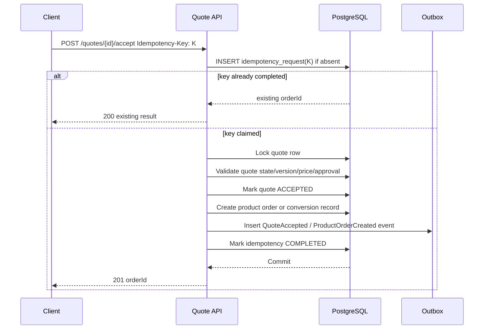
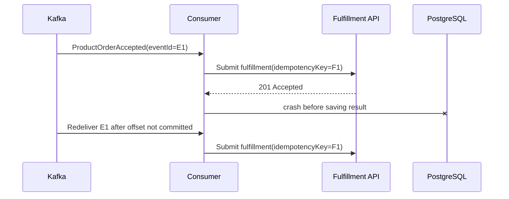
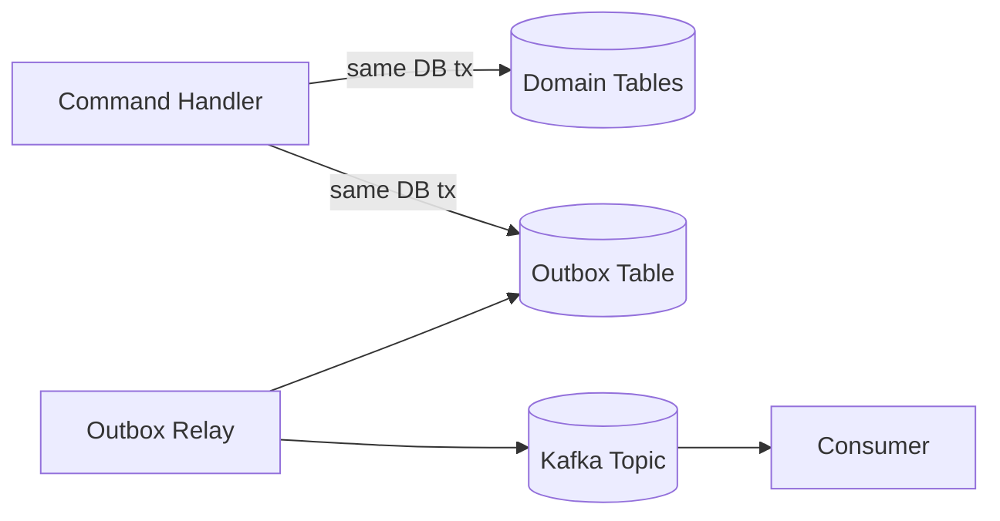
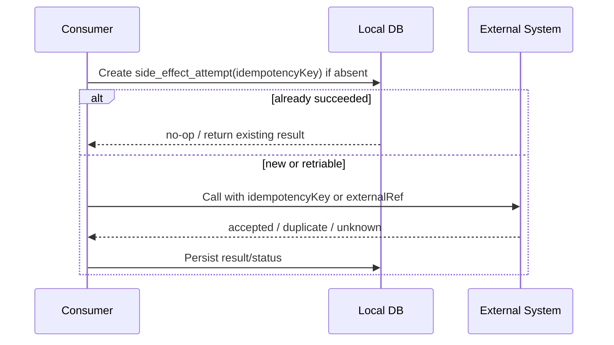
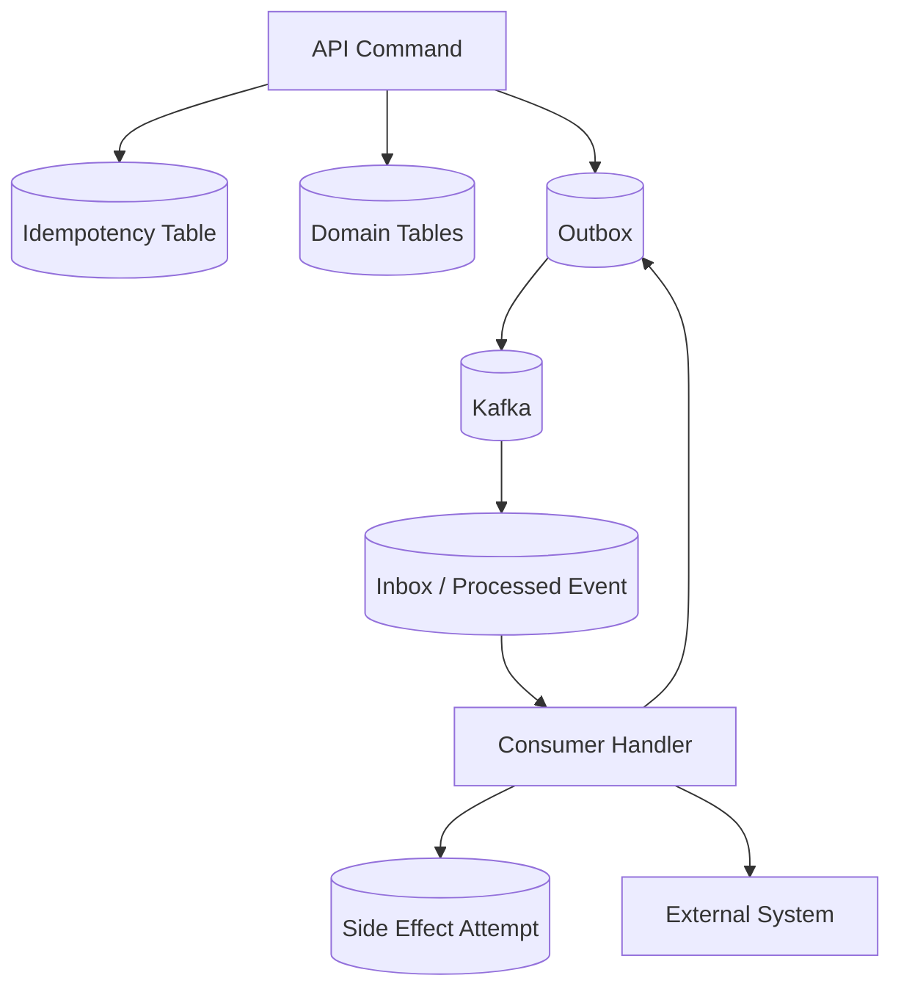

# Idempotency, Duplicate Events, Outbox, and Exactly-Once Illusions

> **Scope:** Part ini membahas bagaimana membuat command handler, event producer, Kafka consumer, downstream adapter, dan database transaction aman terhadap retry, duplicate event, crash, rebalance, replay, dan unknown outcome.

> **Boundary note:** Materi ini membahas pola umum production-grade. Detail internal CSG seperti implementasi outbox, schema event, Kafka transaction usage, retry topic, DLQ, dan reconciliation tooling harus diverifikasi di codebase dan dokumentasi internal.

## 1. Why This Part Matters

Di sistem Quote & Order, duplicate bukan sekadar gangguan teknis. Duplicate bisa berarti:

- quote dikonversi menjadi dua order,
- order fulfillment dikirim dua kali,
- discount approval diproses dua kali,
- billing handoff terduplikasi,
- customer menerima update status yang salah,
- audit timeline tidak dapat dipercaya,
- fallout recovery memperparah incident.

Distributed systems tidak gagal dalam satu cara bersih. Ia gagal di titik-titik antara:

- request diterima,
- database ditulis,
- transaction commit,
- event dibuat,
- event dipublish,
- offset dicommit,
- downstream dipanggil,
- response diterima,
- state lokal diperbarui,
- retry dijalankan.

Idempotency adalah cara kita membuat operasi tetap aman saat sistem mengulang sebagian langkah.

## 2. First Principle: Retry Is Not Optional

Sistem enterprise harus retry karena:

- network timeout tidak selalu berarti failure,
- downstream bisa lambat,
- broker bisa transient unavailable,
- database deadlock bisa diulang,
- pod bisa restart,
- consumer bisa rebalance,
- deployment bisa memutus in-flight processing,
- on-prem/customer network bisa tidak stabil.

Tetapi retry tanpa idempotency adalah duplicate generator.

Core rule:

> Any operation that may be retried must be idempotent or protected by a deduplication boundary.

## 3. What Idempotency Really Means

Idempotency berarti menjalankan operasi yang sama berkali-kali menghasilkan efek akhir yang sama seperti menjalankannya sekali.

Not idempotent:

```text
create new order every time this request arrives
```

Idempotent:

```text
for this quote acceptance command, create at most one product order
```

Idempotency is not about returning the same HTTP status only. It is about protecting side effects.

A weak implementation:

```java
if (requestAlreadyProcessed(idempotencyKey)) {
    return previousResponse;
}
createOrder();
markRequestProcessed(idempotencyKey);
```

This can still race if two requests arrive concurrently. Strong idempotency usually requires a unique constraint or atomic insert.

## 4. Three Idempotency Domains

Idempotency exists at multiple layers.

### 4.1 API Command Idempotency

Example:

- Accept quote.
- Convert quote to order.
- Submit cancellation.
- Retry fulfillment.

Question:

> If the same command is submitted twice, should it be rejected, ignored, or return the original result?

### 4.2 Event Consumer Idempotency

Example:

- Consumer receives `ProductOrderAccepted` twice.
- Consumer reprocesses old events during replay.
- Consumer crashes after side effect but before offset commit.

Question:

> Can the consumer safely process the same event again?

### 4.3 Downstream Side-Effect Idempotency

Example:

- Submit service order to fulfillment system.
- Send notification.
- Create billing account.
- Trigger inventory reservation.

Question:

> Does the downstream system support an idempotency key, natural business key, or duplicate detection?

The hardest failures happen when internal state is idempotent but downstream side effect is not.

## 5. Idempotency Key Design

An idempotency key must be stable for the operation being retried.

Bad keys:

- random UUID generated per retry,
- timestamp,
- Kafka offset alone,
- request body hash without semantic meaning,
- user session ID,
- pod instance ID.

Good keys:

- `quoteId + commandType + quoteVersion` for quote acceptance,
- `productOrderId + action + orderVersion` for lifecycle command,
- `eventId` for event dedupe,
- `fulfillmentTaskId` for downstream task submission,
- `cancellationRequestId` for cancellation workflow,
- `tenantId + externalRequestId` for customer-facing API idempotency.

The key should represent **business intent**, not transport accident.

## 6. Idempotency Store Pattern

A common table:

```sql
CREATE TABLE idempotency_request (
    tenant_id          text        NOT NULL,
    idempotency_key   text        NOT NULL,
    command_type      text        NOT NULL,
    request_hash      text        NOT NULL,
    status            text        NOT NULL,
    response_payload  jsonb,
    resource_type     text,
    resource_id       text,
    created_at        timestamptz NOT NULL DEFAULT now(),
    completed_at      timestamptz,
    PRIMARY KEY (tenant_id, idempotency_key)
);
```

Typical states:

- `STARTED`
- `COMPLETED`
- `FAILED_RETRIABLE`
- `FAILED_FINAL`

Important behavior:

- Same key + same request means return original result or continue safely.
- Same key + different request body means reject as idempotency conflict.
- `STARTED` stuck too long needs recovery policy.
- Response payload should not leak sensitive data.

## 7. Atomic Idempotency Claim

Correctness comes from atomic claim.

```sql
INSERT INTO idempotency_request (
    tenant_id,
    idempotency_key,
    command_type,
    request_hash,
    status
)
VALUES (
    #{tenantId},
    #{idempotencyKey},
    #{commandType},
    #{requestHash},
    'STARTED'
)
ON CONFLICT (tenant_id, idempotency_key) DO NOTHING;
```

If insert succeeds, this processor owns the command.

If insert does not succeed:

- load existing row,
- compare request hash,
- return completed response, or
- report in-progress/conflict according to API semantics.

This is stronger than `SELECT then INSERT`, which races.

## 8. API Example: Accept Quote Idempotently



Key invariants:

- Quote cannot be accepted twice for the same version.
- Idempotency claim and domain mutation occur in one transaction or coordinated carefully.
- Outbox event is inserted in same transaction as durable business fact.
- If response is lost, retry returns the same order reference.

## 9. Duplicate Detection for Events

A consumer should assume duplicates.

Processed event table:

```sql
CREATE TABLE processed_event (
    consumer_group     text        NOT NULL,
    event_id           uuid        NOT NULL,
    event_type         text        NOT NULL,
    aggregate_type     text        NOT NULL,
    aggregate_id       text        NOT NULL,
    tenant_id          text        NOT NULL,
    processed_at       timestamptz NOT NULL DEFAULT now(),
    result             text        NOT NULL,
    PRIMARY KEY (consumer_group, event_id)
);
```

Processing pattern:

```sql
INSERT INTO processed_event (
    consumer_group,
    event_id,
    event_type,
    aggregate_type,
    aggregate_id,
    tenant_id,
    result
)
VALUES (..., 'STARTED')
ON CONFLICT DO NOTHING;
```

But beware: inserting `processed_event` before side effect can cause message loss if the process crashes after marking but before doing work.

Better pattern depends on side effect type:

1. **Pure DB projection:** update projection and insert processed-event row in same DB transaction.
2. **External side effect:** create durable local attempt record with unique idempotency key before or with side effect; retry must consult this state.
3. **Kafka-to-Kafka transformation:** Kafka transactions may help if all input/output state remains in Kafka.

## 10. Kafka Delivery Semantics: The Fine Print

Kafka documentation describes at-most-once, at-least-once, and exactly-once semantics. It also explicitly warns that exactly-once claims require reading the fine print, especially with failures, multiple processes, and external systems.

Key practical points:

- Kafka producers support idempotent delivery to avoid duplicate entries from producer retries.
- Kafka transactions can atomically write to multiple partitions and commit consumed offsets with produced records for Kafka-to-Kafka workflows.
- Kafka consumers commonly operate at-least-once: process first, then commit offset, which means duplicates are possible after crash.
- Exactly-once for external systems requires cooperation with those systems or storing offsets/state together with output.

Source notes:

- Apache Kafka 4.3 Design, Message Delivery Semantics: <https://kafka.apache.org/43/design/design/#semantics>
- Apache Kafka 4.3 Design, Using Transactions: <https://kafka.apache.org/43/design/design/#transactions>

## 11. Exactly-Once Illusion

The dangerous belief:

> “Kafka has exactly-once, so my order consumer does not need idempotency.”

This is usually wrong for Quote & Order systems because the business workflow writes to PostgreSQL, calls external fulfillment, updates audit, sends notifications, and integrates with customer-specific systems.

Kafka exactly-once primitives are valuable, but they do not automatically make external side effects exactly once.

Example failure:



If `EXT` does not dedupe `F1`, duplicate fulfillment may occur.

The correct approach is to design **end-to-end idempotency**, not trust one layer.

## 12. Transactional Outbox Pattern

Transactional outbox solves the dual-write problem between database and Kafka.

Problem:

```text
DB transaction changes order state.
Kafka event must be published.
There is no single atomic transaction across DB and Kafka in normal application flow.
```

Outbox solution:

1. In the same DB transaction as the domain change, insert an outbox row.
2. A relay process reads unpublished outbox rows.
3. Relay publishes events to Kafka.
4. Relay marks outbox rows as published or records attempts.
5. Consumers dedupe because relay may publish duplicates in some failure windows.



Outbox gives atomicity between **domain state** and **event intent**, not necessarily exactly-once publication.

## 13. Outbox Table Design

Example:

```sql
CREATE TABLE outbox_event (
    id                 uuid        PRIMARY KEY,
    aggregate_type     text        NOT NULL,
    aggregate_id       text        NOT NULL,
    aggregate_version  bigint      NOT NULL,
    event_type         text        NOT NULL,
    event_version      integer     NOT NULL,
    tenant_id          text        NOT NULL,
    topic              text        NOT NULL,
    partition_key      text        NOT NULL,
    payload            jsonb       NOT NULL,
    headers            jsonb       NOT NULL,
    status             text        NOT NULL DEFAULT 'PENDING',
    attempt_count      integer     NOT NULL DEFAULT 0,
    next_attempt_at    timestamptz,
    created_at         timestamptz NOT NULL DEFAULT now(),
    published_at       timestamptz,
    last_error         text
);

CREATE INDEX idx_outbox_pending
ON outbox_event (status, next_attempt_at, created_at)
WHERE status IN ('PENDING', 'FAILED_RETRIABLE');

CREATE UNIQUE INDEX uq_outbox_aggregate_event_version
ON outbox_event (aggregate_type, aggregate_id, aggregate_version, event_type);
```

Fields to review:

- `id`: stable event ID.
- `aggregate_version`: helps ordering/stale detection.
- `partition_key`: stored at creation time to avoid relay recomputation bugs.
- `headers`: correlation, causation, tenant, actor, source service.
- `status`: relay lifecycle.
- `attempt_count`: operational visibility.
- `last_error`: triage.

## 14. Outbox Relay Strategies

### 14.1 Polling Publisher

Relay periodically queries pending rows.

Pros:

- Simple.
- Works in most environments.
- Easy to reason about.

Cons:

- Polling latency.
- DB load if poorly tuned.
- Need locking/claiming for multiple relay instances.

Claim pattern:

```sql
WITH claimed AS (
    SELECT id
    FROM outbox_event
    WHERE status = 'PENDING'
      AND (next_attempt_at IS NULL OR next_attempt_at <= now())
    ORDER BY created_at
    LIMIT 100
    FOR UPDATE SKIP LOCKED
)
UPDATE outbox_event o
SET status = 'PUBLISHING', attempt_count = attempt_count + 1
FROM claimed
WHERE o.id = claimed.id
RETURNING o.*;
```

### 14.2 CDC-Based Outbox

A CDC connector publishes outbox rows from the database log.

Pros:

- Lower polling overhead.
- Near real-time.
- Stronger ordering from database log.

Cons:

- More operational complexity.
- Connector management.
- Schema/config coupling.
- On-prem/customer environment constraints.

### 14.3 Application Transactional Publisher

Use Kafka transaction plus DB transaction coordination manually.

Generally complex. Be skeptical unless there is a strong platform convention and tests around failure windows.

## 15. Outbox Failure Windows

Outbox reduces risk but does not remove all failure cases.

### 15.1 Publish Succeeds, Mark Published Fails

Relay sends event to Kafka. Then DB update to `PUBLISHED` fails.

Result:

- Relay may publish same outbox event again.

Mitigation:

- Event ID stable.
- Consumers dedupe.
- Kafka producer idempotence may help producer retry, but consumer idempotency remains required.

### 15.2 Mark Published Before Publish

Never do this.

If relay marks published before Kafka send and then crashes, event is lost.

### 15.3 Outbox Row Stuck Pending

Result:

- Domain state exists but event not delivered.

Mitigation:

- Outbox lag alert.
- Pending age dashboard.
- Relay retry.
- Reconciliation query.

### 15.4 Payload Serialization Bug

Result:

- Outbox row cannot be published.

Mitigation:

- Serialize/validate payload before insert.
- Contract tests.
- DLQ or failed outbox status with owner.

## 16. Inbox Pattern

Inbox is the consumer-side complement to outbox.

Use inbox when consuming external events that must cause local durable state changes.

Pattern:

1. Receive event.
2. Insert into `inbox_event` with unique `eventId`.
3. Process event in local transaction.
4. Mark processed.

Example table:

```sql
CREATE TABLE inbox_event (
    consumer_group    text        NOT NULL,
    event_id          uuid        NOT NULL,
    event_type        text        NOT NULL,
    tenant_id         text        NOT NULL,
    aggregate_id      text        NOT NULL,
    payload           jsonb       NOT NULL,
    status            text        NOT NULL,
    received_at       timestamptz NOT NULL DEFAULT now(),
    processed_at      timestamptz,
    last_error        text,
    PRIMARY KEY (consumer_group, event_id)
);
```

Inbox is useful when:

- event processing is complex,
- processing needs retry independent of Kafka offset,
- you need audit of received events,
- you need manual replay/repair,
- you need local dedupe.

## 17. Idempotent State Transitions

State machines should make duplicate commands safe.

Example:

```java
public void markFulfillmentSubmitted(FulfillmentSubmissionId submissionId) {
    if (state == State.FULFILLMENT_SUBMITTED) {
        if (this.submissionId.equals(submissionId)) {
            return; // idempotent replay
        }
        throw new DomainConflictException("Different submission already recorded");
    }

    if (state != State.READY_FOR_FULFILLMENT) {
        throw new IllegalStateTransitionException(state, State.FULFILLMENT_SUBMITTED);
    }

    this.state = State.FULFILLMENT_SUBMITTED;
    this.submissionId = submissionId;
}
```

This distinguishes:

- same operation replay,
- conflicting duplicate,
- illegal transition.

Senior-level detail:

> Idempotency is not always “ignore duplicates”. Sometimes it is “return same result”, sometimes “no-op”, sometimes “reject conflict”.

## 18. Unique Constraints as Correctness Guards

Use database constraints as last-line defense.

Examples:

```sql
-- One product order per quote version conversion
CREATE UNIQUE INDEX uq_order_quote_conversion
ON product_order (tenant_id, source_quote_id, source_quote_version)
WHERE source_quote_id IS NOT NULL;

-- One fulfillment task submission per task
CREATE UNIQUE INDEX uq_fulfillment_task_submission
ON fulfillment_submission (tenant_id, fulfillment_task_id);

-- One processed event per consumer group
CREATE UNIQUE INDEX uq_processed_event
ON processed_event (consumer_group, event_id);
```

Application checks improve error messages. Database constraints enforce reality under concurrency.

## 19. Offset Commit Strategy

Kafka consumer offset commit determines redelivery behavior.

Common safe strategy:

1. Poll records.
2. Process record or batch.
3. Persist durable state/side-effect result.
4. Commit offset.

If crash happens after processing but before commit, event is redelivered. Therefore processing must be idempotent.

Avoid:

- committing offset before processing for critical workflows,
- relying on auto-commit for side-effecting consumers,
- large batch processing without per-record recovery strategy,
- committing offset after non-durable in-memory state change.

## 20. Batch Processing and Partial Failure

Batch consumers can improve throughput but complicate correctness.

Failure case:

- batch has 100 events,
- first 80 processed,
- event 81 fails,
- offset not committed,
- first 80 reprocessed.

Options:

1. Make all 100 idempotent and retry whole batch.
2. Process/commit smaller batches.
3. Track per-record processed state.
4. Move poison record to DLQ after classification.
5. Use ordered processing only where necessary.

For order lifecycle consumers, correctness usually matters more than maximum batch size.

## 21. External Side Effects: The Hardest Case

External systems often do not participate in your transaction.

Examples:

- fulfillment API,
- billing API,
- notification provider,
- customer CRM,
- inventory reservation,
- legacy SOAP service,
- batch/file integration.

Safe pattern:



If downstream supports idempotency key, use it.

If downstream does not support idempotency:

- create deterministic external reference if accepted,
- query-before-create when safe,
- use reconciliation after unknown outcome,
- isolate retries through manual fallout for dangerous operations,
- do not blind retry operations that create irreversible side effects.

## 22. Unknown Outcome

Unknown outcome is different from failure.

Example:

- You call fulfillment API.
- Connection times out.
- Did fulfillment receive and process request?
- You do not know.

Do not classify unknown as failure automatically.

Possible handling:

- query downstream by idempotency/external reference,
- wait and reconcile,
- retry only if downstream idempotent,
- move to fallout if operation is irreversible,
- create operator task with full context.

Unknown outcome modelling is critical in order management.

## 23. Replay Safety

Replay is useful only if consumers are replay-safe.

Replay can happen because:

- consumer offset reset,
- bug fix and rebuild projection,
- disaster recovery,
- new consumer bootstrapping,
- audit reconstruction,
- event reprocessing after schema migration.

Replay-safe consumer:

- dedupes events,
- handles old schema versions,
- does not re-trigger irreversible side effects unless explicitly allowed,
- can distinguish projection rebuild from operational processing,
- can disable side-effecting actions during rebuild,
- records replay mode in logs/metrics.

Projection consumers and side-effect consumers should often be separated.

## 24. Ordering and Aggregate Version

Duplicate handling is not enough. A consumer must also handle stale or future events.

Event metadata:

```json
{
  "aggregateId": "po-123",
  "aggregateVersion": 7,
  "eventType": "ProductOrderCompleted"
}
```

Consumer logic:

- If event version is next expected version, apply.
- If event version is already applied, ignore idempotently.
- If event version is older than current, ignore or audit.
- If event version is ahead of current, buffer/retry/refetch aggregate depending on projection design.

This is especially important for read models.

## 25. Idempotency and State Machine Invariants

Idempotency must not bypass state machine rules.

Bad:

```text
If duplicate request, ignore all validation.
```

Better:

```text
If same command already completed, return same result.
If same key but different request, reject.
If command attempts conflicting state transition, reject.
If state already reflects same transition with same operation identity, no-op.
```

Example:

- `CancelOrder(commandId=C1)` processed twice: second call returns existing cancellation request.
- `CancelOrder(commandId=C2)` after order completed: reject based on state.
- `CancelOrder(commandId=C1)` with different reason/request body: reject idempotency conflict.

## 26. Outbox + Inbox + State Machine Composition

The robust enterprise pattern:



This is not accidental complexity. It exists because each boundary can fail independently.

## 27. Java Implementation Sketch

### 27.1 Command Handler Shape

```java
public AcceptQuoteResult acceptQuote(AcceptQuoteCommand command) {
    return transactionTemplate.execute(tx -> {
        IdempotencyClaim claim = idempotencyService.claim(command.idempotencyKey(), command.hash());

        if (claim.isCompleted()) {
            return claim.completedResponseAs(AcceptQuoteResult.class);
        }

        Quote quote = quoteRepository.findForUpdate(command.quoteId(), command.tenantId());
        ProductOrder order = quote.acceptAndCreateOrder(command.actor(), command.expectedQuoteVersion());

        quoteRepository.save(quote);
        orderRepository.insert(order);

        outboxRepository.insert(DomainEventEnvelope.from(
            ProductOrderCreated.from(order),
            command.correlationId(),
            command.commandId()
        ));

        AcceptQuoteResult result = AcceptQuoteResult.created(order.id());
        idempotencyService.complete(command.idempotencyKey(), result);
        return result;
    });
}
```

Review points:

- idempotency claim is inside transaction,
- quote row is locked or optimistic version checked,
- state transition is domain method,
- order creation has unique quote conversion constraint,
- event inserted in outbox, not directly published,
- command ID used as causation ID.

### 27.2 Consumer Handler Shape

```java
public void onProductOrderAccepted(ProductOrderAccepted event) {
    transactionTemplate.executeWithoutResult(tx -> {
        boolean firstTime = inboxRepository.claim(event.consumerGroup(), event.eventId());
        if (!firstTime) {
            return;
        }

        FulfillmentTask task = fulfillmentTaskRepository.findOrCreateForOrder(
            event.tenantId(),
            event.productOrderId(),
            event.eventId()
        );

        outboxRepository.insert(DomainEventEnvelope.from(
            FulfillmentTaskReady.from(task),
            event.correlationId(),
            event.eventId().toString()
        ));

        inboxRepository.markProcessed(event.consumerGroup(), event.eventId());
    });
}
```

If external side effect is required inside handler, add durable attempt state and do not rely solely on inbox.

## 28. MyBatis Mapper Considerations

Use MyBatis carefully for idempotency/outbox:

- Prefer explicit inserts with `ON CONFLICT` for atomic claims.
- Do not implement claim with separate `select` then `insert`.
- Return affected row count and branch on it.
- Use `FOR UPDATE SKIP LOCKED` for relay claim.
- Keep JSON payload mapping controlled.
- Use database-generated timestamps consistently.
- Test mapper against real PostgreSQL, not mocks.

Example mapper concept:

```xml
<insert id="claimIdempotency" parameterType="ClaimRequest">
  INSERT INTO idempotency_request (
    tenant_id, idempotency_key, command_type, request_hash, status
  ) VALUES (
    #{tenantId}, #{idempotencyKey}, #{commandType}, #{requestHash}, 'STARTED'
  )
  ON CONFLICT (tenant_id, idempotency_key) DO NOTHING
</insert>
```

The service must interpret update count precisely.

## 29. Observability

Metrics:

- idempotency claim count,
- idempotency conflict count,
- duplicate event count,
- outbox pending count,
- outbox oldest pending age,
- outbox publish failure count,
- inbox duplicate count,
- side-effect unknown outcome count,
- DLQ count,
- replay processed count,
- retry attempt count.

Logs should include:

- `idempotencyKey`,
- `eventId`,
- `aggregateId`,
- `aggregateVersion`,
- `tenantId`,
- `correlationId`,
- `causationId`,
- `consumerGroup`,
- `outboxEventId`,
- `sideEffectAttemptId`,
- `downstreamRequestId`.

Dashboards:

- Outbox health.
- Consumer duplicate/retry/DLQ health.
- Side-effect attempt status.
- Order stuck due to event publication failure.
- Idempotency conflict spikes.

## 30. Common Anti-Patterns

### 30.1 Random Idempotency Key Per Retry

If the client generates a new key per retry, idempotency is defeated.

### 30.2 Kafka Offset as Business Idempotency Key

Offset is transport location, not business operation identity. It changes across topics/replays and is not meaningful across systems.

### 30.3 Marking Processed Before Side Effect

This can lose work.

### 30.4 Blind Retry for Irreversible Operations

A timeout from billing/fulfillment may be unknown outcome. Blind retry can duplicate charge/provisioning.

### 30.5 Outbox Without Consumer Dedupe

Outbox can still duplicate publish when relay crashes after send but before marking published.

### 30.6 One Generic Idempotency Table Without Request Hash

Same key with different request body can return incorrect prior result.

### 30.7 Projection Replay Triggers Real Notifications

Replay must not accidentally resend customer notifications or re-submit fulfillment.

## 31. Testing Strategy

### 31.1 Unit Tests

Test domain method idempotency:

- same transition same operation ID returns no-op,
- same idempotency key different request hash rejects,
- conflicting transition rejects,
- completed command returns same result,
- duplicate event does not create duplicate local state.

### 31.2 Integration Tests

Use PostgreSQL/Testcontainers to test:

- concurrent idempotency claim,
- unique constraint on quote conversion,
- outbox insert rollback with domain transaction,
- relay claim with `SKIP LOCKED`,
- duplicate event inbox behavior,
- optimistic locking conflict,
- deadlock retry handling.

### 31.3 Kafka Tests

Test:

- duplicate message processing,
- offset not committed then redelivery,
- consumer restart,
- replay from older offset,
- poison message to DLQ,
- retry topic attempt count,
- schema compatibility.

### 31.4 Failure Injection Tests

Inject crash/failure after:

- idempotency claim but before domain mutation,
- domain mutation but before outbox insert,
- outbox insert but before commit,
- Kafka publish but before outbox mark published,
- downstream call success but before local state update,
- local state update but before offset commit.

If you cannot test these automatically, document expected recovery behavior.

## 32. PR Review Checklist

Ask these questions:

- What is the operation identity?
- Is the idempotency key stable across retries?
- Is same key + different payload rejected?
- Is atomic claim enforced by DB constraint?
- Is domain state protected by unique constraint or version check?
- Is event publication coordinated with DB transaction?
- Is outbox used or intentionally not needed?
- Can outbox relay publish duplicates?
- Are consumers idempotent?
- Are external side effects idempotent?
- What happens on unknown outcome?
- Is offset committed only after durable processing?
- Is replay safe?
- Are projection consumers separated from side-effect consumers?
- Are metrics/logs sufficient to detect duplicates and stuck outbox rows?
- Is DLQ triage defined?
- Are tenant and security boundaries preserved?

## 33. Internal Verification Checklist

Check these internally:

- Existing idempotency key convention for APIs.
- Whether API gateway or application owns idempotency.
- Idempotency table schema and retention.
- Request hash/conflict behavior.
- Quote-to-order unique constraints.
- Outbox implementation details.
- Outbox relay mechanism: polling, CDC, framework, custom.
- Outbox relay failure handling.
- Outbox dashboards and alerts.
- Kafka producer idempotence/transaction configuration.
- Consumer offset commit strategy.
- Inbox/processed-event table usage.
- Retry topic convention.
- DLQ triage process.
- Downstream idempotency support per integration.
- Unknown outcome handling in fulfillment/billing adapters.
- Replay tooling and replay safety rules.
- Historical duplicate/fallout incidents.
- Test coverage for crash windows.

## 34. Practical Onboarding Exercises

### Exercise 1: Trace Idempotency for Quote Acceptance

Find the quote acceptance or quote-to-order conversion path.

Document:

- idempotency key source,
- state lock/version check,
- unique constraints,
- outbox event creation,
- retry behavior,
- duplicate request response,
- audit behavior.

### Exercise 2: Audit One Consumer

Pick one Kafka consumer that causes side effects.

Document:

- consumer group,
- consumed topics,
- dedupe key,
- processed-event/inbox mechanism,
- offset commit timing,
- retry/DLQ behavior,
- downstream idempotency key,
- unknown outcome strategy.

### Exercise 3: Build a Failure Matrix

For one workflow, create a table:

| Failure point | Expected duplicate/loss risk | Current mitigation | Gap |
|---|---|---|---|
| DB commit succeeds, Kafka publish fails | Event loss | Outbox | Verify alert |
| Kafka publish succeeds, mark published fails | Duplicate event | Consumer dedupe | Verify processed_event |
| Downstream success, local update fails | Duplicate side effect | External idempotency | Verify |
| Consumer crash before offset commit | Redelivery | Idempotent handler | Verify |

## 35. Summary

Idempotency is not a small API feature. In Quote & Order systems, it is a correctness architecture spanning API commands, database constraints, state machines, outbox, Kafka, consumers, external adapters, offset commits, replay, and operational repair.

Kafka provides powerful primitives, including producer idempotence and transactions. But exactly-once semantics do not remove the need to design idempotent business operations, especially when PostgreSQL and external enterprise systems are part of the workflow.

The senior engineer mindset is simple but demanding:

> Assume every important operation can be retried, duplicated, delayed, replayed, interrupted, or partially completed. Then design the system so the business outcome remains correct.

Part 031 continues with event ordering, replay, schema evolution, and causation.
