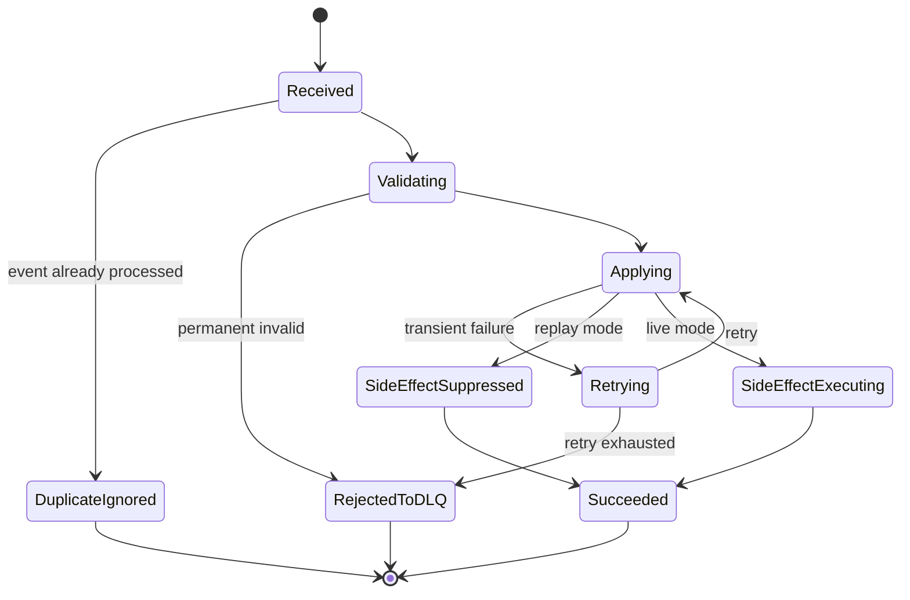

# Event Ordering, Replay, Schema Evolution, and Causation

> **Scope:** Part ini membahas correctness layer pada event-driven architecture: ordering, replay, schema evolution, event metadata, correlation/causation ID, aggregate sequence, consumer state, poison messages, dan production diagnostics.

> **Boundary note:** Materi ini membahas pola umum production-grade. Detail internal CSG seperti topic naming, schema registry, compatibility mode, event envelope, replay tooling, DLQ policy, dan observability convention harus diverifikasi di codebase, platform docs, dan onboarding session.

## 1. Why This Part Matters

Kafka membuat event bisa disimpan, dibaca ulang, dan diproses oleh banyak consumer. Itu kekuatannya. Tetapi kekuatan yang sama menciptakan failure mode baru:

- event diterima consumer dalam urutan yang benar secara partition, tetapi salah secara business expectation,
- event lama di-replay dan memicu side effect baru,
- producer mengubah schema dan consumer lama silently salah interpretasi,
- consumer baru membaca event historis yang tidak punya field baru,
- event duplicate terlihat seperti command baru,
- event A menyebabkan event B, tetapi trace tidak bisa menjelaskan hubungan kausalnya,
- DLQ penuh dengan poison message tanpa cara aman untuk reprocess,
- order terlihat `COMPLETED` di satu projection tetapi `IN_PROGRESS` di projection lain,
- operational dashboard tidak bisa menjawab "event mana yang membuat state ini berubah?".

Di sistem Quote & Order, event correctness bukan masalah infrastruktur saja. Ia mempengaruhi commercial correctness:

- quote approval event tidak boleh diproses setelah quote expired,
- order cancellation event tidak boleh menimpa fulfillment completion tanpa guard,
- price recalculation event tidak boleh mengubah accepted quote snapshot,
- catalog publish event tidak boleh membuat old quote menjadi invalid tanpa explicit policy,
- service order fallout event harus bisa dikaitkan ke product order item yang benar.

Core mental model:

> Kafka gives an ordered log per partition, not a globally ordered business universe.

## 2. Source Notes

Beberapa fakta publik yang relevan:

- Apache Kafka mendeskripsikan producer dan consumer sebagai fully decoupled; event disimpan di topic, dan consumer membaca event sesuai posisinya sendiri.
- Kafka menggunakan topic partition sebagai unit parallelism dan ordering. Ordering kuat berlaku di dalam satu partition, bukan lintas semua partition.
- Consumer offset adalah posisi consumer dalam partition log; pola commit offset menentukan at-most-once, at-least-once, atau exactly-once style processing.
- Confluent Schema Registry documentation menjelaskan schema compatibility seperti backward, forward, full, dan transitive compatibility; default compatibility-nya adalah `BACKWARD`.

Sumber publik:

- [Apache Kafka Documentation](https://kafka.apache.org/documentation/)
- [Confluent: Message Delivery Guarantees for Apache Kafka](https://docs.confluent.io/kafka/design/delivery-semantics.html)
- [Confluent: Schema Evolution and Compatibility](https://docs.confluent.io/platform/current/schema-registry/fundamentals/schema-evolution.html)

Gunakan sumber ini sebagai dasar konsep, bukan bukti implementasi internal CSG.

## 3. First Principle: Ordering Is a Design Choice

Ordering tidak terjadi secara otomatis di level business. Ordering adalah hasil dari pilihan:

- topic boundary,
- partition key,
- producer sequencing,
- event metadata,
- consumer idempotency,
- aggregate state guard,
- concurrency model di consumer,
- replay policy.

Jika event `OrderAccepted`, `OrderCancelled`, dan `OrderCompleted` berada pada partition berbeda, Kafka tidak memberi jaminan bahwa semua consumer akan melihat urutan business yang sama.

Jika semua event untuk satu `orderId` memakai partition key `orderId`, maka Kafka menjaga ordering per order pada topic tersebut. Tetapi trade-off-nya:

- satu order besar/hot bisa menjadi hot partition,
- event lintas aggregate seperti customer/account/catalog tetap tidak terurut relatif terhadap order,
- ordering antar topic tetap tidak dijamin,
- consumer masih bisa melakukan side effect duplicate karena crash sebelum offset commit.

Senior engineer harus selalu bertanya:

> Ordering untuk entity apa yang kita butuhkan, dan failure apa yang terjadi kalau event diproses out of order?

## 4. Ordering Scope in Quote & Order

### 4.1 Quote-Level Ordering

Biasanya event quote perlu terurut berdasarkan `quoteId`:

```text
QuoteCreated
QuoteConfigured
QuotePriced
QuoteApprovalRequested
QuoteApproved
QuoteAccepted
QuoteConvertedToOrder
```

Risiko jika out of order:

- `QuoteAccepted` diproses sebelum `QuoteApproved`,
- projection menampilkan quote accepted tetapi pricing belum final,
- downstream order creation menerima quote version yang salah,
- audit timeline membingungkan.

### 4.2 Order-Level Ordering

Event order biasanya perlu terurut berdasarkan `orderId`:

```text
OrderCreated
OrderValidated
OrderAccepted
OrderDecompositionStarted
OrderDecomposed
FulfillmentStarted
OrderItemCompleted
OrderCompleted
```

Risiko jika out of order:

- completion diproses sebelum decomposition diketahui,
- cancellation menimpa completion,
- order item state aggregate salah,
- read model menghitung progress secara keliru.

### 4.3 Order Item-Level Ordering

Untuk order besar, item-level event mungkin perlu partition key `orderItemId` atau `orderId`.

Trade-off:

| Partition key | Benefit | Risk |
|---|---|---|
| `orderId` | Semua event satu order terurut | Hot partition untuk order besar |
| `orderItemId` | Parallelism lebih baik | Parent order aggregation lebih kompleks |
| `customerId` | Customer-level sequencing | Hot customer, ordering terlalu luas |
| `tenantId` | Mudah tenant routing | Sangat rawan hot partition |

Rule of thumb:

> Partition by the smallest business aggregate that needs strict sequencing.

### 4.4 Catalog and Pricing Events

Catalog/pricing events sering punya scope berbeda:

```text
CatalogPublished
ProductOfferingChanged
PriceListPublished
AgreementPricingChanged
```

Event ini tidak bisa dianggap terurut dengan quote/order events kecuali didesain eksplisit.

Contoh failure:

```text
T1: Quote uses catalogVersion = C10
T2: CatalogPublished C11
T3: QuoteAccepted for quote snapshot C10
T4: Consumer receives CatalogPublished C11 first
T5: Consumer incorrectly reprices accepted quote using C11
```

Solusi bukan mencoba global ordering. Solusi adalah snapshot dan invariant:

```text
accepted quote uses captured catalogVersion and priceSnapshot
catalog publish does not mutate accepted quote economics
```

## 5. Event Envelope as a Contract

Event payload domain saja tidak cukup. Enterprise event harus punya envelope metadata.

Contoh envelope konseptual:

```json
{
  "eventId": "01HX...",
  "eventType": "OrderAccepted",
  "eventVersion": 3,
  "occurredAt": "2026-07-08T09:15:30.123Z",
  "publishedAt": "2026-07-08T09:15:31.001Z",
  "tenantId": "tenant-123",
  "aggregateType": "ProductOrder",
  "aggregateId": "ord-789",
  "aggregateVersion": 12,
  "correlationId": "corr-abc",
  "causationId": "cmd-submit-order-456",
  "producer": "order-service",
  "schemaId": "order-events-value-v3",
  "traceId": "...",
  "payload": {
    "orderId": "ord-789",
    "state": "ACCEPTED"
  }
}
```

Field yang penting:

| Field | Purpose |
|---|---|
| `eventId` | Dedupe event global |
| `eventType` | Routing dan behavior consumer |
| `eventVersion` | Payload evolution |
| `occurredAt` | Waktu business event terjadi |
| `publishedAt` | Waktu event dipublish |
| `tenantId` | Isolation dan observability |
| `aggregateId` | Business entity identity |
| `aggregateVersion` | Ordering guard per aggregate |
| `correlationId` | Mengelompokkan request/journey |
| `causationId` | Menjelaskan event/command penyebab |
| `producer` | Ownership/debugging |
| `schemaId` | Schema registry resolution |
| `traceId` | Distributed tracing |

Tanpa envelope kuat, replay dan forensic analysis menjadi tebak-tebakan.

## 6. Correlation ID vs Causation ID

Correlation ID menjawab:

> Event-event ini bagian dari journey yang sama?

Causation ID menjawab:

> Event ini terjadi karena command/event apa?

Contoh quote-to-order:

```text
HTTP POST /quotes/q1/accept
  correlationId = C-100
  commandId = AcceptQuoteCommand-1

QuoteAccepted
  correlationId = C-100
  causationId = AcceptQuoteCommand-1

CreateOrderCommand
  correlationId = C-100
  causationId = QuoteAccepted.eventId

OrderCreated
  correlationId = C-100
  causationId = CreateOrderCommand.commandId
```

Tanpa causation ID, kita hanya tahu beberapa event berada dalam journey sama. Kita tidak tahu rantai sebab-akibat.

Dalam incident, causation chain membantu menjawab:

- event mana yang memicu double order,
- retry mana yang membuat downstream call kedua,
- command mana yang membuat state illegal,
- apakah bug berasal dari API request, replay, operator action, atau scheduled job.

## 7. Aggregate Sequence and State Guard

Ordering Kafka per partition membantu. Tetapi domain state tetap harus punya guard.

Contoh event order dengan `aggregateVersion`:

```text
OrderCreated(version=1)
OrderAccepted(version=2)
OrderDecompositionStarted(version=3)
OrderCancelled(version=4)
```

Consumer projection bisa menyimpan versi terakhir:

```sql
CREATE TABLE order_projection (
  order_id text PRIMARY KEY,
  state text NOT NULL,
  last_aggregate_version bigint NOT NULL,
  updated_at timestamptz NOT NULL
);
```

Pseudo-code:

```java
void apply(OrderEvent event) {
    Projection current = repository.find(event.orderId());

    if (current != null && event.aggregateVersion() <= current.lastAggregateVersion()) {
        metrics.increment("event.stale_or_duplicate");
        return;
    }

    if (current != null && event.aggregateVersion() != current.lastAggregateVersion() + 1) {
        throw new GapDetectedException(event.orderId(), current.lastAggregateVersion(), event.aggregateVersion());
    }

    repository.apply(event);
}
```

Trade-off:

- Strict sequence guard mendeteksi gap, tetapi bisa membuat projection stuck jika event hilang atau belum tiba.
- Loose guard lebih available, tetapi bisa silently menerima state salah.

Untuk operational projection yang critical, gap detection biasanya lebih baik daripada silent corruption.

## 8. Out-of-Order Handling Strategies

### 8.1 Ignore Stale Events

Cocok untuk projection yang punya version guard.

```text
if event.version <= current.version: ignore
```

Benefit:

- sederhana,
- duplicate-safe,
- replay-friendly.

Risk:

- hanya aman jika event membawa aggregate version bermakna.

### 8.2 Buffer Until Gap Filled

Cocok jika urutan wajib lengkap.

```text
current = 5
incoming = 7
buffer 7 until 6 arrives
```

Benefit:

- menjaga correctness.

Risk:

- buffer leak,
- poison event menahan progress,
- perlu timeout dan operator tooling.

### 8.3 Re-read Source of Truth

Cocok untuk read model yang bisa diperbaiki dari source of truth.

```text
on suspicious event:
  fetch current order from order-service or DB replica
  rebuild projection for orderId
```

Benefit:

- recovery lebih mudah.

Risk:

- coupling ke source service,
- thundering herd saat replay besar,
- source-of-truth availability menjadi dependency.

### 8.4 Last-Write-Wins

Hati-hati. Ini sering terlihat praktis tetapi berbahaya.

```text
if event.occurredAt newer: overwrite
```

Masalah:

- clock skew,
- occurredAt bukan causal order,
- cancellation/completion bukan sekadar timestamp race,
- business transition tidak boleh dikalahkan timestamp.

Dalam Quote & Order, last-write-wins biasanya hanya aman untuk low-criticality read model, bukan lifecycle state.

## 9. Replay Is a Feature and a Threat

Kafka memungkinkan replay. Replay berguna untuk:

- rebuild projection,
- migrate consumer,
- recover from bug,
- load new analytics pipeline,
- verify historical behavior,
- backfill read model,
- audit reconstruction.

Tetapi replay berbahaya jika consumer tidak replay-safe.

Consumer replay-safe harus:

- tidak mengirim email/customer notification ulang kecuali explicit replay mode mengizinkan,
- tidak membuat external fulfillment request ulang tanpa idempotency key,
- tidak membuat order baru dari old quote event,
- tidak mengubah accepted quote snapshot berdasarkan schema baru,
- tidak menganggap `now()` sebagai waktu business event,
- tidak menjalankan compensation otomatis untuk historical failed events,
- punya guard untuk duplicate event ID dan aggregate version.

Rule:

> A replayed event must not produce a new irreversible side effect unless the replay job explicitly requests and audits that side effect.

## 10. Replay Modes

Tidak semua replay sama.

### 10.1 Projection Rebuild Replay

Tujuan:

- rebuild read model dari event log.

Side effects:

- hanya update projection table/index/cache.

Policy:

```text
external side effect disabled
notification disabled
outbound integration disabled
```

### 10.2 Recovery Replay

Tujuan:

- memproses ulang event yang gagal akibat bug yang sudah diperbaiki.

Side effects:

- bisa diaktifkan secara selektif.

Policy:

```text
scope = selected tenant/order/event range
idempotency required
operator approval required
```

### 10.3 Backfill Replay

Tujuan:

- mengisi field baru, projection baru, atau integration baru.

Side effects:

- biasanya hanya internal writes.

Policy:

```text
historical event compatibility required
new consumer must read all old schemas
```

### 10.4 Forensic Replay

Tujuan:

- memahami incident.

Side effects:

- tidak ada.

Policy:

```text
read-only environment
trace reconstruction
no write to production
```

## 11. Event Time vs Processing Time

Tiga waktu sering tercampur:

| Time | Meaning |
|---|---|
| `occurredAt` | Business event terjadi |
| `publishedAt` | Producer publish ke broker/outbox relay |
| `processedAt` | Consumer memproses event |

Contoh bug:

```java
orderProjection.setAcceptedAt(Instant.now());
```

Saat replay, acceptedAt berubah menjadi waktu replay. Itu salah.

Better:

```java
orderProjection.setAcceptedAt(event.occurredAt());
```

Processing time boleh dipakai untuk operational metric:

```text
event_lag = processedAt - occurredAt
publish_lag = publishedAt - occurredAt
consumer_lag = processedAt - publishedAt
```

## 12. Schema Evolution Is Not Just Adding Fields

Schema evolution di enterprise systems melibatkan:

- producer baru + consumer lama,
- producer lama + consumer baru,
- replay old events dengan consumer baru,
- multiple deployment modes,
- on-prem customer yang upgrade lambat,
- adapter customer-specific,
- analytics pipeline yang jarang diperbarui,
- audit replay beberapa tahun kemudian.

Compatibility bukan hanya apakah serializer berhasil decode. Compatibility juga semantic.

Contoh technically compatible but semantically breaking:

```json
{
  "state": "ACCEPTED"
}
```

Di v2, producer mengubah arti `ACCEPTED` dari:

```text
quote accepted by customer
```

menjadi:

```text
quote accepted by sales rep pending customer signature
```

Schema tidak berubah, tetapi consumer behavior rusak.

## 13. Compatibility Modes

Confluent Schema Registry menjelaskan beberapa compatibility mode:

| Mode | Meaning praktis |
|---|---|
| Backward | Consumer baru bisa membaca data lama |
| Forward | Consumer lama bisa membaca data baru |
| Full | Backward + forward |
| Transitive | Check terhadap semua versi sebelumnya, bukan hanya versi terakhir |
| None | Tidak ada guard compatibility |

Untuk event stream yang perlu replay dari awal, backward/transitive compatibility sangat penting.

Namun pilihan mode adalah engineering policy, bukan default yang harus diterima buta.

Checklist pemilihan:

- Apakah consumer harus bisa rewind ke beginning?
- Apakah customer on-prem bisa menjalankan consumer lama selama upgrade?
- Apakah ada generated consumer yang strict terhadap unknown fields?
- Apakah schema format Avro/Protobuf/JSON Schema?
- Apakah field baru punya default?
- Apakah enum expansion aman untuk consumer lama?
- Apakah delete field masih aman untuk analytics/audit consumer?

## 14. Schema Evolution Rules for Quote & Order Events

### 14.1 Add Optional Field

Biasanya aman.

```json
{
  "orderId": "o1",
  "state": "ACCEPTED",
  "salesChannel": "B2B_PORTAL"
}
```

Risk:

- consumer lama mengabaikan field,
- consumer baru harus handle missing field di historical events,
- optional field bisa menjadi required secara semantic tanpa schema enforcement.

### 14.2 Add Required Field

Berbahaya untuk replay old events.

Example:

```json
{
  "agreementId": "a1"
}
```

Jika old `QuoteAccepted` tidak punya `agreementId`, consumer baru harus punya default/backfill policy.

### 14.3 Rename Field

Biasanya breaking.

```text
customerId -> accountId
```

Better:

```text
add accountId
keep customerId deprecated
migrate consumers
remove much later only if safe
```

### 14.4 Change Enum Meaning

Sangat berbahaya.

```text
PENDING -> now means pending customer signature instead of pending approval
```

Better:

```text
PENDING_APPROVAL
PENDING_CUSTOMER_SIGNATURE
```

### 14.5 Split Event Type

Example:

```text
QuoteUpdated -> QuoteConfigured + QuotePriced + QuoteApprovalRequested
```

Risk:

- old consumers listen to broad event,
- new consumers expect fine-grained events,
- projection rebuild requires mapping.

Use transitional publishing if needed:

```text
publish new fine-grained events
also publish legacy event for old consumers
mark legacy event deprecated
monitor usage
remove only after migration
```

## 15. Event Type Design

Bad event:

```text
OrderUpdated
```

Why bad:

- unclear what changed,
- consumers need diff old/new state,
- authorization/audit meaning weak,
- replay behavior ambiguous.

Better:

```text
OrderAccepted
OrderCancelled
OrderItemFulfillmentStarted
OrderItemCompleted
OrderMovedToFallout
```

But too many hyper-specific events can also hurt:

```text
OrderItemCompletedBecauseFiberModemProvisioningSucceededAfterManualRetryV2
```

Good event types are:

- business meaningful,
- stable over time,
- not tied to UI button label,
- not too generic,
- not too implementation-specific,
- safe to subscribe to.

## 16. Command vs Event vs Notification

Do not mix these.

| Type | Meaning | Example |
|---|---|---|
| Command | Request to do something | `CreateServiceOrder` |
| Event | Fact that happened | `ServiceOrderCreated` |
| Notification | Inform someone/system | `CustomerEmailRequested` |

A command can fail or be rejected. An event should represent accepted fact.

Bad:

```text
OrderSubmittedEvent consumed by fulfillment, which treats it as command to fulfill
```

Better:

```text
OrderAccepted event observed by process manager
process manager emits CreateFulfillmentPlan command
fulfillment emits FulfillmentPlanCreated event
```

## 17. Poison Messages

Poison message adalah event yang selalu gagal diproses oleh consumer.

Penyebab:

- schema tidak kompatibel,
- payload invalid,
- missing reference data,
- business invariant violation,
- consumer bug,
- downstream dependency always rejects,
- tenant/customer configuration corrupted.

Anti-pattern:

```text
retry forever on same partition
```

Akibat:

- partition stuck,
- lag membesar,
- downstream event setelah poison tidak diproses,
- incident blast radius meningkat.

Better strategy:

1. classify error,
2. retry transient errors with backoff,
3. send permanent/unknown poison message to DLQ with full context,
4. alert if DLQ rate crosses threshold,
5. provide reprocess tooling after fix,
6. record audit for operator action.

DLQ message should include:

```json
{
  "originalTopic": "order-events",
  "partition": 12,
  "offset": 991233,
  "eventId": "...",
  "eventType": "OrderAccepted",
  "consumer": "billing-handoff-consumer",
  "failureClass": "SCHEMA_INCOMPATIBLE",
  "errorMessage": "missing required field agreementId",
  "failedAt": "...",
  "correlationId": "...",
  "causationId": "..."
}
```

## 18. Replay-Safe Consumer Design

A replay-safe consumer separates pure state update from side effects.

```java
public final class OrderAcceptedConsumer {
    private final ProcessedEventRepository processedEvents;
    private final OrderProjectionRepository projections;
    private final ExternalNotifier notifier;

    public void handle(EventEnvelope<OrderAccepted> envelope, ReplayMode replayMode) {
        if (!processedEvents.tryStart(envelope.eventId(), consumerName())) {
            return;
        }

        try {
            projections.applyAccepted(envelope.payload(), envelope.aggregateVersion(), envelope.occurredAt());

            if (replayMode.allowsExternalSideEffects()) {
                notifier.notifyOrderAccepted(
                    envelope.payload().orderId(),
                    envelope.eventId().toString()
                );
            }

            processedEvents.markSucceeded(envelope.eventId(), consumerName());
        } catch (Exception e) {
            processedEvents.markFailed(envelope.eventId(), consumerName(), e);
            throw e;
        }
    }
}
```

Design point:

- replay mode is explicit,
- duplicate detection is explicit,
- event time is used for business state,
- external side effect has idempotency key,
- failure is recorded.

## 19. Event Consumer State Machine

Consumer processing itself has lifecycle.



This is useful because consumer correctness is not just one function call. It is a mini workflow.

## 20. Rebuildable vs Non-Rebuildable Projections

Projection types:

| Projection | Rebuildable? | Notes |
|---|---:|---|
| Order status read model | Usually yes | Rebuild from order events |
| Audit trail | No/append-only | Should not be rebuilt destructively |
| External notification history | No | Represents sent communication |
| Search index | Yes | Reindex/replay allowed |
| Billing handoff record | Usually no | Financial integration side effect |
| Operational dashboard | Yes | Can rebuild from events/metrics |

Rule:

> Never treat irreversible side effects as rebuildable projections.

## 21. Java Event Envelope Model

Example Java record:

```java
public record EventEnvelope<T>(
    UUID eventId,
    String eventType,
    int eventVersion,
    Instant occurredAt,
    Instant publishedAt,
    String tenantId,
    String aggregateType,
    String aggregateId,
    long aggregateVersion,
    String correlationId,
    String causationId,
    String producer,
    T payload
) {
    public EventEnvelope {
        Objects.requireNonNull(eventId);
        Objects.requireNonNull(eventType);
        Objects.requireNonNull(occurredAt);
        Objects.requireNonNull(tenantId);
        Objects.requireNonNull(aggregateId);
        if (aggregateVersion <= 0) {
            throw new IllegalArgumentException("aggregateVersion must be positive");
        }
    }
}
```

Keep envelope validation strict. Payload validation can be version-aware.

## 22. PostgreSQL Tables for Consumer Idempotency and Projection Guard

```sql
CREATE TABLE processed_event (
  consumer_name text NOT NULL,
  event_id uuid NOT NULL,
  status text NOT NULL,
  first_seen_at timestamptz NOT NULL DEFAULT now(),
  last_attempt_at timestamptz NOT NULL DEFAULT now(),
  failure_class text,
  failure_message text,
  PRIMARY KEY (consumer_name, event_id)
);
```

```sql
CREATE TABLE order_status_projection (
  tenant_id text NOT NULL,
  order_id text NOT NULL,
  state text NOT NULL,
  last_aggregate_version bigint NOT NULL,
  last_event_id uuid NOT NULL,
  updated_from_event_at timestamptz NOT NULL,
  updated_at timestamptz NOT NULL DEFAULT now(),
  PRIMARY KEY (tenant_id, order_id)
);
```

Apply event with version guard:

```sql
UPDATE order_status_projection
SET state = #{state},
    last_aggregate_version = #{eventVersion},
    last_event_id = #{eventId},
    updated_from_event_at = #{occurredAt},
    updated_at = now()
WHERE tenant_id = #{tenantId}
  AND order_id = #{orderId}
  AND last_aggregate_version = #{expectedPreviousVersion};
```

If updated rows = 0, classify:

- duplicate/stale,
- gap,
- missing projection,
- cross-tenant issue,
- bug.

Do not just ignore blindly.

## 23. MyBatis Mapper Shape

```java
@Mapper
public interface OrderProjectionMapper {
    int insertInitial(OrderProjectionRow row);

    int updateIfPreviousVersionMatches(
        @Param("tenantId") String tenantId,
        @Param("orderId") String orderId,
        @Param("expectedPreviousVersion") long expectedPreviousVersion,
        @Param("newVersion") long newVersion,
        @Param("state") String state,
        @Param("eventId") UUID eventId,
        @Param("occurredAt") Instant occurredAt
    );

    OrderProjectionRow findById(
        @Param("tenantId") String tenantId,
        @Param("orderId") String orderId
    );
}
```

Mapper harus membuat concurrency/ordering explicit, bukan menyembunyikan update unconditional.

Bad:

```sql
UPDATE order_status_projection SET state = #{state} WHERE order_id = #{orderId}
```

Why bad:

- no tenant guard,
- no version guard,
- no event provenance,
- stale event can overwrite newer state.

## 24. Detecting Causal Loops

Event-driven systems bisa membuat loop:

```text
OrderUpdated -> PricingProjectionUpdated -> OrderRepriceRequested -> OrderUpdated -> ...
```

Loop detection signals:

- same aggregate receives too many events in short window,
- correlation ID appears in repeating pattern,
- causation chain includes same event type cycle,
- consumer lag grows after deploy,
- outbox publish rate spikes without user traffic spike.

Preventive controls:

- command/event separation,
- state transition guard,
- idempotency key,
- causation ID,
- max workflow step count,
- process manager state machine,
- circuit breaker for internal event feedback.

## 25. Event Naming and Ownership

Every event should have an owner.

```text
order-service owns OrderAccepted
quote-service owns QuoteAccepted
catalog-service owns CatalogPublished
fulfillment-orchestrator owns FulfillmentPlanCreated
```

Ownership means:

- schema lifecycle,
- compatibility promises,
- semantic documentation,
- deprecation plan,
- producer correctness,
- consumer communication,
- incident response.

An unowned event is production debt.

## 26. Observability for Event Correctness

Minimum metrics:

```text
event_consume_total{consumer,eventType,status}
event_process_duration_seconds{consumer,eventType}
event_stale_total{consumer,eventType}
event_gap_detected_total{consumer,eventType}
event_dlq_total{consumer,eventType,failureClass}
event_replay_total{consumer,eventType,replayMode}
event_schema_error_total{consumer,eventType}
consumer_lag_records{topic,partition,consumerGroup}
event_publish_lag_seconds{producer,eventType}
event_end_to_end_lag_seconds{consumer,eventType}
```

Minimum log fields:

```text
eventId
correlationId
causationId
tenantId
aggregateId
aggregateVersion
topic
partition
offset
consumerGroup
schemaVersion
replayMode
```

Dashboard questions:

- Which consumers are lagging?
- Which event types are failing?
- Are we seeing stale/duplicate/gap spikes?
- Which tenants are affected?
- Are DLQ entries increasing after deploy?
- What is publish-to-process latency for order lifecycle events?

## 27. Testing Strategy

### 27.1 Ordering Tests

```text
Given projection version = 3
When event version = 2 arrives
Then event is ignored as stale
And metric stale_event increments
```

```text
Given projection version = 3
When event version = 5 arrives
Then gap is detected
And event is not applied
```

### 27.2 Replay Tests

```text
Given replay mode = PROJECTION_REBUILD
When OrderAccepted is replayed
Then projection is updated
And external notification is not sent
```

### 27.3 Schema Compatibility Tests

```text
Given historical OrderAccepted v1 event
When consumer v3 reads it
Then missing optional fields are defaulted safely
```

### 27.4 Poison Message Tests

```text
Given invalid event payload
When consumer processes it
Then event is routed to DLQ
And partition processing continues
```

### 27.5 Causation Tests

```text
Given AcceptQuoteCommand
When QuoteAccepted and CreateOrderCommand are emitted
Then causation chain is preserved
```

## 28. Internal Verification Checklist

Verify these in CSG/internal context:

- Event envelope standard.
- Required metadata fields.
- Topic naming convention.
- Partition key strategy per topic.
- Event schema format: Avro, Protobuf, JSON Schema, or JSON only.
- Schema registry usage.
- Compatibility mode per subject/topic.
- Event versioning convention.
- Correlation ID propagation.
- Causation ID propagation.
- Aggregate sequence/version field.
- Consumer idempotency table/pattern.
- Replay tooling.
- Replay approval process.
- DLQ topic/policy.
- Poison message reprocess workflow.
- Consumer lag dashboard.
- Schema compatibility CI gate.
- Event ownership registry.
- Historical event retention period.
- Event compaction/retention policy.
- Cross-tenant event isolation.

## 29. PR Review Checklist

For any PR changing event production/consumption, ask:

- Does this event represent a fact, command, or notification?
- Is the event name business meaningful and stable?
- What is the partition key?
- What ordering guarantee is required?
- What happens if this event is duplicated?
- What happens if this event arrives late?
- What happens if this event is replayed one year later?
- Does the event carry aggregate version or sequence?
- Does the consumer use version guard?
- Does the consumer use event time, not processing time, for business state?
- Is schema evolution backward-compatible for historical replay?
- Are enum changes safe for old consumers?
- Are correlation and causation IDs preserved?
- Are metrics/logs sufficient for incident investigation?
- Is DLQ behavior explicit?
- Is replay mode explicit?
- Are external side effects protected by idempotency?

## 30. Senior Engineer Mental Model

A junior view of Kafka:

> We publish events and consumers react.

A senior view:

> We maintain durable business facts under partial failure, replay, schema drift, duplicate delivery, changing consumers, and ambiguous causality.

A principal-level review asks:

- What is the business ordering requirement?
- Where is it enforced?
- How do we prove replay safety?
- What is the compatibility promise?
- How do we trace causality across services?
- How do we repair a corrupted projection?
- How do we prevent replay from creating external side effects?
- Who owns this event contract?

## 31. Practical Exercise

Choose one event in the internal codebase, preferably related to quote/order state.

Create a one-page review:

```text
Event name:
Producer:
Consumers:
Topic:
Partition key:
Schema version:
Compatibility mode:
Aggregate ID:
Aggregate version:
Correlation ID:
Causation ID:
Replay-safe? yes/no
External side effects? yes/no
Duplicate handling:
Out-of-order handling:
DLQ handling:
Observability fields:
Known risks:
Recommended improvements:
```

The goal is not to criticize the system. The goal is to learn where correctness is enforced and where it is assumed.

## 32. Key Takeaways

- Kafka gives ordering per partition, not global business ordering.
- Partition key is a business correctness decision, not only scalability tuning.
- Replay is valuable only when consumers are replay-safe.
- Schema compatibility is both technical and semantic.
- Correlation ID groups a journey; causation ID explains why an event happened.
- Aggregate version protects projections from stale/out-of-order updates.
- DLQ is not a trash bin; it is an operational workflow.
- Event contracts need owners, compatibility tests, observability, and deprecation policy.

Next part: using sagas and process managers to coordinate long-running quote-to-order-to-fulfillment workflows without pretending distributed transactions exist.
