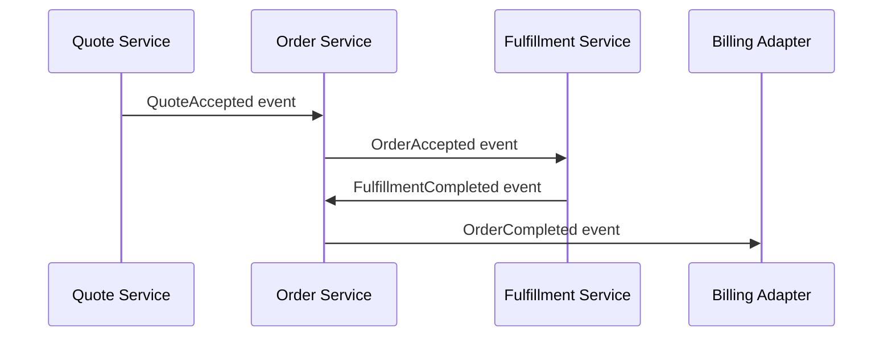
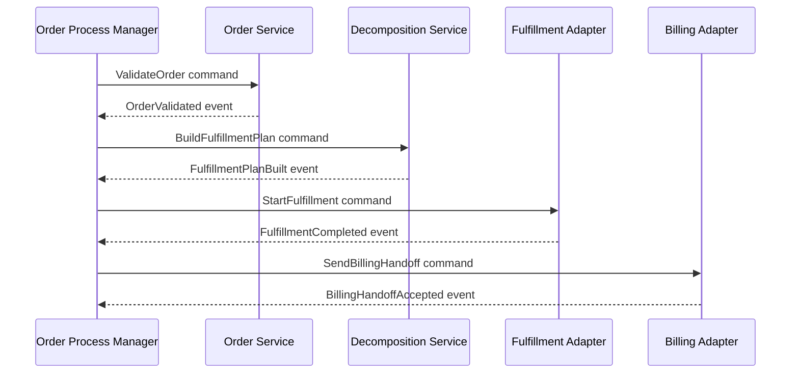
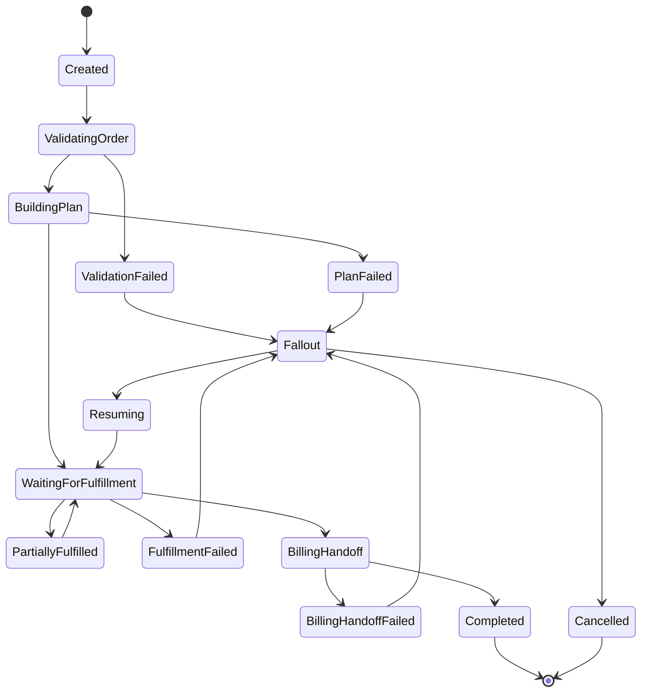

# Sagas, Process Managers, and Long-Running Business Transactions

> **Scope:** Part ini membahas bagaimana mengelola business transaction yang melewati banyak service, database, Kafka topic, downstream fulfillment, manual fallout, dan external systems tanpa 2PC/distributed transaction.

> **Boundary note:** Materi ini membahas pola umum. Detail internal CSG seperti workflow engine, process manager implementation, saga state table, orchestration/choreography choice, retry/fallout policy, dan compensation semantics harus diverifikasi di codebase serta dokumentasi internal.

## 1. Why This Part Matters

Quote-to-cash bukan satu transaction database. Ia adalah rangkaian tindakan:

```text
accept quote
create product order
validate order
reserve/confirm pricing snapshot
check customer/account/agreement
check installed base
create decomposition plan
create service orders
send fulfillment requests
receive fulfillment updates
update product inventory
handoff to billing
complete order
```

Tidak ada satu database transaction yang bisa membungkus semua langkah ini secara aman dan realistis.

Di enterprise/telco systems, langkah-langkah ini bisa berlangsung:

- detik,
- menit,
- jam,
- hari,
- melibatkan human fallout,
- melibatkan customer-specific downstream,
- melibatkan retry setelah incident,
- melibatkan amendment/cancellation saat proses masih berjalan.

Jika kita memaksakan mental model ACID transaction end-to-end, desain akan rapuh. Yang dibutuhkan adalah workflow consistency.

Core mental model:

> A long-running business transaction is a durable state machine, not a long database transaction.

## 2. Source Notes

Beberapa konsep publik yang relevan:

- Saga pattern digunakan untuk transaction yang span beberapa service/database ketika local ACID transaction saja tidak cukup dan 2PC bukan pilihan praktis.
- Dalam saga, setiap step adalah local transaction yang update database dan publish message/event; jika business rule gagal, saga mengeksekusi compensating transaction yang dirancang eksplisit.
- Saga coordination biasanya dibagi menjadi choreography dan orchestration.
- Kafka delivery semantics dan offset behavior membuat idempotency, outbox, dan replay safety tetap menjadi bagian penting dalam saga implementation.

Sumber publik:

- [Microservices.io: Saga Pattern](https://microservices.io/patterns/data/saga.html)
- [Confluent: Message Delivery Guarantees for Apache Kafka](https://docs.confluent.io/kafka/design/delivery-semantics.html)
- [Apache Kafka Documentation](https://kafka.apache.org/documentation/)

Gunakan sumber ini sebagai konsep umum, bukan bukti implementation internal CSG.

## 3. What Is a Saga?

Saga adalah rangkaian local transaction yang bersama-sama menyelesaikan business transaction yang lebih besar.

Setiap local transaction:

1. membaca state lokal,
2. memvalidasi invariant lokal,
3. mengubah database lokal,
4. mempublish event atau command,
5. melanjutkan workflow.

Jika step gagal karena business rule atau irreversible downstream condition, saga tidak otomatis rollback seperti ACID. Kita perlu explicit compensation atau recovery.

Example konseptual:

```text
QuoteAccepted
  -> CreateProductOrder
  -> ValidateProductOrder
  -> DecomposeOrder
  -> CreateServiceOrders
  -> StartFulfillment
  -> UpdateInventory
  -> SendBillingHandoff
  -> CompleteOrder
```

Jika `CreateServiceOrders` gagal, tidak ada magic rollback untuk `QuoteAccepted`. Kita harus menentukan:

- apakah order masuk fallout,
- apakah quote tetap accepted,
- apakah customer perlu diberi status,
- apakah cancellation otomatis dibuat,
- apakah compensation diperlukan,
- apakah human operator harus menyelesaikan.

## 4. Saga Is Not Just Retry

Retry menjawab:

> Langkah yang sama gagal transient; boleh dicoba lagi?

Saga menjawab:

> Business process multi-step ini sekarang berada di state apa, step berikutnya apa, dan bagaimana jika step tertentu gagal permanen atau tidak diketahui?

Retry adalah mekanisme. Saga adalah model proses.

Bad design:

```text
submit order
call service A
call service B
call service C
if anything fails, retry method
```

Problems:

- state progress tidak durable,
- crash membuat workflow lupa sudah sampai mana,
- duplicate downstream call,
- tidak ada human fallout,
- tidak ada compensation,
- tidak ada observability step-level,
- timeout tidak jelas,
- cancellation sulit.

Better:

```text
persist saga instance
persist current step
execute one step transactionally
publish command/event via outbox
advance state only after explicit outcome
retry/resume based on persisted state
```

## 5. Process Manager vs Choreography

### 5.1 Choreography

Dalam choreography, services bereaksi terhadap event satu sama lain.



Benefit:

- loose coupling,
- services autonomous,
- easy to add observers,
- no central coordinator bottleneck.

Risk:

- process logic tersebar,
- sulit memahami end-to-end state,
- causal loop lebih mudah terjadi,
- failure recovery tidak jelas,
- timeout/cancellation sulit,
- ordering assumptions tersembunyi.

Choreography cocok untuk:

- simple event reaction,
- low-criticality side projections,
- analytics/read model,
- notification/observer pattern,
- proses yang tidak butuh central decision.

### 5.2 Orchestration / Process Manager

Dalam orchestration, process manager menyimpan state workflow dan mengirim command ke participant.



Benefit:

- workflow state explicit,
- easier timeout/retry/cancel,
- easier operator visibility,
- central place for business process invariant,
- easier to answer "where is this order stuck?".

Risk:

- coordinator can become god service,
- more coupling to participant commands,
- process manager availability becomes important,
- workflow definition can become too procedural,
- over-orchestration reduces autonomy.

Orchestration cocok untuk:

- order fulfillment,
- cancellation workflow,
- amendment workflow,
- billing handoff with strict checkpoint,
- processes needing human fallout/retry/resume,
- high-value enterprise transaction.

## 6. Choosing Choreography or Orchestration

Use this decision table:

| Question | Prefer choreography | Prefer orchestration |
|---|---|---|
| Need central visibility of workflow? | No | Yes |
| Need timeout management? | Minimal | Strong |
| Need cancellation/amendment? | Simple | Complex |
| Need compensation? | Rare | Common |
| Need human fallout? | Rare | Common |
| Number of steps | Few | Many |
| Failure blast radius | Low | High |
| Business value per transaction | Low/medium | High |
| Customer support needs step-level status? | No | Yes |

For Quote & Order, pure choreography is often risky for fulfillment-critical flows. But pure orchestration for every small event can create over-centralization.

Pragmatic approach:

```text
Use orchestration for core lifecycle control.
Use choreography for projections, notifications, analytics, and secondary integrations.
```

## 7. Saga State Machine

Saga should be represented as explicit states.

Example order fulfillment saga:



Important properties:

- states are business meaningful,
- each transition has actor/cause,
- each transition is audited,
- each step has timeout policy,
- each failure class maps to retry/fallout/cancel,
- terminal states are explicit.

## 8. Saga Instance Data Model

Saga state should be durable.

```sql
CREATE TABLE order_saga_instance (
  tenant_id text NOT NULL,
  saga_id uuid NOT NULL,
  order_id text NOT NULL,
  saga_type text NOT NULL,
  state text NOT NULL,
  current_step text NOT NULL,
  version bigint NOT NULL,
  correlation_id text NOT NULL,
  started_at timestamptz NOT NULL,
  updated_at timestamptz NOT NULL,
  timeout_at timestamptz,
  last_event_id uuid,
  failure_class text,
  failure_message text,
  PRIMARY KEY (tenant_id, saga_id),
  UNIQUE (tenant_id, order_id, saga_type)
);
```

Step history:

```sql
CREATE TABLE order_saga_step_history (
  tenant_id text NOT NULL,
  saga_id uuid NOT NULL,
  step_sequence bigint NOT NULL,
  step_name text NOT NULL,
  step_state text NOT NULL,
  command_id uuid,
  caused_by_event_id uuid,
  started_at timestamptz NOT NULL,
  completed_at timestamptz,
  failure_class text,
  failure_message text,
  PRIMARY KEY (tenant_id, saga_id, step_sequence)
);
```

This allows support and engineering to answer:

- where is the order stuck,
- what step failed,
- which event/command caused it,
- when timeout started,
- whether retry is safe,
- what manual action happened.

## 9. Process Manager Command Handling

A process manager should not do all work in one transaction. It should advance one durable step at a time.

```java
public final class OrderFulfillmentProcessManager {
    private final SagaRepository sagaRepository;
    private final Outbox outbox;

    @Transactional
    public void on(OrderAccepted event) {
        Saga saga = sagaRepository.startIfAbsent(
            event.tenantId(),
            event.orderId(),
            event.correlationId(),
            event.eventId()
        );

        if (!saga.canStartValidation()) {
            return;
        }

        Command command = ValidateOrderCommand.from(event, saga.nextCommandId());

        saga.moveTo("VALIDATING_ORDER", command.commandId(), event.eventId());
        sagaRepository.save(saga);
        outbox.publish(command);
    }
}
```

Key principles:

- idempotent start,
- durable saga state,
- command published via outbox,
- causation preserved,
- no direct remote call inside same transaction if avoidable,
- state changes are guarded.

## 10. Step Outcome Handling

```java
@Transactional
public void on(OrderValidated event) {
    Saga saga = sagaRepository.findByOrderId(event.tenantId(), event.orderId());

    if (saga.alreadyHandled(event.eventId())) {
        return;
    }

    if (!saga.isWaitingFor("ORDER_VALIDATED")) {
        saga.recordUnexpectedEvent(event.eventId(), event.eventType());
        return;
    }

    Command command = BuildFulfillmentPlanCommand.from(event, saga.nextCommandId());

    saga.moveTo("BUILDING_PLAN", command.commandId(), event.eventId());
    sagaRepository.save(saga);
    outbox.publish(command);
}
```

Unexpected event handling matters. Do not ignore silently.

Classify:

- duplicate,
- stale,
- valid but late,
- invalid for current state,
- event from wrong tenant/order,
- event from unknown saga,
- potential bug.

## 11. Compensation Is Not Rollback

ACID rollback restores previous database state. Saga compensation is a new business action that semantically offsets a prior action.

Example:

```text
Reserve resource -> Release resource
Create service order -> Cancel service order
Send billing handoff -> Send reversal/correction
Mark order item in progress -> Move item to fallout/cancelled
```

Some actions are not compensatable:

- customer notification already sent,
- external installation appointment already scheduled,
- physical work already performed,
- billing already invoiced,
- regulatory/audit record already created.

Therefore compensation requires domain-specific design.

Bad language:

```text
rollback fulfillment
```

Better:

```text
issue cancellation request to fulfillment system
wait for cancellation outcome
record cancellation acceptance/rejection
update order item based on result
```

## 12. Compensation Matrix

For each step, define:

| Step | Forward action | Possible failure | Compensation | Manual fallout? |
|---|---|---|---|---|
| Validate order | Mark order valid | Rule violation | Reject order / fallout | Sometimes |
| Build plan | Create decomposition plan | Missing mapping | Fallout | Yes |
| Create service order | Submit service order | Downstream rejects | Fix mapping/retry | Yes |
| Start fulfillment | Activate service | Timeout/unknown | Query downstream status | Yes |
| Update inventory | Persist product instance | DB conflict | Retry/reconcile | Rare |
| Billing handoff | Send billing record | Rejected duplicate | Correct/retry/reverse | Yes |

The matrix should live near design docs/runbooks, not only in someone's head.

## 13. Timeout and Unknown Outcome

Timeout does not mean failure.

Example:

```text
send CreateServiceOrder command
no response within 5 minutes
```

Possible realities:

- downstream never received it,
- downstream received and succeeded but response lost,
- downstream received and still processing,
- downstream received and failed,
- downstream created duplicate due retry,
- adapter crashed after receiving response but before publishing event.

Safe timeout handling often requires inquiry/reconciliation:

```text
on timeout:
  query downstream by idempotency key / external reference
  if found success: mark step succeeded
  if found failed: classify failure
  if not found: retry create with same idempotency key
  if ambiguous: move to fallout
```

## 14. Idempotency Keys in Sagas

Every irreversible step needs stable idempotency key.

Bad:

```text
new UUID every retry
```

Good:

```text
commandId stable per saga step attempt where duplicate should collapse
externalRequestId = tenantId + orderId + stepName + stepSequence
```

Example:

```text
externalRequestId = tenant-1:order-123:create-service-order:item-10:v1
```

Retry with same idempotency key lets downstream return same result or reject duplicate safely.

But if a new attempt should create a genuinely new business action, use a new key and record why.

## 15. Saga Versioning and Optimistic Locking

Process manager can receive events concurrently:

```text
FulfillmentCompleted event
CancellationRequested event
Timeout job fires
Operator retries step
```

Use version guard:

```sql
UPDATE order_saga_instance
SET state = #{newState},
    current_step = #{newStep},
    version = version + 1,
    updated_at = now()
WHERE tenant_id = #{tenantId}
  AND saga_id = #{sagaId}
  AND version = #{expectedVersion};
```

If update count = 0:

- reload saga,
- re-evaluate event against new state,
- do not blindly retry same transition.

## 16. Cancellation During Saga

Cancellation is not simply setting state to `CANCELLED`.

If order is still captured:

```text
cancel locally
```

If decomposition already happened:

```text
cancel decomposition plan or mark no further dispatch
```

If service orders sent:

```text
send cancellation to service order system
wait for cancellation outcome
```

If fulfillment completed:

```text
cancellation may become disconnect/cease/amendment flow
```

If billing handoff done:

```text
send billing correction/reversal if domain allows
```

Cancellation must be state-aware and step-aware.

## 17. Amendment During Saga

Amendment is harder than cancellation because it introduces a new desired state while old work may be in progress.

Possible strategies:

### 17.1 Reject Amendment While In-Flight

Simple and safe.

```text
cannot amend order while fulfillment in progress
```

Trade-off:

- less flexible,
- operationally simpler.

### 17.2 Queue Amendment Until Stable State

```text
record amendment request
complete or pause current saga
start amendment saga
```

Trade-off:

- better UX,
- needs clear pending state.

### 17.3 Dynamic Replanning

```text
compare current fulfillment progress with new desired order
cancel/add/modify remaining tasks
```

Trade-off:

- powerful,
- complex,
- high correctness risk.

Senior engineer should not accept dynamic replanning without strong invariants, tests, observability, and manual recovery.

## 18. Human Fallout as First-Class State

In enterprise/telco systems, human intervention is not failure of automation. It is part of the product.

Fallout record should include:

```text
falloutId
orderId
orderItemId
sagaId
stepName
failureClass
failureMessage
recommendedAction
allowedActions
assignedQueue
priority
customerImpact
createdAt
SLA/age
correlationId
causationId
```

Allowed operator actions should be commands:

```text
RetryStep
SkipStepWithApproval
MarkExternalStepSucceeded
RequestCancellation
UpdateReferenceDataAndResume
EscalateToEngineering
```

Operator actions must be audited.

Bad:

```text
operator manually edits DB state
```

Better:

```text
operator invokes controlled command with reason, approval, and audit trail
```

## 19. Saga Observability

Minimum metrics:

```text
saga_started_total{sagaType,tenant}
saga_completed_total{sagaType,tenant}
saga_failed_total{sagaType,tenant,failureClass}
saga_fallout_total{sagaType,tenant,stepName,failureClass}
saga_step_duration_seconds{sagaType,stepName}
saga_age_seconds{sagaType,state}
saga_timeout_total{sagaType,stepName}
saga_retry_total{sagaType,stepName}
saga_unexpected_event_total{sagaType,eventType,state}
```

Minimum logs:

```text
sagaId
sagaType
state
stepName
orderId
orderItemId
commandId
eventId
correlationId
causationId
tenantId
attempt
failureClass
```

Dashboard questions:

- How many orders are stuck by step?
- Which failure class dominates fallout?
- What is the median/p95 duration per step?
- Which tenant/customer has abnormal fallout rate?
- Did a deploy increase timeout or unexpected events?
- Are retries resolving issues or just cycling?

## 20. Saga and Outbox

Saga state update and command publish must be atomic from local service perspective.

Bad:

```java
saga.moveTo("BUILDING_PLAN");
sagaRepository.save(saga);
kafkaTemplate.send(command);
```

Failure window:

- DB commit succeeds,
- process crashes before Kafka send,
- saga stuck forever unless repair job detects missing command.

Better:

```java
@Transactional
void advanceSaga(...) {
    saga.moveTo("BUILDING_PLAN");
    sagaRepository.save(saga);
    outbox.save(command);
}
```

Outbox relay publishes after commit.

Still need:

- outbox lag monitoring,
- relay idempotency,
- command dedupe by command ID,
- repair process for stuck outbox.

## 21. Saga and Inbox / Processed Events

A process manager consumes events. It must be idempotent.

```sql
CREATE TABLE saga_processed_event (
  tenant_id text NOT NULL,
  saga_id uuid NOT NULL,
  event_id uuid NOT NULL,
  processed_at timestamptz NOT NULL DEFAULT now(),
  PRIMARY KEY (tenant_id, saga_id, event_id)
);
```

Do not rely only on Kafka offset. Rebalance/retry/replay can deliver event again.

## 22. Eventual Consistency and User Experience

The UI/support view must communicate workflow truth.

Bad UI status:

```text
Order submitted
```

Better:

```text
Order accepted. Fulfillment plan is being built.
```

Better support view:

```text
Order: O-123
State: IN_PROGRESS
Current workflow: Service fulfillment
Step: Waiting for service order completion
Last successful event: ServiceOrderCreated
Blocked by: none
Age in current step: 14m
Retry count: 0
Correlation ID: C-100
```

Users do not need every technical detail, but support/ops needs enough state to explain progress and diagnose stuck workflows.

## 23. Choreography Failure Example

Pure choreography:

```text
OrderAccepted -> DecompositionService creates plan
PlanCreated -> FulfillmentService sends service orders
ServiceOrderCreated -> InventoryService reserves product instance
InventoryReserved -> BillingAdapter prepares handoff
```

Failure:

```text
BillingAdapter misses InventoryReserved due schema issue
No central workflow knows billing handoff is missing
Order projection says fulfilled
Billing never starts
Customer receives service but not billed
```

Mitigation:

- central process manager for critical workflow,
- reconciliation checking fulfilled orders without billing handoff,
- DLQ alerting,
- business health dashboard,
- completion invariant includes billing handoff accepted if required.

## 24. Orchestration Failure Example

Over-centralized process manager:

```text
Process manager knows every field of every participant
Every domain change requires process manager update
Process manager becomes bottleneck and god service
```

Mitigation:

- commands should be intention-based, not implementation-specific,
- participant owns local validation,
- process manager owns workflow, not all domain rules,
- use well-defined outcomes,
- avoid leaking participant persistence model into saga.

## 25. Process Manager Boundary

Process manager should own:

- workflow state,
- next step selection,
- timeout policy,
- retry/resume command,
- compensation coordination,
- fallout transition,
- correlation/causation propagation.

Process manager should not own:

- catalog rule evaluation internals,
- pricing calculation internals,
- service activation technical details,
- billing ledger semantics,
- customer master data,
- UI-specific display logic.

Boundary rule:

> The process manager coordinates decisions between domains; it should not become the domain model for every domain.

## 26. Saga Testing Strategy

### 26.1 State Transition Tests

```text
Given saga state = VALIDATING_ORDER
When OrderValidated event arrives
Then saga moves to BUILDING_PLAN
And BuildFulfillmentPlan command is emitted
```

### 26.2 Idempotency Tests

```text
Given OrderValidated event already processed
When same event arrives again
Then no duplicate BuildFulfillmentPlan command is emitted
```

### 26.3 Timeout Tests

```text
Given saga waiting for service order response
When timeout fires
Then inquiry command is emitted before retrying create
```

### 26.4 Compensation Tests

```text
Given service order created and billing handoff fails permanently
When compensation policy is triggered
Then cancellation/correction command is emitted according to matrix
```

### 26.5 Concurrency Tests

```text
Given cancellation requested and fulfillment completed arrive concurrently
When both are processed
Then exactly one legal transition wins
And loser is re-evaluated against new state
```

### 26.6 Fallout Tests

```text
Given plan build fails due missing catalog mapping
When failure is classified permanent
Then saga moves to Fallout
And fallout record has recommended action
```

## 27. Testcontainers Scenario

A useful integration test can run:

- PostgreSQL for saga state/outbox,
- Kafka for commands/events,
- fake downstream service,
- process manager consumer,
- outbox relay.

Scenario:

```text
1. Publish OrderAccepted.
2. Process manager creates saga and emits ValidateOrder command.
3. Fake order service emits OrderValidated.
4. Process manager emits BuildFulfillmentPlan command.
5. Fake decomposition service emits PlanBuilt.
6. Process manager emits StartFulfillment command.
7. Fake fulfillment delays response.
8. Timeout job emits inquiry command.
9. Fake fulfillment returns success by idempotency key.
10. Saga completes.
```

Assertions:

- one saga instance,
- expected step history,
- no duplicate commands,
- correct correlation/causation IDs,
- outbox drained,
- metrics emitted,
- replay duplicate does not change final state.

## 28. Operational Runbook Shape

A runbook for stuck saga should include:

```text
Symptom:
  Order stuck in WAITING_FOR_FULFILLMENT for > SLA.

Check:
  - saga state table
  - step history
  - outbox lag
  - Kafka consumer lag
  - DLQ for relevant consumer
  - downstream request by externalRequestId
  - correlation trace

Classify:
  - downstream success response lost
  - downstream still processing
  - downstream rejected
  - adapter bug
  - event schema issue
  - data/config issue

Actions:
  - retry inquiry
  - retry step with same idempotency key
  - move to fallout
  - execute controlled operator command
  - escalate to engineering

Do not:
  - manually update order state without audit
  - create new external request with random id
  - skip billing handoff without approval
```

## 29. Internal Verification Checklist

Verify these internally:

- Is there a process manager/workflow engine?
- Which flows use orchestration vs choreography?
- Where is saga state persisted?
- What are saga states and transitions?
- Is there a state diagram for order fulfillment?
- How are command IDs generated?
- How is idempotency enforced per step?
- Is outbox used for command/event publishing?
- Is inbox/processed event used for consumers?
- How are timeouts implemented?
- Is there a scheduler for timeout/retry?
- What failure classes exist?
- How is fallout represented?
- What operator actions are allowed?
- How are manual actions audited?
- How is cancellation handled in each fulfillment stage?
- How is amendment handled while fulfillment is in flight?
- Is compensation matrix documented?
- How do dashboards show stuck orders?
- What runbooks exist for stuck workflows?
- What historical incidents involved saga/workflow failure?

## 30. PR Review Checklist

For any PR touching long-running workflow, ask:

- What saga/process state is introduced or changed?
- Is the transition legal from all current states?
- What happens if the event is duplicated?
- What happens if the event arrives late?
- What happens if cancellation arrives concurrently?
- What happens if timeout fires while success event arrives?
- Is command publish atomic with saga state update?
- Is idempotency key stable across retry?
- Is compensation defined for irreversible steps?
- Is failure classification explicit?
- Is fallout path defined?
- Are operator actions audited?
- Are correlation and causation IDs preserved?
- Are metrics/logs sufficient to find stuck workflows?
- Are tests covering retry, timeout, duplicate, concurrency, and compensation?
- Does this PR increase process manager coupling to participant internals?

## 31. Anti-Patterns

### 31.1 Long Synchronous Chain

```text
API request waits for all downstream fulfillment to finish
```

Bad because:

- timeout risk,
- poor user experience,
- no durable progress,
- hard recovery.

### 31.2 Hidden Workflow in Consumer Methods

```java
onEvent() calls many services and updates many states without persisted workflow
```

Bad because:

- crash loses progress,
- replay unsafe,
- no support visibility.

### 31.3 Compensation as Delete

```text
delete service order row
```

Bad because:

- external system still has state,
- audit broken,
- downstream mismatch.

### 31.4 Manual DB Fix as Normal Operation

Bad because:

- no invariant guard,
- no audit trail,
- no repeatability,
- creates future unknown failures.

### 31.5 Process Manager as God Service

Bad because:

- all domain logic migrates into workflow coordinator,
- local service ownership weakens,
- every change becomes central bottleneck.

## 32. Senior Engineer Mental Model

A junior view:

> We need a saga because microservices cannot share transaction.

A senior view:

> We need a durable, observable, auditable workflow state machine that coordinates local transactions, classifies failure, supports retry/resume/cancel/compensation, and remains safe under duplicate events and replay.

Principal-level questions:

- What is the exact business transaction boundary?
- What are terminal and non-terminal states?
- Which steps are reversible, compensatable, or irreversible?
- What is the timeout policy per step?
- How do we know if a downstream action succeeded after timeout?
- What is the idempotency key for each external side effect?
- Can support see where the order is stuck?
- Can operators recover without unsafe DB edits?
- What happens during deploy/restart/rebalance?
- What happens if events are replayed?
- What is the blast radius of a bad transition?

## 33. Practical Exercise

Pick one internal flow, ideally quote acceptance to order creation or order acceptance to fulfillment.

Document:

```text
Flow name:
Business transaction goal:
Participating services:
Source of truth:
Saga/process manager owner:
States:
Steps:
Commands emitted:
Events consumed:
Timeouts:
Retry policy:
Compensation policy:
Fallout policy:
Operator actions:
Idempotency keys:
Correlation/causation propagation:
Metrics/dashboards:
Known failure modes:
Open questions:
```

Then ask a senior teammate to validate which parts are correct and which parts are assumptions.

## 34. Key Takeaways

- Long-running business transaction is a durable state machine, not a long DB transaction.
- Saga compensation is not automatic rollback; it is domain-specific corrective action.
- Choreography gives autonomy but can hide workflow state.
- Orchestration gives visibility/control but can become over-centralized.
- Process manager should coordinate workflow, not absorb all domain rules.
- Timeout means unknown outcome, not guaranteed failure.
- Every irreversible step needs stable idempotency key.
- Fallout and human recovery are first-class production workflows.
- A production-grade saga needs state, outbox, inbox, observability, runbooks, and tests.

Next part: enterprise integration patterns for CRM, billing, fulfillment, inventory, and partner/customer-specific systems.
