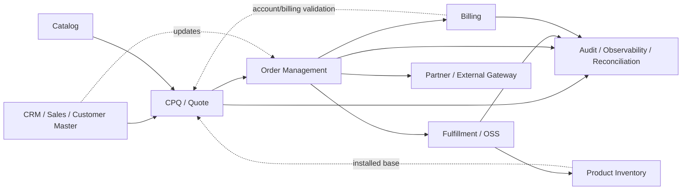
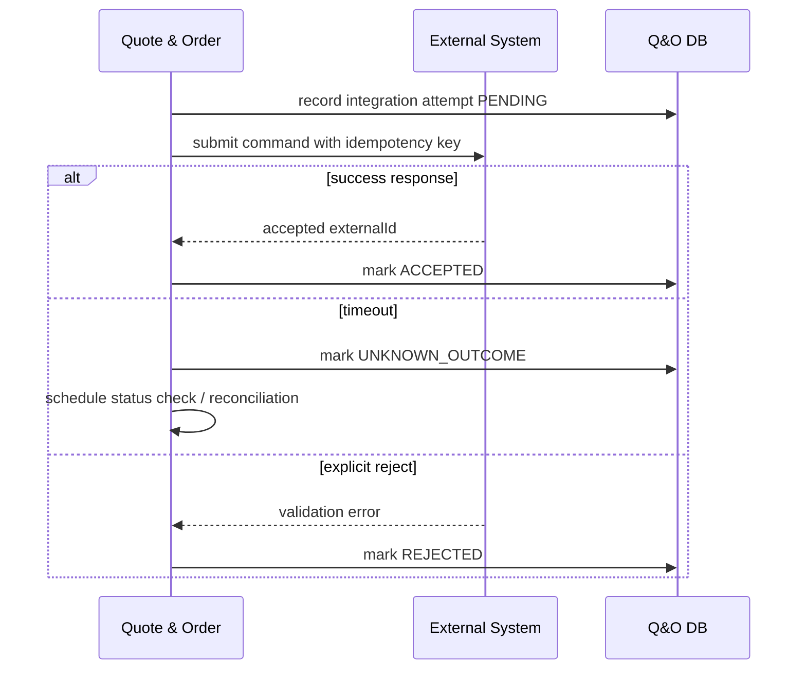
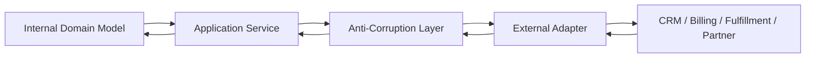
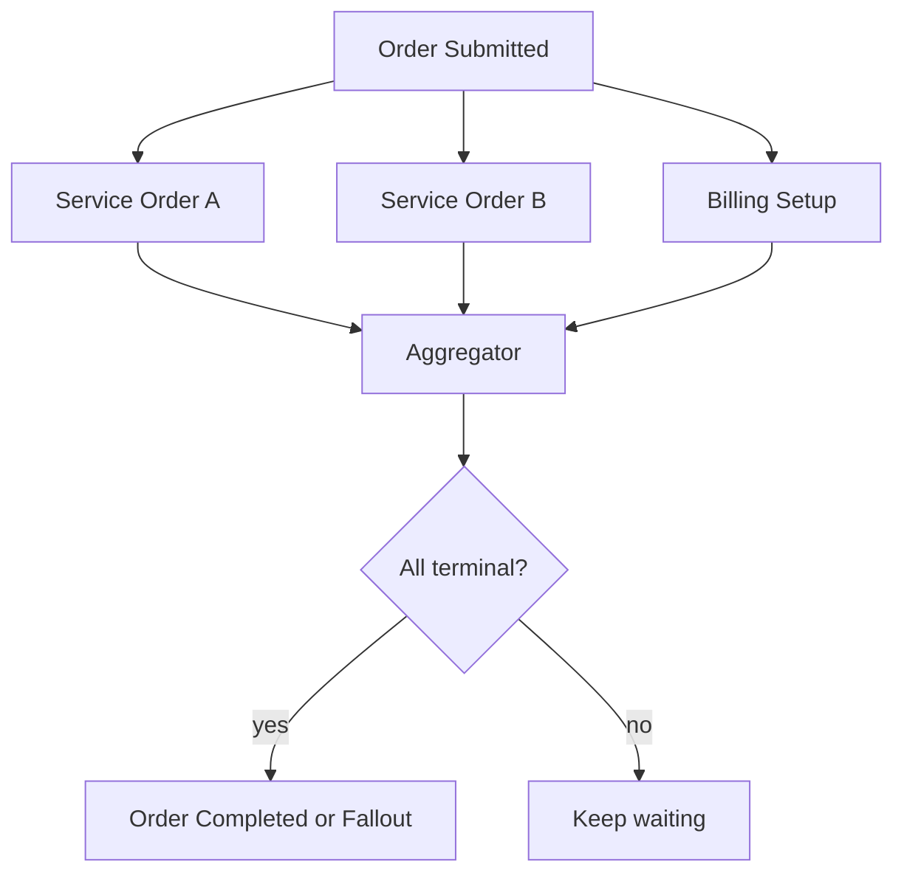
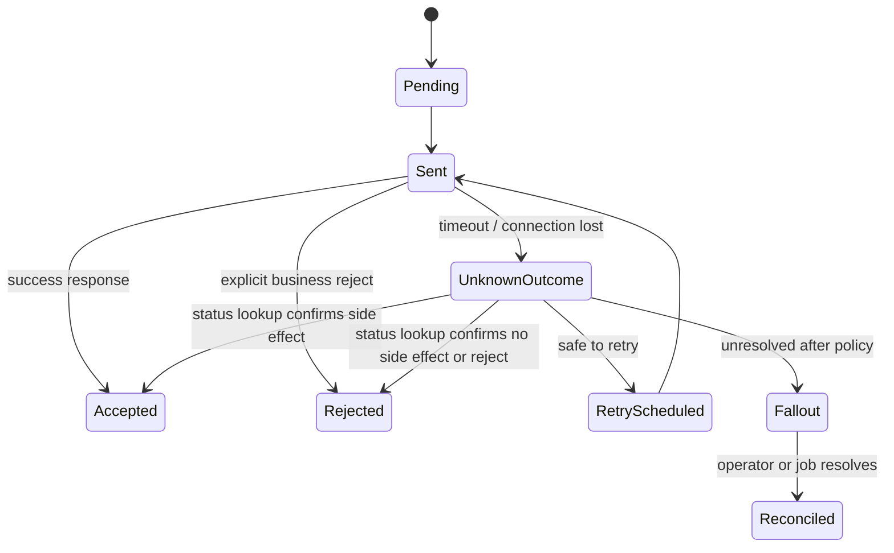

# Part 033 — Enterprise Integration Patterns: CRM, Billing, Fulfillment, Inventory, and Partners

> Core idea: enterprise integration is not "call another API".  
> It is the disciplined conversion of one system's business truth into another system's acceptable command, event, file, or state transition — under latency, failure, version drift, customer customization, and operational uncertainty.

In a Quote & Order platform, integration is where beautiful domain models meet messy reality.

A quote can be perfectly valid internally and still fail because:

- CRM customer data is stale.
- Billing rejects a charge code.
- Fulfillment accepts an order but never sends a final callback.
- Inventory returns a product instance that no longer matches catalog semantics.
- A partner gateway times out after performing the side effect.
- A customer-specific adapter maps a field incorrectly.
- A batch file arrives late.
- A downstream system supports "modify" but not "cancel".
- A retry creates a duplicate order because the receiver is not idempotent.

For a senior engineer, the question is not:

> "How do we integrate?"

The real question is:

> "What business truth crosses this boundary, what can fail, who owns recovery, and how do we prove what happened?"

---

## 1. Source Boundary and Fact Discipline

This part uses three kinds of knowledge.

### 1.1 Public CSG context

Public CSG materials describe Quote & Order in the area of CPQ, quote management, order management, quote-to-cash, complex enterprise/telco selling, catalog-driven tools, standard API integration, and cloud-native/microservices-based architecture.

That does **not** reveal internal implementation details.

So this part must not assume:

- which CRM integrations are implemented internally,
- which billing platforms are integrated,
- which fulfillment engines exist,
- whether adapters are shared or customer-specific,
- whether Kafka is used for all integration paths,
- whether integration state is centralized,
- whether TM Forum APIs are exposed directly, adapted, or only used as reference models.

Those are internal facts.

### 1.2 Industry concepts

This part uses industry concepts such as:

- Enterprise Integration Patterns,
- anti-corruption layer,
- message translator,
- message router,
- idempotent receiver,
- dead letter channel,
- splitter/aggregator,
- canonical model,
- adapter pattern,
- saga/process manager,
- reconciliation,
- retry/backoff,
- outbox/inbox.

These are generally applicable patterns, not CSG-specific claims.

### 1.3 Internal verification required

Every concrete design assumption must be verified in:

- codebase,
- architecture diagrams,
- onboarding docs,
- old PRs,
- incident reports,
- deployment manifests,
- observability dashboards,
- team discussions.

---

## 2. The Integration Mental Model

A Quote & Order system sits between commercial intent and operational execution.



The integration engineer must answer:

| Question | Why it matters |
|---|---|
| What is the source of truth? | Prevents local mutation of externally owned facts. |
| Is the call a command, query, event, or notification? | Determines idempotency, retry, and ownership semantics. |
| Is the integration synchronous or asynchronous? | Determines timeout, UX, recovery, and consistency model. |
| Is the external side effect reversible? | Determines cancellation and compensation design. |
| Is the downstream idempotent? | Determines duplicate prevention strategy. |
| What is the reconciliation path? | Prevents permanent inconsistency. |
| What is the audit evidence? | Enables defensible production support. |

Integration is a boundary of meaning, not just a boundary of technology.

---

## 3. Source of Truth Map

A source-of-truth map is one of the first artifacts you should build during onboarding.

Example conceptual map:

| Domain fact | Likely owner | Quote & Order responsibility |
|---|---|---|
| Product offering definition | Catalog | Reference or snapshot at quote/order time |
| Price rule | Catalog/pricing domain | Evaluate or call pricing service |
| Customer identity | Customer master/CRM | Reference, validate, cache carefully |
| Account hierarchy | CRM/customer/account system | Use for eligibility/pricing/approval |
| Enterprise agreement | Contract/agreement system or Q&O domain | Apply to pricing/approval |
| Quote lifecycle | Quote management | Own state and audit |
| Product order lifecycle | Order management | Own state and audit |
| Service order lifecycle | Fulfillment/SOM/OSS | Track via events/callbacks |
| Product inventory | Inventory system | Query/consume as installed base |
| Billing account | Billing system | Validate and hand off billing-relevant data |
| Invoice | Billing system | Do not fake billing truth locally |

A dangerous design smell:

> "We copied the whole customer/account/inventory/billing object into our DB, so now we own it."

Copying data does not make you the owner.  
It creates a cached view or historical snapshot. The distinction matters.

---

## 4. Integration Shape Taxonomy

Enterprise systems rarely integrate in one clean style.

### 4.1 Synchronous API query

Example:

- fetch customer account details,
- validate billing account,
- check inventory,
- preview pricing,
- retrieve agreement terms.

Use when:

- the caller needs an immediate answer,
- latency is acceptable,
- downstream availability is high enough,
- stale local cache would be dangerous.

Risks:

- timeout cascades,
- user-facing latency,
- dependency outage blocks order flow,
- retry may overload downstream.

### 4.2 Synchronous API command

Example:

- submit product order,
- create service order,
- reserve resource,
- create billing subscription,
- cancel downstream order.

Use carefully.

A command changes downstream state. If it times out, the outcome is unknown.

The correct model:



A timeout is not a failure.  
It is an unknown outcome.

### 4.3 Asynchronous event integration

Example:

- `QuoteAccepted`,
- `OrderSubmitted`,
- `OrderItemStateChanged`,
- `ServiceOrderCompleted`,
- `InventoryUpdated`,
- `BillingAccountValidated`.

Use when:

- consumers are independent,
- eventual consistency is acceptable,
- replay is useful,
- fan-out exists,
- long-running workflows exist.

Risks:

- duplicate events,
- ordering assumptions,
- schema drift,
- replay-unsafe consumers,
- consumer lag,
- invisible business delay.

### 4.4 Batch/file integration

Example:

- nightly price import,
- customer/account sync,
- inventory dump,
- billing reconciliation file,
- partner order status file.

Do not dismiss batch as "legacy". In enterprise/on-prem environments, batch may be the contract.

Risks:

- late arrival,
- partial file,
- duplicate file,
- invalid rows,
- encoding issues,
- timezone/date cutover,
- idempotent reprocessing,
- reconciliation mismatch.

### 4.5 UI/manual integration

Example:

- fallout operator resolves missing address,
- support manually retries fulfillment step,
- finance approves margin exception,
- admin maps customer-specific product codes.

Manual action is still an integration boundary.

It needs:

- permission,
- audit,
- validation,
- idempotency,
- reason codes,
- observable side effects.

---

## 5. Command, Event, Query, Notification

A common source of design confusion is treating all messages as "events".

| Type | Meaning | Example | Failure concern |
|---|---|---|---|
| Query | Ask for current information | `GET customer account` | stale response, timeout |
| Command | Ask another system to do something | `Create service order` | unknown outcome, duplicate command |
| Event | State fact that already happened | `OrderSubmitted` | duplicate event, ordering, replay |
| Notification | Signal for awareness | `Quote updated email trigger` | at-most-once may be acceptable |
| Document transfer | Exchange a business document | order file, billing file | version, validation, duplicate file |

A senior review question:

> "Is this message named as an event but behaving like a command?"

Bad:

```text
OrderSubmitted event consumed by fulfillment which treats it as instruction to create service order,
with no idempotency key, no command acknowledgement, and no reconciliation.
```

Better:

```text
Order management emits OrderSubmitted as a domain event.
A process manager derives CreateServiceOrder command.
The service order adapter sends command with idempotency key.
The downstream response/event updates integration state.
```

---

## 6. Anti-Corruption Layer

External systems have their own models. They should not leak directly into your domain model.



The anti-corruption layer protects:

- naming,
- lifecycle semantics,
- error semantics,
- nullability assumptions,
- enum differences,
- status mapping,
- version drift,
- customer-specific extensions,
- transport differences.

Example:

```java
public final class BillingAccountValidationAdapter {

    private final BillingClient client;
    private final BillingAccountMapper mapper;
    private final IntegrationAttemptRepository attempts;

    public BillingAccountValidationResult validate(BillingValidationCommand command) {
        IntegrationAttempt attempt = attempts.start(
            command.integrationKey(),
            "BILLING_ACCOUNT_VALIDATE",
            command.orderId()
        );

        try {
            BillingValidationRequest request = mapper.toExternal(command);
            BillingValidationResponse response = client.validate(request);

            BillingAccountValidationResult result = mapper.toDomain(response);
            attempts.markSucceeded(attempt.id(), response.externalRequestId());

            return result;
        } catch (ExternalValidationException e) {
            attempts.markRejected(attempt.id(), e.externalCode(), e.getMessage());
            return BillingAccountValidationResult.rejected(e.externalCode(), e.getMessage());
        } catch (TimeoutException e) {
            attempts.markUnknown(attempt.id(), "TIMEOUT");
            return BillingAccountValidationResult.unknown();
        }
    }
}
```

Key point:

The adapter does not throw random HTTP/client exceptions into the domain layer.  
It translates external failure into business-relevant outcomes.

---

## 7. Message Translator and Canonical Model

Enterprise Integration Patterns describes **Message Translator** as a pattern for translating one data format into another so systems using different formats can communicate.

In Quote & Order, translation usually happens across:

- TMF-style API model,
- internal domain model,
- persistence model,
- Kafka event model,
- customer-specific payload,
- downstream billing/fulfillment model.

Do not confuse canonical model with "one giant model everyone must use".

A useful canonical model is:

- stable enough for integration,
- expressive enough for shared business meaning,
- not polluted by every downstream quirk,
- versioned,
- documented,
- tested.

A bad canonical model becomes:

- a god object,
- full of nullable fields,
- impossible to validate,
- tightly coupled to all consumers,
- hard to evolve.

### 7.1 Translation loss

Every mapping can lose meaning.

Example:

| Internal concept | Downstream field | Risk |
|---|---|---|
| discount reason code | free text comment | approval evidence lost |
| agreement version | agreement ID only | stale agreement ambiguity |
| quote item dependency | flat order item list | fulfillment order wrong |
| recurring charge period | numeric amount | billing cadence lost |
| tenant ID | absent | cross-tenant risk |
| product offering version | product code | catalog drift |

A mapping PR should answer:

> "What meaning is lost, defaulted, or inferred?"

---

## 8. Router, Splitter, Aggregator

### 8.1 Router

A router chooses destination based on message content.

Examples:

- route order by product family,
- route by customer deployment,
- route by country,
- route by fulfillment domain,
- route by billing platform,
- route by partner.

Risk:

- routing rules become hidden product logic,
- rules drift from catalog,
- customer-specific routes bypass validation.

Prefer:

- rules tied to explicit catalog/config version,
- observable route decision,
- audit of route basis,
- tests for route matrix.

### 8.2 Splitter

A splitter breaks one business request into smaller work units.

Example:

```text
ProductOrder
  ├─ Broadband service order
  ├─ SIM activation order
  ├─ Billing subscription setup
  └─ Number portability request
```

Risks:

- child tasks lose parent context,
- dependency order is lost,
- cancellation cannot find all children,
- partial success is not modelled.

### 8.3 Aggregator

An aggregator combines multiple outcomes into one business state.

Example:



Aggregator needs:

- correlation key,
- expected children,
- child terminal states,
- timeout policy,
- partial failure policy,
- idempotent update,
- recovery query.

---

## 9. Integration Attempt as First-Class Data

Never hide integration state only in logs.

A useful integration attempt table:

```sql
CREATE TABLE integration_attempt (
    id BIGSERIAL PRIMARY KEY,
    tenant_id TEXT NOT NULL,
    business_object_type TEXT NOT NULL,
    business_object_id TEXT NOT NULL,
    integration_type TEXT NOT NULL,
    integration_key TEXT NOT NULL,
    destination TEXT NOT NULL,
    status TEXT NOT NULL,
    external_reference TEXT,
    request_hash TEXT,
    response_hash TEXT,
    attempt_count INTEGER NOT NULL DEFAULT 0,
    last_error_code TEXT,
    last_error_message TEXT,
    next_retry_at TIMESTAMPTZ,
    created_at TIMESTAMPTZ NOT NULL,
    updated_at TIMESTAMPTZ NOT NULL,
    UNIQUE (tenant_id, integration_type, integration_key)
);
```

Status examples:

- `PENDING`,
- `SENT`,
- `ACCEPTED`,
- `REJECTED`,
- `UNKNOWN_OUTCOME`,
- `RETRY_SCHEDULED`,
- `FAILED_PERMANENTLY`,
- `RECONCILED`,
- `CANCELLED`.

Why this matters:

- supports idempotency,
- supports retry,
- supports reconciliation,
- supports audit,
- supports support tooling,
- supports incident investigation.

---

## 10. Idempotent Receiver and Idempotent Sender

Enterprise Integration Patterns describes **Idempotent Receiver** as a receiver that can safely receive the same message multiple times.

In enterprise integration, both sides may need idempotency.

### 10.1 Sender-side idempotency

Quote & Order should not send the same command twice accidentally.

Use:

- unique integration key,
- integration attempt table,
- request hash,
- state guard,
- lock or optimistic version,
- outbox relay idempotency.

### 10.2 Receiver-side idempotency

If Quote & Order receives external callbacks/events:

Use:

- external event ID,
- source system,
- business object ID,
- event type,
- sequence/version if available,
- processed event table.

Example:

```sql
CREATE TABLE external_message_inbox (
    id BIGSERIAL PRIMARY KEY,
    tenant_id TEXT NOT NULL,
    source_system TEXT NOT NULL,
    external_message_id TEXT NOT NULL,
    aggregate_type TEXT NOT NULL,
    aggregate_id TEXT NOT NULL,
    message_type TEXT NOT NULL,
    received_at TIMESTAMPTZ NOT NULL,
    processed_at TIMESTAMPTZ,
    status TEXT NOT NULL,
    UNIQUE (tenant_id, source_system, external_message_id)
);
```

---

## 11. Retry Strategy

Retry is not one thing.

| Failure | Retry? | Notes |
|---|---:|---|
| Network timeout | yes, but reconcile first if side effect possible | unknown outcome |
| HTTP 429 | yes with backoff | respect downstream capacity |
| HTTP 500 | maybe | bounded retry |
| HTTP 400 validation | no | fix payload/business data |
| Auth failure | no or delayed | configuration/security issue |
| Schema mismatch | no | deployment/version issue |
| Duplicate conflict | treat as success only if same semantic request | compare request hash |
| Downstream maintenance | delayed retry | avoid storm |

Retry policy must include:

- max attempts,
- backoff,
- jitter,
- retry classification,
- dead-letter path,
- manual recovery,
- metrics.

Bad retry:

```text
retry every 1 second forever
```

Better retry:

```text
3 fast attempts for transient network error,
then exponential backoff with jitter,
then UNKNOWN_OUTCOME reconciliation,
then fallout if unresolved after SLA.
```

---

## 12. Dead Letter Channel Is Not a Garbage Bin

A dead letter channel is a recovery mechanism, not a place to hide messages.

Every DLQ message must have:

- owner,
- reason,
- retry eligibility,
- business object reference,
- tenant,
- correlation ID,
- original payload pointer or safe payload,
- replay procedure,
- expiry/retention policy.

DLQ without ownership becomes silent data loss.

---

## 13. Unknown Outcome Handling

The hardest integration state is not failed.  
It is unknown.

Example:

```text
Q&O sends CreateBillingSubscription.
Billing receives and creates subscription.
Network timeout occurs before response.
Q&O retries.
Billing creates duplicate subscription.
```

The fix is not "increase timeout".

The fix is:

- deterministic idempotency key,
- external reference mapping,
- status lookup API if available,
- reconciliation job,
- duplicate detection,
- manual fallout path.

Unknown outcome state machine:



---

## 14. Reconciliation as a Core Feature

Reconciliation should not be an afterthought.

Types:

| Type | Example |
|---|---|
| Status reconciliation | local order says in progress, downstream says completed |
| Financial reconciliation | order charges differ from billing charges |
| Inventory reconciliation | active product inventory missing after fulfillment |
| Event reconciliation | event received but state not updated |
| Adapter reconciliation | external request accepted but callback missing |
| Batch reconciliation | file rows accepted/rejected partially |

A reconciliation job should produce:

- matched records,
- mismatched records,
- missing locally,
- missing remotely,
- duplicate external,
- duplicate local,
- stale in progress,
- repair recommendations.

A good reconciliation result is actionable.

Bad:

```text
Found 104 errors.
```

Good:

```text
17 orders locally IN_PROGRESS but downstream COMPLETED.
Root cause candidate: missed callback from adapter X between 02:00-02:15 UTC.
Suggested repair: mark service task completed and emit OrderItemStateChanged for affected IDs after approval.
```

---

## 15. CRM Integration

CRM/customer master integration commonly provides:

- customer identity,
- account hierarchy,
- contacts,
- sales opportunity,
- quote owner,
- contract/account references,
- customer segment,
- billing account references.

Key design questions:

- Is customer/account data live-read or replicated?
- Is Quote & Order allowed to update customer data?
- How are CRM IDs mapped to internal IDs?
- What happens if account hierarchy changes while quote is pending?
- Are contact details PII?
- Are sales opportunity IDs required for audit?
- What is the stale data tolerance?

Failure modes:

- stale customer segment causes wrong pricing,
- account hierarchy drift invalidates approval route,
- CRM outage blocks quote creation,
- contact data copied without retention policy,
- customer merge not propagated,
- deleted customer still referenced by active quote.

Senior review rule:

> Do not let CRM objects leak into quote/order aggregates as mutable, unvalidated blobs.

---

## 16. Billing Integration

Billing integration is financially sensitive.

Common handoff data:

- customer/account ID,
- billing account ID,
- product instance,
- recurring charge,
- one-time charge,
- discount,
- tax-relevant attributes,
- effective date,
- contract term,
- currency,
- charge code,
- external product code,
- invoice grouping.

Key risks:

- price in quote differs from price in billing,
- recurring charge cadence lost,
- discount duration not represented,
- effective date mismatch,
- billing account invalid,
- duplicate subscription,
- cancellation not reflected,
- amendment creates overlapping billing items.

Design principle:

> Billing handoff must be explainable from quote/order snapshot.

A billing adapter should preserve:

- quote ID,
- quote version,
- order ID,
- order item ID,
- product offering ID/version,
- price component ID,
- agreement ID/version,
- approval ID,
- calculation timestamp.

---

## 17. Fulfillment and OSS Integration

Fulfillment integration converts commercial order into technical work.

Typical downstreams:

- service order management,
- provisioning,
- activation,
- network inventory,
- field service,
- number management,
- device/logistics,
- partner API.

Key risks:

- commercial product cannot be decomposed,
- decomposition result depends on stale catalog,
- service order accepted but later falls out,
- partial service completion,
- cancellation too late,
- retry creates duplicate technical work,
- downstream cannot represent item dependency,
- order completes before all child tasks terminal.

Design principle:

> A product order is not completed because it was sent. It is completed when required fulfillment outcomes are terminal and reconciled.

---

## 18. Inventory Integration

Inventory integration informs:

- installed base,
- amendment eligibility,
- service availability,
- product relationship,
- active product instance,
- resource assignment,
- disconnect/modify behavior.

Key risks:

- inventory is stale,
- inventory product model differs from catalog model,
- active product instance lacks original offering version,
- modification order references missing product,
- customer owns product in inventory but CRM account moved,
- fulfillment completed but inventory not updated.

Design principle:

> Inventory is customer reality, but not necessarily perfect reality.

You need freshness metadata:

- retrieved at,
- source,
- version/sequence,
- confidence,
- reconciliation status.

---

## 19. Partner Integration

Partners often differ by:

- API maturity,
- authentication model,
- payload format,
- SLA,
- error codes,
- idempotency support,
- callback availability,
- sandbox fidelity,
- versioning discipline.

Adapter boundary must absorb partner quirks.

Do not pollute domain logic with:

```java
if (partnerCode.equals("ABC")) {
    // weird rule
}
```

Prefer:

- partner capability model,
- adapter configuration,
- strategy implementation,
- contract tests per partner,
- capability validation before routing.

Example:

```java
public interface FulfillmentPartnerAdapter {
    PartnerCapability capability();

    SubmissionResult submit(ServiceOrderCommand command);

    Optional<ExternalStatus> lookup(ExternalReference reference);

    CancellationResult cancel(CancelServiceOrderCommand command);
}
```

---

## 20. Integration Observability

For every integration call/message, capture:

- tenant ID,
- business object ID,
- integration type,
- destination,
- operation,
- idempotency key,
- external reference,
- correlation ID,
- causation ID,
- attempt number,
- latency,
- status,
- error class,
- retry decision,
- payload version,
- adapter version.

Metrics:

| Metric | Why |
|---|---|
| integration attempts by destination/status | detects downstream health |
| timeout rate | detects network/downstream latency |
| unknown outcome count | detects risk accumulation |
| retry backlog | detects recovery pressure |
| DLQ count by reason | detects schema/business breaks |
| reconciliation mismatch count | detects hidden inconsistency |
| callback delay | detects asynchronous degradation |
| adapter error rate by customer/tenant | detects customer-specific issue |

Logging rule:

> Logs are for debugging, integration state is for recovery, audit is for evidence.

Do not substitute one for another.

---

## 21. Security and Tenant Boundary

Integration payloads often contain:

- customer identity,
- contract terms,
- price,
- discount,
- PII,
- account hierarchy,
- service address,
- billing data.

Security concerns:

- tenant ID propagation,
- least privilege external credentials,
- secret rotation,
- credential per tenant/customer,
- mTLS/certificate lifecycle,
- payload redaction,
- audit log masking,
- partner-specific data minimization,
- replay attack protection,
- webhook signature verification.

Internal checklist:

- Are webhook callbacks authenticated?
- Is tenant derived from trusted mapping, not request body?
- Are external IDs globally unique or tenant-scoped?
- Are logs redacted?
- Are payload archives encrypted?
- Who can replay DLQ messages?
- Who can trigger manual retry?

---

## 22. Testing Strategy

### 22.1 Unit tests

Test:

- mapper behavior,
- status mapping,
- error classification,
- route selection,
- idempotency key generation,
- retry decision,
- unknown outcome transition.

### 22.2 Contract tests

Test:

- OpenAPI contract,
- generated client compatibility,
- partner payload shape,
- TMF-compatible model mapping,
- event schema compatibility.

### 22.3 Integration tests

Test with Testcontainers/stubs:

- timeout after side effect,
- duplicate callback,
- callback before local transaction visible,
- downstream reject,
- unknown external reference,
- retry after transient failure,
- poison message.

### 22.4 Reconciliation tests

Test:

- local accepted, remote missing,
- remote completed, local in progress,
- duplicate remote record,
- partial batch file,
- malformed row,
- stale data threshold,
- repair script output.

### 22.5 Game-day tests

Simulate:

- billing timeout storm,
- CRM outage,
- fulfillment callback delay,
- Kafka consumer lag,
- partner schema change,
- duplicate order submission,
- DLQ backlog,
- customer-specific adapter mapping bug.

---

## 23. PR Review Checklist

For any integration PR, ask:

### Boundary

- What system owns the source-of-truth?
- Is this a query, command, event, notification, or document?
- Is the anti-corruption layer explicit?
- Does external model leak into domain?

### Correctness

- Is idempotency key stable?
- Are duplicate responses/events handled?
- Are timeouts treated as unknown outcome when side effect is possible?
- Is retry classification explicit?
- Is reconciliation path defined?
- Are partial failures modelled?

### Data

- Is request/response mapped without semantic loss?
- Is tenant ID included and enforced?
- Are external references stored?
- Are status mappings reversible/explainable?
- Is PII minimized and redacted?

### Operations

- Are metrics and logs sufficient?
- Is DLQ/retry ownership clear?
- Is manual recovery possible?
- Is runbook updated?
- Is there an alert for stuck states?

### Compatibility

- Is external contract versioned?
- Are customer-specific differences isolated?
- Are contract tests updated?
- Is schema evolution safe?

---

## 24. Internal Verification Checklist

During onboarding, verify:

### System map

- Which external systems integrate with Quote & Order?
- Which integrations are synchronous, async, batch, or manual?
- Which are customer-specific?
- Which are shared product capabilities?

### Ownership

- Who owns CRM/customer data?
- Who owns billing account validation?
- Who owns fulfillment orchestration?
- Who owns product inventory?
- Who owns partner adapters?
- Who owns reconciliation jobs?

### Codebase

- Where are adapters implemented?
- Is there a common integration framework?
- Are external clients generated or handwritten?
- Are mappers tested?
- Are retry policies centralized?
- Are integration attempts persisted?

### Data

- Is there an integration attempt table?
- Is there an inbox table?
- Is there an outbox table?
- Are external references indexed?
- Are payloads stored? If yes, how are they protected?
- Are reconciliation results stored?

### Kafka

- Which topics represent integration events?
- Which topics are commands?
- Are DLQ topics standardized?
- Is schema registry used?
- Is replay supported?

### Operations

- Are dashboards per integration?
- Are alerts routed to owning team?
- Are runbooks available?
- Are recent incidents documented?
- Are manual retry/replay tools audited?

---

## 25. Common Anti-Patterns

### 25.1 "Just call the API"

Symptoms:

- no persisted attempt,
- no idempotency key,
- no timeout classification,
- no external reference,
- no reconciliation.

### 25.2 External enum leakage

Symptoms:

- domain state depends on partner-specific string,
- new external status breaks internal state machine,
- mapping has no unknown/default handling.

### 25.3 Retry as correctness

Symptoms:

- retry hides unknown outcome,
- duplicate side effects occur,
- downstream gets overloaded.

### 25.4 Logs as state

Symptoms:

- support must grep logs to know if order was sent,
- logs expire before issue is investigated,
- no repair workflow.

### 25.5 Customer-specific logic in core domain

Symptoms:

- `if customer == X`,
- impossible regression matrix,
- unclear ownership,
- product behavior diverges silently.

### 25.6 No reconciliation

Symptoms:

- stuck orders discovered by customers,
- billing mismatch discovered at invoice time,
- inventory drift persists for months.

---

## 26. Practical Exercise

Build an integration review for one real or hypothetical integration.

Use this template:

```md
# Integration Review: <Name>

## Business purpose
What business outcome does this integration support?

## Source of truth
Which system owns each fact?

## Interaction type
Query / command / event / notification / batch / manual.

## Contract
API/event/file schema and version.

## Idempotency
Key, storage, duplicate handling.

## Failure modes
Timeout, reject, duplicate, partial, unknown outcome, stale data.

## Retry policy
Which errors retry, how often, when to stop.

## Reconciliation
How to detect and repair mismatch.

## Security
Tenant, auth, PII, secrets.

## Observability
Logs, metrics, traces, dashboards, alerts.

## Test matrix
Unit, contract, integration, E2E, game day.

## Open questions
Internal verification needed.
```

---

## 27. Mental Model Summary

Enterprise integration is the discipline of preserving business meaning across unreliable boundaries.

A robust integration has:

- explicit ownership,
- explicit message type,
- anti-corruption layer,
- idempotency,
- durable attempt state,
- unknown outcome handling,
- retry classification,
- reconciliation,
- observability,
- security boundary,
- contract tests,
- recovery tooling.

A fragile integration has:

- direct external model leakage,
- implicit retry,
- no persisted state,
- no reconciliation,
- no owner,
- no audit trail,
- no failure vocabulary.

For Quote & Order, integration quality directly affects:

- order correctness,
- billing accuracy,
- customer experience,
- revenue leakage,
- operational support,
- audit defensibility.

---

## 28. What to Carry Forward

Before moving to PostgreSQL system-of-record design, carry this invariant:

> If an external side effect matters to quote-to-cash correctness, its local representation must be durable, idempotent, observable, reconcilable, and auditable.

This will shape the database model in the next part.

---

## References and Source Notes

- Enterprise Integration Patterns, official pattern catalog. It describes a pattern language for distributed applications and enterprise integration, including technology-independent vocabulary and design considerations.
- Enterprise Integration Patterns, Message Translator pattern. Used here as industry vocabulary for translating between incompatible models.
- Enterprise Integration Patterns, Idempotent Receiver pattern. Used here as industry vocabulary for duplicate-safe message handling.
- CSG public Quote & Order and quote-to-cash materials. Used only for public product/domain positioning, not internal architecture claims.
- TM Forum Open APIs. Used as industry context for integration contracts and telco BSS/OSS vocabulary.
