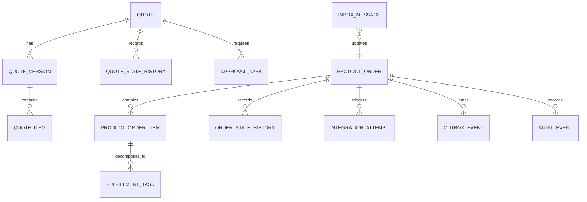

# Part 034 — PostgreSQL as System of Record for Quote and Order Workloads

> Core idea: PostgreSQL is not just where a Java service stores objects.  
> In a mission-critical Quote & Order system, PostgreSQL is the durable boundary for business state, lifecycle evidence, concurrency control, integration recovery, auditability, and operational repair.

A weak data model turns production incidents into archaeology.

A strong data model makes failure visible, recovery possible, and behavior defensible.

This part focuses on PostgreSQL as the system of record for Quote & Order workloads:

- quote lifecycle,
- order lifecycle,
- order item state,
- pricing snapshots,
- catalog version references,
- customer/account references,
- approval evidence,
- audit trail,
- outbox/inbox,
- integration attempts,
- reconciliation,
- tenant boundary,
- support/debuggability.

We will not go deep into locking/index tuning yet.  
Those have dedicated later parts.

Here, the goal is data modelling discipline.

---

## 1. Source Boundary and Fact Discipline

This part uses PostgreSQL public documentation for general database behavior and features. It does not assume CSG's internal schema, table names, migration tooling, tenant model, or deployment topology.

PostgreSQL documentation describes PostgreSQL as an object-relational database system that extends SQL and supports advanced features for storing and scaling complex workloads. PostgreSQL also documents MVCC, transaction isolation, JSON/JSONB, indexing, partitioning, constraints, and data definition features.

Internal details that must be verified include:

- actual schema,
- tenancy model,
- migration tooling,
- use of JSONB,
- outbox/inbox implementation,
- audit model,
- partitioning strategy,
- archival strategy,
- read replicas,
- backup/restore,
- on-prem upgrade constraints.

---

## 2. Mental Model: Database as Business Memory

In Quote & Order, PostgreSQL often carries several kinds of memory:

| Memory type | Example | Required property |
|---|---|---|
| Current state | quote status, order status | fast lookup, guarded updates |
| Historical state | status transition history | immutable/auditable |
| Business snapshot | accepted quote price | reproducible decision basis |
| External reference | billing subscription ID | recovery/reconciliation |
| Integration attempt | service order submission | idempotent retry |
| Event outbox | `OrderSubmitted` event | reliable publish after commit |
| Inbound inbox | external callback ID | duplicate-safe processing |
| Approval evidence | approver, reason, threshold | audit defensibility |
| Repair evidence | operator correction | accountable production fix |

A senior engineer should not ask only:

> "Can this be stored?"

Ask:

> "Can we prove what happened, recover after failure, and evolve this safely?"

---

## 3. Data Classes in Quote & Order

Not all data deserves the same modelling style.

### 3.1 Authoritative state

Owned by the service.

Examples:

- quote aggregate state,
- quote version,
- order aggregate state,
- order item state,
- approval task state,
- integration attempt state.

Use:

- normalized relational model,
- explicit constraints,
- optimistic locking,
- status transition history,
- indexes aligned with operational queries.

### 3.2 Snapshot data

Frozen copy of externally or historically relevant facts.

Examples:

- product offering version used by quote,
- price calculation result,
- customer account display name at quote acceptance,
- agreement version,
- discount approval basis,
- tax-relevant attributes.

Use when:

- future changes must not rewrite past commercial commitment,
- audit requires reconstructing decision,
- downstream handoff must match accepted quote/order.

### 3.3 Reference data

Pointer to external/source-of-truth system.

Examples:

- customer ID,
- account ID,
- agreement ID,
- product inventory ID,
- billing account ID.

Use when:

- local system does not own the fact,
- current truth must be fetched or synchronized,
- copying entire object creates stale-data risk.

### 3.4 Derived/read model data

Optimized for query.

Examples:

- order search projection,
- quote summary view,
- dashboard counters,
- current order item progress,
- customer order list.

Use when:

- source state is elsewhere,
- rebuild/reconciliation is possible,
- query performance matters.

### 3.5 Operational state

State needed to run the system.

Examples:

- outbox events,
- inbox processed messages,
- retry schedules,
- reconciliation jobs,
- data repair approvals.

Do not hide operational state in memory only.

---

## 4. Conceptual Schema Map

A simplified schema map:



This is conceptual, not an internal CSG schema claim.

The point is:

- current state and history are separate,
- quote and order have different lifecycle ownership,
- item-level state is first-class,
- integration attempts are durable,
- events are transactionally related to state changes,
- audit is not an afterthought.

---

## 5. Quote Tables

A possible quote modelling approach:

```sql
CREATE TABLE quote (
    id UUID PRIMARY KEY,
    tenant_id TEXT NOT NULL,
    quote_number TEXT NOT NULL,
    current_version INTEGER NOT NULL,
    status TEXT NOT NULL,
    status_reason TEXT,
    customer_ref TEXT NOT NULL,
    account_ref TEXT,
    agreement_ref TEXT,
    accepted_version INTEGER,
    expires_at TIMESTAMPTZ,
    version BIGINT NOT NULL DEFAULT 0,
    created_at TIMESTAMPTZ NOT NULL,
    updated_at TIMESTAMPTZ NOT NULL,
    UNIQUE (tenant_id, quote_number)
);
```

### 5.1 Why `current_version` and `accepted_version` matter

A quote can be edited many times.

A quote order conversion must point to the accepted version, not "whatever is current after someone edited it".

Dangerous pattern:

```text
order references quote_id only
```

Better:

```text
order references quote_id + quote_version
```

### 5.2 Quote version table

```sql
CREATE TABLE quote_version (
    quote_id UUID NOT NULL,
    tenant_id TEXT NOT NULL,
    version_number INTEGER NOT NULL,
    catalog_snapshot_ref TEXT,
    pricing_snapshot_ref TEXT,
    total_recurring_amount NUMERIC(19, 4),
    total_one_time_amount NUMERIC(19, 4),
    currency TEXT NOT NULL,
    created_by TEXT NOT NULL,
    created_at TIMESTAMPTZ NOT NULL,
    PRIMARY KEY (quote_id, version_number)
);
```

### 5.3 Quote item table

```sql
CREATE TABLE quote_item (
    id UUID PRIMARY KEY,
    tenant_id TEXT NOT NULL,
    quote_id UUID NOT NULL,
    quote_version_number INTEGER NOT NULL,
    parent_item_id UUID,
    product_offering_id TEXT NOT NULL,
    product_offering_version TEXT,
    action TEXT,
    quantity INTEGER NOT NULL,
    configuration JSONB,
    price_snapshot JSONB,
    validation_status TEXT,
    created_at TIMESTAMPTZ NOT NULL
);
```

`JSONB` may be useful for complex configuration/price snapshot data, but it should not be a dumping ground for all business logic.

---

## 6. Order Tables

A product order must represent:

- order identity,
- customer/account/agreement references,
- source quote/version,
- lifecycle state,
- item-level actions,
- dependencies,
- fulfillment progress,
- cancellation/amendment relationship.

```sql
CREATE TABLE product_order (
    id UUID PRIMARY KEY,
    tenant_id TEXT NOT NULL,
    order_number TEXT NOT NULL,
    source_quote_id UUID,
    source_quote_version INTEGER,
    customer_ref TEXT NOT NULL,
    account_ref TEXT,
    agreement_ref TEXT,
    status TEXT NOT NULL,
    status_reason TEXT,
    submitted_at TIMESTAMPTZ,
    completed_at TIMESTAMPTZ,
    cancelled_at TIMESTAMPTZ,
    version BIGINT NOT NULL DEFAULT 0,
    created_at TIMESTAMPTZ NOT NULL,
    updated_at TIMESTAMPTZ NOT NULL,
    UNIQUE (tenant_id, order_number)
);
```

### 6.1 Order item

```sql
CREATE TABLE product_order_item (
    id UUID PRIMARY KEY,
    tenant_id TEXT NOT NULL,
    order_id UUID NOT NULL,
    parent_item_id UUID,
    source_quote_item_id UUID,
    action TEXT NOT NULL,
    product_offering_id TEXT,
    product_offering_version TEXT,
    product_inventory_ref TEXT,
    status TEXT NOT NULL,
    status_reason TEXT,
    dependency_group TEXT,
    sequence_no INTEGER,
    version BIGINT NOT NULL DEFAULT 0,
    created_at TIMESTAMPTZ NOT NULL,
    updated_at TIMESTAMPTZ NOT NULL
);
```

### 6.2 Item-level state is not optional

Order-level state alone is insufficient.

A real order can be:

- partially completed,
- partially failed,
- partially cancelled,
- waiting for one downstream task,
- blocked by one validation error,
- completed commercially but not technically reconciled.

If the item state is not persisted, you will invent it from logs during incidents.

---

## 7. State History Tables

Current state answers:

> "What is true now?"

History answers:

> "How did it become true?"

Example:

```sql
CREATE TABLE order_state_history (
    id BIGSERIAL PRIMARY KEY,
    tenant_id TEXT NOT NULL,
    order_id UUID NOT NULL,
    from_status TEXT,
    to_status TEXT NOT NULL,
    reason_code TEXT,
    actor_type TEXT NOT NULL,
    actor_id TEXT,
    command_id TEXT,
    correlation_id TEXT,
    causation_id TEXT,
    occurred_at TIMESTAMPTZ NOT NULL,
    metadata JSONB
);
```

State history should support:

- audit,
- debugging,
- customer support,
- replay reasoning,
- incident timeline,
- approval evidence,
- repair evidence.

Do not rely on `updated_at` alone.

---

## 8. Audit Event vs State History vs Log

These are different.

| Artifact | Purpose | Example |
|---|---|---|
| Application log | Debug technical behavior | SQL timeout, adapter response |
| State history | Explain lifecycle transition | `VALIDATING -> ACCEPTED` |
| Audit event | Evidence of actor/business action | user approved 12% discount |
| Outbox event | Notify other systems | `OrderSubmitted` |
| Integration attempt | Recover external side effect | billing request timed out |

A common bug is trying to use logs for all five.

Logs are not enough because:

- logs may expire,
- logs may be sampled,
- logs may be redacted,
- logs may not be transactional,
- logs are not structured around business evidence.

---

## 9. Constraints as Executable Invariants

Database constraints are not "less clean" than application validation.  
They are the last line of defense.

Examples:

```sql
ALTER TABLE quote
ADD CONSTRAINT quote_status_check
CHECK (status IN (
    'DRAFT',
    'PRICING_REQUIRED',
    'PRICED',
    'PENDING_APPROVAL',
    'APPROVED',
    'ACCEPTED',
    'ORDERED',
    'EXPIRED',
    'CANCELLED',
    'REJECTED'
));
```

```sql
ALTER TABLE product_order_item
ADD CONSTRAINT product_order_item_action_check
CHECK (action IN ('ADD', 'MODIFY', 'DELETE', 'NO_CHANGE'));
```

Useful constraints:

- non-null tenant ID,
- unique business key per tenant,
- valid status/action,
- positive quantity,
- currency present with amount,
- accepted quote version present when status is accepted/ordered,
- external reference uniqueness per tenant/source,
- idempotency key uniqueness.

But constraints cannot express everything elegantly.

Application/domain logic still owns:

- transition guard,
- complex pricing rules,
- approval threshold,
- catalog compatibility,
- decomposition dependency,
- authorization.

Think layered defense.

---

## 10. Tenant Boundary in Data Model

Tenant isolation must be designed into every table.

At minimum:

- `tenant_id` on tenant-scoped tables,
- unique constraints include `tenant_id`,
- queries always filter by `tenant_id`,
- indexes include `tenant_id` where useful,
- external IDs are not assumed globally unique,
- audit includes tenant context.

Dangerous:

```sql
SELECT * FROM product_order WHERE order_number = ?
```

Safer:

```sql
SELECT * FROM product_order
WHERE tenant_id = ?
  AND order_number = ?
```

If row-level security is used, verify:

- policy coverage,
- application role usage,
- migration scripts,
- admin/reporting paths,
- performance impact,
- bypass risks.

If schema-per-tenant or database-per-tenant is used, verify:

- migration fan-out,
- monitoring fan-out,
- backup/restore,
- tenant onboarding,
- tenant deletion,
- customer-specific upgrade.

---

## 11. JSONB: Useful Tool, Dangerous Escape Hatch

PostgreSQL supports JSON and JSONB data types; JSONB stores data in a decomposed binary format and supports indexing, while JSON stores an exact text copy of the input.

JSONB can be useful for:

- product configuration snapshot,
- external payload snapshot,
- audit metadata,
- flexible characteristic values,
- customer-specific extensions,
- versioned document payloads.

But JSONB becomes dangerous when:

- required business fields are hidden inside it,
- constraints are missing,
- query patterns are unknown,
- indexes are not designed,
- schema evolution is undocumented,
- application code assumes keys exist,
- data repair requires deep JSON edits.

Rule of thumb:

| Data | Prefer |
|---|---|
| lifecycle status | column |
| tenant ID | column |
| business key | column |
| foreign/reference ID | column |
| query/filter field | column or generated indexed expression |
| audit metadata | JSONB acceptable |
| flexible product characteristics | JSONB acceptable with validation |
| accepted pricing explanation | JSONB acceptable with versioned schema |

Do not use JSONB to avoid modelling decisions.

---

## 12. Snapshot Modelling

In Quote & Order, snapshots are essential.

Example accepted quote snapshot:

```json
{
  "quoteId": "q-123",
  "quoteVersion": 4,
  "catalogVersion": "2026.07.01",
  "pricingVersion": "pricing-rules-2026.07",
  "currency": "USD",
  "items": [
    {
      "quoteItemId": "qi-1",
      "productOfferingId": "fiber-business-1g",
      "productOfferingVersion": "17",
      "recurringCharge": "499.0000",
      "oneTimeCharge": "99.0000",
      "discounts": [
        {
          "discountCode": "EA-12M-10PCT",
          "percent": "10.00",
          "approvalId": "approval-777"
        }
      ]
    }
  ]
}
```

Snapshot must answer:

- what was sold,
- at what version,
- to whom,
- at what price,
- under what agreement,
- with what approval,
- using what catalog/rule version.

Without this, you cannot reliably explain quote-to-order-to-billing mismatch.

---

## 13. Outbox Table

The outbox pattern protects against this failure:

```text
DB transaction commits order accepted.
Application crashes before publishing Kafka event.
Downstream never learns order was accepted.
```

Conceptual outbox table:

```sql
CREATE TABLE outbox_event (
    id UUID PRIMARY KEY,
    tenant_id TEXT NOT NULL,
    aggregate_type TEXT NOT NULL,
    aggregate_id UUID NOT NULL,
    event_type TEXT NOT NULL,
    event_version INTEGER NOT NULL,
    payload JSONB NOT NULL,
    correlation_id TEXT,
    causation_id TEXT,
    status TEXT NOT NULL DEFAULT 'PENDING',
    created_at TIMESTAMPTZ NOT NULL,
    published_at TIMESTAMPTZ,
    publish_attempt_count INTEGER NOT NULL DEFAULT 0,
    last_error TEXT
);
```

Application transaction:

```text
1. update order state
2. insert state history
3. insert audit event
4. insert outbox event
5. commit
```

Outbox relay:

```text
1. read pending events
2. publish to Kafka
3. mark published
4. retry safely on failure
```

Important:

- publishing is at-least-once,
- consumers still need idempotency,
- outbox table needs retention/archival,
- relay needs monitoring,
- event schema must be versioned.

---

## 14. Inbox Table

The inbox pattern protects against duplicate external messages.

```sql
CREATE TABLE inbox_message (
    id UUID PRIMARY KEY,
    tenant_id TEXT NOT NULL,
    source_system TEXT NOT NULL,
    external_message_id TEXT NOT NULL,
    message_type TEXT NOT NULL,
    aggregate_type TEXT,
    aggregate_id UUID,
    payload JSONB NOT NULL,
    status TEXT NOT NULL,
    received_at TIMESTAMPTZ NOT NULL,
    processed_at TIMESTAMPTZ,
    last_error TEXT,
    UNIQUE (tenant_id, source_system, external_message_id)
);
```

Processing rule:

```text
Insert inbox row first.
If unique violation occurs, treat as duplicate.
Only process message once.
Persist result.
```

This is especially important for:

- Kafka replay,
- webhook retry,
- batch reprocessing,
- partner callback duplication,
- manual replay.

---

## 15. Integration Attempt Tables

From Part 033, integration attempt state should be first-class.

```sql
CREATE TABLE integration_attempt (
    id UUID PRIMARY KEY,
    tenant_id TEXT NOT NULL,
    business_object_type TEXT NOT NULL,
    business_object_id UUID NOT NULL,
    operation TEXT NOT NULL,
    destination TEXT NOT NULL,
    idempotency_key TEXT NOT NULL,
    external_reference TEXT,
    status TEXT NOT NULL,
    attempt_count INTEGER NOT NULL DEFAULT 0,
    next_retry_at TIMESTAMPTZ,
    last_error_code TEXT,
    last_error_message TEXT,
    request_hash TEXT,
    response_hash TEXT,
    created_at TIMESTAMPTZ NOT NULL,
    updated_at TIMESTAMPTZ NOT NULL,
    UNIQUE (tenant_id, destination, operation, idempotency_key)
);
```

This table supports:

- safe retry,
- unknown outcome,
- reconciliation,
- support tooling,
- incident investigation,
- duplicate prevention.

---

## 16. Approval Evidence Tables

Approval needs more than `approved = true`.

Example:

```sql
CREATE TABLE approval_task (
    id UUID PRIMARY KEY,
    tenant_id TEXT NOT NULL,
    quote_id UUID NOT NULL,
    quote_version_number INTEGER NOT NULL,
    approval_type TEXT NOT NULL,
    threshold_rule_id TEXT,
    requested_by TEXT NOT NULL,
    requested_at TIMESTAMPTZ NOT NULL,
    status TEXT NOT NULL,
    decided_by TEXT,
    decided_at TIMESTAMPTZ,
    decision_reason TEXT,
    version BIGINT NOT NULL DEFAULT 0
);
```

Approval evidence should capture:

- what triggered approval,
- rule version,
- quote version,
- margin/discount basis,
- approver authority,
- decision timestamp,
- reason/comment,
- whether quote changed after approval.

Important invariant:

> Approval is tied to the commercial content it approved.

If quote price/config changes after approval, approval may need invalidation.

---

## 17. Lifecycle History and Repair Evidence

Production systems need correction workflows.

Example repair table:

```sql
CREATE TABLE production_repair_action (
    id UUID PRIMARY KEY,
    tenant_id TEXT NOT NULL,
    business_object_type TEXT NOT NULL,
    business_object_id UUID NOT NULL,
    repair_type TEXT NOT NULL,
    reason TEXT NOT NULL,
    approved_by TEXT,
    executed_by TEXT NOT NULL,
    executed_at TIMESTAMPTZ NOT NULL,
    before_snapshot JSONB NOT NULL,
    after_snapshot JSONB NOT NULL,
    correlation_id TEXT
);
```

This is not an invitation to modify data casually.

It is a controlled evidence mechanism when repair is necessary.

---

## 18. Relational Integrity: Foreign Keys or Application-Enforced?

Foreign keys are useful when:

- relationship is local and strong,
- lifecycle is jointly managed,
- delete/update semantics are clear,
- tenant boundary can be preserved.

Foreign keys may be difficult when:

- cross-service reference,
- external system reference,
- huge multi-tenant table with complex archival,
- asynchronous lifecycle,
- on-prem migration constraints,
- partitioning constraints.

Do not decide dogmatically.

Ask:

- Who owns the referenced row?
- Can it be deleted?
- What does cascade mean?
- Is missing reference a bug or acceptable stale reference?
- Does FK help or block operational repair?
- Can migration handle it?

For locally owned aggregate data, FKs often provide valuable safety.

For externally owned references, store reference plus validation/freshness metadata.

---

## 19. Indexing Mindset Before Deep Tuning

Later part will cover query plans and indexing deeply.

For now, design with query patterns in mind.

Common query patterns:

- find quote by tenant + quote number,
- find active quote by customer/account,
- find order by tenant + order number,
- find orders stuck in status,
- find order items pending fulfillment,
- find integration attempts due for retry,
- find outbox events pending publish,
- find inbox duplicate by external message ID,
- find audit history by business object,
- find reconciliation mismatch by run.

Example indexes:

```sql
CREATE INDEX idx_product_order_tenant_status_updated
ON product_order (tenant_id, status, updated_at);
```

```sql
CREATE INDEX idx_integration_attempt_retry
ON integration_attempt (status, next_retry_at)
WHERE status IN ('RETRY_SCHEDULED', 'UNKNOWN_OUTCOME');
```

```sql
CREATE INDEX idx_outbox_pending
ON outbox_event (status, created_at)
WHERE status = 'PENDING';
```

Indexes are not decorations.  
They encode workload assumptions.

---

## 20. Partitioning and Archival

PostgreSQL documentation describes table partitioning as splitting what is logically one large table into smaller physical pieces; it can improve performance in certain situations, especially when heavily accessed rows are concentrated in a small number of partitions.

Potential candidates:

- audit events,
- state history,
- outbox event archive,
- inbox messages,
- integration attempts,
- large order tables by tenant/time if scale demands.

Partitioning is not free.

Costs:

- migration complexity,
- index design complexity,
- query mistakes,
- operational complexity,
- foreign key limitations depending on design,
- maintenance overhead.

Archival questions:

- How long must quote/order data remain queryable?
- What is legal/compliance retention?
- What is customer contract retention?
- Can old data be moved to cold storage?
- Can archived data still support audit?
- Can repair/reconciliation touch archived rows?
- What happens during on-prem upgrade?

---

## 21. Time, Timezone, and Effective Date

Quote & Order systems are full of time.

Examples:

- quote expiry,
- price effective date,
- agreement validity,
- product offering lifecycle,
- order requested completion date,
- service activation date,
- billing start date,
- discount end date,
- SLA timers,
- retry schedule.

Rules:

- use `TIMESTAMPTZ` for instants,
- store business timezone where local date matters,
- do not compare local dates without explicit timezone,
- separate event occurrence time from processing time,
- store source timestamp for external events,
- avoid silently defaulting effective dates.

Example:

```sql
price_effective_at TIMESTAMPTZ NOT NULL,
customer_local_date DATE,
customer_timezone TEXT
```

If business rules depend on "end of day", define whose day.

---

## 22. Numeric Precision for Money

Money must not use floating point.

Use:

```sql
NUMERIC(19, 4)
```

or a precision/scale appropriate to product and billing requirements.

Store:

- amount,
- currency,
- tax inclusion/exclusion semantics,
- charge period,
- rounding rule/version,
- price component identity.

Dangerous:

```sql
amount DOUBLE PRECISION
```

Dangerous:

```text
total amount stored without component breakdown
```

You need breakdown to explain:

- discounts,
- taxes,
- recurring vs one-time,
- approval threshold,
- billing handoff,
- reconciliation mismatch.

---

## 23. Status Columns and Enumerations

Status fields are dangerous when under-specified.

Bad:

```sql
status TEXT NOT NULL
```

with no documented transition model.

Better:

- check constraints,
- state transition code,
- state history,
- reason code,
- actor,
- command ID,
- tests.

Avoid status explosion:

```text
PENDING_SEND_TO_FULFILLMENT_AFTER_BILLING_APPROVED_BUT_WAITING_FOR_CALLBACK
```

Prefer:

- stable lifecycle status,
- status reason,
- blocking task,
- integration attempt state,
- fallout reason.

---

## 24. MyBatis and SQL Ownership

If the project uses MyBatis, SQL is explicit. That is a strength if disciplined.

Repository methods should map to business intent.

Bad:

```java
void updateStatus(UUID id, String status);
```

Better:

```java
int transitionOrderStatus(
    TenantId tenantId,
    OrderId orderId,
    OrderStatus expectedStatus,
    OrderStatus newStatus,
    long expectedVersion,
    Instant now
);
```

SQL:

```sql
UPDATE product_order
SET status = #{newStatus},
    version = version + 1,
    updated_at = #{now}
WHERE tenant_id = #{tenantId}
  AND id = #{orderId}
  AND status = #{expectedStatus}
  AND version = #{expectedVersion}
```

The return count matters:

- `1` means success,
- `0` means stale version, wrong state, or missing row.

Do not ignore affected row counts.

---

## 25. Transaction Boundary

A state-changing command should usually persist:

- aggregate update,
- state history,
- audit event,
- outbox event,
- integration attempt if needed,

in one transaction.

Example:

```text
Accept quote transaction:
1. lock/read quote
2. validate transition
3. verify accepted version
4. update quote state
5. insert state history
6. insert audit event
7. insert outbox QuoteAccepted
8. commit
```

Do not:

- update quote,
- call Kafka,
- then insert audit,
- then call billing,
- then update status,
- all inside vague control flow.

External calls generally should not be inside database transaction unless there is a very specific reason and timeout budget.

---

## 26. Operational Queries as First-Class Requirements

A production data model must answer support questions.

Examples:

```sql
-- Orders stuck in fulfillment for more than 2 hours
SELECT tenant_id, id, order_number, status, updated_at
FROM product_order
WHERE status = 'IN_PROGRESS'
  AND updated_at < now() - interval '2 hours';
```

```sql
-- Integration attempts in unknown outcome
SELECT tenant_id, business_object_type, business_object_id, operation, destination, updated_at
FROM integration_attempt
WHERE status = 'UNKNOWN_OUTCOME'
ORDER BY updated_at ASC;
```

```sql
-- Outbox relay backlog
SELECT status, count(*), min(created_at), max(created_at)
FROM outbox_event
GROUP BY status;
```

If a schema cannot answer operational questions, incidents become manual archaeology.

---

## 27. Backup, Restore, and On-Prem Reality

For enterprise products, database design must consider:

- customer-managed environments,
- on-prem deployments,
- cloud-managed database differences,
- backup schedule,
- restore procedure,
- point-in-time recovery,
- schema migration version,
- data retention,
- support access restrictions,
- air-gapped constraints.

Internal verification questions:

- Who operates PostgreSQL in each deployment model?
- Are backups product-owned or customer-owned?
- Can support access production DB?
- Are repair scripts allowed?
- Is point-in-time recovery tested?
- Are migrations reversible?
- Is data export required for customer support?

---

## 28. Failure Modes

### 28.1 Missing tenant filter

Impact:

- cross-tenant data leak,
- wrong quote/order returned,
- security incident.

Prevention:

- repository conventions,
- query review,
- tests,
- row-level security if applicable,
- static query checks where possible.

### 28.2 Lost update

Impact:

- approval overwritten,
- quote edited after acceptance,
- duplicate order transition.

Prevention:

- optimistic locking,
- transition guard,
- affected row check,
- transaction retry policy.

### 28.3 Audit gap

Impact:

- cannot prove who approved discount,
- cannot explain state change,
- compliance weakness.

Prevention:

- audit insertion in same transaction,
- command ID/correlation ID,
- mandatory actor.

### 28.4 Outbox stuck

Impact:

- local state changed but downstream not notified.

Prevention:

- outbox dashboard,
- relay retry,
- pending age alert,
- replay tooling.

### 28.5 JSONB schema drift

Impact:

- old snapshots cannot be read,
- report fails,
- repair script corrupts payload.

Prevention:

- payload version,
- compatibility reader,
- migration/backfill,
- validation.

### 28.6 Slow operational query

Impact:

- incident diagnosis delayed,
- dashboard unusable,
- DB load spike.

Prevention:

- query pattern review,
- indexes,
- EXPLAIN analysis,
- dashboard query load testing.

---

## 29. Testing Strategy

### 29.1 Schema tests

Test:

- constraints,
- required columns,
- status checks,
- unique keys,
- tenant-scoped uniqueness.

### 29.2 Repository tests

Test:

- mapper correctness,
- affected row count,
- optimistic locking,
- tenant filters,
- pagination,
- JSONB serialization/deserialization.

### 29.3 Transaction tests

Test:

- aggregate update + history + outbox commit together,
- rollback removes all side effects,
- duplicate idempotency key fails safely,
- concurrent update detects conflict.

### 29.4 Migration tests

Test:

- fresh schema creation,
- upgrade from previous version,
- large table migration,
- backfill correctness,
- rollback assumptions,
- old application compatibility during rolling deployment.

### 29.5 Operational query tests

Test:

- stuck order query,
- outbox backlog query,
- retry due query,
- audit reconstruction query,
- reconciliation mismatch query.

---

## 30. PR Review Checklist

For database-related PRs, ask:

### Model

- What business concept is being persisted?
- Is it authoritative, snapshot, reference, derived, or operational state?
- Is tenant boundary explicit?
- Are lifecycle and audit needs covered?
- Are status values and transitions documented?

### Correctness

- Are constraints used where appropriate?
- Are unique keys aligned with business idempotency?
- Are affected row counts checked?
- Is optimistic locking needed?
- Are external references tenant-scoped?

### Data evolution

- Is the migration safe for existing data?
- Is it safe for rolling deployment?
- Is backfill needed?
- Is rollback realistic?
- Is JSONB payload versioned?

### Performance

- What queries will use this table?
- Are indexes aligned with operational paths?
- Could this grow unbounded?
- Is archival needed?
- Are dashboard queries safe?

### Operations

- Can support find stuck records?
- Can reconciliation compare state?
- Are repair actions auditable?
- Are metrics/dashboards updated?
- Are runbooks affected?

---

## 31. Internal Verification Checklist

During onboarding, inspect:

### Schema

- Main quote/order tables.
- Quote versioning model.
- Order item model.
- State history tables.
- Audit event tables.
- Outbox/inbox tables.
- Integration attempt tables.
- Approval tables.
- Reconciliation tables.

### Tenancy

- Tenant column convention.
- Tenant indexes.
- Row-level security usage.
- Query helper/enforcement.
- Cross-tenant tests.

### Migrations

- Migration tool.
- Migration ordering.
- On-prem upgrade process.
- Rollback policy.
- Backfill framework.
- Large table migration history.

### Operations

- Slow query dashboard.
- DB metrics.
- Outbox backlog dashboard.
- Retry backlog dashboard.
- Stuck order query.
- Repair script procedure.
- Backup/restore procedure.

### Codebase

- MyBatis mapper conventions.
- Repository transaction boundaries.
- Type handlers.
- JSONB mapping.
- Optimistic locking pattern.
- Query review standard.

---

## 32. Practical Exercise

Pick one real table from the codebase and write a data model review.

Template:

```md
# Data Model Review: <table/entity>

## Business concept
What does this table represent?

## Data class
Authoritative / snapshot / reference / derived / operational.

## Source of truth
Who owns this fact?

## Tenant boundary
How is tenant enforced?

## Lifecycle
What states exist? Where is history?

## Invariants
What must always be true?

## Constraints
Which invariants are enforced in DB?

## Transactions
Which commands update this table?

## Integration
Does it connect to outbox/inbox/integration attempts?

## Audit
Can we reconstruct who changed what and why?

## Query patterns
What are the top operational/product queries?

## Indexes
Do indexes match those queries?

## Growth
How large can this table get?

## Migration risk
How hard is schema evolution?

## Failure modes
What production incidents could involve this table?

## Open questions
What must be verified internally?
```

---

## 33. Mental Model Summary

PostgreSQL in Quote & Order is not passive persistence.

It is where the system makes business facts durable.

A production-grade PostgreSQL model must support:

- state correctness,
- lifecycle history,
- audit evidence,
- idempotency,
- integration recovery,
- tenant isolation,
- queryability,
- migration safety,
- operational repair,
- performance tuning,
- support workflows.

The senior engineering question is not:

> "Did the ORM save the object?"

It is:

> "Can this data model defend the business process when the system fails?"

---

## 34. What to Carry Forward

The next part will go deeper into transactions, isolation, locking, and race conditions.

Carry this invariant:

> A Quote & Order data model must make illegal business states hard to create, visible when they happen, and recoverable when production reality diverges from expectation.

---

## References and Source Notes

- PostgreSQL official documentation: About PostgreSQL, transaction isolation, MVCC/concurrency control, JSON/JSONB types, constraints, indexing, and partitioning.
- CSG public Quote & Order and quote-to-cash materials. Used only for public product/domain positioning.
- TM Forum Open APIs. Used as telco BSS/OSS vocabulary for product catalog, quote, product order, customer, product inventory, and service order concepts.
