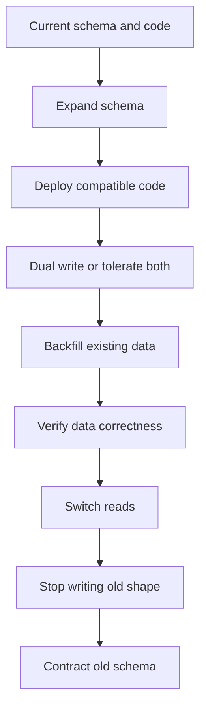

# Part 038 — Database Migration, Backfill, and Zero-Downtime Schema Evolution

> Core idea: a database migration is not a file that changes a table.  
> It is a production change protocol across schema, code, data, deployment order, rollback, observability, and customer upgrade constraints.

In enterprise Quote & Order systems, database migrations are high-risk because the database stores business commitments:

- accepted quote snapshots,
- negotiated discounts,
- approval evidence,
- order lifecycle state,
- fulfillment checkpoints,
- audit history,
- idempotency keys,
- outbox/inbox events,
- customer/account/agreement references,
- tenant-scoped operational data.

A bad migration can cause:

- application startup failure,
- long table locks,
- blocked quote/order traffic,
- invalid approval history,
- broken rolling deploys,
- failed on-prem upgrades,
- irreversible data loss,
- inconsistent old/new application behavior,
- operational repair work under pressure.

This part teaches migration as a disciplined engineering practice.

---

## 1. Source Boundary and Fact Discipline

This part uses public PostgreSQL, Flyway, and Liquibase documentation for general facts about schema changes, index creation, migration execution, repeatable migrations, and rollback concepts. It does not assume which migration tool, deployment process, rollback model, release train, database size, or on-prem upgrade path is used internally.

Official references used for this part:

- PostgreSQL `ALTER TABLE`: https://www.postgresql.org/docs/current/sql-altertable.html
- PostgreSQL `CREATE INDEX`: https://www.postgresql.org/docs/current/sql-createindex.html
- PostgreSQL explicit locking: https://www.postgresql.org/docs/current/explicit-locking.html
- PostgreSQL `pg_stat_progress_create_index`: https://www.postgresql.org/docs/current/progress-reporting.html
- Flyway migrations: https://documentation.red-gate.com/fd/migrations-271585107.html
- Flyway repeatable migrations: https://documentation.red-gate.com/fd/repeatable-migrations-273973335.html
- Liquibase rollback concepts: https://docs.liquibase.com/secure/user-guide-5-1-1/what-is-a-rollback

Internal details that must be verified:

- migration tool used internally,
- migration execution timing,
- whether migrations run at app startup, pipeline stage, or manual DBA step,
- cloud vs on-prem migration process,
- maximum acceptable lock time,
- rollback policy,
- backup/restore policy,
- release train and customer upgrade model,
- database size and largest tables,
- historical migration incidents,
- feature flag and dual-write conventions,
- data repair approval process.

---

## 2. Mental Model: Schema Evolution Is a Distributed Change

A database schema change affects more than the database.

It affects:

```text
old application version
new application version
running transactions
background workers
Kafka consumers
outbox relays
batch jobs
ad hoc support scripts
read replicas
analytics extracts
customer-specific adapters
on-prem upgrade packages
rollback procedure
```

Therefore a migration must be compatible with time.

At some point during deployment, the system may have:

```text
old code + old schema
old code + expanded schema
old code + partially backfilled data
new code + expanded schema
new code + dual-written data
new code + contracted schema
```

A safe migration plan explicitly defines which combinations are allowed.

Bad migration thinking:

```text
I changed the entity and added a column. Done.
```

Production migration thinking:

```text
Which deployed versions can read/write this schema?
Which data exists before and after backfill?
What locks will this acquire?
How do we verify correctness?
What happens if we roll back code after migration?
How do on-prem customers apply this safely?
What dashboard tells us migration health?
```

---

## 3. Categories of Database Change

Not all migrations have the same risk.

| Change type | Example | Risk |
|---|---|---|
| Add nullable column | `approval_reason text null` | usually low, but table lock still matters |
| Add column with default | `created_by text not null default 'system'` | may rewrite or validate depending DB/version/form |
| Add index | search/worker index | can block writes unless concurrent strategy used |
| Add constraint | unique idempotency key | validation may scan table and block |
| Rename column | `state` to `lifecycle_state` | high compatibility risk |
| Drop column | remove old price field | high rollback risk |
| Change type | `varchar` to `uuid` | high data and lock risk |
| Split table | quote item price normalization | high app/data compatibility risk |
| Merge fields | new canonical customer ref | semantic risk |
| Backfill | populate snapshot column | performance and correctness risk |
| Data correction | repair invalid state | audit and rollback risk |

A senior engineer should classify migration risk before approving the PR.

---

## 4. The Expand-Contract Pattern

Most zero-downtime schema changes follow expand-contract.



### 4.1 Example: Add approval reason to quote approval

Goal: store structured approval reason.

Unsafe one-step change:

```text
1. Add NOT NULL approval_reason.
2. Deploy code that always writes it.
```

Why unsafe:

- old code may not write the column,
- existing rows have no value,
- migration may fail or block,
- rollback code may not tolerate the new constraint.

Safer sequence:

```text
1. Add nullable approval_reason column.
2. Deploy code that writes approval_reason when available but tolerates null.
3. Backfill existing approved quotes with a defensible default or derived value.
4. Verify no invalid rows remain.
5. Deploy code that requires approval_reason for new approvals.
6. Add NOT NULL constraint after validation.
7. Update dashboards/tests/docs.
```

This separates structural change, code behavior, data change, and enforcement.

---

## 5. Backward and Forward Compatibility

A migration is backward compatible if old code can keep running after the schema changes.

A migration is forward compatible if new code can tolerate old or partially migrated data.

You usually need both during rolling deploys.

### 5.1 Backward-compatible examples

Usually safer:

```text
add nullable column
add table not used by old code
add index
add optional enum value if old code tolerates unknowns
```

Usually risky:

```text
rename column
remove column
change column type
make nullable column not null
change enum semantics
change meaning of existing value
```

### 5.2 Rolling deployment compatibility matrix

Before approving a migration, fill this out:

| Schema | Old code | New code | Allowed? | Notes |
|---|---|---|---|---|
| old schema | yes | maybe | depends | new code may require column |
| expanded schema | yes | yes | yes | preferred transition state |
| partially backfilled schema | yes | yes | yes if reads tolerate null | required during backfill |
| contracted schema | no | yes | only after old code gone | final cleanup |

If the team cannot explain this matrix, the migration is not ready.

---

## 6. PostgreSQL Lock Awareness

PostgreSQL `ALTER TABLE` subforms may require different lock levels. The documentation states that `ACCESS EXCLUSIVE` is acquired unless explicitly noted otherwise, and when multiple subcommands are combined the strictest lock is used.

Practical implication:

```text
Do not assume a DDL statement is safe because it is short.
```

A statement that finishes instantly in development can block production if:

- table is large,
- long transactions are running,
- replicas lag,
- autovacuum interacts with workload,
- migration waits behind another lock,
- application traffic keeps creating conflicting locks.

### 6.1 Index creation

PostgreSQL supports `CREATE INDEX CONCURRENTLY` to build indexes without locking out writes. It takes more work, requires multiple scans, waits for relevant transactions, and cannot run inside a regular transaction block.

Safe-ish pattern:

```sql
CREATE INDEX CONCURRENTLY IF NOT EXISTS quote_tenant_state_updated_idx
ON quote (tenant_id, state, updated_at DESC, id DESC);
```

But even concurrent index builds require operational awareness:

- only one concurrent index build on a table at a time,
- it can take much longer than normal index creation,
- failure can leave invalid indexes that need cleanup,
- it may not fit tools that wrap each migration in a transaction,
- it can affect IO and vacuum behavior.

### 6.2 Avoid combining unrelated DDL

Bad:

```sql
ALTER TABLE quote
  ADD COLUMN approval_reason text,
  ALTER COLUMN state SET NOT NULL,
  DROP COLUMN legacy_price;
```

This combines low-risk and high-risk changes. The strictest lock behavior applies, and rollback/reasoning becomes harder.

Better:

```text
migration 1: add nullable column
migration 2: backfill data
migration 3: validate data
migration 4: add constraint
migration 5: later cleanup after old code is gone
```

---

## 7. Migration Tooling: Flyway, Liquibase, or Internal Process

The exact tool must be verified internally.

### 7.1 Flyway mental model

Flyway compares available migrations with migrations already applied to the database and applies pending versioned migrations in order. It also supports repeatable migrations that are reapplied when their checksum changes.

Typical file shape:

```text
V20260708_001__add_quote_approval_reason.sql
V20260708_002__backfill_quote_approval_reason.sql
R__quote_operational_views.sql
```

Important Flyway review points:

- version ordering,
- checksum immutability,
- transactional vs non-transactional migration,
- repeatable migration idempotency,
- startup migration vs pipeline migration,
- failed migration repair process.

### 7.2 Liquibase mental model

Liquibase uses changelogs/changesets and supports rollback commands/concepts. Rollback for data and structural changes still requires careful design; complex rollback is often harder than forward migration.

Important Liquibase review points:

- changeset identity,
- rollback definition,
- SQL generated by abstraction,
- database-specific behavior,
- preconditions,
- tag/date/count rollback semantics,
- audit trail of applied changes.

### 7.3 Tooling does not make a migration safe

Migration tools track and execute changes. They do not automatically guarantee:

- zero downtime,
- low lock impact,
- application compatibility,
- correct backfill semantics,
- safe rollback,
- tenant isolation,
- production-scale performance.

Those are engineering responsibilities.

---

## 8. Backfill Design

Backfill means populating or correcting existing data.

A backfill must be:

- resumable,
- idempotent,
- throttled,
- observable,
- tenant-aware,
- bounded in transaction size,
- safe under concurrent writes,
- auditable when business data changes.

### 8.1 Bad backfill

```sql
UPDATE quote
SET approval_reason = 'Migrated'
WHERE state = 'APPROVED';
```

This may:

- update millions of rows in one transaction,
- create table bloat,
- hold locks too long,
- overload WAL/replication,
- hide tenant/customer-specific semantics,
- provide poor audit evidence,
- be impossible to resume cleanly.

### 8.2 Better chunked backfill

```sql
UPDATE quote
SET approval_reason = 'Migrated from legacy approval note',
    updated_at = updated_at
WHERE tenant_id = :tenant_id
  AND approval_reason IS NULL
  AND state = 'APPROVED'
  AND id > :last_seen_id
ORDER BY id
LIMIT :batch_size;
```

PostgreSQL does not directly support `ORDER BY/LIMIT` in plain `UPDATE` in the same way as `SELECT`, so the production form often uses a CTE:

```sql
WITH batch AS (
  SELECT id
  FROM quote
  WHERE tenant_id = :tenant_id
    AND approval_reason IS NULL
    AND state = 'APPROVED'
    AND id > :last_seen_id
  ORDER BY id
  LIMIT :batch_size
)
UPDATE quote q
SET approval_reason = 'Migrated from legacy approval note'
FROM batch b
WHERE q.id = b.id;
```

### 8.3 Backfill metadata

Track progress explicitly:

```text
backfill_name
tenant_id
started_at
last_processed_key
rows_processed
rows_failed
status
error_summary
completed_at
```

Do not rely only on logs.

### 8.4 Verification queries

Every backfill needs verification:

```sql
SELECT tenant_id, count(*)
FROM quote
WHERE state = 'APPROVED'
  AND approval_reason IS NULL
GROUP BY tenant_id;
```

Verification should be part of release readiness, not an afterthought.

---

## 9. Dual Write and Read Switch

For structural changes, new code may need to write both old and new shape.

Example: moving price snapshot from inline columns to a normalized table.

Phase 1: expand

```text
add quote_price_snapshot table
old inline price columns remain
```

Phase 2: dual write

```text
new code writes inline price columns and quote_price_snapshot
old code still reads inline columns
```

Phase 3: backfill

```text
existing quotes get quote_price_snapshot rows
```

Phase 4: read switch

```text
new code reads quote_price_snapshot but can fall back to inline columns
```

Phase 5: stop old write

```text
new code writes only normalized table after all consumers migrated
```

Phase 6: contract

```text
drop inline columns after rollback window closes
```

Dual write is not free. It introduces failure modes:

- old field written but new field missing,
- new field written but old field stale,
- event built from wrong source,
- rollback code reads stale old shape,
- backfill overwrites concurrent update.

Mitigate with:

- transaction boundary,
- reconciliation query,
- consistency metric,
- feature flag,
- read fallback,
- explicit cutoff condition.

---

## 10. Constraint Rollout

Constraints are valuable because they make illegal states impossible or detectable.

But constraints on large existing tables can be operationally expensive.

Examples:

```sql
ALTER TABLE quote
ADD CONSTRAINT quote_state_valid
CHECK (state IN ('DRAFT', 'PENDING_APPROVAL', 'APPROVED', 'ACCEPTED', 'ORDERED', 'EXPIRED'));
```

For large tables, consider staged validation where PostgreSQL supports it:

```sql
ALTER TABLE quote
ADD CONSTRAINT quote_state_valid
CHECK (state IN ('DRAFT', 'PENDING_APPROVAL', 'APPROVED', 'ACCEPTED', 'ORDERED', 'EXPIRED'))
NOT VALID;

ALTER TABLE quote
VALIDATE CONSTRAINT quote_state_valid;
```

This separates adding the constraint definition from validating existing rows.

Use constraints for:

- idempotency uniqueness,
- tenant-scoped uniqueness,
- legal state values,
- non-negative monetary amounts,
- required foreign keys when operationally acceptable,
- relationship integrity.

Do not use constraints blindly when:

- external data source is unreliable,
- migration history contains invalid data requiring cleanup,
- constraint validation would block production,
- lifecycle semantics require temporary intermediate states.

---

## 11. Rename and Drop Are Not Simple

Renaming a column looks clean in code. It is risky in production.

Unsafe:

```sql
ALTER TABLE quote RENAME COLUMN state TO lifecycle_state;
```

Why risky:

- old code breaks immediately,
- rollback code may fail,
- SQL scripts break,
- BI/support queries break,
- customer-specific integrations may break,
- on-prem upgrade order becomes fragile.

Safer pattern:

```text
1. Add lifecycle_state nullable.
2. Write both state and lifecycle_state.
3. Backfill lifecycle_state from state.
4. Read lifecycle_state with fallback.
5. Switch all consumers.
6. Stop writing state.
7. Drop state after long compatibility window.
```

Dropping columns should usually be delayed until:

- all app versions are migrated,
- rollback window has passed,
- on-prem supported versions no longer need the column,
- support scripts are updated,
- reports/adapters are verified,
- database backups/restores are considered.

---

## 12. Enum and State Evolution

Quote/order states are business contract values.

Adding a new state is not only a database change.

It affects:

- API responses,
- UI rendering,
- search filters,
- approval workflow,
- state transition guards,
- Kafka event consumers,
- reporting,
- operational dashboards,
- customer integrations,
- TMF state mapping,
- audit interpretation.

Migration checklist for new state:

```text
1. Add state to domain enum or state table.
2. Add API compatibility handling.
3. Verify old consumers tolerate unknown value.
4. Add database constraint update if applicable.
5. Add transition tests.
6. Add dashboard classification.
7. Add alert/runbook behavior.
8. Update TMF mapping if exposed.
9. Update data repair scripts.
```

If old consumers do not tolerate unknown enum values, adding a value can be a breaking API change.

---

## 13. Application Startup Migrations vs Pipeline Migrations

Some tools allow migrations to run at application startup. This can be convenient but risky for large enterprise deployments.

Startup migration benefits:

- simple local development,
- app and schema version move together,
- fewer manual steps.

Startup migration risks:

- multiple pods race to migrate,
- app startup blocked by long DDL,
- failed migration prevents service startup,
- `CREATE INDEX CONCURRENTLY` may not fit transactional startup migration,
- on-prem operators lose control,
- rollback becomes confusing.

Pipeline/manual migration benefits:

- controlled timing,
- DBA review,
- preflight checks,
- separate monitoring,
- easier for large tables.

Pipeline/manual migration risks:

- schema/code drift,
- more coordination,
- missed step risk,
- environment mismatch.

There is no universal answer. The decision must match deployment model, table sizes, customer constraints, and operational maturity.

---

## 14. On-Prem and Customer Upgrade Constraints

On-prem changes are harder than SaaS changes because the provider may not fully control:

- upgrade timing,
- database size,
- hardware capacity,
- maintenance window,
- backup procedure,
- operator skill,
- network access,
- observability stack,
- air-gapped constraints,
- customer-specific integrations.

A migration that is fine in managed cloud may be unacceptable on-prem.

For on-prem readiness, provide:

```text
preflight check SQL
estimated runtime by row count
disk/WAL growth warning
lock risk notes
backup requirement
rollback notes
resume procedure
verification queries
known failure messages
support escalation path
```

Do not assume all customers upgrade continuously. Some may jump across multiple versions.

That means migrations must be tested as a chain, not only one release at a time.

---

## 15. Migration Testing Strategy

### 15.1 Fresh install test

Can a new environment start from empty DB and apply all migrations?

### 15.2 Upgrade test

Can a database from previous version upgrade to current version?

### 15.3 Multi-version upgrade test

Can a customer skip versions and still upgrade safely if supported?

```text
v1 -> v5
v2 -> v5
v3 -> v5
v4 -> v5
```

### 15.4 Rolling deploy compatibility test

Test old and new app versions against expanded schema.

### 15.5 Backfill test

Use production-like data volume and distribution.

Check:

- runtime,
- lock behavior,
- WAL growth,
- row counts,
- resume behavior,
- failure recovery,
- verification queries.

### 15.6 Rollback/roll-forward test

For many data migrations, rollback is not truly safe. In those cases, document roll-forward recovery.

Rollback testing should answer:

```text
Can old app run after migration?
Can old app run after new code wrote new data?
Can data be restored without losing accepted quotes/orders?
Do we need a repair script instead of rollback?
```

---

## 16. Observability During Migration

A migration should have telemetry.

Useful metrics:

```text
migration.started
migration.completed
migration.failed
migration.duration
migration.rows_processed
migration.rows_remaining
migration.batch.duration
migration.batch.error
migration.lock_wait
migration.replica_lag
migration.db_cpu
migration.db_io
migration.wal_growth
```

Useful logs:

```text
migration_name
schema_version
tenant_id
batch_start_key
batch_end_key
rows_updated
elapsed_ms
retry_count
error_code
```

Useful dashboards:

- migration progress,
- database lock waits,
- slow queries,
- replication lag,
- application error rate,
- Kafka consumer lag,
- order/quote funnel metrics,
- support ticket spike.

A migration can succeed technically while hurting the business. Watch both technical and business signals.

---

## 17. Rollback vs Roll-Forward

Rollback is attractive but often misleading.

Schema-only rollback may be simple:

```text
drop newly added index
remove newly added nullable column if unused
```

Data migration rollback is harder:

```text
split field into two fields
merge duplicate customer references
normalize price snapshots
rewrite quote state values
```

For accepted quotes and orders, destructive rollback can violate audit expectations.

A safer production posture:

```text
1. Prefer backward-compatible expand steps.
2. Keep rollback code path alive during rollout.
3. Avoid destructive contract steps until safe.
4. Use feature flags for behavior switch.
5. For data mistakes, use audited repair/roll-forward scripts.
```

Rollback plan must say exactly:

- what is rolled back,
- what is not rolled back,
- what data remains changed,
- whether old code can tolerate it,
- whether customer-visible behavior changes,
- who approves the action.

---

## 18. Migration PR Template

Every non-trivial migration PR should answer:

```text
Problem:
Business reason:
Tables affected:
Estimated row count:
DDL statements:
DML/backfill statements:
Expected lock behavior:
Expected runtime:
Application compatibility:
Old code compatibility:
New code compatibility:
Rolling deployment sequence:
Backfill plan:
Verification queries:
Rollback or roll-forward plan:
Observability:
On-prem notes:
Security/tenant impact:
Test evidence:
```

This should not be bureaucracy. It is how the team prevents high-impact incidents.

---

## 19. Example Migration Plan: Add Idempotency Key to Product Order Creation

Goal: prevent duplicate product order creation from client retry.

### 19.1 Expand schema

```sql
ALTER TABLE product_order
ADD COLUMN idempotency_key text;
```

### 19.2 Add partial unique index concurrently

```sql
CREATE UNIQUE INDEX CONCURRENTLY product_order_tenant_idempotency_key_uq
ON product_order (tenant_id, idempotency_key)
WHERE idempotency_key IS NOT NULL;
```

### 19.3 Deploy compatible code

New code:

- accepts idempotency key,
- writes it for new requests,
- handles unique violation by returning existing order result if safe,
- tolerates null for old orders.

Old code:

- can still create rows with null idempotency key,
- does not break on new column.

### 19.4 Verify

```sql
SELECT tenant_id, idempotency_key, count(*)
FROM product_order
WHERE idempotency_key IS NOT NULL
GROUP BY tenant_id, idempotency_key
HAVING count(*) > 1;
```

### 19.5 Contract later

Only after all clients/services provide idempotency keys and historical nulls are acceptable or handled:

- enforce requirement at API/application layer first,
- consider database constraint only when safe,
- document old order behavior.

---

## 20. Example Migration Plan: Normalize Quote Price Snapshot

Goal: move from inline quote price columns to a separate snapshot table.

### Phase A — Expand

```sql
CREATE TABLE quote_price_snapshot (
  id uuid PRIMARY KEY,
  tenant_id text NOT NULL,
  quote_id uuid NOT NULL,
  quote_version bigint NOT NULL,
  currency text NOT NULL,
  total_recurring_amount numeric(19, 4) NOT NULL,
  total_non_recurring_amount numeric(19, 4) NOT NULL,
  payload jsonb NOT NULL,
  created_at timestamptz NOT NULL DEFAULT now()
);

CREATE INDEX CONCURRENTLY quote_price_snapshot_quote_idx
ON quote_price_snapshot (tenant_id, quote_id, quote_version);
```

### Phase B — Dual write

When pricing is calculated:

```text
write old inline price fields
write new quote_price_snapshot row
write snapshot reference on quote if compatible
```

### Phase C — Backfill

For existing quotes:

```text
read inline fields
construct snapshot row
insert if not exists
record progress
verify counts
```

### Phase D — Read switch

New code reads snapshot table, with fallback to inline fields during transition.

### Phase E — Contract

After compatibility window:

```text
remove fallback
stop writing inline fields
drop inline fields only after rollback/on-prem support window closes
```

Key risks:

- price meaning changes during migration,
- snapshot not reproducible if catalog changed,
- rounding/currency behavior changes,
- quote acceptance reads old/new price inconsistently,
- reporting reads different source.

Mitigation:

- immutable payload,
- verification checksums,
- dual-read comparison metrics,
- no contract step until discrepancy is zero or explained.

---

## 21. Failure Modes and Detection

| Failure mode | How it happens | Detection | Prevention |
|---|---|---|---|
| Long table lock | DDL requires strong lock on hot table | Lock wait dashboard, blocked queries | preflight, staged DDL, maintenance window |
| Old app breaks | schema change not backward compatible | rolling deploy test | expand-contract |
| New app reads null | backfill incomplete | null/error metric | tolerate partial migration, verify |
| Failed concurrent index | interrupted index build | invalid index check | cleanup procedure, monitor progress |
| Backfill overload | huge update transaction | DB CPU/IO/WAL spike | chunk, throttle, resume |
| Data corruption | wrong transformation rule | verification query, checksum | dry run, sampling, peer review |
| Duplicate records | backfill not idempotent | unique violation, count mismatch | upsert/unique key, progress table |
| Rollback impossible | destructive migration too early | rollback test fails | delay contract step |
| On-prem upgrade failure | customer skips versions or lacks capacity | support tickets | upgrade matrix, preflight checks |
| Audit gap | data repair not traceable | audit review | repair log, approval workflow |

---

## 22. Senior Engineer PR Review Checklist

### Risk classification

- What category of migration is this?
- Is it additive, destructive, semantic, or data-transforming?
- Which tables and row counts are affected?
- Is this hot-path quote/order/catalog data?

### Compatibility

- Can old code run after the migration?
- Can new code run before the backfill completes?
- Is rolling deployment safe?
- Is rollback realistic?
- Are on-prem skipped-version upgrades considered?

### PostgreSQL behavior

- What locks will be acquired?
- Is `CREATE INDEX CONCURRENTLY` needed?
- Does the migration tool wrap the statement in a transaction?
- Is the table large enough to require a special plan?
- Are constraints validated safely?

### Backfill

- Is it chunked?
- Is it resumable?
- Is it idempotent?
- Is it tenant-aware?
- Does it avoid long transactions?
- Are verification queries included?

### Application behavior

- Is there dual-write or fallback read?
- Is behavior feature-flagged if needed?
- Are API/event contracts affected?
- Are state machines and invariants updated?
- Are old enum values and new enum values handled?

### Observability and operations

- Is migration progress visible?
- Are lock waits/DB load monitored?
- Is there a runbook?
- Is there a rollback or roll-forward plan?
- Is support/customer communication needed?

### Testing

- Is fresh install tested?
- Is upgrade tested?
- Is rollback/roll-forward tested?
- Is production-like data volume tested?
- Are old/new app compatibility tests included?

---

## 23. Internal Verification Checklist

During onboarding, find out:

- which migration tool is used,
- where migration files live,
- naming/versioning convention,
- who reviews migrations,
- whether DBA approval is required,
- whether migrations run automatically,
- whether app startup can run migrations,
- how cloud and on-prem differ,
- largest database tables,
- historical migration failures,
- production lock wait dashboards,
- schema drift detection,
- rollback policy,
- backup and restore policy,
- customer upgrade matrix,
- feature flag policy for schema changes,
- data repair script process,
- audit requirement for correction scripts,
- how migration tests are run in CI.

Questions to ask:

```text
1. What was the most painful migration incident in this product?
2. Which tables are considered too risky for casual DDL?
3. Are there customers with very large quote/order tables?
4. Do on-prem deployments run the same migration flow as cloud?
5. How do we test skipped-version upgrades?
6. Who approves data repair scripts?
7. Can migration scripts be rerun safely?
8. What is our policy on dropping columns?
9. How long must old schema compatibility be preserved?
10. How do we monitor migration progress and DB locks?
```

---

## 24. Practical Exercise

Pick one migration from recent history and reconstruct the migration protocol:

```text
Migration name:
Business reason:
Tables affected:
Type of change:
Was it expand-contract?
Was old code compatible?
Was new code tolerant of partial data?
Was there a backfill?
How was progress tracked?
What indexes/constraints were added?
What locks were expected?
What tests covered it?
What would rollback have meant?
Any production issue or support ticket?
What would you improve?
```

Then design a migration for this scenario:

```text
Need to add order cancellation reason with required reason for all future cancellations,
but historical cancelled orders do not have reason.
```

A good answer should include:

- nullable column first,
- application-level requirement for future cancellations,
- historical backfill or explicit legacy marker,
- verification query,
- later constraint only if truly required,
- API/event compatibility handling,
- audit update,
- dashboard/report update,
- rollback/roll-forward plan.

---

## 25. Key Takeaways

- Database migration is production change management.
- Additive schema change is safer than destructive change, but still needs lock awareness.
- Expand-contract is the default mental model for zero-downtime evolution.
- Backfills must be resumable, idempotent, throttled, observable, and tenant-aware.
- `CREATE INDEX CONCURRENTLY` reduces write blocking but has its own operational costs and restrictions.
- Old/new application compatibility matters during rolling deployments.
- Rollback is often harder than roll-forward for data changes.
- On-prem upgrades require extra discipline around runtime, capacity, and skipped versions.
- Migration PRs need evidence: lock analysis, compatibility plan, verification queries, and operational runbook.
- Senior engineers treat schema changes as architecture decisions, not incidental SQL files.

