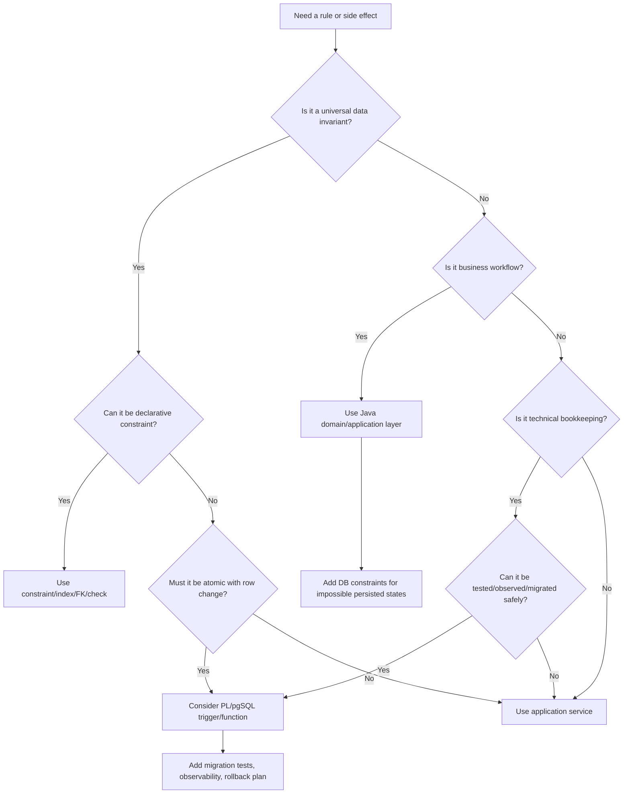

# Part 039 — PL/pgSQL and Database-Side Logic: When It Helps and When It Hurts

> Core idea: database-side logic is not automatically bad.  
> The mistake is hiding business behavior where engineers, tests, observability, deployment pipelines, and incident responders cannot reason about it.

In Quote & Order systems, PostgreSQL is often the most authoritative place for business state:

- quote status,
- accepted quote snapshot,
- order lifecycle,
- approval evidence,
- fulfillment checkpoint,
- tenant boundary,
- outbox/inbox dedupe,
- integration attempt history,
- audit trail.

That naturally creates pressure to put logic inside the database.

Sometimes that is correct.

For example:

- enforcing impossible states,
- recording append-only audit evidence,
- maintaining technical timestamps,
- protecting data from every writer path,
- implementing small atomic operations that must happen with the row change.

Sometimes it is harmful.

For example:

- hiding CPQ pricing logic in triggers,
- performing downstream HTTP calls from database functions,
- using triggers to mutate lifecycle state implicitly,
- encoding tenant authorization inside opaque procedural code,
- creating behavior that application tests cannot see,
- introducing migration ordering hazards.

This part gives you a decision framework.

The goal is not to avoid PL/pgSQL. The goal is to know when database-side logic strengthens correctness and when it becomes invisible architecture debt.

---

## 1. Source Boundary and Fact Discipline

This part uses official PostgreSQL documentation for PL/pgSQL, trigger functions, stored procedures/functions, triggers, constraints, and locking behavior. PostgreSQL supports PL/pgSQL as a procedural language, and PL/pgSQL can define trigger functions invoked by data-change or event triggers.

Official references used for this part:

- PostgreSQL PL/pgSQL: https://www.postgresql.org/docs/current/plpgsql.html
- PostgreSQL trigger functions: https://www.postgresql.org/docs/current/plpgsql-trigger.html
- PostgreSQL `CREATE TRIGGER`: https://www.postgresql.org/docs/current/sql-createtrigger.html
- PostgreSQL `CREATE FUNCTION`: https://www.postgresql.org/docs/current/sql-createfunction.html
- PostgreSQL `CREATE PROCEDURE`: https://www.postgresql.org/docs/current/sql-createprocedure.html
- PostgreSQL constraints: https://www.postgresql.org/docs/current/ddl-constraints.html
- PostgreSQL explicit locking: https://www.postgresql.org/docs/current/explicit-locking.html

This part does not assume CSG internal usage of PL/pgSQL, triggers, stored procedures, audit triggers, or database-side validation.

Internal details that must be verified:

- whether PL/pgSQL is used in the Quote & Order codebase,
- whether trigger-based audit exists,
- whether lifecycle state is mutated by triggers,
- whether stored procedures are part of public upgrade contracts,
- whether DBAs own any production database functions,
- whether migration review includes function/trigger review,
- whether application tests exercise database-side behavior,
- whether observability captures database-side failures.

---

## 2. Mental Model: Database Logic Is a Second Runtime

When logic runs in PostgreSQL, it runs in a different runtime from Java.

That means it has different:

- deployment mechanism,
- language semantics,
- observability surface,
- debugging workflow,
- test strategy,
- ownership model,
- rollback story,
- performance profile,
- failure mode.

A trigger is not just a small helper.

It is implicit code that executes because another statement happened.

A function is not just reusable SQL.

It is executable behavior with lifecycle, privileges, migration versioning, runtime cost, and failure semantics.

A stored procedure is not just a convenience wrapper.

It may become an API between application and database.

The first senior-engineering question is:

> If this behavior fails at 02:00 during a production incident, will the team know it exists, know how to observe it, and know how to repair or roll it back?

If the answer is no, the logic is probably misplaced or under-governed.

---

## 3. The Three Classes of Database-Side Logic

Do not treat all database logic equally.

There are three broad classes.

### 3.1 Integrity enforcement

This protects the database from invalid state.

Examples:

- primary keys,
- foreign keys,
- unique constraints,
- check constraints,
- exclusion constraints,
- generated columns,
- simple validation functions,
- row-level tenant constraints where applicable.

This is usually good when the rule is universal and cheap.

Example:

```sql
ALTER TABLE quote
ADD CONSTRAINT quote_status_valid
CHECK (status IN ('DRAFT', 'PENDING_APPROVAL', 'APPROVED', 'ACCEPTED', 'ORDERED', 'EXPIRED', 'CANCELLED'));
```

This does not replace the Java domain model. It protects the system from every write path.

### 3.2 Derived technical bookkeeping

This maintains technical metadata.

Examples:

- `updated_at`,
- audit row creation,
- outbox row creation,
- normalized search column,
- denormalized read-model maintenance,
- last transition timestamp.

This can be acceptable if:

- behavior is simple,
- behavior is deterministic,
- behavior is documented,
- tests cover it,
- migration order is safe,
- performance is measured.

### 3.3 Business workflow logic

This changes business meaning.

Examples:

- quote approval decision,
- pricing recalculation,
- discount eligibility,
- order decomposition,
- fulfillment retry decision,
- order cancellation rules,
- tenant access policy,
- customer agreement resolution.

This is usually dangerous in database-side logic unless there is a very deliberate reason.

Business workflow logic usually belongs in application/domain/service layer because it needs:

- explicit command handling,
- actor attribution,
- authorization,
- observability,
- domain events,
- testability,
- feature flagging,
- clear rollback,
- reviewability by application engineers.

---

## 4. Decision Framework

Use this framework before adding PL/pgSQL, trigger, or stored procedure logic.

| Question | If yes | If no |
|---|---|---|
| Must this rule protect data from all writers? | Consider DB constraint or trigger. | Prefer application logic. |
| Is the rule stable and universal? | DB-side may be appropriate. | Prefer application logic/configuration. |
| Is it cheap and deterministic? | DB-side may be safe. | Avoid trigger/procedure unless measured. |
| Does it need actor/permission context? | Prefer application logic. | DB-side still possible. |
| Does it emit domain events? | Use application/outbox boundary carefully. | DB-side may be simpler. |
| Does it call external systems? | Do not do it in DB. | Continue evaluation. |
| Does it need feature flags/customer customization? | Prefer application logic. | DB-side possible. |
| Can it be tested in CI? | Acceptable. | Do not add it. |
| Can it be observed in production? | Acceptable. | Do not add it. |
| Can it be rolled forward safely? | Acceptable. | Redesign. |

A rule of thumb:

> Put invariants in the database. Put business decisions in the domain layer. Put integration side effects outside the database transaction, usually via outbox.

---

## 5. Good Uses of Database-Side Logic in Quote & Order Systems

### 5.1 Guarding impossible states

Example: an accepted quote must have an accepted timestamp.

```sql
ALTER TABLE quote
ADD CONSTRAINT accepted_quote_has_timestamp
CHECK (
  status <> 'ACCEPTED'
  OR accepted_at IS NOT NULL
);
```

This catches invalid writes regardless of whether they come from:

- Java service,
- migration script,
- repair script,
- manual DBA operation,
- internal admin tool,
- integration import.

But the database should not decide whether a quote may be accepted. That decision likely requires authorization, price validity, approval validity, and domain context.

### 5.2 Enforcing idempotency uniqueness

Example: prevent duplicate command processing.

```sql
CREATE UNIQUE INDEX uq_quote_command_idempotency
ON quote_command_dedup (tenant_id, idempotency_key);
```

This is exactly the kind of invariant the database is good at.

The Java service can still own the command flow:

1. validate request,
2. check permission,
3. insert dedupe key,
4. mutate aggregate,
5. insert outbox event,
6. commit transaction.

The DB constraint closes the race window.

### 5.3 Creating audit rows for low-level data mutations

A trigger can be useful for append-only technical audit if the organization accepts the trade-off.

Example simplified audit trigger:

```sql
CREATE TABLE quote_audit (
  audit_id bigserial PRIMARY KEY,
  quote_id uuid NOT NULL,
  operation text NOT NULL,
  changed_at timestamptz NOT NULL DEFAULT now(),
  old_row jsonb,
  new_row jsonb
);

CREATE OR REPLACE FUNCTION audit_quote_changes()
RETURNS trigger
LANGUAGE plpgsql
AS $$
BEGIN
  IF TG_OP = 'INSERT' THEN
    INSERT INTO quote_audit (quote_id, operation, new_row)
    VALUES (NEW.quote_id, TG_OP, to_jsonb(NEW));
    RETURN NEW;
  ELSIF TG_OP = 'UPDATE' THEN
    INSERT INTO quote_audit (quote_id, operation, old_row, new_row)
    VALUES (NEW.quote_id, TG_OP, to_jsonb(OLD), to_jsonb(NEW));
    RETURN NEW;
  ELSIF TG_OP = 'DELETE' THEN
    INSERT INTO quote_audit (quote_id, operation, old_row)
    VALUES (OLD.quote_id, TG_OP, to_jsonb(OLD));
    RETURN OLD;
  END IF;

  RETURN NULL;
END;
$$;

CREATE TRIGGER trg_audit_quote_changes
AFTER INSERT OR UPDATE OR DELETE ON quote
FOR EACH ROW
EXECUTE FUNCTION audit_quote_changes();
```

This is useful for low-level mutation evidence.

But it is not enough for business audit.

Business audit needs:

- actor,
- tenant,
- request ID,
- correlation ID,
- command name,
- reason,
- approval basis,
- before/after business meaning,
- external reference.

A row trigger usually cannot infer all of that unless the application explicitly passes context.

### 5.4 Protecting outbox atomicity

Some systems use database triggers to create outbox entries when rows change.

This can be useful if the event is a low-level persistence event.

But for domain events, be careful.

A domain event is not always equivalent to a row update.

Example:

- `quote.status = 'ACCEPTED'` is a row state.
- `QuoteAccepted` is a business event that should include command context, actor, accepted price snapshot, quote version, and causation ID.

If a trigger creates `QuoteAccepted` only because a status changed, it may miss why the transition happened and whether the event should be published.

A safer model:

```text
Java command handler owns domain event creation.
Database transaction persists aggregate + outbox atomically.
Outbox relay publishes after commit.
Database constraints protect impossible state.
```

---

## 6. Dangerous Uses of Database-Side Logic

### 6.1 Hidden state transitions

Avoid triggers like this:

```sql
-- Dangerous pattern
-- Updating approval rows implicitly changes quote status.
```

Why dangerous?

Because the application may execute:

```sql
UPDATE quote_approval SET status = 'APPROVED' WHERE approval_id = ?;
```

and unknowingly cause:

```text
quote.status -> APPROVED
outbox event maybe not emitted
business audit maybe incomplete
authorization maybe bypassed
cache maybe stale
API response maybe inconsistent
```

State transitions should usually be explicit commands.

### 6.2 Pricing logic inside PL/pgSQL

Pricing logic often depends on:

- catalog version,
- customer agreement,
- account hierarchy,
- discount stacking,
- margin policy,
- currency,
- tax assumptions,
- approval thresholds,
- feature flags,
- explainability requirements.

Putting that inside PL/pgSQL creates high testability and change-management cost.

It may be acceptable for a narrow calculation that is purely relational and shared by reporting, but not for end-to-end CPQ pricing decisions unless the architecture explicitly makes the database the pricing engine.

Internal verification is mandatory.

### 6.3 External calls from database logic

Avoid database logic that calls:

- HTTP APIs,
- message brokers,
- billing systems,
- fulfillment systems,
- identity providers,
- object stores.

Reasons:

- transaction duration becomes unbounded,
- retries become unclear,
- observability is poor,
- failure handling is awkward,
- side effects may occur before rollback,
- database connection pool can be exhausted,
- network failures become database failures.

Use outbox instead.

### 6.4 Authorization hidden in DB functions

Database functions can enforce technical access. But business authorization usually needs context:

- user,
- role,
- tenant,
- account ownership,
- approval authority,
- quote state,
- operation intent,
- request origin.

If DB-side authorization does not receive and validate this context explicitly, it can become a false sense of security.

---

## 7. Trigger Semantics You Must Understand

A PostgreSQL trigger can be attached to a table/view/foreign table and can fire before, after, or instead of an operation depending on trigger type and object type.

Important dimensions:

| Dimension | Meaning | Engineering implication |
|---|---|---|
| `BEFORE` | Runs before row operation completes | Can modify `NEW` row or reject change. |
| `AFTER` | Runs after row operation | Good for audit/outbox-like side effects inside same transaction. |
| `INSTEAD OF` | Used mainly with views | Can hide write complexity. Requires careful review. |
| Row-level | Fires per affected row | Can be expensive for bulk updates. |
| Statement-level | Fires once per statement | Better for some aggregate side effects. |
| Constraint trigger | Can be deferrable | Useful for complex integrity but harder to reason about. |

A trigger runs inside the same transaction as the statement that caused it.

That is both useful and dangerous.

Useful:

- atomic audit,
- atomic validation,
- atomic derived row.

Dangerous:

- a trigger can make a simple update slow,
- a trigger failure rolls back the original statement,
- hidden locks can appear,
- bulk operations can explode in cost,
- trigger behavior may surprise migration scripts.

---

## 8. Trigger Cost Model

A trigger has cost.

For row-level triggers, cost is roughly:

```text
statement cost + rows affected × trigger function cost
```

If a migration updates 10 million rows and a row trigger writes one audit row for each row, the migration may create:

- 10 million trigger executions,
- 10 million audit rows,
- large WAL volume,
- replication lag,
- lock pressure,
- vacuum pressure,
- disk growth,
- long-running transaction risk.

For enterprise systems, this matters during:

- backfills,
- bulk imports,
- customer migrations,
- repair scripts,
- catalog publish jobs,
- reconciliation jobs,
- retention cleanup.

A trigger that is harmless in unit tests may be expensive in production.

Internal verification checklist:

- Which tables have triggers?
- Which triggers are row-level?
- Which triggers fire during backfill?
- Are triggers disabled or bypassed for maintenance jobs?
- Is that bypass audited?
- How much WAL does the trigger generate?
- Does the trigger query other large tables?
- Does it acquire additional locks?

---

## 9. PL/pgSQL Error Handling and Failure Semantics

PL/pgSQL can raise exceptions.

Example:

```sql
RAISE EXCEPTION 'Illegal quote state transition from % to %', OLD.status, NEW.status
  USING ERRCODE = 'check_violation';
```

This aborts the current transaction unless handled.

That can be useful for invariant enforcement.

But be careful with error taxonomy.

A Java API should not expose raw database errors directly as user-facing messages.

Recommended layering:

```text
PostgreSQL constraint/function error
        ↓
Java repository catches and classifies
        ↓
Application maps to domain/application error
        ↓
REST layer returns stable error contract
        ↓
Logs include internal SQL error details with correlation ID
```

Bad pattern:

```text
DB exception text becomes public API message.
```

Why bad?

- leaks implementation,
- breaks compatibility when DB message changes,
- may expose table/column names,
- may expose tenant/customer data,
- creates translation/localization issues,
- couples API contract to DB internals.

---

## 10. Database-Side Audit vs Business Audit

This distinction is critical.

### 10.1 Database-side audit answers

- Which row changed?
- What columns changed?
- When did mutation occur?
- What operation happened?

### 10.2 Business audit answers

- Who initiated the command?
- Which tenant/account/customer was affected?
- What business operation was intended?
- Why was it allowed?
- Which approval justified it?
- Which quote version was accepted?
- Which price snapshot was committed?
- Which request/correlation caused it?
- Which downstream event was emitted?

A trigger can help capture low-level evidence, but business audit should usually be emitted explicitly from the application command boundary.

For Quote & Order, audit evidence is not cosmetic.

It is required to reconstruct commercial decisions:

- why a discount was allowed,
- why an order was cancelled,
- who overrode fallout,
- which catalog version was used,
- why a price changed,
- why an approval was invalidated.

A robust design may use both:

```text
Application business audit event
+ DB mutation audit trigger
+ outbox event trace
+ request log trace
```

But each layer must have clear purpose.

---

## 11. Constraints Before Triggers

Prefer declarative constraints when possible.

Constraints are:

- easier to inspect,
- easier for planner/engine to understand,
- less hidden than procedural triggers,
- often faster,
- easier to reason about,
- less likely to contain side effects.

Use constraints for:

- `NOT NULL`,
- unique business keys,
- foreign keys where lifecycle allows,
- simple `CHECK` rules,
- exclusion constraints,
- deferrable constraints when needed.

Use triggers only when the rule cannot be expressed declaratively or when procedural behavior is intentionally required.

Example good constraint:

```sql
ALTER TABLE product_order
ADD CONSTRAINT order_completed_has_completed_at
CHECK (
  status <> 'COMPLETED'
  OR completed_at IS NOT NULL
);
```

Example trigger-worthy case:

- append to audit table on every update,
- normalize derived search vector,
- enforce cross-row invariant that cannot be represented cleanly as constraint,
- maintain a specialized summary table with careful performance review.

---

## 12. Stored Procedure vs Function vs Application Service

A simplified distinction:

| Option | Best for | Risk |
|---|---|---|
| SQL query | Data retrieval/mutation | Complex dynamic logic in app string building. |
| SQL constraint | Universal invariant | Limited expressiveness. |
| PL/pgSQL function | Reusable computation or trigger function | Hidden behavior, versioning risk. |
| Stored procedure | Controlled DB-side operation | Can become second service layer. |
| Java application service | Business workflow, auth, events, observability | Must protect against direct DB writes with constraints. |

For Quote & Order:

- Use Java service for command semantics.
- Use database constraints for non-negotiable invariants.
- Use PL/pgSQL only when database locality/atomicity clearly wins.
- Treat stored procedures as APIs if application calls them directly.

If a stored procedure becomes the primary way to submit an order, then it is part of the service contract and must have:

- versioning,
- tests,
- documentation,
- observability,
- error taxonomy,
- migration compatibility,
- rollback plan.

---

## 13. Example: Bad Hidden Quote Transition Trigger

Bad design:

```sql
CREATE OR REPLACE FUNCTION auto_accept_quote_if_approved()
RETURNS trigger
LANGUAGE plpgsql
AS $$
BEGIN
  IF NEW.status = 'APPROVED' THEN
    UPDATE quote
    SET status = 'ACCEPTED'
    WHERE quote_id = NEW.quote_id;
  END IF;
  RETURN NEW;
END;
$$;
```

Problems:

- approval is not acceptance,
- customer acceptance is missing,
- actor is missing,
- accepted timestamp may be wrong,
- quote price may be stale,
- quote may already be expired,
- domain event may be missing,
- authorization may be bypassed,
- API caller does not know transition happened,
- tests may not cover it,
- state machine becomes invisible.

Better design:

```text
ApproveQuoteCommand -> QuoteApproved
AcceptQuoteCommand -> QuoteAccepted
ConvertQuoteToOrderCommand -> OrderCreated
```

Each command has explicit guards and audit.

The database can still enforce:

```sql
CHECK (status <> 'ACCEPTED' OR accepted_at IS NOT NULL)
```

---

## 14. Example: Good Database Constraint Plus Java Guard

Java command guard:

```java
public void accept(Actor actor, Instant now) {
    requireState(QuoteStatus.APPROVED);
    requireNotExpired(now);
    requirePriceSnapshotStillValid();
    requireActorCanAccept(actor);

    this.status = QuoteStatus.ACCEPTED;
    this.acceptedAt = now;
    this.acceptedBy = actor.id();
    this.version = this.version.next();

    recordEvent(new QuoteAccepted(this.id, this.version, actor.id(), now));
}
```

Database protection:

```sql
ALTER TABLE quote
ADD CONSTRAINT quote_accepted_requires_actor_and_time
CHECK (
  status <> 'ACCEPTED'
  OR (accepted_at IS NOT NULL AND accepted_by IS NOT NULL)
);
```

This is a strong combination:

- Java owns business decision.
- Database prevents impossible persisted state.
- Outbox records domain event.
- Audit records command evidence.

---

## 15. Search Path, Privileges, and Security Definer Risk

Database functions can run with caller privileges or definer privileges depending on configuration.

Security-definer functions are powerful and dangerous.

Risk examples:

- privilege escalation,
- unsafe `search_path`,
- SQL injection in dynamic SQL,
- bypassing row/tenant restrictions,
- accidental access to protected tables,
- unexpected behavior after schema changes.

Guidelines:

- avoid `SECURITY DEFINER` unless required,
- lock down `search_path`,
- use parameter binding for dynamic SQL,
- restrict execute grants,
- review function owner,
- test with least-privilege roles,
- document why elevated privilege is required.

In multi-tenant Quote & Order systems, database privilege mistakes can become data isolation failures.

---

## 16. Dynamic SQL in PL/pgSQL

Dynamic SQL can be necessary for generic maintenance functions, partition operations, or metadata-driven scripts.

But it has injection risk and review cost.

Bad pattern:

```sql
EXECUTE 'SELECT * FROM ' || table_name || ' WHERE id = ' || id;
```

Better pattern:

```sql
EXECUTE format('SELECT * FROM %I WHERE id = $1', table_name)
USING id;
```

For production code:

- avoid user-controlled object names,
- quote identifiers with `%I`,
- quote literals with `%L` only when needed,
- prefer `USING` for values,
- keep functions small,
- test malicious input,
- restrict who can call function.

---

## 17. Observability for Database-Side Logic

Database-side logic often lacks application-level telemetry.

You need compensating controls.

Minimum observability questions:

- How do we know a trigger is slow?
- How do we know a function fails frequently?
- How do we trace a function failure to request ID?
- How do we inspect database notices/errors?
- How do we see trigger-induced writes?
- How do we see lock waits caused by function logic?
- How do we correlate DB audit rows to API request?

Possible mechanisms:

- structured business audit from application,
- correlation ID stored in session variable before mutation,
- `application_name` set by service,
- slow query logging,
- `pg_stat_statements`,
- lock wait dashboards,
- trigger/function inventory,
- explicit audit columns,
- DB migration changelog.

Example session context pattern:

```sql
SELECT set_config('app.correlation_id', ?, true);
SELECT set_config('app.actor_id', ?, true);
```

Then trigger can read:

```sql
current_setting('app.correlation_id', true)
```

This pattern must be used carefully:

- ensure connection pooling does not leak values,
- use transaction-local setting,
- clear or override each transaction,
- test missing context,
- do not trust it as authorization by itself.

---

## 18. Testing Strategy

Database-side logic needs tests.

Not optional.

### 18.1 Unit-like SQL tests

Useful for small functions:

- input/output behavior,
- edge cases,
- null behavior,
- error behavior.

### 18.2 Integration tests with Testcontainers

For Java + PostgreSQL:

- apply migrations,
- execute repository command,
- verify trigger behavior,
- verify constraints,
- verify error mapping,
- verify transaction rollback,
- verify audit/outbox rows.

Example test intent:

```text
Given quote is APPROVED
When repository tries to persist ACCEPTED quote without accepted_at
Then database rejects it
And API maps the failure to internal error or domain validation failure appropriately
```

### 18.3 Migration tests

Required when functions/triggers change.

Test:

- fresh install,
- upgrade from previous schema,
- rollback/roll-forward path,
- trigger behavior after migration,
- backfill interaction,
- large table behavior if relevant.

### 18.4 Performance tests

Needed for row-level triggers on large tables.

Test:

- bulk update cost,
- audit row growth,
- WAL impact,
- lock duration,
- query plans inside trigger,
- replication lag risk.

---

## 19. Migration and Versioning of Functions/Triggers

Functions and triggers are schema objects.

They require the same discipline as tables.

Risks:

- old app calls new function with old expectations,
- new app calls old function during rolling deploy,
- trigger changes behavior during backfill,
- function replacement changes error messages,
- procedure signature changes break app startup,
- rollback leaves incompatible function body.

Guidelines:

- prefer additive changes,
- avoid changing function signature in place if used by app,
- version procedure/function names if contract changes,
- deploy compatibility before behavior switch,
- document function ownership,
- test old app/new DB and new app/old DB where rolling deploy matters,
- include function/trigger inventory in release review.

Example expand-contract approach:

```text
1. Add new nullable column.
2. Update function to tolerate both old and new column.
3. Deploy app writing new column.
4. Backfill old rows.
5. Add constraint.
6. Remove old behavior later.
```

---

## 20. PL/pgSQL in On-Prem and Customer Upgrade Context

On-prem deployments make database-side logic riskier.

Reasons:

- customers may have different PostgreSQL versions,
- DBAs may inspect or modify objects,
- upgrade windows may be short,
- data volumes vary widely,
- rollback may be manual,
- customer-specific scripts may exist,
- support engineers need diagnostic clarity.

For on-prem compatibility:

- avoid relying on version-specific features unless supported matrix says so,
- include migration pre-checks,
- produce clear failure messages,
- document function/trigger changes in release notes,
- provide validation queries,
- test upgrade from realistic historical versions,
- ensure repair scripts know trigger behavior.

Internal verification checklist:

- supported PostgreSQL versions,
- managed vs customer-managed DB,
- whether customers can modify schema,
- upgrade tooling,
- DBA runbook,
- function compatibility policy,
- trigger bypass policy.

---

## 21. Senior Review Checklist for PL/pgSQL and Triggers

When reviewing a PR that adds or modifies database-side logic, ask:

### Purpose

- What invariant or behavior is being enforced?
- Why must it live in the database?
- Is this integrity enforcement, bookkeeping, or business workflow?
- Could a declarative constraint solve it instead?

### Correctness

- Does it handle insert/update/delete correctly?
- Does it handle nulls?
- Does it handle bulk operations?
- Does it handle multi-tenant data?
- Does it preserve lifecycle invariants?
- Does it create hidden state transitions?

### Security

- Does it use dynamic SQL safely?
- Does it require `SECURITY DEFINER`?
- Are privileges restricted?
- Can it bypass tenant isolation?
- Can it leak PII in error messages/audit rows?

### Performance

- Is it row-level or statement-level?
- What happens on large backfill?
- Does it query large tables?
- Does it introduce lock waits?
- Does it increase WAL volume significantly?

### Deployment

- Is migration order safe?
- Is rolling deploy safe?
- Is rollback/roll-forward safe?
- Does it work on supported PostgreSQL versions?
- Is on-prem upgrade impacted?

### Testing

- Are there integration tests?
- Are failure cases tested?
- Are migration tests included?
- Is performance risk measured?
- Are repair scripts tested with triggers enabled?

### Observability

- Can failures be correlated to request/order/quote?
- Are errors mapped safely to API contract?
- Is slow function behavior observable?
- Are audit side effects visible?

---

## 22. Internal Verification Checklist

During onboarding, verify the following.

### Inventory

- List all functions:

```sql
SELECT n.nspname AS schema_name,
       p.proname AS function_name,
       pg_get_function_arguments(p.oid) AS arguments,
       pg_get_function_result(p.oid) AS result_type
FROM pg_proc p
JOIN pg_namespace n ON n.oid = p.pronamespace
WHERE n.nspname NOT IN ('pg_catalog', 'information_schema')
ORDER BY 1, 2;
```

- List all triggers:

```sql
SELECT event_object_schema,
       event_object_table,
       trigger_name,
       action_timing,
       event_manipulation,
       action_statement
FROM information_schema.triggers
ORDER BY 1, 2, 3;
```

### Ownership

- Who owns DB functions/triggers?
- Are they reviewed by backend engineers, DBAs, or both?
- Are they documented in architecture docs?
- Are they mentioned in runbooks?

### Runtime behavior

- Do triggers mutate business state?
- Do triggers write audit rows?
- Do triggers write outbox rows?
- Do triggers query other large tables?
- Do functions depend on session variables?

### Testing

- Are DB functions covered by tests?
- Are trigger behaviors tested with migrations?
- Are repair scripts tested with triggers enabled?
- Are bulk update/backfill effects tested?

### Production

- Are slow trigger/function queries visible?
- Are function failures visible in logs?
- Are DB-side errors mapped to stable API errors?
- Are function/trigger changes included in release notes?

---

## 23. Mermaid: Placement Decision Flow



---

## 24. Key Takeaways

- PL/pgSQL is a tool, not an anti-pattern.
- Database-side logic is a second runtime and must be governed like one.
- Prefer constraints before triggers.
- Put universal invariants near the data.
- Keep business workflow decisions explicit in the application/domain layer unless the architecture deliberately says otherwise.
- Never hide lifecycle transitions in triggers without strong justification.
- Never use database logic for external side effects.
- Business audit and row audit are different things.
- Every trigger/function needs tests, migration discipline, observability, and ownership.
- In enterprise Quote & Order systems, invisible behavior is operational risk.

