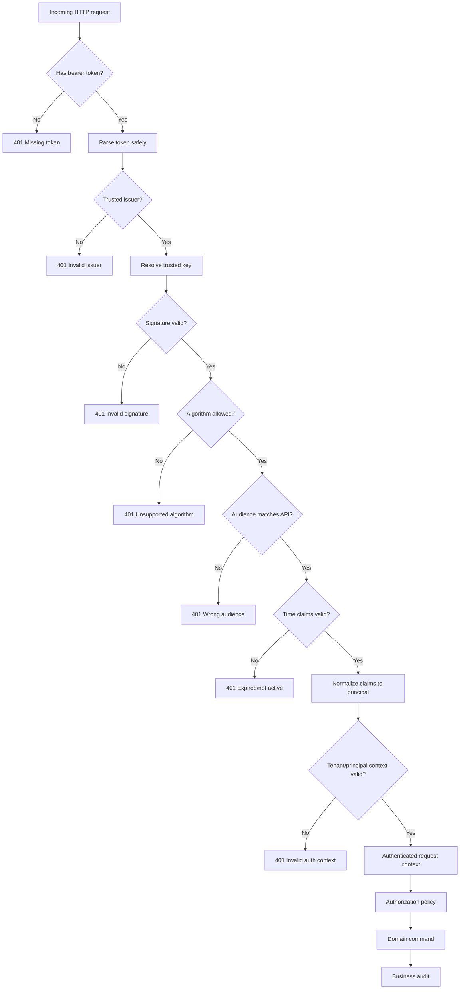

# Part 040 — OAuth2, JWT, and Enterprise Authentication Boundaries

> Core idea: authentication answers “who or what is calling?”  
> It does not automatically answer “what are they allowed to do?”

In Quote & Order systems, authentication mistakes can become business incidents.

A weak token validation path can allow:

- unauthorized quote access,
- cross-tenant data exposure,
- quote acceptance under wrong identity,
- approval action under wrong actor,
- order submission from untrusted client,
- integration spoofing,
- service-to-service impersonation,
- audit evidence corruption.

OAuth2 and JWT are often described casually:

> “The API receives a JWT, validates it, and continues.”

That is not enough.

A production-grade enterprise system must define:

- who issues tokens,
- which tokens are accepted,
- which audience they are for,
- which issuer is trusted,
- how keys are discovered and rotated,
- which claim identifies the principal,
- how tenant/account/customer scope is derived,
- how service identity differs from user identity,
- how authorization is layered after authentication,
- how audit preserves the real actor and calling chain.

This part focuses on authentication boundaries. Authorization and RBAC are covered in Part 041.

---

## 1. Source Boundary and Fact Discipline

This part uses public standards and best-current-practice references for OAuth2, JWT, OAuth2 security, JWT best practices, JWT access-token profile, and OpenID Connect.

Official references used for this part:

- OAuth 2.0 Authorization Framework, RFC 6749: https://datatracker.ietf.org/doc/html/rfc6749
- OAuth 2.0 Bearer Token Usage, RFC 6750: https://datatracker.ietf.org/doc/html/rfc6750
- JSON Web Token, RFC 7519: https://datatracker.ietf.org/doc/html/rfc7519
- JSON Web Token Best Current Practices, RFC 8725: https://datatracker.ietf.org/doc/html/rfc8725
- JWT Profile for OAuth 2.0 Access Tokens, RFC 9068: https://datatracker.ietf.org/doc/html/rfc9068
- Best Current Practice for OAuth 2.0 Security, RFC 9700: https://datatracker.ietf.org/doc/rfc9700/
- OpenID Connect Core 1.0: https://openid.net/specs/openid-connect-core-1_0.html

This part does not assume the internal CSG identity provider, gateway, authentication filter, service mesh, token format, claim naming, tenant mapping, or authorization implementation.

Internal details that must be verified:

- identity provider used per deployment,
- supported OAuth/OIDC flows,
- whether access tokens are JWT or opaque,
- trusted issuers,
- expected audiences,
- JWKS/key rotation strategy,
- service-to-service authentication model,
- tenant claim mapping,
- user/service/admin actor model,
- gateway vs service-local validation responsibility,
- audit actor propagation.

---

## 2. Authentication vs Authorization

Authentication answers:

```text
Who or what is the caller?
```

Authorization answers:

```text
May this caller perform this action on this resource in this context?
```

Do not merge them mentally.

Example:

```text
A user is authenticated as alice@example.com.
```

That does not mean Alice can:

- view all quotes,
- accept any quote,
- approve any discount,
- submit any order,
- cancel fulfillment,
- read another tenant's customer data,
- run repair operations.

Authentication establishes identity. Authorization evaluates permissions.

Bad pattern:

```java
if (jwtIsValid(request)) {
    acceptQuote(request.quoteId());
}
```

Better pattern:

```text
1. Validate token.
2. Build authenticated principal.
3. Resolve tenant and actor context.
4. Load quote metadata.
5. Authorize AcceptQuote action.
6. Execute command with actor context.
7. Persist audit evidence.
```

---

## 3. OAuth2 Mental Model

OAuth2 is an authorization framework. In API systems, OAuth2 is commonly used to issue access tokens to clients so they can call resource servers.

Simplified roles:

| Role | Meaning in enterprise API context |
|---|---|
| Resource owner | User or entity that owns/controls resource access. |
| Client | Application requesting access token. |
| Authorization server | Issues tokens after authentication/authorization. |
| Resource server | API that accepts and validates access token. |

In Quote & Order:

- the resource server is often a Quote/Order/Catalog API,
- the client may be UI, CRM adapter, partner app, internal service, batch job, or admin tool,
- the authorization server may be enterprise IdP or customer IdP,
- resource owner might be an employee, partner user, or service account depending on flow.

The API must not simply trust that a token exists.

It must validate whether this exact token is intended for this API.

---

## 4. OAuth2 Is Not Always OIDC

OpenID Connect builds identity/authentication semantics on top of OAuth2.

Important distinction:

| Token | Primary purpose | Typical consumer |
|---|---|---|
| Access token | Authorize API access | Resource server/API |
| ID token | Authenticate end-user to client | Client application |
| Refresh token | Obtain new access token | Client/authorization server |

A common mistake is using an ID token as an API access token.

For APIs, the resource server should validate access tokens according to its contract.

If the system uses OIDC, the ID token helps the client know who authenticated. The API still needs a valid access token intended for that API.

Internal verification checklist:

- Does the API accept access tokens, ID tokens, or both?
- Are ID tokens rejected at resource server boundary?
- Is `aud` validation different for UI client vs API?
- Are tokens from customer IdPs normalized?
- Are opaque tokens introspected or converted at gateway?

---

## 5. JWT Mental Model

A JWT is a compact claims container. It is often signed as a JWS.

Typical JWT structure:

```text
base64url(header).base64url(payload).base64url(signature)
```

Common claims:

| Claim | Meaning |
|---|---|
| `iss` | Issuer. Who issued the token. |
| `sub` | Subject. Who the token is about. |
| `aud` | Audience. Who the token is intended for. |
| `exp` | Expiration time. |
| `nbf` | Not before time. |
| `iat` | Issued at time. |
| `jti` | Token identifier. |
| `scope` / `scp` | OAuth scopes or permissions, depending on issuer. |
| `client_id` / `azp` | Client identity / authorized party. |
| `tenant_id` | Tenant marker, if issuer provides one. |
| `roles` / `groups` | Role/group claims, issuer-specific. |

A JWT is not secure because it is base64url encoded.

It is secure only if:

- signature is valid,
- algorithm is acceptable,
- issuer is trusted,
- audience matches API,
- expiration/time claims are valid,
- token type/use is correct,
- key source is trusted,
- claims are interpreted correctly.

---

## 6. Minimum JWT Validation Checklist

For a resource server accepting JWT access tokens, validation should include at least:

### 6.1 Parse safely

- reject malformed token,
- reject unsupported token type,
- reject unsigned tokens unless explicitly supported for a trusted internal path, which is almost never appropriate for enterprise APIs.

### 6.2 Validate algorithm

- allowlist algorithms,
- reject `none`,
- avoid algorithm confusion,
- ensure key type matches algorithm,
- do not let token header choose arbitrary trust behavior.

### 6.3 Validate signature

- resolve key from trusted JWKS or configured key set,
- validate signature cryptographically,
- handle key rotation safely,
- cache keys with sane TTL,
- fail closed when key cannot be trusted.

### 6.4 Validate issuer

- `iss` must match trusted issuer,
- multiple issuers must be explicitly configured,
- issuer must map to expected tenant/customer/deployment.

### 6.5 Validate audience

- `aud` must include this API/resource server,
- UI client audience is not enough,
- tokens for another API must be rejected.

### 6.6 Validate time claims

- `exp` not expired,
- `nbf` not in future beyond clock skew,
- `iat` reasonable if required,
- clock skew bounded.

### 6.7 Validate token purpose

- access token vs ID token,
- bearer token vs proof-of-possession token if applicable,
- user token vs service token,
- delegated token vs direct service credential.

### 6.8 Validate domain-required claims

- subject exists,
- tenant context exists or can be derived,
- client identity exists when required,
- scopes/roles are in expected format,
- account/customer constraints are derivable.

---

## 7. The Audience Validation Failure Mode

Audience validation is one of the highest-value checks.

Scenario:

```text
Token was issued for CRM API.
Attacker or misconfigured client sends it to Quote API.
Quote API validates signature and issuer only.
Quote API accepts token.
```

That is wrong.

A signature says:

```text
The issuer signed this token.
```

It does not say:

```text
This token is intended for this API.
```

The `aud` claim answers intended audience.

For enterprise Quote & Order APIs, every resource server must know its accepted audience values.

Internal verification checklist:

- What audience values does each service accept?
- Are audience values environment-specific?
- Are TMF APIs and internal APIs different audiences?
- Does gateway validate audience before routing?
- Do services revalidate audience locally?
- Are tests present for wrong-audience token rejection?

---

## 8. Issuer Trust and Multi-Customer Deployments

In enterprise product deployments, issuer trust can vary:

- CSG-managed IdP,
- customer-managed IdP,
- partner IdP,
- internal service account issuer,
- cloud provider workload identity,
- on-prem identity provider,
- test/staging issuer.

Do not accept issuer dynamically from token contents.

Bad pattern:

```text
Read iss from JWT -> download JWKS from that issuer -> trust token.
```

This is dangerous unless issuer discovery is constrained by preconfigured trust policy.

Better pattern:

```text
Deployment config lists trusted issuers.
Each issuer has allowed audiences, JWKS URI, claim mapping, tenant mapping, and key rotation policy.
```

For multi-tenant systems, issuer may map to tenant, but that mapping must be explicit.

Example:

```yaml
trustedIssuers:
  - issuer: "https://idp.customer-a.example"
    tenant: "customer-a"
    allowedAudiences:
      - "quote-order-api"
    jwksUri: "https://idp.customer-a.example/.well-known/jwks.json"
```

Internal details must be verified.

---

## 9. JWKS and Key Rotation

JWT signature validation usually depends on public keys exposed by JWKS.

Production concerns:

- key cache TTL,
- key rotation overlap,
- unknown `kid`,
- stale JWKS cache,
- failed JWKS endpoint,
- emergency key revocation,
- multiple issuers,
- algorithm/key mismatch,
- startup behavior when JWKS unavailable.

A robust system should define:

```text
On known key: validate normally.
On unknown kid: refresh JWKS once, then validate.
On JWKS unavailable: fail closed for unknown keys; use cached trusted keys for known keys if policy allows.
On key rotation: support overlap window.
On issuer config change: deploy through controlled config process.
```

Security and availability trade-off:

- fail open is unsafe,
- fail closed can cause outage if JWKS dependency fails,
- cached keys reduce dependency but may extend trust of revoked keys,
- short TTL improves revocation but increases dependency pressure.

This is not a library detail. It is an operational policy.

---

## 10. Bearer Tokens and Their Risk

A bearer token means possession is enough to use it.

If leaked, it can be replayed until expiration or revocation mechanism stops it.

Protection requirements:

- TLS everywhere,
- no tokens in logs,
- no tokens in URLs,
- short access-token lifetime,
- secure storage in clients,
- avoid forwarding user tokens unnecessarily,
- redact authorization headers,
- monitor suspicious use,
- use mTLS or proof-of-possession where required by risk model.

For Quote & Order systems, token leakage can expose:

- customer data,
- commercial pricing,
- agreement terms,
- quote documents,
- order status,
- operational fulfillment details.

Internal verification checklist:

- Are `Authorization` headers redacted in logs?
- Are tokens excluded from error reports?
- Are tokens excluded from traces?
- Are tokens ever stored in DB?
- Are tokens forwarded to downstream systems?
- Are service logs sampled safely?

---

## 11. User Identity vs Service Identity

A service can call another service for two broad reasons.

### 11.1 User-delegated call

A user initiates a request, and downstream call happens on behalf of that user.

Example:

```text
Sales user accepts quote in UI.
Quote API calls Pricing API to validate price freshness.
```

Questions:

- Should Pricing API see the user identity?
- Should it enforce user authorization?
- Should Quote API enforce all authorization before calling Pricing?
- Should audit show user, Quote API, or both?

### 11.2 Service-owned call

A service performs background work.

Example:

```text
Order orchestrator retries fulfillment task from Kafka event.
```

Questions:

- Which service identity is used?
- What permissions does it have?
- Is there a synthetic actor?
- How is causation traced to original user/order?
- Can this service operate across tenants?

A mature system distinguishes:

```text
authenticated principal = technical caller
business actor = user/service responsible for business action
causation = event/request that led to action
```

Audit should not collapse these into one string.

---

## 12. Token Propagation Anti-Patterns

### 12.1 Blind token forwarding

Bad pattern:

```text
API receives user token and forwards same token to every downstream service.
```

Risks:

- downstream service accepts token not intended for it,
- audience mismatch ignored,
- excessive privilege propagation,
- token leaks to more services,
- downstream authorization becomes inconsistent,
- service-to-service identity disappears.

Better options:

- token exchange,
- service token plus actor context,
- gateway-issued internal token,
- signed internal request context,
- explicit authorization at boundary.

The right option depends on internal architecture.

### 12.2 Trusting headers without provenance

Bad pattern:

```text
X-User-Id: alice
X-Tenant-Id: tenant-a
```

If any external caller can set these headers, the system is vulnerable.

Trusted identity headers are acceptable only when:

- set by trusted gateway,
- stripped from external requests before routing,
- protected by mTLS/network boundary,
- services know the trust boundary,
- headers are not accepted directly from the internet.

Internal verification checklist:

- Which headers carry identity context?
- Who sets them?
- Are incoming identity headers stripped at edge?
- Do services validate gateway provenance?
- Are headers signed or mTLS-protected?

---

## 13. Gateway Validation vs Service Validation

Many enterprise systems validate authentication at an API gateway.

That is useful but not always sufficient.

Gateway can handle:

- TLS termination,
- token validation,
- issuer/audience checks,
- coarse route authorization,
- rate limiting,
- request normalization,
- identity header injection.

Service should still know enough to protect itself:

- never trust unauthenticated internal traffic by accident,
- validate required actor/tenant context,
- enforce resource-level authorization,
- reject missing/invalid propagated identity,
- preserve audit evidence.

A common defensible design:

```text
Gateway validates external token and sets trusted internal context.
Service validates trusted context source and performs domain authorization.
Critical services can revalidate token or verify signed internal context.
```

Internal verification checklist:

- Is gateway the only auth validator?
- Can internal clients bypass gateway?
- Are service-to-service calls authenticated?
- Is there a service mesh?
- Are internal APIs exposed outside cluster?
- Are local dev/test bypasses safe?

---

## 14. OAuth2 Flows Relevant to Enterprise Quote & Order

Possible flows to understand. Internal usage must be verified.

### 14.1 Authorization Code + PKCE

Usually appropriate for interactive user login through browser/native app.

Used when:

- user signs in through UI,
- client receives tokens through secure flow,
- PKCE mitigates authorization code interception risk.

### 14.2 Client Credentials

Used for service-to-service or machine clients.

Examples:

- CRM adapter calls Quote API,
- batch job imports catalog,
- order orchestrator calls fulfillment adapter,
- monitoring job calls operational API.

Must not be confused with user identity.

### 14.3 Token Exchange

Used when a service needs a downstream token with changed audience/scope while preserving actor/delegation context.

Useful when:

- user token audience is API gateway,
- downstream service needs its own audience,
- you need explicit delegation chain,
- you want to avoid blind forwarding.

### 14.4 Device/ROPC/legacy flows

Legacy flows may exist in enterprise contexts but require careful review.

Avoid assuming they are safe.

Internal verification checklist:

- Which flows are allowed?
- Which flows are forbidden?
- Are public clients separated from confidential clients?
- Is PKCE required?
- Are client credentials scoped tightly?
- Are legacy flows being phased out?

---

## 15. Claims Mapping: The Hidden Architecture

Claims mapping often becomes a fragile layer.

Example claim sources:

- `sub`,
- `email`,
- `preferred_username`,
- `groups`,
- `roles`,
- `scope`,
- `scp`,
- `tenant`,
- `customer_id`,
- `account_ids`,
- `client_id`,
- `azp`.

Problems:

- different IdPs use different claim names,
- group names change,
- email is not stable identity,
- `sub` may be issuer-local,
- tenant claim may be absent,
- group explosion can make tokens too large,
- role claims may not match application permission model,
- partner/customer users may have different identity semantics.

Recommendation:

```text
Raw token claims -> normalized AuthenticatedPrincipal -> domain authorization context
```

Do not let raw JWT claims leak everywhere.

Example Java model:

```java
public record AuthenticatedPrincipal(
    PrincipalType type,
    String issuer,
    String subject,
    String clientId,
    String tenantId,
    Set<String> scopes,
    Set<String> roles,
    Instant authenticatedAt
) {}
```

Then authorization layer maps that to domain permission.

---

## 16. Tenant Context Is Not Just a Claim

A token claim may contain tenant information, but tenant isolation requires enforcement at every relevant layer.

Authentication can establish:

```text
This caller is associated with tenant-a.
```

It does not automatically enforce:

- every query filters by tenant,
- every Kafka event includes tenant,
- every cache key includes tenant,
- every audit row includes tenant,
- every object-storage path includes tenant,
- every downstream call preserves tenant,
- every admin action is scoped.

Tenant isolation is covered deeply in Part 042, but authentication is the first entry point.

Minimum authentication-side checks:

- tenant claim must be trusted,
- issuer-to-tenant mapping must be explicit,
- tenant override must be restricted,
- service accounts with cross-tenant access must be special and audited,
- tenant context must be immutable inside request.

---

## 17. API Error Semantics for Authentication Failures

Authentication errors should be stable and not leak sensitive detail.

Common HTTP semantics:

| Failure | Typical status | Notes |
|---|---:|---|
| Missing token | `401 Unauthorized` | Include appropriate `WWW-Authenticate` where applicable. |
| Malformed token | `401 Unauthorized` | Do not reveal parsing internals. |
| Invalid signature | `401 Unauthorized` | Do not leak key details. |
| Expired token | `401 Unauthorized` | Client may refresh. |
| Wrong audience | `401 Unauthorized` | Token not valid for this API. |
| Authenticated but forbidden action | `403 Forbidden` | Authorization failure, covered next part. |

Do not return:

```json
{
  "error": "JWT signature failed for kid abc using issuer customer-a-prod"
}
```

Log internal details securely, but keep API response generic.

---

## 18. Logging and Audit for Authentication

Authentication events should support incident investigation without leaking secrets.

Log fields:

- correlation ID,
- request path,
- issuer,
- subject hash or stable ID,
- client ID,
- token audience,
- tenant ID,
- auth result,
- failure category,
- key ID if safe,
- source IP or gateway identity,
- user agent/client metadata if useful.

Never log:

- full access token,
- refresh token,
- authorization header,
- sensitive PII claims unnecessarily,
- private keys,
- raw token payload if it includes PII.

Business audit should include authenticated actor for commands:

```text
QuoteAccepted
actor=user:alice@example.com or subject ID
technicalCaller=web-ui-client
tenant=tenant-a
correlationId=...
causationId=...
```

For service calls:

```text
OrderRetryRequested
actor=service:order-orchestrator
originalActor=user:bob or unknown/system
causation=FulfillmentTimeoutDetected
```

---

## 19. Service-to-Service Authentication Options

Options vary by platform and internal architecture.

### 19.1 OAuth2 client credentials

Pros:

- standard,
- works across network boundaries,
- scopes can be managed centrally,
- familiar for partner/internal integration.

Cons:

- secret rotation required,
- token audience/scope must be correct,
- service identity may be too broad,
- token acquisition dependency.

### 19.2 mTLS

Pros:

- strong workload identity,
- good for service mesh,
- no bearer token replay without key,
- transport-level authentication.

Cons:

- certificate lifecycle complexity,
- authorization still needed,
- harder across some enterprise/on-prem boundaries.

### 19.3 Workload identity

Cloud/platform-managed identity can reduce static secrets.

Pros:

- avoids long-lived credentials,
- integrates with platform IAM,
- good for cloud-native deployment.

Cons:

- cloud-specific,
- on-prem parity may be hard,
- must map platform identity to application permissions.

### 19.4 Signed internal context

A gateway or identity service signs internal request context.

Pros:

- avoids forwarding external tokens everywhere,
- can normalize claims,
- can bind audience to internal services.

Cons:

- custom protocol risk,
- signing key management,
- replay protection needed,
- must be documented and tested.

Internal verification checklist:

- Which model is used for internal calls?
- How are service identities named?
- How are secrets/certs rotated?
- Are scopes least-privilege?
- Are background jobs authenticated?
- Is local development bypass controlled?

---

## 20. Authentication in Event-Driven Systems

Kafka events do not carry live authentication state in the same way as HTTP requests.

A consumer processing an event should not assume that the original user's access token is still valid.

Instead, event metadata should capture business context:

- original actor ID,
- actor type,
- tenant ID,
- correlation ID,
- causation ID,
- command ID,
- source service,
- authorization decision evidence if relevant,
- event creation time.

Important distinction:

```text
The original API request was authenticated and authorized at command time.
The event consumer authenticates as a service at processing time.
The event carries audit context, not reusable user credentials.
```

Do not put access tokens into Kafka events.

Reasons:

- tokens expire,
- tokens leak through event logs,
- replay becomes unsafe,
- retention extends exposure,
- consumers may misuse them,
- compliance risk increases.

---

## 21. Common Authentication Failure Modes

### 21.1 Accepting token with wrong audience

Impact:

- token minted for another system can access Quote API.

Detection:

- negative tests,
- logs showing unexpected `aud`,
- security review.

### 21.2 Trusting unknown issuer

Impact:

- attacker-controlled issuer can mint accepted tokens.

Detection:

- static trusted issuer config review,
- tests with fake issuer,
- reject dynamic discovery unless constrained.

### 21.3 Using ID token as access token

Impact:

- API accepts token not intended for resource access.

Detection:

- token type validation,
- `aud`/`azp` checks,
- tests with ID token fixture.

### 21.4 Blindly trusting gateway headers

Impact:

- caller spoofs identity/tenant headers.

Detection:

- edge header stripping tests,
- internal route hardening,
- service provenance validation.

### 21.5 Logging bearer tokens

Impact:

- token replay from logs.

Detection:

- log scanning,
- redaction tests,
- observability pipeline review.

### 21.6 Cross-tenant service account

Impact:

- overly powerful automation can mutate wrong tenant.

Detection:

- service account scope review,
- tenant-aware audit,
- least-privilege policy.

---

## 22. Java Implementation Shape

A clean Java service should avoid scattering JWT parsing across controllers.

Recommended shape:

```text
HTTP filter/security layer
    ↓
Token validator
    ↓
Principal mapper
    ↓
Request/auth context
    ↓
Application command handler
    ↓
Authorization policy
    ↓
Domain action + audit
```

Example skeleton:

```java
public interface TokenValidator {
    AuthenticatedPrincipal validateBearerToken(String token);
}

public final class JwtAccessTokenValidator implements TokenValidator {
    private final TrustedIssuerRegistry issuers;
    private final Clock clock;

    @Override
    public AuthenticatedPrincipal validateBearerToken(String token) {
        // 1. Parse compact JWT safely.
        // 2. Resolve trusted issuer config.
        // 3. Validate signature against trusted key.
        // 4. Validate alg, iss, aud, exp, nbf.
        // 5. Normalize claims into AuthenticatedPrincipal.
        // 6. Return immutable principal.
        throw new UnsupportedOperationException("example skeleton");
    }
}
```

Controller should receive already-authenticated context:

```java
@PostMapping("/quotes/{quoteId}/acceptance")
public ResponseEntity<QuoteResponse> acceptQuote(
        @PathVariable UUID quoteId,
        @RequestBody AcceptQuoteRequest request,
        AuthenticatedPrincipal principal,
        CorrelationContext correlation
) {
    var command = new AcceptQuoteCommand(
        quoteId,
        request.quoteVersion(),
        Actor.from(principal),
        correlation.correlationId(),
        request.idempotencyKey()
    );

    return ResponseEntity.ok(quoteApplicationService.accept(command));
}
```

Do not pass raw JWT deep into domain services.

---

## 23. Testing Strategy

Authentication must have negative tests.

### 23.1 Token validation tests

Test fixtures:

- valid token,
- expired token,
- not-before future token,
- wrong issuer,
- wrong audience,
- missing subject,
- unsupported algorithm,
- unsigned token,
- invalid signature,
- unknown key ID,
- malformed token,
- ID token used as access token,
- token from staging issuer in prod config.

### 23.2 Gateway/header tests

Test:

- external caller cannot inject `X-User-Id`,
- missing gateway signature rejected,
- internal calls without service auth rejected,
- trusted headers only accepted from trusted source.

### 23.3 Tenant mapping tests

Test:

- tenant claim missing,
- tenant claim mismatched to issuer,
- user from tenant A cannot request tenant B context,
- service account cross-tenant access requires explicit permission.

### 23.4 Logging tests

Test:

- authorization header redacted,
- token not present in error logs,
- token not present in trace attributes,
- auth failure logs contain useful category but no secret.

---

## 24. Operational Readiness

Authentication is a dependency-heavy path.

Operational questions:

- What happens if JWKS endpoint is down?
- What happens during key rotation?
- What happens if IdP is slow?
- What happens if clock skew occurs?
- What happens if issuer configuration is wrong?
- What happens if gateway misroutes traffic?
- What happens if one customer IdP changes claims?
- How quickly can a compromised client credential be revoked?

Dashboards should include:

- auth failure rate by category,
- token validation latency,
- unknown issuer count,
- wrong audience count,
- expired token count,
- JWKS refresh failures,
- key ID not found,
- service-to-service auth failures,
- tenant mapping failures.

Alerts should avoid noise but catch:

- sudden spike in invalid signatures,
- unknown issuer attempts,
- wrong audience attempts,
- JWKS/key refresh failures,
- auth failures after deployment,
- tenant mapping errors.

---

## 25. Internal Verification Checklist

During onboarding, verify the following.

### Identity provider and flows

- Which IdP or IdPs are supported?
- Which OAuth/OIDC flows are enabled?
- Is authorization code + PKCE used for UI?
- Is client credentials used for service integration?
- Are refresh tokens used by UI or backend?
- Are legacy flows allowed?

### Token format and validation

- Are access tokens JWT or opaque?
- If opaque, where is introspection performed?
- If JWT, which libraries validate them?
- Are issuer and audience allowlisted?
- Are algorithms allowlisted?
- How is JWKS cached and refreshed?
- How is key rotation tested?

### Claims and principal mapping

- What claim maps to principal ID?
- What claim maps to tenant?
- What claim maps to client/service identity?
- Are roles/groups in token or fetched separately?
- Are claims normalized per issuer?
- Is email used as identity? If yes, is it safe/stable enough?

### Gateway and service boundary

- Does gateway validate tokens?
- Do services revalidate token or trusted context?
- Can internal traffic bypass gateway?
- Are identity headers stripped at edge?
- Are service-to-service calls authenticated?
- Is there mTLS/service mesh?

### Security and audit

- Are tokens redacted from logs/traces?
- Are auth failures categorized?
- Are command audit records linked to authenticated actor?
- Are service accounts least-privilege?
- Are admin actions separately identified?
- Are cross-tenant actions specially audited?

### Tests and incidents

- Are wrong-audience tests present?
- Are wrong-issuer tests present?
- Are expired token tests present?
- Are spoofed-header tests present?
- Are recent security findings available?
- Are auth-related incidents/postmortems available?

---

## 26. Mermaid: Authentication Boundary Flow



---

## 27. Senior PR Review Checklist

When reviewing authentication-related code, ask:

### Trust boundary

- Where is token validated?
- Can this endpoint be reached without validation?
- Is gateway validation enough for this endpoint?
- Can internal clients bypass external auth?

### Token validation

- Is issuer allowlisted?
- Is audience validated?
- Are algorithms allowlisted?
- Is signature validation correct?
- Are expiration and not-before checked?
- Are ID tokens rejected where access tokens are required?

### Claim mapping

- Are raw claims normalized centrally?
- Is tenant derived safely?
- Is service identity separated from user identity?
- Are groups/roles trusted only from configured issuers?
- Is email used only where appropriate?

### Security

- Are tokens redacted?
- Are authentication errors safe?
- Are headers trusted only from trusted source?
- Are service accounts least-privilege?
- Is key rotation handled?

### Testing

- Are negative token fixtures present?
- Are wrong issuer/audience tests present?
- Are spoofed header tests present?
- Are expired token tests present?
- Are service-to-service auth tests present?

### Operations

- Are auth failure metrics emitted?
- Are JWKS failures observable?
- Is there a key rotation runbook?
- Is credential revocation documented?
- Are recent auth changes release-noted?

---

## 28. Key Takeaways

- Authentication is identity establishment, not permission evaluation.
- OAuth2 access tokens and OIDC ID tokens have different purposes.
- A valid signature is not enough; issuer, audience, time claims, token purpose, and domain-required claims must be validated.
- Do not dynamically trust issuers based only on token contents.
- Bearer tokens must be protected because possession grants use.
- Avoid blind token forwarding across services.
- Do not place access tokens in Kafka events.
- Normalize raw JWT claims into a stable application principal.
- Tenant context from authentication must still be enforced by authorization, data access, cache, events, and audit.
- Authentication code deserves negative tests, operational metrics, key rotation readiness, and senior-level review.

