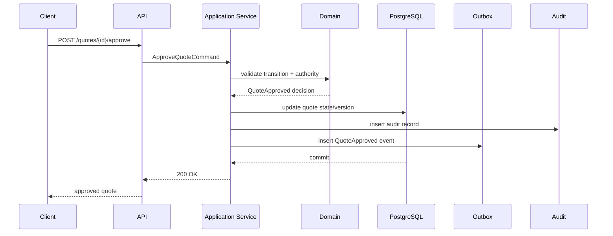
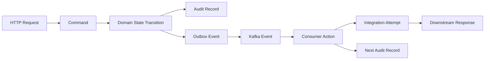

# Part 043 — Audit Logging, Compliance Evidence, and Defensible System Behavior

> Core idea: audit is not logging with a different table name.  
> Audit is evidence that the system behaved according to authority, policy, lifecycle rules, and business intent.

In a Quote & Order platform, audit records are not optional decorations.
They are part of the system's ability to defend itself.

A production incident may ask:

- Who approved a discount below threshold?
- Which price version was used when the quote was accepted?
- Did the user have authority to submit the order?
- Was the catalog changed before or after the quote was priced?
- Did the order fail because of validation, decomposition, fulfillment, or downstream timeout?
- Did an operator manually retry, override, cancel, or repair data?
- Did a cross-tenant read occur?
- Which external system received the order and what response did it return?
- Can we reconstruct the exact decision path without relying on someone's memory?

If the system cannot answer these questions, it may be operationally useful but not defensible.

---

## 1. Source Boundary and Fact Discipline

This part uses general security, logging, compliance, and enterprise architecture principles.
It does not assume CSG's actual audit architecture, compliance framework, log retention policy, SIEM tooling, or data retention obligations.

Public references useful for this part:

- OWASP Logging Cheat Sheet: https://cheatsheetseries.owasp.org/cheatsheets/Logging_Cheat_Sheet.html
- OWASP Logging Vocabulary Cheat Sheet: https://cheatsheetseries.owasp.org/cheatsheets/Logging_Vocabulary_Cheat_Sheet.html
- NIST SP 800-92, Guide to Computer Security Log Management: https://csrc.nist.gov/pubs/sp/800/92/final
- OWASP Application Security Verification Standard: https://owasp.org/www-project-application-security-verification-standard/
- TM Forum Open APIs, event notification patterns, and domain vocabulary: https://www.tmforum.org/oda/open-apis

Important boundary:

```text
Public standards explain audit/logging concepts.
They do not describe CSG's internal audit implementation.
```

Internal verification checklist:

- What is the official audit logging standard inside the team?
- Is audit stored in application tables, event stream, external audit service, SIEM, or a combination?
- Which actions must be audited by policy?
- Which fields are mandatory in every audit record?
- Which identifiers are used for tenant, user, account, quote, order, request, trace, correlation, and causation?
- Are audit records append-only?
- Who can read audit records?
- Who can delete, redact, export, or correct audit records?
- What is the retention policy?
- What is the PII/secrets/price redaction policy?
- Are manual support/admin actions audited with the same rigor as user actions?
- Are failed authorization attempts audited?
- Are rejected transitions audited?
- Are downstream calls and responses represented in audit evidence?

---

## 2. Logs vs Audit vs Business Events vs Traces

Many systems fail because they collapse four different things into one stream.

| Artifact | Primary purpose | Typical audience | Mutability expectation | Example |
|---|---|---|---|---|
| Application log | Debugging and operations | Engineers/SRE | Usually not business authoritative | `Pricing calculation failed` |
| Audit record | Evidence of accountable action or decision | Security, compliance, support, legal, product operations | Append-only / controlled correction | `User approved quote discount` |
| Business/domain event | Integration and state propagation | Other services | Durable event contract | `QuoteAccepted`, `OrderSubmitted` |
| Trace span | Distributed request timing and causality | Engineers/SRE | Telemetry lifecycle | HTTP request -> DB -> Kafka |

They overlap, but they are not interchangeable.

A trace may show that a request touched `POST /quotes/{id}/accept`.
It may not prove:

- who accepted it,
- whether they had authority,
- which price snapshot was accepted,
- which approval record was active,
- which quote version was converted,
- whether the action was later reversed,
- whether the action was performed through UI, API, batch, admin tool, or support script.

A business event may notify downstream systems that the quote was accepted.
It may not contain enough detail to act as compliance evidence.

An audit record must answer accountability questions.

---

## 3. The Audit Question Set

For Quote & Order, a useful audit record should answer at least:

| Question | Meaning |
|---|---|
| Who? | Human user, service principal, support operator, batch job, delegated actor. |
| Did what? | Action/command/transition executed or attempted. |
| To what? | Entity type and ID: quote, order, quote item, order item, agreement, approval, catalog version. |
| In which tenant? | Tenant/customer/environment boundary. |
| When? | Application timestamp and persistence timestamp. |
| From where? | Channel, client, API, UI, batch, integration, IP/device when allowed. |
| Why? | Reason code, approval basis, support ticket, command reason, cancellation reason. |
| Under which authority? | Role, permission, approval delegation, policy version. |
| What changed? | Before/after summary or state transition. |
| What was the result? | Success, rejected, failed validation, unauthorized, timed out, unknown. |
| How is it correlated? | Request ID, trace ID, correlation ID, causation ID, event ID. |

A minimal audit record without authority and business context is usually weak evidence.

Bad audit record:

```json
{
  "timestamp": "2026-07-08T10:17:22Z",
  "userId": "u-123",
  "action": "UPDATE",
  "entityId": "q-789"
}
```

Better audit record:

```json
{
  "auditId": "aud-01J...",
  "tenantId": "tenant-123",
  "actor": {
    "type": "HUMAN_USER",
    "userId": "u-123",
    "displayName": "redacted-or-internal-ref",
    "roles": ["SALES_MANAGER"],
    "delegatedBy": null
  },
  "action": "QUOTE_APPROVED",
  "entity": {
    "type": "QUOTE",
    "id": "q-789",
    "version": 7
  },
  "authority": {
    "permission": "quote.approve.discount",
    "policyVersion": "approval-policy-2026-06",
    "approvalThreshold": "DISCOUNT_20_PERCENT",
    "decision": "ALLOWED"
  },
  "change": {
    "fromState": "PENDING_APPROVAL",
    "toState": "APPROVED",
    "discountPercent": "18.5",
    "priceSnapshotId": "ps-456",
    "agreementId": "agr-321"
  },
  "reason": {
    "code": "ENTERPRISE_CONTRACTUAL_DISCOUNT",
    "commentRef": "comment-abc"
  },
  "result": "SUCCESS",
  "time": {
    "occurredAt": "2026-07-08T10:17:22.391Z",
    "persistedAt": "2026-07-08T10:17:22.421Z"
  },
  "correlation": {
    "requestId": "req-...",
    "traceId": "trace-...",
    "correlationId": "quote-q-789",
    "causationId": "cmd-approve-..."
  }
}
```

The improved record is not necessarily the exact schema you should use.
It shows the evidence shape you should reason toward.

---

## 4. Audit Scope in Quote & Order

Not every log line is an audit record.
But certain actions should almost always be audit candidates in CPQ/order systems.

### 4.1 Quote lifecycle

Audit candidates:

- quote created,
- quote cloned,
- quote version created,
- quote item added/removed/modified,
- configuration validated,
- quote priced,
- quote manually repriced,
- discount applied,
- approval requested,
- approval granted/rejected,
- approval invalidated,
- quote accepted,
- quote expired,
- quote converted to order,
- quote cancelled/rejected,
- quote unlocked or overridden.

Key evidence:

- quote ID,
- quote version,
- catalog version,
- price snapshot,
- agreement ID,
- approval policy version,
- actor authority,
- before/after state,
- reason code.

### 4.2 Pricing and discounting

Audit candidates:

- base price selected,
- agreement price applied,
- manual discount applied,
- promotional discount applied,
- margin override,
- approval threshold crossed,
- price recalculation performed,
- stale price detected,
- price accepted.

Key evidence:

- pricing input hash,
- price snapshot ID,
- product offering price version,
- discount rule IDs,
- agreement term IDs,
- margin threshold,
- currency,
- effective dates.

The audit record should not leak unnecessary commercially sensitive detail to places where it does not belong.
But somewhere defensible, the system must be able to reconstruct the pricing decision.

### 4.3 Order lifecycle

Audit candidates:

- order submitted,
- order validation accepted/rejected,
- order decomposed,
- fulfillment task created,
- downstream call attempted,
- downstream response received,
- order item state changed,
- order went to fallout,
- retry/resume triggered,
- order cancelled,
- cancellation rejected,
- manual intervention performed,
- order completed.

Key evidence:

- order ID,
- source quote ID/version,
- product order item ID,
- service order/task ID,
- state transition,
- validation errors,
- downstream endpoint/system,
- retry attempt,
- operator reason.

### 4.4 Security and tenant boundary

Audit candidates:

- login/authentication events if handled by the application boundary,
- token validation failure if meaningful at service layer,
- permission denied,
- cross-tenant access attempt,
- support impersonation/delegation,
- admin override,
- role assignment change,
- secret/config change,
- export/download of sensitive data.

Key evidence:

- actor,
- tenant,
- target tenant,
- attempted action,
- decision reason,
- policy version,
- source channel,
- correlation ID.

---

## 5. Audit as a Side Effect of Commands

A strong pattern is to treat audit as a mandatory side effect of business commands.



The critical property:

```text
State change, audit record, and outbox event should be committed atomically when they represent the same business decision.
```

If quote state changes but audit insert fails, the system has a defensibility gap.
If audit exists but state did not change, the system has misleading evidence.
If event publishes but audit/state commit fails, downstream may believe a decision happened when it did not.

In practice, this often means:

- one database transaction for state transition + audit insert + outbox insert,
- outbox relay publishes events after commit,
- audit event may be copied/exported to SIEM asynchronously,
- external audit sink failure should not silently erase audit evidence,
- audit export should be replayable from authoritative audit/outbox table.

Internal verification question:

```text
Is audit authoritative in the application DB, in a separate audit service, in Kafka, in SIEM, or somewhere else?
```

Do not assume.

---

## 6. Audit Schema Design

A simple starting model:

```sql
CREATE TABLE audit_record (
    audit_id            uuid PRIMARY KEY,
    tenant_id           text NOT NULL,
    entity_type         text NOT NULL,
    entity_id           text NOT NULL,
    entity_version      bigint,
    action              text NOT NULL,
    result              text NOT NULL,
    actor_type          text NOT NULL,
    actor_id            text NOT NULL,
    effective_actor_id  text,
    permission          text,
    policy_version      text,
    reason_code         text,
    from_state          text,
    to_state            text,
    change_summary      jsonb NOT NULL DEFAULT '{}'::jsonb,
    sensitivity_class   text NOT NULL DEFAULT 'INTERNAL',
    request_id          text,
    trace_id            text,
    correlation_id      text,
    causation_id        text,
    occurred_at         timestamptz NOT NULL,
    persisted_at        timestamptz NOT NULL DEFAULT now()
);

CREATE INDEX audit_record_entity_idx
ON audit_record (tenant_id, entity_type, entity_id, occurred_at DESC);

CREATE INDEX audit_record_actor_idx
ON audit_record (tenant_id, actor_id, occurred_at DESC);

CREATE INDEX audit_record_correlation_idx
ON audit_record (tenant_id, correlation_id, occurred_at DESC);
```

This is illustrative, not a prescription.

Important schema choices:

| Choice | Trade-off |
|---|---|
| Wide typed columns | Easier query/reporting; harder schema evolution. |
| JSONB change summary | Flexible; can hide semantics and create weak indexing. |
| Append-only table | Stronger evidence; needs correction/redaction policy. |
| Separate audit DB/service | Better isolation; harder atomicity with business transaction. |
| Kafka-first audit | Good streaming; harder authoritative reconstruction if retention is limited. |
| SIEM-only audit | Good security monitoring; may be weak for product-domain reconstruction. |

A common balanced design:

```text
Authoritative domain audit in product datastore or audit service.
Export copy to SIEM/log platform for security monitoring.
Domain events remain separate integration contracts.
```

---

## 7. Before/After Data: How Much Is Enough?

Audit should record enough to reconstruct the decision.
It should not blindly dump entire objects.

Bad pattern:

```text
Store entire quote JSON before and after every update.
```

Why it can fail:

- huge audit volume,
- PII exposure,
- secrets accidentally captured,
- commercially sensitive price leakage,
- weak semantic clarity,
- hard queries,
- costly retention,
- unclear which changes mattered.

Better pattern:

```text
Record semantic change summary + stable references to authoritative snapshots.
```

Example:

```json
{
  "fromState": "DRAFT",
  "toState": "PENDING_APPROVAL",
  "quoteVersion": 7,
  "priceSnapshotId": "ps-456",
  "discountPercentBefore": "12.0",
  "discountPercentAfter": "18.5",
  "approvalPolicyVersion": "approval-policy-2026-06",
  "approvalReason": "DISCOUNT_THRESHOLD_EXCEEDED"
}
```

For pricing/audit evidence, consider storing:

- snapshot ID,
- input hash,
- rule version,
- catalog version,
- agreement version,
- calculation result summary,
- approval basis.

The audit record does not need every intermediate calculation if a separate immutable price snapshot can reconstruct it.
But the reference must be stable and retained long enough.

---

## 8. Immutability, Correction, and Redaction

Audit records should generally be append-only.
But real systems also need:

- retention expiry,
- legal deletion/redaction obligations,
- PII minimization,
- correction of bad metadata,
- operational repair,
- environment cleanup.

Do not treat immutability as a slogan.
Define the correction model.

Safer approach:

```text
Never update the original audit record for business meaning.
Append a correction/redaction record that points to the original record.
```

Example:

```json
{
  "action": "AUDIT_RECORD_REDACTED",
  "entity": {
    "type": "AUDIT_RECORD",
    "id": "aud-01J..."
  },
  "reason": {
    "code": "PII_RETENTION_POLICY"
  },
  "redactedFields": ["actor.displayName", "reason.commentText"],
  "authorizedBy": "privacy-admin-123"
}
```

Internal verification questions:

- Can audit records be changed?
- If yes, who can do it?
- Is that action itself audited?
- Are redactions visible as redactions?
- Are exported audit copies also redacted?
- What is the retention split between logs, audit, traces, and events?

---

## 9. Sensitive Data and Log Injection

Audit records often contain sensitive context.
That makes them both valuable and dangerous.

Do not log:

- raw access tokens,
- refresh tokens,
- password/password reset tokens,
- API keys,
- full payment details,
- unnecessary PII,
- unmasked secrets,
- full request bodies by default,
- untrusted text without sanitization/encoding in sinks that need it.

For Quote & Order, be careful with:

- negotiated prices,
- margin data,
- contract terms,
- discount rationale,
- customer account hierarchy,
- installed base details,
- support comments,
- exported quote documents.

A defensible audit strategy classifies fields.

Example classification:

| Data | Recommended handling |
|---|---|
| Entity IDs | Usually safe internally; tenant-scoped. |
| User IDs | Store stable ID; display name may be sensitive. |
| Prices/discounts | Store only where access-controlled. |
| Margin | Highly restricted. |
| Support comments | Risk of PII; consider reference/redaction. |
| Tokens/secrets | Never store. |
| Customer contact info | Minimize/mask. |

Also consider log injection.
If user-controlled strings appear in audit or logs, ensure downstream viewers cannot interpret them as fake records, markup, or commands.

---

## 10. Correlation, Causation, and Evidence Chains

Audit records should connect to traces, logs, domain events, and integration attempts.

Recommended identifiers:

| Identifier | Purpose |
|---|---|
| `requestId` | One inbound HTTP/request boundary. |
| `traceId` | Distributed tracing tree. |
| `correlationId` | Business journey, often quote/order scoped. |
| `causationId` | Command/event that directly caused this action. |
| `eventId` | Unique domain event. |
| `auditId` | Unique audit record. |
| `actorId` | Accountable actor. |
| `tenantId` | Isolation boundary. |

Example evidence chain:



A strong incident reconstruction can answer:

```text
Given order O-123, show all commands, state changes, audit records, events, retries, downstream calls, and operator actions that led to current state.
```

This should not require a heroic manual grep across 20 systems.

---

## 11. Audit and Authorization Must Be Coupled

For high-risk actions, audit should capture authorization decision context.

Examples:

- user submitted order,
- user approved discount,
- user cancelled order,
- operator retried fulfillment,
- admin changed customer-specific config,
- support user accessed tenant data.

Audit should record:

- permission checked,
- policy version,
- relevant role/attribute summary,
- decision result,
- denial reason if denied,
- approval threshold if applicable,
- delegation/impersonation context.

This matters because “user had role X” after the fact may be insufficient.
Roles change over time.

Better evidence:

```json
{
  "action": "ORDER_CANCEL_ATTEMPTED",
  "result": "DENIED",
  "authority": {
    "permission": "order.cancel.afterFulfillmentStarted",
    "policyVersion": "authz-policy-2026-06",
    "decision": "DENIED",
    "reason": "MISSING_PERMISSION"
  },
  "actorSnapshot": {
    "userId": "u-123",
    "roles": ["SALES_AGENT"],
    "tenantId": "tenant-123"
  }
}
```

Denied attempts are often more important than successful attempts for security monitoring.

---

## 12. Audit and Kafka

Kafka can help distribute audit-related information, but it is not automatically an audit store.

Questions to ask:

- What is the topic retention?
- Are messages compacted?
- Can events be deleted?
- Who can consume the topic?
- Are sensitive fields encrypted/masked?
- Is ordering required?
- Can we replay safely?
- Is the audit event schema backward compatible?
- Does Kafka event publication happen atomically with DB state change?

Possible patterns:

### Pattern A — DB audit table + audit export event

```text
Business transaction writes domain state + audit record + outbox event.
Outbox relay publishes AuditRecordCreated.
SIEM/audit lake consumes asynchronously.
```

Strength:

- strong local atomicity,
- replayable export,
- DB can reconstruct domain audit.

Weakness:

- DB volume growth,
- export delay,
- retention/partitioning needed.

### Pattern B — Central audit service

```text
Services call audit service as part of command handling.
Audit service persists records.
```

Strength:

- central governance,
- consistent schema,
- easier cross-service query.

Weakness:

- hard atomicity with domain state,
- audit service availability affects write path,
- retry/idempotency required.

### Pattern C — Kafka-first audit

```text
Services emit audit events to Kafka.
Consumers persist/search/index them.
```

Strength:

- scalable streaming,
- decoupled consumers.

Weakness:

- producer/DB atomicity risk,
- retention risk,
- ordering/replay complexity,
- can be weak for transactional evidence if not designed carefully.

No pattern is universally best.
Choose based on evidence requirements, atomicity needs, retention, query patterns, and failure handling.

---

## 13. Operational Use: Incident Reconstruction

A good audit model supports incident reconstruction.

Example incident:

```text
Customer says an order was submitted with an unauthorized discount.
```

Questions:

1. Which quote generated the order?
2. Which quote version was accepted?
3. What was the price snapshot?
4. Which agreement was applied?
5. Who applied the discount?
6. Who approved it?
7. What approval policy was active?
8. Was approval still valid when quote was accepted?
9. Was the quote repriced after approval?
10. Was the order payload derived from the accepted quote version?
11. Did any manual override happen?
12. Did downstream billing receive the same price?

Without audit and correlation, this becomes a forensic nightmare.

With good evidence, the reconstruction is structured:

```sql
SELECT *
FROM audit_record
WHERE tenant_id = :tenantId
  AND correlation_id = :quoteOrOrderCorrelationId
ORDER BY occurred_at, persisted_at;
```

Then join/retrieve:

- quote version snapshot,
- price snapshot,
- approval record,
- order record,
- outbox events,
- integration attempts,
- support/admin actions.

The goal is not just debugging.
The goal is defensible explanation.

---

## 14. Implementation Pattern in Java

A simple application service shape:

```java
@Transactional
public QuoteApprovalResult approveQuote(ApproveQuoteCommand command) {
    ActorContext actor = actorContextProvider.currentActor();
    Quote quote = quoteRepository.findForUpdate(command.tenantId(), command.quoteId())
        .orElseThrow(() -> new QuoteNotFoundException(command.quoteId()));

    AuthorizationDecision decision = authorizationService.canApproveQuote(actor, quote);
    if (!decision.allowed()) {
        auditRepository.insert(AuditRecord.denied(
            command.tenantId(),
            actor,
            "QUOTE_APPROVE_ATTEMPTED",
            quote.auditRef(),
            decision,
            command.correlation()
        ));
        throw new ForbiddenException(decision.reason());
    }

    QuoteApproval approval = quote.approve(command.reason(), decision.policyVersion());
    quoteRepository.save(quote);

    auditRepository.insert(AuditRecord.success(
        command.tenantId(),
        actor,
        "QUOTE_APPROVED",
        quote.auditRef(),
        approval.auditChangeSummary(),
        decision,
        command.correlation()
    ));

    outboxRepository.insert(DomainEvent.quoteApproved(
        command.tenantId(),
        quote.id(),
        quote.version(),
        command.correlation()
    ));

    return QuoteApprovalResult.from(quote);
}
```

Important details:

- Denied attempts are audited.
- The authorization decision is captured.
- State transition, audit insert, and outbox insert share a transaction.
- Audit record references a semantic change summary.
- Correlation metadata is propagated.
- The domain model owns lifecycle validity.

Do not let audit become a best-effort `logger.info()` after the transaction.

---

## 15. MyBatis Mapper Considerations

Example insert mapper:

```xml
<insert id="insertAuditRecord">
  INSERT INTO audit_record (
      audit_id,
      tenant_id,
      entity_type,
      entity_id,
      entity_version,
      action,
      result,
      actor_type,
      actor_id,
      permission,
      policy_version,
      reason_code,
      from_state,
      to_state,
      change_summary,
      sensitivity_class,
      request_id,
      trace_id,
      correlation_id,
      causation_id,
      occurred_at
  ) VALUES (
      #{auditId},
      #{tenantId},
      #{entityType},
      #{entityId},
      #{entityVersion},
      #{action},
      #{result},
      #{actorType},
      #{actorId},
      #{permission},
      #{policyVersion},
      #{reasonCode},
      #{fromState},
      #{toState},
      CAST(#{changeSummaryJson} AS jsonb),
      #{sensitivityClass},
      #{requestId},
      #{traceId},
      #{correlationId},
      #{causationId},
      #{occurredAt}
  )
</insert>
```

Review points:

- Is `tenant_id` always present?
- Are JSON values safely serialized rather than concatenated?
- Are enums validated before persistence?
- Is the mapper only used through a transactional application service?
- Are audit insert failures visible?
- Are sensitive fields classified or masked?

---

## 16. Audit Query Patterns

Design indexes around real investigation queries.

Common query patterns:

| Query | Useful index |
|---|---|
| All audit for one quote/order | `(tenant_id, entity_type, entity_id, occurred_at DESC)` |
| All actions by actor | `(tenant_id, actor_id, occurred_at DESC)` |
| All denied attempts | `(tenant_id, result, occurred_at DESC)` partial index for denied may help |
| All events in one business journey | `(tenant_id, correlation_id, occurred_at DESC)` |
| All actions by type in time window | `(tenant_id, action, occurred_at DESC)` |
| Investigation across linked objects | correlation ID + entity references |

Avoid designing audit as a write-only graveyard.
If nobody can query it during an incident, it is not operational evidence.

---

## 17. Retention and Archival

Audit retention is not the same as application log retention.

Possible retention classes:

| Artifact | Example retention driver |
|---|---|
| Application logs | Operational debugging window. |
| Traces | Short-lived performance diagnosis. |
| Metrics | SLO and trend analysis. |
| Audit records | Compliance, customer contract, legal, forensic investigation. |
| Domain events | Replay/integration needs. |
| Snapshots | Business reconstruction. |

For quote/order systems, retention must consider:

- quote validity period,
- contract duration,
- order fulfillment duration,
- billing dispute window,
- customer support obligations,
- regulatory/compliance obligations,
- on-prem customer policies,
- data minimization requirements.

Internal verification question:

```text
Can we reconstruct a completed order's commercial and operational decision path after the dispute window?
```

If not, retention may be too short or evidence too fragmented.

---

## 18. Testing Audit Behavior

Audit testing should be explicit.

### 18.1 Unit tests

Test:

- command generates expected audit action,
- denied command generates denied audit record,
- transition summary contains correct from/to state,
- approval decision is captured,
- tenant ID is required,
- sensitive fields are not included.

### 18.2 Integration tests

Test:

- business state + audit + outbox commit together,
- rollback does not leave orphan audit,
- audit insert failure fails the command or follows documented fallback,
- MyBatis JSON mapping works,
- indexes support investigation query.

### 18.3 Security tests

Test:

- cross-tenant access attempt audited,
- unauthorized attempt audited,
- support/admin override audited,
- audit read endpoint enforces permission,
- audit export masks sensitive fields.

### 18.4 Migration tests

Test:

- new audit columns are backward compatible,
- old records can still be read,
- archival jobs preserve required fields,
- redaction jobs append correction records.

---

## 19. Common Anti-Patterns

| Anti-pattern | Why it fails |
|---|---|
| Audit as `logger.info()` | Logs may be dropped, rotated, unstructured, or inaccessible. |
| Audit after commit best-effort | State can change without evidence. |
| Only auditing success | Denied attempts and failed transitions disappear. |
| Full object dump | Sensitive, huge, unclear, hard to query. |
| No tenant field | Cross-tenant investigation becomes dangerous. |
| No actor authority snapshot | Cannot prove the actor had permission at the time. |
| No correlation ID | Cannot reconstruct journey across services. |
| No audit read authorization | Audit becomes a data leak vector. |
| Audit schema without versioning | Hard to evolve evidence format. |
| Treating Kafka retention as audit retention | Evidence may disappear. |

---

## 20. PR Review Checklist

When reviewing audit-sensitive PRs, ask:

### Domain correctness

- Does the PR introduce or change a business action that should be audited?
- Are successful, denied, and failed attempts handled correctly?
- Is lifecycle transition captured with from/to state?
- Is quote/order version captured?

### Authorization evidence

- Is permission/policy decision captured?
- Are approval thresholds and policy versions included where relevant?
- Are support/admin actions audited?
- Are override reasons mandatory?

### Transactionality

- Is audit persisted atomically with the state change?
- Is outbox/event publication consistent with audit/state?
- What happens if audit persistence fails?

### Security and privacy

- Are secrets/tokens excluded?
- Is PII minimized or masked?
- Are price/margin/contract details classified?
- Is tenant ID mandatory?
- Are audit read/export endpoints protected?

### Operability

- Can an incident responder query the audit trail?
- Are correlation/causation IDs propagated?
- Are audit records indexed for real investigations?
- Are dashboards/alerts needed for denied attempts or suspicious actions?

### Compatibility

- Does audit schema evolution preserve old records?
- Are audit event consumers backward compatible?
- Are retention/export processes updated?

---

## 21. Internal Verification Checklist

Use this checklist during onboarding.

### Architecture

- Where are audit records stored?
- Is there a central audit service?
- Are audit records exported to SIEM/log platform?
- Is audit append-only?
- Are audit records part of local DB transactions?
- Is outbox used for audit export?

### Domain coverage

- Which quote actions are audited?
- Which pricing/discount actions are audited?
- Which approval actions are audited?
- Which order actions are audited?
- Which fulfillment/fallout actions are audited?
- Which customer/config/admin actions are audited?

### Security

- Who can read audit records?
- Are audit reads themselves audited?
- Are support impersonation and delegation represented?
- Are denied authorization attempts audited?
- Are cross-tenant attempts audited?

### Data governance

- What is the retention policy?
- What is the redaction policy?
- How is PII handled?
- How is commercially sensitive data handled?
- Can audit be exported for customer support or compliance review?

### Operations

- Is there an audit investigation runbook?
- Can support reconstruct a quote/order journey?
- Are audit insert failures monitored?
- Are audit export failures monitored?
- Are audit tables partitioned/archived?

---

## 22. Practical Exercises

### Exercise 1 — Quote approval audit map

Pick one quote approval flow.
Map:

- command,
- actor,
- permission,
- policy version,
- approval threshold,
- quote version,
- price snapshot,
- state transition,
- audit record,
- outbox event.

Then answer:

```text
Could we defend this approval six months later?
```

### Exercise 2 — Denied action audit

Find one endpoint that can return `403`.
Check whether denied attempts are audited.
If not, decide whether they should be.

### Exercise 3 — Data sensitivity review

Pick one audit record type.
Classify every field:

- public/internal,
- tenant-sensitive,
- PII,
- commercially sensitive,
- secret-never-log.

### Exercise 4 — Incident reconstruction drill

Given one order ID, reconstruct:

- source quote,
- quote acceptance,
- order submission,
- decomposition,
- fulfillment calls,
- fallout/retry actions,
- completion/cancellation.

Record where evidence is missing.

---

## 23. Mental Model Summary

Audit logging is not about writing more logs.
It is about preserving accountable business evidence.

In Quote & Order systems, audit must be able to explain:

- who acted,
- under which authority,
- on which entity/version,
- in which tenant,
- under which catalog/pricing/agreement context,
- what changed,
- why it changed,
- whether it succeeded, failed, or was denied,
- how the action relates to other system events.

A senior engineer treats audit as part of domain correctness.
A principal engineer treats audit as part of system defensibility.
