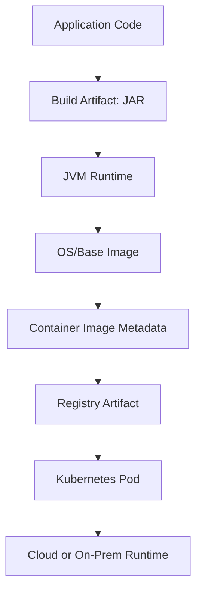

# Part 044 — Docker Image and Runtime Hygiene for Java Services

> Core idea: a container image is not only a packaging format.  
> It is the runtime contract between code, JVM, OS libraries, security posture, CI/CD, Kubernetes, and customer deployment constraints.

For enterprise Quote & Order services, a Docker image must support more than “it starts locally”.

It must be:

- reproducible,
- secure enough for enterprise scanning,
- predictable under Kubernetes resource limits,
- compatible with cloud and on-prem environments,
- observable,
- easy to debug safely,
- resilient during graceful shutdown,
- small enough to ship and patch efficiently,
- boring enough to be trusted.

A weak image can cause incidents even if the Java code is correct.

Examples:

- JVM heap ignores container memory budget and gets OOMKilled.
- Service runs as root and violates customer security policy.
- Image contains build tools, secrets, or unnecessary packages.
- TLS truststore lacks required enterprise CA.
- Container ignores SIGTERM and loses in-flight order processing.
- Logging writes to local files instead of stdout/stderr.
- Startup probe is too aggressive and causes rollout failure.
- Vulnerability scanner fails release because base image is stale.
- On-prem customer cannot pull image because tag is mutable or provenance unclear.

This part focuses on production hygiene for Java service images.

---

## 1. Source Boundary and Fact Discipline

This part uses general Docker, Java, Linux container, Kubernetes, and supply-chain security principles.
It does not assume CSG's actual base images, CI/CD system, artifact registry, Kubernetes manifests, security scanning tools, or supported runtime environments.

Public references useful for this part:

- Docker Build best practices: https://docs.docker.com/build/building/best-practices/
- Docker container run reference: https://docs.docker.com/engine/containers/run/
- Dockerfile reference: https://docs.docker.com/reference/dockerfile/
- Eclipse Temurin official image: https://hub.docker.com/_/eclipse-temurin
- Kubernetes container lifecycle hooks: https://kubernetes.io/docs/concepts/containers/container-lifecycle-hooks/
- Kubernetes probes: https://kubernetes.io/docs/tasks/configure-pod-container/configure-liveness-readiness-startup-probes/
- Kubernetes resource management: https://kubernetes.io/docs/concepts/configuration/manage-resources-containers/
- SLSA supply-chain security framework: https://slsa.dev/
- CycloneDX SBOM standard: https://cyclonedx.org/

Internal verification checklist:

- What base images are approved internally?
- Are images pinned by tag, digest, or internal golden image version?
- Is Java runtime JDK, JRE, distroless, alpine, debian, ubi, or custom `jlink` runtime?
- What image scanner is used?
- What vulnerability severity blocks release?
- Is SBOM required?
- Are images signed?
- Which registry is source of truth?
- How are images promoted across environments?
- Are customer/on-prem images delivered differently?
- Are JVM flags standardized?
- Are containers required to run as non-root?
- Are filesystems read-only in Kubernetes?
- How are CA certificates and truststores managed?

---

## 2. Mental Model: The Image Is a Runtime Boundary

A Java service image contains several layers of responsibility.



Each layer can fail independently.

| Layer | Failure example |
|---|---|
| Application JAR | Bad configuration default, missing dependency. |
| JVM runtime | Heap too large, wrong GC behavior, classpath issue. |
| OS/base image | Vulnerable package, missing CA cert, wrong libc expectation. |
| Image metadata | Runs as root, wrong entrypoint, no labels. |
| Registry artifact | Mutable tag, missing provenance, stale image. |
| Kubernetes pod | Bad resources/probes/secrets/config. |
| Customer runtime | Proxy, CA, air-gapped registry, restricted security policy. |

Senior review question:

```text
Does this image behave predictably under production constraints, or only under developer laptop constraints?
```

---

## 3. A Production-Oriented Dockerfile Shape

Example for a Maven-built Java 17 service:

```dockerfile
# syntax=docker/dockerfile:1

FROM maven:3.9-eclipse-temurin-17 AS build
WORKDIR /workspace

COPY pom.xml .
COPY service-a/pom.xml service-a/pom.xml
COPY shared-domain/pom.xml shared-domain/pom.xml
RUN --mount=type=cache,target=/root/.m2 mvn -q -DskipTests dependency:go-offline

COPY . .
RUN --mount=type=cache,target=/root/.m2 \
    mvn -q -DskipTests package

FROM eclipse-temurin:17-jre

RUN groupadd --system app && useradd --system --gid app --home-dir /app app
WORKDIR /app

COPY --from=build /workspace/service-a/target/service-a.jar /app/service.jar

USER app:app

ENV JAVA_OPTS=""
EXPOSE 8080

ENTRYPOINT ["sh", "-c", "exec java $JAVA_OPTS -jar /app/service.jar"]
```

This is only a teaching example.
Internal standards may require:

- approved internal base image,
- UBI instead of Debian/Ubuntu,
- distroless image,
- no shell in final image,
- image labels,
- non-root UID/GID requirements,
- SBOM labels,
- JVM wrapper script,
- custom truststore,
- FIPS-specific image,
- enterprise CA bundle,
- OpenTelemetry agent injection.

### 3.1 Important details

| Detail | Why it matters |
|---|---|
| Multi-stage build | Keeps Maven/build tools out of runtime image. |
| Non-root user | Reduces impact of container escape/misconfig and satisfies security policies. |
| Exec form | Improves signal handling when process is PID 1. |
| Explicit workdir | Avoids accidental runtime paths. |
| No secrets copied | Prevents credential leakage in layers. |
| Cache mount | Speeds builds without baking cache into image. |
| Runtime-only base | Smaller attack surface than full build image. |

Be careful with:

```dockerfile
ENTRYPOINT java -jar app.jar
```

Shell-form entrypoints can make signal handling worse.
Prefer exec form or ensure the shell uses `exec`.

---

## 4. Base Image Strategy

Base image choice affects security, compatibility, operability, and customer acceptance.

Common options:

| Base image type | Strength | Risk/trade-off |
|---|---|---|
| Full JDK | Easy diagnostics/tools | Larger attack surface; unnecessary compiler/tools in runtime. |
| JRE image | Smaller than JDK | Some vendors no longer ship classic JRE for all cases; less debug tooling. |
| Custom `jlink` runtime | Smaller, tailored | More build complexity; module correctness required. |
| Distroless | Smaller attack surface | Harder shell-based debugging; CA/package expectations must be handled. |
| Alpine/musl | Small | Native library compatibility issues; not always ideal for Java stacks. |
| Enterprise Linux/UBI | Enterprise-friendly | Larger; patch cadence and licensing constraints. |

Guideline:

```text
Use the simplest approved runtime image that satisfies security, compatibility, debug, and customer deployment constraints.
```

Do not optimize image size at the expense of operability unless the trade-off is explicit.

Internal verification questions:

- Is there an approved golden base image?
- Who patches it?
- How quickly are CVEs remediated?
- Is FIPS required for any customer?
- Are shell/debug tools allowed in runtime images?
- Is distroless supported by support/on-call workflows?

---

## 5. Tags, Digests, and Reproducibility

Mutable tags are convenient but dangerous.

Problem:

```dockerfile
FROM eclipse-temurin:17-jre
```

The tag may point to a different digest over time.
That can make builds non-reproducible.

More controlled pattern:

```dockerfile
FROM eclipse-temurin:17.0.XX_YY-jre@sha256:<digest>
```

In practice, internal image pipelines often solve this by mirroring approved base images into an internal registry.

Review points:

- Can we rebuild the same source and get functionally equivalent image?
- Can we identify the exact base image used in production?
- Are image tags immutable in the registry?
- Is there a promotion process from dev to staging to prod?
- Are images signed or attested?
- Is SBOM generated and attached?

For enterprise/on-prem deployment, artifact traceability matters.
A customer or support team may need to know exactly which image digest was running during an incident.

---

## 6. JVM Memory in Containers

Java services in containers fail often because memory reasoning is shallow.

Container memory is not only Java heap.

```text
Container memory = heap + metaspace + thread stacks + direct buffers + code cache + GC/native memory + libraries + agent overhead + OS page cache effects
```

If Kubernetes memory limit is `1024Mi`, setting heap to `1024m` is unsafe.
The process needs native memory too.

Common strategies:

```bash
-XX:MaxRAMPercentage=60
-XX:InitialRAMPercentage=30
```

or explicit:

```bash
-Xms512m -Xmx512m
```

Trade-off:

| Strategy | Strength | Risk |
|---|---|---|
| `MaxRAMPercentage` | Adapts to container limit | Needs careful default per service. |
| Fixed `Xmx` | Predictable | Can mismatch environment overlays. |
| No explicit tuning | Simple | Runtime defaults may not match workload/SLO. |

Important review questions:

- What is the pod memory limit?
- What is expected heap usage under load?
- How many request threads, Kafka consumer threads, DB pool connections, and async workers exist?
- Are Netty/direct buffers used?
- Is an observability agent loaded?
- Is memory pressure visible in dashboards?
- What happens when memory approaches limit?

Failure modes:

| Symptom | Possible cause |
|---|---|
| `OOMKilled` in Kubernetes | Container exceeded cgroup memory limit. |
| `java.lang.OutOfMemoryError: Java heap space` | Heap too small or leak. |
| `OutOfMemoryError: Metaspace` | Classloader/metaspace growth. |
| Direct buffer OOM | Off-heap usage not budgeted. |
| High GC pause | Heap/GC mismatch or allocation pressure. |

Do not tune JVM memory only from local tests.
Tune from production-like workload and container limits.

---

## 7. CPU, Threads, and Concurrency

CPU limits affect Java runtime behavior.

Questions:

- What are CPU requests and limits?
- Is the service CPU-bound or IO-bound?
- How many application threads are configured?
- How many Kafka consumer threads?
- How many DB connections?
- Does thread count exceed useful CPU capacity?
- Is the GC behavior acceptable under CPU throttling?

Anti-pattern:

```text
Increase DB pool, Kafka concurrency, and HTTP worker threads without increasing CPU or checking downstream capacity.
```

For Quote & Order services, concurrency must align with:

- PostgreSQL connection limits,
- Kafka partition count,
- downstream rate limits,
- order idempotency and locking,
- tenant fairness,
- CPU request/limit,
- latency SLO.

Runtime hygiene includes bounding concurrency.
The container image may not define these values, but it must expose configuration safely.

---

## 8. Signals and Graceful Shutdown

Kubernetes terminates pods during rollout, scaling, eviction, and node maintenance.

A Java service must handle shutdown gracefully.

Desired behavior:

1. Pod receives termination signal.
2. Readiness turns false quickly.
3. Load balancer stops sending new traffic.
4. In-flight HTTP requests complete or timeout.
5. Kafka consumers stop polling and commit processed offsets safely.
6. Outbox relay stops cleanly.
7. DB transactions finish or rollback.
8. Process exits before `terminationGracePeriodSeconds`.

Bad behavior:

```text
Pod receives SIGTERM but shell wrapper swallows it.
Kubernetes sends SIGKILL after grace period.
In-flight order command is interrupted.
Client retries.
Duplicate order side effect occurs.
```

Review points:

- Does entrypoint propagate SIGTERM?
- Does framework register graceful shutdown?
- Is readiness flipped before long shutdown tasks?
- Are Kafka consumers stopped safely?
- Are idempotency keys used for in-flight retries?
- Is termination grace period long enough?

This is where Docker hygiene connects directly to order correctness.

---

## 9. Logging to stdout/stderr

Containers should generally write logs to stdout/stderr.
The platform collects and routes them.

Avoid:

- writing primary logs only to local files,
- writing logs to ephemeral disk without collector,
- unbounded file growth,
- custom log rotation inside the container unless required,
- secrets/PII in logs.

For Quote & Order, logs must include enough context:

- tenant ID where safe,
- quote/order ID,
- request ID,
- trace ID,
- correlation ID,
- event ID,
- downstream system name,
- operation name,
- error classification.

But logs are not audit.
Do not treat stdout logs as authoritative business evidence unless internal policy says so and retention/access controls support it.

---

## 10. Health Checks: Docker vs Kubernetes

Docker supports `HEALTHCHECK`, but Kubernetes commonly uses probes in pod specs.
Do not assume both are used.

Kubernetes probe types:

| Probe | Purpose |
|---|---|
| Startup probe | Give slow-starting app time before liveness checks. |
| Readiness probe | Decide whether pod receives traffic. |
| Liveness probe | Restart stuck container. |

Probe design matters.

Bad liveness check:

```text
Liveness checks database connectivity.
Database blip causes every pod to restart, amplifying incident.
```

Better split:

| Check | What it should mean |
|---|---|
| Liveness | Process is alive and not unrecoverably stuck. |
| Readiness | Service can safely handle new requests. |
| Startup | App has completed initialization. |

Readiness may include:

- DB connectivity,
- mandatory dependency availability,
- migration status,
- local cache initialized,
- Kafka consumer readiness if relevant.

But be careful:

```text
Readiness failure removes capacity.
Liveness failure restarts the process.
```

They are different operational levers.

---

## 11. Filesystem and Runtime Permissions

A hardened container often runs with:

- non-root user,
- read-only root filesystem,
- writable `/tmp` or mounted volume if needed,
- no privilege escalation,
- dropped Linux capabilities,
- restricted seccomp/apparmor profile,
- no package manager in runtime image.

Application implications:

- Does the app write temp files?
- Does it generate reports/PDFs?
- Does it write local caches?
- Does it expect `/home/app` to exist?
- Does it need writable truststore?
- Does it write heap dumps?
- Where do diagnostic dumps go?

If the filesystem is read-only, configure writable paths explicitly.

Example:

```yaml
securityContext:
  runAsNonRoot: true
  readOnlyRootFilesystem: true
  allowPrivilegeEscalation: false
```

Then ensure the app has a writable mount if needed:

```yaml
volumeMounts:
  - name: tmp
    mountPath: /tmp
volumes:
  - name: tmp
    emptyDir: {}
```

The Dockerfile and Kubernetes manifest must agree.

---

## 12. Certificates, Truststores, and Enterprise Networks

Enterprise deployments often require:

- custom CA certificates,
- outbound proxy,
- mTLS,
- internal DNS,
- private registries,
- restricted egress,
- FIPS-compatible cryptography,
- customer-managed certificates.

Java-specific concern:

```text
The OS CA bundle and Java truststore may not be the same thing depending on image/runtime.
```

Questions:

- How are enterprise CAs injected?
- Is Java using system certificates or bundled truststore?
- Are certificates mounted as secrets?
- Is truststore rebuilt at image build time or runtime?
- How are cert rotations handled?
- Can on-prem customers provide their own CA?
- Are TLS failures observable?

Do not hard-code customer certificates into images unless internal delivery model explicitly requires it.
Prefer runtime-mounted configuration where possible.

---

## 13. Configuration and Secrets

Images should be environment-neutral.

Bad pattern:

```text
Build one image per environment with environment-specific config baked in.
```

Better pattern:

```text
Build once, promote same image digest, inject environment config at runtime.
```

Runtime configuration may come from:

- Kubernetes ConfigMaps,
- Kubernetes Secrets,
- external secret manager,
- environment variables,
- mounted files,
- service discovery,
- GitOps-managed values.

Rules:

- Do not bake secrets into image layers.
- Do not pass high-risk secrets through logs or command-line args if avoidable.
- Validate config at startup.
- Fail fast for missing mandatory config.
- Expose effective non-sensitive config for diagnostics.
- Track config version if it affects behavior.

For Quote & Order, configuration may affect:

- pricing behavior,
- approval thresholds,
- tenant isolation,
- downstream endpoints,
- retry policy,
- feature flags,
- catalog integration,
- Kafka topic names.

Configuration is operational risk.
Treat it as part of release correctness.

---

## 14. Image Labels and Metadata

Useful labels:

```dockerfile
LABEL org.opencontainers.image.title="quote-order-service"
LABEL org.opencontainers.image.version="${VERSION}"
LABEL org.opencontainers.image.revision="${GIT_SHA}"
LABEL org.opencontainers.image.created="${BUILD_TIME}"
LABEL org.opencontainers.image.source="${REPO_URL}"
```

OCI labels help trace:

- source repo,
- commit SHA,
- build time,
- version,
- artifact identity.

Internal verification:

- Are OCI labels required?
- Is Git SHA visible in `/actuator/info` or equivalent?
- Is image digest recorded in deployment history?
- Can support map a running pod to source commit and build pipeline?

During incidents, artifact identity saves time.

---

## 15. SBOM, Vulnerability Scanning, and Supply Chain

Enterprise products increasingly require supply-chain evidence.

Key artifacts:

| Artifact | Purpose |
|---|---|
| SBOM | Inventory of components/packages. |
| Vulnerability scan | Detect known CVEs. |
| Image signature | Verify image origin/integrity. |
| Provenance/attestation | Show how artifact was built. |
| Dependency report | Track Java dependencies. |

Important nuance:

```text
A vulnerability finding is not automatically an exploitable vulnerability in your service.
But it must be triaged, tracked, and remediated according to policy.
```

Review questions:

- Does the image include unnecessary vulnerable packages?
- Is the base image stale?
- Are Java dependencies scanned separately from OS packages?
- Are false positives documented?
- Is there a patch SLA?
- Are images rebuilt when base image patches are released?
- Is SBOM attached to the image or release?

For on-prem customers, SBOM and vulnerability reports may be part of delivery expectations.

---

## 16. Java Agents and Runtime Instrumentation

Java services may use agents for:

- OpenTelemetry tracing,
- APM,
- security monitoring,
- profiling,
- bytecode instrumentation,
- coverage in test environments.

Agents affect:

- startup time,
- memory usage,
- CPU usage,
- classloading,
- TLS/network behavior,
- vulnerability surface,
- compatibility with Java version.

Questions:

- Is the agent baked into the image or injected at runtime?
- Who owns agent version upgrades?
- Is agent failure fatal or degraded?
- Is memory overhead included in container sizing?
- Are traces correlated with logs and audit?

Do not treat agents as invisible.
They are part of runtime architecture.

---

## 17. Debuggability Without Weakening Production

Production images should be secure, but support teams still need diagnostics.

Options:

| Approach | Trade-off |
|---|---|
| Include shell/tools | Easier debugging; larger attack surface. |
| Distroless + ephemeral debug container | Safer image; requires platform support. |
| JDK image in non-prod only | Useful diagnostics; environment drift risk. |
| Runtime endpoints | Controlled diagnostics; must secure endpoints. |
| Heap/thread dump on signal/endpoint | Powerful; sensitive data risk. |

For Java services, diagnostics may include:

- thread dumps,
- heap dumps,
- GC logs,
- JFR recordings,
- actuator health/metrics,
- connection pool metrics,
- Kafka consumer lag,
- DB query timing.

Operational rule:

```text
Plan production diagnostics before the incident.
```

If the image is hardened but impossible to inspect, incident response suffers.
If the image is easy to inspect but insecure, customer security review fails.
Balance intentionally.

---

## 18. Docker Image and Kubernetes Manifest Must Co-Design

The image alone is not enough.

Image assumptions must match pod configuration.

| Image expectation | Kubernetes counterpart |
|---|---|
| Listens on port 8080 | Container port/service/ingress config. |
| Runs as UID 10001 | `securityContext.runAsUser`. |
| Needs writable `/tmp` | `emptyDir` mount. |
| Uses `JAVA_OPTS` | Env vars/config map/secret. |
| Needs custom CA | Secret/config mount. |
| Handles SIGTERM | Termination grace period and preStop. |
| Exposes health endpoint | Probe definitions. |
| Writes stdout logs | Log collector config. |

A PR that changes Dockerfile may require manifest changes.
A PR that changes manifest may require image changes.

Senior review should consider both.

---

## 19. Failure Modes

| Failure mode | Detection | Prevention/mitigation |
|---|---|---|
| OOMKilled during pricing load | K8s events, pod restart count, memory metrics | Heap sizing, native memory budget, load test. |
| Slow rollout due to startup | Deployment timeout, startup probe failures | Startup probe, cache warmup strategy, lazy init trade-off. |
| SIGTERM not handled | Truncated requests, duplicate processing | Exec entrypoint, graceful shutdown, idempotency. |
| Runs as root | Security scan/policy failure | Non-root user, security context. |
| Missing CA | TLS handshake failures | Runtime CA injection, truststore tests. |
| Stale base image | CVE gate failure | Scheduled rebuilds, base image patch process. |
| Mutable tag drift | Cannot reproduce incident image | Digest pinning, immutable registry tags. |
| Logs to file only | Missing production logs | stdout/stderr logging. |
| Read-only FS crash | Runtime write failure | Explicit writable mounts. |
| Agent memory overhead | OOM or latency | Include agent overhead in sizing. |

---

## 20. Testing Container Behavior

Do not stop at unit tests.
Test the image.

### 20.1 Build test

- Docker build succeeds from clean checkout.
- Build does not require local machine secrets.
- Build is reproducible enough for CI.
- Image contains expected JAR/version.

### 20.2 Runtime smoke test

Run container locally or in CI:

```bash
docker run --rm \
  -e JAVA_OPTS="-XX:MaxRAMPercentage=60" \
  -p 8080:8080 \
  quote-order-service:test
```

Check:

- app starts,
- health endpoint responds,
- logs go to stdout,
- process runs as non-root,
- required config validation works,
- graceful shutdown works.

### 20.3 Security test

Check:

- no secrets in image history,
- non-root user,
- vulnerability scan,
- SBOM generated,
- no package manager if policy forbids,
- no build tools in final image.

### 20.4 Kubernetes test

Deploy to ephemeral environment and verify:

- readiness/liveness/startup probes,
- resource limits,
- rolling update,
- termination behavior,
- logging collection,
- metrics/tracing,
- config/secret mounts,
- CA/truststore.

### 20.5 Load/resource test

Verify:

- memory under pricing/order workload,
- GC behavior,
- CPU throttling,
- Kafka consumer behavior,
- DB pool behavior,
- graceful shutdown during load.

---

## 21. PR Review Checklist

When reviewing Docker/runtime changes, ask:

### Build and artifact

- Is the build reproducible?
- Is the final image free of build tools unless intentionally included?
- Is the base image approved?
- Are tags/digests handled according to policy?
- Are labels/version metadata present?

### Security

- Does the container run as non-root?
- Are secrets excluded from layers/history?
- Is the runtime image minimal enough?
- Are CVE findings handled?
- Is SBOM/signing/provenance required?
- Is filesystem permission compatible with security policy?

### Java runtime

- Are JVM memory settings compatible with pod memory limit?
- Is native memory considered?
- Are GC/logging/JFR settings intentional?
- Are Java agents accounted for?

### Operations

- Does the app handle SIGTERM?
- Are health endpoints/probes compatible?
- Do logs go to stdout/stderr?
- Can support map image digest to source commit?
- Can the service be debugged safely?

### Deployment compatibility

- Does the image work in cloud and on-prem modes?
- Does it support custom CA/truststore requirements?
- Does it rely on unrestricted egress?
- Does it require shell/debug tools that hardened runtimes disallow?

---

## 22. Internal Verification Checklist

Use this checklist during onboarding.

### Image standards

- Approved base image list.
- Required Java runtime distribution.
- Required OS distribution.
- Non-root policy.
- Distroless or shell policy.
- Image labels policy.

### Build pipeline

- Build tool and CI provider.
- Docker build strategy.
- Build cache strategy.
- Image registry.
- Promotion model.
- Immutable tag policy.
- Image signing/attestation.

### Security

- Scanner tool.
- CVE severity gate.
- SBOM requirement.
- Secret scanning.
- Base image patch process.
- Customer security delivery artifacts.

### Runtime

- JVM flag standard.
- Memory/CPU sizing standards.
- Graceful shutdown standard.
- Probe endpoint standard.
- Logging format.
- OpenTelemetry/APM agent policy.

### Enterprise deployment

- AWS support constraints.
- Azure support constraints.
- On-prem support constraints.
- Air-gapped registry support.
- Custom CA support.
- Proxy support.
- FIPS requirements if any.

---

## 23. Practical Exercises

### Exercise 1 — Inspect a real image

Pick one service image and answer:

- What base image does it use?
- Does it run as root?
- What Java version is installed?
- What labels are present?
- What user owns `/app`?
- Are build tools present in the final image?
- Is the JAR version traceable to Git SHA?

### Exercise 2 — Memory budget

For one service, collect:

- pod memory request/limit,
- JVM heap config,
- thread count,
- DB pool size,
- Kafka consumer concurrency,
- agent overhead,
- observed memory usage under load.

Then decide whether the memory budget is defensible.

### Exercise 3 — Graceful shutdown drill

During a test deployment:

- send traffic,
- terminate pod,
- watch readiness,
- observe in-flight request behavior,
- observe Kafka consumer shutdown,
- check duplicate processing/idempotency.

Document gaps.

### Exercise 4 — Security scan triage

Pick one image scan report.
Classify findings:

- base image issue,
- OS package issue,
- Java dependency issue,
- false positive,
- unreachable package,
- must-fix before release.

Then check how the team documents the decision.

---

## 24. Mental Model Summary

Docker hygiene is production engineering.

A good Java service image is:

- small enough,
- secure enough,
- traceable,
- reproducible,
- non-root,
- signal-aware,
- memory-aware,
- observable,
- compatible with Kubernetes,
- compatible with customer deployment constraints,
- easy enough to support during incidents.

A senior engineer reviews the Dockerfile as part of code quality.
A principal engineer reviews the image as part of the product's delivery and operational contract.
