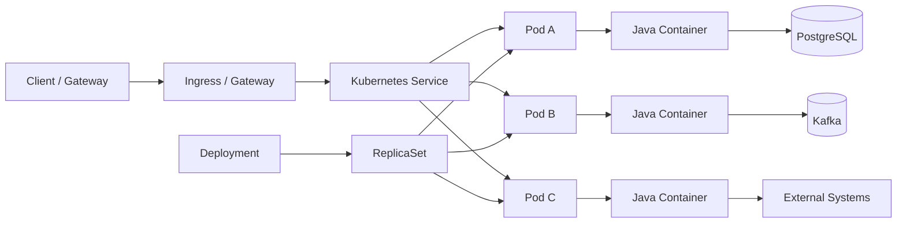
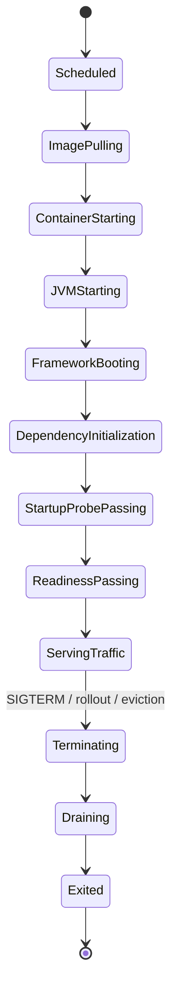
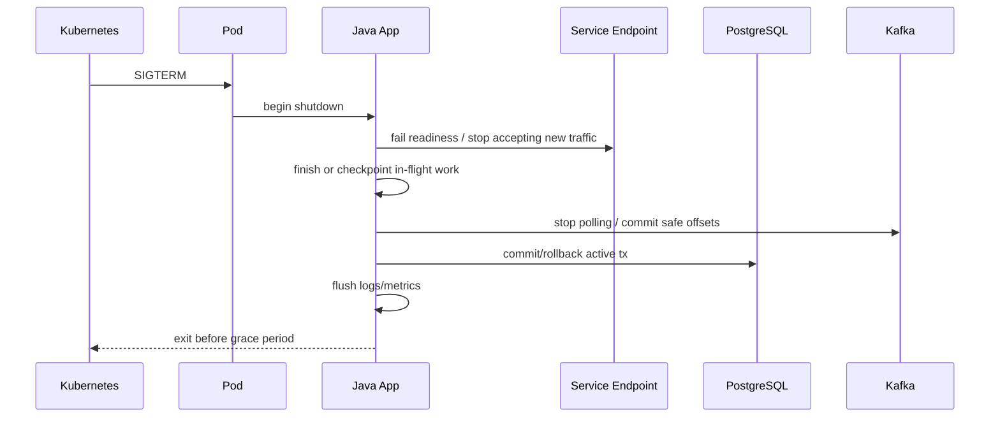

# Part 045 — Kubernetes Deployment Model for Enterprise Java Microservices

> Core idea: Kubernetes is not a magic production platform.  
> It is a reconciliation system. Your job as an engineer is to define desired state, health signals, resource contracts, and failure behavior so the platform can make safe decisions.

For enterprise Quote & Order systems, Kubernetes deployment design is not an infra-only detail.

It directly affects:

- whether quote/order APIs survive rolling deployment,
- whether long-running order processing is interrupted safely,
- whether pricing/catalog services scale under peak sales campaigns,
- whether Kafka consumers rebalance cleanly,
- whether DB connection pools overload PostgreSQL,
- whether bad readiness probes cause traffic to hit unready pods,
- whether liveness probes create restart storms,
- whether resource limits cause Java OOMKilled incidents,
- whether customer-specific on-prem environments behave differently from cloud,
- whether production incidents can be detected and mitigated quickly.

A senior engineer should be able to read a Kubernetes manifest and infer operational behavior.

Not just:

```text
Does this deploy?
```

But:

```text
What happens during rollout?
What happens when PostgreSQL is slow?
What happens when Kafka is unavailable?
What happens when the JVM needs 90 seconds to warm up?
What happens when one AZ is disrupted?
What happens when CPU throttling starts?
What happens when this pod receives SIGTERM while processing an order?
```

This part builds that mental model.

---

## 1. Source Boundary and Fact Discipline

This part uses public Kubernetes concepts and production engineering principles.
It does **not** assume CSG's actual cluster topology, cloud provider, ingress controller, service mesh, deployment tool, Helm/Kustomize convention, autoscaling policy, or on-prem packaging.

Public references useful for this part:

- Kubernetes Deployments: https://kubernetes.io/docs/concepts/workloads/controllers/deployment/
- Kubernetes Pods: https://kubernetes.io/docs/concepts/workloads/pods/
- Kubernetes Services: https://kubernetes.io/docs/concepts/services-networking/service/
- Kubernetes Ingress: https://kubernetes.io/docs/concepts/services-networking/ingress/
- Kubernetes probes: https://kubernetes.io/docs/concepts/workloads/pods/pod-lifecycle/#container-probes
- Configure liveness/readiness/startup probes: https://kubernetes.io/docs/tasks/configure-pod-container/configure-liveness-readiness-startup-probes/
- Resource management: https://kubernetes.io/docs/concepts/configuration/manage-resources-containers/
- Pod Disruption Budgets: https://kubernetes.io/docs/concepts/workloads/pods/disruptions/
- Horizontal Pod Autoscaling: https://kubernetes.io/docs/concepts/workloads/autoscaling/horizontal-pod-autoscale/
- Security Context: https://kubernetes.io/docs/tasks/configure-pod-container/security-context/
- Network Policies: https://kubernetes.io/docs/concepts/services-networking/network-policies/

Internal verification checklist:

- What Kubernetes distributions are supported?
- Are deployments managed through Helm, Kustomize, raw manifests, Operators, GitOps, or another platform abstraction?
- Are cloud and on-prem deployments identical or packaged differently?
- Which ingress controller or gateway is used?
- Is there a service mesh?
- How are secrets injected?
- What is the standard probe pattern?
- What is the resource request/limit policy?
- Are JVM options standardized?
- Are pod security standards enforced?
- Is HPA allowed for all services?
- Are Kafka consumers horizontally scalable safely?
- Are there standard deployment templates?
- Are PodDisruptionBudgets required?
- How are customer-specific overrides represented?
- What does a production rollback look like?

---

## 2. Kubernetes as a Reconciliation System

A Kubernetes cluster is a collection of controllers attempting to make observed state match desired state.

You submit desired state:

```text
I want 4 replicas of this container image,
with these env vars,
these probes,
these resource requests,
this rollout policy,
this service exposure,
this security context.
```

Kubernetes controllers continuously compare desired state with actual state and take action:

- create pods,
- replace failed pods,
- update pods during rollout,
- remove pods during scale-down,
- attach services to ready endpoints,
- evict pods during node disruption,
- restart containers that fail liveness checks.

The important consequence:

> Kubernetes makes decisions using the signals you provide.

If the signals are wrong, Kubernetes will automate the wrong behavior.

Examples:

| Bad signal | Automated bad behavior |
|---|---|
| Readiness returns OK before DB migrations are complete | Traffic reaches pod before it can serve valid requests |
| Liveness depends on PostgreSQL | Temporary DB slowness restarts every app pod |
| Resource limit lower than JVM realistic memory | Pods are OOMKilled under normal load |
| No graceful shutdown | In-flight order processing is interrupted during rollout |
| HPA based only on CPU for Kafka consumer | Scaling does not track backlog correctly |
| No PDB | Voluntary disruption can remove too many replicas |
| Mutable image tag | Rollback target is not reproducible |

Kubernetes is powerful because it automates operations.
It is dangerous for the same reason.

---

## 3. Deployment-Time Mental Model

A production Java microservice on Kubernetes usually involves these objects:



Each object has a different responsibility:

| Object | Responsibility | Senior review question |
|---|---|---|
| Deployment | Desired rollout and replica state | Can rollout happen without downtime? |
| ReplicaSet | Concrete set of pods for a revision | Can old/new versions coexist safely? |
| Pod | Scheduling and lifecycle unit | Does the pod shut down safely? |
| Container | Runtime process | Does the JVM respect container limits? |
| Service | Stable network abstraction | Are only ready pods receiving traffic? |
| Ingress/Gateway | External entry point | Are auth/TLS/routing rules correct? |
| ConfigMap | Non-secret config | Are config changes controlled and validated? |
| Secret | Secret material | Is secret exposure minimized? |
| HPA | Scale-out controller | Does the metric reflect real bottleneck? |
| PDB | Voluntary disruption guard | Can maintenance remove too many pods? |

The senior engineer's job is to verify the contract between all of them.

---

## 4. Deployment is Not Release

A common mistake is treating these as the same thing:

```text
Build image == deploy == release == enable feature == expose to customer
```

In mature enterprise systems, they should be separable:

| Step | Meaning |
|---|---|
| Build | Produce immutable artifact |
| Deploy | Run artifact in environment |
| Migrate | Change database/schema/config safely |
| Release | Make capability available to users/workflows |
| Activate | Enable behavior by tenant/customer/feature flag |
| Observe | Confirm behavior and health |
| Roll back / roll forward | Recover from bad change |

Why this matters:

- A new container image can be deployed with feature disabled.
- A schema can be expanded before application code writes to it.
- A route can be configured before traffic is shifted.
- A customer can be migrated separately from the global deployment.
- A bad feature can be disabled without rolling back the whole pod image.

For Quote & Order systems, this is critical because customers may have different upgrade windows, catalog versions, integration adapters, and approval governance.

---

## 5. Minimal Deployment Skeleton

A simplified deployment:

```yaml
apiVersion: apps/v1
kind: Deployment
metadata:
  name: quote-service
  labels:
    app.kubernetes.io/name: quote-service
    app.kubernetes.io/component: quote
spec:
  replicas: 3
  revisionHistoryLimit: 5
  strategy:
    type: RollingUpdate
    rollingUpdate:
      maxSurge: 1
      maxUnavailable: 0
  selector:
    matchLabels:
      app.kubernetes.io/name: quote-service
  template:
    metadata:
      labels:
        app.kubernetes.io/name: quote-service
        app.kubernetes.io/component: quote
    spec:
      terminationGracePeriodSeconds: 60
      containers:
        - name: quote-service
          image: registry.example.com/quote-service:1.42.7
          imagePullPolicy: IfNotPresent
          ports:
            - containerPort: 8080
              name: http
          env:
            - name: JAVA_TOOL_OPTIONS
              value: "-XX:MaxRAMPercentage=70 -XX:+ExitOnOutOfMemoryError"
          resources:
            requests:
              cpu: "500m"
              memory: "1Gi"
            limits:
              cpu: "2"
              memory: "2Gi"
          startupProbe:
            httpGet:
              path: /actuator/health/startup
              port: http
            failureThreshold: 30
            periodSeconds: 5
          readinessProbe:
            httpGet:
              path: /actuator/health/readiness
              port: http
            periodSeconds: 10
            timeoutSeconds: 2
            failureThreshold: 3
          livenessProbe:
            httpGet:
              path: /actuator/health/liveness
              port: http
            periodSeconds: 20
            timeoutSeconds: 2
            failureThreshold: 3
          securityContext:
            allowPrivilegeEscalation: false
            readOnlyRootFilesystem: true
            runAsNonRoot: true
            capabilities:
              drop: ["ALL"]
```

This is not a universal template.
It is a discussion object.

Every value needs justification:

- Why 3 replicas?
- Why `maxUnavailable: 0`?
- Why 60 seconds shutdown grace?
- Why 2Gi memory limit?
- Why startup probe threshold of 30 × 5 seconds?
- Does readiness depend on downstream systems?
- Does liveness depend only on process health?
- Is read-only filesystem compatible with JVM/temp directory/logging?
- Is the image tag immutable?

The review should focus on behavior, not formatting.

---

## 6. Pod Lifecycle and Java Runtime Reality

A pod is not instantly ready after Kubernetes schedules it.

A Java service typically goes through:



Important observations:

- Kubernetes may mark the container running before the service is actually useful.
- Java services may need time for class loading, dependency injection, JIT warmup, DB pool initialization, cache load, schema validation, or migration checks.
- Readiness is the signal that says “send me traffic”.
- Liveness is the signal that says “restart me if I am fundamentally broken”.
- Startup probe protects slow-starting containers from premature liveness failure.
- Termination needs enough time to stop accepting new work and finish/abort in-flight work safely.

Do not model Java service startup as binary.
It is a lifecycle.

---

## 7. Probes: Startup, Readiness, Liveness

Kubernetes probes are often misconfigured because teams treat them as similar.
They are not.

### 7.1 Startup probe

Meaning:

```text
Has the application finished bootstrapping enough for liveness checks to start?
```

Use it when:

- Java service starts slowly.
- Framework initialization is heavy.
- Catalog/rule cache warmup is needed.
- DB migration check happens at boot.
- Liveness probe would otherwise kill the app before it starts.

Do not use startup probe to prove all downstream systems are healthy forever.

### 7.2 Readiness probe

Meaning:

```text
Should Kubernetes send this pod traffic right now?
```

Readiness can fail temporarily without restarting the pod.

Good readiness checks may include:

- HTTP server is listening.
- Application has completed initialization.
- Required local components are ready.
- Required DB pool is initialized if API cannot serve without DB.
- Feature-critical cache is loaded if requests would be unsafe without it.

Be careful with downstream dependency checks.

If readiness fails whenever a downstream service is degraded, Kubernetes may remove all pods from service, turning partial degradation into total outage.

### 7.3 Liveness probe

Meaning:

```text
Is this container stuck beyond recovery and should be restarted?
```

Liveness should be conservative.

Bad liveness checks:

- Check PostgreSQL availability.
- Check Kafka broker availability.
- Check external CRM availability.
- Fail when downstream is slow.
- Fail because queue backlog is high.

These cause restart storms.

A liveness probe should usually answer:

- Is the process alive?
- Is the event loop/thread pool catastrophically dead?
- Is the app internally unable to make progress?

### 7.4 Probe anti-patterns

| Anti-pattern | Consequence |
|---|---|
| Same endpoint for readiness and liveness | Downstream slowness restarts healthy pods |
| Liveness checks DB | DB incident becomes app restart incident |
| Readiness always OK | Traffic reaches pods during boot/failure |
| Probe timeout too short | CPU throttling triggers false negatives |
| Startup probe missing | Slow JVM repeatedly killed before startup |
| Probe endpoint unauthenticated externally | Health endpoint information leak |
| Probe checks heavy logic | Probes become self-inflicted load |

### 7.5 Probe design for Quote & Order

Example semantic split:

| Endpoint | Should check | Should not check |
|---|---|---|
| `/health/startup` | boot complete, schema version accepted, critical local config parsed | external CRM/billing availability |
| `/health/readiness` | can accept API traffic, DB pool available if required, local cache loaded | expensive downstream calls |
| `/health/liveness` | process not wedged, essential internal loop alive | DB/Kafka/external systems |

Internal verification checklist:

- Are health endpoints standardized?
- Is liveness independent from external systems?
- Does readiness include tenant/customer-specific config validation?
- Is startup probe configured for slow services?
- Are probe values based on measured startup time?
- Are probe failures visible in dashboards?
- Have probe-induced outages happened before?

---

## 8. Resource Requests and Limits

Kubernetes scheduling and resource control depend on requests and limits.

Simplified:

| Field | Purpose |
|---|---|
| CPU request | Scheduling and guaranteed baseline share |
| CPU limit | Maximum CPU usage before throttling |
| Memory request | Scheduling and reserved memory expectation |
| Memory limit | Hard cap; exceeding it can trigger OOM kill |

For Java services, memory is not only heap.

Total container memory includes:

```text
heap
+ metaspace
+ code cache
+ thread stacks
+ direct buffers
+ native memory
+ TLS/compression/native libraries
+ container overhead
```

If the container limit is 2Gi and heap is configured as 2Gi, the pod is unsafe.

### 8.1 JVM memory formula

A practical mental model:

```text
container memory limit
  >= heap
   + metaspace
   + thread stacks
   + direct buffers
   + native memory
   + safety margin
```

Example:

```text
limit = 2Gi
heap target = 1.3Gi
metaspace/code/native/direct/thread = 300-500Mi
safety margin = 200-400Mi
```

This is why `MaxRAMPercentage` is often safer than hard-coded `-Xmx`, but it still needs validation.

### 8.2 CPU limits and Java latency

CPU limits can throttle the JVM.

Symptoms:

- request latency spikes,
- GC pauses appear worse,
- probes time out,
- Kafka consumers fall behind,
- thread pools saturate,
- HPA scales late because throttled pods report confusing metrics.

CPU limit is not always wrong, but it must be intentional.

Questions:

- Is CPU limit required by platform policy?
- Has CPU throttling been measured?
- Does the service have latency-sensitive endpoints?
- Does HPA use CPU metrics?
- Are GC and JIT behavior acceptable under throttling?

### 8.3 DB connection pool and replicas

Scaling pods multiplies connections.

If one pod has:

```text
maxPoolSize = 30
replicas = 10
```

Then the service can open:

```text
300 DB connections
```

If several services do this, PostgreSQL is overwhelmed.

Senior review formula:

```text
max total connections by service
= replicas * maxPoolSize
```

Then compare with:

- PostgreSQL `max_connections`,
- connection pooler capacity,
- other services,
- admin/maintenance connections,
- migration/backfill jobs,
- read replicas,
- tenant-specific deployments.

Internal verification checklist:

- Standard CPU/memory requests by service type.
- JVM memory flags.
- CPU throttling dashboard.
- OOMKilled history.
- DB pool sizing convention.
- Kafka client resource profile.
- Load test data for sizing.
- On-prem sizing guide.

---

## 9. Replica Count and Availability

Replica count is a reliability decision.

A single replica means:

- rollout causes downtime unless carefully handled,
- node failure causes outage,
- liveness restart causes outage,
- maintenance causes outage,
- no horizontal redundancy.

For critical API services, minimum production replicas are usually at least 2 or 3, depending on cluster topology and SLA.

But more replicas are not always better.

Risks of too many replicas:

- more DB connections,
- more Kafka consumers and rebalances,
- more cache warmup load,
- more memory cost,
- more duplicate scheduled jobs if leader election is absent,
- more concurrency against shared rows.

Replica count should be tied to:

- availability target,
- expected traffic,
- downstream capacity,
- rollout behavior,
- autoscaling policy,
- node/AZ topology,
- statefulness of the workload.

---

## 10. Rolling Update Behavior

A Deployment rolling update gradually replaces old pods with new pods.

Key fields:

```yaml
strategy:
  type: RollingUpdate
  rollingUpdate:
    maxSurge: 1
    maxUnavailable: 0
```

Meaning:

| Field | Meaning |
|---|---|
| `maxSurge` | How many extra pods above desired replicas are allowed during rollout |
| `maxUnavailable` | How many desired pods may be unavailable during rollout |

For mission-critical APIs, `maxUnavailable: 0` is common because it avoids intentional capacity reduction during rollout.

But it requires enough cluster capacity to run surge pods.

### 10.1 Old and new versions coexist

During rollout, old and new pods run at the same time.

This means:

- API changes must be backward compatible.
- DB schema must support both versions.
- Kafka events must remain compatible.
- caches must tolerate mixed versions.
- feature flags must be evaluated safely.
- state machine transitions must not diverge between versions.

This is why deployment cannot be separated from API/schema/event compatibility.

### 10.2 Rollout safety checklist

Before rollout:

- Does new code work with old schema?
- Does old code work with expanded schema?
- Are new event fields additive?
- Can old consumers ignore new fields?
- Is feature flag off by default if risky?
- Is readiness accurate?
- Is rollback possible after migration?
- Are dashboards ready?
- Are error budgets understood?

During rollout:

- watch error rate,
- latency,
- pod restarts,
- probe failures,
- DB connection count,
- Kafka consumer lag,
- downstream errors,
- business metrics such as quote creation/order submission/fallout rate.

After rollout:

- verify no hidden backlog,
- verify no state machine anomalies,
- verify reconciliation clean,
- verify support channels quiet,
- verify audit/events normal.

---

## 11. PodDisruptionBudget

A PodDisruptionBudget protects against voluntary disruptions that remove too many pods at once.

Example:

```yaml
apiVersion: policy/v1
kind: PodDisruptionBudget
metadata:
  name: quote-service-pdb
spec:
  minAvailable: 2
  selector:
    matchLabels:
      app.kubernetes.io/name: quote-service
```

It does not protect against every failure.

It helps with:

- node drain,
- cluster upgrade,
- voluntary eviction,
- maintenance operations.

It does not prevent:

- node crash,
- kernel panic,
- pod OOMKilled,
- application crash,
- bad liveness restart.

Senior question:

```text
If the cluster upgrades or drains nodes, do we still maintain enough healthy replicas?
```

For services with only one replica, a PDB cannot create redundancy.

---

## 12. Scheduling, Topology, and Blast Radius

A service with three replicas is still fragile if all replicas land on one node or one availability zone.

Useful mechanisms:

- pod anti-affinity,
- topology spread constraints,
- node selectors,
- taints/tolerations,
- dedicated node pools,
- priority classes.

Example topology spread:

```yaml
spec:
  topologySpreadConstraints:
    - maxSkew: 1
      topologyKey: topology.kubernetes.io/zone
      whenUnsatisfiable: ScheduleAnyway
      labelSelector:
        matchLabels:
          app.kubernetes.io/name: quote-service
```

Trade-off:

- strict spread improves availability but may block scheduling,
- relaxed spread improves schedulability but may concentrate risk.

For enterprise systems, be explicit about which services are truly critical.

Not every internal helper service needs the same topology guarantees.

---

## 13. Autoscaling and Its Traps

Horizontal Pod Autoscaler adjusts replica count based on metrics.

Common metrics:

- CPU utilization,
- memory utilization,
- request rate,
- queue length,
- Kafka consumer lag,
- custom business metrics.

CPU-based HPA is easy but often insufficient.

### 13.1 API services

For API services, useful signals may include:

- request rate,
- p95/p99 latency,
- CPU,
- thread pool utilization,
- DB pool saturation,
- error rate.

But HPA should not scale based directly on error rate.
Error rate is usually a symptom, not capacity demand.

### 13.2 Kafka consumers

Kafka consumers are trickier.

Scaling consumers can improve throughput only up to the number of partitions.

If topic has 12 partitions:

```text
useful consumer concurrency <= 12 consumers in one consumer group
```

More consumers than partitions are idle.

Also, scaling consumers causes rebalances.
Frequent scaling can reduce throughput and increase processing delay.

Questions:

- What is partition count?
- Is processing idempotent?
- Is ordering required by aggregate?
- Is consumer lag the right metric?
- Is max poll interval configured correctly?
- Can downstream systems handle increased concurrency?
- Does scaling increase DB lock contention?

### 13.3 Database-backed workers

Workers using `SKIP LOCKED` can scale horizontally, but more workers can increase:

- DB CPU,
- row lock contention,
- deadlocks,
- duplicate attempts if idempotency is weak,
- downstream traffic.

Autoscaling is not free capacity.
It moves the bottleneck.

---

## 14. Deployment Strategies

### 14.1 Rolling deployment

Default Kubernetes Deployment strategy.

Good for:

- backward-compatible changes,
- stateless APIs,
- small increments,
- normal releases.

Risk:

- old and new versions coexist,
- bad release gradually affects traffic,
- rollback may be unsafe after irreversible migrations.

### 14.2 Blue-green deployment

Two full environments or two full service versions.
Traffic switches from blue to green.

Good for:

- quick traffic switch,
- easier rollback before data migration side effects,
- controlled validation.

Risk:

- expensive,
- DB shared-state complexity,
- background workers duplicate if both environments active,
- Kafka consumers may double-consume unless isolated.

### 14.3 Canary deployment

Small percentage of traffic receives new version.

Good for:

- risky logic,
- customer/tenant-specific rollout,
- performance validation,
- production signal before full rollout.

Risk:

- requires routing support,
- user/session stickiness may matter,
- async side effects may not be traffic-percentage isolated,
- business process state can cross versions.

### 14.4 Feature flag rollout

Deploy code, release behavior later.

Good for:

- decoupling deployment from activation,
- tenant-specific rollout,
- kill switch,
- gradual exposure.

Risk:

- configuration debt,
- stale flags,
- untested flag combinations,
- hidden behavior divergence between tenants.

For Quote & Order, feature flags are often safer than relying on pure deployment rollback, especially when database or event side effects are involved.

---

## 15. Graceful Shutdown

Kubernetes sends SIGTERM before killing a container.

Your Java service must respond safely.

Shutdown sequence goal:



For API services:

- stop accepting new HTTP requests,
- allow in-flight requests to finish within budget,
- close DB pool after requests complete,
- flush telemetry.

For Kafka consumers:

- stop polling,
- complete current record/batch if safe,
- commit offsets only after side effects are durable,
- release partition assignment cleanly,
- avoid duplicate side effects through idempotency.

For scheduled workers:

- stop claiming new work,
- finish current item or checkpoint,
- release locks/leases,
- persist status.

### 15.1 Termination grace period

`terminationGracePeriodSeconds` must match real workload.

Too short:

- in-flight work is killed,
- transaction interrupted,
- event offset ambiguity,
- partial side effects.

Too long:

- rollout takes too long,
- node drain delayed,
- incident mitigation slower.

Measure it.
Do not guess.

---

## 16. Service Discovery and Traffic Routing

Kubernetes Service abstracts pods behind stable DNS/IP.

But Service only routes to endpoints that are considered ready.
Therefore readiness quality is traffic safety.

For external access, Ingress or Gateway may provide:

- TLS termination,
- path routing,
- host routing,
- rate limiting,
- auth integration,
- request size limits,
- timeout policies,
- canary routing.

Senior review questions:

- Where is TLS terminated?
- Where is authentication enforced?
- Are internal services exposed externally by mistake?
- Are timeout policies aligned with app timeouts?
- Are large quote/order payloads allowed intentionally?
- Are request/response size limits documented?
- Are tenant routes isolated?
- Are admin endpoints inaccessible externally?

Ingress timeout mismatch is a common hidden bug.

Example:

```text
client timeout = 60s
ingress timeout = 30s
app timeout = 45s
DB query timeout = none
```

This creates confusing failures and resource leakage.
Timeouts must form a coherent budget.

---

## 17. Configuration and Secret Injection

A Kubernetes deployment usually injects config through:

- environment variables,
- ConfigMaps,
- Secrets,
- mounted files,
- external secret operators,
- service discovery,
- platform-specific mechanisms.

Configuration is part of deployment state.
It must be reviewed like code.

Dangerous patterns:

- tenant-specific behavior hidden in unversioned config,
- secrets copied into ConfigMaps,
- config changed manually in cluster,
- config not validated at startup,
- default values unsafe for production,
- credentials require pod restart but rotation plan is absent,
- one ConfigMap shared across unrelated services,
- config drift between environments.

Recommended mindset:

```text
Config is code unless proven otherwise.
Secrets are not config.
Customer-specific override is product behavior.
```

Internal verification checklist:

- Where are ConfigMaps generated?
- Are configs versioned in Git?
- Are secrets externalized?
- Are secrets rotated without redeploy?
- Are customer overrides reviewed?
- Are config changes audited?
- Is startup validation strict?

---

## 18. Security Context and Pod Hardening

A secure Java pod should usually avoid unnecessary privileges.

Common hardening options:

```yaml
securityContext:
  runAsNonRoot: true
  allowPrivilegeEscalation: false
  readOnlyRootFilesystem: true
  capabilities:
    drop:
      - ALL
```

Pod-level options may include:

```yaml
spec:
  securityContext:
    seccompProfile:
      type: RuntimeDefault
```

Questions:

- Does the container run as root?
- Does it need writable root filesystem?
- Where does the JVM write temp files?
- Are heap dumps enabled? If yes, where do they go and are they sensitive?
- Are debug ports disabled?
- Are admin/actuator endpoints protected?
- Are Linux capabilities required?
- Is service account token mounted unnecessarily?
- Does the pod have excessive Kubernetes RBAC permissions?

For Quote & Order, security hardening matters because services handle commercially sensitive customer, pricing, agreement, and order data.

---

## 19. Network Policy and Egress Control

In many clusters, every pod can talk to every other pod unless NetworkPolicy or service mesh policy restricts traffic.

Network policy can enforce:

- service-to-service allowlist,
- namespace isolation,
- database access restriction,
- Kafka access restriction,
- egress restriction to external systems,
- admin endpoint protection.

Example concept:

```text
quote-service may call:
- pricing-service
- catalog-service
- customer-service
- PostgreSQL
- Kafka

quote-service may not call:
- unrelated tenant service
- internal admin DB
- arbitrary internet egress
```

This is defense-in-depth.
Application authorization is still required.

Internal verification checklist:

- Are NetworkPolicies enforced by the CNI?
- Are namespaces isolated?
- Is egress restricted?
- Is service mesh authorization used?
- Are Kafka/PostgreSQL network paths locked down?
- Are external partner endpoints allowlisted?

---

## 20. Persistent Storage and Statelessness

Most Java quote/order services should be stateless at pod level.

State should live in:

- PostgreSQL,
- Kafka,
- object storage,
- external cache if intentionally used,
- durable workflow state tables.

Local pod filesystem should not hold critical state.

Bad examples:

- order processing checkpoint stored in local file,
- uploaded quote document stored in pod disk,
- generated export stored only inside container,
- local cache treated as source of truth,
- local scheduled job lock file.

If persistent volumes are used, ask why.

Stateful Kubernetes workloads are valid, but they require different operational reasoning.

---

## 21. Kubernetes and Database Migrations

Do not casually run DB migrations from every application pod.

Risks:

- multiple pods race to migrate,
- app startup blocked by migration locks,
- rollback becomes unclear,
- partial deployment performs irreversible migration,
- on-prem customers run different upgrade sequences.

Safer patterns:

- dedicated migration job,
- CI/CD migration stage,
- Helm hook only if carefully controlled,
- expand-contract migrations,
- explicit migration lock,
- migration observability,
- dry-run and backup plan for large changes.

Application startup may verify schema compatibility, but that is different from applying migrations.

Example compatibility check:

```text
Required schema version <= current schema version <= max supported schema version
```

This supports rolling upgrades and controlled failure.

---

## 22. Kubernetes and Kafka Consumers

Kafka consumers on Kubernetes need extra care.

Failure modes:

- rolling update causes consumer group rebalance storm,
- readiness reports OK before consumer assignment complete,
- liveness kills consumer during long processing,
- termination happens before offset commit,
- HPA scaling causes repeated rebalances,
- too many replicas exceed partition count,
- multiple pods process same external side effect due to retry/duplicate.

Checklist:

- Is processing idempotent?
- Is partition key aligned with ordering needs?
- Is max processing time less than Kafka poll interval constraints?
- Does shutdown stop polling before termination?
- Are offsets committed after durable side effects?
- Are retries bounded?
- Is DLQ/retry topic strategy explicit?
- Is lag monitored per consumer group?
- Does HPA understand partition count?

For long-running order fulfillment, prefer explicit workflow state and idempotency over relying on Kafka offset as business state.

---

## 23. Kubernetes and Scheduled Jobs

Enterprise systems often need scheduled jobs:

- catalog publish validation,
- quote expiry,
- reconciliation,
- outbox relay,
- data cleanup,
- SLA monitor,
- retry scheduler,
- report generation.

Kubernetes options:

- CronJob,
- Deployment worker with scheduler inside app,
- external scheduler,
- workflow engine.

Risk of scheduler inside every replica:

```text
replicas = 5
same scheduled job runs 5 times
```

Mitigations:

- distributed lock,
- leader election,
- single-replica worker deployment,
- Kubernetes CronJob,
- idempotent job logic,
- unique business keys.

Senior question:

```text
Is this job safe if it runs twice, runs late, stops halfway, or overlaps with itself?
```

---

## 24. Observability for Kubernetes Deployments

A deployment is observable when you can answer:

- Which version is running?
- Which pod handled this request?
- Which node/AZ was it on?
- Did readiness fail?
- Did liveness restart it?
- Was it OOMKilled?
- Was it CPU throttled?
- Did rollout pause?
- Did HPA scale it?
- Did DB pool saturate after scaling?
- Did Kafka lag increase during rollout?
- Did quote/order business metrics degrade?

Useful labels/metadata:

- service name,
- version,
- git SHA,
- deployment revision,
- environment,
- tenant/customer if safe and appropriate,
- pod name,
- namespace,
- cluster,
- node,
- correlation ID.

Metrics to watch:

| Layer | Signals |
|---|---|
| Pod | restart count, OOMKilled, readiness failures, liveness failures |
| Container | CPU, memory, throttling, GC, thread count |
| HTTP | rate, latency, errors, timeout, in-flight |
| DB | pool usage, query latency, lock wait, connection count |
| Kafka | lag, processing rate, commit latency, rebalance count |
| Business | quote created, quote accepted, order submitted, order fallout |

The best deployment dashboard combines platform health and business health.

---

## 25. Failure Modelling

### 25.1 Startup failure

Possible causes:

- bad config,
- missing secret,
- schema mismatch,
- certificate error,
- wrong endpoint,
- JVM memory too low,
- migration lock.

Detection:

- pod stuck CrashLoopBackOff,
- startup probe failures,
- error logs,
- deployment unavailable.

Mitigation:

- rollback config/image,
- disable feature flag,
- fix secret/cert,
- increase startup probe only if startup is legitimately slow,
- do not mask real failures with infinite startup tolerance.

### 25.2 Readiness flapping

Possible causes:

- DB pool saturation,
- CPU throttling,
- heavy readiness check,
- downstream dependency included in readiness,
- garbage collection pressure,
- thread pool exhaustion.

Impact:

- load balancer removes/adds pods repeatedly,
- traffic concentrates on fewer pods,
- cascading latency.

Mitigation:

- simplify readiness,
- tune resources,
- fix bottleneck,
- add hysteresis/failure threshold,
- examine downstream dependency design.

### 25.3 Liveness restart storm

Possible causes:

- liveness checks external DB,
- probe timeout too low,
- CPU throttling,
- app deadlock,
- long GC pause.

Impact:

- all pods restart,
- capacity collapses,
- in-flight work lost,
- Kafka rebalances repeatedly.

Mitigation:

- separate liveness from readiness,
- increase timeout if measured necessary,
- fix deadlock/resource issue,
- avoid external dependency in liveness.

### 25.4 OOMKilled

Possible causes:

- heap too large,
- direct memory leak,
- too many threads,
- large payload,
- cache unbounded,
- memory limit too low.

Detection:

- pod status reason OOMKilled,
- memory usage rising,
- GC logs,
- heap/native memory analysis.

Mitigation:

- tune JVM,
- bound caches,
- reduce payload memory,
- set realistic memory limit,
- load test with real catalog/quote sizes.

### 25.5 Bad rollout

Possible causes:

- backward incompatible API,
- schema mismatch,
- wrong config,
- event schema break,
- readiness still passes,
- feature flag globally enabled.

Mitigation:

- pause rollout,
- rollback image/config if safe,
- disable feature,
- roll forward patch,
- repair data if side effects occurred,
- run reconciliation.

---

## 26. Kubernetes Review Checklist for Senior Engineers

Review a Kubernetes deployment with this structure.

### 26.1 Runtime

- Is image immutable and traceable?
- Does the JVM respect container memory?
- Are heap/native/thread/direct memory accounted for?
- Is graceful shutdown implemented?
- Is SIGTERM tested?
- Are logs written to stdout/stderr?

### 26.2 Health

- Is startup probe present if startup is slow?
- Is readiness meaningful and not too broad?
- Is liveness conservative?
- Are probe timeouts realistic under CPU throttling?
- Are health endpoints secured from public exposure?

### 26.3 Availability

- Are replicas enough for production?
- Is rolling update configured safely?
- Is PDB defined for critical services?
- Are pods spread across nodes/AZs where required?
- Is rollback path known?

### 26.4 Capacity

- Are resource requests/limits justified?
- Does HPA metric reflect real capacity?
- Does scaling overload DB/Kafka/downstream systems?
- Are connection pool sizes compatible with replicas?

### 26.5 Security

- Does pod run as non-root?
- Are capabilities dropped?
- Is filesystem read-only where possible?
- Are secrets handled safely?
- Are service account permissions minimal?
- Is network access restricted?

### 26.6 Operations

- Are dashboards updated?
- Are alerts meaningful?
- Is runbook linked?
- Is rollout observable?
- Are business metrics monitored?
- Are customer/on-prem constraints covered?

---

## 27. Internal Verification Deep-Dive Tasks

When joining a team, do not stop at reading manifest templates.
Follow the path from code to pod.

### Task 1 — Trace one service deployment

Pick one Quote or Order service.

Find:

- source repo,
- Dockerfile,
- CI build,
- artifact registry image,
- deployment manifest/chart,
- environment values,
- secret references,
- GitOps sync object,
- live pod,
- service/ingress route,
- dashboard,
- alert rules,
- rollback process.

Write a one-page deployment map.

### Task 2 — Probe audit

For each service:

- list startup/readiness/liveness endpoints,
- identify what each checks,
- compare against incident history,
- identify any downstream dependency in liveness,
- identify services without startup probe,
- document probe timings.

### Task 3 — Resource audit

For each service:

- list CPU/memory requests/limits,
- list JVM memory flags,
- list DB pool size,
- multiply pool size by max replicas,
- compare with DB capacity,
- inspect OOMKilled/throttling history.

### Task 4 — Rollout audit

For critical services:

- identify deployment strategy,
- inspect `maxSurge` and `maxUnavailable`,
- verify PDB,
- verify old/new schema compatibility,
- verify rollback process,
- inspect recent rollout failures.

### Task 5 — Kafka worker audit

For consumer services:

- identify consumer group,
- partition count,
- replicas,
- HPA policy,
- shutdown behavior,
- offset commit strategy,
- idempotency guarantee,
- lag dashboard,
- rebalance history.

---

## 28. Practical Design Heuristics

Use these as starting points, not immutable rules.

### 28.1 Health probes

- Liveness should rarely depend on external systems.
- Readiness may depend on critical local readiness and sometimes DB availability.
- Startup probe should protect slow Java boot.
- Health checks must be cheap.
- Probe values should be based on measured startup/latency.

### 28.2 Resources

- Size heap below container memory limit.
- Account for native memory and thread stacks.
- Watch CPU throttling before setting tight CPU limits.
- Align DB pool with replica count.
- Load test with realistic quote/catalog payloads.

### 28.3 Rollout

- Assume old and new versions coexist.
- Keep API/schema/event changes backward compatible.
- Decouple deployment from feature activation.
- Roll out risky behavior by tenant/customer if possible.
- Monitor business metrics, not only pod health.

### 28.4 Workers

- Make workers idempotent.
- Store business progress outside pod memory.
- Handle SIGTERM.
- Avoid unbounded retries.
- Scale based on bottleneck-aware metrics.

### 28.5 Configuration

- Validate config at startup.
- Version config in Git where possible.
- Treat customer-specific config as product behavior.
- Avoid manual cluster edits.
- Audit secret/config changes.

---

## 29. Anti-Patterns

### 29.1 “Kubernetes will restart it” engineering

Restart is not recovery if the service has unsafe side effects.

If order processing dies halfway:

- was state persisted?
- was event offset committed?
- was downstream call made?
- can retry detect duplicate?
- can operator see progress?

### 29.2 “All health checks call `/health`”

One health endpoint cannot represent startup, readiness, and liveness semantics correctly.

### 29.3 “HPA fixes performance”

HPA helps only if horizontal scale targets the real bottleneck.

If bottleneck is DB lock contention, scaling pods may worsen it.

### 29.4 “More replicas means safer”

More replicas can increase:

- connection pressure,
- duplicate work,
- rebalances,
- contention,
- cost.

### 29.5 “On-prem is just another cluster”

On-prem may have:

- different ingress,
- no cloud load balancer,
- customer-managed certificates,
- restricted image registry,
- slower upgrades,
- limited observability stack,
- custom network policy,
- air-gapped constraints.

Design for supportability, not just cloud ideal.

---

## 30. Small Reference Manifest with Review Comments

```yaml
apiVersion: apps/v1
kind: Deployment
metadata:
  name: order-service
spec:
  replicas: 3
  strategy:
    type: RollingUpdate
    rollingUpdate:
      maxSurge: 1
      maxUnavailable: 0
  template:
    spec:
      terminationGracePeriodSeconds: 90
      containers:
        - name: order-service
          image: registry.example.com/order-service:1.42.7
          env:
            - name: JAVA_TOOL_OPTIONS
              value: >-
                -XX:MaxRAMPercentage=70
                -XX:+ExitOnOutOfMemoryError
          resources:
            requests:
              cpu: "1"
              memory: "2Gi"
            limits:
              cpu: "4"
              memory: "3Gi"
          startupProbe:
            httpGet:
              path: /health/startup
              port: 8080
            periodSeconds: 5
            failureThreshold: 36
          readinessProbe:
            httpGet:
              path: /health/readiness
              port: 8080
            periodSeconds: 10
            timeoutSeconds: 2
            failureThreshold: 3
          livenessProbe:
            httpGet:
              path: /health/liveness
              port: 8080
            periodSeconds: 20
            timeoutSeconds: 2
            failureThreshold: 3
```

Review comments:

- `replicas: 3` supports rolling deployment and node failure better than single replica.
- `maxUnavailable: 0` avoids planned capacity reduction but requires spare cluster capacity.
- `terminationGracePeriodSeconds: 90` must match measured order/Kafka shutdown behavior.
- Startup probe gives Java up to 180 seconds to start before liveness applies.
- Readiness and liveness are split.
- Resource values need load-test evidence.
- DB pool sizing must be checked against replica count.
- Image tag must be immutable or resolved to digest in deployment pipeline.

---

## 31. What Good Looks Like

A production-ready Kubernetes deployment for Quote & Order services has these properties:

- startup, readiness, and liveness mean different things,
- rollout is compatible with old and new versions running together,
- resources are sized from measurement,
- JVM memory fits inside container memory safely,
- DB/Kafka/downstream capacity is considered when scaling,
- SIGTERM handling is tested,
- background workers are idempotent and checkpointed,
- PDB and topology rules reflect service criticality,
- security context is least privilege,
- config and secrets are controlled and audited,
- dashboard shows both platform and business health,
- rollback/roll-forward path is known,
- on-prem constraints are not an afterthought.

This is the difference between “we deployed to Kubernetes” and “we operate safely on Kubernetes”.

---

## 32. Review Questions

Use these questions during onboarding or PR review:

1. What happens if this pod receives SIGTERM during order submission?
2. What happens if PostgreSQL is slow but the app process is healthy?
3. What happens if Kafka is unavailable during startup?
4. What happens if readiness fails on every pod?
5. What happens if the new version emits an event old consumers do not understand?
6. What happens if HPA doubles replicas during a DB contention incident?
7. What happens if an on-prem customer cannot support the same ingress annotation?
8. What happens if a secret rotates while pods are running?
9. What happens if rollout is paused halfway?
10. What happens if rollback is attempted after schema migration?

If these questions cannot be answered, the deployment model is not production-ready.

---

## 33. Summary

Kubernetes gives you a powerful control plane, but it does not understand your business domain.

It does not know that:

- quote acceptance must not be duplicated,
- order submission must be idempotent,
- fulfillment tasks need checkpointing,
- approval audit must survive rollout,
- pricing cache must match catalog version,
- Kafka replay must not create duplicate side effects,
- customer-specific deployment constraints matter.

You must encode operational truth through:

- health checks,
- resource contracts,
- rollout policy,
- shutdown behavior,
- observability,
- security context,
- scaling policy,
- compatibility discipline,
- internal runbooks.

A senior engineer reads Kubernetes manifests as production behavior.

That is the skill this part is meant to build.
