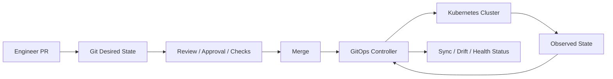
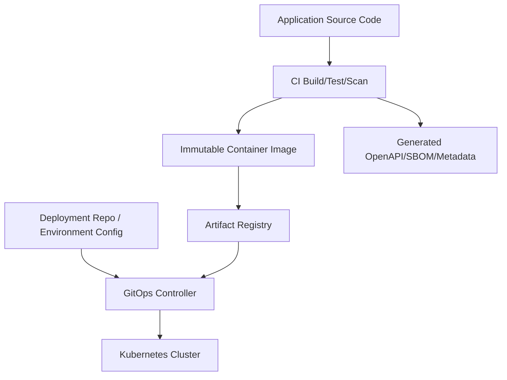
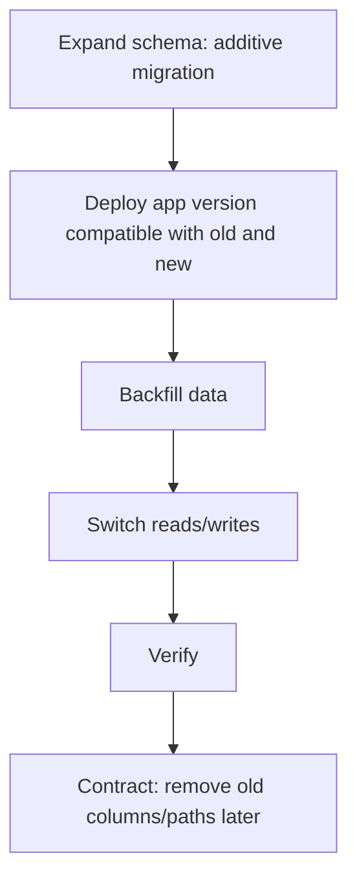

# Part 046 — GitOps, IaC, and Environment Promotion

> Core idea: GitOps and IaC are not about YAML enthusiasm.  
> They are about making production change reviewable, reproducible, reversible where possible, auditable, and aligned with how enterprise customers actually receive software.

For CSG Quote & Order-style systems, deployment change is business change.

A deployment may alter:

- quote acceptance behavior,
- pricing logic,
- approval thresholds,
- catalog publish path,
- order decomposition,
- Kafka event emission,
- PostgreSQL schema,
- tenant/customer-specific behavior,
- security policy,
- integration endpoint routing,
- observability and supportability.

If production state is changed manually, invisibly, or inconsistently across environments, senior engineers lose the ability to reason about incidents.

GitOps and Infrastructure as Code exist to prevent that.

They make the desired state explicit.

But they also introduce their own failure modes:

- a bad manifest is reconciled automatically,
- a manual hotfix is overwritten,
- a secret rotation is not represented correctly,
- environment overlays drift,
- promotion skips required gates,
- rollback reverts app config but not database migration,
- tenant-specific override becomes permanent undocumented behavior,
- on-prem packages diverge from SaaS manifests.

This part teaches how to reason about GitOps/IaC as a production control system.

---

## 1. Source Boundary and Fact Discipline

This part uses public GitOps, Kubernetes, and IaC concepts.
It does **not** assume CSG's actual GitOps tool, IaC stack, repository topology, branching model, deployment environments, customer packaging, approval workflow, or release process.

Public references useful for this part:

- OpenGitOps Principles: https://opengitops.dev/
- Argo CD documentation: https://argo-cd.readthedocs.io/
- Argo CD automated sync: https://argo-cd.readthedocs.io/en/latest/user-guide/auto_sync/
- Flux documentation: https://fluxcd.io/flux/
- Terraform documentation: https://developer.hashicorp.com/terraform
- Terraform state: https://developer.hashicorp.com/terraform/language/state
- Kubernetes declarative management: https://kubernetes.io/docs/tasks/manage-kubernetes-objects/declarative-config/
- Kubernetes configuration best practices: https://kubernetes.io/docs/concepts/configuration/overview/

Internal verification checklist:

- Which GitOps tool is used?
- Is the tool Argo CD, Flux, custom pipeline, customer-specific deployer, or something else?
- Which repositories define deployment desired state?
- Which repositories define infrastructure desired state?
- Are application source, deployment config, and infra config separated?
- How are environments represented?
- How are customer/on-prem deployments represented?
- Is promotion pull-based, push-based, or manual?
- Are production changes PR-reviewed?
- Are manual cluster changes allowed?
- How is drift detected?
- How are secrets managed?
- How are database migrations coordinated with app deployment?
- What is the rollback strategy?
- Who approves production changes?
- How are customer-specific overrides governed?

---

## 2. The Problem GitOps Is Solving

Without GitOps/IaC, production state often becomes tribal knowledge.

Example failure pattern:

```text
Production bug occurs.
Team checks code.
Code looks correct.
Team checks config.
Config in repo looks correct.
Live cluster has a manual env var override from 3 months ago.
No one remembers why.
Incident takes hours.
```

GitOps tries to make this impossible or at least detectable.

Desired state should be:

- declarative,
- versioned,
- reviewable,
- immutable in history,
- automatically reconciled,
- auditable,
- environment-specific in controlled ways,
- recoverable by moving Git state.

IaC applies similar discipline to infrastructure:

- networks,
- clusters,
- databases,
- IAM,
- storage,
- DNS,
- load balancers,
- monitoring resources,
- secrets metadata,
- platform add-ons.

Together, GitOps and IaC answer:

```text
What should exist?
Who changed it?
Why was it changed?
When did it change?
What was reviewed?
What differs from desired state?
How do we recreate it?
How do we promote it safely?
```

---

## 3. GitOps Mental Model

GitOps treats Git as the source of truth for desired state.
A controller observes Git and the cluster, then reconciles the live state to match Git.



Important distinction:

| Concept | Meaning |
|---|---|
| Desired state | What Git says should exist |
| Observed state | What the cluster currently has |
| Reconciliation | Controller action to reduce difference |
| Drift | Live state differs from desired state |
| Sync | Desired and observed state match, according to tool |
| Health | Resources are functioning, not merely applied |

A synced application is not necessarily healthy.
A healthy application is not necessarily correct.
A correct deployment is not necessarily released to all tenants.

Do not collapse these concepts.

---

## 4. IaC Mental Model

Infrastructure as Code defines infrastructure declaratively or semi-declaratively in versioned files.

Typical resources:

- Kubernetes clusters,
- VPC/VNet/networking,
- security groups/firewall rules,
- databases,
- Kafka clusters/topics,
- IAM roles/policies,
- object storage,
- DNS records,
- load balancers,
- secret stores,
- observability resources.

IaC tools often maintain state to map declared resources to real resources.

This state is critical.

If IaC state is wrong:

- tool may attempt to recreate existing resources,
- tool may destroy wrong resources,
- drift may be hidden,
- dependencies may be miscomputed,
- emergency manual changes may be overwritten.

Senior engineers do not need to be full platform specialists, but they must understand when an application change depends on infrastructure state.

Examples:

- new outbound integration requires firewall/security group change,
- new Kafka topic requires partition/retention policy,
- new S3/object bucket requires encryption/retention policy,
- new service requires DNS/TLS/ingress setup,
- new customer tenant requires namespace/database/schema/IAM provisioning,
- new metric/alert requires observability infrastructure.

---

## 5. Build Artifact vs Deployment Desired State

A mature delivery model separates source code, build artifact, and deployment desired state.



Key principle:

```text
CI builds artifacts.
GitOps deploys desired state.
```

CI should not need direct production cluster credentials if a pull-based GitOps model is used.

Instead, CI may:

- build image,
- run tests,
- scan image,
- publish artifact,
- open PR to update deployment repo,
- write image digest/version to environment manifest,
- attach changelog/SBOM/test result.

The GitOps controller applies the merged desired state.

This creates a reviewable production change.

---

## 6. Immutable Artifacts

GitOps is weakened if artifacts are mutable.

Bad:

```yaml
image: registry.example.com/order-service:latest
```

Better:

```yaml
image: registry.example.com/order-service:1.42.7
```

Stronger:

```yaml
image: registry.example.com/order-service@sha256:abc123...
```

Why:

- tag can be overwritten,
- rollback target becomes ambiguous,
- audit cannot prove what code ran,
- on-prem customer package may not match SaaS,
- vulnerability remediation cannot trace impact reliably.

A production deployment should be traceable from pod back to:

- git commit,
- build pipeline run,
- dependency lock/BOM,
- container image digest,
- SBOM,
- vulnerability scan,
- deployment PR,
- release notes,
- approval record.

---

## 7. Environment Promotion

Environment promotion is the controlled movement of a change through environments.

Example:

```text
local -> dev -> test -> integration -> staging -> pre-prod -> production
```

But not all environments are equal.

| Environment | Purpose |
|---|---|
| Dev | Fast feedback, integration smoke |
| Test | Automated integration tests |
| Integration | Cross-service/customer-like integration |
| Staging | Production-like validation |
| Pre-prod | Release candidate validation |
| Production | Customer-impacting traffic |
| On-prem package | Customer-controlled deployment artifact |

Do not treat promotion as copying YAML blindly.

Promotion should answer:

- What artifact version is promoted?
- What config changes are included?
- What schema migrations are included?
- What feature flags are enabled?
- Which tenants/customers are affected?
- What test evidence exists?
- What rollback/roll-forward path exists?
- What monitoring is required?

---

## 8. Promotion Models

### 8.1 Branch-per-environment

Example:

```text
main
staging
production
```

Pros:

- simple mental model,
- environment history in branch,
- promotion via merge/cherry-pick.

Cons:

- branch drift,
- merge conflicts,
- hard to compare environments,
- accidental divergence.

### 8.2 Directory-per-environment

Example:

```text
environments/
  dev/
  staging/
  production/
```

Pros:

- easy diff between environments,
- single branch governance,
- PR review can compare overlays.

Cons:

- repo can grow large,
- access control may be harder,
- accidental cross-environment changes possible.

### 8.3 App-of-apps / environment apps

Common in Argo CD-style setups.

Pros:

- scalable for many apps,
- controller manages multiple applications,
- environment composition explicit.

Cons:

- indirection,
- dependency ordering issues,
- harder onboarding.

### 8.4 Release bundle model

Common for on-prem or customer-controlled deployment.

A release bundle may include:

- container images,
- Helm charts/manifests,
- migrations,
- documentation,
- checksums/signatures,
- SBOM,
- release notes,
- upgrade guide.

Pros:

- works for disconnected/air-gapped customers,
- reproducible package,
- customer-controlled install window.

Cons:

- slower feedback,
- customer environment variance,
- harder telemetry,
- rollback and support complexity.

Internal verification checklist:

- Which promotion model is used for SaaS/cloud?
- Which model is used for on-prem?
- Are release bundles generated?
- Are image digests pinned?
- Are environment diffs easy to review?
- Are production PRs separated from dev/test PRs?

---

## 9. Environment Overlays

Kubernetes desired state often uses overlays to vary configuration by environment.

Common tools:

- Helm values,
- Kustomize overlays,
- Jsonnet,
- plain YAML with generator,
- platform-specific templates.

Example conceptual overlay:

```text
base/
  deployment.yaml
  service.yaml
  configmap.yaml

overlays/
  dev/
    kustomization.yaml
  staging/
    kustomization.yaml
  production/
    kustomization.yaml
```

Environment differences should be intentional.

Healthy differences:

- replica count,
- resource size,
- external endpoints,
- TLS/cert references,
- logging verbosity,
- feature flag default off/on by promotion stage,
- tenant/customer set,
- ingress hostnames.

Dangerous differences:

- different state machine behavior,
- different authorization rules,
- different API compatibility behavior,
- disabled audit in lower env,
- missing migrations in test,
- different Kafka partitioning assumptions,
- different DB isolation model,
- production-only code path untested.

Rule:

```text
Environment overlays should vary operational configuration, not hide untested product behavior.
```

---

## 10. Customer-Specific Configuration

Enterprise products often support customer-specific settings.

For Quote & Order, examples may include:

- tenant/customer enabled features,
- integration endpoints,
- pricing behavior switches,
- catalog publish windows,
- approval thresholds,
- authentication provider configuration,
- certificate/truststore config,
- fulfillment adapter mapping,
- billing integration options.

Customer-specific config is risky because it can become undeclared product forks.

Governance questions:

- Is this configuration documented?
- Is it versioned?
- Is it tested?
- Is it visible in support tools?
- Is it audited?
- Is there a default?
- Is the behavior covered by product semantics?
- Can it be removed?
- Does it interact with other flags?
- Does it change API/event contract?

Senior engineers should treat customer-specific config as code plus product behavior.

---

## 11. Secrets in GitOps

Secrets must not be stored as plaintext in Git.

Common approaches:

- external secret manager,
- sealed/encrypted secrets,
- secret operator,
- SOPS/encrypted files,
- cloud secret store references,
- customer-provided secret injection for on-prem.

Important distinction:

```text
Secret value should be protected.
Secret reference/configuration should be reviewable.
```

Example desired state may declare:

```yaml
apiVersion: external-secrets.io/v1beta1
kind: ExternalSecret
metadata:
  name: order-service-db
spec:
  secretStoreRef:
    name: platform-secret-store
  target:
    name: order-service-db
  data:
    - secretKey: username
      remoteRef:
        key: /prod/order-service/db/username
    - secretKey: password
      remoteRef:
        key: /prod/order-service/db/password
```

Questions:

- Who can read secret values?
- Who can change secret references?
- Are secret rotations audited?
- Do pods reload secrets without restart?
- Are old secrets retained long enough for rollout?
- Are secrets exposed through env vars or mounted files?
- Are secrets masked in logs and pipeline output?
- How does on-prem secret injection work?

---

## 12. Drift

Drift means live state differs from desired state.

Types of drift:

| Type | Example | Risk |
|---|---|---|
| Manual hotfix drift | Engineer edits deployment in cluster | Git no longer describes production |
| Controller drift | Another controller mutates resources | Desired/live diff noisy or hidden |
| Secret drift | Secret value changed outside process | App behavior changes without PR |
| Infra drift | Security group edited manually | Network exposure changes |
| Config drift | Production env var differs from repo | Non-reproducible behavior |
| Customer drift | On-prem customer edits chart | Support cannot reproduce |

GitOps tools can detect some drift.
IaC tools can detect some infrastructure drift.
But not all drift is automatically visible.

A senior engineer asks:

```text
Which source of truth owns this field?
```

If ownership is unclear, drift is inevitable.

---

## 13. Auto-Sync vs Manual Sync

GitOps controllers may apply changes automatically or require manual sync.

### Auto-sync

Pros:

- faster reconciliation,
- less manual toil,
- drift corrected quickly,
- CI/CD does not need cluster credentials.

Cons:

- bad PR affects environment immediately after merge,
- emergency manual mitigation can be reverted,
- requires strong gates before merge,
- less room for manual release coordination.

### Manual sync

Pros:

- controlled release timing,
- useful for production windows,
- easier coordination with DB migration/customer comms.

Cons:

- manual toil,
- delayed drift correction,
- risk of forgotten sync,
- Git merge does not equal deployed state.

There is no universal answer.

For production Quote & Order, sync mode should align with:

- release governance,
- customer maintenance windows,
- migration risk,
- incident response model,
- on-call maturity,
- quality gate strength.

---

## 14. GitOps and Database Migrations

GitOps can deploy Kubernetes desired state, but database migration is not always safely reversible.

This is a critical boundary.

Bad pattern:

```text
Merge deployment PR.
GitOps rolls pods.
New pods auto-run destructive migration.
Old pods still running.
Rollback fails.
```

Safer expand-contract model:



GitOps should represent migration-related state explicitly where possible:

- migration Job,
- migration image version,
- migration status,
- app version compatibility,
- feature flag gating,
- post-migration verification,
- rollback/roll-forward notes.

Questions:

- Does GitOps apply migration job before app deployment?
- Is ordering guaranteed?
- What happens if migration job fails?
- Can old app run after migration?
- Can new app run before migration?
- Is migration idempotent?
- Is migration safe in on-prem upgrade?
- Are large backfills separate from deployment?

---

## 15. GitOps and Kafka/Async Resources

Infrastructure/deployment state may include Kafka resources:

- topics,
- partitions,
- retention,
- ACLs,
- schema registry subjects,
- connectors,
- consumer group permissions.

Changes are not trivial.

Examples:

- Increasing partition count can affect ordering assumptions.
- Reducing retention can break replay/reconciliation needs.
- Changing cleanup policy can delete audit-critical events.
- Changing schema compatibility mode can break producers/consumers.
- Changing ACLs can break service startup.

GitOps/IaC PRs that touch Kafka resources must be reviewed by someone who understands event semantics.

Checklist:

- What domain event uses this topic?
- What is the partition key?
- Is ordering required?
- What is retention based on?
- Are events replayed operationally?
- Is schema compatibility preserved?
- Are consumers known?
- Are ACLs least privilege?

---

## 16. GitOps and Feature Flags

Feature flags may live outside Kubernetes desired state.

This creates split-brain release state:

```text
Git says version 1.42.7 is deployed.
Feature flag system says new pricing path is enabled for Customer A.
```

Both are production state.

Feature flag governance should answer:

- Are flag definitions versioned?
- Are flag changes audited?
- Who can enable production flags?
- Are flags tenant/customer scoped?
- Is there a kill switch?
- Are stale flags removed?
- Are flag combinations tested?
- Do release notes include flag state?

For Quote & Order, feature flags can alter commercial behavior.
They must be treated as controlled changes.

---

## 17. GitOps and Observability Resources

Dashboards and alerts should also be managed declaratively where possible.

Otherwise, operational readiness drifts from deployed behavior.

Examples of declarative observability:

- PrometheusRule,
- ServiceMonitor,
- dashboard JSON/definitions,
- log pipeline config,
- alert routes,
- synthetic monitor config,
- SLO definitions.

A production change should include observability changes when needed.

Examples:

- New order fallout state -> dashboard and alert update.
- New Kafka topic -> lag dashboard.
- New external integration -> error/latency panel.
- New migration job -> success/failure alert.
- New feature flag -> business metric segmentation.

Review question:

```text
Can on-call detect failure of this change after deployment?
```

If not, the change is incomplete.

---

## 18. GitOps Repository Design

There is no perfect repository structure.
But the structure should make ownership, review, and promotion clear.

Possible split:

```text
app-source-repo/
  src/
  pom.xml
  Dockerfile
  openapi/

deployment-repo/
  apps/
    quote-service/
      base/
      overlays/
        dev/
        staging/
        prod/
    order-service/
      base/
      overlays/
        dev/
        staging/
        prod/

infra-repo/
  clusters/
  networks/
  databases/
  kafka/
  iam/
  observability/
```

Questions:

- Who owns app source?
- Who owns deployment config?
- Who owns infrastructure?
- Who reviews production changes?
- Can app teams update their own manifests?
- Can platform teams enforce standards?
- Is there a golden template?
- How are shared platform resources changed?
- How are customer-specific overlays represented?

Bad smell:

```text
No one knows whether a change belongs in app repo, platform repo, deployment repo, or customer repo.
```

This leads to hidden coupling and slow delivery.

---

## 19. Policy as Code and Guardrails

GitOps/IaC needs guardrails.

Examples:

- no mutable image tags,
- required resource requests/limits,
- required probes,
- no privileged containers,
- no plaintext secrets,
- required labels/annotations,
- required PDB for critical services,
- restricted ingress exposure,
- approved base images,
- required network policy,
- required SBOM/vulnerability scan,
- production changes require approval.

Tools may include:

- admission controllers,
- OPA/Gatekeeper,
- Kyverno,
- CI policy checks,
- Terraform policy checks,
- custom linters,
- security scanners.

Policy should prevent common unsafe states before they reach production.

But guardrails must be explainable.
Opaque policy failures slow teams down.

---

## 20. Promotion Gates

A production promotion should require evidence.

Possible gates:

- unit tests passed,
- integration tests passed,
- contract tests passed,
- migration tests passed,
- image scan acceptable,
- SBOM generated,
- OpenAPI diff reviewed,
- Kafka schema compatibility verified,
- performance impact acceptable,
- operational dashboard updated,
- runbook updated,
- rollback/roll-forward plan documented,
- product/customer approval if behavior changes,
- security approval if auth/tenant boundary changes.

Not every change needs every gate.

But high-risk changes should trigger additional gates:

| Change type | Extra gates |
|---|---|
| DB migration | migration test, rollback plan, data backup/repair plan |
| API contract | OpenAPI diff, consumer contract test |
| Kafka schema/topic | schema compatibility, replay/consumer review |
| Security/auth | threat review, negative authorization tests |
| Pricing/approval | business rule sign-off, audit evidence review |
| Tenant isolation | cross-tenant tests, security review |
| Decomposition | fulfillment simulator, fallout recovery plan |

This is how deployment governance becomes risk-based instead of bureaucratic.

---

## 21. Rollback and Roll Forward

Rollback is not always safe.

Rollback dimensions:

| Dimension | Example |
|---|---|
| Image rollback | deploy previous container image |
| Config rollback | restore previous ConfigMap/values |
| Feature rollback | disable flag |
| Route rollback | shift traffic back |
| Schema rollback | usually hard/dangerous |
| Data rollback | often impossible without repair |
| Event rollback | cannot unpublish consumed events |

For enterprise systems, roll-forward is often safer after data side effects.

Example:

```text
Bug: new order decomposition emitted invalid task event.
Rollback image stops new bad events.
But existing bad tasks remain.
Need repair/reconciliation.
```

A deployment plan should state:

- what can be rolled back,
- what cannot be rolled back,
- what must be repaired,
- how to detect affected entities,
- how to communicate impact,
- who approves recovery.

---

## 22. Manual Hotfixes

Manual production change may be necessary during incidents.

But manual change must become declared state or be intentionally reverted.

Emergency process should answer:

- Who can make manual changes?
- What changes are allowed?
- How is change logged?
- How long can drift exist?
- How is Git updated afterward?
- How is GitOps auto-sync handled during hotfix?
- How are customer/on-prem environments updated?

Bad incident outcome:

```text
Manual fix solved outage.
GitOps reverted it 10 minutes later.
```

Another bad outcome:

```text
Manual fix stayed in production for 6 months and never reached staging.
```

Both are governance failures.

---

## 23. On-Prem and Air-Gapped Constraints

Enterprise software may be deployed in customer-controlled environments.

On-prem/air-gapped constraints may include:

- no direct internet access,
- customer registry,
- customer certificates,
- customer-managed PostgreSQL/Kafka,
- restricted Kubernetes version,
- limited observability tooling,
- manual upgrade window,
- customer security review,
- different ingress/load balancer,
- restricted CRDs/operators,
- custom secret management,
- slow rollback process.

GitOps may be used by the customer or not at all.

Therefore release artifacts must be self-contained and supportable:

- versioned manifests/charts,
- image digests/checksums,
- SBOM,
- migration scripts,
- preflight checks,
- post-upgrade validation,
- rollback/roll-forward notes,
- compatibility matrix,
- known limitations,
- support diagnostics.

Cloud-native architecture is not automatically on-prem-ready.

---

## 24. Environment Parity and Its Limits

“Dev should match production” is directionally correct but impossible literally.

Production differs in:

- data volume,
- traffic shape,
- customer config,
- integration endpoints,
- security controls,
- latency,
- failure modes,
- compliance constraints,
- operational processes.

The practical goal is:

```text
High-risk assumptions should be tested before production.
```

Examples:

- DB migrations tested on production-like data volume.
- Kafka consumers tested with realistic partition/lag conditions.
- Catalog/pricing tested with realistic catalog complexity.
- Auth tested with real identity provider behavior where possible.
- Tenant isolation tested with multiple tenants.
- Rollback tested in staging.
- On-prem package tested in constrained environment.

Environment parity is about risk reduction, not identical hardware.

---

## 25. Change Taxonomy

Not all changes have the same risk.

Classify changes before promotion.

| Change | Risk level | Examples |
|---|---|---|
| Low | Small, reversible, no contract/data change | logging text, dashboard panel |
| Medium | Behavior change with tests and rollback | validation rule, config default |
| High | Contract/data/security/integration change | API field semantics, migration, auth policy |
| Critical | Cross-customer, irreversible, revenue-impacting | pricing logic, approval authority, order decomposition |

For high/critical changes, require:

- design review,
- explicit rollout plan,
- feature flag if possible,
- observability update,
- migration rehearsal,
- data repair plan,
- support readiness,
- stakeholder awareness.

This prevents treating a pricing-rule deployment like a typo fix.

---

## 26. GitOps Failure Modes

### 26.1 Bad desired state reconciled perfectly

GitOps does not know the desired state is wrong.

Detection:

- deployment health degraded,
- business metrics drop,
- app logs show config error,
- sync status still green.

Mitigation:

- strong pre-merge checks,
- canary/staged rollout,
- observability gates,
- manual sync for high-risk prod changes.

### 26.2 Drift hidden by ignored differences

GitOps tools may ignore certain fields to reduce noise.

Risk:

- important runtime difference becomes invisible.

Mitigation:

- review ignore rules,
- document field ownership,
- audit live-vs-desired periodically.

### 26.3 Environment overlay divergence

Dev/staging/prod overlays differ in behavior, not just capacity/config.

Risk:

- production-only failures.

Mitigation:

- diff overlays,
- minimize behavior differences,
- promote same artifact,
- test production-like config.

### 26.4 Secret/config mismatch

Deployment references missing or wrong secret.

Risk:

- pods fail startup,
- auth failures,
- integration outages.

Mitigation:

- preflight secret existence checks,
- secret rotation runbooks,
- startup validation.

### 26.5 Rollback illusion

Git revert restores manifest but cannot undo data/event side effects.

Risk:

- false confidence.

Mitigation:

- explicit rollback dimension analysis,
- repair/reconciliation plan.

---

## 27. IaC Failure Modes

### 27.1 State corruption or mismatch

IaC state no longer maps correctly to real resources.

Risk:

- destructive plan,
- duplicate resources,
- broken dependencies.

Mitigation:

- remote locked state,
- state backup,
- plan review,
- restricted state operations,
- import process discipline.

### 27.2 Manual infra change

Someone changes cloud/network/database resource outside IaC.

Risk:

- drift,
- security exposure,
- inconsistent disaster recovery.

Mitigation:

- drift detection,
- change restrictions,
- reconcile manually approved emergency changes back to IaC.

### 27.3 Destructive plan approved casually

IaC plan shows replacement/destroy but reviewer misses it.

Risk:

- outage,
- data loss,
- network isolation.

Mitigation:

- plan summaries,
- policy checks,
- high-risk resource approval,
- protected resources,
- backups.

### 27.4 Shared module blast radius

Changing a shared Terraform/Helm module affects many services/customers.

Risk:

- broad unintended behavior change.

Mitigation:

- module versioning,
- staged rollout,
- changelog,
- consumer impact analysis.

---

## 28. Design Pattern: Promotion PR

A production promotion PR should include more than a version bump.

Example PR content:

```markdown
## Change
Promote order-service from 1.42.6 to 1.42.7.

## Artifact
- Image digest: sha256:...
- Git commit: abc123
- Build: CI #8721
- SBOM: attached
- Vulnerability scan: passed with accepted exceptions

## Functional scope
- Fixes duplicate fallout task creation on retry.
- No API contract changes.
- No DB migration.
- No Kafka schema changes.

## Risk
- Affects order retry path.
- Could alter fallout queue volume.

## Validation
- Unit tests: passed
- Integration tests: passed
- Kafka replay test: passed
- E2E amend/cancel/retry scenario: passed

## Observability
- Watch order retry success rate.
- Watch fallout queue volume.
- Watch duplicate task metric.

## Rollback
- Image rollback safe.
- No migration.
- Feature flag `order.retry.dedupe.v2` can be disabled.
```

This transforms deployment from “merge YAML” into operational decision-making.

---

## 29. Design Pattern: Environment Diff Review

Before production promotion, compare environment differences.

Checklist:

- image version,
- replicas,
- resource limits,
- feature flags,
- DB connection pool,
- Kafka topic names,
- external endpoints,
- auth issuer/audience,
- secret references,
- migration version,
- ingress hosts/routes,
- network policies,
- observability config,
- customer-specific overrides.

Danger sign:

```text
Staging passed, but production uses a different pricing config path.
```

Environment diff should be a normal part of release review.

---

## 30. Design Pattern: GitOps Runbook

Each application should have a runbook that explains:

- where desired state lives,
- which GitOps app owns it,
- how sync works,
- how to pause sync,
- how to roll back image/config,
- how to inspect drift,
- how to check health,
- how to handle failed sync,
- how to coordinate migrations,
- who approves production changes,
- how on-prem package differs.

Example sections:

```text
1. Service ownership
2. Deployment repository
3. GitOps application
4. Environments
5. Promotion path
6. Required checks
7. Rollback procedure
8. Migration procedure
9. Drift handling
10. Contacts/escalation
```

Runbooks are part of production readiness.

---

## 31. Internal Verification Deep-Dive Tasks

### Task 1 — Trace one production deployment path

Choose one service.

Trace:

- app source repo,
- CI pipeline,
- artifact registry,
- deployment repo,
- GitOps app,
- Kubernetes namespace,
- live deployment,
- ingress/service,
- dashboard,
- production promotion PR.

Document the path from commit to pod.

### Task 2 — Compare environment overlays

For the same service, compare dev/staging/prod:

- image version,
- resources,
- replicas,
- probes,
- config,
- secrets,
- feature flags,
- external endpoints,
- DB/Kafka settings.

Identify whether differences are operational or behavioral.

### Task 3 — Find drift examples

Ask the team:

- Have manual prod changes happened?
- How were they reconciled?
- Does GitOps auto-revert them?
- Are ignored differences documented?
- Are customer environments known to drift?

### Task 4 — Inspect a high-risk promotion

Pick an old release involving:

- DB migration,
- API change,
- Kafka change,
- pricing/approval change,
- tenant isolation change.

Review the promotion evidence and incident outcome.

### Task 5 — On-prem packaging review

Find:

- release bundle format,
- image registry process,
- chart/manifests,
- migration packaging,
- customer upgrade guide,
- compatibility matrix,
- rollback notes,
- diagnostics support.

---

## 32. Senior PR Review Checklist for GitOps/IaC

### 32.1 Desired state clarity

- Is the change declarative?
- Is ownership clear?
- Is the target environment clear?
- Is the artifact immutable?
- Is the change reviewable without hidden context?

### 32.2 Safety

- Are probes/resources/security context still valid?
- Is rollout strategy safe?
- Are secrets handled correctly?
- Are network exposure changes intentional?
- Are RBAC/IAM changes least privilege?

### 32.3 Compatibility

- Does app version match DB schema compatibility?
- Are API/event changes backward compatible?
- Can old and new versions coexist?
- Are feature flags defaulted safely?
- Are customer-specific configs compatible?

### 32.4 Promotion evidence

- Which tests passed?
- Which scans passed?
- Is OpenAPI/Kafka schema diff reviewed?
- Is migration tested?
- Is performance impact known?
- Are dashboards/runbooks updated?

### 32.5 Rollback/recovery

- What can be rolled back?
- What cannot be rolled back?
- Is roll-forward plan documented?
- Is data repair/reconciliation needed?
- Are operators/support prepared?

### 32.6 Drift and governance

- Does this introduce manual steps?
- Does this create environment divergence?
- Is customer/on-prem variance documented?
- Is approval appropriate for risk level?

---

## 33. What Good Looks Like

A strong GitOps/IaC delivery model has these properties:

- production desired state is in Git or another audited control plane,
- artifacts are immutable and traceable,
- environment differences are intentional and reviewable,
- promotion has risk-based gates,
- deployment is separated from release/activation,
- database migrations are coordinated explicitly,
- secrets are referenced securely, not stored as plaintext,
- drift is detected and governed,
- rollback limitations are understood,
- observability changes are promoted with app changes,
- on-prem/customer packages are reproducible,
- manual hotfixes are reconciled back into source of truth,
- IaC changes receive architecture/security review when blast radius is high.

This is not bureaucracy.
It is how enterprise systems maintain trust while changing continuously.

---

## 34. Review Questions

Use these questions during onboarding, PR review, or release readiness:

1. What repository represents desired state for this service?
2. What is the exact artifact digest running in production?
3. Can we trace a pod back to a source commit and build?
4. Are environment differences operational or behavioral?
5. Who can approve a production deployment?
6. What happens if live cluster state differs from Git?
7. Can a manual emergency change survive GitOps reconciliation?
8. How is it reconciled afterward?
9. Does this deployment require DB migration?
10. Can old and new app versions coexist?
11. Is rollback safe after this change?
12. What production signal proves this change is healthy?
13. How is customer-specific config versioned and tested?
14. How is on-prem deployment kept aligned with cloud deployment?
15. What is the blast radius of this IaC module change?

If the team cannot answer these questions, the deployment process is operating on hope.

---

## 35. Summary

GitOps and IaC are not just tooling choices.
They are engineering control systems.

They make production change:

- explicit,
- reviewable,
- auditable,
- reproducible,
- promotable,
- observable,
- recoverable where possible.

But they only work when teams understand their boundaries.

GitOps can reconcile Kubernetes resources.
It cannot guarantee business correctness.

IaC can define infrastructure.
It cannot automatically determine whether a network change breaks customer integration.

A senior engineer combines GitOps/IaC discipline with domain reasoning:

- Does this change alter quote/order lifecycle behavior?
- Does it affect pricing, approval, tenant isolation, or audit?
- Does it require schema or event compatibility?
- Does it change operational blast radius?
- Can production support and incident response still reason about the system?

That is the real goal: not just automated deployment, but defensible enterprise change management.
