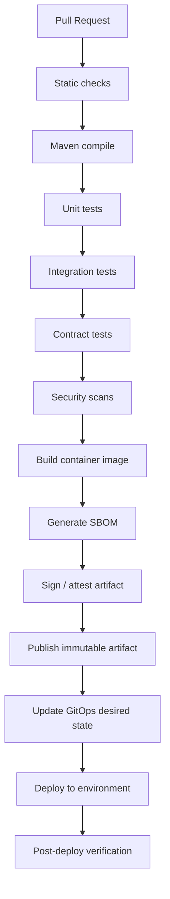
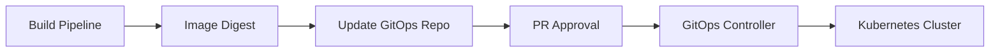

# Part 047 — CI/CD Pipeline: Build, Test, Scan, Package, Deploy

> Core idea: CI/CD is not only automation.  
> In an enterprise Quote & Order system, CI/CD is an evidence-producing control system that decides whether a change is safe enough to become customer-impacting behavior.

A CI/CD pipeline for CSG Quote & Order-style systems must protect much more than code style.

It must protect:

- quote pricing correctness,
- approval and authorization boundaries,
- order lifecycle invariants,
- Kafka event compatibility,
- PostgreSQL migration safety,
- TMF/OpenAPI contract compatibility,
- tenant isolation,
- audit evidence,
- container/runtime security,
- deployment traceability,
- rollback or roll-forward readiness,
- supportability in cloud and on-prem environments.

A weak pipeline lets defects become production incidents.

A strong pipeline does not guarantee correctness, but it makes unsafe change much harder to merge, package, and deploy silently.

This part treats CI/CD as a production control plane.

---

## 1. Source Boundary and Fact Discipline

This part uses public CI/CD, Maven, Docker, Kubernetes, SLSA, SBOM, GitHub/GitLab/Jenkins-style concepts, and cloud-native delivery practices.

It does **not** assume CSG's actual CI/CD platform, branch model, deployment tool, artifact registry, security scanner, approval workflow, release train, or customer packaging process.

Public references useful for this part:

- GitHub Actions documentation: https://docs.github.com/en/actions
- GitHub Actions secure use reference: https://docs.github.com/en/actions/reference/security/secure-use
- GitHub code scanning: https://docs.github.com/en/code-security/code-scanning
- Apache Maven lifecycle: https://maven.apache.org/guides/introduction/introduction-to-the-lifecycle.html
- Docker build best practices: https://docs.docker.com/build/building/best-practices/
- Kubernetes deployments: https://kubernetes.io/docs/concepts/workloads/controllers/deployment/
- OpenGitOps principles: https://opengitops.dev/
- SLSA: https://slsa.dev/
- CycloneDX SBOM standard: https://cyclonedx.org/
- SPDX SBOM standard: https://spdx.dev/

Internal verification checklist:

- Which CI/CD system is actually used?
- Which repositories produce deployable artifacts?
- What is the branch strategy?
- What checks are required before merge?
- What checks are advisory only?
- What security scans exist?
- What is the artifact registry?
- Are artifacts immutable after build?
- Are image digests used in deployment manifests?
- Is there a formal release approval gate?
- How are database migrations sequenced relative to deployment?
- Are customer/on-prem packages produced from the same pipeline?
- How is failed deployment rolled back or rolled forward?
- Who can bypass CI/CD gates?
- Are bypasses audited?

---

## 2. Mental Model: CI/CD as an Evidence Factory

A pipeline is not just a sequence of jobs.

It is an evidence factory.

Each stage should answer a specific question.

| Stage | Question answered |
|---|---|
| Checkout | What source revision are we building? |
| Build | Can the source compile reproducibly? |
| Unit test | Do local business invariants still hold? |
| Integration test | Does the service work with real dependencies? |
| Contract test | Are external contracts still compatible? |
| Migration test | Can data/schema change be applied safely? |
| Security scan | Did we introduce known vulnerabilities or secrets? |
| Package | What immutable artifact was produced? |
| Sign/attest | Can we prove where the artifact came from? |
| Publish | Is the artifact stored immutably? |
| Deploy | Was the right artifact applied to the right environment? |
| Verify | Is the deployed system healthy? |

A senior engineer should ask:

- What evidence does this pipeline produce?
- Which production risks are not tested?
- Which gate can be bypassed?
- Which gate is flaky and ignored?
- Which artifact is actually deployed?
- Can we trace a production pod back to commit, PR, build, image digest, migration, and approval?

If the answer is no, the pipeline is not a trustworthy control system.

---

## 3. Pipeline Shape for Enterprise Java Services

A production-grade Java service pipeline usually has this shape:



This is not the only valid shape.

But the responsibilities should exist somewhere.

If a pipeline only does `mvn package` and image push, it is not enough for mission-critical Quote & Order systems.

---

## 4. Build Stage: Reproducibility Before Speed

A build should be deterministic enough that two builds from the same source and dependency set produce equivalent artifacts.

Important build controls:

- fixed Java version,
- fixed Maven version or wrapper,
- pinned plugin versions,
- dependency convergence checks,
- no dynamic dependency versions,
- no build-time calls to unstable external endpoints,
- no generated source drift,
- no local developer machine dependency,
- no hidden environment-specific behavior,
- no mutable snapshot artifact in release path unless explicitly governed.

For enterprise systems, reproducibility matters because customer incidents may require answering:

> Which exact code and dependencies produced the running artifact?

A build that cannot answer this is operationally weak.

### Java/Maven build checks

Recommended checks for a service build:

```bash
./mvnw -B -ntp clean verify
./mvnw -B -ntp dependency:tree
./mvnw -B -ntp enforcer:enforce
```

Common Maven controls:

- Maven Enforcer Plugin for Java/Maven/dependency rules,
- dependency convergence checks,
- banned dependency rules,
- plugin version pinning,
- Surefire for unit tests,
- Failsafe for integration tests,
- JaCoCo for coverage where useful,
- OWASP Dependency-Check or equivalent SCA tool,
- license scanning if required.

Internal verification checklist:

- Is `mvnw` used?
- Are Maven plugins pinned?
- Is the Java version enforced?
- Are dependency convergence rules enabled?
- Are snapshot dependencies allowed?
- Is the build hermetic enough for release artifacts?
- Are generated sources committed or generated in CI?

---

## 5. Test Stages: Match Test Type to Risk

A common mistake is treating all tests as equal.

They are not.

Different tests protect different failure modes.

| Test type | Protects against | Example in Quote & Order |
|---|---|---|
| Unit test | Local domain rule regression | Quote cannot be accepted after expiry |
| State machine test | Illegal lifecycle transition | Order cannot complete while item is in fallout |
| Integration test | Real DB/Kafka/framework behavior | Outbox row inserted in same transaction as order update |
| Contract test | Consumer/provider breakage | TMF622 response remains backward compatible |
| Migration test | Unsafe schema/data change | Existing quote rows survive migration |
| Security test | Unauthorized action | Sales user cannot approve own excessive discount |
| E2E test | Journey correctness | Configure-price-quote-approve-order path works |
| Performance test | Hot path degradation | Pricing latency remains within SLO |

The pipeline should avoid pretending that one test type covers all risks.

### Unit tests

Unit tests should protect domain invariants:

- quote state transitions,
- order item dependency rules,
- pricing rule precedence,
- discount threshold logic,
- approval authority,
- tenant scoping helpers,
- event creation logic,
- idempotency decision logic.

### Integration tests

Integration tests should use real dependencies where correctness depends on behavior of those dependencies:

- PostgreSQL transactions,
- locking behavior,
- MyBatis mapper mapping,
- Kafka producer/consumer behavior,
- outbox relay behavior,
- migration tool behavior,
- serialization/deserialization.

For many Java services, Testcontainers is a strong default for PostgreSQL and Kafka integration tests.

### Contract tests

Contract tests should catch:

- OpenAPI breaking changes,
- removed fields,
- changed required/optional fields,
- enum compatibility issues,
- event schema incompatibility,
- error response changes,
- pagination/filtering behavior changes.

### Migration tests

Migration tests should prove:

- migration applies from previous released schema,
- migration works with representative production-like data,
- application version N and N+1 can coexist during rolling deploy where required,
- backfill is resumable,
- rollback or roll-forward strategy is clear.

---

## 6. Quality Gates: Required, Advisory, and Dangerous

Not every check should have the same enforcement level.

Classify gates deliberately.

| Gate type | Meaning | Example |
|---|---|---|
| Required gate | Must pass before merge/deploy | Compile, unit tests, critical contract tests |
| Conditional gate | Required for specific changes | Migration test when DB schema changes |
| Advisory gate | Visible but not blocking | Non-critical coverage trend |
| Manual gate | Human approval required | Production deployment |
| Emergency override | Exceptional bypass | Incident mitigation deploy |

The dangerous pattern is an unofficial advisory gate that everyone treats as required, or a required gate that everyone bypasses because it is flaky.

A flaky required gate is worse than an honest advisory gate.

It trains engineers to ignore evidence.

Internal verification checklist:

- Which gates are required?
- Which gates are frequently bypassed?
- Which gates are flaky?
- Who owns flaky test cleanup?
- Which gates are change-type dependent?
- Are migration/security/contract gates triggered automatically?

---

## 7. Security Gates and Supply Chain Integrity

CI/CD has become part of the attack surface.

Security gates should cover at least:

- secret scanning,
- dependency vulnerability scanning,
- SAST/code scanning,
- container image scanning,
- IaC scanning,
- license policy checks,
- SBOM generation,
- artifact signing,
- provenance/attestation,
- least-privilege pipeline permissions,
- protected environment approvals.

### Pipeline credential discipline

CI/CD credentials are powerful.

Bad patterns:

- long-lived deploy token stored as plain secret,
- broad cloud credentials available to every PR,
- write permissions on pull requests from forks,
- one pipeline token can modify source, artifact, and production,
- unpinned third-party actions,
- scripts execute untrusted PR content with privileged token.

Better patterns:

- short-lived OIDC-based cloud credentials,
- least privilege per job,
- protected branches/environments,
- pin third-party actions by SHA where required,
- separate build and deploy permissions,
- separate artifact publish and production deploy authority,
- audit every manual approval and override.

### SBOM and provenance

An enterprise support team should be able to answer:

- Which dependency versions are inside this deployed image?
- Which base image was used?
- Which commit produced it?
- Which pipeline built it?
- Was the artifact modified after build?
- Which customer environments received it?

SBOM and provenance do not make software secure by themselves.

They make inventory and incident response possible.

---

## 8. Packaging: Build Once, Promote Many

A strong release process builds an immutable artifact once, then promotes the same artifact through environments.

Bad pattern:

```text
Build dev artifact  -> deploy dev
Build test artifact -> deploy test
Build prod artifact -> deploy prod
```

This creates uncertainty.

A production issue may not correspond exactly to what was tested.

Better pattern:

```text
Build artifact once
  -> publish immutable image digest
  -> deploy same digest to dev
  -> promote same digest to test
  -> promote same digest to staging
  -> promote same digest to production
```

For Docker/Kubernetes delivery, prefer image digest promotion over mutable tag promotion.

```yaml
image: registry.example.com/quote-order@sha256:...
```

Tags are useful for humans.

Digests are useful for correctness.

Internal verification checklist:

- Are images immutable?
- Are production manifests pinned by digest or tag?
- Can tags be overwritten?
- Is artifact promotion separate from rebuild?
- Is image signing enforced?
- Can support map running pod to image digest and commit?

---

## 9. Database Migrations in CI/CD

Database migration is not just a deployment step.

It is a compatibility problem.

The pipeline should detect risky migrations before they reach production.

Change categories:

| Change | Risk | Safer approach |
|---|---|---|
| Add nullable column | Usually low | Expand phase |
| Add non-null column with default | Lock/rewrite risk depending version/data | Add nullable, backfill, validate, then constrain |
| Rename column | Breaks old app version | Add new, dual write/read switch, remove later |
| Drop column/table | Breaks old version, repair risk | Contract phase after safe window |
| Add index | Lock/write impact if not concurrent | `CREATE INDEX CONCURRENTLY` where appropriate |
| Backfill large table | Load/locking risk | Chunked resumable backfill |

CI/CD should include migration checks:

- migration applies to previous released schema,
- migration applies to realistic data volume sample,
- migration is idempotent where intended,
- rollback/roll-forward plan exists,
- application compatibility is tested when rolling deployment is used,
- migration order is documented.

Internal verification checklist:

- Are migrations run by app startup, separate job, or release process?
- Is there a migration lock?
- Are migrations tested against production-like data?
- Are destructive migrations reviewed separately?
- Are backfills resumable?
- Are on-prem upgrades packaged with migration docs?

---

## 10. Kafka and Schema Gates

Event-driven systems need pipeline gates too.

Risks:

- event field removed,
- enum value changed,
- event semantics changed without schema change,
- partition key changed,
- event name reused for different meaning,
- topic retention changed,
- consumer lag caused by inefficient handler,
- replay breaks because consumer is not replay-safe.

Recommended gates:

- schema compatibility check,
- event envelope validation,
- contract tests for consumers,
- partition key review,
- replay test for critical consumers,
- DLQ behavior test,
- duplicate event test,
- out-of-order event test where relevant.

Internal verification checklist:

- Is there a schema registry?
- What compatibility mode is used?
- Who approves event schema changes?
- Are event schemas versioned with app code?
- Are consumer contracts known?
- Are replay procedures tested?

---

## 11. Deployment Gates and Environment Promotion

The deploy stage should not blindly push artifacts.

It should check:

- target environment,
- artifact digest,
- config version,
- migration status,
- feature flag state,
- required approvals,
- deployment window,
- current incident/freeze status,
- rollback plan,
- post-deploy verification.

For GitOps-based deployment, the CI pipeline may not deploy directly.

It may only update desired state:



This separation is good when it gives better audit and approval control.

It is bad if engineers cannot trace how source change becomes running workload.

---

## 12. Pipeline Failure Taxonomy

Not every failed build means the same thing.

A senior engineer should classify failures precisely.

| Failure class | Meaning | Response |
|---|---|---|
| Real product regression | Code broke intended behavior | Fix code or update intended behavior with review |
| Test bug | Test expectation wrong | Fix test, preserve intent |
| Flaky test | Non-deterministic test/environment | Quarantine only with owner and expiry |
| Infra outage | CI dependency unavailable | Retry after infra recovery, preserve evidence |
| Dependency vulnerability | New CVE or scanner update | Triage severity, exploitability, upgrade path |
| Contract break | Consumer compatibility risk | Fix API/event or coordinate versioning |
| Migration risk | Schema/data unsafe | Redesign rollout |
| Security policy violation | Credential/permission/secret issue | Block and remediate |

Avoid lazy labels like “CI is red”.

Name the risk.

---

## 13. Minimal Pipeline Blueprint

This is intentionally platform-neutral.

```yaml
pipeline:
  on:
    - pull_request
    - merge_to_main
    - release_tag

  stages:
    static_checks:
      - validate_formatting
      - validate_openapi_diff
      - validate_event_schema_compatibility
      - validate_maven_dependency_rules

    build:
      - setup_java_17
      - mvn_clean_verify
      - archive_test_reports

    integration_tests:
      - start_postgresql_testcontainer
      - start_kafka_testcontainer
      - run_mybatis_repository_tests
      - run_outbox_consumer_tests

    security:
      - secret_scan
      - dependency_scan
      - code_scan
      - container_scan
      - iac_scan

    package:
      - build_container_image
      - generate_sbom
      - sign_image
      - generate_provenance
      - publish_image_by_digest

    promote:
      - update_gitops_manifest_with_digest
      - require_environment_approval
      - deploy
      - run_post_deploy_checks
```

The exact tool does not matter as much as the risk coverage.

---

## 14. Post-Deploy Verification

A deploy is not complete when Kubernetes accepts manifests.

A deploy is complete when the service is verified.

Post-deploy checks should include:

- pods ready,
- rollout completed,
- error rate normal,
- latency normal,
- DB migration completed,
- Kafka consumer lag normal,
- outbox relay moving,
- critical endpoints healthy,
- synthetic quote/order journey passes,
- dashboards have no critical alerts,
- no unexpected restart loop,
- no spike in fallout or integration errors.

For Quote & Order systems, include business checks:

- quote creation works,
- pricing calculation works,
- approval transition works,
- order submission works,
- order lifecycle event emitted,
- fulfillment adapter reachable or gracefully degraded,
- audit event generated.

---

## 15. On-Prem and Customer-Packaged Release Constraints

CI/CD for enterprise products may need to produce artifacts for environments the vendor does not fully control.

On-prem or customer-hosted releases need extra discipline:

- packaged migration scripts,
- upgrade notes,
- compatible configuration templates,
- supported Kubernetes/database versions,
- offline image bundle,
- SBOM and vulnerability disclosure,
- rollback/runbook documentation,
- certificate/truststore instructions,
- customer-specific override validation,
- support diagnostic bundle.

The pipeline should not only optimize SaaS deployment.

It should also produce supportable release evidence.

Internal verification checklist:

- Are on-prem artifacts built by the same pipeline?
- Is there an offline bundle?
- Are release notes generated from change metadata?
- Are migrations packaged and ordered?
- Are supported platform versions documented?
- Is there a customer upgrade validation matrix?

---

## 16. Senior PR Review Checklist for Pipeline Changes

When reviewing pipeline changes, ask:

### Build and artifact

- Does this change affect artifact reproducibility?
- Does it pin tool/action/plugin versions?
- Does it preserve build provenance?
- Does it separate build from promotion?
- Does it publish immutable artifacts?

### Security

- Does it reduce or increase pipeline permissions?
- Does it expose secrets to untrusted code?
- Does it use least privilege per job?
- Are third-party actions/tools pinned and trusted?
- Are scans still enforced?

### Quality gates

- Does it remove or weaken a required gate?
- Does it introduce a flaky or slow gate without ownership?
- Does it make migration/contract/security checks conditional correctly?
- Does it upload enough test evidence?

### Deployment safety

- Does it deploy the exact tested artifact?
- Does it coordinate database migration safely?
- Does it update GitOps state predictably?
- Does it include post-deploy verification?
- Does it preserve rollback/roll-forward path?

### Enterprise support

- Does it produce release evidence support can use?
- Does it work for customer-hosted/on-prem packages if required?
- Does it keep audit trail for approvals and overrides?

---

## 17. Failure Modes

Common CI/CD failure modes in enterprise systems:

1. **Green pipeline, broken production**  
   Tests did not cover actual domain invariant or environment behavior.

2. **Artifact mismatch**  
   Production artifact was rebuilt after testing.

3. **Contract break missed**  
   API schema did not change, but semantics changed.

4. **Migration works in CI but fails in production**  
   CI data volume and lock behavior were unrealistic.

5. **Security scanner ignored**  
   Findings were advisory without triage ownership.

6. **Flaky tests normalize bypassing**  
   Engineers stop trusting pipeline results.

7. **Pipeline credential overreach**  
   A compromised job can modify source, artifacts, and deployment.

8. **GitOps drift confusion**  
   CI says deployed, but GitOps controller rejected or rolled back desired state.

9. **On-prem package divergence**  
   SaaS pipeline works, customer package is manually assembled and untested.

10. **No post-deploy business verification**  
   Pods are ready, but quote/order path is broken.

---

## 18. Practical Exercise

Pick one service repository.

Create a table with these columns:

| Stage | Current tool/job | Required? | Risk covered | Known gap | Owner |
|---|---|---|---|---|---|
| Build |  |  |  |  |  |
| Unit test |  |  |  |  |  |
| Integration test |  |  |  |  |  |
| Contract test |  |  |  |  |  |
| Migration test |  |  |  |  |  |
| Security scan |  |  |  |  |  |
| Image build |  |  |  |  |  |
| SBOM/signing |  |  |  |  |  |
| Deploy |  |  |  |  |  |
| Post-deploy verification |  |  |  |  |  |

Then answer:

1. Which production incident class is least protected?
2. Which gate is most often ignored?
3. Which gate is expensive but low value?
4. Which missing gate would give the most risk reduction?
5. Can a production pod be traced to commit, PR, build, artifact, migration, and approval?

---

## 19. What Good Looks Like

A good CI/CD system for Quote & Order-style platforms has these properties:

- source-to-production traceability,
- build reproducibility,
- immutable artifact promotion,
- required domain, integration, contract, migration, and security gates,
- least-privilege pipeline credentials,
- clear failure taxonomy,
- auditable environment approvals,
- reliable post-deploy verification,
- supportable on-prem/customer release artifacts,
- explicit override process,
- visible ownership of flaky gates and pipeline debt.

The goal is not to make CI/CD elaborate.

The goal is to make change safe, explainable, and recoverable.

---

## 20. Key Takeaways

- CI/CD is an evidence factory and production control system.
- A green pipeline is only meaningful if it covers the right risks.
- Build once, promote the same immutable artifact many times.
- Pipeline credentials are production security boundaries.
- Database migration and event schema evolution require first-class gates.
- Flaky gates destroy trust and encourage unsafe bypass.
- Post-deploy verification must include business behavior, not only pod readiness.
- Senior engineers review pipelines as architecture, not YAML plumbing.

