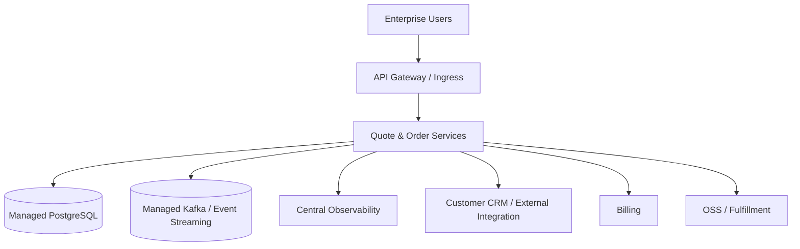
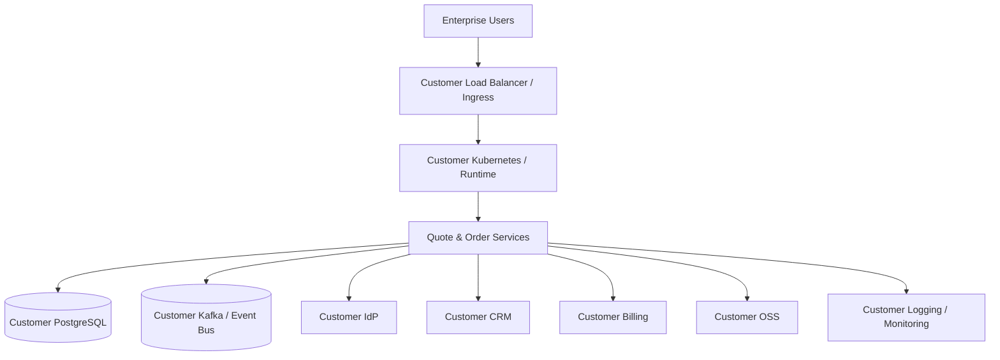

# Part 048 — AWS, Azure, and On-Prem Deployment Considerations

> Core idea: deployment environment is not an implementation detail.  
> It changes architecture constraints, failure modes, security boundaries, upgrade strategy, support model, and customer experience.

A Quote & Order platform may run in different deployment contexts:

- vendor-managed SaaS,
- vendor-managed single-tenant cloud,
- customer-hosted cloud,
- managed Kubernetes on AWS or Azure,
- self-managed Kubernetes,
- on-prem connected environment,
- on-prem restricted network,
- air-gapped or near-air-gapped customer environment,
- hybrid topology where Quote & Order is in one environment and CRM/billing/OSS is elsewhere.

The code may be similar.

The operational reality is not.

A senior engineer must understand how the environment changes the system.

---

## 1. Source Boundary and Fact Discipline

This part uses public AWS, Azure, Kubernetes, PostgreSQL, Kafka, and hybrid/on-prem deployment concepts.

It does **not** assume CSG's actual hosting model, cloud providers, Kubernetes distribution, database provider, Kafka provider, network topology, customer contract, deployment ownership, or on-prem packaging model.

Public references useful for this part:

- AWS Well-Architected Framework: https://docs.aws.amazon.com/wellarchitected/latest/framework/welcome.html
- AWS Outposts / EKS on Outposts: https://docs.aws.amazon.com/eks/latest/userguide/eks-outposts.html
- Amazon EKS Anywhere: https://anywhere.eks.amazonaws.com/docs/
- Azure Architecture Center: https://learn.microsoft.com/en-us/azure/architecture/
- Azure Well-Architected Framework: https://learn.microsoft.com/en-us/azure/well-architected/
- Azure hybrid options: https://learn.microsoft.com/en-us/azure/architecture/guide/technology-choices/hybrid-considerations
- Kubernetes documentation: https://kubernetes.io/docs/home/
- PostgreSQL documentation: https://www.postgresql.org/docs/
- Apache Kafka documentation: https://kafka.apache.org/documentation/

Internal verification checklist:

- Which deployment modes are officially supported?
- Which cloud providers are supported?
- Which Kubernetes distributions are supported?
- Which PostgreSQL versions/providers are supported?
- Which Kafka versions/providers are supported?
- Are customer-hosted deployments supported?
- Are air-gapped deployments supported?
- Who operates production in each mode?
- Who owns monitoring and incident response?
- How are upgrades delivered?
- How are secrets and certificates managed?
- How is data residency handled?
- How are customer-specific integrations packaged?
- What is the support boundary for on-prem environments?

---

## 2. Deployment Is a Constraint Set

Avoid asking only:

> Where does the service run?

Ask instead:

> Which constraints does this deployment mode impose?

Important constraint categories:

| Category | Questions |
|---|---|
| Network | Can services reach CRM, billing, OSS, IdP, Kafka, DB, artifact registry? |
| Identity | Who issues tokens? Is SSO/SAML/OIDC integrated? |
| Data | Who owns DB? What are backup, restore, retention, residency rules? |
| Runtime | Managed Kubernetes or self-managed? Which versions? |
| Observability | Can logs/metrics/traces leave the environment? |
| Security | Who manages certificates, keys, secrets, firewall, scanning? |
| Upgrade | Can vendor push changes or must customer approve/install? |
| Integration | Are downstream systems low-latency, unreliable, legacy, or private? |
| Support | Can support inspect runtime state? Is remote access allowed? |
| Compliance | Are there regional, industry, or customer controls? |
| Cost | Who pays for overprovisioning, egress, storage, observability? |

A design that ignores deployment constraints becomes operational debt.

---

## 3. Deployment Mode Matrix

Use this matrix as a thinking tool.

| Mode | Vendor control | Customer control | Upgrade ease | Support visibility | Typical risks |
|---|---:|---:|---:|---:|---|
| Multi-tenant SaaS | High | Low | High | High | tenant isolation, noisy neighbor, shared blast radius |
| Single-tenant SaaS | High | Medium | Medium/High | High | environment sprawl, customer-specific drift |
| Customer-hosted cloud | Medium | High | Medium | Medium | IAM/network variability, limited access |
| Connected on-prem | Low/Medium | High | Low/Medium | Medium/Low | network/cert/proxy constraints |
| Air-gapped on-prem | Low | Very high | Low | Low | upgrade complexity, diagnostics, artifact distribution |

No mode is universally better.

Each mode shifts trade-offs.

---

## 4. Reference Topologies

### Vendor-managed cloud topology

Strengths:

- vendor controls runtime,
- centralized observability,
- faster patching,
- easier incident response,
- consistent platform baseline.

Risks:

- data residency constraints,
- network integration complexity,
- tenant isolation risk if shared,
- customer-specific integration routes,
- cloud provider dependency.

### Customer-hosted or on-prem topology

Strengths:

- customer controls data and network,
- easier integration with private systems,
- may satisfy regulatory or contractual constraints.

Risks:

- inconsistent infrastructure,
- limited vendor visibility,
- slower upgrade cycle,
- certificate/proxy/firewall issues,
- difficult diagnostics,
- version drift,
- backup/restore ambiguity.

---

## 5. AWS Considerations

AWS deployment can mean many different things:

- Amazon EKS for managed Kubernetes,
- Amazon RDS/Aurora PostgreSQL for database,
- Amazon MSK for Kafka-compatible event streaming,
- AWS IAM/OIDC for workload identity,
- AWS Secrets Manager or Parameter Store,
- CloudWatch/OpenTelemetry integrations,
- ECR for images,
- VPC/private networking,
- Outposts or EKS Anywhere for hybrid/on-prem scenarios.

This series does not assume any of these are used internally.

Use them as vocabulary and verification points.

### AWS design questions

- Is the control plane vendor-managed or customer-managed?
- Is PostgreSQL managed or self-managed?
- Is Kafka managed, self-managed, or replaced by another eventing service?
- Are workloads using IRSA/OIDC-style identity or static credentials?
- Are private endpoints used?
- Are integrations routed through VPN/Direct Connect/private links?
- Are backups encrypted and tested?
- Are regions and availability zones selected for customer requirements?
- Is there a disaster recovery region?
- Are image registries private and scanned?

### AWS-specific failure modes

- IAM policy too broad or too narrow,
- security group blocks downstream integration,
- private DNS resolution differs by environment,
- RDS parameter differences from local PostgreSQL,
- managed Kafka limits differ from assumed broker behavior,
- AZ outage tests never performed,
- service quota reached under load,
- CloudWatch/log retention cost explosion,
- customer VPC routing issue diagnosed as app bug.

---

## 6. Azure Considerations

Azure deployment may involve:

- Azure Kubernetes Service,
- Azure Database for PostgreSQL,
- Event Hubs with Kafka-compatible endpoint or managed Kafka elsewhere,
- Azure Key Vault,
- Azure Monitor / Application Insights,
- Azure Container Registry,
- Entra ID integration,
- private endpoints,
- hybrid/on-prem options such as Azure Arc or Azure Local.

Again, this does not assume internal use.

Use it as a deployment analysis lens.

### Azure design questions

- Is identity integrated with Entra ID or customer IdP?
- Are private endpoints required?
- Is PostgreSQL feature parity sufficient for application assumptions?
- Is event streaming Kafka-compatible enough for required semantics?
- Are diagnostics exported to vendor or customer monitoring?
- Are policies enforced through Azure Policy?
- Are managed identities used instead of static secrets?
- Are regional availability and DR requirements documented?

### Azure-specific failure modes

- managed identity permission mismatch,
- private endpoint DNS misconfiguration,
- Event Hubs Kafka compatibility mismatch for assumed Kafka features,
- PostgreSQL managed service version/extension mismatch,
- customer policy denies resource creation,
- monitoring data blocked by compliance policy,
- AKS upgrade policy conflicts with application support matrix.

---

## 7. On-Prem and Air-Gapped Considerations

On-prem is not simply “cloud but in a customer data center”.

It changes everything.

### On-prem constraints

- no internet access,
- restricted outbound access,
- corporate proxy,
- private CA/certificate chain,
- custom DNS,
- customer-managed Kubernetes,
- customer-managed PostgreSQL,
- customer-managed Kafka,
- strict change windows,
- slow upgrade approvals,
- no vendor shell access,
- logs cannot leave environment,
- package must include all dependencies,
- support must rely on diagnostic bundles.

### Air-gapped package contents

A serious enterprise on-prem package may need:

- container images,
- image signatures,
- SBOM,
- Helm charts or manifests,
- CRDs if any,
- database migration scripts,
- configuration templates,
- default resource profiles,
- compatibility matrix,
- upgrade runbook,
- rollback/roll-forward guide,
- certificate/truststore instructions,
- required ports/protocols,
- diagnostic collection script,
- release notes,
- known issues,
- support escalation instructions.

Internal verification checklist:

- Does the product support air-gapped installation?
- How are container images transferred?
- How are signatures verified offline?
- Are SBOMs delivered to customers?
- Are Helm charts customer-editable?
- Are migrations run by customer or installer?
- Can support collect diagnostics without direct access?

---

## 8. Database Deployment Trade-offs

PostgreSQL deployment mode affects behavior.

| Mode | Strength | Risk |
|---|---|---|
| Managed PostgreSQL | backups, HA, patching, monitoring | provider-specific limits, extension/version constraints |
| Self-managed PostgreSQL | control, portability | operational burden, backup/restore risk |
| Customer-managed PostgreSQL | customer control | inconsistent config, limited visibility |
| Dedicated DB per tenant/customer | isolation | cost and operational sprawl |
| Shared DB with tenant key | efficiency | cross-tenant leakage risk |

Questions to verify:

- Which PostgreSQL versions are supported?
- Are extensions required?
- Are migrations provider-compatible?
- Is logical replication used?
- Are backups tested?
- Is PITR available?
- Is connection pooling used?
- Are max connections sized for Kubernetes autoscaling?
- Are maintenance windows controlled by vendor or customer?
- Are slow query logs accessible?

Common failure modes:

- application assumes extension not installed,
- migration locks table longer than customer window,
- connection pool exhausts DB max connections,
- customer PostgreSQL config disables expected behavior,
- backup exists but restore was never tested,
- read replica lag causes stale operational decision,
- index creation method unsafe for large customer data.

---

## 9. Kafka/Event Streaming Deployment Trade-offs

Kafka semantics matter for quote/order correctness.

Deployment changes operational assumptions.

Questions to verify:

- Is it Apache Kafka, managed Kafka, or Kafka-compatible service?
- What Kafka version is supported?
- Is schema registry available?
- What compatibility mode is enforced?
- Who manages topics?
- Who sets retention and partition count?
- Can topic config be changed through GitOps/IaC?
- Are ACLs enforced?
- How is consumer lag monitored?
- Are DLQ/retry topics standardized?
- Is replay allowed in customer environments?

Common failure modes:

- managed service does not support assumed feature,
- topic retention too short for replay/recovery,
- partition count differs by environment,
- schema registry unavailable on-prem,
- ACL prevents consumer from reading in production only,
- clock/network issue creates apparent ordering anomaly,
- event volume exceeds broker capacity.

---

## 10. Network and Integration Reality

Quote & Order systems rarely operate alone.

They connect to:

- CRM,
- customer master,
- product catalog,
- pricing service,
- billing,
- inventory,
- service ordering,
- OSS fulfillment,
- notification systems,
- partner gateways,
- identity providers,
- observability sinks.

In cloud deployment, the main challenge may be secure connectivity to customer/private systems.

In on-prem deployment, the main challenge may be runtime variation and limited visibility.

Network questions:

- Is connectivity inbound, outbound, or bidirectional?
- Are static IP allowlists required?
- Is mTLS required?
- Is proxy required?
- How are certificates rotated?
- Are timeouts tuned for cross-network latency?
- Are retries safe if network intermittently fails?
- Is DNS controlled by customer?
- Is there a test endpoint for each integration?
- How is network failure distinguished from downstream application failure?

---

## 11. Identity, Secrets, and Certificates

Identity differs significantly by environment.

Cloud-native systems may use workload identity.

On-prem systems often use configured secrets, customer certificates, private CA, and manual rotation processes.

Questions to verify:

- Who is the identity provider?
- Is OIDC/SAML used for user login?
- How are service credentials issued?
- Are secrets stored in cloud secret manager, Kubernetes secret, Vault, or customer mechanism?
- How are certificates loaded into Java truststore?
- How are expired certificates detected before outage?
- Can secrets rotate without downtime?
- Are secrets included accidentally in support bundles?

Common failure modes:

- certificate expires and breaks order submission,
- truststore missing customer CA,
- secret rotated in provider but not in pod,
- customer IdP claim mapping differs from test,
- token issuer/audience mismatch between environments,
- service account has broad production permissions.

---

## 12. Observability and Support Model

Observability design must match support reality.

Vendor-managed cloud:

- central logs,
- central metrics,
- distributed tracing,
- direct dashboard access,
- easier incident triage.

Customer-hosted/on-prem:

- logs may stay with customer,
- metrics may not be exported,
- traces may be disabled,
- support may receive bundles only,
- customer may redact data,
- time synchronization may be unreliable.

Minimum supportability requirements:

- correlation ID visible in API response/logs/events,
- order ID searchable across logs,
- version/build/image digest visible at runtime,
- health endpoints include dependency status carefully,
- diagnostic endpoint/tool does not leak secrets,
- support bundle includes config summary, not secret values,
- timestamps include timezone and are synchronized,
- audit logs are separate from debug logs.

Internal verification checklist:

- What observability tools are supported per deployment mode?
- Can vendor support access dashboards?
- Are diagnostic bundles standardized?
- How are PII/secrets redacted?
- Can a customer share traces/logs safely?
- Are support runbooks deployment-mode-specific?

---

## 13. Upgrade and Version Drift

SaaS can often deploy frequently.

On-prem may upgrade quarterly, semi-annually, or only during customer-approved windows.

This creates version drift.

Version drift affects:

- API compatibility,
- database migrations,
- event schema compatibility,
- customer-specific patches,
- support diagnostics,
- security vulnerability remediation,
- documentation accuracy,
- feature flag behavior.

Upgrade strategy questions:

- Are N and N-1 versions supported?
- Are skip-version upgrades supported?
- Can DB migrations jump multiple versions?
- Are rollback and downgrade supported or only roll-forward?
- Are customer customizations preserved?
- Are release notes machine-generated or manual?
- Is compatibility tested across supported upgrade paths?

Dangerous pattern:

> A migration is safe for continuous SaaS deploy but unsafe for customer upgrading from six-month-old version.

Enterprise pipelines must test supported upgrade paths, not only latest-to-latest.

---

## 14. Configuration and Customization Drift

Enterprise customers often need configuration.

But customer-specific customization can become hidden forks.

Classify variability:

| Variability type | Example | Governance needed |
|---|---|---|
| Environment config | DB URL, Kafka broker | normal config validation |
| Customer config | approval threshold, tenant settings | schema/versioning/audit |
| Feature flag | enable new fulfillment path | lifecycle/expiry/kill switch |
| Integration adapter config | endpoint, auth, transform | validation/test harness |
| Custom behavior | customer-specific rule | strong ownership and regression tests |
| Code fork | patched behavior only for one customer | high-risk exception |

Senior engineer question:

> Is this configuration, customization, or product fork?

They are not equivalent.

---

## 15. Cloud vs On-Prem Design Trade-offs

| Design area | Cloud-friendly choice | On-prem concern |
|---|---|---|
| Secrets | cloud secret manager | customer secret system or Kubernetes secret |
| Observability | central SaaS observability | logs cannot leave customer network |
| Deployment | GitOps controller | customer may not allow controller pull access |
| Artifact delivery | registry pull | offline image bundle |
| Identity | managed workload identity | static credentials or customer IAM |
| Database | managed PostgreSQL | customer-managed version/config |
| Eventing | managed Kafka | self-managed Kafka or compatible service |
| Scaling | HPA/cloud autoscaling | fixed capacity/change window |
| Support | direct runtime access | diagnostic bundle only |
| Upgrade | frequent incremental deploy | infrequent large upgrades |

Design for the most constrained supported mode.

Then optimize for easier modes.

---

## 16. Operational Readiness by Deployment Mode

Before declaring a deployment mode supported, verify:

### Runtime

- Kubernetes version matrix,
- ingress requirements,
- storage class requirements,
- CPU/memory minimums,
- autoscaling assumptions,
- pod security requirements,
- network policy support.

### Data

- PostgreSQL version matrix,
- migration compatibility,
- backup/restore procedure,
- data retention,
- PITR if required,
- restore test evidence.

### Eventing

- Kafka version/provider matrix,
- topic creation/configuration,
- schema registry support,
- ACL/security model,
- replay procedure.

### Security

- identity provider integration,
- certificate/truststore process,
- secret rotation,
- vulnerability scanning,
- audit log export.

### Operations

- monitoring integration,
- alert routing,
- support bundle,
- runbook,
- upgrade guide,
- rollback/roll-forward guide.

---

## 17. Failure Modelling Scenarios

Use these scenarios during design review.

### Scenario 1: Customer IdP claim changes

Impact:

- users cannot access quote approval,
- roles map incorrectly,
- approval authority fails open or closed.

Questions:

- Is claim mapping configurable?
- Is failure denied by default?
- Are auth failures observable?
- Is there emergency admin access?

### Scenario 2: PostgreSQL migration fails halfway on customer data

Impact:

- application cannot start,
- old version may not understand partial schema,
- customer upgrade window expires.

Questions:

- Was dry-run performed?
- Is migration resumable?
- Is roll-forward documented?
- Is support script available?

### Scenario 3: Kafka retention too short

Impact:

- replay impossible,
- read model cannot recover,
- audit reconstruction incomplete.

Questions:

- Is retention validated at startup/deploy?
- Is topic config managed as code?
- Is there an alternate repair source?

### Scenario 4: Customer proxy blocks external license/security feed

Impact:

- service startup or scanning fails,
- runtime cannot fetch metadata,
- upgrade package incomplete.

Questions:

- Does runtime require internet?
- Are dependencies packaged offline?
- Is proxy documented?

### Scenario 5: Vendor support cannot access logs

Impact:

- incident triage slows,
- customer must manually collect evidence,
- root cause may remain unknown.

Questions:

- Is diagnostic bundle complete?
- Are correlation IDs present?
- Are secrets/PII redacted?

---

## 18. Architecture Review Checklist

When reviewing a feature for multi-environment deployment, ask:

### Environment compatibility

- Does it assume a specific cloud provider?
- Does it assume internet access?
- Does it assume managed PostgreSQL/Kafka behavior?
- Does it work with supported Kubernetes versions?
- Does it require new ports or firewall rules?

### Security

- Does it require new secrets?
- How are secrets rotated?
- Does it require new certificate trust?
- Does it change identity/claims/roles?
- Does it preserve tenant isolation?

### Data

- Does it require schema migration?
- Does migration work for old customer versions?
- Does it create large backfill load?
- Does it affect backup/restore?

### Operations

- Does it add new metrics/logs/traces?
- Are alerts needed?
- Can support diagnose failure without shell access?
- Is there a runbook?
- Is there a rollback/roll-forward plan?

### Packaging

- Are new dependencies included in on-prem bundle?
- Are images signed?
- Is SBOM updated?
- Are Helm/manifests updated?
- Is customer documentation updated?

---

## 19. Internal Verification Map

Create a deployment-mode map like this:

| Area | SaaS | Single tenant cloud | Customer cloud | On-prem connected | Air-gapped |
|---|---|---|---|---|---|
| Kubernetes |  |  |  |  |  |
| PostgreSQL |  |  |  |  |  |
| Kafka/eventing |  |  |  |  |  |
| Secrets |  |  |  |  |  |
| Identity |  |  |  |  |  |
| Observability |  |  |  |  |  |
| Artifact delivery |  |  |  |  |  |
| Upgrade owner |  |  |  |  |  |
| Support access |  |  |  |  |  |
| Backup owner |  |  |  |  |  |
| DR owner |  |  |  |  |  |
| Known constraints |  |  |  |  |  |

Do not leave this knowledge implicit.

Implicit deployment assumptions are production incidents waiting to happen.

---

## 20. Practical Exercise

Pick one Quote & Order feature, such as:

- new approval workflow,
- new order decomposition rule,
- new billing integration adapter,
- new Kafka event,
- new catalog publish path,
- new PostgreSQL table/index,
- new observability dashboard.

Evaluate it across deployment modes:

1. What cloud service assumptions does it make?
2. What on-prem assumptions does it make?
3. Does it require internet access?
4. Does it require new secrets or certificates?
5. Does it require DB migration?
6. Does it require Kafka topic/schema changes?
7. Can customer-hosted environments monitor it?
8. Can support diagnose it without direct access?
9. How does it upgrade from old versions?
10. What is the rollback or roll-forward path?

If you cannot answer these, the feature is not deployment-ready.

---

## 21. What Good Looks Like

A production-grade enterprise deployment strategy has:

- explicit supported deployment modes,
- version/provider compatibility matrix,
- repeatable packaging pipeline,
- immutable signed artifacts,
- clear secret/certificate model,
- tested database migration path,
- event streaming compatibility checks,
- deployment-mode-specific observability,
- support diagnostic bundle,
- upgrade and rollback/roll-forward guides,
- customer-specific configuration governance,
- clear support boundary,
- documented cloud/on-prem trade-offs.

Good architecture is not only what runs in the best environment.

Good architecture survives the environments the product actually promises to support.

---

## 22. Key Takeaways

- Deployment environment changes architecture constraints.
- Cloud and on-prem are not interchangeable operationally.
- Managed services reduce some risks and introduce provider-specific constraints.
- On-prem support requires packaging, diagnostics, and upgrade discipline.
- PostgreSQL/Kafka behavior must be verified per supported provider/version.
- Observability design must match support access reality.
- Customer-specific configuration must not become undocumented product forks.
- Senior engineers review features against deployment modes before production, not after customer escalation.

