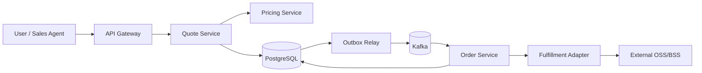
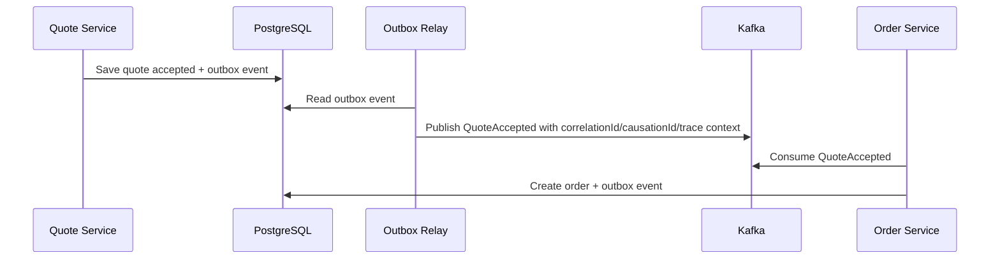

# Part 050 — Logs, Metrics, Traces, Correlation ID, and Causation ID

## 1. Why This Part Matters

In a Quote & Order system, a single business action can cross:

- browser/UI,
- API gateway,
- quote service,
- pricing service,
- catalog service,
- customer/account service,
- PostgreSQL transaction,
- outbox relay,
- Kafka topic,
- order service,
- decomposition process manager,
- fulfillment adapter,
- external OSS/BSS system,
- fallout queue,
- audit pipeline.

When something fails, the operational question is rarely:

```text
Did this Java method throw an exception?
```

The real questions are:

```text
What happened to quote Q-123?
Was order O-456 created once or twice?
Which config, catalog, agreement, and pricing versions were used?
Was a Kafka event published?
Was it consumed?
Was the downstream fulfillment system called?
Did it time out or reject?
Is the state recoverable?
Which tenant/customer is affected?
```

Observability is the ability to reconstruct business and technical truth from production signals.

## 2. Source Notes and Boundaries

Public/industry references used in this part:

- OpenTelemetry is a vendor-neutral observability framework with APIs, SDKs, agents, collector services, and data model support for traces, metrics, and logs.
- W3C Trace Context defines standard propagation headers such as `traceparent` and `tracestate` for trace identity across service boundaries.
- Kubernetes, Kafka, PostgreSQL, and Java runtime signals must be integrated into the same operational story.

This part does **not** assume which observability stack CSG internally uses.

Internal verification is required for:

- logging library,
- tracing library,
- metrics backend,
- dashboard tool,
- alerting tool,
- trace propagation standard,
- correlation ID naming,
- retention policy,
- PII redaction rules,
- customer support diagnostics.

## 3. Mental Model: Observability as Reconstruction

Observability should let you reconstruct:

1. The business journey.
2. The technical execution path.
3. The causal chain.
4. The current state.
5. The failure point.
6. The affected scope.
7. The recovery option.

The mental model:



Logs, metrics, and traces are not separate hobbies. They answer different questions about the same journey.

| Signal | Best At Answering | Weak At |
|---|---|---|
| Logs | What exact event happened? What fields were involved? | High-level trend unless aggregated |
| Metrics | How often? How slow? How many? Is it getting worse? | Explaining one specific business object |
| Traces | Which services participated? Where did time go? | Business audit and long-term evidence |
| Audit events | Who changed what business state and why? | Low-level performance diagnosis |
| Domain events | What business fact occurred? | Debug details unless enriched |

## 4. The Critical IDs

A production Quote & Order system needs more than one ID.

### 4.1 Trace ID

Identifies one distributed trace across service boundaries.

It is technical execution context.

Example:

```text
traceId=4bf92f3577b34da6a3ce929d0e0e4736
```

### 4.2 Span ID

Identifies one operation within a trace.

Example:

```text
spanId=00f067aa0ba902b7
```

### 4.3 Correlation ID

Groups related work across synchronous and asynchronous boundaries.

A correlation ID may survive longer than a single trace.

Example:

```text
correlationId=corr-quote-Q-123-conversion-20260708
```

### 4.4 Causation ID

Identifies the immediate cause of a new event or command.

Example:

```text
eventId=evt-quote-accepted-001
causationId=cmd-accept-quote-001
correlationId=corr-quote-Q-123
```

If `OrderCreated` was caused by `QuoteAccepted`, then:

```text
OrderCreated.causationId = QuoteAccepted.eventId
OrderCreated.correlationId = QuoteAccepted.correlationId
```

### 4.5 Business IDs

Business IDs are essential for incident work:

- `tenantId`,
- `customerId`,
- `accountId`,
- `quoteId`,
- `quoteVersion`,
- `orderId`,
- `orderItemId`,
- `catalogVersion`,
- `agreementId`,
- `pricingRunId`,
- `fulfillmentTaskId`,
- `externalOrderId`,
- `eventId`,
- `idempotencyKey`.

A trace without business IDs is hard to use during a customer-impacting incident.

## 5. Correlation vs Causation

Correlation answers:

```text
Which operations belong to the same business journey?
```

Causation answers:

```text
What directly caused this operation/event?
```

Example:

```text
correlationId = corr-Q-123

cmd-accept-quote-1
  -> evt-quote-accepted-1
      -> cmd-create-order-1
          -> evt-order-created-1
              -> cmd-decompose-order-1
                  -> evt-order-decomposed-1
```

All share the same correlation ID.

Each step points to the immediate cause.

This makes replay and incident analysis much easier.

## 6. Observability Envelope for Events

A Kafka event should carry an envelope, not just payload.

Example:

```json
{
  "eventId": "evt-01J1QUOTEACCEPTED",
  "eventType": "QuoteAccepted",
  "eventVersion": 3,
  "occurredAt": "2026-07-08T10:15:30Z",
  "producer": "quote-service",
  "tenantId": "tenant-123",
  "correlationId": "corr-Q-123",
  "causationId": "cmd-accept-quote-01",
  "traceId": "4bf92f3577b34da6a3ce929d0e0e4736",
  "aggregateType": "Quote",
  "aggregateId": "Q-123",
  "aggregateVersion": 12,
  "idempotencyKey": "accept-quote-Q-123-v5",
  "payload": {
    "quoteId": "Q-123",
    "quoteVersion": 5,
    "acceptedBy": "user-456"
  }
}
```

The payload says what happened.

The envelope says how to operate it safely.

## 7. Structured Logging

A log line should be machine-readable and queryable.

Bad:

```text
Order failed again lol
```

Better:

```json
{
  "level": "ERROR",
  "event": "fulfillment_submission_failed",
  "tenantId": "tenant-123",
  "quoteId": "Q-123",
  "orderId": "O-456",
  "fulfillmentTaskId": "FT-789",
  "adapterProfile": "oss-v2-standard",
  "correlationId": "corr-Q-123",
  "causationId": "evt-order-decomposed-1",
  "traceId": "4bf92f3577b34da6a3ce929d0e0e4736",
  "attempt": 3,
  "errorClass": "DOWNSTREAM_TIMEOUT",
  "retryable": true,
  "durationMs": 3004
}
```

### 7.1 Logging field taxonomy

Recommended field groups:

| Group | Fields |
|---|---|
| Runtime | service, version, environment, region, pod, node |
| Tenant | tenantId, customerId, accountId |
| Business | quoteId, orderId, orderItemId, catalogVersion, agreementId |
| Execution | traceId, spanId, correlationId, causationId, requestId |
| Event | eventId, eventType, eventVersion, aggregateId, aggregateVersion |
| Security | actorId, clientId, subject, permission, authDecision |
| Failure | errorClass, errorCode, retryable, attempt, timeoutMs |
| Performance | durationMs, queueLatencyMs, dbDurationMs, downstreamDurationMs |

### 7.2 What not to log

Do not log:

- JWT tokens,
- passwords,
- client secrets,
- private keys,
- raw PII unless explicitly allowed and protected,
- full customer addresses,
- payment data,
- entire quote payloads without redaction,
- entire headers without filtering,
- ConfigMap/Secret dumps,
- stack traces containing sensitive data.

## 8. Metrics

Metrics answer aggregate operational questions.

### 8.1 Technical metrics

Examples:

```text
http.server.requests.count
http.server.requests.duration
jvm.memory.used
jvm.gc.pause
postgres.query.duration
postgres.connection.pool.active
kafka.consumer.lag
kafka.producer.error.count
outbox.pending.count
outbox.publish.duration
```

### 8.2 Business metrics

Examples:

```text
quote.created.count
quote.accepted.count
quote.expired.count
quote.approval.pending.count
order.created.count
order.completed.count
order.fallout.count
order.cancellation.requested.count
fulfillment.task.failed.count
pricing.calculation.duration
catalog.cache.hit.ratio
```

### 8.3 Metric cardinality discipline

High-cardinality labels can damage observability systems.

Usually safe labels:

- service,
- environment,
- region,
- status,
- errorClass,
- operation,
- adapterProfile,
- orderType,
- tenant tier if not too many.

Usually unsafe labels:

- quoteId,
- orderId,
- userId,
- email,
- accountId with high cardinality,
- arbitrary customer name,
- full URL with IDs,
- raw exception message.

Use logs/traces for high-cardinality object lookup. Use metrics for aggregate health.

## 9. Traces

Traces show the path and timing of a request or workflow.

A useful trace should include spans like:

```text
POST /quotes/{id}/accept
  validate quote transition
  load quote aggregate
  check authorization
  evaluate approval state
  persist quote accepted
  insert outbox event
  publish QuoteAccepted
```

For asynchronous work:

```text
consume QuoteAccepted
  create order command
  persist order
  insert OrderCreated outbox event
  publish OrderCreated
```

### 9.1 Span naming

Good span names:

```text
QuoteService.acceptQuote
PricingService.calculateQuotePrice
OrderService.createOrderFromQuote
OutboxRelay.publishBatch
FulfillmentAdapter.submitServiceOrder
```

Bad span names:

```text
doWork
process
call
run
```

### 9.2 Span attributes

Add safe attributes:

```text
tenant.id
quote.id
quote.version
order.id
order.state
adapter.profile
event.type
event.id
kafka.topic
kafka.partition
kafka.offset
error.class
```

Avoid sensitive attributes.

## 10. REST Propagation

For synchronous HTTP calls, propagate trace and correlation context.

Typical headers:

```text
traceparent: 00-4bf92f3577b34da6a3ce929d0e0e4736-00f067aa0ba902b7-01
tracestate: vendor-specific-state
x-correlation-id: corr-Q-123
x-request-id: req-abc
```

`traceparent` is the standard trace context. `x-correlation-id` is an application convention and must be internally standardized.

Do not let untrusted clients override internal security or tenant context through correlation headers.

Correlation IDs are diagnostic context, not authorization context.

## 11. Kafka Propagation

Kafka breaks a single HTTP trace into asynchronous workflows.

You still need context propagation.



Important metadata:

- event ID,
- event type,
- event version,
- aggregate ID,
- aggregate version,
- correlation ID,
- causation ID,
- trace context,
- tenant ID,
- producer service,
- schema version.

## 12. MDC and Java Logging Context

In Java services, use mapped diagnostic context carefully.

Conceptual example:

```java
public final class DiagnosticContext implements AutoCloseable {
    public DiagnosticContext(RequestContext ctx) {
        MDC.put("tenantId", ctx.tenantId());
        MDC.put("correlationId", ctx.correlationId());
        MDC.put("traceId", ctx.traceId());
        MDC.put("actorId", ctx.actorId());
    }

    @Override
    public void close() {
        MDC.remove("tenantId");
        MDC.remove("correlationId");
        MDC.remove("traceId");
        MDC.remove("actorId");
    }
}
```

The key risk: context leakage across threads.

In thread pools, async processing, reactive pipelines, and Kafka listeners, context must be explicitly propagated or reset.

## 13. Observability for State Machines

State transitions should produce logs, metrics, audit, and often events.

Example transition:

```text
Order: VALIDATED -> DECOMPOSING
```

Signals:

| Signal | Example |
|---|---|
| Audit | `order_state_changed` with actor/system, oldState, newState, reason |
| Log | structured log with orderId, tenantId, transition, duration |
| Metric | `order.state.transition.count{from="VALIDATED",to="DECOMPOSING"}` |
| Trace | span `OrderService.decomposeOrder` |
| Event | `OrderDecompositionStarted` |

This is not duplication. It is multi-purpose evidence.

## 14. Observability for Idempotency

Idempotency should be observable.

Useful fields:

- idempotency key,
- first seen timestamp,
- duplicate detected flag,
- duplicate decision,
- original result reference,
- command ID,
- event ID,
- aggregate version.

Example log:

```json
{
  "event": "duplicate_command_detected",
  "commandType": "CreateOrderFromQuote",
  "idempotencyKey": "quote-Q-123-to-order-v5",
  "tenantId": "tenant-123",
  "quoteId": "Q-123",
  "existingOrderId": "O-456",
  "decision": "return_existing_result"
}
```

Without this, duplicate prevention can look like missing work.

## 15. Observability for Outbox and Replay

Outbox health metrics:

```text
outbox.pending.count
outbox.oldest.age.seconds
outbox.publish.success.count
outbox.publish.failure.count
outbox.publish.duration
outbox.batch.size
outbox.deadletter.count
```

Replay logs should include:

- replay job ID,
- time range,
- topics/partitions,
- start/end offsets,
- dry-run flag,
- consumer mode,
- event count,
- skipped duplicate count,
- failed event count.

Replay should never be invisible.

## 16. Observability for PostgreSQL

Database observability should connect DB symptoms to business impact.

Technical signals:

- slow queries,
- lock waits,
- deadlocks,
- connection pool exhaustion,
- transaction duration,
- row count scanned,
- index usage,
- replication lag,
- vacuum pressure.

Business linkage:

- quote acceptance latency,
- order creation latency,
- stuck order count,
- outbox pending age,
- approval queue latency,
- pricing calculation latency.

A senior engineer does not stop at:

```text
DB CPU is high.
```

They ask:

```text
Which business operation is causing the DB load, and which customer journey is degraded?
```

## 17. Observability for External Integrations

Every adapter should expose:

- request count,
- success count,
- failure count,
- timeout count,
- retry count,
- circuit breaker state,
- downstream latency,
- external correlation ID,
- external order ID,
- adapter profile,
- tenant/customer scope,
- error class mapping.

Adapter error taxonomy matters.

```text
DOWNSTREAM_TIMEOUT
DOWNSTREAM_5XX
DOWNSTREAM_4XX_VALIDATION
DOWNSTREAM_AUTH_FAILURE
DOWNSTREAM_RATE_LIMIT
DOWNSTREAM_DUPLICATE
DOWNSTREAM_UNKNOWN_RESULT
MAPPING_ERROR
CONFIGURATION_ERROR
```

Each error class should imply a recovery strategy.

## 18. Dashboards for Quote & Order

Part 051 will go deeper into SLOs, alerts, and dashboards. This part defines the raw materials.

Minimum useful dashboard sections:

```text
1. API health
2. Quote funnel
3. Approval queue
4. Pricing latency
5. Order lifecycle distribution
6. Fallout count and age
7. Kafka lag and consumer errors
8. Outbox pending age
9. DB slow query and lock wait
10. Fulfillment adapter health
11. Tenant/customer impact view
12. Recent deployments/config changes
```

A dashboard without business dimensions is insufficient for Quote & Order operations.

## 19. PII, Security, and Audit Boundary

Observability must not become a data leak.

Rules:

- Prefer IDs over names/emails.
- Mask or hash sensitive identifiers when required.
- Never log tokens or secrets.
- Avoid full payload logging.
- Use allow-list logging, not deny-list logging.
- Separate audit evidence from debug logs.
- Respect tenant isolation in support dashboards.
- Ensure production log access is controlled.

Debuggability is not an excuse for data exposure.

## 20. Failure Modes

| Failure Mode | Cause | Impact | Detection | Prevention |
|---|---|---|---|---|
| Cannot find order journey | Missing correlation ID | Slow incident triage | Search returns fragmented logs | Standard context propagation |
| Trace stops at Kafka | Async context not propagated | Missing causal chain | Trace gap after outbox | Event envelope metadata |
| High metric cardinality | Labels include orderId/userId | Observability backend cost/outage | Metrics ingestion warning | Label review policy |
| Logs leak secret | Raw header/env logging | Security incident | Secret scanner | Allow-list log fields |
| Duplicate processing invisible | No idempotency logs | Confusing support tickets | Duplicate DB constraint errors | Explicit duplicate decision logs |
| Fallout not measurable | No business metric | Hidden customer impact | Manual queue inspection | Fallout count/age metrics |
| Errors not actionable | Generic exception class | Bad alerts and bad retry | Error taxonomy mismatch | Domain-specific error classes |
| Tenant impact unknown | Metrics lack safe tenant grouping | Cannot prioritize incident | Support escalation only | Tenant/tier-safe dimensions |
| Config change invisible | No config version in logs | Hard rollback decision | Incident timeline gap | Config version telemetry |

## 21. Testing Observability

Observability can and should be tested.

### 21.1 Unit-level tests

Test that:

- error mapping produces stable error codes,
- log event builders include required fields,
- sensitive fields are redacted,
- correlation context is created when missing,
- tenant ID is never absent for tenant-scoped operations.

### 21.2 Integration tests

Test that:

- HTTP request creates trace/correlation context,
- downstream calls propagate context,
- Kafka events include correlation/causation IDs,
- Kafka consumers restore context into logs,
- outbox relay preserves event metadata,
- failure logs include order/quote IDs,
- metrics increment on success/failure paths.

### 21.3 Production readiness tests

Run a synthetic quote-to-order journey and verify:

- you can search by quote ID,
- you can search by order ID,
- you can search by correlation ID,
- trace shows meaningful service path,
- Kafka event metadata is visible,
- dashboard counters move,
- no secret/PII leak appears,
- failure path is observable.

## 22. Internal Verification Checklist

Check internally:

- Logging framework and structured logging format.
- Required fields for every log event.
- Whether logs are JSON and queryable.
- Log retention by environment/customer/deployment mode.
- PII redaction rules.
- Secret scanning for logs.
- Metrics backend and naming convention.
- Metric cardinality limits.
- Business metric ownership.
- Trace provider and OpenTelemetry usage.
- Whether W3C Trace Context is used for HTTP propagation.
- Correlation ID header standard.
- Kafka event envelope standard.
- Whether event metadata includes correlation/causation IDs.
- Whether tenantId is propagated through REST, Kafka, DB, and logs.
- Whether support tooling can search by quoteId/orderId.
- Whether dashboards exist for quote funnel, order lifecycle, fallout, outbox, Kafka lag, DB health, and adapter health.
- Whether deployment/config changes are visible in incident timelines.
- Whether on-prem deployments have comparable observability.
- Whether customer support has restricted observability views.
- Whether there are recent incidents caused by missing telemetry.

## 23. PR Review Checklist

When reviewing code, ask:

- Does the new operation emit enough context to debug production issues?
- Are quoteId/orderId/tenantId included where relevant?
- Are correlation and causation preserved across REST/Kafka boundaries?
- Does the code log sensitive data?
- Are metrics added with safe cardinality?
- Are error classes stable and actionable?
- Are state transitions observable?
- Are idempotent duplicate decisions observable?
- Is retry behavior visible?
- Is external adapter failure classified?
- Can support search for this journey by business ID?
- Does the trace span have a meaningful name?
- Does the code preserve context across async/thread-pool boundaries?
- Does the dashboard need an update?
- Does the runbook need an update?

## 24. Practical Exercises

### Exercise 1 — Trace a quote-to-order journey

Pick one quote/order journey in a non-production environment.

Trace it through:

```text
HTTP request -> service logs -> DB transaction -> outbox -> Kafka -> consumer -> order state -> downstream adapter
```

Record which IDs are preserved and where context is lost.

### Exercise 2 — Build an observability envelope

For one event type, design the envelope:

```text
eventId
eventType
eventVersion
tenantId
correlationId
causationId
traceId
aggregateId
aggregateVersion
producer
occurredAt
payload
```

Then compare it with internal event schema.

### Exercise 3 — Review one log line

Find one production-style log line and ask:

- Can I identify tenant/customer impact?
- Can I identify quote/order impact?
- Can I identify retryability?
- Can I identify downstream dependency?
- Can I find related events?
- Does it leak sensitive data?

### Exercise 4 — Define business metrics

For one lifecycle, define metrics:

```text
quote.created.count
quote.accepted.count
quote.rejected.count
quote.expired.count
quote.acceptance.duration
quote.approval.pending.age
```

Add labels carefully.

## 25. Senior Engineer Heuristics

- If you cannot find an order by `orderId`, the system is not operable.
- If a Kafka event lacks causation, replay debugging becomes guesswork.
- If a metric includes `orderId` as a label, you likely created a cardinality problem.
- If logs contain secrets, observability has become a breach vector.
- If traces do not cross async boundaries, they explain only the easy half of the system.
- If every exception is `RuntimeException`, alerts cannot guide recovery.
- If fallout has no count and age metric, customer pain is invisible.
- If config version is absent from logs, rollout incidents are harder to explain.
- If support cannot search by quote/order ID, engineering will become the search engine.
- If telemetry is not tested, it will fail exactly when you need it.

## 26. Summary

Observability is not just logs, metrics, and traces.

For Quote & Order, observability is the ability to reconstruct a business journey across:

- REST,
- Java services,
- PostgreSQL,
- outbox,
- Kafka,
- process managers,
- fulfillment adapters,
- external BSS/OSS systems,
- audit records,
- support workflows.

The essential discipline is preserving context:

- trace ID for technical path,
- correlation ID for business journey,
- causation ID for event chain,
- business IDs for customer support and incident response,
- tenant/customer IDs for blast-radius analysis,
- version/config/catalog/agreement IDs for defensibility.

A senior engineer designs features with the assumption that production will fail.

The question is not whether failure happens.

The question is:

> When it fails, can we prove what happened, identify who is affected, recover safely, and prevent recurrence?
