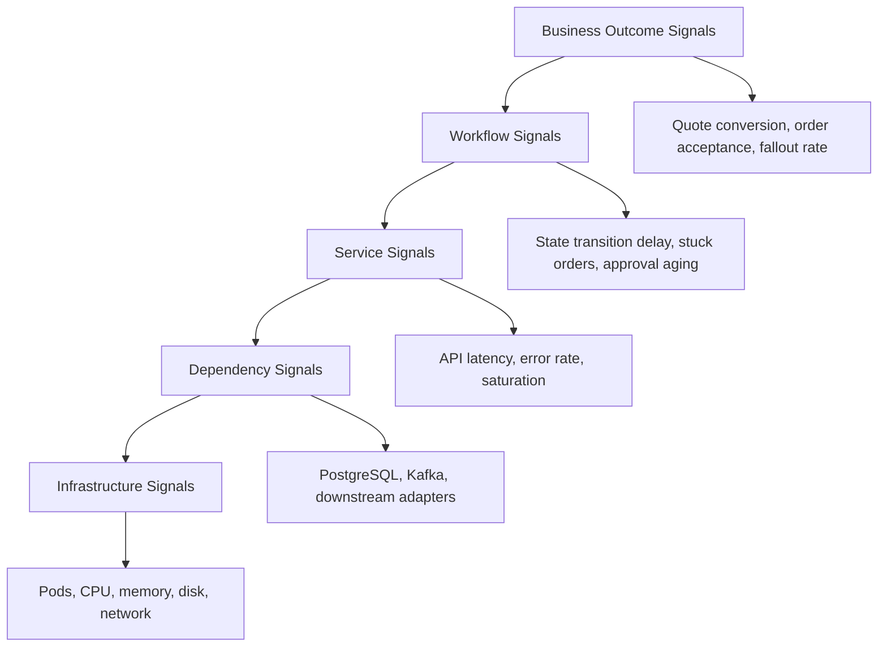

# Part 051 — SLOs, Alerts, Dashboards, and Operational Signals

## 1. Why This Part Matters

A production Quote & Order platform can have thousands of logs, hundreds of metrics, many traces, and still be operationally blind.

Raw telemetry answers:

```text
What signals exist?
```

Operational readiness answers:

```text
Is the system healthy enough for customers to quote, order, amend, cancel, and recover?
If not, who should act, how urgently, and with which runbook?
```

For enterprise CPQ/order management, the most dangerous production failures are often not simple process crashes. They are business workflow degradations:

- quotes can be created but not priced,
- pricing succeeds but approval stalls,
- orders are accepted but not decomposed,
- decomposition succeeds but fulfillment events are delayed,
- Kafka consumers are alive but lagging beyond business tolerance,
- database latency is acceptable on average but p99 blocks sales operations,
- fallout rate rises slowly until operations teams are overloaded,
- customer-specific integration silently rejects orders,
- dashboards look green because they measure infrastructure, not customer outcome.

Senior engineers must convert telemetry into operational signals that support decisions.

The core skill in this part is not “creating dashboards”. The core skill is defining what correctness and reliability mean for business-critical quote-to-cash workflows.

## 2. Source Notes and Boundaries

Public/industry references used in this part:

- Google SRE defines an SLO as a target value or range for a service level measured by an SLI.
- Google SRE material uses error budget as the allowed unreliability implied by the SLO.
- Prometheus documentation recommends simple alerting, alerting on symptoms, providing consoles for diagnosis, and avoiding pages where there is nothing actionable.
- OpenTelemetry provides vendor-neutral telemetry concepts for logs, metrics, traces, context propagation, and instrumentation.

This part does **not** assume which internal monitoring stack CSG uses.

Internal verification is required for:

- metrics backend,
- alert routing system,
- dashboard tool,
- on-call model,
- escalation policy,
- existing SLOs,
- customer-facing SLA commitments,
- incident history,
- operational runbooks,
- business KPIs used by product/support teams.

## 3. SLI, SLO, SLA, and Error Budget

A precise vocabulary prevents bad reliability conversations.

### 3.1 SLI — Service Level Indicator

An SLI is a measurement.

Examples:

```text
99th percentile quote creation latency
percentage of quote price calculations that succeed
percentage of accepted orders decomposed within 5 minutes
Kafka consumer lag age for order lifecycle topic
percentage of fulfillment callbacks processed without fallout
```

Bad SLI:

```text
CPU below 80%
```

CPU is useful, but it is not usually a customer-experience indicator. It is a cause indicator, not an outcome indicator.

Better SLI:

```text
99.5% of quote price requests complete successfully within 3 seconds over 30 days.
```

This directly connects to user experience and commercial workflow.

### 3.2 SLO — Service Level Objective

An SLO is a target for an SLI.

Example:

```text
Quote pricing availability SLO:
99.9% of valid quote pricing requests complete successfully within 3 seconds over a rolling 30-day window.
```

A good SLO has:

- a user-relevant operation,
- a precise success definition,
- a latency or freshness target where relevant,
- a measurement window,
- an exclusion policy,
- an ownership boundary,
- a response policy when the SLO is burning.

### 3.3 SLA — Service Level Agreement

An SLA is usually a contractual promise.

Engineers often confuse SLO and SLA.

An internal SLO should normally be stricter than the SLA. If customer contract says 99.5%, the engineering target may need to be 99.9% to leave room for maintenance, dependencies, and measurement differences.

Do not invent customer SLA values. Verify internally.

### 3.4 Error Budget

Error budget is the amount of unreliability allowed by the SLO.

If availability SLO is 99.9% over 30 days, the implied error budget is roughly 0.1% unsuccessful time or requests, depending on measurement style.

The value is not just mathematical. It is a governance mechanism.

When error budget is healthy:

- normal feature delivery may continue,
- controlled risk may be acceptable,
- refactoring may proceed if guarded.

When error budget is burning fast:

- risky deployments may be paused,
- incident mitigation takes priority,
- reliability work becomes product work,
- leadership has objective evidence for slowing change.

## 4. The Operational Signal Stack

Think of operational signals in layers.



The higher the signal, the closer it is to customer or business impact.

The lower the signal, the closer it is to root-cause diagnosis.

A strong production dashboard contains both, but alerts should generally fire on symptoms that matter.

## 5. Quote & Order Business Health Signals

For Quote & Order systems, pure technical health is insufficient.

A service may be up while revenue workflow is broken.

### 5.1 Quote Funnel Signals

Track the quote funnel:

```text
quote_created_total
quote_configured_total
quote_priced_total
quote_price_failed_total
quote_pending_approval_total
quote_approved_total
quote_accepted_total
quote_converted_to_order_total
quote_expired_total
quote_cancelled_total
```

Useful ratios:

```text
price_success_rate = quote_priced_total / quote_pricing_attempt_total
approval_bypass_rate = suspicious_approval_transition_total / quote_approved_total
quote_conversion_rate = quote_converted_to_order_total / quote_accepted_total
quote_expiry_rate = quote_expired_total / quote_created_total
```

Interpretation matters.

A drop in quote conversion rate may be product behavior, sales cycle change, catalog issue, pricing failure, approval bottleneck, or integration issue.

The metric is a smoke alarm. It is not automatically a root cause.

### 5.2 Order Funnel Signals

Track the order lifecycle:

```text
order_created_total
order_validated_total
order_validation_failed_total
order_decomposed_total
order_decomposition_failed_total
order_fulfillment_started_total
order_fulfillment_completed_total
order_fallout_total
order_cancelled_total
order_completed_total
```

Useful aging metrics:

```text
order_age_seconds_by_state
order_item_age_seconds_by_state
fulfillment_task_age_seconds_by_adapter
fallout_age_seconds_by_queue
```

A high count of `IN_PROGRESS` orders is ambiguous. A high p95 age in `IN_PROGRESS` is actionable.

### 5.3 Fallout Signals

Fallout is not merely an error count. It is operational debt.

Track:

```text
fallout_open_total
fallout_created_total
fallout_resolved_total
fallout_reopened_total
fallout_age_seconds
fallout_by_reason_code
fallout_by_downstream_system
fallout_by_tenant
fallout_manual_intervention_required_total
```

Important questions:

```text
Are we creating fallout faster than operations can resolve it?
Are specific tenants/customers disproportionately affected?
Are retries converting transient failure into fallout unnecessarily?
Are stale catalog or customer data causing validation fallout?
```

## 6. Technical Health Signals

### 6.1 API Signals

Minimum per endpoint or route group:

```text
request_total{route, method, status_class, tenant_class}
request_duration_seconds{route, method}
request_in_flight{route}
request_body_size_bytes{route}
response_body_size_bytes{route}
```

Do not attach high-cardinality labels such as raw customer ID, quote ID, order ID, email, phone, or external reference directly to metrics.

Those belong in logs/traces, not metric labels.

### 6.2 PostgreSQL Signals

Useful indicators:

```text
db_query_duration_seconds{operation}
db_connection_pool_active
db_connection_pool_idle
db_connection_pool_pending
db_lock_wait_seconds
db_deadlock_total
db_transaction_duration_seconds
db_slow_query_total{query_family}
outbox_pending_total
outbox_oldest_age_seconds
migration_duration_seconds
```

Business interpretation:

- rising lock waits may mean lifecycle commands are racing,
- rising transaction duration may mean external call inside transaction,
- rising outbox age may mean event propagation is delayed,
- deadlocks may indicate inconsistent locking order,
- pool exhaustion may be caused by slow downstream if threads hold DB connections while waiting.

### 6.3 Kafka Signals

Track both lag count and lag age.

```text
kafka_consumer_lag_records{consumer_group, topic}
kafka_consumer_lag_age_seconds{consumer_group, topic}
kafka_consume_error_total{consumer_group, topic, error_type}
kafka_dlq_message_total{topic, reason}
kafka_replay_mode_active{consumer_group}
kafka_event_publish_duration_seconds{topic}
kafka_event_publish_failure_total{topic}
```

Record lag alone can mislead.

A lag of 100 records may be harmless on a high-throughput topic. A lag of 1 record may be severe if it is the only event that unblocks a large enterprise order.

Lag age is often closer to business impact.

### 6.4 Kubernetes Signals

Useful but not sufficient:

```text
pod_restart_total
pod_not_ready_seconds
container_memory_working_set_bytes
container_cpu_usage_seconds_total
container_oom_killed_total
hpa_current_replicas
hpa_desired_replicas
```

Kubernetes signals explain service instability. They rarely prove business health.

## 7. Designing SLOs for Quote & Order

Do not create SLOs for everything. Start with critical user/business journeys.

### 7.1 Candidate User Journeys

High-value SLO candidates:

1. create quote,
2. configure quote,
3. calculate quote price,
4. submit quote for approval,
5. approve/reject quote,
6. accept quote,
7. convert quote to order,
8. validate order,
9. decompose order,
10. send fulfillment request,
11. process fulfillment callback,
12. update order completion.

### 7.2 Example SLO: Quote Pricing

```text
Name:
Quote Pricing Availability and Latency

SLI:
Percentage of valid quote pricing requests that return successful price calculation within 3 seconds.

SLO:
99.5% over rolling 30 days.

Success:
- HTTP 2xx or accepted async result
- pricing calculation completed
- price response references the expected quote version
- no internal fallback marked as degraded unless explicitly allowed

Failure:
- 5xx
- timeout
- validation failure caused by internal system inconsistency
- stale catalog/pricing version mismatch
- pricing engine unavailable

Excluded:
- invalid client request
- unauthorized request
- intentionally cancelled quote
- test tenant traffic if excluded by policy
```

### 7.3 Example SLO: Order Decomposition Freshness

```text
Name:
Order Decomposition Freshness

SLI:
Percentage of accepted product orders that reach DECOMPOSED or FALLOUT with a classified reason within 5 minutes.

SLO:
99.0% over rolling 30 days.

Why include FALLOUT as terminal-for-SLO?
Because from an operational standpoint, unclassified silence is worse than classified failure.
A known fallout can be worked. A stuck order is invisible debt.
```

### 7.4 Example SLO: Outbox Propagation

```text
Name:
Lifecycle Event Propagation Freshness

SLI:
Percentage of committed lifecycle events that are published to Kafka within 30 seconds of database commit.

SLO:
99.9% over rolling 7 days.
```

This catches a class of bugs where the database commits but integration consumers never hear about it.

## 8. Alerting Philosophy

A page should mean:

```text
A human must act now, and there is a known path to act.
```

A dashboard panel should mean:

```text
This helps diagnose, trend, or contextualize system behavior.
```

A ticket should mean:

```text
This needs attention but not immediate interruption.
```

An info event should mean:

```text
This may help future investigation.
```

Bad alert:

```text
CPU > 80% for 5 minutes
```

Better alert:

```text
Quote pricing p99 latency exceeds SLO burn threshold and request volume is non-trivial.
```

Infrastructure alerts are still useful, but they should usually be routed as dependency-health alerts unless they directly imply user impact.

## 9. Multi-Window Burn Rate Alerts

A common SLO alerting strategy is burn rate.

Conceptually:

```text
burn_rate = observed_error_rate / allowed_error_rate
```

If your SLO allows 0.1% errors and you observe 1% errors, you are burning budget 10 times faster than allowed.

Use multiple windows:

- short window: catches fast incidents,
- long window: prevents paging on tiny spikes,
- ticket window: catches slow degradation.

Example mental model:

```text
Fast page:
- 5 minute burn rate high
- 1 hour burn rate also high

Slow page or urgent ticket:
- 30 minute burn rate elevated
- 6 hour burn rate elevated

Ticket:
- 3 day budget burn trend exceeds policy
```

The exact thresholds must be set internally based on traffic, SLO, on-call tolerance, and customer commitments.

## 10. Prometheus-Style Alert Examples

These are illustrative. Adapt to internal metric names.

### 10.1 Quote Pricing Error Budget Burn

```yaml
groups:
  - name: quote-pricing-slo
    rules:
      - alert: QuotePricingFastBurn
        expr: |
          (
            sum(rate(quote_pricing_requests_total{result="failure"}[5m]))
            /
            sum(rate(quote_pricing_requests_total[5m]))
          ) > 0.02
          and
          (
            sum(rate(quote_pricing_requests_total{result="failure"}[1h]))
            /
            sum(rate(quote_pricing_requests_total[1h]))
          ) > 0.005
        for: 5m
        labels:
          severity: page
          service: quote-pricing
        annotations:
          summary: "Quote pricing error budget is burning fast"
          runbook: "runbooks/quote-pricing-fast-burn"
```

### 10.2 Stuck Order Decomposition

```yaml
- alert: OrderDecompositionStuck
  expr: |
    histogram_quantile(
      0.95,
      sum(rate(order_state_age_seconds_bucket{state="DECOMPOSING"}[10m])) by (le)
    ) > 300
  for: 10m
  labels:
    severity: page
    domain: order
  annotations:
    summary: "Orders are stuck in DECOMPOSING beyond operational tolerance"
    runbook: "runbooks/order-decomposition-stuck"
```

### 10.3 Outbox Propagation Delay

```yaml
- alert: OutboxPropagationDelayed
  expr: outbox_oldest_age_seconds{service="order"} > 120
  for: 5m
  labels:
    severity: page
    domain: eventing
  annotations:
    summary: "Order outbox events are not being published promptly"
    runbook: "runbooks/order-outbox-delay"
```

### 10.4 Kafka Consumer Lag Age

```yaml
- alert: OrderConsumerLagAgeHigh
  expr: kafka_consumer_lag_age_seconds{consumer_group="order-projection"} > 300
  for: 10m
  labels:
    severity: ticket
    domain: kafka
  annotations:
    summary: "Order projection consumer lag age exceeds freshness target"
    runbook: "runbooks/order-projection-lag"
```

## 11. Dashboard Design

A good dashboard is not a metric dump.

It should answer a decision question.

### 11.1 Executive/Business Health Dashboard

Audience:

- product leadership,
- support leadership,
- engineering leadership,
- incident commander.

Questions:

```text
Can customers quote and order?
Is fallout increasing?
Which tenants/customers are impacted?
Is the issue isolated or systemic?
```

Panels:

- quote creation rate,
- quote pricing success rate,
- quote acceptance rate,
- order creation rate,
- order completion rate,
- order fallout rate,
- open fallout by age,
- impacted tenant count,
- active incidents/degradations,
- SLO burn status.

### 11.2 Service Dashboard

Audience:

- service owner,
- on-call engineer.

Questions:

```text
Is this service healthy?
Is it saturated?
Is it failing because of itself or dependencies?
```

Panels:

- request rate,
- error rate,
- latency p50/p95/p99,
- in-flight requests,
- thread pool/executor saturation,
- DB pool active/pending,
- dependency latency/error,
- JVM heap/GC,
- pod readiness/restarts,
- outbox age,
- relevant Kafka producer/consumer metrics.

### 11.3 Workflow Dashboard

Audience:

- order engineers,
- support engineers,
- operations.

Questions:

```text
Where are orders stuck?
Which transition is failing?
How old are stuck items?
Can this be retried/resumed?
```

Panels:

- order count by state,
- order item count by state,
- transition duration by state pair,
- fallout by reason,
- retry attempts by reason,
- resume success rate,
- cancellation pending age,
- downstream system error rate.

### 11.4 Dependency Dashboard

Audience:

- incident diagnosis team.

Questions:

```text
Which dependency is degraded?
Is the dependency issue causing user impact?
```

Panels:

- PostgreSQL latency and lock waits,
- PostgreSQL connection pool saturation,
- Kafka lag age,
- Kafka produce error,
- downstream adapter latency/error,
- external timeout rate,
- circuit breaker state,
- retry volume,
- DLQ growth.

## 12. Alert Routing and Severity

Severity should be based on user impact and required urgency.

Example:

```text
SEV1 / page immediately:
- quote pricing unavailable for many tenants
- accepted orders not progressing to fulfillment
- cross-tenant data exposure suspected
- event pipeline stopped for order lifecycle events

SEV2 / page or urgent escalation:
- one major tenant impacted
- fallout rate sharply elevated
- p99 latency breaching SLO with sustained traffic
- migration causing lock contention

SEV3 / ticket:
- slow budget burn
- non-critical projection stale
- retry volume elevated but user impact limited

Info:
- deploy completed
- feature flag changed
- replay started/completed
```

Severity must reflect operational reality, not metric aesthetics.

## 13. Alert Quality Checklist

Before adding an alert, ask:

```text
1. What user/business impact does this represent?
2. Who receives it?
3. What action can they take?
4. Is there a runbook?
5. How often will it fire during normal operation?
6. Does it need a page, ticket, or dashboard only?
7. Can this be detected better through an SLO burn signal?
8. Does it include enough labels for routing without high-cardinality explosion?
9. Does it avoid PII/customer identifiers in unsafe channels?
10. Has it been tested with synthetic data or promtool-equivalent validation?
```

An alert without a runbook is often an unstructured anxiety generator.

## 14. Operational Runbook Shape

Each page-level alert should link to a runbook.

A useful runbook includes:

```md
# Runbook: OrderDecompositionStuck

## Meaning
Orders are remaining in DECOMPOSING beyond the operational threshold.

## Likely Impact
Accepted orders may not reach fulfillment. Customers may see delayed activation or incomplete order progress.

## First Checks
1. Check order state dashboard.
2. Check order decomposition service logs by correlation ID.
3. Check outbox oldest age.
4. Check Kafka producer errors.
5. Check downstream service ordering adapter status.
6. Check recent deployments/config/catalog publish.

## Mitigation
1. Pause risky deployments.
2. Disable affected feature flag if known.
3. Scale consumers if lag is pure capacity.
4. Stop retry storm if downstream is rejecting traffic.
5. Move affected items to fallout if classification is clear.

## Recovery
1. Replay/retry from checkpoint.
2. Verify order state transition.
3. Verify audit events.
4. Verify customer-facing status.

## Escalation
- Order domain owner
- Fulfillment adapter owner
- DB/Kafka platform owner
- Support lead for customer communication
```

## 15. Operational Signals for Specific Failure Modes

### 15.1 Pricing Degradation

Symptoms:

- quote pricing latency p99 high,
- pricing failure rate high,
- approval queue spike due to discount/margin rule errors,
- catalog lookup latency high,
- agreement lookup failure.

Signals:

```text
quote_pricing_duration_seconds
quote_pricing_failure_total{reason}
catalog_lookup_duration_seconds
agreement_lookup_failure_total
approval_created_total{reason="pricing_exception"}
```

Likely investigations:

- recent catalog publish,
- pricing rule change,
- customer-specific pricing config,
- DB query regression,
- cache invalidation issue.

### 15.2 Duplicate Order Creation

Symptoms:

- multiple orders from same accepted quote,
- unique constraint violation,
- idempotency conflict,
- support tickets about duplicate fulfillment.

Signals:

```text
order_create_idempotency_conflict_total
quote_to_order_duplicate_attempt_total
order_unique_constraint_violation_total
fulfillment_duplicate_request_total
```

Likely investigations:

- missing idempotency key,
- race around quote conversion,
- retry after unknown outcome,
- client retry behavior,
- transaction boundary bug.

### 15.3 Event Pipeline Degradation

Symptoms:

- outbox oldest age increasing,
- Kafka producer failures,
- consumer lag age increasing,
- read models stale,
- order status not visible externally.

Signals:

```text
outbox_pending_total
outbox_oldest_age_seconds
kafka_event_publish_failure_total
kafka_consumer_lag_age_seconds
projection_freshness_seconds
```

Likely investigations:

- schema incompatibility,
- broker connectivity,
- relay crash loop,
- poison message,
- consumer deployment regression,
- DLQ growth.

### 15.4 Database Contention

Symptoms:

- p99 API latency high,
- DB connection pool pending,
- lock wait increasing,
- deadlocks,
- migration lock contention.

Signals:

```text
db_connection_pool_pending
db_lock_wait_seconds
db_deadlock_total
db_transaction_duration_seconds
migration_active
```

Likely investigations:

- long transaction,
- missing index,
- migration running during traffic,
- inconsistent lock order,
- external call inside transaction,
- batch job locking hot rows.

## 16. Metric Cardinality Discipline

High-cardinality metrics can destabilize observability systems.

Avoid metric labels like:

```text
quote_id
order_id
customer_id
account_id
email
phone
external_reference
raw_error_message
```

Prefer bounded labels:

```text
route
operation
state
status_class
error_class
reason_code
adapter
tenant_tier
region
deployment_mode
```

For high-cardinality identifiers, use logs and traces.

Example:

```json
{
  "event": "order.transition.failed",
  "orderId": "O-123",
  "tenantId": "T-456",
  "fromState": "DECOMPOSING",
  "toState": "FALLOUT",
  "reasonCode": "CATALOG_MAPPING_MISSING",
  "correlationId": "...",
  "causationId": "..."
}
```

The metric can count `reasonCode`. The log can include the exact order ID.

## 17. SLOs and Enterprise Customer Reality

Enterprise products may have:

- per-customer deployment variants,
- on-prem environments,
- cloud-managed environments,
- different customer traffic profiles,
- customer-specific integrations,
- maintenance windows,
- contractual SLA differences.

Do not define one simplistic global SLO and assume it represents every deployment.

Possible SLO dimensions:

```text
deployment_mode = SaaS | dedicated cloud | on-prem
region = customer region or platform region
tenant_tier = standard | strategic | internal
environment = production only
operation = quote_pricing | order_decomposition | fulfillment_callback
```

Be careful: adding dimensions to metrics increases cardinality. Adding dimensions to reporting may be done through log/trace correlation or offline analytics.

## 18. SLOs for Asynchronous Workflows

Not every reliability target is request/response.

Asynchronous SLOs often use freshness or age.

Examples:

```text
99% of accepted orders are decomposed or classified as fallout within 5 minutes.
99.9% of order lifecycle events are published within 30 seconds of commit.
99% of fulfillment callbacks are processed within 2 minutes of receipt.
99% of read model updates reflect lifecycle events within 60 seconds.
```

The key is to define a measurable start and end point.

Bad:

```text
Orders should move quickly.
```

Good:

```text
For orders entering ACCEPTED, measure time until first terminal decomposition outcome: DECOMPOSED or FALLOUT_CLASSIFIED.
```

## 19. Observability and Audit Are Different

Do not confuse:

- operational logs,
- metrics,
- traces,
- audit records,
- business events.

Operational metrics may be aggregated and short-lived.

Audit records must be durable, attributable, and defensible.

Example:

```text
Metric:
quote_approved_total{approval_type="manager"}

Audit:
Quote Q-123 approved by user U-456 at time T using authority policy P version V, based on quote version 7 and pricing snapshot hash H.
```

Both matter. They serve different purposes.

## 20. Testing Alerts and Dashboards

Production alerts should be tested.

Test categories:

### 20.1 Rule Syntax Test

Validate alert expression syntax using internal tooling or Prometheus-compatible tests.

### 20.2 Synthetic Signal Test

Feed known synthetic metric series and verify alert state.

### 20.3 Game Day Test

Simulate realistic failure:

- stop outbox relay,
- inject pricing error,
- create Kafka poison message,
- slow down catalog lookup,
- trigger DB lock contention in a safe environment.

Verify:

- alert fires,
- page routes correctly,
- dashboard supports diagnosis,
- runbook works,
- recovery signal clears.

### 20.4 Regression Test

When changing metric names or labels, verify dashboards and alerts do not silently break.

## 21. Anti-Patterns

### 21.1 Infrastructure-Only Green Dashboards

Pods are healthy. CPU is low. Database is up.

But quote pricing is failing.

This is operational blindness.

### 21.2 Alerting on Causes Before Symptoms

Cause-based alerts are useful, but pages should usually reflect user impact.

If every high CPU spike pages a human, alert fatigue follows.

### 21.3 No Runbook

An alert that tells engineers nothing actionable becomes noise.

### 21.4 High Cardinality Metrics

Adding `orderId` as a label may seem convenient. It can damage the metrics system.

### 21.5 Average Latency

Average latency hides tail pain.

Use p95/p99 for user-facing operations.

### 21.6 SLOs Nobody Uses

If SLO burn does not affect release, escalation, or prioritization, it is decoration.

### 21.7 Dashboard Sprawl

Many dashboards with overlapping panels create confusion during incidents.

Prefer fewer dashboards with clear decision purpose.

## 22. Senior Engineer Review Checklist

When reviewing observability/SLO/alert changes, check:

```text
[ ] Is the signal tied to customer or operational impact?
[ ] Is the SLI measurable with current telemetry?
[ ] Is the SLO realistic and aligned with business expectation?
[ ] Does the alert fire on symptoms, not only causes?
[ ] Does the alert have a runbook?
[ ] Does the alert avoid high-cardinality labels?
[ ] Does it avoid PII in metric labels and alert payloads?
[ ] Is severity justified?
[ ] Does it include enough context for routing?
[ ] Does the dashboard answer a decision question?
[ ] Are async workflow freshness metrics included where needed?
[ ] Are outbox/Kafka/read-model delays visible?
[ ] Is fallout measured as operational debt?
[ ] Are SLOs tested or at least validated with historical data?
[ ] Are existing dashboards/alerts updated after metric rename?
```

## 23. Internal Verification Checklist

Verify internally:

```text
[ ] Existing SLOs and SLIs for Quote & Order services.
[ ] Customer-facing SLA commitments and measurement method.
[ ] Alert routing system and severity levels.
[ ] On-call model and escalation chain.
[ ] Current dashboard inventory.
[ ] Business metrics used by product/support teams.
[ ] Incident history involving silent workflow failure.
[ ] Current logging/metrics/tracing stack.
[ ] Metric naming convention.
[ ] High-cardinality policy.
[ ] Runbook repository.
[ ] Existing fallout dashboards.
[ ] Outbox/Kafka lag dashboards.
[ ] Database lock/slow query dashboards.
[ ] Deployment annotations on dashboards.
[ ] Game day or incident simulation process.
```

## 24. Practical Exercises

### Exercise 1 — Define One SLO

Choose one journey:

```text
Quote pricing
Quote acceptance
Quote-to-order conversion
Order decomposition
Fulfillment callback processing
```

Write:

```text
SLI:
SLO:
Success criteria:
Failure criteria:
Exclusions:
Measurement window:
Owner:
Alert policy:
Runbook link:
```

### Exercise 2 — Audit One Alert

Pick an existing alert and answer:

```text
What user impact does it represent?
Who receives it?
What action should they take?
Is there a runbook?
How often has it fired recently?
Was it useful during the last incident?
```

### Exercise 3 — Build a Workflow Dashboard Sketch

Sketch a dashboard for order decomposition:

```text
Top row: accepted orders, decomposed orders, fallout, stuck count
Middle row: state age p50/p95/p99, transition failure by reason
Bottom row: Kafka lag age, outbox age, downstream adapter error, DB lock waits
```

### Exercise 4 — Identify Silent Failure Signals

Find a workflow that can fail silently.

Examples:

```text
Accepted quote never converted to order.
Order accepted but no event emitted.
Fulfillment callback received but ignored.
Read model stale but API still returns 200.
```

Define one metric and one alert candidate.

## 25. Mental Model Summary

Operational readiness is not the presence of telemetry. It is the ability to make correct decisions under production pressure.

For Quote & Order systems:

- SLOs should reflect business journeys.
- Alerts should page on actionable symptoms.
- Dashboards should answer decision questions.
- Fallout is operational debt.
- Async workflows need freshness/age SLOs.
- Outbox, Kafka, DB locks, and downstream adapters need visibility.
- Metrics require cardinality discipline.
- Audit evidence is separate from operational observability.
- A senior engineer reviews signals as part of feature correctness.

If a system cannot tell you whether customers can quote, order, and recover from failure, it is not production-ready, even if all pods are green.
