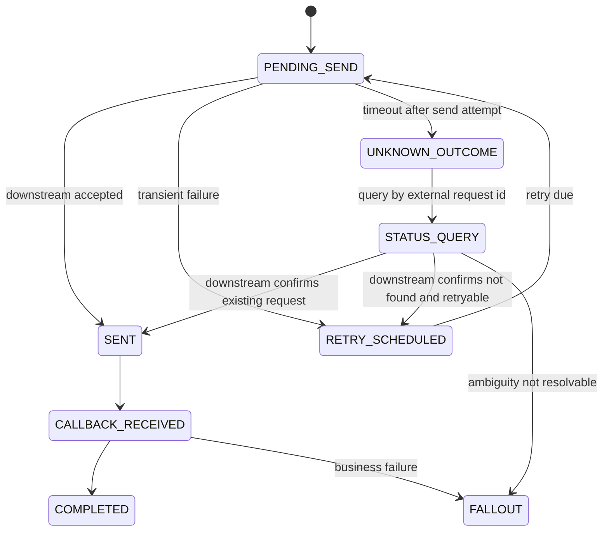

# Part 052 — Resilience: Timeout, Retry, Circuit Breaker, Backpressure, and Bulkhead

## 1. Why This Part Matters

Resilience patterns can save a production system.

They can also destroy it.

A retry policy without idempotency can duplicate orders.

A timeout without cancellation semantics can leave downstream fulfillment running after the caller gives up.

A circuit breaker without fallback policy can convert partial degradation into total feature outage.

A queue without backpressure can hide failure until memory, disk, or operations capacity collapses.

A bulkhead without capacity planning can starve critical workflows.

For Quote & Order systems, resilience is not just availability. It is business correctness under partial failure.

The central question is:

```text
When a dependency is slow, unavailable, inconsistent, or ambiguous, how do we preserve customer trust, business invariants, and recoverability?
```

## 2. Source Notes and Boundaries

Public/industry references used in this part:

- AWS Builders Library discusses timeouts, retries, backoff, jitter, retry amplification, and token-bucket-style retry limiting.
- AWS Architecture Blog discusses exponential backoff and jitter as a practical mitigation for contention and synchronized retries.
- Resilience4j is a Java fault-tolerance library with circuit breaker, retry, rate limiter, bulkhead, and time limiter modules.
- Kubernetes, Kafka, PostgreSQL, and Java runtime behavior influence practical resilience design.

This part does **not** assume CSG internally uses Resilience4j or any specific resilience library.

Internal verification is required for:

- HTTP client library,
- retry defaults,
- timeout defaults,
- circuit breaker implementation,
- queue limits,
- rate limit policy,
- idempotency guarantees,
- downstream integration contracts,
- runbooks and incident history.

## 3. Core Mental Model

Resilience is the controlled handling of failure.

It has five goals:

```text
1. Bound waiting.
2. Bound retries.
3. Bound concurrency.
4. Bound blast radius.
5. Preserve recoverability.
```

A resilient design should answer:

```text
What can fail?
How long will we wait?
Can we retry safely?
How many concurrent attempts are allowed?
What happens when capacity is exceeded?
What state do we persist before/after external calls?
How do we know whether the operation eventually succeeded?
How do we prevent retry storms?
How do operators recover stuck work?
```

## 4. Resilience and Business Semantics

The same technical pattern has different business meaning depending on operation.

### 4.1 Safe to Retry

Usually safe when operation is idempotent and side-effect is controlled:

```text
GET catalog offering by ID
GET customer account reference
GET quote by ID
recalculate quote price using same quote version and same pricing context
publish outbox event with stable event ID
```

### 4.2 Retry With Strong Idempotency

Possible but requires idempotency key, unique constraint, and known semantics:

```text
create quote
convert accepted quote to order
create product order
send fulfillment request
create service order
process callback
```

### 4.3 Usually Not Blindly Retryable

Dangerous unless explicitly modeled:

```text
approve quote
apply discount override
cancel order
amend active order
charge customer
trigger provisioning action
send irreversible downstream command
```

### 4.4 Must Be Human-Classified

Some failures require fallout, not retry:

```text
catalog mapping missing
customer agreement invalid
manual approval authority conflict
downstream rejects business payload
inventory state contradicts requested amendment
```

A retry cannot fix a wrong business request.

## 5. Timeouts

Timeouts are the first resilience primitive.

Without timeouts, resources wait indefinitely.

But bad timeouts cause false failures or cascading retries.

### 5.1 Timeout Budget

Think in budgets.

If API caller has a 5-second timeout, the service cannot spend 5 seconds on every dependency.

Example:

```text
Client timeout: 5s
API gateway budget: 4.8s
Quote service internal budget: 4.5s
Catalog lookup: 500ms
Customer/agreement lookup: 500ms
Pricing calculation: 2s
DB transaction: 500ms
Response serialization/network: 500ms
Safety margin: 500ms
```

Timeouts should compose downward.

### 5.2 Timeout Types

Different timeouts protect different stages:

```text
connection timeout
TLS handshake timeout
request write timeout
response header timeout
read timeout
overall call timeout
connection pool acquisition timeout
DB query timeout
transaction timeout
Kafka producer delivery timeout
Kafka consumer processing timeout
```

Do not say “the timeout is 3 seconds” without saying which timeout.

### 5.3 Timeout and Unknown Outcome

Timeout does not mean the downstream operation failed.

It means the caller stopped waiting.

For side-effecting operations, timeout creates unknown outcome.

Example:

```text
Order service sends createServiceOrder to downstream OSS.
Client times out after 3 seconds.
Downstream processes request at 4 seconds and creates the service order.
Order service retries without idempotency.
Downstream creates duplicate service order.
```

Correct design:

```text
Use stable external request ID.
Persist integration attempt.
Retry with same idempotency key.
Query downstream by external request ID if outcome unknown.
Classify unresolved ambiguity as fallout.
```

## 6. Retry

Retry is useful for transient failures.

Retry is harmful for deterministic failures and overload.

### 6.1 Retryable Failure Examples

```text
temporary network timeout
HTTP 502/503/504 from gateway
connection reset
Kafka retriable producer error
PostgreSQL serialization failure
optimistic locking conflict where command can be safely re-evaluated
```

### 6.2 Non-Retryable Failure Examples

```text
HTTP 400 validation failure
HTTP 401/403 authorization failure
business rule violation
unknown product offering
expired quote
approval authority missing
catalog mapping missing
insufficient permissions
```

### 6.3 Retry Policy Shape

A retry policy should define:

```text
max attempts
base delay
max delay
backoff algorithm
jitter
retryable exception/status list
non-retryable exception/status list
timeout budget interaction
idempotency requirement
metrics/logging
fallback or fallout behavior
```

### 6.4 Backoff and Jitter

Backoff reduces pressure.

Jitter prevents clients from retrying in synchronized waves.

Bad:

```text
Retry immediately 3 times.
```

Better:

```text
Attempt 1: now
Attempt 2: after randomized delay around 100ms
Attempt 3: after randomized delay around 300ms
Attempt 4: after randomized delay around 900ms
Stop when total budget is exhausted.
```

### 6.5 Retry Amplification

A call chain can multiply retries.

```text
API Gateway retries 3x
Quote service retries pricing 3x
Pricing retries catalog 3x
Catalog retries DB 3x
```

Worst-case attempts:

```text
3 * 3 * 3 * 3 = 81
```

This can turn a dependency slowdown into a system-wide collapse.

Senior engineers must know where retries are configured across the stack.

## 7. Circuit Breaker

A circuit breaker stops sending calls to a dependency that is likely failing.

Typical states:

```text
CLOSED: calls flow normally
OPEN: calls fail fast
HALF_OPEN: limited test calls allowed
```

### 7.1 When It Helps

Circuit breaker helps when:

- downstream is down,
- dependency is slow enough to consume threads,
- repeated calls are unlikely to succeed,
- fail-fast is safer than waiting,
- fallback/degradation behavior is defined.

### 7.2 When It Hurts

Circuit breaker hurts when:

- threshold is too sensitive,
- low traffic makes failure rate statistically noisy,
- fallback returns stale/wrong business data,
- open breaker blocks recovery traffic,
- state is shared incorrectly across tenants or operations,
- no one observes breaker state.

### 7.3 Business-Aware Breakers

Do not use one breaker for all operations unless their business impact is similar.

Better separation:

```text
catalog-read-breaker
pricing-calculation-breaker
agreement-lookup-breaker
fulfillment-create-order-breaker
fulfillment-status-query-breaker
```

A failure in fulfillment status query should not necessarily block quote pricing.

## 8. Bulkhead

Bulkhead isolates capacity.

Without bulkheads, one slow operation can consume all threads/connections and starve everything else.

Examples:

```text
Separate thread pool for fulfillment adapter calls.
Separate DB pool or bounded executor for batch reconciliation.
Separate Kafka consumer concurrency for high-volume projection vs critical order lifecycle.
Separate queue for manual fallout vs automated retry.
```

### 8.1 Bulkhead Trade-off

Bulkheads reduce blast radius but create capacity allocation decisions.

Too much isolation:

```text
Idle capacity cannot be used elsewhere.
```

Too little isolation:

```text
One failure domain starves critical workflows.
```

For Quote & Order, prefer protecting critical synchronous paths:

```text
quote pricing
quote acceptance
order creation
order lifecycle transition
operator recovery commands
```

## 9. Backpressure

Backpressure tells upstream:

```text
I cannot safely accept more work right now.
```

Without backpressure, systems buffer until failure becomes worse.

### 9.1 Synchronous Backpressure

Examples:

```text
HTTP 429 Too Many Requests
HTTP 503 Service Unavailable with Retry-After
connection pool acquisition timeout
bounded request queue rejection
```

### 9.2 Asynchronous Backpressure

Examples:

```text
Kafka consumer pauses partitions
bounded internal queue
limited worker pool
DLQ after classification
producer throttling
outbox relay batch limit
```

### 9.3 Business Backpressure

Examples:

```text
Stop accepting new high-volume batch orders while fulfillment adapter is degraded.
Allow quote viewing but disable quote-to-order conversion.
Route affected order items to fallout rather than endless retry.
Pause non-critical projection replay during production incident.
```

Backpressure is not only technical. It is a product and operations decision.

## 10. Rate Limiting

Rate limiting protects a system from excessive request volume.

Possible dimensions:

```text
per tenant
per API client
per operation
per downstream adapter
per user role
per deployment region
```

Be careful with tenant fairness.

A single noisy tenant should not starve all others.

But strategic customers may have contractual expectations that affect rate-limit policy. Verify internally.

## 11. Fallback and Degradation

Fallback is dangerous in business systems.

Safe fallback examples:

```text
show cached read-only catalog with stale warning
return existing quote status when projection is stale
allow draft save while pricing is temporarily unavailable
queue non-critical notification for later
```

Unsafe fallback examples:

```text
use old price without approval
skip eligibility validation
auto-approve discount when approval service is unavailable
submit order without decomposition validation
pretend fulfillment succeeded when callback is missing
```

A fallback must preserve business invariants.

## 12. Resilience by Dependency Type

### 12.1 PostgreSQL

Failure modes:

```text
connection pool exhaustion
slow query
lock wait
deadlock
serialization failure
migration lock contention
replica lag
```

Resilience techniques:

```text
query timeout
transaction timeout
pool acquisition timeout
optimistic locking
retry serialization failure carefully
avoid external calls inside DB transaction
use SKIP LOCKED for worker queues where appropriate
monitor lock waits and transaction duration
```

Do not solve DB overload by blindly increasing pool size. That can increase database pressure.

### 12.2 Kafka

Failure modes:

```text
producer timeout
broker unavailable
schema incompatibility
consumer lag
poison message
rebalance churn
duplicate delivery
out-of-order processing by aggregate
```

Resilience techniques:

```text
transactional outbox
idempotent consumers
bounded retry topics
DLQ with reason codes
pause/resume partition carefully
schema compatibility checks
lag age SLO
replay-safe handlers
```

Kafka resilience must be paired with business idempotency.

### 12.3 External REST/SOAP/Legacy Downstream

Failure modes:

```text
timeout
HTTP 5xx
HTTP 429
malformed response
business rejection
unknown outcome
partial side-effect
slow callback
```

Resilience techniques:

```text
idempotency key
integration attempt table
timeout budget
retry with backoff/jitter
circuit breaker
status query by external request ID
fallout classification
manual recovery command
```

### 12.4 Catalog/Pricing/Agreement Services

Failure modes:

```text
stale cache
incompatible catalog version
missing price rule
agreement lookup failure
pricing calculation timeout
```

Resilience techniques:

```text
versioned snapshot
cache with explicit freshness metadata
fail closed for pricing/approval correctness
degraded draft-only mode
clear validation error classification
```

## 13. Java Implementation Sketch with Resilience4j-Style Decorators

This is illustrative. Adapt to internal library choices.

```java
public final class FulfillmentClient {
    private final HttpClient httpClient;
    private final CircuitBreaker circuitBreaker;
    private final Retry retry;
    private final TimeLimiter timeLimiter;
    private final SemaphoreBulkhead bulkhead;

    public CompletionStage<FulfillmentResult> createServiceOrder(
            CreateServiceOrderRequest request,
            IdempotencyKey idempotencyKey,
            CorrelationContext correlation
    ) {
        Supplier<CompletionStage<FulfillmentResult>> call = () ->
                httpClient.post(
                        "/service-orders",
                        request,
                        headers(idempotencyKey, correlation)
                );

        Supplier<CompletionStage<FulfillmentResult>> protectedCall =
                Decorators.ofCompletionStage(call)
                        .withBulkhead(bulkhead)
                        .withTimeLimiter(timeLimiter, scheduler)
                        .withCircuitBreaker(circuitBreaker)
                        .withRetry(retry, scheduler)
                        .decorate();

        return protectedCall.get();
    }
}
```

Review questions:

```text
Is retry outside or inside timeout budget?
Is idempotency key stable across retries?
Does the circuit breaker count business 4xx as failure?
Is timeout treated as unknown outcome?
Is the bulkhead shared with unrelated operations?
Are metrics emitted for each attempt and final outcome?
```

## 14. Configuration Example

Illustrative only.

```yaml
resilience:
  clients:
    fulfillment-create-service-order:
      timeout:
        duration: 3s
      retry:
        maxAttempts: 3
        baseDelay: 200ms
        maxDelay: 2s
        jitter: true
        retryOn:
          - timeout
          - connection-reset
          - http-502
          - http-503
          - http-504
        ignore:
          - http-400
          - http-401
          - http-403
          - business-validation-error
      circuitBreaker:
        slidingWindow: 100
        minimumCalls: 20
        failureRateThreshold: 50
        slowCallRateThreshold: 50
        slowCallDurationThreshold: 2s
        waitDurationInOpenState: 30s
      bulkhead:
        maxConcurrentCalls: 20
        maxWaitDuration: 0ms
```

Important: config values are not universal. They must be tuned using latency distribution, traffic volume, downstream capacity, and SLOs.

## 15. Resilience for Quote-to-Order Conversion

Quote-to-order conversion is dangerous because it creates business commitment.

Minimum safety properties:

```text
one accepted quote version creates at most one order
conversion command has idempotency key
quote is locked or version-checked
pricing snapshot is valid
approval snapshot is valid
order creation and conversion marker are transactional
order-created event is emitted through outbox
retry returns existing order when conversion already succeeded
```

Failure handling:

```text
If DB transaction fails before commit:
  safe to retry command.

If commit succeeds but HTTP response fails:
  retry must return existing order.

If outbox publish delayed:
  order exists; event propagation alert should fire.

If downstream fulfillment fails after order creation:
  order enters fallout/retry workflow, not duplicate creation.
```

## 16. Resilience for Fulfillment Integration

Fulfillment integration often involves unknown outcome.

Recommended state machine:



Do not model timeout as simple failure for side-effecting calls.

## 17. Retry Queue Design

A retry queue should not be infinite.

Fields to persist:

```text
attempt_id
business_operation
aggregate_id
tenant_id
external_request_id
attempt_number
next_attempt_at
last_error_class
last_error_message_redacted
correlation_id
causation_id
status
created_at
updated_at
```

Rules:

```text
Retry only classified transient failures.
Use stable idempotency key.
Use max attempt count.
Use exponential backoff with jitter.
Move to fallout after exhaustion.
Expose retry age and queue depth metrics.
Allow operator-controlled retry/resume with audit.
```

## 18. Circuit Breaker Metrics

Minimum metrics:

```text
circuit_breaker_state{client, operation}
circuit_breaker_calls_total{client, operation, outcome}
circuit_breaker_slow_calls_total{client, operation}
circuit_breaker_not_permitted_total{client, operation}
retry_attempt_total{client, operation, outcome}
bulkhead_rejected_total{client, operation}
timeout_total{client, operation}
```

Business-level correlation:

```text
orders_blocked_by_fulfillment_breaker_total
quotes_degraded_by_pricing_breaker_total
fallout_created_due_to_dependency_unavailable_total
```

## 19. Backpressure and User Experience

Backpressure should be explicit.

For API callers:

```http
HTTP/1.1 503 Service Unavailable
Retry-After: 60
Content-Type: application/json

{
  "code": "ORDER_FULFILLMENT_TEMPORARILY_UNAVAILABLE",
  "message": "Order submission is temporarily unavailable for this tenant. Draft quote changes are still allowed.",
  "correlationId": "..."
}
```

For UI:

```text
Disable Submit Order button when fulfillment submit path is degraded.
Allow Save Draft.
Show clear degraded mode message.
Do not imply the order was submitted.
```

For operators:

```text
Show queued work count.
Show oldest queued work age.
Show retry/fallout classification.
Show safe recovery actions.
```

## 20. Resilience and Security

Do not retry authorization failures.

Do not bypass authorization service by defaulting to allow.

Do not include secrets or PII in retry payload logs.

Do not route cross-tenant retries through shared idempotency keys.

Do not let circuit breaker state leak tenant-specific information through public responses.

Security failures should usually fail closed.

## 21. Resilience and Tenant Isolation

Tenant-aware resilience questions:

```text
Can one tenant exhaust shared worker pools?
Can one tenant's bad integration open a shared circuit breaker affecting all tenants?
Are retry queues partitioned or fairly scheduled?
Are rate limits per tenant/client/operation?
Are dashboards able to show tenant impact safely?
```

Potential design:

```text
global limit protects platform
per-tenant limit protects fairness
per-operation limit protects critical paths
per-adapter circuit breaker protects downstream-specific blast radius
```

## 22. Testing Resilience

### 22.1 Unit Tests

Test classification:

```text
which errors are retryable
which errors are terminal
which errors create fallout
which errors are unknown outcome
```

### 22.2 Integration Tests

Use controlled fake downstream:

```text
responds 503 twice then 200
responds slowly beyond timeout
accepts request but delays response
returns duplicate confirmation for same idempotency key
returns business validation error
returns malformed response
```

Verify:

```text
idempotency key reused
attempts persisted
retry count bounded
fallout created after exhaustion
circuit breaker opens under repeated failure
metrics emitted
no duplicate order/service order created
```

### 22.3 Chaos/Game Day Tests

Safe environment scenarios:

```text
fulfillment adapter latency spike
pricing service 50% failure
catalog cache invalidation delay
Kafka producer failure
outbox relay stopped
DB lock contention
one tenant sends excessive batch order load
```

Verify:

```text
SLO alert fires
backpressure starts
critical paths remain protected
retry storm does not occur
fallout is classified
operator recovery works
```

## 23. Common Anti-Patterns

### 23.1 Retry Everything

This duplicates side effects and amplifies outages.

### 23.2 Timeout Too High

Threads and connections pile up until the service dies.

### 23.3 Timeout Too Low

Healthy slow requests become false failures and trigger retries.

### 23.4 Circuit Breaker Without Business Policy

Fail-fast is only useful if the caller knows what to do next.

### 23.5 Infinite Queue

An infinite queue is delayed outage with worse recovery.

### 23.6 Fallback That Violates Business Rules

Using stale price or skipping approval may preserve uptime while corrupting commercial correctness.

### 23.7 Retrying Inside a Database Transaction

Holding locks while retrying downstream calls can create lock storms.

### 23.8 Shared Bulkhead for Critical and Non-Critical Work

Non-critical batch work should not starve quote acceptance or order recovery.

### 23.9 Missing Unknown Outcome State

Timeout on side-effecting call must not be treated as simple failure.

## 24. Senior Engineer PR Review Checklist

When reviewing resilience changes, check:

```text
[ ] Is the failure mode clearly described?
[ ] Is timeout budget explicit?
[ ] Are retries bounded?
[ ] Is jitter used where retry storms are possible?
[ ] Are retryable and non-retryable errors classified correctly?
[ ] Is the operation idempotent across retries?
[ ] Is unknown outcome handled for side-effecting calls?
[ ] Is circuit breaker scoped by operation/dependency/tenant where needed?
[ ] Is fallback safe for business invariants?
[ ] Is backpressure explicit?
[ ] Are queues bounded?
[ ] Are bulkheads protecting critical workflows?
[ ] Are metrics/logs/traces emitted for attempts and final outcomes?
[ ] Are failure outcomes visible in dashboards?
[ ] Does alerting distinguish dependency degradation from user impact?
[ ] Are security/authorization failures fail-closed and non-retryable?
[ ] Are tenant isolation and noisy-neighbor effects considered?
[ ] Are tests covering timeout, retry exhaustion, circuit open, and duplicate prevention?
[ ] Is there a runbook for degraded dependency behavior?
```

## 25. Internal Verification Checklist

Verify internally:

```text
[ ] HTTP client defaults.
[ ] Global timeout defaults.
[ ] Per-service timeout policies.
[ ] Retry library and default retry count.
[ ] Circuit breaker library/configuration.
[ ] Bulkhead/thread pool configuration.
[ ] Rate limit strategy.
[ ] Queue size limits.
[ ] Kafka retry/DLQ topic conventions.
[ ] Outbox relay retry behavior.
[ ] Integration attempt persistence model.
[ ] Idempotency key convention.
[ ] Downstream idempotency support.
[ ] Fallout classification taxonomy.
[ ] Unknown outcome recovery procedure.
[ ] Runbooks for dependency outage.
[ ] Incident history involving retry storms or duplicate orders.
[ ] Tenant-specific circuit breaker/rate limit behavior.
[ ] Dashboard metrics for timeout/retry/circuit/bulkhead.
```

## 26. Practical Exercises

### Exercise 1 — Map One Dependency Failure

Choose one dependency:

```text
pricing service
catalog service
customer/account service
fulfillment adapter
billing handoff
Kafka broker
PostgreSQL
```

Write:

```text
Failure modes:
Timeout policy:
Retry policy:
Circuit breaker policy:
Backpressure behavior:
Fallback/degradation:
Unknown outcome handling:
Business impact:
Metrics:
Alerts:
Runbook:
```

### Exercise 2 — Review One Retry Policy

Find an existing retry config.

Answer:

```text
What operation is retried?
Is it idempotent?
What errors are retried?
What errors are not retried?
Is there backoff and jitter?
Can retries multiply through the stack?
What happens after max attempts?
How is it observed?
```

### Exercise 3 — Design Unknown Outcome Handling

Take a side-effecting downstream call.

Design:

```text
external_request_id
integration_attempt table
status query behavior
retry behavior
fallout behavior
audit behavior
operator recovery command
```

### Exercise 4 — Identify a Missing Bulkhead

Find one shared executor, queue, or connection pool.

Ask:

```text
Which operations share it?
Which operation can starve the others?
Which business path is most critical?
Should capacity be isolated?
What metric proves saturation?
```

## 27. Mental Model Summary

Resilience is not a checklist of patterns.

It is a set of explicit decisions about waiting, retrying, isolating, shedding, degrading, and recovering.

For Quote & Order systems:

- retry requires idempotency,
- timeout creates unknown outcome for side-effecting calls,
- circuit breaker requires business-safe fallback,
- bulkhead protects critical workflows,
- backpressure must be explicit,
- infinite queues are hidden outages,
- security failures fail closed,
- tenant isolation must include capacity isolation,
- observability must show attempts, final outcomes, and business impact,
- recovery must be designed before production failure.

A senior engineer does not ask, “Did we add retries?”

A senior engineer asks:

```text
What happens when every retry fails, and how do we prove no customer order was duplicated or lost?
```
