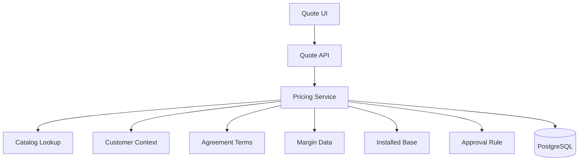

# Part 053 — Performance and Scalability for Quote, Pricing, Catalog, and Order Workloads

## 1. Core thesis

Performance in a CPQ / Quote & Order system is not just "make endpoints fast".

In an enterprise quote-to-cash platform, performance means:

- a sales user can configure and price a complex quote without waiting unpredictably;
- a pricing recalculation does not overload catalog, agreement, or customer context lookup;
- order capture can absorb bursts without creating duplicate or inconsistent orders;
- Kafka consumers can process downstream lifecycle events without unbounded lag;
- PostgreSQL remains healthy under mixed read/write workloads;
- batch, backfill, reconciliation, and reporting-adjacent queries do not starve transactional paths;
- customer-specific configuration does not explode the test/performance matrix;
- the system degrades safely instead of creating revenue, fulfillment, or audit defects.

A senior engineer should treat performance as a property of the whole workflow, not a local optimization of one method.

> Public-context boundary: CSG publicly positions Quote & Order around CPQ, quote management, order management, enterprise agreements, catalog-driven tools/APIs, and complex telecom/enterprise selling. This part uses those public product themes and general industry architecture concepts. It does **not** assume CSG internal implementation details. Verify all concrete behavior internally.

---

## 2. Performance is a business property

In ordinary web applications, performance is often expressed as page latency or request latency. In Quote & Order, performance maps to business outcomes.

| System area | Performance question | Business risk if slow or unstable |
|---|---|---|
| Product catalog search | Can users find and configure sellable offers quickly? | Sales friction, incorrect product selection |
| Eligibility validation | Can constraints be evaluated without blocking UX? | Invalid quotes, abandoned quoting session |
| Pricing calculation | Can price/margin/discount be recomputed predictably? | Quote delays, stale prices, approval confusion |
| Quote save/version | Can concurrent users save safely? | Lost edits, bad audit, negotiation errors |
| Approval routing | Can approval be calculated and assigned quickly? | Deal delay, approval bypass workaround |
| Quote-to-order conversion | Can accepted quote convert exactly once? | Duplicate order, missing order, revenue leakage |
| Order validation | Can order be validated at scale? | Fallout, downstream rejection |
| Order decomposition | Can complex order items become executable tasks? | Fulfillment delay, dependency bugs |
| Kafka event propagation | Can lifecycle events move without growing lag? | Stale status, missed notifications, reconciliation burden |
| PostgreSQL transactions | Can writes complete without lock storms? | user-facing failure, incident, retry amplification |

Performance is therefore not merely a non-functional requirement. It is part of commercial correctness.

---

## 3. Workload taxonomy

Before tuning, classify workload shape.

### 3.1 Interactive quote workload

Characteristics:

- user-facing;
- latency-sensitive;
- often read-heavy with bursty writes;
- depends on catalog, customer, agreement, pricing, and eligibility;
- may require partial recalculation on every quote edit;
- usually sensitive to p95/p99 latency, not just average latency.

Common operations:

- search catalog;
- fetch offering details;
- add product offering to quote;
- validate configuration;
- calculate price;
- apply discount;
- save quote draft;
- submit for approval;
- accept quote;
- convert quote to order.

Failure pattern:

- many small dependencies create unpredictable tail latency;
- user retries create duplicate submissions;
- cache miss storm makes every quote slow;
- stale catalog or pricing context produces wrong-but-fast results.

### 3.2 Order capture workload

Characteristics:

- correctness-sensitive;
- write-heavy at lifecycle transition points;
- idempotency-sensitive;
- depends on quote snapshot, product inventory, customer/account validity, and order state machine;
- often event-producing.

Common operations:

- create product order;
- validate product order;
- transition order state;
- persist order item states;
- publish lifecycle events;
- submit order for decomposition.

Failure pattern:

- double submit creates duplicate order;
- long transaction holds locks;
- outbox relay falls behind;
- order state update races with cancellation/amendment.

### 3.3 Fulfillment and async workflow workload

Characteristics:

- long-running;
- event-driven;
- throughput-sensitive;
- downstream-dependent;
- often dominated by retries, timeouts, and external latency.

Common operations:

- consume order accepted event;
- decompose order;
- create service order/task;
- call downstream adapter;
- process completion/failure callback;
- update item state;
- raise fallout.

Failure pattern:

- retry storm;
- poison message blocks partition;
- consumer lag hides delayed work;
- stale status aggregation;
- manual fallout queue grows silently.

### 3.4 Catalog workload

Characteristics:

- read-heavy at runtime;
- write/publish-heavy during catalog release;
- effective-dated/versioned;
- cache-sensitive;
- often has hierarchical/bundled structure.

Common operations:

- retrieve product offering;
- traverse bundle;
- resolve characteristic definitions;
- resolve price rules;
- publish catalog version;
- invalidate cache.

Failure pattern:

- recursive traversal is expensive;
- cache invalidation is wrong;
- catalog publish causes cold-cache latency spike;
- quote references live catalog instead of accepted snapshot.

### 3.5 Reconciliation and back-office workload

Characteristics:

- not always user-facing;
- can scan many rows;
- often runs on schedule;
- may compete with transactional workload;
- sometimes essential for correctness.

Common operations:

- detect stuck orders;
- compare outbox and Kafka state;
- compare fulfillment state and internal order state;
- detect duplicate orders;
- repair missing lifecycle events;
- generate operational reports.

Failure pattern:

- heavy queries degrade primary DB;
- reconciliation has no rate limit;
- backfill locks table;
- repair script violates invariants.

---

## 4. Latency, throughput, and capacity are different questions

### 4.1 Latency

Latency is the time one operation takes.

For user-facing quote operations, care about:

- p50: typical experience;
- p95: normal tail;
- p99/p99.9: pathological but important customer experience;
- max: often noisy, but useful during incident analysis.

A CPQ pricing endpoint with excellent average latency can still be unacceptable if p99 is unstable.

### 4.2 Throughput

Throughput is how much work the system completes per unit time.

For order systems, throughput should be measured at multiple levels:

- requests per second;
- orders created per minute;
- order items decomposed per minute;
- Kafka records consumed per second;
- outbox rows published per second;
- downstream fulfillment calls completed per minute;
- fallout items resolved per day.

### 4.3 Capacity

Capacity is the sustainable operating envelope.

A useful capacity statement looks like this:

> The system supports X concurrent quoting users, Y quote recalculations per minute, Z order submissions per minute, and W Kafka events per minute while maintaining p95 quote recalculation below A ms, order capture p95 below B ms, consumer lag age below C minutes, and database CPU below D%.

The important part is that capacity is tied to both technical and business signals.

### 4.4 Saturation

Saturation means a resource is close to exhaustion.

Watch:

- CPU;
- memory;
- DB connection pool;
- DB locks;
- disk I/O;
- Kafka consumer lag age;
- Kafka broker I/O;
- thread pools;
- HTTP client connection pools;
- queue depth;
- Kubernetes pod limits;
- downstream rate limits.

Saturation usually appears before user-visible failure if signals are instrumented correctly.

---

## 5. Performance mental model for quote pricing

Pricing is often the performance hotspot in CPQ systems.

A quote pricing operation may require:

1. quote item tree;
2. product offering details;
3. product specification characteristics;
4. product offering price definitions;
5. customer/account context;
6. agreement terms;
7. discount eligibility;
8. margin data;
9. tax or billing-related inputs;
10. approval threshold evaluation;
11. previous accepted price snapshot;
12. currency and effective date handling.

Naive implementation often creates a dependency fan-out:



This can fail in two ways:

- **slow and correct**: every dependency is queried live, p99 becomes unacceptable;
- **fast and wrong**: unsafe caching or stale references produce incorrect commercial outcome.

A good design makes explicit which data is:

- part of the quote snapshot;
- cacheable by catalog version/effective date;
- customer-specific and volatile;
- agreement-specific and legally sensitive;
- approval-critical;
- allowed to be stale within a defined bound.

---

## 6. Hot path vs cold path

Separate hot path from cold path.

### Hot path

Operations that users or business flows hit frequently:

- catalog search;
- offer detail retrieval;
- quote item add/update/remove;
- quote validation;
- price calculation;
- quote save;
- quote submit for approval;
- order capture;
- lifecycle transition;
- Kafka consumer handling.

Hot path optimization rules:

- keep dependencies bounded;
- avoid unbounded loops over item trees;
- avoid N+1 queries;
- avoid dynamic query shapes that bypass indexes;
- avoid remote calls inside DB transaction;
- avoid heavyweight audit serialization in the synchronous path;
- use outbox for asynchronous side effects;
- expose latency and saturation metrics.

### Cold path

Operations that happen less frequently:

- catalog publish;
- bulk import;
- migration;
- backfill;
- reconciliation;
- reporting export;
- operational repair.

Cold path rules:

- must be rate-limited;
- must not starve hot path;
- must be observable;
- must be resumable;
- must have dry-run mode when destructive;
- must not hold long locks;
- should use chunking and checkpoints.

---

## 7. Catalog performance

Catalog-driven architecture often hides complexity behind "just read catalog".

Key risks:

1. Deep bundle traversal.
2. Effective-date filtering on every lookup.
3. Customer-specific catalog overlay.
4. Version compatibility.
5. Characteristic explosion.
6. Runtime rule evaluation.
7. Large payload responses.
8. Cache invalidation during publish.

### 7.1 Catalog cache strategy

A defensible catalog cache should define:

| Question | Required answer |
|---|---|
| Cache key | Is it by offering ID, catalog version, tenant, customer segment, agreement, effective date? |
| Cache lifetime | Is TTL enough or event invalidation needed? |
| Invalidation | What happens on catalog publish? |
| Warmup | Is there warmup for critical offerings? |
| Staleness | What stale data is acceptable? |
| Safety | Is accepted quote snapshot independent from mutable catalog cache? |
| Observability | Can we measure hit rate, miss rate, load time, and invalidation lag? |

Unsafe cache pattern:

```text
productOfferingId -> latest offering
```

Safer pattern:

```text
tenantId + catalogVersionId + productOfferingId + effectiveDate + customerSegment -> offering snapshot
```

Actual key depends on internal model and must be verified.

### 7.2 Payload size

Large TMF-style resource graphs can become performance risks if every API returns fully expanded objects.

Prefer explicit expansion semantics:

```http
GET /productOfferings/{id}?expand=price,characteristics,bundledOfferings
```

Avoid always returning:

- full bundle tree;
- all prices;
- all compatibility rules;
- all lifecycle history;
- all customer-specific overlays.

Use server-side projection carefully, but do not create dozens of undocumented response shapes.

---

## 8. PostgreSQL performance model

PostgreSQL performance in Quote & Order is driven by:

- query shape;
- index design;
- cardinality estimates;
- table growth;
- transaction length;
- lock contention;
- connection pool sizing;
- vacuum and bloat;
- hot rows;
- JSONB usage;
- partitioning strategy;
- migration/backfill behavior.

### 8.1 The EXPLAIN discipline

For important queries, require evidence:

```sql
EXPLAIN (ANALYZE, BUFFERS)
SELECT ...
```

Look for:

- sequential scan on large table;
- unexpected nested loop;
- high actual rows vs estimated rows difference;
- high shared read blocks;
- sort spilling to disk;
- repeated subquery execution;
- filter removing many rows after scan;
- missing tenant/status/effective date index.

PostgreSQL documentation emphasizes that the planner builds a query plan for every query and `EXPLAIN` is the tool for seeing that plan. Plan reading is a required senior skill, not an optional DBA-only activity.

### 8.2 Quote/order index examples

Illustrative only. Verify internal schema.

```sql
-- Find active quotes for a tenant/customer.
CREATE INDEX CONCURRENTLY idx_quote_tenant_customer_state_updated
ON quote (tenant_id, customer_id, state, updated_at DESC);

-- Find order by external idempotency key.
CREATE UNIQUE INDEX CONCURRENTLY ux_order_tenant_idempotency_key
ON product_order (tenant_id, idempotency_key)
WHERE idempotency_key IS NOT NULL;

-- Find pending outbox events.
CREATE INDEX CONCURRENTLY idx_outbox_pending_created
ON outbox_event (status, created_at)
WHERE status = 'PENDING';

-- Find stuck order items.
CREATE INDEX CONCURRENTLY idx_order_item_state_updated
ON product_order_item (tenant_id, state, updated_at)
WHERE state IN ('IN_PROGRESS', 'FALLOUT', 'CANCELLING');
```

Senior review question:

> Does this index support a real query shape, or is it just an index-shaped hope?

### 8.3 Connection pool is not infinite performance

Increasing pool size can make the database slower if it increases concurrency beyond what PostgreSQL can sustain.

Watch:

- active vs idle connections;
- wait time for connection;
- transaction duration;
- lock wait time;
- CPU saturation;
- context switching;
- query latency under load.

A healthy pool is sized to protect the DB, not to maximize simultaneous DB work.

---

## 9. Kafka scalability model

Kafka scales with partitions and consumers, but ordering constraints limit parallelism.

Key questions:

| Topic | Key design question |
|---|---|
| `quote.lifecycle` | Is ordering required per quote? |
| `order.lifecycle` | Is ordering required per order? |
| `order.item.lifecycle` | Is ordering per order item or parent order? |
| `outbox.events` | How are rows relayed and partitioned? |
| `integration.callback` | Is callback order guaranteed by downstream? |
| `catalog.published` | Is one event enough or per-offering events needed? |

### 9.1 Partition key trade-off

Using `orderId` as key:

- preserves order per order;
- allows parallelism across orders;
- can hot-spot if one large order emits many events.

Using `tenantId` as key:

- preserves order per tenant;
- risks low parallelism and hot tenants.

Using random key:

- maximizes distribution;
- destroys ordering guarantee.

Use the ordering requirement to choose partition key. Do not choose partition key only for even distribution.

### 9.2 Consumer lag

Consumer lag should be measured as:

- records behind;
- time behind / lag age;
- oldest unprocessed event age;
- DLQ count;
- retry topic age;
- stuck partition indicator;
- consumer rebalance frequency.

For business workflows, lag age is often more meaningful than raw record count.

---

## 10. Java service performance

### 10.1 CPU and allocation

Common Java performance risks in enterprise backend code:

- repeated JSON serialization/deserialization;
- large object graphs from fully expanded DTOs;
- mapping the same entity tree repeatedly;
- excessive use of reflection-heavy frameworks in hot path;
- large collections without pagination;
- expensive validation repeated at every layer;
- accidental O(n²) traversal of quote item tree;
- synchronous logging with large payloads;
- high cardinality metrics labels;
- blocking calls in thread pools sized for CPU work.

### 10.2 JVM and Kubernetes

Performance is affected by runtime settings:

- container memory limit;
- heap sizing;
- GC behavior;
- CPU request/limit;
- thread count;
- HTTP client pool;
- DB connection pool;
- Kafka consumer concurrency;
- readiness behavior during startup;
- graceful shutdown.

Do not tune JVM in isolation. Tune it with pod resources, traffic shape, and DB/Kafka limits.

### 10.3 Thread pools

Every thread pool is a queue.

For each pool, define:

- what work enters it;
- max concurrency;
- queue size;
- rejection policy;
- timeout;
- metric;
- alert threshold;
- degradation behavior.

Unbounded queue means latency can grow without immediate failure. That is dangerous for user-facing workflows.

---

## 11. Caching strategy

Caching can improve performance or create correctness bugs.

### 11.1 Good cache candidates

- immutable catalog version data;
- product offering snapshot by version;
- static reference data;
- permission metadata with short TTL;
- feature flag evaluation result for one request;
- compiled rule representation by catalog version.

### 11.2 Risky cache candidates

- current customer account status;
- approval authority;
- agreement terms near effective date boundary;
- inventory state during amendment;
- quote price after discount changes;
- authorization result across tenants;
- mutable order state.

### 11.3 Cache correctness checklist

Before adding cache, answer:

1. What is the cache key?
2. What invariant depends on this data?
3. Can stale data cause financial/security/order correctness issue?
4. Is cache tenant-safe?
5. Is cache customer/agreement/version/effective-date-safe?
6. How is invalidation triggered?
7. What happens during cache miss storm?
8. Is there a circuit breaker or rate limit?
9. Is hit/miss/load/failure measured?
10. Can the system run safely with cache disabled?

---

## 12. Performance anti-patterns

### 12.1 The "one endpoint returns everything" API

Problem:

- huge response payload;
- repeated joins;
- large JSON serialization;
- unstable p99;
- poor cacheability.

Better:

- projection/expansion;
- pagination;
- separate query endpoints;
- async export for large data;
- clear contract for default representation.

### 12.2 The "pricing calls everything live" pipeline

Problem:

- tail latency is sum of dependency tails;
- downstream hiccup blocks quote;
- no stable price snapshot.

Better:

- explicit snapshot;
- preloaded catalog context;
- bounded dependency calls;
- deterministic pricing inputs;
- separate recalculation trigger.

### 12.3 The "batch job on primary at noon" failure

Problem:

- reconciliation scans large table;
- primary DB latency increases;
- user-facing quote/order path degrades.

Better:

- chunked batch;
- off-peak scheduling;
- read replica where safe;
- rate limit;
- progress checkpoint;
- query plan reviewed.

### 12.4 The "partition key by tenant" hot tenant problem

Problem:

- one large customer owns one Kafka partition;
- consumer lag grows for that partition;
- other consumers idle.

Better:

- partition by aggregate where ordering allows;
- split topic by workflow;
- tune partitions based on measured load;
- design consumer idempotency for parallelism.

### 12.5 The "cache solved it" illusion

Problem:

- cold start slow;
- cache invalidation wrong;
- multi-tenant leakage risk;
- stale pricing.

Better:

- cache with versioned keys;
- warmup critical paths;
- explicit staleness budget;
- measure and alert cache health.

---

## 13. Capacity planning for Quote & Order

Capacity planning starts with business flows.

Example capacity model:

```text
Tenants: 50
Peak quoting users per tenant: 100
Quote item count p95: 80
Pricing recalculations per user per minute: 3
Order conversion rate during campaign: 1,000 orders/hour
Average order items: 20
Events per order item: 5
Downstream fulfillment callback p95: 30 seconds
```

Derived signals:

```text
Pricing recalculations/minute = tenants * users * recalculations
Order item state updates/hour = orders * items * lifecycle transitions
Kafka events/hour = orders * items * events
DB writes/sec = order transitions + outbox inserts + audit rows
```

Then validate by load testing, not spreadsheet confidence.

### 13.1 Load test scenarios

Load testing should include:

- catalog search burst;
- configure quote with large bundle;
- pricing recalculation with agreement overlay;
- submit quote for approval;
- convert accepted quote to order;
- create large order;
- decompose order to many tasks;
- Kafka consumer catch-up;
- downstream timeout/retry scenario;
- reconciliation job running during normal traffic.

### 13.2 Load test success criteria

Define:

- p95/p99 latency per endpoint;
- quote recalculation time;
- order capture throughput;
- DB CPU and lock wait;
- Kafka lag age;
- outbox pending age;
- error rate;
- retry rate;
- fallout creation rate;
- cache hit rate;
- pod CPU/memory;
- GC pause;
- downstream call latency.

If success criteria are only "no errors", the test is weak.

---

## 14. Observability for performance

Performance telemetry should answer:

1. Which business operation is slow?
2. Which dependency contributed?
3. Is it tenant-specific?
4. Is it customer/agreement/catalog-version-specific?
5. Is it caused by DB, Kafka, downstream, CPU, lock, cache, or queue?
6. Is the system saturated?
7. Is the backlog growing?
8. Is retry amplification happening?
9. Is fallout increasing?
10. Is this a correctness risk or only latency risk?

### 14.1 Required metrics

Recommended business and technical metrics:

| Metric | Why it matters |
|---|---|
| `quote_price_calculation_duration` | Core CPQ responsiveness |
| `quote_item_count` | Complexity driver |
| `catalog_cache_hit_ratio` | Cache effectiveness |
| `catalog_lookup_duration` | Catalog dependency health |
| `order_capture_duration` | Order entry health |
| `order_state_transition_duration` | Lifecycle health |
| `order_decomposition_duration` | Fulfillment preparation health |
| `outbox_pending_age` | Event publication health |
| `kafka_consumer_lag_age` | Async freshness |
| `db_lock_wait_duration` | Concurrency risk |
| `db_query_duration_by_query_name` | Query regression |
| `integration_retry_count` | Downstream instability |
| `fallout_created_count` | Business failure rate |

Avoid high-cardinality labels such as quote ID or order ID in metrics.

### 14.2 Structured logs

Performance logs should include:

- tenant ID;
- operation name;
- quote/order ID when safe;
- catalog version;
- item count;
- dependency duration breakdown;
- correlation ID;
- causation ID;
- result status;
- retry count;
- error category.

Do not log full quote/order payloads by default.

---

## 15. Performance testing strategy

### 15.1 Unit-level performance checks

Useful for algorithms:

- quote item tree traversal;
- price rule evaluation;
- bundle expansion;
- validation matrix;
- mapper transformation.

These are not substitutes for system load tests.

### 15.2 Integration performance tests

Useful for:

- MyBatis query performance against realistic data volume;
- PostgreSQL index plan regression;
- outbox relay throughput;
- Kafka consumer processing time;
- cache miss behavior.

### 15.3 System load tests

Useful for:

- end-to-end latency;
- bottleneck discovery;
- saturation point;
- retry amplification;
- degradation mode;
- capacity planning.

### 15.4 Soak tests

Useful for:

- memory leak;
- connection leak;
- cache growth;
- thread pool exhaustion;
- Kafka consumer stability;
- DB bloat under churn.

---

## 16. Internal verification checklist

Verify these in CSG internal systems instead of assuming:

### Product/workload

- What are the top user-facing quote workflows?
- What are the largest quote sizes seen in practice?
- What are the largest order sizes?
- Which customers/tenants create peak load?
- What is the expected p95/p99 for pricing, quote save, order capture, order status update?
- Which operations have customer contractual performance expectations?

### Architecture

- Which services own catalog, quote, pricing, approval, order, decomposition, fulfillment integration?
- Are pricing and catalog lookup synchronous or asynchronous?
- Are there read models or projections?
- Is there a cache layer? What is its invalidation model?
- Are there customer-specific adapters/configuration paths?

### PostgreSQL

- What are the largest tables?
- What are the slowest queries?
- What indexes exist for quote/order/catalog/outbox?
- What is the default isolation level?
- What lock wait incidents have happened?
- What is the connection pool size per service?

### Kafka

- What topics exist for quote/order/catalog/fulfillment?
- What partition keys are used?
- What is the maximum lag age seen?
- Are retry and DLQ topics standardized?
- Can consumers be replayed safely?

### Kubernetes/runtime

- What are resource requests/limits?
- Are HPA/VPA used?
- What are CPU/memory saturation thresholds?
- What JVM flags are configured?
- Are readiness probes tied to dependency health or only process liveness?

### Observability

- Is there a quote pricing dashboard?
- Is there an order lifecycle dashboard?
- Is there outbox/Kafka lag dashboard?
- Are p95/p99 tracked per operation?
- Are metrics tagged by tenant safely?
- Are high-cardinality labels controlled?

### Testing

- Is there a load test suite?
- What data volume does it use?
- Are catalog bundle depths realistic?
- Are downstream failures simulated?
- Are performance regressions gated in CI?

---

## 17. PR review checklist

For performance-sensitive changes, ask:

### Domain/workload

- Does this change affect hot path or cold path?
- Does it increase quote/order item traversal complexity?
- Does it add dependency fan-out?
- Does it change synchronous vs asynchronous boundary?
- Does it change cache correctness?

### Database

- Are new queries named and observable?
- Is there an `EXPLAIN (ANALYZE, BUFFERS)` for important queries?
- Does the query use tenant/status/effective date indexes?
- Is pagination keyset-based where needed?
- Does migration add lock risk?
- Does the change increase transaction duration?

### Kafka

- Does this change alter event volume?
- Does it change partition key or ordering expectation?
- Is consumer processing idempotent?
- Can it be replayed?
- Are lag metrics updated?

### Java/runtime

- Does it allocate large object graphs?
- Does it serialize full payloads?
- Does it add blocking calls in hot path?
- Does it use bounded thread pools?
- Does it add large logs or high-cardinality metrics?

### Operations

- Are new dashboards/alerts needed?
- Is there a rollout plan?
- Is there rollback or kill switch?
- Is capacity impact documented?
- Is performance tested with realistic data?

---

## 18. Practical exercise

Pick one quote pricing or order capture endpoint internally and build a performance profile:

1. Identify the business operation.
2. Draw the dependency graph.
3. List synchronous calls.
4. List database queries.
5. Capture p50/p95/p99.
6. Capture item count or payload size distribution.
7. Run or inspect `EXPLAIN (ANALYZE, BUFFERS)` for critical queries.
8. Identify cache usage and hit/miss behavior.
9. Identify Kafka events produced.
10. Identify outbox/async delay.
11. Write the top three bottlenecks.
12. Propose one low-risk improvement and one deeper architecture improvement.

Deliverable:

```md
# Performance Profile: <operation>

## Business role
...

## Hot path
...

## Dependency graph
...

## Observed latency
...

## Bottlenecks
...

## Risks
...

## Proposed improvements
...
```

---

## 19. Senior mental model

A strong senior engineer does not say:

> "This endpoint is slow because Java/PostgreSQL/Kafka is slow."

They say:

> "This workflow is slow because the quote pricing hot path performs N catalog lookups, M agreement lookups, and K SQL queries per item. The p99 correlates with cache miss and DB lock wait. We can reduce tail latency by snapshotting catalog version, batching agreement lookup, removing N+1 mapper calls, and moving non-critical side effects behind the outbox."

That is the difference between optimization and engineering diagnosis.

---

## 20. Source notes

- CSG public Quote & Order / quote-to-cash product positioning should be verified against the official CSG product pages and internal product documentation before mapping to implementation.
- PostgreSQL `EXPLAIN`, planner, index, and query performance behavior should be validated against the PostgreSQL documentation for the version actually used internally.
- Kafka partitioning, offset, replay, and consumer lag behavior should be validated against the Kafka distribution and client version used internally.
- Google SRE material is used as general industry guidance for capacity planning, cascading failure thinking, and service reliability practice.
