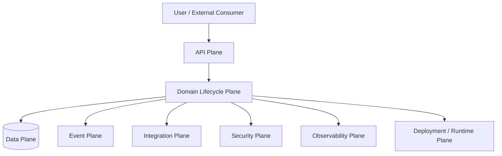

# Part 054 — Production Incident Thinking and Failure Modelling

## 1. Core thesis

Production incident thinking is the ability to ask, before and during a failure:

1. What exactly is failing?
2. What business process is affected?
3. What is the blast radius?
4. How do we know?
5. What can we stop, slow, bypass, roll back, or repair?
6. What data may now be inconsistent?
7. What must be communicated?
8. What must be prevented next time?

In Quote & Order systems, incidents are rarely just "service is down". They often look like:

- quote prices are wrong for a subset of customers;
- accepted quotes cannot convert to orders;
- order lifecycle events are delayed;
- catalog publish created invalid product combinations;
- approval rules are bypassed or over-triggered;
- duplicate orders were created;
- inventory snapshot is stale;
- downstream fulfillment rejected tasks;
- tenant-specific configuration broke one customer;
- data migration locked a hot table;
- observability cannot reconstruct what happened.

A principal-level engineer treats production as a state machine under stress.

---

## 2. Incident thinking vs debugging

Debugging asks:

> Why did this code fail?

Incident thinking asks:

> What customer/business process is currently unsafe, what can we do to contain damage, and what evidence do we need to recover correctly?

Debugging is necessary, but not sufficient.

During an incident, the first objective is not root cause. The first objective is to prevent further harm.

---

## 3. Failure model for Quote & Order

A useful failure model separates failures by affected plane.



### 3.1 API plane failures

Examples:

- endpoint unavailable;
- high latency;
- incompatible response;
- idempotency key ignored;
- status code regression;
- pagination broken;
- validation behavior changed.

Primary risk:

- consumers retry incorrectly;
- quote/order duplication;
- customer integration failure;
- degraded user workflow.

### 3.2 Domain lifecycle failures

Examples:

- illegal quote transition;
- order stuck in `VALIDATING`;
- approval bypass;
- order item state aggregation wrong;
- cancellation races with completion.

Primary risk:

- business state becomes untrustworthy.

### 3.3 Data plane failures

Examples:

- lock storm;
- migration failure;
- missing index;
- duplicate row;
- constraint too weak;
- data repair mistake;
- stale read model.

Primary risk:

- incorrect source of truth.

### 3.4 Event plane failures

Examples:

- Kafka consumer lag;
- poison message;
- duplicate event;
- out-of-order event;
- schema incompatibility;
- outbox relay stuck;
- replay created side effects.

Primary risk:

- asynchronous parts of business process diverge.

### 3.5 Integration plane failures

Examples:

- CRM timeout;
- billing rejects order;
- fulfillment adapter returns ambiguous error;
- inventory system stale;
- partner API throttles;
- callback lost.

Primary risk:

- the internal state and external reality diverge.

### 3.6 Security plane failures

Examples:

- tenant isolation bug;
- JWT validation regression;
- permission bypass;
- audit missing;
- admin override abuse;
- PII leakage in logs.

Primary risk:

- trust, compliance, and customer confidentiality.

### 3.7 Observability plane failures

Examples:

- missing correlation ID;
- logs dropped;
- high-cardinality metrics disabled;
- trace does not cross Kafka boundary;
- dashboard shows green while business flow is broken.

Primary risk:

- incident duration increases because reality is invisible.

### 3.8 Runtime/deployment plane failures

Examples:

- bad rollout;
- resource limit too low;
- JVM OOM;
- readiness probe wrong;
- GitOps drift;
- secret rotation failure;
- certificate expiry;
- node/pod disruption.

Primary risk:

- service instability and cascading failure.

---

## 4. Failure mode catalogue

### 4.1 Pricing incident

Symptoms:

- quote total differs from expected price;
- margin approval not triggered;
- customer-specific discount missing;
- quote accepted with stale price.

Questions:

- Which tenants/customers?
- Which catalog version?
- Which agreement version?
- Which quote state?
- Was repricing triggered?
- Did approval snapshot include price basis?
- Are wrong quotes already accepted?
- Did any wrong quotes convert to order?

Containment:

- disable quote acceptance for affected catalog/agreement/version;
- enable pricing kill switch if available;
- stop quote-to-order conversion for affected segment;
- notify support/sales operations;
- preserve audit and price calculation inputs.

Recovery:

- identify affected quotes;
- recalculate with correct inputs;
- mark impacted quotes for re-approval;
- repair audit trail with correction reason;
- verify no order/billing downstream impact.

### 4.2 Catalog publish incident

Symptoms:

- product offering cannot be configured;
- incompatible products can be selected;
- pricing missing;
- catalog lookup latency spikes;
- cache miss storm.

Questions:

- Which catalog version was published?
- Was publish atomic?
- Did all nodes receive invalidation?
- Are quotes using live catalog references?
- Are accepted quotes snapshot-safe?
- Did the publish change characteristic IDs or semantics?

Containment:

- roll back catalog publish if model supports it;
- block affected offerings;
- warm cache for critical offerings;
- disable affected customer-specific overlay.

Recovery:

- compare prior and current catalog version;
- revalidate affected draft quotes;
- keep accepted quote snapshot stable;
- repair only invalid draft/configurable artifacts.

### 4.3 Duplicate order incident

Symptoms:

- same quote creates multiple orders;
- same external request creates multiple product orders;
- downstream fulfillment sees duplicates.

Questions:

- Was idempotency key provided?
- Was unique constraint missing?
- Did retry happen after timeout?
- Did transaction commit but response fail?
- Did outbox publish duplicate events?
- Did downstream adapter accept duplicate command?

Containment:

- stop quote-to-order conversion if actively duplicating;
- enforce temporary guard at DB/API layer;
- disable automatic retry for affected path;
- pause downstream dispatch if duplicates propagate.

Recovery:

- choose canonical order;
- cancel/void duplicates through business workflow, not raw delete;
- reconcile downstream fulfillment;
- repair audit and customer-visible status;
- add idempotency evidence.

### 4.4 Order stuck incident

Symptoms:

- orders remain in `VALIDATING`, `DECOMPOSING`, `IN_PROGRESS`, or `CANCELLING`;
- no terminal state;
- order dashboard stale.

Questions:

- Is this state legitimately long-running?
- Which transition is missing?
- Is process manager alive?
- Is Kafka consumer lagging?
- Is callback lost?
- Is order blocked by fallout?
- Did a lock or transaction fail?

Containment:

- pause new work only if backlog is growing dangerously;
- prioritize stuck orders by customer/business impact;
- prevent repeated blind retries.

Recovery:

- resume from checkpoint;
- replay event only if consumer is idempotent;
- manually transition through approved operator path;
- create fallout task if human decision is needed;
- record correction evidence.

### 4.5 Kafka lag incident

Symptoms:

- lifecycle status delayed;
- outbox pending age grows;
- consumer lag age grows;
- downstream updates stale.

Questions:

- Is lag across all partitions or one hot partition?
- Is there a poison message?
- Did consumer rebalance repeatedly?
- Did schema change break consumer?
- Is DB slow inside consumer?
- Is downstream rate limiting?

Containment:

- pause or isolate poison partition/topic;
- scale consumers only if partition and downstream allow it;
- disable non-critical consumers;
- shed low-priority workload;
- protect downstream from retry storm.

Recovery:

- fix consumer defect;
- replay from safe offset;
- process DLQ with controlled tooling;
- verify idempotency before replay;
- reconcile affected aggregate states.

### 4.6 Database lock storm

Symptoms:

- API latency spike;
- transaction timeout;
- blocked sessions;
- migration stuck;
- deadlock errors;
- connection pool exhaustion.

Questions:

- Which query holds lock?
- Which table/index?
- Is migration running?
- Is batch/backfill running?
- Are transactions too long?
- Is retry storm creating more locks?

Containment:

- stop offending job/migration if safe;
- reduce traffic or disable affected operation;
- kill blocker only after understanding transaction effect;
- prevent retry amplification.

Recovery:

- identify incomplete transactions;
- verify outbox consistency;
- verify lifecycle state transitions;
- run targeted reconciliation;
- modify migration/query/index plan.

### 4.7 Tenant isolation incident

Symptoms:

- user sees another tenant's data;
- export includes wrong tenant rows;
- cache returns wrong tenant object;
- Kafka event consumed under wrong tenant context;
- support tool bypasses tenant filter.

Questions:

- Which tenant(s) are affected?
- Is exposure read-only or write-impacting?
- Was data modified cross-tenant?
- Is audit complete?
- Is cache contaminated?
- Are logs/exports affected?

Containment:

- disable affected endpoint/tool/export;
- invalidate affected caches;
- block risky background jobs;
- preserve evidence;
- involve security/compliance path.

Recovery:

- identify exposed/modified records;
- repair state if modified;
- rotate credentials if needed;
- notify according to policy;
- add tenant-boundary tests and DB constraints/guards.

---

## 5. Blast radius analysis

Blast radius answers:

> How far did this failure spread?

Analyze by dimensions:

| Dimension | Examples |
|---|---|
| Tenant | one tenant, multiple tenants, all tenants |
| Customer/account | one customer, one account hierarchy, all customers |
| Catalog version | one version, one offering, all offerings |
| Quote state | draft only, submitted, approved, accepted |
| Order state | captured, accepted, decomposed, in fulfillment |
| Time window | since deploy, since catalog publish, since migration |
| API consumer | UI only, partner API, batch job, downstream integration |
| Data type | price, approval, customer data, inventory, audit |
| Deployment | cloud, on-prem, one region, one customer environment |
| Security | no exposure, internal-only exposure, external exposure |

A good incident update names blast radius explicitly:

```text
Impact currently appears limited to Tenant A, catalog version 2026.07.08, quotes created after 10:23 UTC that include offering family Fiber-Enterprise. Accepted quotes before that time use snapshot price and are not affected based on current query evidence.
```

---

## 6. Detection hierarchy

Not all alerts are equal.

### 6.1 Symptom alerts

Best for paging.

Examples:

- order capture error rate above SLO;
- quote pricing p99 above threshold;
- order stuck age above threshold;
- fallout creation rate spike;
- accepted quote to order conversion failure;
- cross-tenant authorization denial anomaly;
- outbox pending age above threshold.

### 6.2 Cause alerts

Useful for diagnosis but not always paging.

Examples:

- DB CPU high;
- Kafka lag high;
- pod restart count high;
- cache hit ratio low;
- downstream timeout rate high.

### 6.3 Weak alerts

Often noisy if used alone.

Examples:

- "service returned 500 once";
- "CPU > 80% for one minute";
- "Kafka lag record count high" without age/context;
- "one pod restarted".

A strong alert says what is broken for a business process.

---

## 7. Mitigation hierarchy

During incident, choose the least risky action that stops harm.

### 7.1 Stop the bleeding

Options:

- disable affected feature flag;
- block affected endpoint;
- pause quote acceptance;
- pause quote-to-order conversion;
- pause outbox relay for a topic;
- pause specific Kafka consumer group;
- disable affected catalog offering;
- stop backfill/migration;
- reduce traffic;
- activate maintenance mode for one tenant.

### 7.2 Reduce load

Options:

- rate limit;
- drop non-critical requests;
- stop reconciliation/export jobs;
- pause low-priority consumers;
- increase timeout only if it reduces failure, not if it hides saturation;
- scale only if bottleneck is scalable.

### 7.3 Roll back

Rollback is good when:

- data model remains compatible;
- no irreversible side effects happened;
- old version can process new data;
- migration did not contract schema;
- downstream contract did not change irreversibly.

Rollback is risky when:

- data migration changed semantics;
- external systems already processed commands;
- event schema evolved incompatibly;
- duplicate side effects were emitted;
- feature flag/config changed data shape.

### 7.4 Roll forward

Roll forward is good when:

- root cause is understood;
- patch is small and targeted;
- rollback would worsen data compatibility;
- mitigation already stops new damage.

### 7.5 Repair

Repair is necessary when:

- data is inconsistent;
- duplicate order exists;
- missing lifecycle event exists;
- audit evidence needs correction record;
- external system state diverges.

Repair must be scripted, reviewed, logged, and reversible where possible.

---

## 8. Incident timeline model

Build timeline from facts.

```text
T0 deploy/catalog publish/migration/config change
T1 first anomalous metric/log/event
T2 first customer/user impact
T3 alert fired
T4 incident declared
T5 mitigation applied
T6 impact stopped
T7 backlog drained/repaired
T8 full recovery
T9 postmortem completed
```

For Quote & Order, also capture:

- first affected quote ID;
- first affected order ID;
- catalog version;
- tenant/customer;
- first Kafka offset;
- migration version;
- feature flag/config version;
- first downstream error.

Timeline is evidence, not storytelling.

---

## 9. Data correctness during incident

After mitigating availability issues, ask:

1. Did any quote receive wrong price?
2. Did any quote enter wrong state?
3. Did any approval get skipped or over-triggered?
4. Did any order get duplicated?
5. Did any order item enter impossible state?
6. Did any event publish without DB commit?
7. Did any DB commit happen without event publish?
8. Did any downstream command produce unknown outcome?
9. Did any tenant data cross boundary?
10. Did audit evidence capture what happened?

This is where enterprise systems differ from simple stateless APIs. Recovery often requires data reasoning.

---

## 10. Reconciliation after incident

Reconciliation compares independent sources of truth or expected state.

Examples:

### 10.1 Quote-to-order reconciliation

```sql
-- Illustrative only. Verify internal schema.
SELECT q.id AS quote_id, q.state, COUNT(o.id) AS order_count
FROM quote q
LEFT JOIN product_order o ON o.source_quote_id = q.id
WHERE q.state = 'ACCEPTED'
  AND q.accepted_at >= :incident_start
  AND q.accepted_at < :incident_end
GROUP BY q.id, q.state
HAVING COUNT(o.id) <> 1;
```

### 10.2 Outbox reconciliation

```sql
SELECT aggregate_type, aggregate_id, event_type, status, created_at, published_at
FROM outbox_event
WHERE created_at >= :incident_start
  AND created_at < :incident_end
  AND status <> 'PUBLISHED';
```

### 10.3 Stuck order reconciliation

```sql
SELECT id, state, updated_at
FROM product_order
WHERE state IN ('VALIDATING', 'DECOMPOSING', 'IN_PROGRESS', 'CANCELLING')
  AND updated_at < now() - interval '2 hours';
```

### 10.4 Duplicate idempotency reconciliation

```sql
SELECT tenant_id, idempotency_key, COUNT(*)
FROM product_order
WHERE created_at >= :incident_start
GROUP BY tenant_id, idempotency_key
HAVING COUNT(*) > 1;
```

These queries are patterns, not assumed internal schema.

---

## 11. Runbook structure

A good runbook is executable under stress.

```md
# Runbook: <incident type>

## Symptoms
- ...

## Severity criteria
- ...

## Dashboards
- ...

## Immediate containment
1. ...
2. ...

## Diagnosis checklist
- ...

## Data safety checks
- ...

## Mitigation options
- Option A: ...
- Option B: ...

## Recovery steps
- ...

## Verification queries
- ...

## Communication template
- ...

## Escalation
- ...

## Rollback / roll-forward criteria
- ...

## Post-incident follow-up
- ...
```

Bad runbook:

```text
Investigate logs and fix issue.
```

---

## 12. Communication during incident

Good incident communication is precise and bounded.

### 12.1 Bad update

```text
We are seeing some issues with orders. Investigating.
```

### 12.2 Better update

```text
We are investigating elevated order conversion failures for Tenant A starting 2026-07-08 10:23 UTC. Current evidence indicates quote creation and draft editing are unaffected. We have temporarily disabled quote-to-order conversion for the affected tenant to prevent duplicate or partial orders. Next update will include affected order count and recovery plan.
```

A good update includes:

- what is affected;
- what is not affected if known;
- when it started;
- what containment is active;
- what risk remains;
- what evidence is still missing.

---

## 13. Postmortem thinking

A postmortem should not be a blame document.

It should answer:

1. What happened?
2. What was the customer/business impact?
3. Why did detection happen when it did?
4. Why did mitigation take that long?
5. What assumptions failed?
6. What safeguards worked?
7. What safeguards were missing?
8. What data was repaired?
9. What follow-up actions reduce recurrence or blast radius?
10. Who owns each action?

Google SRE's postmortem culture emphasizes that postmortems for significant incidents are learning opportunities and should focus on contributing causes rather than blaming individuals.

### 13.1 Weak action items

- "Be more careful."
- "Improve monitoring."
- "Add tests."
- "Review code better."

### 13.2 Strong action items

- "Add unique constraint on `(tenant_id, idempotency_key)` for product orders by 2026-07-15."
- "Add alert when accepted quote has zero or more than one linked order for more than 5 minutes."
- "Add contract test for `OrderAccepted` event schema compatibility."
- "Add feature flag to disable quote-to-order conversion per tenant."
- "Add runbook for duplicate order reconciliation and cancellation."

Strong actions are specific, owned, verifiable, and tied to failure mode.

---

## 14. Failure modelling before release

For every design, ask:

### 14.1 What can fail?

- API request timeout;
- DB transaction commit unknown to client;
- outbox relay crash;
- Kafka duplicate;
- Kafka event out of order;
- consumer poison message;
- downstream timeout;
- downstream accepted command but response lost;
- catalog cache stale;
- approval authority stale;
- migration partially applied;
- feature flag wrong for tenant;
- Kubernetes pod killed mid-processing;
- secret/certificate expired.

### 14.2 How will we know?

- metric;
- log;
- trace;
- audit event;
- reconciliation query;
- dashboard;
- customer support signal;
- alert.

### 14.3 How do we stop damage?

- feature flag;
- kill switch;
- per-tenant disablement;
- pause consumer;
- rate limit;
- rollback;
- block state transition;
- stop job;
- circuit breaker.

### 14.4 How do we recover?

- replay;
- retry;
- resume from checkpoint;
- compensate;
- cancel duplicate;
- repair data;
- re-run validation;
- reissue event;
- manual fallout.

### 14.5 How do we prove recovery?

- reconciliation query returns clean;
- state counts expected;
- outbox empty/healthy;
- Kafka lag drained;
- affected quotes/orders verified;
- audit correction exists;
- customer-facing status matches internal state.

---

## 15. Game day scenarios

### Scenario A — Wrong price after catalog publish

Inject:

- new catalog version changes price rule;
- cache invalidation fails on one service instance.

Expected detection:

- pricing mismatch metric;
- increased quote approval anomalies;
- catalog version mismatch log.

Expected mitigation:

- disable affected offering/version;
- stop acceptance/conversion for affected quotes;
- invalidate/warm cache.

Expected recovery:

- identify affected draft/submitted/accepted quotes;
- reprice where safe;
- require re-approval if commercial commitment changed.

### Scenario B — Duplicate order from retry after timeout

Inject:

- quote-to-order API commits DB but response times out;
- client retries without effective idempotency guard.

Expected detection:

- duplicate source quote to order count;
- idempotency conflict missing;
- downstream duplicate fulfillment command.

Expected mitigation:

- block conversion;
- add temporary DB guard if possible;
- pause downstream dispatch for duplicates.

Expected recovery:

- choose canonical order;
- cancel duplicate through business workflow;
- reconcile downstream.

### Scenario C — Kafka poison message blocks order lifecycle

Inject:

- one malformed event causes consumer crash in same partition.

Expected detection:

- consumer lag age grows for one partition;
- repeated error for same offset;
- downstream status stale.

Expected mitigation:

- isolate to DLQ/manual quarantine;
- deploy parser fix;
- resume consumer.

Expected recovery:

- replay safe events;
- process quarantined event manually;
- reconcile order state.

### Scenario D — Migration locks order table

Inject:

- migration runs `ALTER TABLE` on hot table during business hours.

Expected detection:

- DB lock wait;
- API latency spike;
- connection pool exhaustion.

Expected mitigation:

- stop migration if safe;
- reduce traffic/retries;
- kill blocker only with DBA/owner decision.

Expected recovery:

- verify transaction state;
- rerun migration with expand-contract/concurrent strategy.

### Scenario E — Tenant leakage via cache key

Inject:

- cache key omits tenant ID for customer/account lookup.

Expected detection:

- cross-tenant data anomaly;
- authorization mismatch;
- unusual audit query.

Expected mitigation:

- disable cache/endpoint;
- invalidate cache;
- involve security/compliance.

Expected recovery:

- identify exposed data;
- repair modified records if any;
- follow incident/security policy;
- add test and cache key invariant.

---

## 16. Internal verification checklist

### Incident process

- Where are incident runbooks stored?
- How is severity defined?
- Who declares an incident?
- Who is incident commander?
- What is escalation path?
- What is customer communication path?
- How are on-prem incidents handled?

### Observability

- Where are Quote & Order dashboards?
- Is there quote-to-order conversion dashboard?
- Is there order stuck dashboard?
- Is there Kafka lag age dashboard?
- Is outbox pending age tracked?
- Are correlation/causation IDs searchable?

### Historical evidence

- Where are postmortems?
- What were the last five relevant incidents?
- What recurring failure modes exist?
- Which alerts were noisy?
- Which alerts detected real issues?
- Which incidents required data repair?

### Recovery tooling

- Is there replay tooling?
- Is there DLQ processing tooling?
- Is there data repair framework?
- Is there reconciliation report?
- Is there operator UI for fallout?
- Is there per-tenant kill switch?

### Release safety

- What release caused previous incidents?
- Are operational readiness reviews required?
- Are migration reviews required?
- Are feature flags required for risky behavior?
- Is rollback tested?
- Is roll-forward expected instead?

### Security/compliance

- What is incident process for tenant data exposure?
- What is PII logging policy?
- Who approves audit corrections?
- How are customer notifications handled?
- What legal/compliance evidence must be preserved?

---

## 17. Architecture review checklist

For every design proposal, ask:

### Failure identification

- What are the top five failure modes?
- Which are user-visible?
- Which are financially dangerous?
- Which are security/compliance dangerous?
- Which are silent?

### Detection

- What metric/log/trace/audit proves each failure?
- Is there a dashboard?
- Is there an alert?
- Is there a reconciliation query?
- Can support detect it?

### Containment

- Can this feature be disabled per tenant?
- Can the consumer be paused safely?
- Can the workflow stop before downstream side effects?
- Is there a kill switch?
- What is the blast radius?

### Recovery

- Can we retry safely?
- Can we replay safely?
- Can we resume from checkpoint?
- Can we compensate?
- Can we repair data?
- Can we prove repair?

### Operational ownership

- Who owns the runbook?
- Who responds to alerts?
- Who approves data repair?
- Who communicates with customer/support?
- Who owns follow-up actions?

If a design has no recovery story, it is not production-ready.

---

## 18. PR review checklist

For production-risk changes, ask:

### State and data

- Does this change introduce new lifecycle states?
- Are illegal states prevented?
- Is audit updated?
- Are corrections/retries idempotent?
- Does migration support rollback/roll-forward?
- Are data repair queries needed?

### Async/event

- Can emitted events be duplicated?
- Can consumers handle replay?
- Is schema evolution compatible?
- Is DLQ behavior defined?
- Does lag affect business correctness?

### Integration

- What happens if downstream times out?
- What happens if downstream succeeds but response is lost?
- Is unknown outcome represented?
- Is reconciliation available?

### Security

- Is tenant boundary preserved?
- Is authorization checked at transition?
- Is audit sufficient?
- Are logs redacted?

### Operations

- Are metrics/logs/traces added?
- Is there an alert or dashboard update?
- Is there a kill switch?
- Is there a runbook update?
- Is blast radius documented?

---

## 19. Practical exercise

Choose one internal incident, near miss, or risky design. Write a failure model.

```md
# Failure Model: <system/change>

## Business process
...

## Failure modes
| Failure | Customer impact | Detection | Containment | Recovery |
|---|---|---|---|---|

## Blast radius
...

## Data correctness risks
...

## Required observability
...

## Required runbook
...

## Open questions
...

## Follow-up actions
...
```

If no historical incident is accessible yet, model this hypothetical:

> Quote accepted successfully, order creation times out, client retries, two product orders are created, one downstream fulfillment task is already submitted.

Answer:

1. How do you detect duplicate?
2. What do you stop?
3. Which order is canonical?
4. How do you cancel/void duplicate?
5. How do you reconcile downstream?
6. How do you repair audit?
7. What prevention belongs in API, DB, Kafka, and tests?

---

## 20. Senior mental model

A junior incident response often says:

> "The service failed. We restarted it."

A senior response says:

> "The order conversion workflow became unsafe for Tenant A after deployment X. We disabled conversion for the affected tenant, verified draft quote editing is unaffected, identified 37 accepted quotes in the risk window, found 2 duplicate product orders, selected canonical orders based on first committed idempotency record, cancelled duplicates through business workflow, reconciled downstream fulfillment, added a DB unique constraint and alert, and documented the failure mode."

Production maturity is not the absence of incidents. It is the ability to contain, understand, repair, and prevent them with evidence.

---

## 21. Source notes

- Google SRE material is used for general industry guidance on cascading failure, overload, service best practices, and blameless postmortem culture.
- PostgreSQL, Kafka, Kubernetes, OAuth/JWT, and TM Forum behavior must be verified against the specific versions and internal usage patterns in CSG environments.
- Any incident, security, compliance, customer communication, or data repair process must follow internal CSG policy. This material is an engineering learning aid, not a replacement for internal procedure.
