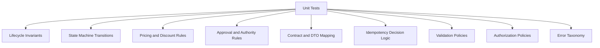

# Part 055 — Unit Testing Domain Logic and Lifecycle Invariants

## 1. Source notes and scope boundary

This part uses public testing concepts and public Java ecosystem references. It does not assume any internal CSG testing framework, package structure, naming convention, or CI gate.

Public references to verify independently:

- JUnit documentation describes JUnit as comprehensive reference documentation for programmers writing tests, extension authors, and build-tool/IDE vendors.
- JUnit Jupiter supports core testing features such as test methods, parameterized tests, nested tests, lifecycle callbacks, assertions, assumptions, and extensions.
- The specific versions used internally must be verified in the codebase and build files.

Everything about the actual Quote & Order test suite, helper libraries, naming conventions, fixture strategy, coverage requirements, and CI enforcement must be verified internally.

---

## 2. Core thesis

In an enterprise Quote & Order system, unit tests are not primarily about "does this method return the expected value".

They are executable business specifications for invariants such as:

- a quote cannot be accepted with stale pricing;
- an approved quote cannot be mutated without invalidating approval;
- an order cannot move to fulfillment before validation and decomposition complete;
- a cancellation cannot erase the historical order record;
- a retry cannot create a second business side effect;
- a user cannot perform a state transition without authority;
- a discount cannot bypass margin guardrails;
- a quote generated from catalog version `v1` must remain explainable even after catalog version `v2` is published.

A good unit test suite gives engineers confidence to change code without breaking business truth.

A weak unit test suite gives false confidence because it only tests happy-path mechanics.

---

## 3. What "unit" means in this context

A unit is not always a single Java class.

For domain-heavy enterprise systems, a useful unit is the smallest boundary that can enforce a meaningful rule without external infrastructure.

Good units:

- aggregate methods;
- state transition guards;
- domain services with pure dependencies;
- pricing rule evaluators;
- approval rule evaluators;
- validation policies;
- command handlers with mocked ports;
- mappers between internal domain objects and external DTOs, if mapping contains business semantics;
- authorization policy objects;
- idempotency decision logic;
- lifecycle aggregation logic.

Poor units:

- private helper methods tested indirectly through brittle reflection;
- controller methods with no business logic;
- MyBatis mapper SQL tested with mocks instead of PostgreSQL;
- Kafka consumers tested only by mocking the consumer framework;
- tests that only assert a method was called but not the business outcome;
- tests that assert the implementation shape rather than the observable domain rule.

A unit test should usually avoid real PostgreSQL, Kafka, HTTP, Kubernetes, and external systems. Those belong in integration/contract/E2E tests.

But a unit test should not avoid the domain.

---

## 4. The senior engineer testing question

For each business rule, ask:

> If this rule breaks in production, would we lose money, create invalid orders, violate customer contract, break fulfillment, or lose audit defensibility?

If yes, it deserves explicit tests.

Do not rely on incidental coverage.

A lifecycle invariant is too important to be protected only because some controller test happens to exercise it.

---

## 5. Test categories for Quote & Order domain logic



### 5.1 Invariant tests

Invariant tests verify that illegal business states cannot be produced.

Examples:

- accepted quote cannot change line items;
- expired quote cannot be converted to order;
- order total must equal sum of active order item charges;
- quote item cannot reference unavailable product offering;
- approval snapshot must match accepted commercial terms;
- tenant ID must remain stable across command handling;
- order item terminal state cannot regress to in-progress.

### 5.2 State transition tests

State transition tests verify allowed and forbidden movements.

Examples:

- `DRAFT -> PENDING_APPROVAL` allowed when quote is configured and priced;
- `PENDING_APPROVAL -> ACCEPTED` forbidden without approval;
- `ACCEPTED -> DRAFT` forbidden;
- `ORDERED -> CANCELLED` may be forbidden or may require cancellation workflow depending on domain model;
- `FULFILLING -> COMPLETED` allowed only when all required order items are terminal success.

### 5.3 Pricing and discount tests

Pricing tests must cover more than arithmetic.

They must cover:

- recurring vs non-recurring charge;
- contract-specific price override;
- bundle discount;
- discount precedence;
- discount stacking rule;
- effective date;
- currency and rounding;
- tax/external charge boundary if relevant;
- margin threshold;
- approval trigger;
- repricing invalidation.

### 5.4 Approval rule tests

Approval tests protect revenue and governance.

They should verify:

- who can approve;
- what they can approve;
- when approval is required;
- what changes invalidate approval;
- whether self-approval is prohibited;
- whether approval authority is tenant/account/product/category/amount-specific;
- whether approval snapshot is preserved.

### 5.5 Idempotency decision tests

Idempotency tests protect against duplicate side effects.

They should verify:

- same command ID returns same result;
- same natural business key cannot create duplicate order;
- duplicate event is ignored or safely acknowledged;
- changed payload under same idempotency key is rejected;
- retry after unknown outcome resumes instead of repeating side effects.

### 5.6 Authorization policy tests

Authorization tests must be negative-heavy.

They should verify:

- missing role denied;
- wrong tenant denied;
- wrong account scope denied;
- stale permission denied;
- admin override audited;
- service token cannot perform user-only transition;
- maker cannot approve own quote when segregation of duties applies.

---

## 6. Test names as business documentation

A good test name explains the rule.

Weak:

```java
@Test
void testApproveQuote() {}
```

Better:

```java
@Test
void approvalFailsWhenApproverLimitIsBelowDiscountedQuoteTotal() {}
```

Better still when using nested structure:

```java
@Nested
class AcceptQuote {

    @Test
    void rejectsAcceptedQuoteWhenPricingSnapshotIsStale() {}

    @Test
    void rejectsAcceptedQuoteWhenRequiredApprovalIsMissing() {}

    @Test
    void acceptsQuoteWhenCommercialTermsAreCurrentAndApprovalIsValid() {}
}
```

The test name should survive refactoring.

It should describe business behavior, not implementation details.

---

## 7. Arrange, Act, Assert for domain-heavy tests

The AAA structure is useful, but for domain tests the arrangement must be meaningful.

```java
@Test
void acceptingQuoteWithStalePricingIsRejected() {
    // Arrange
    Quote quote = QuoteFixture.approvedFiberBundleQuote()
        .withPricingSnapshotVersion("price-v1")
        .withCatalogVersion("catalog-v7")
        .build();

    PriceVersion currentPriceVersion = PriceVersion.of("price-v2");

    // Act
    DomainException error = assertThrows(
        DomainException.class,
        () -> quote.accept(new AcceptQuoteCommand(currentPriceVersion, actor()))
    );

    // Assert
    assertThat(error.code()).isEqualTo("QUOTE_PRICING_STALE");
    assertThat(quote.state()).isEqualTo(QuoteState.APPROVED);
    assertThat(quote.auditEvents()).isEmpty();
}
```

Important properties:

- the fixture tells a domain story;
- the command includes relevant context;
- the assertion verifies state did not mutate;
- the error code is domain-level;
- side effects are not accidentally emitted.

---

## 8. State machine tests

A state machine should not be tested by a few happy paths.

It should be tested as a transition matrix.

### 8.1 Transition matrix mindset

For every transition, define:

- source state;
- command/action;
- actor;
- required preconditions;
- expected target state;
- emitted domain event;
- audit event;
- forbidden states;
- idempotent duplicate behavior.

Example quote transition matrix:

| Current state | Command | Allowed? | Result | Important guard |
|---|---:|---:|---|---|
| `DRAFT` | `submitForApproval` | yes | `PENDING_APPROVAL` | quote priced and valid |
| `DRAFT` | `accept` | no | unchanged | approval missing |
| `APPROVED` | `accept` | yes | `ACCEPTED` | price not stale |
| `APPROVED` | `changeItem` | yes | `DRAFT` or `REQUIRES_REPRICE` | approval invalidated |
| `ACCEPTED` | `changeItem` | no | unchanged | accepted quote locked |
| `EXPIRED` | `accept` | no | unchanged | expired commercial offer |
| `ORDERED` | `accept` | idempotent or no-op | unchanged | already converted |

### 8.2 Parameterized transition tests

```java
@ParameterizedTest(name = "{0} + accept -> rejected with {1}")
@MethodSource("statesThatCannotBeAccepted")
void rejectsAcceptFromInvalidStates(QuoteState state, String expectedCode) {
    Quote quote = QuoteFixture.quoteInState(state).build();

    DomainException error = assertThrows(
        DomainException.class,
        () -> quote.accept(validAcceptCommand())
    );

    assertThat(error.code()).isEqualTo(expectedCode);
    assertThat(quote.state()).isEqualTo(state);
}

static Stream<Arguments> statesThatCannotBeAccepted() {
    return Stream.of(
        arguments(QuoteState.DRAFT, "QUOTE_NOT_APPROVED"),
        arguments(QuoteState.EXPIRED, "QUOTE_EXPIRED"),
        arguments(QuoteState.REJECTED, "QUOTE_REJECTED"),
        arguments(QuoteState.CANCELLED, "QUOTE_CANCELLED")
    );
}
```

Parameterized tests are powerful when they describe a real decision table.

They are harmful when they hide business intent behind generic data blobs.

---

## 9. Testing lifecycle invariants explicitly

Lifecycle invariants are rules that must hold before and after every command.

Examples:

```java
@Test
void convertedQuoteKeepsAcceptedSnapshotAndOrderReference() {
    Quote quote = QuoteFixture.acceptedQuote()
        .withPricingSnapshot("price-snapshot-123")
        .build();

    OrderId orderId = quote.markOrdered(commandWithOrderId("order-999"));

    assertThat(quote.state()).isEqualTo(QuoteState.ORDERED);
    assertThat(quote.orderId()).contains(orderId);
    assertThat(quote.pricingSnapshotId()).isEqualTo("price-snapshot-123");
    assertThat(quote.canBeMutated()).isFalse();
}
```

The test should not only assert the target state.

It should assert the invariant that matters after the transition.

---

## 10. Testing negative paths as first-class behavior

In enterprise systems, negative paths are often more important than happy paths.

A good suite should contain tests such as:

- cannot submit quote without required customer account;
- cannot price quote against inactive catalog version;
- cannot approve quote when approval limit is lower than discount impact;
- cannot convert quote twice;
- cannot cancel completed fulfillment without compensation path;
- cannot process event from different tenant;
- cannot update order item after terminal state;
- cannot apply discount to product category excluded by agreement;
- cannot accept quote after expiry even if approval exists.

Negative tests protect against permissive code.

Permissive code is dangerous in CPQ/order systems because it creates invalid commitments.

---

## 11. Test data builders and fixtures

Domain tests need expressive setup.

Avoid huge JSON fixtures for unit tests unless the JSON shape itself is being tested.

Prefer builders that speak domain language.

```java
Quote quote = QuoteFixture.enterpriseFiberQuote()
    .forTenant("telco-a")
    .forCustomer("customer-123")
    .withAgreement("agreement-gold-2026")
    .withCatalogVersion("catalog-v12")
    .withRecurringCharge("USD", "1200.00")
    .withDiscountPercent("15")
    .requiringApproval("MARGIN_GUARDRAIL")
    .approvedBy("finance-manager")
    .build();
```

The builder should make valid defaults easy and invalid cases explicit.

Bad fixture design creates hidden assumptions.

### 11.1 Fixture principles

A good fixture:

- produces valid domain objects by default;
- names business intent;
- avoids irrelevant fields;
- makes tenant/customer/catalog/price context visible;
- avoids random values unless randomness is controlled;
- does not depend on wall-clock time;
- does not reuse mutable global objects;
- allows precise invalid variants.

A bad fixture:

- creates half-valid objects;
- hides required domain context;
- uses global mutable state;
- relies on current date/time;
- makes every test inspect a thousand-line JSON document;
- couples tests to persistence schema.

---

## 12. Deterministic time, IDs, and money

Quote/order systems depend heavily on time and money.

Do not let tests depend on the real clock.

Use injected `Clock` or equivalent.

```java
Clock fixedClock = Clock.fixed(
    Instant.parse("2026-07-08T00:00:00Z"),
    ZoneOffset.UTC
);
```

Test cases should cover:

- quote expiry at boundary time;
- catalog effective date;
- agreement start/end date;
- price version effective date;
- approval expiry;
- cancellation window;
- retry timeout;
- order due date calculation.

For money:

- use `BigDecimal`, not `double`;
- assert scale and rounding where business-relevant;
- test currency mismatch;
- test zero/negative charges if allowed or forbidden;
- test discount precision;
- test boundary values around approval thresholds.

Example:

```java
@Test
void discountAtApprovalThresholdDoesNotRequireApprovalButAboveThresholdDoes() {
    ApprovalPolicy policy = ApprovalPolicyFixture.standardMarginPolicy()
        .thresholdPercent(new BigDecimal("20.00"));

    assertThat(policy.requiresApproval(discount("20.00"))).isFalse();
    assertThat(policy.requiresApproval(discount("20.01"))).isTrue();
}
```

Boundary tests matter because financial rules often fail at edges.

---

## 13. Testing pricing rules

Pricing logic should be tested as a pipeline of commercial facts.

Typical dimensions:

- catalog base price;
- agreement override;
- customer-specific price;
- quantity tier;
- bundle discount;
- promotional discount;
- manual sales discount;
- approval limit;
- margin threshold;
- currency;
- rounding;
- effective date.

### 13.1 Example decision table

| Case | Base price | Agreement override | Manual discount | Expected approval |
|---|---:|---:|---:|---|
| Standard price | 1000 | none | 0% | no |
| Agreement override | 1000 | 900 | 0% | no |
| Sales discount under limit | 1000 | none | 5% | no |
| Sales discount over limit | 1000 | none | 25% | yes |
| Margin violation | 1000 | none | 40% | yes/block |

### 13.2 What to assert

A pricing test should assert:

- final price;
- pricing explanation;
- applied price components;
- rejected price components;
- required approval reason;
- snapshot version;
- deterministic ordering of pricing adjustments where relevant.

Do not only assert `finalPrice == 900`.

That can hide a wrong calculation that happens to produce the same number.

---

## 14. Testing approval invalidation

Approval is valid only for the commercial facts it approved.

Tests should verify that approval is invalidated by changes such as:

- added quote item;
- removed quote item;
- changed quantity;
- changed discount;
- changed contract term;
- changed customer account;
- changed effective date;
- changed product offering;
- changed price version;
- changed approval-relevant metadata.

Example:

```java
@Test
void changingDiscountAfterApprovalInvalidatesApproval() {
    Quote quote = QuoteFixture.approvedQuote()
        .withDiscountPercent("10")
        .withApprovalSnapshotHash("hash-10-percent")
        .build();

    quote.changeDiscount(quoteItemId(), new BigDecimal("12.5"), salesActor());

    assertThat(quote.state()).isEqualTo(QuoteState.DRAFT);
    assertThat(quote.approvalStatus()).isEqualTo(ApprovalStatus.INVALIDATED);
    assertThat(quote.domainEvents())
        .extracting(DomainEvent::type)
        .contains("QuoteApprovalInvalidated");
}
```

The point is not merely that the quote changed.

The point is that governance changed.

---

## 15. Testing authorization as policy, not annotation trivia

A controller annotation test is not enough.

For business-sensitive actions, create policy tests.

```java
@Test
void salesRepCannotApproveOwnHighDiscountQuote() {
    ApprovalPolicy policy = ApprovalPolicyFixture.enterprisePolicy();

    ApprovalDecision decision = policy.canApprove(
        QuoteFixture.pendingApprovalQuote()
            .createdBy("sales-rep-1")
            .withDiscountPercent("30")
            .build(),
        ActorFixture.salesRep("sales-rep-1")
    );

    assertThat(decision.allowed()).isFalse();
    assertThat(decision.reasonCode()).isEqualTo("SEGREGATION_OF_DUTIES");
}
```

Authorization tests should preserve domain vocabulary:

- actor;
- authority;
- scope;
- tenant;
- account;
- action;
- resource state;
- approval amount;
- audit consequence.

---

## 16. Testing idempotency logic

Idempotency is often implemented partly in infrastructure, but the decision can be unit-tested.

Example decision object:

```java
record IdempotencyDecision(
    boolean executeCommand,
    boolean returnExistingResult,
    boolean rejectConflict,
    String reason
) {}
```

Test cases:

```java
@Test
void sameKeyAndSamePayloadReturnsExistingResult() {
    IdempotencyDecision decision = policy.decide(
        existingRecord("key-123", payloadHash("A"), completedResult("order-1")),
        incomingCommand("key-123", payloadHash("A"))
    );

    assertThat(decision.returnExistingResult()).isTrue();
    assertThat(decision.executeCommand()).isFalse();
}

@Test
void sameKeyWithDifferentPayloadIsRejected() {
    IdempotencyDecision decision = policy.decide(
        existingRecord("key-123", payloadHash("A"), completedResult("order-1")),
        incomingCommand("key-123", payloadHash("B"))
    );

    assertThat(decision.rejectConflict()).isTrue();
    assertThat(decision.reason()).isEqualTo("IDEMPOTENCY_KEY_REUSED_WITH_DIFFERENT_PAYLOAD");
}
```

This is cheaper and clearer than only discovering the behavior in integration tests.

---

## 17. Testing event emission from domain commands

Domain commands often emit events.

A unit test should verify event semantics without requiring Kafka.

```java
@Test
void acceptingQuoteEmitsQuoteAcceptedEventWithCausationMetadata() {
    Quote quote = QuoteFixture.approvedQuote().build();
    CommandContext context = CommandContextFixture
        .withCorrelationId("corr-123")
        .withCommandId("cmd-456")
        .actor("sales-user-1")
        .build();

    quote.accept(validAcceptCommand(context));

    assertThat(quote.domainEvents()).singleElement().satisfies(event -> {
        assertThat(event.type()).isEqualTo("QuoteAccepted");
        assertThat(event.aggregateId()).isEqualTo(quote.id());
        assertThat(event.correlationId()).isEqualTo("corr-123");
        assertThat(event.causationId()).isEqualTo("cmd-456");
        assertThat(event.tenantId()).isEqualTo(quote.tenantId());
    });
}
```

The test should not assert Kafka topic, partition, producer config, or serialization.

Those belong elsewhere.

---

## 18. Testing error taxonomy

Enterprise APIs need stable error semantics.

Unit tests should verify domain exceptions produce stable error codes.

```java
@Test
void expiredQuoteCannotBeAcceptedAndReturnsStableErrorCode() {
    Quote quote = QuoteFixture.expiredQuote().build();

    DomainException error = assertThrows(
        DomainException.class,
        () -> quote.accept(validAcceptCommand())
    );

    assertThat(error.code()).isEqualTo("QUOTE_EXPIRED");
    assertThat(error.category()).isEqualTo(ErrorCategory.BUSINESS_RULE_VIOLATION);
    assertThat(error.retryable()).isFalse();
}
```

Why this matters:

- UI may depend on the code;
- partner integration may depend on the code;
- support runbooks may depend on the code;
- alerting may classify errors by category;
- retry logic may depend on retryability.

Changing error code can be a breaking contract.

---

## 19. Mocking discipline

Mocks are useful at boundaries.

They are dangerous inside the domain.

Good mocks:

- external price provider port;
- customer lookup port;
- inventory lookup port;
- approval service port;
- clock;
- ID generator;
- authorization context;
- event publisher interface if testing command handler behavior.

Suspicious mocks:

- aggregate root;
- value object;
- state machine;
- pricing calculation object;
- mapper from domain to domain;
- simple collection;
- every dependency just because mocking framework makes it easy.

A mock-heavy domain test often proves that the mock setup matches itself.

Prefer real domain objects with lightweight fake ports.

---

## 20. Command handler unit tests

A command handler is a useful unit when it coordinates domain object + ports but does not require real infrastructure.

Example shape:

```java
class AcceptQuoteHandler {
    private final QuoteRepository quoteRepository;
    private final PricingVersionPort pricingVersionPort;
    private final AuthorizationPolicy authorizationPolicy;
    private final EventCollector eventCollector;

    AcceptQuoteResult handle(AcceptQuoteCommand command) {
        Quote quote = quoteRepository.findForUpdate(command.quoteId());
        PriceVersion currentVersion = pricingVersionPort.currentVersion(quote.catalogVersion());
        authorizationPolicy.assertCanAccept(command.actor(), quote);
        quote.accept(command.withCurrentPriceVersion(currentVersion));
        quoteRepository.save(quote);
        eventCollector.collect(quote.pullDomainEvents());
        return AcceptQuoteResult.accepted(quote.id());
    }
}
```

Unit tests should verify orchestration decisions:

- loads aggregate;
- checks authorization before mutation;
- passes current price version;
- saves only after successful domain command;
- collects domain events only on success;
- does not publish directly before transaction commit;
- maps domain errors to application errors.

Do not assert every method call unless call order is business-critical.

---

## 21. Avoiding brittle tests

Brittle tests fail when implementation changes but behavior remains correct.

Common causes:

- asserting exact private method sequence;
- asserting full serialized JSON for a domain unit;
- overusing mocks;
- using random data without controlling seed;
- comparing timestamps generated from real clock;
- depending on collection order when order is not part of contract;
- hardcoding irrelevant IDs;
- asserting messages instead of stable error codes;
- mixing many business rules in one test.

A test should fail when business behavior changes.

It should not fail because a local variable was renamed.

---

## 22. Coverage is a weak proxy

High coverage does not prove correctness.

A suite can have high line coverage but miss:

- boundary discounts;
- invalid state transitions;
- stale price acceptance;
- double conversion;
- tenant leakage;
- authorization bypass;
- event duplication;
- expiry boundary;
- rounding errors;
- terminal state regression.

Coverage is useful as a visibility tool.

It is not a quality guarantee.

A senior engineer reviews missing scenarios, not just coverage numbers.

---

## 23. Mutation testing mindset

Mutation testing asks:

> If a condition is inverted or an arithmetic operator changes, do tests fail?

Even if the team does not use a mutation testing tool, think this way during review.

For example, would tests fail if:

- `>` becomes `>=` in approval threshold logic?
- `AND` becomes `OR` in eligibility logic?
- expired quotes are treated as valid?
- tenant predicate is removed?
- event emission happens before mutation completes?
- retryable and non-retryable error categories are swapped?

If not, the test suite does not protect the rule.

---

## 24. Test granularity and naming structure

A useful package structure might look like this:

```text
src/test/java/
  com/example/quote/domain/
    QuoteStateMachineTest.java
    QuoteApprovalInvariantTest.java
    QuotePricingSnapshotTest.java
  com/example/order/domain/
    OrderStateMachineTest.java
    OrderItemAggregationTest.java
    OrderCancellationPolicyTest.java
  com/example/pricing/domain/
    DiscountPolicyTest.java
    MarginGuardrailTest.java
  com/example/security/domain/
    ApprovalAuthorityPolicyTest.java
    TenantScopePolicyTest.java
  com/example/application/
    AcceptQuoteHandlerTest.java
    SubmitOrderHandlerTest.java
```

The structure should reveal domain ownership.

It should not be organized only by technical layer if that hides business meaning.

---

## 25. Example: quote acceptance test suite outline

```java
class AcceptQuoteTest {

    @Nested
    class Allowed {
        @Test
        void acceptsApprovedQuoteWithFreshPricingAndValidApproval() {}

        @Test
        void duplicateAcceptCommandReturnsAlreadyAcceptedResultWhenIdempotent() {}
    }

    @Nested
    class RejectedByState {
        @Test
        void rejectsDraftQuote() {}

        @Test
        void rejectsExpiredQuote() {}

        @Test
        void rejectsCancelledQuote() {}

        @Test
        void rejectsAlreadyOrderedQuoteUnlessCommandIsDuplicate() {}
    }

    @Nested
    class RejectedByCommercialValidity {
        @Test
        void rejectsQuoteWithStalePriceSnapshot() {}

        @Test
        void rejectsQuoteWithExpiredAgreementTerm() {}

        @Test
        void rejectsQuoteWhenRequiredApprovalWasInvalidated() {}
    }

    @Nested
    class EventsAndAudit {
        @Test
        void emitsQuoteAcceptedEventWithCorrelationAndCausation() {}

        @Test
        void recordsAuditEventWithActorAndApprovalReference() {}

        @Test
        void emitsNoEventWhenAcceptanceFails() {}
    }
}
```

This structure tells future engineers what acceptance means.

---

## 26. Example: order item aggregation tests

Order state often derives from item states.

This is a frequent source of subtle bugs.

```java
@ParameterizedTest
@MethodSource("orderItemStateCases")
void aggregatesOrderStateFromItemStates(
    List<OrderItemState> itemStates,
    OrderState expectedOrderState
) {
    Order order = OrderFixture.withItemStates(itemStates).build();

    order.recalculateStateFromItems();

    assertThat(order.state()).isEqualTo(expectedOrderState);
}

static Stream<Arguments> orderItemStateCases() {
    return Stream.of(
        arguments(List.of(COMPLETED, COMPLETED), COMPLETED),
        arguments(List.of(COMPLETED, IN_PROGRESS), IN_PROGRESS),
        arguments(List.of(COMPLETED, FALLOUT), PARTIALLY_COMPLETED_WITH_FALLOUT),
        arguments(List.of(CANCELLED, CANCELLED), CANCELLED),
        arguments(List.of(COMPLETED, CANCELLED), PARTIALLY_COMPLETED)
    );
}
```

The exact state names must match internal domain language.

The principle is universal: aggregation rules deserve explicit tests.

---

## 27. Testing mapping logic

Mapping tests are valuable when mapping has semantics.

Examples:

- TMF648 quote state to internal state;
- internal quote item to API quote item;
- monetary amount representation;
- characteristic mapping;
- product offering reference vs embedded snapshot;
- related party mapping;
- error code to API error response;
- event envelope mapping.

Mapping tests should not duplicate every field mechanically.

Focus on fields with compatibility or business meaning.

Example:

```java
@Test
void mapsInternalApprovalRequiredStateToExternalQuoteStateAndReason() {
    Quote quote = QuoteFixture.pendingMarginApproval().build();

    QuoteResponse response = mapper.toResponse(quote);

    assertThat(response.state()).isEqualTo("inProgress");
    assertThat(response.stateReason()).contains("MARGIN_APPROVAL_REQUIRED");
    assertThat(response.quoteItem()).hasSize(quote.items().size());
}
```

---

## 28. Testing authorization + state transition combination

Authorization often depends on state.

A user may be allowed to edit a draft quote but not an accepted quote.

A finance approver may approve a quote but not change product configuration.

A support operator may cancel an order but only through a controlled fallout workflow.

Test the combination.

```java
@Test
void financeApproverCanApproveButCannotMutateQuoteItems() {
    Actor finance = ActorFixture.financeApprover();
    Quote quote = QuoteFixture.pendingApprovalQuote().build();

    assertThat(policy.canApprove(finance, quote).allowed()).isTrue();
    assertThat(policy.canChangeQuoteItems(finance, quote).allowed()).isFalse();
}
```

---

## 29. Internal verification checklist

Verify these in the real CSG Quote & Order environment:

- JUnit version and testing framework stack.
- Assertion library: AssertJ, Hamcrest, native JUnit, or internal standard.
- Mocking framework: Mockito, MockK equivalent for JVM, or internal test doubles.
- Package naming conventions for tests.
- Fixture/test builder conventions.
- Whether domain objects are tested directly or via service layer.
- Existing state machine tests for quote and order.
- Existing pricing/discount/margin tests.
- Existing approval authority tests.
- Existing authorization negative tests.
- Existing tenant isolation unit tests.
- Existing idempotency decision tests.
- Existing event metadata tests.
- Error code stability policy.
- Coverage thresholds and whether they are meaningful.
- Mutation testing availability.
- Flaky test tracking process.
- PR review expectations for tests.
- Whether tests are required for bug fixes.
- Whether production incidents create regression tests.

---

## 30. PR review checklist for domain unit tests

When reviewing a PR, ask:

1. What invariant does this change affect?
2. Is that invariant explicitly tested?
3. Are negative paths tested?
4. Are boundary values tested?
5. Is time controlled?
6. Is money represented safely?
7. Does the test use domain language?
8. Does the test verify stable error codes?
9. Does the test verify no mutation/no event on failure?
10. Are authorization and tenant scope tested if relevant?
11. Are idempotent duplicate cases tested?
12. Does the test avoid mocking the domain itself?
13. Would this test fail if the business rule were accidentally weakened?
14. Are fixtures expressive and minimal?
15. Is the test stable under parallel execution?

---

## 31. Common anti-patterns

### 31.1 Happy-path theater

A suite only tests successful creation, approval, and order submission.

It misses invalid states, stale prices, duplicate commands, and unauthorized actors.

### 31.2 Mocking the rule under test

The test mocks `ApprovalPolicy` and then asserts the handler called it.

That does not test approval policy.

### 31.3 Snapshot blob testing

The test compares a full JSON response where 95% of fields are irrelevant.

A small non-contractual formatting change breaks the test.

### 31.4 Random fixture pollution

Random generated data makes failures hard to reproduce.

If randomness is needed, log the seed and keep business values intentional.

### 31.5 Testing implementation sequence instead of outcome

The test asserts internal call order where no business contract requires it.

Refactoring becomes painful.

### 31.6 No negative authorization tests

The test proves the allowed actor can do the action.

It never proves forbidden actors are denied.

### 31.7 No no-side-effect assertions

The test expects an exception but does not assert state, events, or audit remain clean.

---

## 32. Exercises

### Exercise 1 — Build a transition matrix

Choose one internal quote state machine.

Create a table of:

- states;
- commands;
- allowed transitions;
- forbidden transitions;
- emitted events;
- required audit evidence;
- authorization policy.

Mark which rows have explicit unit tests.

### Exercise 2 — Add missing negative tests

Find a domain class with mostly happy-path tests.

Add tests for:

- invalid state;
- wrong tenant;
- stale version;
- boundary amount;
- duplicate command;
- unauthorized actor.

### Exercise 3 — Test approval invalidation

Find where quote item mutation occurs.

Verify whether approval is invalidated.

If not tested, add a test.

### Exercise 4 — Test idempotency decision logic

Find idempotency handling for command or event processing.

Write unit tests for:

- same key, same payload;
- same key, different payload;
- completed previous result;
- in-progress previous command;
- failed retryable command;
- failed non-retryable command.

---

## 33. Learning outcomes

After this part, you should be able to:

- identify business invariants worth testing;
- design unit tests around lifecycle state machines;
- write negative tests that protect enterprise correctness;
- test approval, pricing, authorization, and idempotency logic explicitly;
- use deterministic time, IDs, money, and fixtures;
- avoid brittle mock-heavy tests;
- review PRs for test quality as a senior engineer;
- turn production bugs into durable regression tests.

---

## 34. Final mental model

A unit test in Quote & Order should answer:

> Given this business context, when this command is attempted, does the system preserve the lifecycle, commercial, security, and audit invariants that make the resulting quote/order defensible?

If the test does not protect a meaningful invariant, it may still be useful.

But it is not enough.

