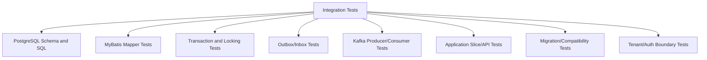
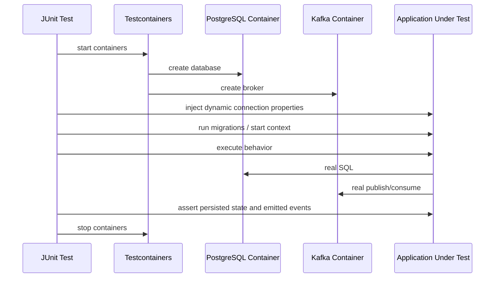

# Part 056 — Integration Testing with PostgreSQL, MyBatis, Kafka, and Testcontainers

## 1. Source notes and scope boundary

This part uses public documentation and general engineering practice.

Public references to verify independently:

- Testcontainers is an open-source library for providing throwaway, lightweight instances of databases, message brokers, web browsers, and other dependencies for tests.
- Testcontainers Java has modules for PostgreSQL and Kafka and integrates with JUnit Jupiter.
- Spring Boot documentation describes Testcontainers integration for managing services running inside Docker containers in tests.
- MyBatis documentation describes `SqlSession` as the primary Java interface for executing commands, getting mappers, and managing transactions.
- The internal CSG stack may use Spring Boot, another Java framework, custom test harnesses, custom Kafka wrappers, schema registries, or internal platform tooling. Verify in codebase.

This part does not assume the actual internal CSG test infrastructure.

---

## 2. Core thesis

Unit tests prove domain rules in memory.

Integration tests prove that domain rules survive real infrastructure boundaries.

For Quote & Order systems, the most dangerous bugs often live between layers:

- Java code and PostgreSQL transaction semantics;
- MyBatis mapper and actual SQL;
- optimistic locking and concurrent requests;
- outbox insert and Kafka publication;
- Kafka consumer retry and idempotency table;
- DB migration and old application version;
- JSON serialization and contract schema;
- tenant predicate and real query;
- transaction rollback and event emission;
- lock behavior under worker concurrency.

Integration testing exists to catch those boundary bugs before production.

---

## 3. What integration tests should prove

A good integration test proves at least one real boundary.

Examples:

- MyBatis SQL works against real PostgreSQL.
- Migrations produce the schema the application expects.
- Unique constraints reject duplicate business keys.
- Optimistic locking prevents lost update.
- `SELECT FOR UPDATE SKIP LOCKED` behaves correctly with concurrent workers.
- Outbox rows are persisted atomically with domain state.
- Kafka events are serialized, published, consumed, and deduplicated.
- Consumer replay does not create duplicate side effects.
- Tenant predicates are enforced in real queries.
- Transaction rollback prevents partial persistence.
- Error handling maps real database constraint violations to stable application errors.

If a test does not cross a real boundary, it may be a unit test wearing integration-test clothing.

---

## 4. Integration test taxonomy



### 4.1 Mapper integration tests

Goal:

- verify SQL, mapping, type handlers, tenant filters, pagination, and constraints.

Infrastructure:

- real PostgreSQL;
- real migration scripts;
- real MyBatis mappers;
- no mocked database.

### 4.2 Transaction integration tests

Goal:

- verify locking, optimistic versioning, unique constraint behavior, rollback, and concurrency.

Infrastructure:

- real PostgreSQL;
- real transaction manager;
- multiple connections/threads where needed.

### 4.3 Outbox/inbox integration tests

Goal:

- verify atomic persistence and idempotent processing.

Infrastructure:

- real PostgreSQL;
- outbox/inbox tables;
- relay/processor logic;
- optionally real Kafka.

### 4.4 Kafka integration tests

Goal:

- verify producer/consumer serialization, topic behavior, retries, dedupe, DLQ, and replay.

Infrastructure:

- real Kafka container;
- real consumer code;
- real event envelope;
- schema registry if internal stack uses it.

### 4.5 Application slice tests

Goal:

- verify HTTP/API or command handler through real persistence and messaging boundaries.

Infrastructure:

- application context;
- real PostgreSQL;
- real Kafka or test adapter;
- external systems replaced with fake/stub servers.

---

## 5. Why real PostgreSQL matters

Mocking repositories cannot catch:

- invalid SQL;
- wrong column names;
- wrong result mapping;
- missing type handler;
- broken JSONB path;
- wrong timestamp/timezone behavior;
- transaction isolation behavior;
- row locking behavior;
- deadlocks;
- unique constraint violations;
- foreign key violations;
- partial index behavior;
- query performance regressions;
- migration ordering failures;
- tenant predicate mistakes.

For PostgreSQL-backed systems, serious integration tests must use PostgreSQL, not H2 pretending to be PostgreSQL.

An in-memory substitute can be useful for very fast tests, but it cannot prove production database semantics.

---

## 6. Testcontainers mental model

Testcontainers lets tests create disposable infrastructure.

The key mental model:



The test controls infrastructure lifecycle.

The application behaves as close to production as practical.

---

## 7. Container lifecycle strategy

Container lifecycle affects test reliability and speed.

### 7.1 Per-test containers

Benefits:

- maximum isolation;
- fewer cross-test pollution risks;
- easier reasoning.

Costs:

- slow;
- expensive in CI;
- Kafka startup may dominate test time.

Use for:

- destructive migration tests;
- tricky isolation tests;
- tests that mutate global broker/database configuration.

### 7.2 Per-class containers

Benefits:

- good balance;
- isolated per test class;
- reasonably fast.

Costs:

- test methods must clean data carefully;
- parallel execution needs care.

Use for:

- mapper tests;
- repository tests;
- consumer tests.

### 7.3 Suite-level containers

Benefits:

- fastest for large suites.

Costs:

- hardest isolation;
- global data pollution;
- order dependency risk;
- harder local debugging.

Use only with disciplined cleanup, unique schemas/topics, or test isolation strategy.

---

## 8. PostgreSQL container setup pattern

Example skeleton:

```java
@Testcontainers
class QuoteRepositoryIT {

    @Container
    static PostgreSQLContainer<?> postgres = new PostgreSQLContainer<>("postgres:16")
        .withDatabaseName("quote_order_test")
        .withUsername("test")
        .withPassword("test");

    private QuoteRepository repository;

    @BeforeAll
    static void migrateDatabase() {
        DataSource dataSource = dataSourceFrom(postgres);
        MigrationRunner.run(dataSource);
    }

    @BeforeEach
    void setUp() {
        DataSource dataSource = dataSourceFrom(postgres);
        repository = new MyBatisQuoteRepository(myBatisSessionFactory(dataSource));
        truncateBusinessTables(dataSource);
    }

    @Test
    void insertAndLoadQuotePreservesCommercialSnapshot() {
        Quote quote = QuoteFixture.approvedQuote()
            .withCatalogVersion("catalog-v12")
            .withPricingSnapshot("pricing-snapshot-77")
            .build();

        repository.insert(quote);

        Quote loaded = repository.findById(quote.id()).orElseThrow();

        assertThat(loaded.catalogVersion()).isEqualTo("catalog-v12");
        assertThat(loaded.pricingSnapshotId()).isEqualTo("pricing-snapshot-77");
        assertThat(loaded.state()).isEqualTo(QuoteState.APPROVED);
    }
}
```

The exact framework may differ internally.

The principle is stable:

- run real schema;
- call real mapper/repository;
- assert business state round-trips correctly.

---

## 9. Migration in integration tests

Do not manually create tables in integration tests if production uses migrations.

Run the same migration path as production.

Why:

- catches missing table/column/index;
- catches migration ordering bugs;
- catches mismatch between Java code and schema;
- catches missing constraints;
- catches trigger/function deployment issues;
- catches default/nullability assumptions.

### 9.1 Recommended baseline

Each DB integration test suite should answer:

- Did migrations apply from empty database?
- Does application start against migrated schema?
- Do core repositories work against migrated schema?
- Are required constraints present?
- Are indexes expected by hot queries present?
- Are migration scripts idempotent only where intended?

---

## 10. MyBatis mapper integration tests

MyBatis mapper tests should not mock SQL results.

They should exercise actual SQL.

Example focus areas:

- insert quote aggregate;
- update quote state with optimistic version;
- find by tenant + quote ID;
- search quote page with filters;
- insert order and order items;
- load order with item graph;
- acquire work item with `FOR UPDATE SKIP LOCKED`;
- insert outbox event in same transaction;
- map JSONB metadata;
- map enum safely;
- preserve monetary precision.

### 10.1 Example optimistic locking test

```java
@Test
void updateFailsWhenVersionIsStale() {
    Quote quote = repository.insert(QuoteFixture.draftQuote().build());

    Quote firstCopy = repository.findById(quote.id()).orElseThrow();
    Quote secondCopy = repository.findById(quote.id()).orElseThrow();

    firstCopy.submitForApproval(validCommand());
    repository.update(firstCopy);

    secondCopy.submitForApproval(validCommand());

    assertThatThrownBy(() -> repository.update(secondCopy))
        .isInstanceOf(OptimisticLockException.class);
}
```

The unit test proves the aggregate transition.

The integration test proves the database update condition enforces concurrency.

Both are needed.

---

## 11. Transaction boundary tests

A transaction boundary test verifies that partial state is not persisted.

Example scenario:

- quote is accepted;
- outbox event is inserted;
- later step fails before commit;
- neither quote state nor outbox event should persist.

```java
@Test
void rollbackRemovesStateChangeAndOutboxEvent() {
    Quote quote = repository.insert(QuoteFixture.approvedQuote().build());

    assertThatThrownBy(() -> transactionTemplate.execute(status -> {
        Quote loaded = repository.findForUpdate(quote.id());
        loaded.accept(validAcceptCommand());
        repository.update(loaded);
        outboxRepository.insertAll(loaded.pullDomainEvents());
        throw new SimulatedFailure("fail before commit");
    })).isInstanceOf(SimulatedFailure.class);

    Quote reloaded = repository.findById(quote.id()).orElseThrow();
    assertThat(reloaded.state()).isEqualTo(QuoteState.APPROVED);
    assertThat(outboxRepository.findByAggregateId(quote.id())).isEmpty();
}
```

This catches one of the most dangerous classes of bugs: emitted side effects without committed state, or committed state without recorded side effect.

---

## 12. Locking and concurrent worker tests

Some behaviors require actual concurrency.

Examples:

- two users accepting the same quote;
- two workers claiming same outbox row;
- two order processors claiming same task;
- cancellation racing with fulfillment completion;
- retry worker racing with manual repair.

### 12.1 Worker claim test

```java
@Test
void concurrentWorkersDoNotClaimSameOutboxRow() throws Exception {
    outboxRepository.insert(outboxEvent("event-1"));

    ExecutorService executor = Executors.newFixedThreadPool(2);
    CountDownLatch start = new CountDownLatch(1);

    Callable<List<OutboxEvent>> worker = () -> {
        start.await();
        return transactionTemplate.execute(status ->
            outboxRepository.claimBatchForProcessing(10)
        );
    };

    Future<List<OutboxEvent>> first = executor.submit(worker);
    Future<List<OutboxEvent>> second = executor.submit(worker);

    start.countDown();

    List<OutboxEvent> combined = Stream.concat(
        first.get().stream(),
        second.get().stream()
    ).toList();

    assertThat(combined)
        .extracting(OutboxEvent::id)
        .containsExactly("event-1");
}
```

This is not a pure unit test.

It proves real PostgreSQL lock behavior and repository SQL.

---

## 13. Unique constraints as integration-test targets

Business idempotency often depends on unique constraints.

Examples:

- `(tenant_id, external_order_id)` unique;
- `(tenant_id, idempotency_key)` unique;
- `(consumer_name, message_id)` unique;
- `(aggregate_id, aggregate_version)` unique for event ordering;
- `(quote_id, order_id)` unique for quote conversion.

Write tests that prove duplicate insertion fails and maps to a stable domain/application error.

```java
@Test
void duplicateExternalOrderIdIsRejectedForSameTenant() {
    repository.insert(OrderFixture.withExternalId("crm-order-1").forTenant("tenant-a").build());

    assertThatThrownBy(() -> repository.insert(
        OrderFixture.withExternalId("crm-order-1").forTenant("tenant-a").build()
    )).isInstanceOf(DuplicateBusinessKeyException.class);
}

@Test
void sameExternalOrderIdCanExistForDifferentTenantWhenModelAllowsIt() {
    repository.insert(OrderFixture.withExternalId("crm-order-1").forTenant("tenant-a").build());
    repository.insert(OrderFixture.withExternalId("crm-order-1").forTenant("tenant-b").build());
}
```

The second test is as important as the first when tenant scoping matters.

---

## 14. Tenant isolation integration tests

A unit test can verify tenant policy.

An integration test must verify tenant predicates in real SQL.

Test cases:

- tenant A cannot load tenant B quote by ID;
- search endpoint only returns current tenant data;
- update includes tenant predicate;
- delete/archive includes tenant predicate;
- outbox/inbox rows include tenant ID;
- cache key includes tenant ID if integration test covers cache;
- migration/backfill preserves tenant ID;
- support/admin path requires explicit tenant scope.

Example:

```java
@Test
void findByIdDoesNotReturnQuoteFromAnotherTenant() {
    Quote tenantBQuote = repository.insert(
        QuoteFixture.draftQuote().forTenant("tenant-b").build()
    );

    Optional<Quote> result = repository.findByTenantAndId("tenant-a", tenantBQuote.id());

    assertThat(result).isEmpty();
}
```

This catches a real production-risk class: missing tenant predicate.

---

## 15. Kafka container setup pattern

Example skeleton:

```java
@Testcontainers
class OrderEventConsumerIT {

    @Container
    static KafkaContainer kafka = new KafkaContainer(
        DockerImageName.parse("apache/kafka-native:3.8.0")
    );

    @Container
    static PostgreSQLContainer<?> postgres = new PostgreSQLContainer<>("postgres:16");

    private OrderEventProducer producer;
    private OrderEventConsumer consumer;

    @BeforeEach
    void setUp() {
        configureKafkaBootstrapServers(kafka.getBootstrapServers());
        migrateDatabase(postgres);
        createTopics("order.lifecycle.v1", "order.lifecycle.dlq.v1");
        producer = realProducer(kafka.getBootstrapServers());
        consumer = realConsumer(kafka.getBootstrapServers(), repository());
    }

    @Test
    void duplicateOrderAcceptedEventIsProcessedOnce() {
        OrderAcceptedEvent event = EventFixture.orderAccepted("order-123")
            .withMessageId("msg-1")
            .build();

        producer.publish(event);
        producer.publish(event);

        await().untilAsserted(() ->
            assertThat(orderProjectionRepository.findByOrderId("order-123"))
                .hasValueSatisfying(projection ->
                    assertThat(projection.acceptedEventCount()).isEqualTo(1)
                )
        );
    }
}
```

This test proves:

- real serialization;
- real broker;
- consumer loop;
- idempotency store;
- DB side effect;
- async waiting discipline.

---

## 16. Kafka tests: what to verify

Kafka integration tests should verify behavior, not broker internals.

Good targets:

- producer writes expected event envelope;
- consumer accepts compatible event version;
- consumer rejects incompatible event version to DLQ/quarantine;
- duplicate message is idempotent;
- replay does not duplicate side effect;
- poison message does not block partition forever;
- retryable failure is retried with bounded policy;
- non-retryable failure is classified correctly;
- event metadata contains tenant/correlation/causation IDs;
- out-of-order event is handled or rejected by aggregate sequence;
- consumer persists offset only after successful side effect if using manual commit.

Avoid tests that assert exact timing.

Async systems require eventual assertions with time bounds.

---

## 17. Awaiting asynchronous behavior safely

Do not use arbitrary `Thread.sleep(5000)`.

Use polling assertions.

```java
await()
    .atMost(Duration.ofSeconds(10))
    .pollInterval(Duration.ofMillis(100))
    .untilAsserted(() -> {
        Optional<OrderProjection> projection = projectionRepository.findByOrderId(orderId);
        assertThat(projection).isPresent();
        assertThat(projection.get().state()).isEqualTo("ACCEPTED");
    });
```

Principles:

- wait for observable outcome;
- use realistic timeout;
- keep poll interval reasonable;
- include useful failure messages;
- avoid sleeping blindly;
- clean up topics/tables per test.

---

## 18. Outbox integration tests

Outbox tests should prove atomicity and relay behavior.

Test cases:

- domain state update and outbox insert commit together;
- rollback removes both;
- relay claims pending event once;
- relay marks event published after Kafka ack;
- relay retry increments attempt count;
- poison event is quarantined after threshold;
- relay is safe under concurrent workers;
- event payload contains correct aggregate version;
- event ordering is preserved per aggregate if required.

Example:

```java
@Test
void acceptingQuoteCreatesOutboxEventInSameTransaction() {
    Quote quote = repository.insert(QuoteFixture.approvedQuote().build());

    acceptQuoteService.accept(quote.id(), validCommand());

    Quote loaded = repository.findById(quote.id()).orElseThrow();
    List<OutboxEvent> events = outboxRepository.findByAggregateId(quote.id());

    assertThat(loaded.state()).isEqualTo(QuoteState.ACCEPTED);
    assertThat(events).singleElement().satisfies(event -> {
        assertThat(event.type()).isEqualTo("QuoteAccepted");
        assertThat(event.aggregateVersion()).isEqualTo(loaded.version());
        assertThat(event.tenantId()).isEqualTo(loaded.tenantId());
    });
}
```

---

## 19. Inbox/processed-message integration tests

Consumer idempotency should be proven with real constraints.

Test cases:

- first message processed;
- duplicate message ignored;
- duplicate with same message ID but different payload rejected/quarantined;
- failure before side effect allows retry;
- failure after side effect but before offset commit does not duplicate side effect;
- processed-message row includes tenant/consumer/message ID.

Example:

```java
@Test
void consumerProcessesDuplicateMessageOnlyOnce() {
    EventEnvelope event = EventFixture.orderCompleted("order-123")
        .withMessageId("message-abc")
        .build();

    consumer.handle(event);
    consumer.handle(event);

    assertThat(processedMessageRepository.countByMessageId("message-abc"))
        .isEqualTo(1);
    assertThat(orderRepository.findById("order-123").orElseThrow().state())
        .isEqualTo(OrderState.COMPLETED);
}
```

---

## 20. API + database integration tests

Application slice tests verify that API layer, validation, transaction, and persistence work together.

Example scenarios:

- submit quote request persists quote and returns stable response;
- accept quote with stale version returns `409 Conflict`;
- create order with same idempotency key returns existing result;
- invalid tenant token cannot access another tenant's quote;
- pagination works with real data;
- error code maps from database conflict to API response;
- outbox event is created when API command succeeds.

Keep these tests fewer and higher value than mapper tests.

They are slower.

They should cover critical integration paths, not every validation permutation.

---

## 21. External system stubs

Do not call real CRM, billing, inventory, fulfillment, or partner systems from integration tests.

Use:

- fake HTTP servers;
- contract stubs;
- local simulator;
- WireMock-like tools;
- fake Kafka producer/consumer for external topics when appropriate.

The stub must preserve the failure mode being tested.

For example:

- timeout;
- 429 rate limit;
- 500 retryable error;
- 400 validation rejection;
- ambiguous network failure after side effect;
- slow response;
- malformed response;
- incompatible schema.

Do not let the stub become a happy-path toy.

---

## 22. Deterministic test data

Integration tests need stronger data discipline than unit tests.

Rules:

- use unique tenant IDs per test or clean tables reliably;
- use unique topic names per test class if Kafka state leaks;
- avoid depending on test execution order;
- do not use production-like personal data;
- seed required catalog/customer/agreement data explicitly;
- freeze time where application logic depends on time;
- use deterministic IDs unless uniqueness is the behavior being tested;
- isolate concurrent tests.

### 22.1 Cleanup strategies

Options:

- truncate all business tables before each test;
- use transaction rollback for tests that do not require async workers;
- create unique schema per test class;
- create unique tenant per test;
- recreate container for destructive tests.

Be careful: transaction rollback does not clean changes made by asynchronous consumers running in separate transactions.

---

## 23. Flakiness model

Integration tests fail for three broad reasons:

1. Product bug.
2. Test bug.
3. Environment/infrastructure instability.

A senior engineer does not dismiss flaky tests casually.

Flaky tests often reveal missing synchronization, hidden race conditions, or unsafe assumptions.

Common causes:

- arbitrary sleeps;
- shared global topics;
- shared global database state;
- time-dependent assertions;
- unbounded async workers;
- port conflicts;
- container image drift;
- tests relying on external network;
- parallel test interference;
- slow CI nodes;
- missing cleanup after failure.

Mitigations:

- await observable state;
- pin container images;
- create unique test resources;
- use deterministic clocks;
- log test resource names;
- collect container logs on failure;
- keep test data minimal;
- separate slow/destructive suites;
- avoid external dependencies.

---

## 24. CI considerations

Integration tests are valuable only if CI runs them reliably.

Verify:

- Docker availability on CI runners;
- container image pull policy;
- registry rate limits;
- image pinning strategy;
- resource limits for PostgreSQL/Kafka containers;
- parallelism settings;
- test timeout settings;
- log collection on failure;
- separation of unit/integration test stages;
- ability to reproduce failures locally;
- caching of Maven dependencies;
- build profile naming;
- flaky test quarantine process;
- whether integration tests are required checks before merge.

Integration tests that are too slow or too flaky will be bypassed.

A bypassed test suite is operational debt.

---

## 25. Performance boundaries for integration tests

Integration tests should not become load tests.

But they should catch obvious performance failures:

- missing index on hot lookup;
- N+1 query in mapper;
- query returning cross-tenant data;
- pagination scanning too much data;
- outbox claim query missing index;
- consumer processing one message per transaction when batch is required;
- lock held too long.

For targeted query tests, capture `EXPLAIN` or query count if internal tooling supports it.

Do not make every test assert exact query plan.

Use query-plan assertions sparingly for critical paths.

---

## 26. Testcontainers with Spring Boot-style dynamic properties

If the internal service uses Spring Boot, a common shape is dynamic property injection.

```java
@Testcontainers
@SpringBootTest
class SubmitOrderApplicationIT {

    @Container
    static PostgreSQLContainer<?> postgres = new PostgreSQLContainer<>("postgres:16");

    @Container
    static KafkaContainer kafka = new KafkaContainer(
        DockerImageName.parse("apache/kafka-native:3.8.0")
    );

    @DynamicPropertySource
    static void properties(DynamicPropertyRegistry registry) {
        registry.add("spring.datasource.url", postgres::getJdbcUrl);
        registry.add("spring.datasource.username", postgres::getUsername);
        registry.add("spring.datasource.password", postgres::getPassword);
        registry.add("spring.kafka.bootstrap-servers", kafka::getBootstrapServers);
    }

    @Test
    void submittingOrderPersistsOrderAndPublishesLifecycleEvent() {
        SubmitOrderRequest request = TestRequests.validSubmitOrder();

        SubmitOrderResponse response = api.submitOrder(request);

        assertThat(orderRepository.findById(response.orderId())).isPresent();
        await().untilAsserted(() ->
            assertThat(testConsumer.eventsOfType("OrderAccepted"))
                .anyMatch(event -> event.aggregateId().equals(response.orderId()))
        );
    }
}
```

If the internal stack is not Spring Boot, the equivalent is still needed:

- create containers;
- inject runtime connection properties;
- start application context;
- run behavior;
- assert outcomes.

---

## 27. Test suite layering recommendation

A balanced test strategy:

```text
Fast, many:
  - pure domain unit tests
  - policy tests
  - mapper-less command handler tests

Medium, targeted:
  - MyBatis + PostgreSQL mapper tests
  - transaction/locking tests
  - outbox/inbox tests
  - Kafka producer/consumer tests

Slow, few:
  - API + DB + Kafka application slice tests
  - migration compatibility tests
  - E2E quote-to-order journey tests
```

Do not push all correctness into E2E tests.

E2E tests are too slow and too coarse to diagnose most bugs quickly.

---

## 28. What not to test with Testcontainers

Do not use Testcontainers when a unit test would prove the rule faster and more clearly.

Examples:

- state transition guard;
- pricing arithmetic;
- approval policy decision;
- authorization policy matrix;
- error code mapping without infrastructure;
- DTO mapper with no DB dependency;
- pure validation rule.

Using containers for everything slows feedback and hides intent.

Use the smallest test that catches the failure mode.

---

## 29. Internal verification checklist

Verify these in the real environment:

- Is Testcontainers used? If yes, which version?
- Is Spring Boot Testcontainers integration used?
- Is `@MybatisTest` or equivalent used?
- Are integration tests separated by Maven Surefire/Failsafe?
- Naming convention: `*Test`, `*IT`, `*IntegrationTest`?
- Which tests run on PR vs nightly?
- Docker availability on CI runners.
- Container image pinning policy.
- PostgreSQL version used in tests vs production.
- Kafka version used in tests vs production.
- Schema registry availability in tests.
- Migration tool and test migration strategy.
- Table cleanup strategy.
- Topic cleanup strategy.
- Parallel test execution policy.
- Test data builder library.
- Whether tests use real MyBatis mappers.
- Whether repository tests run against PostgreSQL or substitute DB.
- Existing outbox/inbox integration tests.
- Existing idempotent consumer tests.
- Existing concurrent locking tests.
- Existing tenant isolation integration tests.
- Existing CI flakiness dashboard.
- Existing test runtime budget.
- How to reproduce CI integration failures locally.

---

## 30. PR review checklist for integration tests

When reviewing integration tests, ask:

1. What real boundary does this test prove?
2. Could this be a unit test instead?
3. Does it use real PostgreSQL for SQL behavior?
4. Does it run real migrations?
5. Does it use real MyBatis mapper SQL?
6. Does it assert business outcome, not just HTTP 200?
7. Does it verify tenant isolation if relevant?
8. Does it verify transaction rollback if relevant?
9. Does it verify duplicate/idempotent behavior if relevant?
10. Does it avoid arbitrary sleeps?
11. Does it isolate data across tests?
12. Does it avoid external network dependencies?
13. Are container images pinned?
14. Does it produce useful failure diagnostics?
15. Is it appropriate for PR CI runtime?
16. Does it cover a failure mode that unit tests cannot?

---

## 31. Common anti-patterns

### 31.1 H2 masquerading as PostgreSQL

The test passes on H2 but fails in production because SQL dialect, locking, JSONB, indexes, and isolation behavior differ.

### 31.2 Container test that asserts nothing meaningful

The test starts PostgreSQL and calls a repository, but only asserts that no exception occurred.

This is expensive smoke testing, not integration testing.

### 31.3 Arbitrary sleeps in Kafka tests

`Thread.sleep(3000)` makes tests slow and flaky.

Await observable state instead.

### 31.4 Shared topic pollution

Multiple tests use the same topic and consumer group.

Messages leak across tests.

Use unique topics or deterministic cleanup.

### 31.5 Ignoring migration path

Tests manually create schema or rely on ORM auto-DDL while production uses migration scripts.

This misses migration failures.

### 31.6 No cleanup for async side effects

Database transaction rollback cleans API thread changes but not consumer thread changes.

Tests become order-dependent.

### 31.7 Mocking Kafka in a Kafka integration test

A test that mocks producer and consumer cannot prove serialization, topic config, or consumer group behavior.

### 31.8 Testing only the first insert

Repository insert is tested, but update, lock, pagination, search, duplicate, and tenant-scoped reads are not.

---

## 32. Exercises

### Exercise 1 — Mapper reality check

Pick one MyBatis mapper for quote or order.

Write or inspect tests proving:

- insert works;
- update uses optimistic version;
- find uses tenant predicate;
- search pagination is stable;
- duplicate business key maps to expected error.

### Exercise 2 — Outbox atomicity test

Find where domain events are persisted.

Write or inspect a test proving:

- state update and outbox insert commit together;
- rollback removes both;
- event metadata contains tenant/correlation/causation.

### Exercise 3 — Duplicate event consumer test

Pick one Kafka consumer.

Write or inspect a test proving:

- same message ID is processed once;
- duplicate does not create duplicate side effect;
- non-retryable malformed message is quarantined or classified.

### Exercise 4 — Locking test

Find a worker claim query.

Write or inspect a concurrent test proving two workers cannot claim the same row.

### Exercise 5 — Tenant isolation integration test

Pick one repository search method.

Seed two tenants.

Verify tenant A cannot read tenant B data through actual SQL.

---

## 33. Learning outcomes

After this part, you should be able to:

- decide when integration testing is necessary;
- write PostgreSQL-backed mapper tests with real migrations;
- test transaction rollback, optimistic locking, and worker concurrency;
- test outbox/inbox correctness;
- test Kafka producer/consumer behavior with real broker infrastructure;
- avoid flaky async tests;
- structure integration tests for CI reliability;
- review integration tests for real boundary value;
- detect test suites that look expensive but prove little.

---

## 34. Final mental model

A strong integration test answers:

> Does the behavior that was proven in unit tests remain true when real persistence, transactions, SQL, Kafka, serialization, migrations, and asynchronous processing are involved?

For Quote & Order systems, this is not optional.

The business process crosses boundaries.

The tests must cross the right boundaries too.

