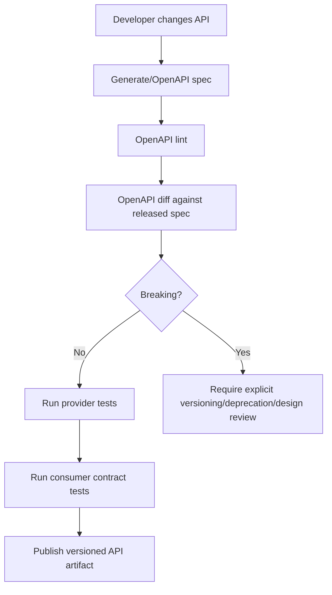
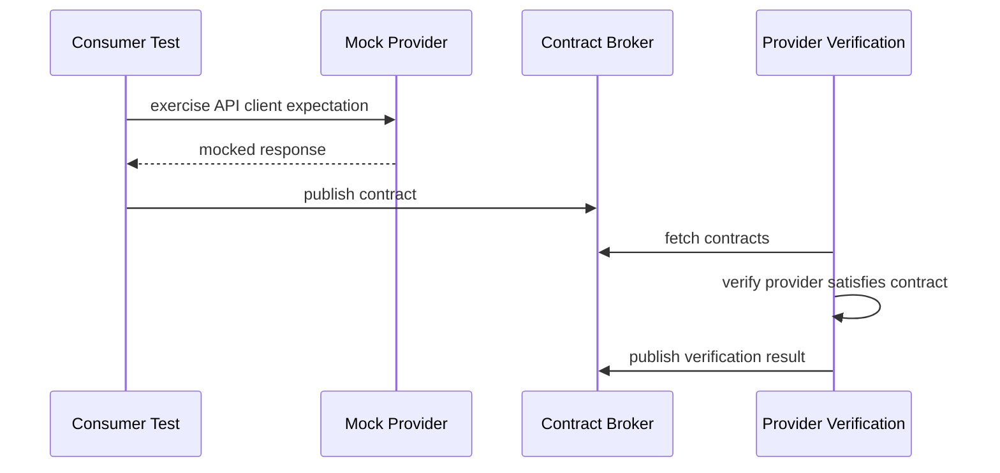
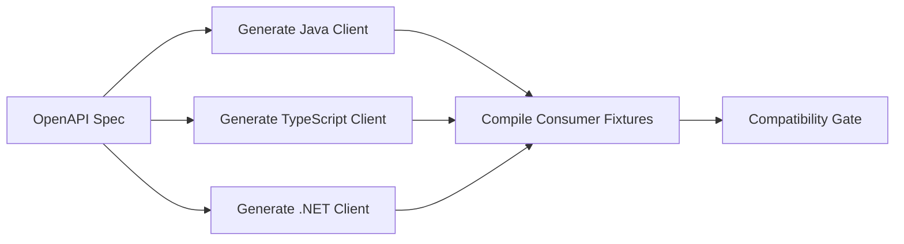
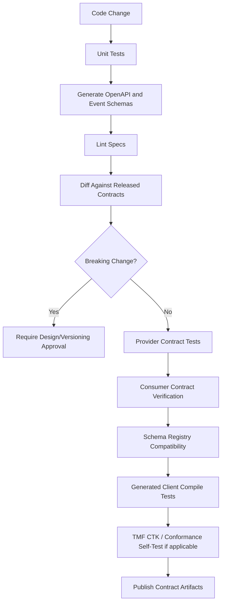

# Part 057 — Contract Testing, Consumer-Driven Contracts, and TMF Conformance

## 1. Source notes and scope boundary

This part uses public standards and common engineering practice.

Public references to verify independently:

- The OpenAPI Initiative describes OpenAPI Specifications as a formal standard for describing HTTP APIs.
- Pact describes itself as a code-first consumer-driven contract testing tool where consumer tests generate contracts that providers verify.
- TM Forum provides Open API Conformance certification and Conformance Test Kits for testing implementations against TM Forum Open API standards.
- Kafka and schema registry ecosystems support schema compatibility testing, but the exact registry, serialization format, and compatibility mode must be verified internally.
- CSG internal API governance, TMF certification targets, conformance expectations, and customer-specific contract obligations must be verified internally.

This part does not assume that CSG Quote & Order exposes every TMF API directly, uses Pact, uses a specific schema registry, or has formal TMF conformance certification for every endpoint.

---

## 2. Core thesis

Contract testing exists because integration correctness cannot be proven by testing one service alone.

A service can be internally correct and still break production if it changes:

- a field name;
- a required/optional field rule;
- an enum value;
- a defaulting behavior;
- an error code;
- a pagination contract;
- an event schema;
- a state transition semantic;
- a TMF extension convention;
- a callback payload;
- an idempotency behavior;
- a correlation ID propagation rule.

In Quote & Order systems, contracts are not merely technical.

They encode business commitments:

- what a customer may quote;
- what a partner may order;
- what a billing system may expect;
- what fulfillment may act on;
- what inventory may reconcile;
- what audit can reconstruct;
- what an external customer integration can depend on for years.

Contract tests protect those commitments.

---

## 3. Contract testing is not the same as integration testing

Integration testing asks:

> Does our service work with a real dependency?

Contract testing asks:

> Are producer and consumer still compatible according to an explicit agreement?

They overlap, but they are not the same.

| Test type | Primary question | Typical boundary | Failure caught |
|---|---|---|---|
| Unit test | Is local logic correct? | Class/function/domain model | Broken invariant |
| Integration test | Does code work with real infra? | DB, Kafka, HTTP mock, container | SQL/runtime/config issue |
| E2E test | Does the whole journey work? | Many services | Journey-level regression |
| Contract test | Can independent systems still communicate safely? | API/event contract | Breaking provider/consumer change |
| Conformance test | Does implementation satisfy an external standard profile? | Standard API spec | Spec deviation |

For enterprise platforms, contract testing is often the cheapest way to prevent expensive customer regression.

---

## 4. The contract surface of Quote & Order

A Quote & Order platform has multiple contract surfaces.

### 4.1 REST API contracts

Examples:

- `POST /quotes`
- `PATCH /quotes/{id}`
- `POST /quotes/{id}/submit-for-approval`
- `POST /quotes/{id}/accept`
- `POST /productOrders`
- `GET /productOrders/{id}`
- `POST /productOrders/{id}/cancel`
- TMF-style endpoints for catalog, quote, product order, customer, product inventory, or service order.

The contract includes:

- path;
- method;
- request body;
- response body;
- status code;
- headers;
- authentication requirement;
- authorization requirement;
- idempotency behavior;
- error model;
- pagination;
- filtering;
- sorting;
- state transition semantics;
- backward compatibility guarantees.

### 4.2 Kafka event contracts

Examples:

- `QuoteCreated`
- `QuotePriced`
- `QuoteApprovalRequested`
- `QuoteAccepted`
- `ProductOrderCreated`
- `ProductOrderStateChanged`
- `OrderItemFalloutRaised`
- `FulfillmentTaskCompleted`
- `CatalogPublished`
- `CustomerContextChanged`

The contract includes:

- topic;
- key;
- schema;
- required fields;
- optional fields;
- event type;
- event version;
- aggregate ID;
- aggregate version;
- tenant ID;
- occurred time;
- correlation ID;
- causation ID;
- replay semantics;
- ordering expectation;
- retention expectation;
- PII classification;
- compatibility mode.

### 4.3 Webhook and callback contracts

Examples:

- fulfillment status callback;
- partner order callback;
- approval system callback;
- billing handoff acknowledgement;
- external catalog synchronization callback.

The contract includes:

- retry expectation;
- authentication mechanism;
- signature verification;
- idempotency key;
- callback ordering;
- timeout behavior;
- error response semantics;
- duplicate handling.

### 4.4 Database contract between application versions

This is often forgotten.

During rolling deploy, two application versions may run against one database.

The contract includes:

- old app can read new schema;
- new app can read old data;
- new app can tolerate missing backfill;
- old app ignores newly added columns;
- triggers/functions stay compatible;
- migration order is safe;
- rollback does not leave application unable to run.

### 4.5 Operational contract

A system also exposes operational contracts:

- metrics names;
- alert signals;
- log fields;
- trace attributes;
- audit event names;
- runbook assumptions;
- dashboard filters;
- support export formats.

Breaking these may not break compilation, but can break incident response.

---

## 5. Internal verification checklist

Before changing API/event contracts, verify:

- Which APIs are public, partner-facing, customer-facing, internal, or UI-only?
- Which APIs are TMF-aligned or TMF-conformance-targeted?
- Which OpenAPI specifications are source of truth?
- Are OpenAPI files generated from code or code generated from OpenAPI?
- Is there an API style guide?
- Is OpenAPI diff part of CI?
- Are consumer-driven contracts used?
- Is Pact, Spring Cloud Contract, WireMock snapshot testing, or another tool used?
- Are event schemas stored in schema registry?
- What serialization format is used: JSON, Avro, Protobuf, CloudEvents-style envelope, or custom?
- What compatibility mode is enforced for schemas?
- Is enum expansion allowed?
- Are event payloads versioned?
- Are contract tests required for external customer adapters?
- Are TMF CTKs used for self-assessment or certification?
- Are extension fields documented and governed?
- Are callback contracts tested?
- Are generated client SDKs tested?
- Are old client versions included in compatibility testing?
- Are operational metrics/log/audit fields treated as contracts?

---

## 6. The first principle: consumers depend on behavior, not just shape

A naive contract test validates JSON structure.

A serious contract test validates externally observable behavior.

Example: this is not enough:

```json
{
  "id": "Q-123",
  "state": "approved"
}
```

The real contract may be:

- `approved` means all approval rules were satisfied;
- quote cannot be accepted if approval has expired;
- quote cannot be ordered twice;
- price snapshot cannot change after acceptance;
- response contains the same quote version that was approved;
- `accepted` transition emits `QuoteAccepted` exactly once logically;
- audit record includes actor and authority basis.

The schema can remain unchanged while the behavior breaks.

Contract testing must cover both:

- structural compatibility;
- semantic compatibility.

---

## 7. OpenAPI compatibility gates

OpenAPI is useful because it makes API surface explicit.

But OpenAPI alone does not guarantee compatibility.

Use it as a gate.

### 7.1 Breaking changes usually include

- Removing an endpoint.
- Removing a response field used by consumers.
- Renaming a field.
- Changing field type.
- Making an optional request field required.
- Making a nullable response field non-null without migration.
- Removing enum value.
- Changing status code semantics.
- Changing error code semantics.
- Changing pagination default in a way that drops records.
- Changing sorting default in a way that breaks stable pagination.
- Changing authentication scheme.
- Changing authorization requirement without migration notice.

### 7.2 Additive changes are safer, but not automatically safe

Additive changes can still break weak consumers.

Examples:

- Adding enum value breaks clients with exhaustive switch.
- Adding non-null field may break strict deserializers if unknown fields are rejected.
- Adding nested payload increases response size and causes timeout.
- Adding event type causes consumer DLQ if event type is not tolerated.
- Adding validation error changes user-facing workflow.

### 7.3 CI gate pattern

A good API compatibility gate should compare:

- current branch OpenAPI;
- last released OpenAPI;
- currently deployed production OpenAPI;
- customer-specific published OpenAPI if relevant.

Mermaid flow:



### 7.4 What should be stored as artifacts

Store per build:

- OpenAPI JSON/YAML;
- API changelog;
- compatibility diff;
- generated client compilation result;
- provider verification result;
- consumer contract result;
- TMF conformance result if applicable.

The goal is evidence.

When a customer says “you broke our integration,” the team should be able to reconstruct exactly what changed.

---

## 8. Consumer-driven contract testing

Consumer-driven contract testing reverses the usual dependency.

Instead of provider guessing what consumers need, each consumer records expectations.

Typical flow:



### 8.1 What CDC is good at

CDC is strong when:

- consumers are known;
- consumers use only part of a large API;
- provider evolves frequently;
- E2E environments are expensive;
- integration failures are costly;
- teams deploy independently.

### 8.2 What CDC is weak at

CDC is not enough when:

- unknown external customers consume API manually;
- standard conformance is required beyond known consumers;
- behavior is too broad for consumer tests;
- consumers fail to publish contracts;
- provider has security/authorization behavior not represented in consumer tests;
- integration depends on data lifecycle, not just request/response.

Therefore:

- use CDC for known consumers;
- use OpenAPI compatibility for general surface;
- use TMF conformance where standard compliance matters;
- use E2E journey tests for business workflow;
- use integration tests for infrastructure behavior.

---

## 9. Provider contract test design

Provider contract tests should run against the real provider application, not hand-written mocks.

For Quote & Order, provider state setup matters.

Example states:

- quote exists in draft state;
- quote exists in priced state;
- quote exists pending approval;
- quote exists approved;
- quote has expired;
- quote already converted to order;
- customer has enterprise agreement;
- customer lacks permission;
- product offering is retired;
- order exists in fallout;
- order cancellation is in progress.

A provider test without realistic provider state is almost worthless.

### 9.1 Provider state pattern

```java
class ProviderStateSetup {

  void quoteApprovedAndAcceptable() {
    // Insert catalog snapshot
    // Insert customer/account context
    // Insert quote aggregate
    // Insert quote items
    // Insert price snapshot
    // Insert approval evidence
    // Ensure state = APPROVED
  }

  void quoteExpiredAfterApproval() {
    // Same as above, but validity window expired
  }
}
```

Do not build provider state through the UI.

Prefer direct setup through:

- test fixture builder;
- repository helper;
- SQL fixture;
- domain command helper;
- seeded test API if internally approved.

---

## 10. Contract tests for TMF-aligned APIs

TMF APIs introduce an additional dimension: standard vocabulary.

For TMF620/TMF648/TMF622/TMF629/TMF637/TMF641, tests should check:

- required resources exist;
- resource identity shape is stable;
- lifecycle states are mapped consistently;
- standard fields are not repurposed for incompatible meaning;
- extension fields are namespaced or governed;
- response codes match documented behavior;
- filtering/pagination behavior is stable;
- notification events follow expected shape if supported;
- `href`, `id`, `@type`, `@baseType`, `@schemaLocation`, or equivalent polymorphic conventions are handled according to the chosen TMF version;
- internal model differences are hidden behind anti-corruption mapping.

Do not treat TMF as a magic shield.

A system can be TMF-shaped and still wrong.

Examples:

- Product order state says `completed`, but one order item failed.
- Quote price is structurally present, but not the approved price.
- Product inventory response returns stale installed base without freshness metadata.
- Extension field encodes mandatory behavior that no consumer knows how to interpret.
- API claims compatibility with a TMF version but mixes fields from another version.

### 10.1 TMF conformance testing mindset

TMF conformance is useful to prove standard alignment.

But product engineering still needs internal tests for:

- customer-specific extensions;
- non-standard lifecycle behavior;
- tenant isolation;
- authorization;
- data freshness;
- idempotency;
- rollback/migration compatibility;
- operational observability.

Conformance is necessary evidence for standards alignment.

It is not sufficient evidence for production readiness.

---

## 11. Event contract testing

Event contracts are as important as REST contracts.

An event is a published fact.

Once downstream systems depend on it, it becomes hard to change.

### 11.1 Event schema test dimensions

Validate:

- schema can deserialize old events;
- old consumers can ignore new fields;
- new consumers can process old events;
- required metadata exists;
- tenant ID exists;
- aggregate ID exists;
- event ID exists;
- event type exists;
- event version exists;
- occurred time exists;
- correlation ID exists;
- causation ID exists;
- PII fields are classified;
- enum changes are compatible;
- default values are explicit.

### 11.2 Event semantic test dimensions

Validate:

- event emitted only after transaction commit;
- event represents committed state;
- duplicate relay does not create duplicate logical event;
- aggregate version increments monotonically;
- replay does not create new side effects;
- event order is meaningful only within partition key scope;
- terminal state event is not emitted before all required child states are satisfied.

### 11.3 Example event envelope

```json
{
  "eventId": "evt-01H...",
  "eventType": "ProductOrderStateChanged",
  "eventVersion": 3,
  "tenantId": "tenant-a",
  "aggregateType": "ProductOrder",
  "aggregateId": "PO-1001",
  "aggregateVersion": 12,
  "occurredAt": "2026-07-08T10:15:30Z",
  "correlationId": "corr-abc",
  "causationId": "cmd-accept-quote-123",
  "producer": "order-service",
  "payload": {
    "previousState": "IN_PROGRESS",
    "currentState": "COMPLETED",
    "reasonCode": "ALL_ITEMS_COMPLETED"
  }
}
```

Contract tests should assert envelope metadata just as strongly as payload fields.

---

## 12. Contract testing for error models

Errors are part of the contract.

A customer integration often depends on error codes to decide:

- retry;
- ask user to fix input;
- raise approval;
- refresh catalog;
- stop workflow;
- contact support.

### 12.1 Error contract example

```json
{
  "code": "QUOTE_PRICE_EXPIRED",
  "message": "The quote price is no longer valid and must be recalculated.",
  "correlationId": "corr-123",
  "details": [
    {
      "field": "quoteId",
      "reason": "priceValidityExpired"
    }
  ]
}
```

Changing `QUOTE_PRICE_EXPIRED` to `VALIDATION_FAILED` may be a breaking semantic change.

Even if HTTP status remains `409`.

### 12.2 Error compatibility checklist

Verify:

- error code stable;
- error category stable;
- retryability documented;
- customer-actionability clear;
- correlation ID present;
- PII not leaked;
- internal stack trace never exposed;
- authorization errors do not reveal forbidden resource existence;
- validation errors remain machine-readable.

---

## 13. Generated client compatibility

If clients are generated from OpenAPI, add compile gates.

For each supported client:

- generate client from new OpenAPI;
- compile representative consumer code;
- run consumer tests;
- verify unknown fields are tolerated;
- verify enum expansion behavior;
- verify nullable behavior;
- verify date/time parsing;
- verify money/decimal precision.

This catches breaks that schema diff may miss.

Example:



---

## 14. Contract testing and backward compatibility matrix

For serious enterprise systems, test compatibility across versions.

| Producer | Consumer | Expected result |
|---|---|---|
| old API provider | old consumer | works |
| new API provider | old consumer | must work unless major version migration |
| old API provider | new consumer | may work only if consumer handles old provider |
| new API provider | new consumer | works |
| old event producer | new consumer | must work during rolling migration |
| new event producer | old consumer | must work if same topic/version contract |

During rolling deploy, old and new versions coexist.

Compatibility must be temporal, not just final-state.

---

## 15. Quote-to-order contract scenario set

Every Quote & Order system should have contract scenarios around core journeys.

### 15.1 Quote API scenarios

- Create quote with valid customer and offering.
- Create quote with retired offering.
- Price quote with enterprise agreement.
- Submit quote requiring approval.
- Approve quote with sufficient authority.
- Attempt approval with insufficient authority.
- Accept quote after price expiry.
- Convert accepted quote to order.
- Attempt double conversion.
- Retrieve quote with version history.
- Retrieve quote with item-level price breakdown.

### 15.2 Order API scenarios

- Create product order from accepted quote.
- Create order directly from product offering if supported.
- Reject order due to invalid installed base.
- Accept order and emit state event.
- Retrieve order with item states.
- Cancel order before fulfillment starts.
- Cancel order after partial fulfillment.
- Retry fallout item.
- Retrieve order after reconciliation update.

### 15.3 Catalog API scenarios

- Retrieve active product offering.
- Retrieve future-dated offering.
- Retrieve retired offering by version.
- Retrieve bundle with nested items.
- Retrieve offering price and characteristics.
- Publish catalog update and verify event.

### 15.4 Customer/inventory scenarios

- Retrieve customer account hierarchy.
- Retrieve customer with restricted fields.
- Retrieve installed product inventory.
- Validate amendment against installed base.
- Handle stale inventory response.

---

## 16. Contract test data strategy

Bad test data makes contract tests useless.

Use deterministic named fixtures.

Examples:

- `customer_enterprise_with_agreement_a`
- `account_parent_with_two_child_accounts`
- `offering_active_broadband_bundle_v3`
- `offering_retired_mobile_plan_v1`
- `quote_approved_price_valid`
- `quote_approved_price_expired`
- `order_partially_fulfilled_with_fallout`

Avoid random generated IDs unless they are paired with stable labels.

Consumers need predictable contracts.

---

## 17. Internal verification checklist: contract ownership

Find and document:

- Who owns each public API?
- Who owns each OpenAPI file?
- Who approves breaking changes?
- Who owns generated clients?
- Who owns event schema registry?
- Who approves topic/schema changes?
- Who owns TMF mapping?
- Who owns customer-specific extensions?
- Who runs CTK/conformance tests?
- Who signs off compatibility exceptions?
- Where are published contracts stored?
- Where are consumer expectations registered?
- Which teams/customers consume each contract?

A contract without an owner will drift.

---

## 18. Common anti-patterns

### 18.1 Mock-only integration confidence

A mock built by the provider team often encodes provider assumptions, not consumer reality.

### 18.2 OpenAPI generated but never diffed

Documentation exists, but no gate prevents breaking changes.

### 18.3 Contract tests only cover happy path

Real integrations fail on error shape, retryability, and edge states.

### 18.4 Consumer contracts are stale

Contracts must be tied to active consumers and versions.

### 18.5 Events treated as internal implementation detail

Once another system consumes an event, it is a contract.

### 18.6 TMF fields repurposed for internal convenience

This creates false standard compliance and future integration pain.

### 18.7 Extension field explosion

Every customer-specific extension becomes a hidden product variant unless governed.

### 18.8 Ignoring old clients

Enterprise customers may upgrade slowly. The server must tolerate old clients within support policy.

---

## 19. Testing strategy by contract type

| Contract type | Best test approach |
|---|---|
| Public REST API shape | OpenAPI lint + diff + provider tests |
| Known consumer expectation | Consumer-driven contract testing |
| TMF standard alignment | TMF CTK/conformance tests + internal mapping tests |
| Kafka event schema | Schema registry compatibility + producer/consumer tests |
| Kafka event semantics | Replay/idempotency/invariant tests |
| Callback/webhook | Provider callback tests + retry/idempotency tests |
| Generated clients | Generate, compile, and run smoke tests |
| Error model | Negative contract tests |
| Authorization boundary | Contract + security tests |
| Database rolling compatibility | Migration/backward compatibility tests |

---

## 20. Senior-level PR review checklist

When reviewing contract changes, ask:

- Is this API/event public, partner-facing, customer-facing, or internal?
- Which consumers are affected?
- Is the OpenAPI/schema diff attached?
- Is this structurally backward compatible?
- Is this semantically backward compatible?
- Are enum additions safe for known clients?
- Are nullable/required changes safe?
- Are error codes stable?
- Are idempotency semantics unchanged?
- Are old clients included in tests?
- Are generated clients still compiling?
- Are consumer-driven contracts updated?
- Are provider verifications passing?
- Are Kafka schema compatibility checks passing?
- Are TMF extension fields governed?
- Is conformance impact understood?
- Is deprecation documented?
- Is rollout plan safe for cloud and on-prem?
- Is there rollback or compatibility fallback?
- Are logs/metrics/audit fields preserved if consumers depend on them?

A contract change without compatibility evidence is not ready.

---

## 21. Practical implementation blueprint

A production-grade contract testing pipeline can look like this:



Minimum artifact set:

- OpenAPI spec;
- event schema;
- compatibility diff;
- provider verification result;
- consumer verification result;
- generated client compilation result;
- conformance result if applicable;
- changelog entry.

---

## 22. Learning exercises

### Exercise 1 — Contract surface inventory

Pick one service and list:

- REST endpoints;
- Kafka events produced;
- Kafka events consumed;
- callbacks;
- database compatibility assumptions;
- metrics/log/audit fields consumed by operations.

Classify each as:

- public;
- customer-facing;
- partner-facing;
- internal;
- operational.

### Exercise 2 — Find one semantic breaking change

Find a PR or API change that looked structurally compatible.

Ask:

- did behavior change?
- did status code meaning change?
- did error code change?
- did state transition semantics change?
- did authorization behavior change?
- did event emission timing change?

### Exercise 3 — Design a provider state fixture

Create provider states for:

- approved quote;
- expired quote;
- order in fallout;
- customer with agreement;
- retired product offering.

### Exercise 4 — Event compatibility test

Take one event schema and define:

- old event sample;
- new event sample;
- old consumer behavior;
- new consumer behavior;
- replay expectation.

---

## 23. Part summary

Contract testing protects independent deployability and enterprise integration stability.

For Quote & Order systems, contracts include:

- REST API shape;
- REST API behavior;
- error model;
- Kafka event schema;
- Kafka event semantics;
- TMF standard mapping;
- generated clients;
- callbacks;
- database rolling compatibility;
- operational telemetry.

The senior engineer mindset is simple:

> A change is not safe because tests pass locally. A change is safe when every known contract consumer remains compatible, every standard obligation is understood, and every unsupported behavior change is explicit.

