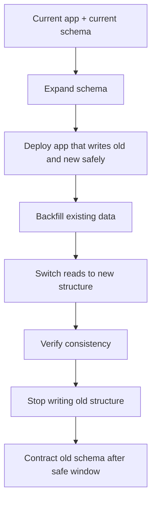
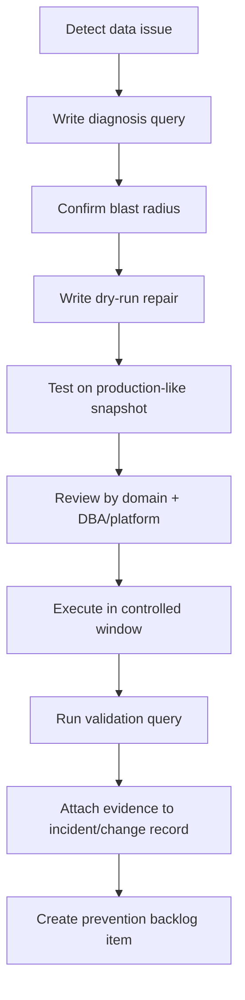
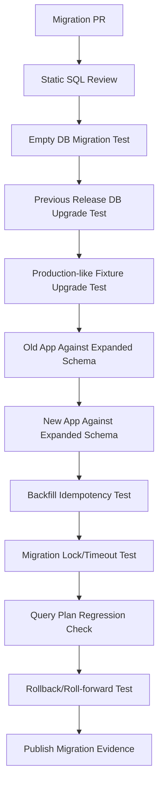

# Part 058 — Migration Testing, Data Repair Testing, and Backward Compatibility Testing

## 1. Source notes and scope boundary

This part uses public documentation and general production engineering practice.

Public references to verify independently:

- PostgreSQL documentation describes lock behavior for `ALTER TABLE`, `CREATE INDEX CONCURRENTLY`, `NOT VALID` constraints, validation, and transaction behavior.
- Flyway and Liquibase are widely used tools for versioning and deploying database changes.
- Liquibase documents rollback and `update-testing-rollback` workflows.
- Testcontainers can run real PostgreSQL instances for migration and integration testing.
- Internal CSG tooling may use Flyway, Liquibase, custom migration runners, platform-managed upgrade jobs, Helm hooks, GitOps jobs, or customer-specific installers. Verify internally.

This part does not assume the actual migration tool, release topology, on-prem upgrade process, or production data repair policy used by CSG Quote & Order.

---

## 2. Core thesis

A database migration is not a file.

It is a production event.

It changes the shape, meaning, constraints, performance, and compatibility of the system of record.

For Quote & Order systems, a bad migration can:

- block quote creation;
- corrupt approval evidence;
- invalidate pricing snapshots;
- duplicate orders;
- break fulfillment callbacks;
- lose tenant isolation;
- make old app versions crash during rolling deploy;
- make rollback impossible;
- break customer on-prem upgrades;
- force manual data repair under incident pressure.

Migration testing exists to prevent this.

---

## 3. Migration testing is not just “does the migration run?”

A migration can run successfully and still be unsafe.

You must test:

- forward migration;
- backward compatibility with old application;
- forward compatibility with new application;
- rolling deploy coexistence;
- backfill correctness;
- lock behavior;
- query plan regression;
- data volume runtime;
- constraint validation;
- rollback or roll-forward path;
- observability;
- data repair path;
- on-prem upgrade path.

The right question is not:

> Did SQL execute?

The right question is:

> Can production survive this change under real data, real traffic, real version skew, and real operational constraints?

---

## 4. Migration taxonomy

Different migrations need different test strategies.

| Migration type | Example | Main risk |
|---|---|---|
| Additive schema | Add nullable column | App compatibility, backfill later |
| Destructive schema | Drop column/table | Old version crash, data loss |
| Constraint change | Add unique/check/FK/not-null | Table scan, lock, existing bad data |
| Index change | Add/drop index | Lock, build time, query regression |
| Data migration | Move/transform existing data | Incorrect transformation |
| Backfill | Populate new column | Runtime, locks, partial progress |
| Semantic migration | Change meaning of state/code | Old data interpreted wrongly |
| Trigger/function change | PL/pgSQL update | Hidden behavior shift |
| Partitioning change | Add partition strategy | routing, query plans, operational complexity |
| Tenant migration | Add tenant predicate/partition | cross-tenant leakage |
| Audit migration | Change audit schema | evidence loss |
| Outbox/inbox migration | Change event schema/state | duplicate/missed event risk |

Treat each type as a different failure model.

---

## 5. Internal verification checklist

Before designing migration tests, verify:

- What migration tool is used?
- Are migrations SQL-based, Java-based, XML/YAML-based, or custom?
- Are migrations run inside application startup, CI/CD, Helm hook, GitOps job, or manual release step?
- Are migrations transactional by default?
- How are non-transactional migrations handled?
- How is `CREATE INDEX CONCURRENTLY` handled?
- Is there a pre-deploy migration phase?
- Is there a post-deploy migration phase?
- Is expand-contract required?
- Are backfills synchronous or async jobs?
- Is there a migration dry-run environment?
- Is production-like data available?
- Are on-prem customers upgraded by installer/package/manual DBA process?
- Is rollback supported or is roll-forward preferred?
- Who approves data repair scripts?
- Where are previous failed migrations documented?
- Are migration runtime metrics captured?
- Are large-table row counts known?
- Are lock timeout and statement timeout configured?

---

## 6. Expand-contract as default strategy

Zero-downtime migration usually follows expand-contract.



The key property:

> Each step must be compatible with the step before and after it.

### 6.1 Example: adding quote approval basis hash

Unsafe migration:

1. Add `approval_basis_hash NOT NULL`.
2. Deploy new code.

Risk:

- existing rows violate NOT NULL;
- old app does not populate field;
- table scan blocks writes;
- approval retrieval fails for historical quotes.

Safer expand-contract:

1. Add nullable `approval_basis_hash`.
2. Deploy code that writes it for new approvals.
3. Backfill old approved quotes in chunks.
4. Add check/validation once backfill complete.
5. Switch code to require it for new approvals.
6. Optionally enforce stricter constraint later.

---

## 7. Backward compatibility test matrix

For rolling deploy, test version pairs.

| Schema | App version | Expected behavior |
|---|---|---|
| old schema | old app | baseline works |
| expanded schema | old app | old app still works |
| expanded schema | new app | new app works |
| partially backfilled schema | new app | new app tolerates missing data |
| fully backfilled schema | new app | new app uses new data |
| contracted schema | old app | should not occur unless old app removed |
| contracted schema | new app | works |

This matrix matters because Kubernetes rolling deploys create version skew.

On-prem upgrades create even more skew if customer installs database and application separately.

---

## 8. Migration test environment with real PostgreSQL

Use real PostgreSQL.

Do not rely only on H2 or mocked database behavior.

PostgreSQL-specific behavior matters:

- lock levels;
- isolation semantics;
- `CREATE INDEX CONCURRENTLY` restrictions;
- `ALTER TABLE` lock behavior;
- JSONB operators;
- partial index predicate;
- query planner statistics;
- constraint validation;
- PL/pgSQL execution;
- trigger behavior;
- time zone/date behavior;
- decimal precision;
- collation.

### 8.1 Baseline migration smoke test

```java
@Test
void shouldMigrateEmptyDatabaseToLatestSchema() {
  PostgreSQLContainer<?> postgres = new PostgreSQLContainer<>("postgres:16");
  postgres.start();

  runMigrations(postgres.getJdbcUrl(), postgres.getUsername(), postgres.getPassword());

  assertTableExists("quote");
  assertTableExists("product_order");
  assertTableExists("outbox_event");
}
```

This is necessary.

But not sufficient.

---

## 9. Production-like data testing

Empty database migration tests catch syntax mistakes.

Production-like data tests catch reality.

Seed data should include:

- old quote versions;
- accepted quotes;
- expired quotes;
- rejected quotes;
- quote with missing optional fields;
- product orders in every state;
- order items with fallout;
- old catalog versions;
- retired offerings;
- customer with agreement;
- customer without agreement;
- duplicate historical data if possible;
- tenant A and tenant B data;
- audit rows;
- outbox rows pending relay;
- inbox processed-message rows;
- integration attempt rows;
- large row counts for hot tables.

### 9.1 Data shape matters more than data size initially

First test weird shapes.

Then test volume.

A 10 million row happy-path dataset may miss the one historical state that breaks a migration.

---

## 10. Backfill testing

Backfill is not just update SQL.

Backfill is a long-running production job with partial progress.

Test:

- idempotency;
- chunking;
- ordering;
- resume after crash;
- retry after deadlock;
- lock timeout handling;
- statement timeout handling;
- tenant scoping;
- auditability;
- progress metrics;
- safe throttling;
- data validation query;
- no duplicate side effects;
- no Kafka event storm unless intentionally emitted.

### 10.1 Bad backfill pattern

```sql
UPDATE quote
SET approval_basis_hash = calculate_hash(approval_payload)
WHERE state = 'APPROVED';
```

Problems:

- one huge transaction;
- table bloat;
- long locks;
- no progress checkpoint;
- hard rollback;
- no tenant throttling;
- hard to resume.

### 10.2 Safer chunked pattern

```sql
UPDATE quote
SET approval_basis_hash = calculate_hash(approval_payload),
    updated_at = now()
WHERE id IN (
  SELECT id
  FROM quote
  WHERE state = 'APPROVED'
    AND approval_basis_hash IS NULL
  ORDER BY id
  LIMIT 500
)
RETURNING id;
```

Production implementation should add:

- checkpoint;
- retry;
- metrics;
- timeout;
- dry-run mode;
- validation query;
- tenant filter if multi-tenant.

---

## 11. Lock and runtime testing

A migration may be logically correct but operationally unsafe.

Test or estimate:

- lock level;
- lock duration;
- table scan duration;
- index build duration;
- row rewrite risk;
- replication lag;
- vacuum impact;
- write amplification;
- bloat;
- impact on hot queries.

### 11.1 Lock test example

Create a test where one transaction holds a write lock, then run migration with short `lock_timeout`.

Expected behavior:

- migration fails fast;
- failure is visible;
- database not left half-changed;
- deployment pipeline stops;
- runbook explains retry.

### 11.2 Why `lock_timeout` matters

Without bounded lock waiting, migration can silently queue behind long transaction and then block production traffic when it finally acquires lock.

Use controlled timeouts and retry windows.

Do not assume every migration should wait forever.

---

## 12. Testing `CREATE INDEX CONCURRENTLY`

For large production tables, normal index creation may block writes.

`CREATE INDEX CONCURRENTLY` is often safer for write availability, but it has constraints:

- cannot run inside a transaction block;
- takes longer;
- waits for relevant concurrent transactions;
- only one concurrent index build per table at a time;
- can leave invalid index if interrupted;
- requires cleanup/retry plan.

Migration tests should verify:

- tool supports non-transactional migration;
- migration file is marked appropriately;
- failed concurrent index build is detected;
- invalid index cleanup is documented;
- query plan uses the new index after analyze/statistics update.

---

## 13. Testing constraints safely

Adding constraints to existing large tables requires care.

### 13.1 Constraint test dimensions

Test:

- existing data violations;
- error message clarity;
- lock behavior;
- application behavior before validation;
- application behavior after validation;
- rollback/roll-forward path;
- repair query for violating rows.

### 13.2 Safe rollout pattern

For eligible constraints:

1. Add constraint as not yet fully validated if supported.
2. Fix existing bad data.
3. Validate constraint in controlled window.
4. Update application assumptions.

Always verify the actual PostgreSQL version and constraint type.

Capabilities vary by version and operation.

---

## 14. Data repair testing

Data repair scripts are production code.

They need tests.

A data repair script should have:

- clear problem statement;
- incident/reference ticket;
- target rows query;
- dry-run mode;
- expected row count;
- before/after sample;
- tenant scoping;
- transaction strategy;
- idempotency;
- audit insert;
- rollback or compensating script;
- validation query;
- approval record;
- execution log.

### 14.1 Repair script lifecycle



### 14.2 Example repair test

Problem:

- quote is `APPROVED`, but approval evidence row missing due to historical bug.

Test data:

- quote with valid evidence;
- quote missing evidence;
- quote not approved;
- quote from another tenant;
- quote already repaired.

Assertions:

- only target quote is repaired;
- repair is idempotent;
- audit row is written;
- dry-run reports same row count as execution;
- validation query passes;
- no Kafka event emitted unless explicitly intended.

---

## 15. Migration testing for audit and compliance evidence

Audit tables are dangerous to migrate casually.

Test:

- historical audit rows remain readable;
- actor attribution remains intact;
- before/after payloads remain interpretable;
- approval evidence can still be reconstructed;
- retention policy is not violated;
- redaction/masking still works;
- export/reporting still works;
- old audit schema is migrated or version-aware reader exists.

Do not rewrite audit history without explicit governance.

If transformation is required, preserve original evidence or transformation metadata.

---

## 16. Migration testing for tenant isolation

Tenant migrations require extra paranoia.

Test:

- every new row has tenant ID;
- backfill assigns correct tenant;
- unique constraints include tenant where required;
- indexes include tenant predicates/order where required;
- queries do not leak cross-tenant data;
- repair scripts are tenant-scoped;
- migration does not derive tenant from ambiguous relationship;
- shared reference data remains intentionally shared.

Bad migration example:

```sql
UPDATE quote_item qi
SET tenant_id = q.tenant_id
FROM quote q
WHERE qi.quote_id = q.id;
```

This looks fine only if `quote_id` is globally unique.

If `quote_id` is tenant-scoped or externally generated, this may cross-link data.

Verify keys.

---

## 17. Migration testing for event/outbox compatibility

Outbox migrations can break asynchronous systems.

Test:

- pending outbox rows from old version still relay;
- new relay can parse old payload;
- old relay ignores new columns;
- event schema version is explicit;
- replay of old events still works;
- duplicate relay after migration is deduplicated;
- migration does not reset processed-message records;
- consumer offsets are not assumed to match database migration state.

Important invariant:

> A schema migration must not make unprocessed events unreadable.

---

## 18. Backward compatibility of application code

Application code must tolerate migration phases.

Patterns:

- read old field if new field missing;
- write both old and new during transition;
- treat missing backfill as unknown, not false;
- avoid assuming new constraint before validation;
- avoid deleting fallback code before all environments upgraded;
- gate behavior with feature flag when needed.

### 18.1 Example: safe reader

```java
ApprovalBasis basis = row.approvalBasisHash() != null
    ? ApprovalBasis.fromHash(row.approvalBasisHash())
    : ApprovalBasis.fromLegacyPayload(row.approvalPayload());
```

Delete fallback only after:

- all supported environments migrated;
- backfill validated;
- old app versions unsupported;
- contract window closed.

---

## 19. On-prem and customer-upgrade testing

On-prem changes are harder than SaaS-only changes.

Reasons:

- customer controls maintenance window;
- database version may vary;
- migration may be run by customer DBA;
- network may be restricted;
- observability may be limited;
- rollback may depend on customer backups;
- support team may not have direct access;
- air-gapped installation may not fetch external artifacts.

Test:

- upgrade from every supported previous version;
- upgrade with customer-modified config;
- upgrade with large database;
- upgrade with interrupted migration;
- upgrade with pre-existing bad data;
- upgrade with old integration adapters;
- upgrade package integrity;
- upgrade documentation accuracy.

---

## 20. Migration observability

Every migration/backfill should emit signals.

Minimum:

- migration name/version;
- start time;
- end time;
- status;
- duration;
- rows affected;
- current chunk;
- failure reason;
- lock timeout count;
- retry count;
- validation result;
- tenant if scoped;
- correlation/change ID.

Backfill dashboard should show:

- total rows needing backfill;
- rows completed;
- rows failed;
- estimated remaining time;
- current rate;
- error rate;
- lock/deadlock count;
- DB CPU/IO impact.

---

## 21. CI/CD migration test suite

Recommended test stages:



Not every migration needs every gate.

But high-risk migrations do.

High-risk means:

- large table;
- hot table;
- destructive change;
- constraint change;
- state semantic change;
- tenant boundary change;
- audit evidence change;
- order/quote lifecycle change;
- outbox/event change;
- customer-facing API dependency.

---

## 22. Query plan regression after migration

A migration can pass functionally but destroy performance.

Test key queries before/after:

- quote search;
- quote detail retrieval;
- order search;
- order state dashboard;
- fallout queue;
- outbox relay query;
- inbox dedupe lookup;
- catalog lookup;
- customer installed base lookup;
- audit reconstruction.

Capture:

- `EXPLAIN (ANALYZE, BUFFERS)`;
- estimated rows vs actual rows;
- index used;
- execution time;
- buffer reads;
- sort/hash spill;
- sequential scan on large table.

A schema migration is not done until hot query regressions are checked.

---

## 23. Rollback vs roll-forward

Rollback is not always safe.

Examples:

- migration transformed data destructively;
- new app already wrote new format;
- external events already published;
- fulfillment side effects already occurred;
- audit rows already emitted;
- old schema cannot represent new business state.

For many production systems, roll-forward is safer.

But you still need an emergency plan.

### 23.1 Decision checklist

Ask:

- Can old code read new data?
- Can old schema store new writes?
- Are external side effects reversible?
- Were Kafka events emitted?
- Can customers see inconsistent state?
- Is the issue code-level or data-level?
- Is data repair required before rollback?
- Is feature flag disable enough?
- Can we stop traffic and resume safely?

---

## 24. Senior-level migration PR review checklist

When reviewing migration PRs, ask:

- What production table is affected?
- How many rows exist?
- Is the table hot?
- What lock will this take?
- How long can it run?
- Is there `lock_timeout` or `statement_timeout`?
- Does this run inside a transaction?
- Is non-transactional behavior intentional?
- Does old app work after this migration?
- Does new app work before backfill completes?
- Is backfill chunked and resumable?
- Is repair script idempotent?
- Is tenant boundary preserved?
- Are audit records preserved?
- Are outbox/inbox records compatible?
- Are query plans checked?
- Is rollback/roll-forward plan documented?
- Is on-prem upgrade impact understood?
- Is operational evidence attached?
- Is support/runbook updated?

Migration PRs deserve architecture-level review when they touch business-critical data.

---

## 25. Practical testing blueprint

For each high-risk migration, create a test plan with these sections:

1. **Intent** — what business capability or bug fix requires this change?
2. **Affected data** — tables, rows, tenants, states.
3. **Compatibility** — old app/new schema, new app/old data.
4. **Backfill** — chunk size, resume, validation.
5. **Locks** — expected lock level and timeout.
6. **Performance** — hot query plans before/after.
7. **Rollback/roll-forward** — realistic recovery path.
8. **On-prem** — installer/DBA/support implications.
9. **Observability** — metrics/logs/progress.
10. **Evidence** — test results, dry-run output, validation queries.

---

## 26. Learning exercises

### Exercise 1 — Classify recent migrations

Find the last 10 database migrations.

Classify each as:

- additive;
- destructive;
- constraint;
- index;
- data migration;
- semantic migration;
- trigger/function;
- tenant-related;
- audit-related.

For each, ask whether tests matched risk.

### Exercise 2 — Design a backfill test

Pick a nullable field that should eventually become required.

Design:

- expand migration;
- new write behavior;
- backfill job;
- validation query;
- contract migration;
- rollback/roll-forward plan.

### Exercise 3 — Build old/new compatibility matrix

For one feature, define:

- old app + old schema;
- old app + new schema;
- new app + new schema before backfill;
- new app + new schema after backfill;
- post-contract schema.

### Exercise 4 — Write a data repair dry-run

Create a repair script shape that:

- selects target rows;
- reports count;
- prints sample IDs;
- executes only with explicit flag;
- writes audit;
- validates outcome.

---

## 27. Part summary

Migration testing is production risk management.

For Quote & Order systems, schema and data changes are dangerous because they affect:

- quote lifecycle;
- order lifecycle;
- pricing evidence;
- approval authority;
- tenant isolation;
- audit defensibility;
- fulfillment state;
- Kafka/outbox continuity;
- customer upgrade safety.

A senior engineer treats every high-risk migration as a controlled production change.

The core rule:

> A migration is ready only when it has been tested against version skew, production-like data, partial progress, operational failure, and recovery path — not merely when SQL executes successfully.

