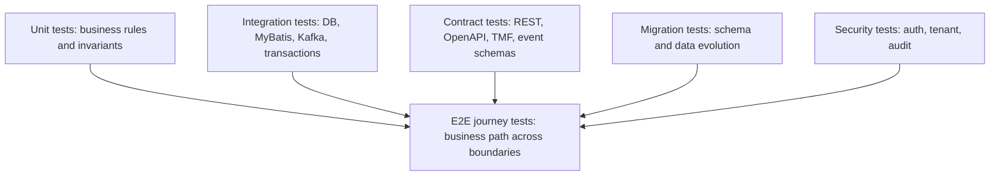
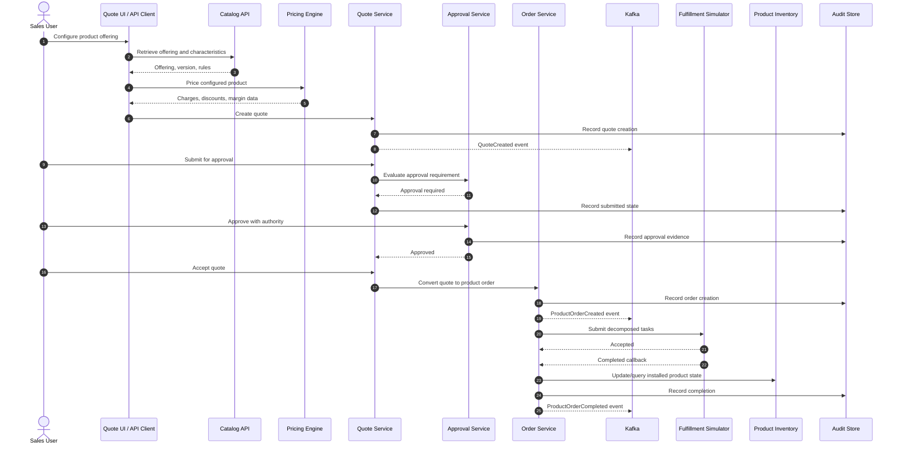

# Part 059 — End-to-End Testing for Quote-to-Cash Journeys

## 1. Source notes and scope boundary

This part uses public tooling documentation and general production engineering practice.

Public references to verify independently:

- Playwright is positioned publicly as tooling for reliable end-to-end testing across Chromium, Firefox, and WebKit.
- Cypress documentation covers browser-based end-to-end testing and application testing flows.
- TM Forum Open APIs such as TMF620, TMF648, TMF622, TMF637, and TMF641 provide useful industry vocabulary for catalog, quote, product order, product inventory, and service order flows.
- CSG publicly describes Quote & Order and quote-to-cash capabilities, but this part does not assume any private CSG test framework, environment topology, customer fixture, or delivery pipeline.

This part does not assume whether CSG Quote & Order uses Playwright, Cypress, Selenium, Karate, REST Assured, Postman/Newman, Robot Framework, custom test harnesses, or platform-managed synthetic transaction tooling.

Every internal claim must be verified in the codebase, CI pipeline, environment documentation, and team onboarding sessions.

---

## 2. Core thesis

End-to-end testing is not about testing everything through the browser.

For Quote & Order systems, end-to-end testing is about proving that a commercially meaningful journey survives realistic system boundaries.

A good E2E test answers:

> Can a customer-facing business intent move through catalog, pricing, quote, approval, order, decomposition, fulfillment handoff, inventory/billing-adjacent state, and observability without violating lifecycle invariants?

A bad E2E test answers only:

> Can this button click another button in a controlled environment?

The first protects revenue workflows.

The second often becomes slow noise.

---

## 3. Why E2E testing is different in Quote-to-Cash

In a normal CRUD system, E2E may validate that a user can create, edit, and delete a record.

In Quote-to-Cash, the system is not just storing records. It transforms business commitments.

A single journey may cross:

- product catalog;
- product configuration;
- eligibility rules;
- pricing rules;
- discount policy;
- margin guardrails;
- approval workflow;
- quote acceptance;
- order creation;
- order validation;
- order decomposition;
- service ordering or fulfillment adapters;
- product inventory;
- billing handoff;
- audit logging;
- Kafka events;
- reporting/read models;
- support/fallout workflows.

The dangerous failures are often cross-boundary:

- quote accepted with stale price;
- approved discount not preserved during order conversion;
- quote item hierarchy changed during conversion;
- order item action incorrectly mapped to fulfillment;
- duplicate order created after retry;
- customer-specific agreement ignored;
- catalog version mismatch between quote and order;
- fulfillment callback updates the wrong item;
- billing handoff misses a recurring charge;
- audit trail cannot reconstruct who approved a margin exception;
- tenant leakage in search/export path;
- E2E test passes while Kafka event contract is broken because the test never checks the event.

E2E testing must therefore validate the journey as a business state transition, not just the UI path.

---

## 4. The testing stack: do not overload E2E

E2E tests are valuable, but expensive.

They should not replace:

- unit tests for pricing and lifecycle invariants;
- integration tests for PostgreSQL transactions and MyBatis mappers;
- Kafka consumer/producer tests;
- contract tests for REST and event schemas;
- migration tests;
- security negative tests;
- performance tests.

Think in terms of evidence layers:



E2E should prove that the separately tested pieces compose correctly.

If a pricing rule has 500 edge cases, do not test all 500 through E2E.

Test the pricing engine with unit/integration tests.

Then choose a small number of E2E journeys that prove pricing is wired correctly into quote, approval, order conversion, and audit.

---

## 5. Journey taxonomy

A serious Quote-to-Cash E2E suite should classify journeys by business risk.

### 5.1 Golden-path journeys

Golden path proves the normal business flow works.

Examples:

- new customer quote for a simple standalone product;
- quote with recurring and non-recurring charges;
- quote approval below threshold;
- quote acceptance and order creation;
- order decomposition and successful fulfillment callback;
- completed order visible in product inventory or downstream handoff state.

Golden path is necessary but insufficient.

Most production incidents are not caused by the easiest path.

### 5.2 Commercial-risk journeys

Commercial-risk journeys protect revenue and margin.

Examples:

- enterprise agreement price override;
- discount stacking with max discount guardrail;
- margin exception requiring approval;
- quote expiry before acceptance;
- stale price after catalog price update;
- customer-specific catalog eligibility;
- bundle price recalculation after child item removal;
- renewal/amendment based on installed base.

These should be prioritized because failures can create revenue leakage or customer disputes.

### 5.3 Lifecycle-risk journeys

Lifecycle-risk journeys protect state machine correctness.

Examples:

- double submit of quote acceptance;
- retry order creation after timeout;
- cancellation while order is in progress;
- amendment while existing order has pending fulfillment tasks;
- partial fulfillment with one failed item;
- fallout and manual resume;
- replayed Kafka event;
- duplicate callback from downstream.

These are the journeys that expose weak lifecycle invariants.

### 5.4 Integration-risk journeys

Integration-risk journeys protect external boundaries.

Examples:

- CRM customer lookup unavailable;
- pricing service latency timeout;
- fulfillment adapter returns accepted but callback never arrives;
- billing handoff succeeds but acknowledgment is delayed;
- inventory lookup returns stale installed base;
- partner API returns duplicate response;
- external system accepts request but local service crashes before persisting correlation.

These tests often require simulators, controllable fake downstreams, or test doubles with production-like protocols.

### 5.5 Security-risk journeys

Security-risk journeys protect business authority.

Examples:

- user without approval authority cannot approve margin exception;
- sales user cannot modify accepted quote;
- support user cannot override discount without audited reason;
- tenant A cannot retrieve tenant B quote;
- forged token cannot access order API;
- service token cannot perform user-only transition;
- audit event exists for privileged override.

Security journeys overlap with Part 060 and should be present in both security and E2E layers.

---

## 6. A reference quote-to-cash E2E journey

A high-value end-to-end journey should be explicit about state transitions and evidence.



This journey is only useful if the test asserts the important evidence.

Not just HTTP 200.

Not just final UI message.

The test should assert:

- quote exists with expected catalog version snapshot;
- quote prices match expected recurring/non-recurring charges;
- discount and approval metadata are preserved;
- quote state transitions are legal;
- quote cannot be accepted before approval;
- quote conversion is idempotent;
- order is created once;
- order item hierarchy matches quote item hierarchy;
- decomposition plan is valid;
- fulfillment correlation ID is recorded;
- completion callback updates correct order item;
- business events are emitted;
- audit events reconstruct the journey;
- tenant boundary is maintained;
- observability identifiers propagate.

---

## 7. Test scope: UI E2E vs API E2E vs workflow E2E

Do not collapse all E2E into browser tests.

### 7.1 UI E2E

Use UI E2E when the risk is user journey correctness:

- configuration wizard flow;
- quote line editing;
- approval screen;
- fallout operator UI;
- validation error visibility;
- role-based UI action availability.

UI E2E is expensive because it depends on browser, UI state, frontend timing, backend, data, and environment.

Keep it small.

### 7.2 API E2E

Use API E2E when the risk is backend journey correctness:

- create quote;
- submit approval;
- approve;
- accept;
- create order;
- check state;
- simulate callback;
- assert events/audit.

API E2E is usually faster and more stable than UI E2E.

It is often the best default for backend-heavy enterprise products.

### 7.3 Workflow E2E

Use workflow E2E when the risk is asynchronous orchestration:

- Kafka event propagation;
- outbox relay;
- saga state;
- process manager timeout;
- fulfillment callback;
- reconciliation job;
- read model projection.

Workflow E2E should be explicit about waiting conditions and timeouts.

Never use arbitrary sleeps as the primary synchronization mechanism.

---

## 8. Deterministic test data model

Most E2E suites fail because test data is treated as an afterthought.

Quote-to-Cash E2E needs controlled data across multiple domains:

- tenant;
- user;
- role/permission;
- customer;
- account;
- agreement;
- product catalog;
- product offering;
- price list;
- discount policy;
- approval policy;
- installed base/product inventory;
- fulfillment simulator behavior;
- billing handoff simulator behavior;
- feature flags;
- environment configuration.

A good test fixture is versioned and intentional.

A bad test fixture is “whatever data exists in QA”.

### 8.1 Recommended fixture shape

For each journey, define:

```yaml
journey: enterprise-discount-requires-approval
fixtureVersion: 2026-07-quote-order-e2e-v1
tenant: tenant-e2e-commercial
customer:
  id: customer-acme-enterprise
  segment: enterprise
account:
  id: account-acme-parent
agreement:
  id: agreement-acme-2026
  discountEntitlement: 15_percent
catalog:
  offeringId: fiber-internet-enterprise-bundle
  catalogVersion: cat-2026-07-v3
pricing:
  currency: USD
  recurringCharge: 1000.00
  nonRecurringCharge: 250.00
approval:
  discountRequested: 20_percent
  expectedApprovalRequired: true
users:
  salesUser: sales-e2e-user
  approverUser: approver-margin-authority
fulfillment:
  simulatorMode: success-after-accepted
expected:
  finalOrderState: completed
  auditEvents:
    - QuoteCreated
    - QuoteSubmittedForApproval
    - QuoteApproved
    - QuoteAccepted
    - ProductOrderCreated
    - ProductOrderCompleted
```

This is not necessarily the exact internal format.

The important property is explicitness.

The test should not silently depend on floating catalog state.

---

## 9. Catalog fixture discipline

Catalog-driven systems are especially hard to test because catalog is a moving target.

The E2E suite must know which catalog behavior it is testing.

Recommended strategy:

- small synthetic catalog for stable E2E;
- one or two production-like catalog snapshots for realism;
- explicit effective date;
- explicit catalog version;
- clear product offering IDs;
- clear characteristic constraints;
- clear bundle hierarchy;
- known price list;
- known eligibility rules;
- known approval triggers.

Avoid tests that rely on “latest catalog”.

Latest catalog is useful for exploratory smoke testing, not deterministic regression testing.

### 9.1 Catalog-related E2E assertions

Assert that:

- quote stores catalog version or effective snapshot reference;
- quote items reference expected offering/specification IDs;
- product characteristic values are preserved;
- order conversion uses the quote snapshot, not an unintended live catalog lookup;
- catalog update after quote creation does not silently alter accepted commercial terms;
- invalid offering configuration fails before order creation.

---

## 10. Environment strategy

E2E test value depends heavily on environment fidelity.

### 10.1 Local developer E2E

Goal:

- fast workflow validation;
- smoke check before PR;
- local debugging.

Typical constraints:

- local services may be mocked;
- external systems simulated;
- data small;
- observability partial.

Local E2E should not pretend to prove production readiness.

### 10.2 PR environment

Goal:

- catch regressions before merge;
- validate API/workflow compatibility;
- prove migrations and journey compatibility.

Typical constraints:

- must be deterministic;
- must finish within reasonable CI budget;
- should use synthetic stable data;
- should avoid dependency on shared mutable QA data.

### 10.3 Shared integration environment

Goal:

- validate cross-service integration;
- run broader journey suite;
- detect environment drift;
- exercise deployment packaging.

Risk:

- data pollution;
- test interdependence;
- flaky behavior from parallel teams;
- stale services.

### 10.4 Pre-production/staging

Goal:

- release confidence;
- production-like integration;
- upgrade/migration validation;
- operational readiness.

Staging E2E should include production-like observability and runbook validation.

### 10.5 Customer/on-prem validation

Goal:

- prove installer/upgrade compatibility;
- validate customer-specific configuration;
- validate local identity/network/certificate constraints.

This is often less automated than cloud CI, but should still have scripted smoke journeys.

---

## 11. Downstream simulators and controllable fakes

Real downstream systems are often unavailable, expensive, unstable, or customer-specific.

A serious E2E suite needs controllable simulators.

For fulfillment simulator, support modes such as:

- accept immediately;
- reject immediately;
- accept then complete;
- accept then fail one item;
- accept then callback duplicate;
- accept then callback out of order;
- accept then never callback;
- timeout;
- return malformed payload;
- return duplicate external order ID;
- return partial success;
- return business validation error;
- return transient technical error.

For billing simulator, support modes such as:

- accept billing handoff;
- reject missing charge;
- reject invalid tax/currency;
- delay acknowledgment;
- duplicate acknowledgment;
- unknown outcome.

For CRM/customer simulator:

- customer exists;
- customer not found;
- account hierarchy changes;
- customer disabled;
- PII unavailable;
- transient failure;
- stale cache scenario.

The simulator itself must be versioned and contract-tested.

A fake that is too convenient creates false confidence.

---

## 12. Synchronization and async waiting

E2E tests often become flaky because they wait incorrectly.

Bad waiting:

```java
Thread.sleep(10_000);
```

Better waiting:

- poll order state until expected terminal/intermediate state;
- wait for Kafka event by correlation ID;
- wait for outbox row processed flag;
- wait for saga state transition;
- wait for audit event by business key;
- wait for trace/log marker if supported;
- use bounded timeout and diagnostic capture on failure.

A good await helper should include:

- timeout;
- polling interval;
- business key;
- last observed state;
- diagnostic dump on failure;
- no unbounded wait.

Pseudo-shape:

```java
await()
    .atMost(Duration.ofSeconds(60))
    .pollInterval(Duration.ofMillis(500))
    .untilAsserted(() -> {
        OrderView order = orderClient.getOrder(orderId);
        assertThat(order.state()).isEqualTo("COMPLETED");
        assertThat(order.items()).allMatch(item -> item.state().equals("COMPLETED"));
    });
```

The test should fail with enough evidence to debug:

- quote ID;
- order ID;
- tenant ID;
- correlation ID;
- expected state;
- last observed state;
- recent audit events;
- recent emitted events;
- saga/process state;
- downstream simulator interactions.

---

## 13. E2E assertion strategy

Do not assert everything.

Assert the high-value business evidence.

### 13.1 Minimum assertions for quote journey

For quote creation/configuration:

- quote state is expected;
- quote item count and hierarchy are expected;
- product offering references are expected;
- catalog version/snapshot is expected;
- selected characteristic values are expected;
- recurring/non-recurring charges are expected;
- discount policy is applied correctly;
- validation errors are meaningful for invalid configuration.

### 13.2 Minimum assertions for approval journey

For approval:

- approval is required when threshold exceeded;
- unauthorized user cannot approve;
- authorized approver can approve;
- approval captures reason/evidence;
- quote cannot be changed after approval without invalidating approval if policy requires it;
- audit event records actor and authority.

### 13.3 Minimum assertions for order journey

For order:

- order is created once;
- quote-to-order conversion preserves commercial snapshot;
- order item actions are correct;
- order state transitions are legal;
- idempotent retry returns same order or safe response;
- product order event emitted once or duplicate-safe;
- fulfillment correlation recorded;
- downstream callback updates correct item;
- completed state is consistent at header and item levels.

### 13.4 Minimum assertions for observability

For observability:

- response contains or logs correlation ID;
- events contain correlation and causation IDs;
- audit events contain business identifiers;
- failure path emits actionable signal;
- no sensitive data appears in logs/events where prohibited.

---

## 14. High-value journey catalog

The suite should be small but strong.

### 14.1 Journey 1 — Simple new sale

Purpose:

- baseline system health;
- quote-to-order happy path;
- order completion.

Flow:

1. Create customer context.
2. Load product offering.
3. Configure valid product.
4. Price product.
5. Create quote.
6. Accept quote.
7. Convert to order.
8. Simulate fulfillment success.
9. Assert order complete.
10. Assert audit/events.

Why it matters:

- catches broken wiring between major systems.

Limit:

- does not prove enterprise complexity.

### 14.2 Journey 2 — Enterprise agreement with discount approval

Purpose:

- protect commercial governance.

Flow:

1. Use enterprise customer with agreement.
2. Configure eligible product.
3. Apply discount above sales threshold.
4. Confirm approval required.
5. Attempt unauthorized approval and expect denial.
6. Approve with authorized approver.
7. Accept quote.
8. Convert to order.
9. Assert price/discount/approval evidence preserved.

Why it matters:

- prevents margin leakage and approval bypass.

### 14.3 Journey 3 — Stale catalog/price invalidation

Purpose:

- protect snapshot semantics.

Flow:

1. Create quote using catalog version A.
2. Change/publish catalog version B in test fixture.
3. Attempt quote acceptance or reprice depending on policy.
4. Assert expected behavior: either preserved snapshot or explicit reprice requirement.

Why it matters:

- catches hidden live lookup bugs.

### 14.4 Journey 4 — Installed base amendment

Purpose:

- protect customer reality and product inventory mapping.

Flow:

1. Seed installed product inventory.
2. Create amendment quote.
3. Validate change against existing product.
4. Convert to order with modify/delete/add item actions.
5. Simulate fulfillment.
6. Assert inventory state changed as expected.

Why it matters:

- amendment is often more complex than new sale.

### 14.5 Journey 5 — Partial fulfillment fallout and resume

Purpose:

- protect operational recovery.

Flow:

1. Create accepted order with multiple items.
2. Decompose into fulfillment tasks.
3. Fulfillment simulator completes one task and fails another.
4. Assert order enters fallout/partial state.
5. Operator resumes or retries failed task.
6. Assert final completion and audit trail.

Why it matters:

- most real-world order management requires recovery.

### 14.6 Journey 6 — Duplicate submit and duplicate callback

Purpose:

- protect idempotency.

Flow:

1. Accept quote with idempotency key.
2. Repeat same request after simulated timeout.
3. Assert only one order exists.
4. Send duplicate fulfillment callback.
5. Assert state remains correct and no duplicate inventory/billing effect occurs.

Why it matters:

- duplicate side effects are common in distributed systems.

### 14.7 Journey 7 — Cross-tenant negative journey

Purpose:

- protect tenant isolation.

Flow:

1. Create quote/order in tenant A.
2. Authenticate as tenant B user.
3. Attempt read/update/search/export.
4. Assert denial or not found according to policy.
5. Assert audit/security signal if required.

Why it matters:

- cross-tenant leakage is severe.

---

## 15. UI E2E design principles

When testing through UI, prioritize journeys where UI state and user interaction matter.

Useful UI assertions:

- validation message appears before submit;
- unavailable product option is not selectable;
- approval action is hidden or disabled for unauthorized user;
- price recalculation indicator completes;
- stale quote warning is visible;
- operator can see fallout reason;
- audit/history panel shows key transition.

Avoid brittle UI assertions:

- exact CSS class names;
- arbitrary DOM structure;
- animation timing;
- full text snapshots for pages with unrelated dynamic content;
- assuming all backend details through UI.

Prefer stable selectors and domain-visible labels.

Example selector policy:

```tsx
<button data-testid="quote-submit-for-approval">
  Submit for Approval
</button>
```

But do not make `data-testid` a substitute for accessibility.

Use accessible roles/labels where practical.

---

## 16. API E2E design principles

API E2E is often the best layer for backend-heavy Quote & Order journeys.

A typical API E2E test should:

- authenticate as a realistic user/service;
- create or select deterministic fixture data;
- call public or near-public API boundaries;
- assert response contract;
- assert persisted business state;
- assert events/audit when relevant;
- simulate downstream behavior explicitly;
- clean up or use unique tenant/test namespace;
- emit useful diagnostics.

Avoid using private repository methods directly in E2E assertions unless there is no reasonable external observation path.

E2E should exercise the system as a deployed product, not as a unit test with HTTP decoration.

---

## 17. Business event assertions

For event-driven systems, final API state is not enough.

Assert key event facts:

- expected event type emitted;
- event has correct aggregate ID;
- event has correct tenant ID;
- event has correlation ID;
- event has causation ID;
- event schema version is expected;
- event payload contains stable business fields;
- event does not contain forbidden PII;
- duplicate commands do not emit duplicate business events unless duplicate-safe semantics are explicit;
- replayed events do not corrupt read models.

Do not assert every field unless that field is part of the contract.

Over-asserting event payloads makes tests brittle.

Under-asserting event payloads misses integration regressions.

---

## 18. Audit assertions

Audit is often forgotten in E2E.

For enterprise Quote & Order, audit is not optional evidence.

E2E tests should validate audit for journeys such as:

- quote creation;
- quote price calculation or price snapshot creation;
- submit for approval;
- approval/rejection;
- privileged override;
- quote acceptance;
- order creation;
- cancellation;
- amendment;
- fallout manual action;
- data repair or operator correction.

Minimum audit fields:

- tenant;
- actor;
- actor type;
- business object ID;
- action;
- previous state;
- new state;
- reason where required;
- authority/role where relevant;
- timestamp;
- correlation ID;
- causation ID.

---

## 19. Idempotency assertions

Every E2E suite should contain duplicate/retry scenarios.

Test at least:

- duplicate quote create with same idempotency key;
- duplicate quote acceptance;
- duplicate order create request;
- duplicate fulfillment callback;
- duplicate Kafka event replay;
- retry after client timeout;
- retry after server crash simulation if environment supports it.

Expected outcomes must be explicit:

- return same resource;
- reject duplicate with safe error;
- no additional side effect;
- audit records duplicate attempt if required;
- metrics reflect duplicate handling.

The worst behavior is creating a second commercial commitment.

---

## 20. Cleanup strategy

E2E cleanup is not trivial.

For quote/order systems, deleting test data may violate lifecycle assumptions or audit rules.

Prefer one of these strategies:

### 20.1 Ephemeral environment

Create environment, run tests, destroy environment.

Best isolation.

Most expensive.

### 20.2 Ephemeral tenant

Create a unique tenant/test namespace per run.

Good isolation if tenant boundary is real.

Requires cleanup or retention policy.

### 20.3 Unique business keys

Prefix all test data with run ID:

- customer ID;
- quote external ID;
- order external ID;
- idempotency key;
- correlation ID.

Works well for shared environments if search/filter is reliable.

### 20.4 Immutable historical data

Do not delete.

Mark as test data and let retention/archival handle it.

This is often realistic for audit-heavy systems.

But test data must not pollute dashboards or customer-visible reporting.

---

## 21. Flakiness taxonomy

Do not label all E2E failures as “flaky”.

Classify failures:

| Failure type | Meaning | Response |
|---|---|---|
| Product regression | Real business behavior broke | Fix product |
| Contract regression | API/event changed incompatibly | Fix contract or migration |
| Environment drift | Environment differs from expected desired state | Fix environment/GitOps |
| Test data drift | Fixture changed unintentionally | Version fixture |
| Timing race | Async wait is wrong or system lacks deterministic signal | Fix wait/signal |
| External dependency instability | Simulator/real dependency unstable | Stabilize boundary |
| Test bug | Assertion/setup wrong | Fix test |
| Capacity issue | Environment overloaded | Tune capacity or suite concurrency |

Flaky E2E tests are expensive because teams learn to ignore them.

A serious team treats flakiness as a system defect.

---

## 22. What should run where?

A practical split:

| Suite | Trigger | Scope | Expected duration |
|---|---|---|---|
| PR smoke E2E | Every PR or selected PRs | 1–3 critical API journeys | Fast |
| Nightly journey suite | Scheduled | Full high-value journey catalog | Moderate |
| Release candidate suite | Before release | Broad journey + migration + compatibility | Longer |
| Customer/on-prem smoke | Installer/upgrade validation | Minimal critical journeys | Controlled |
| Game day suite | Reliability exercise | Failure/recovery scenarios | Manual or scheduled |

Not every E2E test belongs in every pipeline.

The purpose of a PR gate is fast feedback.

The purpose of release validation is confidence.

The purpose of game day is learning and operational readiness.

---

## 23. Implementation skeleton: API journey

Pseudo-flow:

```java
@Test
void enterpriseDiscountQuote_requiresApproval_thenCreatesSingleCompletedOrder() {
    TestRun run = testRunFactory.newRun("enterprise-discount-approval");

    AuthToken sales = auth.asUser("sales-user", run.tenant());
    AuthToken approver = auth.asUser("margin-approver", run.tenant());

    CatalogFixture catalog = fixtures.publishCatalog("enterprise-bundle-v1", run.tenant());
    CustomerFixture customer = fixtures.createEnterpriseCustomerWithAgreement(run.tenant());

    QuoteResponse quote = quoteApi.createQuote(sales, new CreateQuoteRequest(
        customer.customerId(),
        catalog.offeringId(),
        Map.of("bandwidth", "1Gbps"),
        Discount.percent(20),
        run.idempotencyKey("create-quote")
    ));

    assertThat(quote.state()).isEqualTo("DRAFT");
    assertThat(quote.catalogVersion()).isEqualTo(catalog.version());
    assertThat(quote.approvalRequired()).isTrue();

    quoteApi.submitForApproval(sales, quote.id());

    assertForbidden(() -> approvalApi.approve(sales, quote.id(), "not authorized"));

    approvalApi.approve(approver, quote.id(), "approved for enterprise agreement");

    OrderResponse order1 = quoteApi.acceptQuote(sales, quote.id(), run.idempotencyKey("accept"));
    OrderResponse order2 = quoteApi.acceptQuote(sales, quote.id(), run.idempotencyKey("accept"));

    assertThat(order2.id()).isEqualTo(order1.id());

    fulfillmentSimulator.completeAllTasks(order1.id());

    awaitOrderCompleted(order1.id());

    assertAuditContains(run.tenant(), quote.id(), "QuoteApproved");
    assertAuditContains(run.tenant(), order1.id(), "ProductOrderCompleted");
    assertEventEmitted("ProductOrderCreated", order1.id(), run.correlationId());
}
```

This is not intended as copy-paste code.

It shows the shape of a serious E2E journey:

- deterministic fixture;
- explicit identities;
- explicit idempotency;
- negative authorization assertion;
- async completion;
- audit/event assertion.

---

## 24. Implementation skeleton: UI journey

Pseudo-flow:

```ts
test('sales user creates quote requiring approval', async ({ page }) => {
  const run = await fixtureApi.createRun('ui-enterprise-approval');

  await loginAs(page, run.users.salesUser);

  await page.goto(`/tenants/${run.tenantId}/quotes/new`);

  await page.getByLabel('Customer').fill(run.customer.name);
  await page.getByRole('option', { name: run.customer.name }).click();

  await page.getByLabel('Product offering').click();
  await page.getByRole('option', { name: 'Enterprise Fiber Bundle' }).click();

  await page.getByLabel('Bandwidth').selectOption('1Gbps');
  await page.getByLabel('Discount').fill('20');

  await page.getByRole('button', { name: 'Calculate price' }).click();
  await expect(page.getByTestId('approval-required-badge')).toBeVisible();

  await page.getByRole('button', { name: 'Submit for approval' }).click();
  await expect(page.getByText('Quote submitted for approval')).toBeVisible();
});
```

UI E2E should not attempt to validate every backend detail.

Pair it with API/workflow assertions if the journey is business-critical.

---

## 25. Observability for E2E runs

Every E2E run should produce a diagnostic bundle:

- test run ID;
- tenant ID;
- quote IDs;
- order IDs;
- correlation IDs;
- service versions;
- Git SHA/image digest;
- environment ID;
- feature flags/config version;
- catalog fixture version;
- event offsets if available;
- recent audit events;
- recent saga/process states;
- simulator interaction log;
- trace URL if available;
- screenshot/video for UI failures.

Without diagnostics, E2E failures become archaeology.

---

## 26. Anti-patterns

### 26.1 One giant E2E test

A giant test that does everything becomes impossible to diagnose.

Split by journey and risk.

### 26.2 Testing internal implementation through E2E

Do not assert private database implementation unless the test is specifically a database/migration test.

E2E should primarily assert business-observable behavior.

### 26.3 Relying on shared mutable QA data

This creates nondeterminism.

Own your fixtures.

### 26.4 Sleep-based async handling

Sleeps hide races and slow the suite.

Wait for business signals.

### 26.5 No negative journeys

A suite with only happy paths gives false confidence.

### 26.6 No audit/event assertions

In event-driven enterprise systems, final UI state is not enough.

### 26.7 Treating E2E failures as test-team-only problems

E2E journey failures often reveal product architecture or environment problems.

Senior engineers should care.

---

## 27. Internal verification checklist

Check these internally:

- What E2E framework is used: Playwright, Cypress, Selenium, REST Assured, Karate, Postman/Newman, custom harness, or something else?
- Which E2E suites run on PR, nightly, release candidate, and customer/on-prem validation?
- Which journeys are currently covered?
- Which critical quote-to-cash journeys are not covered?
- Is there a stable synthetic catalog fixture?
- Is there a stable enterprise agreement/customer fixture?
- Is there a fulfillment simulator?
- Is there a billing simulator?
- Is there an inventory simulator or controlled installed-base fixture?
- How are tenants/test namespaces created?
- How are test users/roles provisioned?
- How are feature flags/configuration controlled per test?
- Are correlation IDs exposed in test diagnostics?
- Are Kafka events asserted in E2E tests?
- Are audit events asserted?
- Are duplicate/retry scenarios covered?
- Are amendment/cancel/fallout journeys covered?
- Are customer-specific configuration journeys covered?
- How is test data cleaned up or retained?
- What is the flaky test dashboard?
- What are the top recurring E2E failures?
- Can a developer reproduce E2E failures locally?
- Are E2E failures linked to service version/image digest?
- Are UI screenshots/videos/traces retained?
- Is there an on-prem smoke test suite?
- Is there an upgrade validation E2E suite?

---

## 28. PR review checklist

When reviewing a PR that affects quote-to-cash journeys, ask:

- Does this change require a new or updated E2E journey?
- Which business journey is affected?
- Is the affected behavior already covered by unit/integration/contract tests?
- Is E2E coverage needed, or would lower-level tests be better?
- Does the journey involve pricing, approval, tenant isolation, order conversion, or fulfillment?
- Does the test use deterministic catalog/customer/agreement data?
- Does the test assert business state, not only HTTP 200?
- Does it assert audit/event evidence where relevant?
- Does it handle async behavior with bounded waits?
- Does it include useful failure diagnostics?
- Does it avoid sleeps and shared mutable data?
- Does it cover negative or failure path if the risk requires it?
- Is the suite placement appropriate: PR, nightly, release, game day?
- Will this test be stable in CI?
- Will this test be maintainable when catalog changes?

---

## 29. Senior engineer mental model

A senior engineer does not ask:

> Do we have E2E tests?

A senior engineer asks:

> Which business commitments are protected by E2E evidence, and which high-risk journeys still rely on hope?

For Quote & Order, the highest-value E2E tests are not the most numerous.

They are the ones that cross the most important business boundaries with the least brittleness:

- quote commercial correctness;
- approval authority;
- order conversion idempotency;
- decomposition correctness;
- fulfillment recovery;
- tenant isolation;
- audit reconstruction;
- event traceability.

E2E testing is expensive.

Use it where composition risk is real.

Use lower-level tests everywhere else.

---

## 30. Practical exercise

Create a candidate E2E journey matrix for your team.

Columns:

- Journey name;
- Business risk;
- Systems crossed;
- Current coverage;
- Required fixture;
- Required simulator;
- Assertions;
- Pipeline placement;
- Owner;
- Gap severity.

Start with these rows:

1. Simple new sale.
2. Enterprise discount requiring approval.
3. Quote expiry/stale price.
4. Amendment from installed base.
5. Partial fulfillment fallout and resume.
6. Duplicate accept/order callback.
7. Cross-tenant read/update denial.
8. Billing handoff failure.
9. Catalog publish compatibility.
10. On-prem upgrade smoke journey.

Discuss with your buddy, QA engineer, product owner, and senior/principal engineer.

The goal is not to maximize test count.

The goal is to maximize confidence per test.
