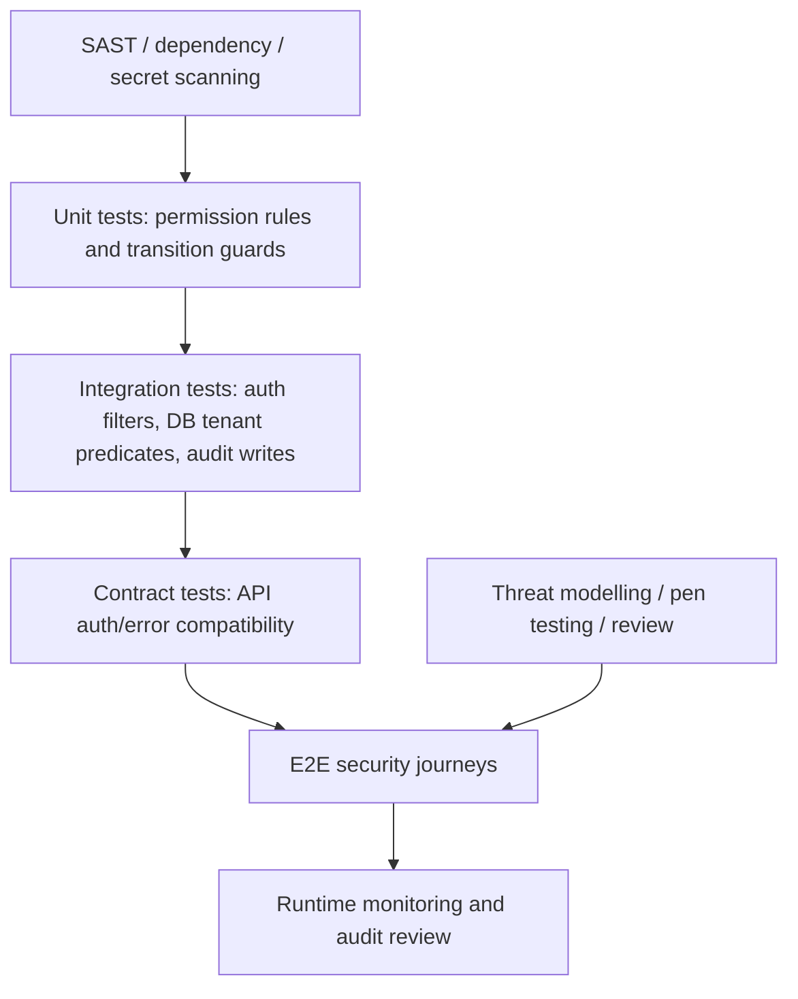

# Part 060 — Security, Authorization, and Audit Testing

## 1. Source notes and scope boundary

This part uses public security standards and general production engineering practice.

Public references to verify independently:

- OWASP Application Security Verification Standard provides a basis for testing web application technical security controls and secure development requirements.
- OWASP Web Security Testing Guide provides a broad resource for web application security testing.
- OWASP API Security Top 10 provides API-specific risk vocabulary.
- RFC 8725 provides JSON Web Token best current practices.
- OAuth 2.0 and OpenID Connect specifications provide authentication and token semantics.

This part does not assume the actual CSG identity provider, token issuer, permission model, gateway stack, audit schema, tenant model, security test tooling, SAST/DAST vendor, or internal compliance policy.

Every security mechanism must be verified in internal documentation, code, threat models, pipeline security gates, pen-test findings, production logs, and team onboarding sessions.

---

## 2. Core thesis

Security testing for Quote & Order is not just scanning dependencies or checking whether endpoints require a token.

For enterprise CPQ/order management, security testing must prove that the system protects business authority.

A quote/order platform decides who can:

- see customer data;
- configure product offerings;
- apply discounts;
- override pricing;
- approve margin exceptions;
- accept commercial commitments;
- create orders;
- cancel or amend orders;
- resume failed fulfillment;
- repair production data;
- export audit evidence;
- operate across tenant/customer boundaries.

Security failures here are not abstract.

They can cause:

- revenue leakage;
- unauthorized discounts;
- contract disputes;
- customer data exposure;
- tenant leakage;
- false audit evidence;
- order manipulation;
- regulatory/compliance failure;
- incident response paralysis.

Security tests must therefore be domain-aware.

---

## 3. Testing layers

Security testing should exist at multiple layers.



No single layer is enough.

- SAST may find injection patterns but cannot prove approval authority.
- Unit tests may prove permission rules but not gateway wiring.
- Integration tests may prove tenant predicates but not UI leakage.
- E2E tests may prove a journey but not all edge cases.
- Pen tests may find unknown weaknesses but are not regression tests.
- Audit review may detect suspicious behavior but should not be first detection.

---

## 4. Security requirements must be testable

Weak requirement:

> Users must only access allowed quotes.

Better requirement:

> A user authenticated for tenant A with role SalesRep can create and update draft quotes for accounts assigned to them, but cannot view, search, export, update, approve, accept, cancel, or repair quotes belonging to tenant B or accounts outside their authority. Denied attempts must not reveal object existence across tenant boundaries and must produce security audit events where policy requires it.

A testable security requirement includes:

- actor;
- tenant;
- role/permission;
- object;
- operation;
- state;
- ownership/account boundary;
- expected outcome;
- error semantics;
- audit expectation;
- observability expectation.

---

## 5. Security test matrix

For Quote & Order, build tests around this matrix:

| Dimension | Examples |
|---|---|
| Actor type | user, service, admin, support, batch job, integration client |
| Role | sales, approver, pricing manager, order manager, support, read-only, system |
| Tenant | same tenant, different tenant, missing tenant, malformed tenant |
| Customer/account | assigned, unassigned, parent account, child account, external account |
| Object | quote, quote item, order, order item, catalog, price, agreement, audit record |
| State | draft, pending approval, approved, accepted, ordered, in fulfillment, completed, cancelled |
| Operation | read, search, create, update, approve, accept, cancel, amend, resume, export, repair |
| Channel | UI, REST API, Kafka event, batch job, admin tool |
| Expected outcome | allow, deny, not found, masked response, audit event, alert |

This matrix prevents shallow testing.

---

## 6. Authentication testing

Authentication tests prove that identity claims are trustworthy and validated correctly.

### 6.1 JWT validation tests

Test invalid tokens:

- missing token;
- malformed token;
- expired token;
- `nbf` token not yet valid;
- wrong issuer;
- wrong audience;
- wrong algorithm;
- `alg: none` attempt;
- invalid signature;
- token signed with unknown key;
- token signed with rotated-out key;
- token with wrong tenant claim;
- token with privilege claim not issued by trusted authority;
- ID token used where access token is required;
- access token for another service audience;
- token replay after revocation if revocation is part of internal model.

Expected behavior:

- request rejected before business logic;
- response does not leak sensitive details;
- security event logged if policy requires;
- no audit event that implies business action occurred;
- no partial write.

### 6.2 Service-to-service authentication tests

Test:

- service token accepted only for service endpoints/actions;
- user-only action cannot be performed with service identity;
- service cannot impersonate user without explicit delegated authority;
- downstream callback identity is validated;
- webhook/callback signatures are verified if applicable;
- mTLS identity is mapped correctly if used;
- service identity is included in audit as service actor, not fake human actor.

### 6.3 Gateway vs service validation tests

If authentication is enforced at gateway, services still need a defensible trust boundary.

Test:

- direct service access path if possible;
- missing forwarded identity headers;
- spoofed identity headers;
- tenant header tampering;
- gateway-internal header accepted only from trusted network/component;
- service rejects requests when auth context is incomplete.

Never assume gateway protection is enough unless architecture explicitly enforces network isolation and header trust.

---

## 7. Authorization testing

Authorization tests prove that an authenticated actor can do only what they are allowed to do.

Authentication says who you are.

Authorization says what you can do.

### 7.1 Action-level authorization

For each protected action, test allow and deny cases.

Actions:

- create quote;
- update draft quote;
- submit quote for approval;
- approve quote;
- reject quote;
- accept quote;
- convert quote to order;
- cancel quote;
- amend order;
- cancel order;
- resume fallout;
- override price;
- override validation;
- export quote/order data;
- view audit trail;
- run data repair;
- modify customer-specific configuration.

Do not test only read endpoints.

The highest-risk operations are state-changing and privileged.

### 7.2 State-sensitive authorization

Permission often depends on lifecycle state.

Examples:

- sales user can edit draft quote;
- sales user cannot edit accepted quote;
- approver can approve pending quote;
- approver cannot approve quote they created if maker-checker is required;
- order manager can resume fallout order;
- order manager cannot modify completed order except through amendment flow;
- support admin can perform override only with reason and audit trail.

State-sensitive tests catch common bypasses where endpoint-level permission is checked but lifecycle guard is missing.

### 7.3 Object-scoped authorization

Permission often depends on object ownership or account hierarchy.

Test:

- sales user assigned to account can view quote;
- sales user not assigned to account cannot view quote;
- parent account access does or does not imply child account access according to policy;
- delegated user access expires;
- account reassignment changes future access according to policy;
- access cache invalidates correctly.

### 7.4 Approval authority testing

Approval is business authorization.

Test:

- discount below threshold does not require approval;
- discount above threshold requires approval;
- user without threshold authority cannot approve;
- user with sufficient threshold can approve;
- user cannot approve their own quote if segregation of duties requires maker-checker;
- approval reason is required;
- approval is invalidated when price/discount/terms change;
- expired approval cannot be reused;
- approval evidence is preserved during quote-to-order conversion;
- approval audit contains actor, authority, threshold, reason, before/after values.

This is one of the most important security areas for CPQ.

---

## 8. Tenant isolation testing

Tenant isolation is not one test.

It is a system-wide invariant.

### 8.1 API tenant isolation tests

For every important resource:

- create object in tenant A;
- authenticate as tenant B;
- try direct read by ID;
- try update by ID;
- try delete/cancel/amend if applicable;
- try search/list;
- try export;
- try related subresource access;
- try event/callback correlation if applicable.

Expected response may be `403` or `404` depending on policy.

Be consistent.

A `404` can avoid object existence leakage.

A `403` can be useful for same-tenant authorization denial.

The policy must be explicit.

### 8.2 Database tenant predicate tests

If using shared tables with tenant ID, test repository methods for tenant filtering.

Common bugs:

- direct `findById(id)` without tenant;
- search query missing tenant predicate;
- count query missing tenant predicate;
- export query missing tenant predicate;
- update/delete query missing tenant predicate;
- join leaks cross-tenant row;
- JSONB query ignores tenant;
- background job processes all tenants without isolation;
- cache key missing tenant;
- materialized view missing tenant;
- report query aggregates across tenants.

Integration tests should prove tenant predicates are present where required.

### 8.3 Kafka/event tenant isolation tests

Test that:

- emitted events contain tenant ID;
- consumers enforce tenant where needed;
- DLQ does not expose cross-tenant data to unauthorized operators;
- replay tooling is tenant-scoped;
- correlation ID alone is not used as authorization;
- event payload does not include data beyond intended audience.

### 8.4 UI tenant isolation tests

Test:

- tenant switcher does not leak previous tenant state;
- cached UI data is cleared on tenant switch/logout;
- search results are tenant-scoped;
- deep links cannot access other tenant resources;
- browser storage does not retain sensitive tenant data improperly.

---

## 9. Audit testing

Audit tests prove that the system can reconstruct important business and security actions.

Audit must be tested as evidence.

### 9.1 Audit event completeness

For each audited action, assert:

- event exists;
- tenant ID correct;
- actor ID correct;
- actor type correct;
- action name correct;
- business object ID correct;
- previous state correct where applicable;
- new state correct where applicable;
- reason captured when required;
- authority/role captured when relevant;
- correlation ID present;
- causation ID present if used;
- timestamp present;
- sensitive values are redacted/masked;
- event is immutable or append-only according to policy.

### 9.2 Negative audit testing

Test that denied or suspicious actions are handled correctly:

- unauthorized approval attempt;
- cross-tenant access attempt;
- invalid token attempt;
- privileged override attempt;
- failed data repair validation;
- repeated duplicate command;
- suspicious export attempt.

Not every denied request must create a business audit event.

But security-relevant events should be observable according to internal policy.

### 9.3 Audit tamper resistance

Test where feasible:

- normal users cannot update audit records;
- admin UI cannot silently delete audit records;
- audit repository does not expose unsafe update/delete methods;
- migration/backfill does not rewrite evidence without explicit repair audit;
- support tooling requires reason and approval.

### 9.4 Audit vs log distinction

Logs are for operations.

Audit is for evidence.

A test that only checks log output is not enough if the requirement is audit evidence.

---

## 10. API security testing

Use API-specific threat thinking.

### 10.1 Broken object level authorization

Test direct object access:

```text
GET /quotes/{quoteIdFromOtherTenant}
PATCH /quotes/{quoteIdFromOtherAccount}
POST /quotes/{quoteId}/accept
POST /orders/{orderIdFromOtherTenant}/cancel
GET /orders/{orderId}/audit
```

Do not rely on UI hiding links.

### 10.2 Broken function level authorization

Test privileged endpoints:

```text
POST /quotes/{id}/approve
POST /quotes/{id}/override-price
POST /orders/{id}/resume-fallout
POST /admin/data-repair
POST /config/customer-overrides
```

A user may have read access but not action authority.

### 10.3 Mass assignment

Test request bodies containing fields the user should not control:

```json
{
  "discountPercent": 80,
  "approvalStatus": "APPROVED",
  "approvedBy": "ceo",
  "tenantId": "other-tenant",
  "marginOverride": true,
  "orderState": "COMPLETED"
}
```

Expected behavior:

- ignored or rejected;
- no privileged field updated;
- audit/security signal where appropriate.

DTO allowlisting is safer than binding directly into domain/persistence models.

### 10.4 Injection and input validation

Test:

- SQL injection in search/filter/sort;
- expression injection in dynamic rule criteria;
- path traversal in export/download;
- header injection in callback URL;
- JSON parser edge cases;
- extremely large payloads;
- deeply nested quote item structures;
- invalid enum values;
- invalid currency/amount precision;
- invalid date/effective-time ranges.

Security input validation overlaps with domain validation but is not identical.

### 10.5 Rate limit and abuse tests

Test:

- repeated login/token attempt;
- repeated quote calculation;
- huge search/export;
- repeated duplicate create with different idempotency keys;
- pricing endpoint abuse;
- approval endpoint brute force;
- fulfillment callback flood.

The system should protect expensive operations.

---

## 11. UI security testing

UI security testing should not be the only line of defense.

But it still matters.

Test:

- privileged buttons hidden/disabled for unauthorized user;
- direct URL navigation to privileged page denied;
- tenant switch clears sensitive state;
- browser storage does not expose tokens or sensitive quote data beyond policy;
- UI does not expose hidden fields containing sensitive data;
- error messages do not leak object existence across tenants;
- audit/history panels respect permissions;
- export/download actions enforce server-side authorization.

Never accept “the button is hidden” as proof of security.

Server-side authorization must still be tested.

---

## 12. Event-driven security testing

Kafka/event paths are often under-tested.

Security questions:

- Who can produce this event?
- Who can consume this event?
- Does the event contain tenant ID?
- Does the event contain PII or commercial sensitive data?
- Is the consumer authorized to apply this event?
- Can a forged/replayed event change order state?
- Does replay bypass authorization?
- Are internal topics accessible only to internal services?
- Are DLQ messages protected?
- Are audit/security events emitted for suspicious event handling?

Tests:

- publish event with wrong tenant;
- publish event with missing tenant;
- replay old callback event;
- duplicate privileged command event;
- malformed event payload;
- event with inconsistent aggregate ID and tenant ID;
- event schema with unexpected field attempting privilege escalation.

Consumers should treat event payload as untrusted unless the topic boundary is strongly controlled and documented.

---

## 13. Data repair and admin tooling security tests

Admin tools are high-risk.

Test:

- only authorized support/admin can access;
- maker-checker approval required where policy says so;
- repair requires reason;
- dry run is available;
- repair is tenant-scoped;
- repair cannot change immutable commercial evidence without explicit correction workflow;
- repair writes audit event;
- repair output redacts sensitive data;
- failed repair does not partially apply without record;
- repair script cannot run against wrong environment accidentally.

Data repair is often where normal application guardrails are bypassed.

Treat it as privileged production code.

---

## 14. Security test implementation patterns

### 14.1 Permission matrix tests

Represent authorization as data.

Example shape:

```yaml
- actor: sales_user
  tenant: tenant_a
  object: quote_draft_owned_account
  action: update_quote
  expected: allow

- actor: sales_user
  tenant: tenant_a
  object: quote_pending_approval_owned_account
  action: approve_quote
  expected: deny

- actor: margin_approver
  tenant: tenant_a
  object: quote_pending_approval_unowned_account
  action: approve_quote
  expected: deny

- actor: margin_approver
  tenant: tenant_a
  object: quote_pending_approval_owned_scope
  action: approve_quote
  expected: allow

- actor: sales_user
  tenant: tenant_b
  object: quote_from_tenant_a
  action: read_quote
  expected: not_found_or_deny
```

Then generate tests from the matrix.

This prevents random one-off security tests.

### 14.2 JUnit parameterized authorization tests

Pseudo-shape:

```java
@ParameterizedTest
@MethodSource("authorizationCases")
void authorization_policy_is_enforced(AuthCase c) {
    AuthToken token = auth.tokenFor(c.actor(), c.tenant());

    HttpResponse response = api.perform(c.operation(), token, c.resourceId(), c.payload());

    assertThat(response.status()).isEqualTo(c.expectedStatus());

    if (c.expectedAuditEvent() != null) {
        assertAuditEventExists(c.expectedAuditEvent());
    }
}
```

The important part is not the syntax.

The important part is the explicit security matrix.

### 14.3 Cross-tenant repository integration tests

Pseudo-shape:

```java
@Test
void findQuoteById_requiresTenantScope() {
    QuoteId quoteA = fixtures.createQuote("tenant-a");

    Optional<Quote> result = quoteRepository.findByTenantAndId("tenant-b", quoteA);

    assertThat(result).isEmpty();
}
```

Also test search/count/export paths.

Most tenant leaks happen outside the obvious `findById` method.

### 14.4 Audit assertion helper

Audit assertions should be reusable.

```java
assertAudit()
    .forTenant("tenant-a")
    .forObject(quoteId)
    .hasAction("QuoteApproved")
    .hasActor(approverUserId)
    .hasReason("approved within agreement exception")
    .hasCorrelationId(correlationId)
    .hasNoRawSensitiveValue("nationalId");
```

Audit testing should be easy enough that developers actually do it.

---

## 15. Negative testing strategy

Security confidence comes mostly from negative tests.

Positive test:

> Authorized approver can approve quote.

Negative tests:

- unauthenticated user cannot approve;
- sales user cannot approve;
- approver without threshold cannot approve;
- approver from another tenant cannot approve;
- approver outside account scope cannot approve;
- maker cannot approve own quote if prohibited;
- expired approval token cannot approve;
- service identity cannot approve as human;
- request body cannot set `approved=true` directly;
- approval cannot be applied to already accepted quote;
- approval cannot be reused after quote changes;
- denied approval attempt does not modify state;
- denied approval attempt generates audit/security signal if required.

For security, one positive test is rarely enough.

---

## 16. Error semantics testing

Error responses can leak information.

Test:

- cross-tenant ID access does not reveal object existence if policy says not found;
- unauthorized same-tenant action returns expected denial;
- validation error does not reveal hidden pricing rules beyond policy;
- authentication failure does not reveal token parsing internals;
- SQL error does not leak query/table names;
- downstream error does not leak partner secrets;
- stack traces not returned to clients;
- correlation ID returned/logged for support.

A good error response is useful but not leaky.

---

## 17. PII and sensitive data testing

Quote/order systems may contain sensitive data:

- customer identifiers;
- contact details;
- account hierarchy;
- contract terms;
- price discounts;
- margin data;
- agreement terms;
- order location/service address;
- internal approval notes;
- support/debug information.

Test that sensitive data is not exposed in:

- logs;
- metrics labels;
- traces;
- Kafka events;
- DLQ messages;
- error responses;
- browser storage;
- export files;
- audit events beyond allowed scope;
- screenshots/videos retained from UI tests.

Metrics labels especially must avoid high-cardinality sensitive identifiers.

---

## 18. Security testing in CI/CD

A practical pipeline split:

| Stage | Security checks |
|---|---|
| Developer/local | unit authorization tests, lint, basic secret scan |
| PR | unit/integration auth tests, dependency scan, SAST, API contract auth tests |
| Nightly | broader cross-tenant/security E2E, DAST, fuzz-style input tests |
| Release candidate | full security regression, migration + tenant checks, audit evidence checks |
| Periodic/manual | threat modelling, pen test, game day, access review |

Do not put every slow security test on every PR.

But do not leave critical authorization and tenant tests only for manual pen tests.

---

## 19. Threat model to test mapping

Security tests should come from a threat model.

Example threats:

| Threat | Test |
|---|---|
| Sales user approves own discount | maker-checker denial test |
| Tenant B reads tenant A quote by ID | cross-tenant direct object test |
| User sets `approvalStatus=APPROVED` in request body | mass assignment test |
| Replayed fulfillment callback completes cancelled order | replayed event/callback test |
| Service token performs human action | service identity denial test |
| Expired JWT accepted | token expiry test |
| Audit missing for privileged override | audit completeness test |
| Support repair changes wrong tenant | tenant-scoped repair test |
| Search leaks cross-tenant rows | search predicate integration test |
| Logs expose margin data | log redaction test |

A threat without a test may still be acceptable if risk is low or mitigated elsewhere.

But the decision should be explicit.

---

## 20. Security observability

Security tests should verify signals.

Signals:

- authentication failures;
- authorization denials;
- cross-tenant access attempts;
- privileged action attempts;
- admin override;
- data export;
- data repair;
- repeated token failures;
- suspicious callback/event rejection;
- configuration change;
- secret rotation failure;
- audit write failure.

Test that security events are:

- emitted at correct severity;
- correlated with request ID/trace ID;
- tenant-scoped;
- not leaking sensitive data;
- visible in dashboard/alert if policy requires.

Security that fails silently is hard to operate.

---

## 21. Specialized Quote & Order security scenarios

### 21.1 Discount escalation

Attack:

- user modifies request to apply a discount above their authority.

Tests:

- API rejects or routes to approval;
- user cannot self-approve;
- approval evidence required;
- quote cannot be accepted before approval;
- order preserves approved discount only.

### 21.2 Stale approval reuse

Attack:

- user gets approval for one price, changes quote, then accepts.

Tests:

- quote modification invalidates approval;
- acceptance fails until reapproval;
- audit records invalidation.

### 21.3 Tenant ID tampering

Attack:

- user sends tenant ID in request body/header for another tenant.

Tests:

- server uses trusted auth context, not client-provided tenant;
- mismatch rejected;
- no cross-tenant access.

### 21.4 Mass order completion

Attack:

- user or fake downstream sends callback completing order.

Tests:

- callback identity/signature validated;
- callback correlation matches expected fulfillment task;
- cancelled/completed orders cannot be completed again incorrectly;
- duplicate callback idempotent.

### 21.5 Audit history exposure

Attack:

- user with quote read access sees internal margin notes or approval rationale beyond policy.

Tests:

- audit view filters sensitive fields by role;
- export applies same authorization;
- raw audit endpoint restricted.

---

## 22. Security anti-patterns

### 22.1 Only testing happy-path authorization

Testing that admin can do something says nothing about whether others cannot.

### 22.2 Role checks without object checks

`hasRole("SALES")` is rarely enough.

Object scope matters.

### 22.3 Trusting request body authority fields

Never trust `tenantId`, `approvedBy`, `role`, `state`, `priceOverride`, or `marginOverride` from client input without server-side derivation/validation.

### 22.4 Security by UI hiding

Hidden buttons are usability, not security.

### 22.5 Missing tenant in cache key

This can leak data even when database queries are correct.

### 22.6 Auditing only success

Denied privileged actions can matter.

### 22.7 Treating service identity as omnipotent

Service tokens need least privilege too.

### 22.8 Logging secrets or commercial sensitive data in test diagnostics

E2E artifacts, screenshots, videos, and logs can become data leakage vectors.

---

## 23. Internal verification checklist

Check these internally:

- What identity provider is used?
- Which OAuth2/OIDC flows are supported?
- What validates JWTs: gateway, service, both?
- What are trusted issuers and audiences?
- How is JWKS/key rotation handled?
- What is the service-to-service auth model?
- What claims represent tenant, user, roles, permissions, account scope, and delegation?
- Is authorization centralized, library-based, policy-engine-based, or service-local?
- Is there a permission matrix for quote/order actions?
- Is approval authority model documented?
- Are maker-checker / segregation-of-duties rules implemented?
- Is tenant isolation enforced in API, repository, cache, Kafka, search, export, and admin tools?
- Are row-level security, tenant predicates, or separate schemas/databases used?
- Are cross-tenant negative tests present?
- Are mass-assignment tests present?
- Are forged/expired/wrong-audience JWT tests present?
- Are callback/webhook authentication tests present?
- Are Kafka consumers protected from forged/replayed events?
- What audit schema exists?
- Which actions are audited?
- Are denied privileged attempts audited?
- Is audit immutable or append-only?
- How is sensitive data redacted from logs/events/audit?
- Are security tests run on PR, nightly, or release candidate?
- What SAST/DAST/dependency/secret scanning tools are used?
- Where are pen-test findings tracked?
- What are known security debt items?
- How are security exceptions approved?
- What is the incident process for suspected tenant leakage?

---

## 24. PR review checklist

When reviewing security-sensitive PRs, ask:

- Does this change affect authentication, authorization, tenant isolation, audit, pricing authority, approval, export, admin tooling, or callbacks?
- Is authorization enforced server-side?
- Is authorization object-scoped and state-aware?
- Are negative tests included?
- Are cross-tenant tests included?
- Does the code trust tenant/user/role fields from request body or untrusted headers?
- Does the PR introduce new privileged action?
- Is the action audited?
- Does audit include actor, tenant, reason, before/after, and correlation ID where required?
- Does the PR expose sensitive data in logs, traces, metrics, events, or test artifacts?
- Does any cache key require tenant/account/user scope?
- Does any search/export/report query enforce tenant and permission filters?
- Does any Kafka consumer accept events without validating aggregate/tenant/correlation?
- Does any callback endpoint validate sender identity?
- Does error handling leak object existence or internal details?
- Does the PR require threat model update?
- Does it require security review?
- Does it affect compliance evidence?

---

## 25. Senior engineer mental model

A senior engineer does not ask only:

> Is the endpoint protected?

A senior engineer asks:

> Protected from whom, for which object, in which lifecycle state, under which tenant/account scope, with what audit evidence, and how do we know the denial path is tested?

In Quote & Order systems, security is not separate from domain logic.

Approval is authorization.

Tenant isolation is data correctness.

Audit is evidence.

Callback validation is lifecycle integrity.

Export filtering is privacy and commercial protection.

Data repair permission is production safety.

Security tests should therefore be part of normal engineering, not a late-stage compliance ritual.

---

## 26. Practical exercise

Build a security test gap matrix for your team.

Rows:

1. Quote read by ID.
2. Quote search.
3. Quote update.
4. Submit for approval.
5. Approve quote.
6. Accept quote.
7. Convert quote to order.
8. Cancel order.
9. Resume fallout.
10. Export quote/order data.
11. View audit history.
12. Data repair.
13. Fulfillment callback.
14. Kafka order event consumer.
15. Customer-specific configuration change.

Columns:

- Endpoint/event/job/tool;
- Required permission;
- Tenant rule;
- Account/object scope rule;
- State rule;
- Positive test exists;
- Negative same-tenant test exists;
- Negative cross-tenant test exists;
- JWT/auth test exists;
- Mass-assignment test exists;
- Audit assertion exists;
- Owner;
- Gap severity.

Review the result with a senior engineer, QA/security engineer, and team lead.

Prioritize gaps that can cause:

- cross-tenant data exposure;
- unauthorized approval;
- unauthorized order mutation;
- missing audit evidence;
- production data repair misuse;
- sensitive data leakage.
