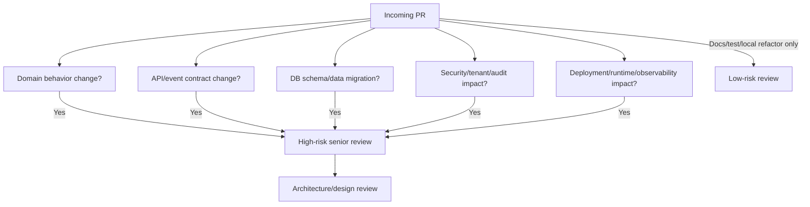

# Part 061 — Senior Engineer PR Review Standards for Quote & Order Systems

## 1. Source notes and scope boundary

This part uses public engineering practice references and the domain/architecture material already built in this series.

Public references to verify independently:

- Google's public Engineering Practices documentation describes code review as a mechanism for improving code health over time, and asks reviewers to consider design, functionality, complexity, tests, naming, comments, documentation, and maintainability.
- Public SRE material emphasizes that production learning should be factual, blameless, and oriented around contributing causes and system improvement.
- Public standards and documentation discussed in earlier parts are used as vocabulary: TM Forum Open APIs, OAuth2/JWT security guidance, PostgreSQL, Kafka, Kubernetes, OpenTelemetry, and OWASP ASVS.

This part does not assume the actual CSG PR template, branch protection rules, reviewer ownership model, architecture review board, release process, or internal quality gates.

Treat every checklist here as a strong starting point. Confirm the real rules in internal engineering docs, repository settings, CI configuration, release process, and team norms.

---

## 2. Core thesis

A senior engineer does not review a Quote & Order PR by asking only:

> Is the code clean?

The senior question is:

> Does this change preserve the business correctness, compatibility, security, operability, and evolvability of a mission-critical quote-to-cash system?

In enterprise CPQ/order management, a small PR can accidentally change:

- pricing correctness;
- discount approval authority;
- quote acceptance semantics;
- order idempotency;
- catalog version compatibility;
- tenant isolation;
- audit evidence;
- external API compatibility;
- Kafka event ordering;
- migration safety;
- on-prem upgrade behavior;
- support team's ability to diagnose fallout.

A review that catches style issues but misses those risks is not senior-level review.

Senior review is a risk-reduction activity.

It should answer six questions:

1. **Correctness** — Does the change preserve domain invariants?
2. **Compatibility** — Will existing consumers, customers, integrations, and deployments keep working?
3. **Safety** — Can the change be deployed, migrated, rolled back, and operated safely?
4. **Security** — Does it preserve identity, authorization, tenant isolation, and auditability?
5. **Observability** — Can we detect and diagnose failures introduced by this change?
6. **Maintainability** — Does the change make the future system easier or harder to reason about?

---

## 3. The reviewer mindset

A reviewer has three responsibilities.

### 3.1 Protect the system

The reviewer protects production, customer data, commercial correctness, and long-term maintainability.

This includes asking uncomfortable questions:

- What happens if this request is retried?
- What happens if the event is duplicated?
- What happens if the catalog version changes between quote creation and acceptance?
- What happens if two users approve or edit the same quote concurrently?
- What happens if this migration runs on a large customer database?
- What happens if this field is missing in an older integration payload?
- What happens if this endpoint is called cross-tenant?
- What happens if this downstream system times out after committing the side effect?

### 3.2 Help the author succeed

Review is not a performance of superiority.

Good review comments are specific, grounded, and actionable.

Weak comment:

> This seems wrong.

Better comment:

> This transition allows `APPROVED -> DRAFT` without invalidating the approval snapshot. Could that allow a user to change line items after approval while preserving the old approval record? I think we need either a guard here or an explicit approval invalidation test.

### 3.3 Improve the codebase over time

A reviewer should avoid both extremes:

- approving unsafe changes to avoid conflict;
- blocking useful changes because they are not perfect.

A good rule:

> Require changes for correctness, safety, compatibility, security, or operability issues. Suggest improvements for style, local simplification, or minor taste issues.

---

## 4. PR risk classification

Not every PR needs the same review depth.

Classify the PR first.



### 4.1 Low-risk PR

Examples:

- typo or documentation fix;
- isolated unit test improvement;
- local refactor with no behavior change;
- internal helper extraction;
- non-functional code cleanup.

Review focus:

- local correctness;
- readability;
- test stability;
- no accidental behavior change.

### 4.2 Medium-risk PR

Examples:

- new validation rule;
- new internal API field;
- new repository method;
- small performance improvement;
- new metric/log field;
- small feature flag controlled behavior.

Review focus:

- domain invariant;
- regression tests;
- compatibility;
- observability;
- rollout control.

### 4.3 High-risk PR

Examples:

- quote/order state transition change;
- pricing/discount/approval logic change;
- schema migration on large tables;
- public API change;
- Kafka event schema change;
- authorization or tenant isolation change;
- order decomposition change;
- retry/idempotency behavior change;
- deployment manifest change affecting availability.

Review focus:

- design evidence;
- explicit failure model;
- migration/rollback plan;
- compatibility matrix;
- test matrix;
- operational readiness;
- senior or architecture review.

### 4.4 Architecture-level PR

A PR should not be the first place an architecture decision appears.

Require design review or ADR when the PR introduces:

- new bounded context boundary;
- new service;
- new Kafka topic family;
- new public API version;
- new state machine;
- new orchestration/saga model;
- new data ownership model;
- new tenant isolation strategy;
- new deployment topology;
- irreversible migration.

---

## 5. Review order: do not start with style

A strong review sequence:

1. Read the PR description and linked ticket/design doc.
2. Identify business behavior change.
3. Identify affected bounded contexts.
4. Identify data and contract changes.
5. Review domain correctness.
6. Review compatibility and migration safety.
7. Review security, tenant isolation, and audit.
8. Review observability and operational readiness.
9. Review tests.
10. Review code structure and readability.
11. Review naming, comments, and minor style last.

Why this order matters:

- A beautifully written PR can still break pricing correctness.
- A clean refactor can still remove tenant predicates.
- A well-tested endpoint can still break a generated client.
- A simple migration can still lock a production table.

---

## 6. Domain correctness review

Domain correctness is the highest-priority review area for Quote & Order.

Ask:

- What business rule changed?
- Which lifecycle invariant is affected?
- Which actor is allowed to perform this action?
- Which aggregate owns this decision?
- Is this behavior valid for amendment, cancellation, retry, and fallout?
- Is the behavior valid for both new acquisition and installed-base modification?
- Is this behavior valid for customer-specific agreement/pricing rules?

### 6.1 Quote review checklist

For quote changes, verify:

- quote state transition is legal;
- draft vs accepted vs expired semantics are preserved;
- quote versioning is explicit;
- pricing snapshot is not silently mutated after acceptance;
- approval is invalidated when commercial terms change;
- quote expiry is enforced consistently;
- quote-to-order conversion is idempotent;
- duplicate conversion cannot create duplicate orders;
- quote item hierarchy remains consistent;
- audit trail records who changed what and why.

Example risk:

```java
// Risky: updates line item after approval without approval invalidation.
quoteItem.setDiscountPercent(request.discountPercent());
quoteRepository.updateItem(quoteItem);
```

Better mental model:

```java
quote.applyCommercialChange(
    actor,
    new ChangeDiscountCommand(itemId, discountPercent),
    clock
);

// Domain method decides whether approval snapshot becomes invalid.
```

The key is not the syntax. The key is that the domain model must know that a commercial change has happened.

### 6.2 Pricing review checklist

For pricing changes, verify:

- charge type semantics are explicit: recurring, non-recurring, usage, tax-like, adjustment;
- discount stacking order is deterministic;
- enterprise agreement overrides are traceable;
- margin calculation input is explicit;
- currency/rounding rules are deterministic;
- recalculation invalidates dependent approvals when required;
- quote stores the correct pricing snapshot;
- price explanation is available for audit/support;
- tests include edge cases, not only happy path.

Red flags:

- floating-point money calculation;
- implicit default currency;
- undocumented rounding;
- discount order hidden in collection iteration order;
- approval threshold duplicated in UI and backend;
- price recalculation without approval invalidation;
- missing test for negative margin or excessive discount.

### 6.3 Catalog review checklist

For catalog-driven changes, verify:

- catalog version is explicit;
- effective date behavior is defined;
- retired offerings are handled correctly;
- quote/order snapshots preserve historical truth;
- compatibility/eligibility rules are deterministic;
- cache invalidation is safe;
- partial catalog publish cannot create inconsistent runtime state;
- API consumers are not forced to understand internal catalog tables.

Red flags:

- live catalog lookup for accepted historical quote;
- using product name as stable identity;
- assuming characteristic presence without version guard;
- changing catalog schema without migration/backfill plan;
- adding a characteristic that changes order decomposition without tests.

### 6.4 Order review checklist

For order changes, verify:

- order state transition is legal;
- order item state aggregation is defined;
- order creation is idempotent;
- order item action semantics are explicit: add, modify, delete, noChange;
- decomposition preserves dependency graph invariants;
- fulfillment retry is idempotent;
- cancellation is treated as workflow, not deletion;
- fallout/manual intervention path remains observable;
- terminal states are not accidentally mutable;
- downstream side effects are protected by idempotency keys.

Red flags:

- `order.setStatus(COMPLETED)` without item-level completion criteria;
- order cancellation implemented as hard delete;
- retry re-sends external command with new business identifier;
- fulfillment adapter catches exception and marks success;
- order state update and event publish not atomic.

---

## 7. API contract review

In enterprise systems, API contracts outlive individual implementation choices.

Review REST/API changes through compatibility, not convenience.

### 7.1 Public/external API checklist

Verify:

- change is backward compatible;
- required fields are not added without versioning/migration;
- enum expansion is safe for consumers;
- nullable vs absent semantics are documented;
- error response shape is stable;
- pagination/filtering behavior is not semantically changed;
- idempotency behavior is documented and tested;
- OpenAPI diff is reviewed;
- generated clients are considered;
- TMF alignment or intentional divergence is documented.

Red flags:

- changing a field meaning while keeping the same name;
- changing sort order without documenting it;
- returning a new terminal state without consumer migration;
- reusing HTTP `200` for business failure while previous behavior used `4xx`;
- leaking internal persistence fields in response DTO;
- exposing tenant/customer data in unscoped search endpoint.

### 7.2 Internal API checklist

Internal APIs also need discipline.

Verify:

- internal does not mean unstable by default;
- consumers are known;
- breaking changes update all consumers in same release train or behind compatibility layer;
- API does not expose another context's persistence model;
- correlation ID and tenant context propagate;
- errors are actionable for callers.

---

## 8. Kafka and event review

Kafka changes often look harmless because they are not visible in API controllers.

They are not harmless.

### 8.1 Event producer checklist

Verify:

- event type represents a fact that already happened;
- event is emitted atomically with state change via outbox or equivalent;
- event key preserves required ordering;
- event contains correlation ID and causation ID;
- event contains tenant/customer scoping metadata;
- schema evolution is backward compatible;
- event versioning is explicit;
- sensitive data is not unnecessarily published;
- event can be replayed safely.

Red flags:

- publishing directly to Kafka inside transaction before DB commit;
- event payload contains entire aggregate with PII and internal fields;
- event key changed without consumer review;
- removing a field used by unknown consumers;
- using event as command without clear owner.

### 8.2 Event consumer checklist

Verify:

- consumer is idempotent;
- duplicate event behavior is tested;
- replay behavior is safe;
- event ordering assumptions are explicit;
- poison message path is defined;
- offset commit timing is safe;
- retry policy avoids retry storms;
- dead-letter behavior is observable;
- downstream side effects use stable idempotency keys.

Red flags:

- consumer assumes exactly-once behavior without dedupe;
- consumer uses wall-clock order instead of aggregate sequence;
- consumer sends external side effect before recording processing state;
- consumer swallows error and commits offset;
- consumer cannot be re-run in backfill/replay mode.

---

## 9. PostgreSQL and migration review

Database review is not only SQL syntax review.

It is production risk review.

### 9.1 Query review checklist

Verify:

- query has tenant predicate where required;
- query uses stable business identifiers correctly;
- query does not create N+1 behavior;
- query plan is acceptable for expected data size;
- indexes support common predicates and ordering;
- pagination is stable and scalable;
- JSONB access is indexed if used in hot path;
- lock scope is intentional;
- transaction boundary is explicit.

Red flags:

- unbounded query in API path;
- `OFFSET` pagination on large operational table;
- `SELECT *` in hot path;
- missing tenant predicate;
- `FOR UPDATE` on broad query;
- query performance judged only on local dev data.

### 9.2 Migration review checklist

Verify:

- expand-contract plan exists for breaking schema changes;
- migration is safe for large tables;
- lock behavior is understood;
- index creation uses safe strategy where required;
- backfill is chunked and resumable;
- old and new app versions can run during rolling deployment;
- rollback or roll-forward plan is explicit;
- on-prem upgrade path is considered;
- migration tests use realistic data volume or shape.

Red flags:

- adding `NOT NULL` with default to massive table without lock/runtime analysis;
- renaming or dropping column in same release where code changes;
- data backfill inside a single giant transaction;
- irreversible migration without data export or validation plan;
- migration hidden inside application startup.

---

## 10. Security, tenant isolation, and audit review

Quote & Order systems protect commercial authority.

Security review must inspect business behavior.

### 10.1 Authorization checklist

Verify:

- every command checks authorization server-side;
- permission is scoped by tenant/account/customer where required;
- approval authority is checked at approval time;
- approval authority is not inferred only from UI;
- admin override is explicit, audited, and restricted;
- service-to-service calls do not blindly trust caller-provided actor context;
- negative authorization tests exist.

Red flags:

- endpoint checks only authentication, not action permission;
- frontend hides button but backend allows command;
- approval threshold enforced only in UI;
- support role can cross tenant boundaries by changing request parameter;
- service accepts `actorId` from request body as trusted authority.

### 10.2 Tenant isolation checklist

Verify:

- tenant context comes from trusted identity/request boundary;
- tenant predicate exists in all DB queries;
- cache keys include tenant where required;
- Kafka events include tenant metadata;
- search/export endpoints are tenant scoped;
- logs avoid cross-tenant leakage;
- tests include cross-tenant denial.

### 10.3 Audit checklist

Verify:

- business action creates audit evidence;
- audit captures actor, action, target, before/after or meaningful delta, reason, timestamp, correlation ID;
- approval records include authority basis;
- override/manual repair is audited;
- audit write is atomic with business change where required;
- sensitive fields are redacted or protected;
- audit evidence can reconstruct important dispute scenarios.

---

## 11. Observability and operational readiness review

A change is not production-ready if failures are invisible.

### 11.1 Logging checklist

Verify:

- structured logs include correlation ID;
- quote/order/customer identifiers are included when safe;
- log level is appropriate;
- failures include enough context to diagnose;
- PII/secrets are not logged;
- retry/fallout/manual recovery path is logged.

### 11.2 Metrics checklist

Verify:

- new workflow state has metric coverage;
- error rate and latency are measurable;
- fallback/fallout/retry counts are measurable;
- high-cardinality labels are avoided;
- dashboards can detect degradation;
- SLO impact is understood.

### 11.3 Tracing checklist

Verify:

- trace context propagates across REST calls;
- correlation/causation IDs propagate across Kafka events;
- long-running workflow has reconstruction path;
- external adapter calls are traced or logged with attempt IDs.

### 11.4 Runbook checklist

For high-risk changes, verify:

- how to detect failure;
- how to mitigate;
- how to rollback or roll forward;
- how to repair data;
- how to identify affected customers/orders;
- who owns support escalation.

---

## 12. Testing review

Tests are not proof by quantity.

They are evidence that known risks are controlled.

### 12.1 Test matrix by change type

| Change type | Minimum test expectation |
|---|---|
| Quote state transition | Unit transition table + integration audit/event test |
| Pricing rule | Unit edge cases + approval invalidation test + snapshot test |
| Public API field | Contract/OpenAPI diff + consumer compatibility test |
| Kafka event | Schema compatibility + producer/consumer replay/idempotency test |
| DB query | Mapper integration test + query plan review for hot path |
| Migration | Migration test + backward compatibility + backfill validation |
| Authorization | Negative permission tests + tenant isolation tests |
| Kubernetes manifest | Deployment dry-run/policy check + probe/resource review |

### 12.2 Test quality checklist

Verify:

- test names describe business behavior;
- negative cases are present;
- concurrency/retry cases are tested where relevant;
- time is controlled via clock abstraction;
- money/rounding tests are deterministic;
- tests do not rely on random execution order;
- integration tests use realistic DB/Kafka behavior;
- E2E tests verify business outcome, not only UI clicks;
- contract tests protect external consumers.

Red flags:

- tests only assert non-null response;
- tests duplicate implementation logic;
- tests do not assert audit/event side effects;
- tests require shared mutable global data;
- test flakiness is accepted as normal.

---

## 13. Code structure review

After correctness, safety, security, and tests, review structure.

### 13.1 Java service structure checklist

Verify:

- controller does not contain domain logic;
- application service orchestrates use case;
- domain model owns invariants;
- repository hides persistence details;
- DTOs do not leak into domain model;
- exceptions are meaningful and mapped consistently;
- transaction boundary is explicit;
- time/identity/tenant context are injected or passed explicitly;
- dependencies point inward, not outward.

Red flags:

- one method performs validation, pricing, authorization, persistence, Kafka publishing, and response mapping;
- domain rule duplicated across controller, service, UI, and DB trigger;
- utility class becomes hidden domain service;
- mapper result object is reused as public API response;
- `Map<String, Object>` used for core domain data.

### 13.2 Complexity checklist

Ask:

- Can this be simpler without losing correctness?
- Is this abstraction justified by real variation?
- Does this indirection hide ownership?
- Is the branch logic encoded as data/rules where appropriate?
- Are feature flags temporary and tracked?
- Is the code easy to debug during incident?

---

## 14. Review comments: quality standard

### 14.1 Good review comments

Good comments are:

- specific;
- grounded in risk;
- actionable;
- respectful;
- clear about severity;
- willing to separate blockers from suggestions.

Use prefixes when helpful:

- `blocking:` correctness/safety/security/compatibility issue;
- `question:` genuine uncertainty;
- `suggestion:` improvement but not required;
- `nit:` minor style/readability issue;
- `note:` useful context.

Example:

> blocking: This consumer writes the fulfillment request before recording the inbound event ID. If the process crashes after the external call but before offset commit, replay can send the command again with a different request ID. Could we persist a stable idempotency key before the side effect, or reuse the order item ID as the downstream idempotency key?

### 14.2 Weak review comments

Avoid:

- "I don't like this."
- "Can we make this cleaner?"
- "This is bad."
- "Why did you do this?"
- "Use pattern X" without explaining risk.

Better:

- state the risk;
- explain the system consequence;
- propose one or two concrete options;
- ask for missing context if uncertain.

---

## 15. Example review walkthrough

Imagine a PR changes quote acceptance so an accepted quote automatically creates a product order.

### 15.1 Initial classification

High risk.

Affected areas:

- quote state machine;
- quote-to-order conversion;
- order idempotency;
- pricing snapshot;
- authorization;
- audit;
- Kafka events;
- transaction boundary;
- external API behavior;
- tests and observability.

### 15.2 Questions to ask

Domain:

- Can an expired quote be accepted?
- Can a quote be accepted twice?
- What happens if pricing is stale?
- Does acceptance require approval to still be valid?
- Is the accepted quote snapshot immutable?

Data:

- Is quote state update atomic with order creation?
- Is there a unique constraint preventing duplicate order per quote version?
- Is audit created in the same transaction?
- Is outbox event created atomically?

API:

- Does endpoint remain idempotent?
- What status code is returned if order already exists?
- Is response compatible with existing clients?

Security:

- Who can accept quote?
- Is actor authorized for customer/account/tenant?
- Is approval authority checked?

Ops:

- Is there a metric for acceptance failure?
- Can support find quote-to-order conversion attempts?
- What is the runbook if order creation fails after quote acceptance?

Testing:

- duplicate accept test;
- expired quote test;
- stale price test;
- missing approval test;
- concurrent accept test;
- audit/event test;
- rollback/failure test.

### 15.3 Possible blocking comment

> blocking: This PR updates the quote to `ACCEPTED` before creating the order, but there is no persisted conversion attempt or unique constraint linking quote version to order. If order creation fails after quote acceptance, the system can leave a commercially accepted quote with no order and no safe retry marker. I think we need either a single transaction that records quote acceptance + order + audit + outbox, or a durable conversion process state with idempotent retry.

This is senior review because it identifies a real failure mode and gives implementation directions.

---

## 16. Review checklist by artifact

### 16.1 Java code

- Domain logic is not hidden in controller/mapper.
- Invariants are enforced centrally.
- Nullability and optionality are explicit.
- Money/time/identity are modelled safely.
- Exceptions map to meaningful API errors.
- Transaction boundary is clear.
- Idempotency is explicit for commands.
- Tenant context is not optional in scoped operations.

### 16.2 API/OpenAPI

- No accidental breaking changes.
- New fields are optional or versioned.
- Error model is stable.
- Enum changes are reviewed.
- Idempotency and concurrency behavior are documented.
- OpenAPI diff is reviewed.

### 16.3 Kafka/events

- Event names are facts, not vague notifications.
- Event key is intentional.
- Schema evolution is compatible.
- Outbox/inbox pattern is respected.
- Consumer is idempotent.
- Replay behavior is tested.

### 16.4 PostgreSQL/MyBatis

- Query is tenant-scoped.
- Query plan/indexes are acceptable for hot path.
- Locks are intentional.
- Optimistic locking or unique constraints prevent races.
- Migration is backward compatible.
- Backfill is safe and resumable.

### 16.5 Kubernetes/GitOps/CI

- Probes match real readiness.
- Resource limits are sane for JVM.
- Rollout/rollback behavior is understood.
- Secrets/config are handled safely.
- CI gates match risk.
- Deployment changes are traceable.

### 16.6 Security/audit

- AuthN/AuthZ is server-side.
- Approval authority is enforced.
- Tenant isolation is preserved.
- Audit evidence is complete.
- Sensitive data is not leaked.
- Negative security tests exist.

### 16.7 Observability

- Logs are structured and safe.
- Metrics answer operational questions.
- Traces/correlation IDs propagate.
- New failure modes have detection.
- Support can reconstruct affected quote/order.

---

## 17. Internal verification checklist

Verify these inside the actual engineering environment:

### PR and repository process

- Official PR template.
- Branch protection rules.
- Required CI checks.
- Required reviewers per repository/module.
- Code owner rules.
- Architecture review trigger conditions.
- Security review trigger conditions.
- Database migration review trigger conditions.
- Release manager or deployment approval role.

### Review culture and expectations

- Expected review turnaround time.
- Meaning of approval vs comment vs request changes.
- Norm for design discussion in PR vs before PR.
- How reviewers handle cross-team changes.
- How contentious design decisions are escalated.
- Whether review checklists are embedded in PR template.

### Quality gates

- Unit/integration/contract/E2E test requirements.
- Static analysis tooling.
- Dependency vulnerability scanning.
- Container scanning.
- Secret scanning.
- OpenAPI compatibility checks.
- Kafka schema compatibility checks.
- Migration dry-run checks.

### Production feedback loop

- Recent incidents caused by PR review gaps.
- Common regression patterns.
- Existing postmortems.
- Operational readiness checklist.
- Runbook expectations.
- Support escalation feedback.

---

## 18. Senior review anti-patterns

### 18.1 Rubber-stamp approval

Approving because CI is green is not review.

CI rarely catches:

- semantic API breakage;
- missing approval invalidation;
- tenant leakage through cache;
- stale catalog snapshot;
- unsafe migration on large production table;
- operational invisibility.

### 18.2 Style-first review

Reviewing formatting before domain correctness wastes attention and may create false confidence.

### 18.3 Pattern-driven review

Do not demand a pattern because it is familiar.

Ask:

- What failure does this pattern address?
- What complexity does it introduce?
- Is this problem actually present?
- Is there a simpler constraint-based solution?

### 18.4 Architecture by comment thread

Major architecture decisions should not emerge from a 70-comment PR debate.

Move to design doc or ADR when:

- multiple bounded contexts are affected;
- alternatives need comparison;
- rollout/migration plan is non-trivial;
- decision will guide future work.

### 18.5 Ignoring operational ownership

A PR can be correct in code and still unsafe in production.

Ask:

- Who will monitor it?
- Who will support it?
- How is failure detected?
- How is data repaired?
- How is rollback performed?

---

## 19. Practical exercises

### Exercise 1 — Review a quote approval PR

Take a historical or sample PR that changes quote approval.

Produce review notes for:

- approval authority;
- approval invalidation;
- quote versioning;
- audit evidence;
- tests;
- observability.

### Exercise 2 — Review a Kafka consumer PR

Take a PR that adds or changes a consumer.

Check:

- idempotency;
- duplicate handling;
- replay behavior;
- offset commit timing;
- poison message handling;
- schema compatibility;
- correlation/causation ID.

### Exercise 3 — Review a migration PR

Take a schema migration PR.

Check:

- lock behavior;
- rolling deployment compatibility;
- backfill safety;
- rollback/roll-forward plan;
- tenant safety;
- data validation queries.

### Exercise 4 — Rewrite weak review comments

Convert these into senior-level comments:

- "This is too complex."
- "Why not use Kafka?"
- "This query seems slow."
- "Need tests."
- "This is not clean."

The target is not politeness alone. The target is clarity, risk framing, and actionability.

---

## 20. Final mental model

Senior PR review is not a ceremony.

It is a production-safety mechanism.

For Quote & Order systems, review must protect:

- commercial correctness;
- lifecycle invariants;
- API compatibility;
- event semantics;
- database safety;
- tenant isolation;
- audit evidence;
- observability;
- operational recovery;
- future maintainability.

A strong senior reviewer sees the system behind the diff.

They do not only ask whether the code compiles.

They ask whether the change can survive production reality.

