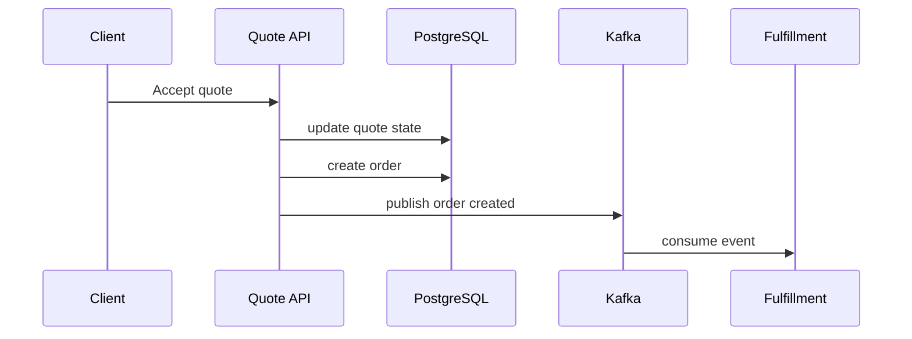
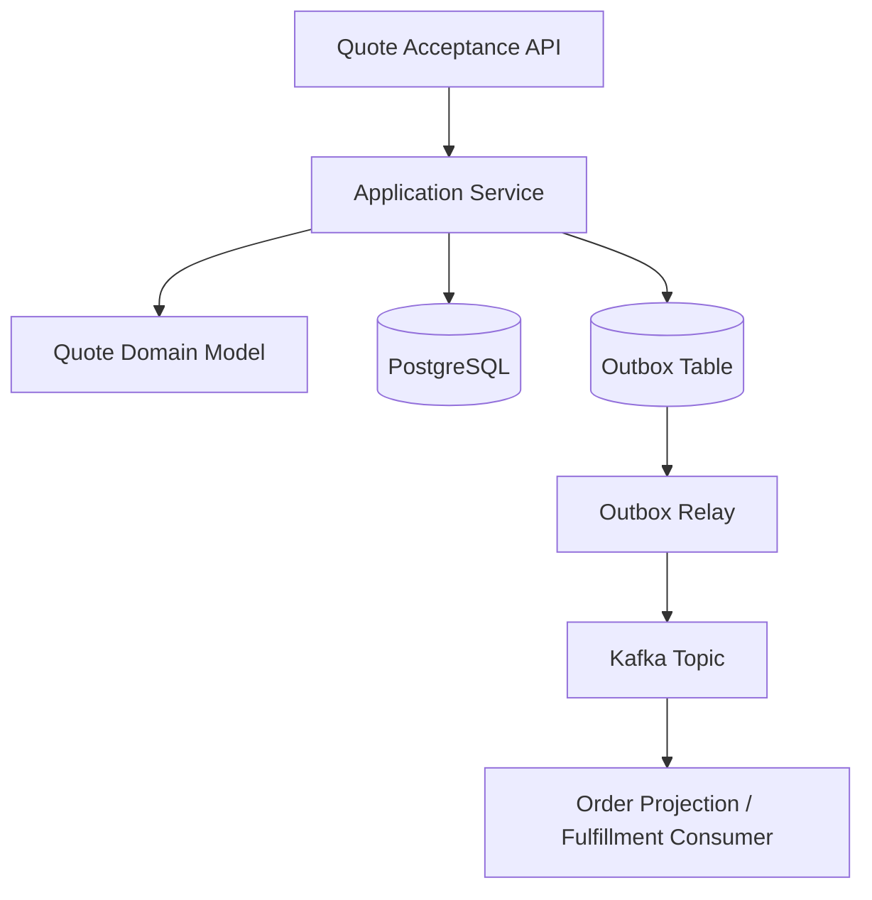

# Part 062 — Technical Design Documents and Architecture Decision Records

## 1. Source notes and scope boundary

This part uses public engineering practice references and the production architecture material built earlier in this series.

Public references to verify independently:

- Martin Fowler describes an Architecture Decision Record as a short document that captures and explains a single decision relevant to a product or ecosystem, including context and ramifications.
- Fowler also discusses decision records as lightweight artifacts often stored near the artifacts they describe.
- Google's public Engineering Practices documentation emphasizes maintainability, design, tests, documentation, and code health in review.
- Google SRE material emphasizes factual, blameless learning artifacts for production incidents and system improvement.

This part does not assume the actual CSG design doc template, ADR repository, architecture governance process, reviewer group, approval authority, or design review meeting format.

Use this as a senior/principal-level template, then adapt to internal templates and governance.

---

## 2. Core thesis

A design doc is not a long PR description.

An ADR is not a meeting note.

A strong technical decision artifact should make a future engineer able to answer:

- What problem were we solving?
- What constraints mattered?
- What options were considered?
- Why was this option chosen?
- What risks were accepted?
- What trade-offs were rejected?
- How will this be rolled out?
- How will it fail?
- How will we detect failure?
- How will we recover?
- How will this decision age?

For Quote & Order systems, design documentation is not bureaucracy. It is risk management.

Without decision records, teams forget why a system behaves the way it does.

Then future engineers see only the shape of the code, not the constraints that produced it.

That leads to dangerous refactors.

Example:

- A unique constraint looks redundant until you learn it prevents duplicate order creation after quote acceptance retry.
- A denormalized price snapshot looks ugly until you learn it preserves commercial evidence after catalog changes.
- A separate outbox table looks verbose until you learn it prevents event loss between PostgreSQL commit and Kafka publish.
- An extension field in a TMF API looks awkward until you learn it preserves customer compatibility.

Good design docs preserve the reasoning behind these decisions.

---

## 3. Design doc vs ADR vs PR vs runbook

Do not use one artifact for every purpose.

| Artifact | Purpose | Good for | Bad for |
|---|---|---|---|
| Design doc | Explore and justify a proposed design before implementation | Non-trivial architecture, alternatives, rollout, risks | Tiny local changes |
| ADR | Record a specific architecture decision after agreement | Decision history, future context, audit of trade-offs | Large implementation detail dump |
| PR description | Explain implemented diff and verification evidence | Code review, tests, migration notes | Debating major architecture from scratch |
| Runbook | Operate and recover the system | Incident response, support, mitigation | Explaining why architecture exists |
| Postmortem | Learn from production failure | Contributing causes, action items | Assigning blame or rewriting history |

A large change may require all of them.

Example: Introduce transactional outbox for order events.

- Design doc: compares direct Kafka publish vs outbox vs CDC.
- ADR: records decision to use transactional outbox for specific event families.
- PR: implements table, repository, relay, tests, metrics.
- Runbook: explains how to monitor stuck outbox rows and replay safely.
- Postmortem: if event loss happened before, captures why outbox was needed.

---

## 4. When a design doc is required

Require a design doc when the change affects more than local implementation.

Strong triggers:

- new service or bounded context;
- new public API or major API version;
- TMF API compatibility strategy;
- quote/order state machine change;
- pricing/approval governance change;
- order decomposition/orchestration model;
- new Kafka topic family or event contract;
- schema redesign or irreversible migration;
- tenant isolation model change;
- authentication/authorization model change;
- deployment topology change;
- on-prem upgrade strategy;
- operational workflow such as data repair or fallout handling.

Weak triggers:

- local refactor;
- helper extraction;
- non-behavioral code cleanup;
- test-only improvement;
- small bug fix with obvious scope.

The goal is not to document everything.

The goal is to document decisions that are costly to reverse or easy to misunderstand.

---

## 5. Design doc structure

A strong design doc is concise but complete.

Recommended structure:

1. Title
2. Status
3. Authors/reviewers
4. Context
5. Problem statement
6. Goals
7. Non-goals
8. Current behavior
9. Proposed design
10. Alternatives considered
11. Trade-off analysis
12. Data model impact
13. API/event contract impact
14. Security/tenant/audit impact
15. Consistency and failure model
16. Migration and rollout plan
17. Observability and operational readiness
18. Testing strategy
19. Backward compatibility
20. Open questions
21. Decision summary
22. Follow-up tasks

This may look long, but each section can be short.

The discipline is not length. The discipline is explicit reasoning.

---

## 6. Status model

Use clear status.

Example:

```md
Status: Draft
```

Possible states:

- `Draft` — author is still shaping problem and options;
- `In Review` — ready for feedback;
- `Accepted` — design direction approved;
- `Superseded` — replaced by later decision;
- `Rejected` — considered but not chosen;
- `Deprecated` — once valid, now being phased out.

For ADRs, avoid rewriting history.

If a decision changes, create a new ADR that supersedes the old one.

---

## 7. Context section

Context answers:

- Where are we in the system?
- What domain/business workflow is affected?
- What constraints are non-negotiable?
- What production incidents or customer pain motivated this?
- Which teams/systems are involved?
- What external standards or contracts matter?

Weak context:

> We need to improve order events.

Strong context:

> Order lifecycle events are currently emitted directly from application services after database commit. During retry and partial failure scenarios, we cannot prove that every accepted order state transition produced exactly one durable event. Fulfillment adapters, support dashboards, and reconciliation jobs depend on these events. The affected workflow is quote acceptance -> product order creation -> decomposition -> fulfillment handoff. The design must preserve backward compatibility for existing event consumers and must work in cloud and on-prem deployments.

The stronger version gives reviewers enough system context to reason.

---

## 8. Problem statement

A good problem statement is narrow and testable.

Bad:

> Kafka is unreliable.

Better:

> We need to guarantee that every committed order state transition that should be externally visible is eventually published as a Kafka event, without publishing events for rolled-back transactions, and without producing duplicate non-idempotent downstream effects during retry or replay.

Bad:

> Pricing needs refactoring.

Better:

> Current pricing calculation mixes catalog lookup, agreement overrides, discount stacking, and approval threshold evaluation in one application service. This makes it difficult to explain final price, test discount precedence, and invalidate approvals when commercial inputs change.

The problem statement should make design evaluation possible.

---

## 9. Goals and non-goals

Goals prevent under-design.

Non-goals prevent uncontrolled scope expansion.

Example for quote-to-order idempotency:

### Goals

- Prevent duplicate orders for repeated quote acceptance requests.
- Preserve idempotent API behavior for client retry.
- Create audit evidence for each acceptance attempt.
- Emit order-created event exactly once per created order in business terms.
- Support recovery after crash between state update and event publication.

### Non-goals

- Redesign all order lifecycle states.
- Replace Kafka.
- Introduce global distributed transactions.
- Solve duplicate events from all historical producers.
- Change public TMF API response shape in this release.

Non-goals protect the design from becoming a platform rewrite.

---

## 10. Current behavior section

A design doc must accurately describe the current system.

Include:

- current API behavior;
- current state machine;
- current data model;
- current integration flow;
- current known failure modes;
- current operational pain;
- current tests/observability gaps.

Use diagrams when useful.



If the current behavior is uncertain, state that explicitly.

Do not invent.

Use:

> Internal verification required: confirm whether order-created events are produced via direct Kafka producer, outbox relay, or CDC in the current implementation.

---

## 11. Proposed design section

The proposed design should show the new system shape and explain why.

Include:

- key components;
- ownership boundaries;
- data flow;
- transaction boundary;
- API/event contract changes;
- failure handling;
- rollout strategy.

Example:



Explain the core invariant:

> The database transaction commits quote acceptance, order creation, audit record, and outbox row together. Kafka publication happens asynchronously, but cannot be lost if the transaction commits.

This kind of statement is more valuable than a diagram alone.

---

## 12. Alternatives considered

A design doc without alternatives is often just advocacy.

At minimum, compare 2–4 options.

Example: event publication strategy.

| Option | Benefits | Costs | Failure mode | Verdict |
|---|---|---|---|---|
| Direct Kafka publish after DB commit | Simple, low latency | Event can be lost after commit before publish | Missing downstream event | Rejected |
| Publish before DB commit | Event emitted quickly | Event may describe rolled-back transaction | False event | Rejected |
| Transactional outbox | Atomic with DB state, replayable | Relay complexity, outbox monitoring | Stuck outbox row | Chosen |
| CDC from WAL | Low app code, scalable | Operational complexity, schema coupling | Connector failure/lag | Consider later |

The alternatives section proves the team understood trade-offs.

---

## 13. Trade-off analysis

Trade-offs should be explicit.

Useful dimensions:

- correctness;
- latency;
- throughput;
- operational complexity;
- migration risk;
- customer compatibility;
- on-prem feasibility;
- team familiarity;
- observability;
- security;
- long-term evolvability.

Do not write:

> This is better.

Write:

> This improves event durability and replayability at the cost of introducing a relay process, outbox backlog monitoring, and duplicate-publication handling. The trade-off is acceptable because order lifecycle events drive fulfillment and support workflows, where missing events are more expensive than delayed events.

That sentence reveals engineering judgment.

---

## 14. Data model impact

For Quote & Order systems, data model impact must be explicit.

Document:

- new tables;
- changed columns;
- indexes;
- constraints;
- migration order;
- backfill plan;
- data retention;
- tenant scoping;
- audit implications;
- expected row growth;
- operational queries.

Example:

```sql
CREATE TABLE order_event_outbox (
  id uuid PRIMARY KEY,
  tenant_id text NOT NULL,
  aggregate_type text NOT NULL,
  aggregate_id text NOT NULL,
  event_type text NOT NULL,
  event_version integer NOT NULL,
  payload jsonb NOT NULL,
  correlation_id text NOT NULL,
  causation_id text,
  status text NOT NULL,
  created_at timestamptz NOT NULL,
  published_at timestamptz,
  retry_count integer NOT NULL DEFAULT 0
);

CREATE INDEX order_event_outbox_pending_idx
  ON order_event_outbox (created_at)
  WHERE status = 'PENDING';
```

Then explain why each field exists.

A schema without rationale becomes future confusion.

---

## 15. API and event contract impact

Document both external and internal contracts.

### 15.1 REST/OpenAPI

Include:

- new endpoint or field;
- request/response compatibility;
- status code changes;
- error model changes;
- idempotency behavior;
- pagination/filtering behavior;
- TMF alignment/divergence;
- deprecation plan.

### 15.2 Kafka events

Include:

- event name;
- topic;
- key;
- schema version;
- required/optional fields;
- compatibility mode;
- replay behavior;
- duplicate handling expectation;
- known consumers;
- retention.

Example event contract summary:

```md
Event: ProductOrderCreated
Topic: product-order.lifecycle.v1
Key: tenantId + productOrderId
Compatibility: backward-compatible additive changes only
Replay: consumers must be idempotent by eventId or aggregateId + version
PII: no direct customer contact data in event payload
```

---

## 16. Security, tenant, and audit impact

Every non-trivial design doc should answer security questions.

Checklist:

- Who can perform the action?
- Which tenant/customer/account scope applies?
- Where is authorization enforced?
- What is the trusted source of actor identity?
- Does service-to-service call preserve or reduce authority?
- What sensitive data is read/written/emitted?
- What audit evidence is required?
- Is admin/support override possible?
- How is override controlled and audited?
- Are logs/events safe from PII leakage?

For Quote & Order, never treat security as an appendix.

It is part of domain correctness.

---

## 17. Consistency and failure model

This is where principal-level design usually differs from mid-level design.

Do not only describe the happy path.

Describe failure.

### 17.1 Consistency questions

- What must be strongly consistent?
- What may be eventually consistent?
- What is snapshotted?
- What is referenced live?
- What is source of truth?
- What happens during stale reads?
- Is reconciliation required?

### 17.2 Failure questions

- What if request retries?
- What if process crashes after DB commit?
- What if Kafka publish fails?
- What if consumer processes duplicate event?
- What if downstream times out after committing side effect?
- What if migration fails halfway?
- What if tenant config is missing?
- What if catalog version is retired?
- What if support needs manual repair?

Example failure table:

| Failure | Detection | Mitigation | Recovery | Residual risk |
|---|---|---|---|---|
| Outbox relay down | Pending outbox age alert | Restart/scale relay | Relay resumes from table | Event delay |
| Duplicate acceptance request | Unique quote-version/order constraint | Return existing order | Audit duplicate attempt | Client confusion if response not stable |
| Consumer poison message | DLQ metric/alert | Stop retry storm | Fix payload/consumer and replay | Delayed downstream update |
| Backfill job crash | Job checkpoint missing progress | Resume from checkpoint | Re-run validation query | Partial data until resume |

---

## 18. Migration and rollout plan

A design that cannot be rolled out safely is not complete.

Document:

- phases;
- feature flags;
- schema expand step;
- backfill step;
- dual-write/dual-read step;
- consumer migration;
- monitoring period;
- contract deprecation;
- rollback/roll-forward;
- on-prem upgrade path.

Example rollout:

```md
Phase 1: Add outbox table and relay disabled.
Phase 2: Write outbox rows in parallel with existing direct event publish.
Phase 3: Enable relay in shadow mode and compare event payloads.
Phase 4: Switch consumers to relay-published topic or event source.
Phase 5: Disable direct publish.
Phase 6: Remove old path after one release window.
```

Make rollback explicit:

- Can we disable feature flag?
- Can we ignore new column/table safely?
- Can old application run against new schema?
- Can new application run before backfill completes?
- Can we repair partially migrated data?

---

## 19. Observability and operational readiness

Every design doc should answer:

> How will we know if this design is failing?

Include:

- key logs;
- metrics;
- traces;
- dashboard changes;
- alert thresholds;
- runbook link;
- support queries;
- SLO impact;
- capacity expectations;
- data repair procedure.

Example operational signals for outbox:

- pending outbox row count;
- oldest pending outbox age;
- publish success/failure rate;
- retry count distribution;
- relay consumer lag;
- DLQ count;
- duplicate consumer event count;
- event publish latency from business commit to Kafka.

---

## 20. Testing strategy

Testing strategy should map to risk.

Example:

| Risk | Test |
|---|---|
| Duplicate quote acceptance creates duplicate order | Concurrent integration test + unique constraint test |
| Event lost after DB commit | Transactional outbox integration test |
| Consumer fails on duplicate event | Idempotent consumer replay test |
| API compatibility break | OpenAPI diff + contract test |
| Migration unsafe for old app | Backward compatibility migration test |
| Tenant leakage | Cross-tenant authorization/integration test |
| Missing audit evidence | Audit assertion in domain/integration test |

Avoid generic statements like:

> Add unit and integration tests.

Be specific.

---

## 21. ADR structure

An ADR should be short and focused.

Recommended template:

```md
# ADR-NNN: <Decision title>

## Status
Accepted | Superseded | Rejected | Deprecated

## Context
What problem and constraints led to this decision?

## Decision
What have we decided?

## Consequences
What improves? What gets harder? What risks remain?

## Alternatives considered
What else did we consider and why did we not choose it?

## Links
Design doc, PRs, incidents, runbooks, follow-up ADRs.
```

ADRs should capture one decision.

Not:

> ADR: Redesign order management.

Better:

> ADR: Use transactional outbox for order lifecycle events.

Better:

> ADR: Store accepted quote pricing as immutable snapshot.

Better:

> ADR: Use tenant ID as mandatory partition key component for order lifecycle events.

---

## 22. Example ADR: immutable accepted quote pricing snapshot

```md
# ADR-012: Store accepted quote pricing as immutable snapshot

## Status
Accepted

## Context
Accepted quotes are commercial commitments. Catalog prices, discount rules,
and enterprise agreements may change after quote acceptance. Support and audit
teams must be able to reconstruct the price accepted by the customer.

## Decision
When a quote reaches ACCEPTED state, the system stores an immutable pricing
snapshot at quote and quote-line level. Later catalog/pricing changes do not
mutate the accepted snapshot. Amendments create a new quote/order revision
rather than rewriting the accepted historical price.

## Consequences
Benefits:
- preserves commercial evidence;
- enables dispute reconstruction;
- prevents historical quotes from changing after catalog publish;
- simplifies audit review.

Costs:
- duplicated price data;
- snapshot schema must evolve carefully;
- reporting must distinguish current catalog price from accepted quote price.

## Alternatives considered
1. Always look up live catalog price.
   Rejected because historical commitments could change after catalog update.
2. Store only total price.
   Rejected because line-level explanation and approval evidence are required.
3. Store full explanation snapshot.
   Chosen where required for audit-sensitive calculations, but payload size
   must be controlled.

## Links
- Design doc: Quote pricing evidence model
- Related PRs: <internal links>
- Related runbook: pricing dispute reconstruction
```

This ADR explains why apparently duplicated data exists.

That protects future engineers from deleting it as “redundant.”

---

## 23. Example ADR: transactional outbox for order events

```md
# ADR-018: Use transactional outbox for order lifecycle events

## Status
Accepted

## Context
Order lifecycle events drive fulfillment, projections, support dashboards, and
reconciliation. Publishing directly to Kafka after database commit creates a
failure window where order state commits but event publication fails.

## Decision
For order lifecycle events, the application writes an outbox row in the same
PostgreSQL transaction as the business state change. A relay publishes pending
outbox rows to Kafka. Consumers must remain idempotent because duplicate
publication remains possible.

## Consequences
Benefits:
- committed state and publish intent are atomic;
- event publication is retryable;
- stuck events are observable in PostgreSQL;
- replay/backfill is easier.

Costs:
- relay process must be operated;
- outbox table growth must be managed;
- publication is eventually consistent;
- duplicate publication must be handled.

## Alternatives considered
1. Direct Kafka publish after commit.
   Rejected due to event-loss window.
2. Kafka publish before commit.
   Rejected due to false-event risk after rollback.
3. CDC from WAL.
   Not chosen initially due to operational complexity and on-prem constraints.
```

Notice the important sentence:

> Consumers must remain idempotent.

A good ADR does not oversell the decision.

It records residual risk.

---

## 24. Example design doc outline: order decomposition engine change

### Context

Order decomposition converts product order items into fulfillment work items or service orders. Current mapping cannot represent dependency constraints for bundled offerings that require sequential provisioning.

### Problem

We need a decomposition model that supports dependency graph execution, retry/resume, and fallout without hardcoding customer-specific logic in fulfillment adapters.

### Goals

- Represent decomposition output as durable DAG.
- Support parallel execution where safe.
- Support retry/resume per node.
- Preserve order item traceability.
- Support customer-specific catalog mapping via configuration/rules.

### Non-goals

- Replace all fulfillment adapters.
- Build a general-purpose workflow engine.
- Change public TMF622 API in this release.

### Options

1. Hardcode adapter-specific sequence.
2. Add simple ordered list of tasks.
3. Persist decomposition DAG with node state.
4. Adopt external workflow engine.

### Decision

Persist decomposition DAG with node state for the affected order categories.

### Failure model

- Node failure moves node and parent order to fallout.
- Retry resumes from failed node.
- Completed node is not re-executed unless explicit compensation is supported.
- Downstream unknown outcome requires reconciliation before retry.

### Operational readiness

- Dashboard by order ID showing DAG node states.
- Metrics for node failure count, retry count, oldest fallout age.
- Runbook for manual retry/resume.

This is the level of detail needed before implementing a high-risk order workflow change.

---

## 25. Common design doc anti-patterns

### 25.1 Solution-first document

Bad structure:

1. We will use tool X.
2. Here is how tool X works.
3. Here is the implementation plan.

Missing:

- problem;
- constraints;
- alternatives;
- failure model.

### 25.2 No non-goals

Without non-goals, design discussion expands endlessly.

### 25.3 Hidden compatibility break

A design that says “update API response” but does not discuss consumers is incomplete.

### 25.4 No migration plan

A design that changes schema or behavior without rollout strategy is not production-ready.

### 25.5 No failure model

Happy-path diagrams are not architecture.

### 25.6 No operational owner

If nobody can operate the design, the design is unfinished.

### 25.7 ADR as documentation dump

An ADR should capture a decision, not become a 40-page system manual.

---

## 26. Review checklist for design docs

When reviewing a design doc, ask:

### Problem clarity

- Is the problem precise?
- Is the affected domain/workflow clear?
- Are constraints explicit?
- Are assumptions marked?
- Are internal unknowns listed?

### Design quality

- Are bounded contexts respected?
- Are invariants explicit?
- Are transaction boundaries clear?
- Are API/event contracts considered?
- Are consistency choices explained?
- Are alternatives compared fairly?

### Production safety

- Is rollout phased?
- Is migration safe?
- Is rollback/roll-forward possible?
- Is observability defined?
- Is runbook impact considered?
- Is support/debugging path clear?

### Security and compliance

- Is authorization considered?
- Is tenant isolation preserved?
- Is audit evidence defined?
- Is PII/secrets exposure considered?
- Are admin/support workflows controlled?

### Testing and verification

- Does test plan map to failure modes?
- Are contract tests included when APIs/events change?
- Are migration tests included when schema changes?
- Are concurrency/retry tests included where needed?
- Are success criteria measurable?

---

## 27. Internal verification checklist

Verify these internally:

### Documentation process

- Official design doc template.
- Official ADR template.
- ADR repository location.
- Naming/numbering convention.
- Required reviewers.
- Approval process.
- Decision ownership.
- Supersession/deprecation process.

### Architecture governance

- When architecture review is required.
- Who approves cross-service changes.
- Who approves public API changes.
- Who approves database migration strategy.
- Who approves security-sensitive design.
- How customer-specific exceptions are recorded.

### Existing artifacts

- Recent accepted design docs.
- Recent rejected designs.
- Historical ADRs.
- Incident-driven decisions.
- Known technical debt records.
- Runbooks linked from design docs.

### Tooling

- Documentation platform.
- Diagram convention.
- Mermaid support.
- ADR linting or indexing.
- Searchability.
- Linkage between ticket, PR, design doc, ADR, runbook.

---

## 28. Practical exercises

### Exercise 1 — Write a mini design doc

Topic:

> Make quote acceptance idempotent and safe against duplicate order creation.

Include:

- context;
- problem;
- goals/non-goals;
- proposed design;
- alternatives;
- data model impact;
- API behavior;
- failure model;
- testing strategy;
- rollout plan.

### Exercise 2 — Write an ADR

Topic:

> Store catalog version snapshot on quote line items.

Keep it under two pages.

Make consequences explicit.

### Exercise 3 — Review a historical design doc

Pick an existing internal design doc.

Assess:

- whether alternatives were fairly compared;
- whether failure modes were described;
- whether rollout plan matched actual implementation;
- whether incidents/regressions occurred later;
- whether the doc is still accurate.

### Exercise 4 — Convert PR debate into ADR

Find a PR with long architecture debate.

Extract:

- decision;
- context;
- alternatives;
- consequences;
- unresolved risks.

Write a concise ADR.

---

## 29. Final mental model

Design docs and ADRs are tools for preserving reasoning.

They are not paperwork.

For enterprise Quote & Order engineering, they protect the team from:

- forgotten constraints;
- repeated debates;
- unsafe refactors;
- undocumented compatibility breaks;
- hidden operational risk;
- design decisions trapped in Slack or PR comments;
- onboarding by folklore.

A good design doc helps the team decide.

A good ADR helps the future team understand why the decision was made.

A senior engineer writes both with production reality in mind.

