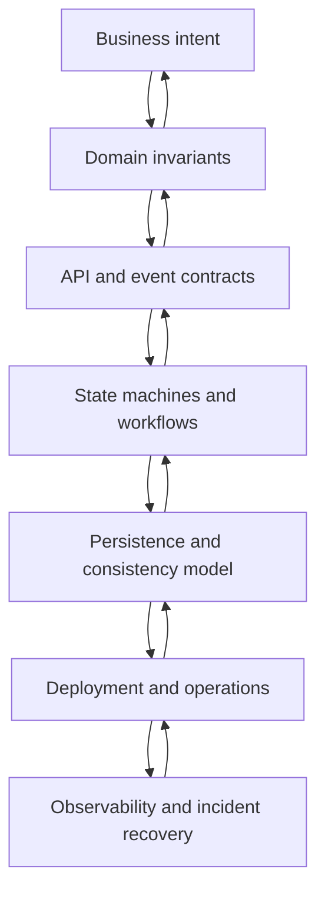

# Part 063 — Architecture Review: Trade-offs, Failure Modes, and Defensibility

## 1. Source notes and scope boundary

This part uses public engineering references and the architecture material already built in this series.

Public references to verify independently:

- AWS Well-Architected is organized around six pillars: operational excellence, security, reliability, performance efficiency, cost optimization, and sustainability.
- Google SRE material treats postmortems as factual learning artifacts that describe impact, mitigation, causes, and follow-up actions.
- TM Forum ODA/Open APIs provide an industry reference vocabulary for BSS/OSS integration, but they do not define the internal architecture of a specific product installation.

This part does **not** assume the actual CSG architecture review board, design approval process, internal principle set, architecture templates, deployment topology, or service boundaries.

Every section marked `Internal verification checklist` must be validated against the real codebase, design docs, production history, pipelines, deployment manifests, dashboards, and team practices.

---

## 2. Core thesis

Architecture review is not a meeting where senior engineers approve diagrams.

It is a risk-discovery process.

A good architecture review answers:

- What business invariant must never be violated?
- What failure modes are likely?
- What failure modes are rare but catastrophic?
- What consistency model is being chosen?
- What compatibility promise is being made?
- What operational burden is being created?
- What rollout path makes the change reversible?
- What evidence will prove the design works in production?

For Quote & Order systems, architecture review must be stricter than normal backend service review because the system controls commercial commitments.

A bug can produce:

- wrong price,
- unauthorized discount,
- invalid quote acceptance,
- duplicate order,
- failed fulfillment,
- billing mismatch,
- customer-specific contract breach,
- tenant data exposure,
- unrepairable audit gap.

The review question is not:

> Does the architecture look clean?

The better question is:

> Under realistic enterprise failure, can the system preserve business correctness, expose enough evidence, and recover without uncontrolled customer impact?

---

## 3. The architecture review stack

Review the design from the top down and bottom up.

Top-down review checks whether the architecture serves the business workflow.

Bottom-up review checks whether the selected technical mechanisms can actually support the promised behavior.



If the review starts at technology, it often misses domain risk.

Bad opening question:

> Should we use Kafka or REST?

Better opening questions:

- Is the downstream action synchronous or asynchronous in business reality?
- Can the upstream user continue when downstream is slow?
- Must the user know final completion immediately?
- Is duplicate delivery acceptable if the consumer is idempotent?
- What is the source of truth for current order state?
- What does support do when the result is unknown?

Only after those questions does Kafka vs REST become meaningful.

---

## 4. Review dimensions

Use these dimensions for every non-trivial Quote & Order architecture proposal.

| Dimension | Core question | Typical failure if ignored |
|---|---|---|
| Domain correctness | Which business rules must always hold? | Invalid quote/order enters lifecycle |
| Lifecycle safety | Are states and transitions explicit? | Impossible state, skipped approval, duplicate conversion |
| Consistency model | What is strong, eventual, snapshot, cached, or reconciled? | Stale price, stale catalog, conflicting order status |
| Compatibility | Who consumes this API/event/schema? | Customer integration breaks silently |
| Idempotency | What happens on retry, duplicate, replay, timeout? | Duplicate orders, duplicate fulfillment, duplicate billing |
| Data model | What is authoritative and queryable? | Data repair impossible, audit incomplete |
| Operational readiness | Can we deploy, observe, rollback, and repair it? | Incident cannot be diagnosed or mitigated |
| Security | Who can perform this action on whose data? | Privilege escalation or tenant leak |
| Performance | What is the hot path and bottleneck? | Pricing/quote/order latency collapses under load |
| Cost and supportability | What permanent burden does this create? | Fragile customization and support debt |

A principal-level review makes the implicit explicit.

---

## 5. Review input quality gate

Before reviewing architecture, check whether the proposal is reviewable.

A design is not reviewable if it lacks:

- business problem statement,
- current-state baseline,
- target users and systems,
- goals and non-goals,
- domain model changes,
- lifecycle/state changes,
- API/event/database changes,
- security impact,
- migration/rollout plan,
- failure mode analysis,
- observability plan,
- test strategy,
- rollback/recovery strategy.

A vague design creates a false sense of consensus.

Do not let the team approve ambiguity.

A useful review comment:

> The proposal says the order will be retried when fulfillment fails. Please define the retry unit, idempotency key, max retry policy, terminal state, operator action, audit event, and customer-visible status for the unknown-outcome case.

That comment is architecture review.

---

## 6. Domain-first review for Quote & Order

Architecture review starts with the domain.

For a Quote & Order system, ask:

### 6.1 Catalog

- Which catalog version is used?
- Is the quote bound to a catalog snapshot or live catalog reference?
- Can the catalog change after quote creation?
- What happens when a quote is accepted after catalog retirement?
- Are product characteristics copied or referenced?
- Does the design preserve explainability of configuration decisions?

### 6.2 Pricing

- Is price recalculated or snapshotted?
- What invalidates a price?
- What discount hierarchy applies?
- Are agreement-specific prices represented explicitly?
- Is margin approval based on immutable evidence?
- Can the same quote produce different order prices after catalog/pricing changes?

### 6.3 Approval

- What action requires approval?
- What exactly is approved?
- Is approval invalidated by quote edit, reprice, customer change, or agreement change?
- Does the approver authority get snapshotted?
- Is maker-checker enforced?
- Can an admin override bypass audit?

### 6.4 Quote lifecycle

- Can a draft be ordered?
- Can an expired quote be accepted?
- Can two requests convert the same quote to two orders?
- Is quote acceptance idempotent?
- What is the terminal state model?
- Are illegal transitions rejected consistently?

### 6.5 Order lifecycle

- What is the difference between accepted, in progress, fallout, completed, cancelled, and failed?
- Is order item state separate from order state?
- How is partial completion represented?
- What is the cancellation model?
- How are amendment and retry represented?
- Can support resume from a known checkpoint?

If these answers are missing, the architecture is not yet ready for technology selection.

---

## 7. Contract review: API, event, and integration surface

Enterprise architecture must respect long-lived consumers.

Review every contract as if an external customer, partner adapter, on-prem deployment, or old client will depend on it longer than expected.

### 7.1 REST API review

Ask:

- Is this a resource operation or command operation?
- Is the idempotency model explicit?
- Are status codes semantically stable?
- Are error codes machine-readable?
- Does the response expose too much internal state?
- Are enum additions safe for consumers?
- Are nullable/default semantics clear?
- Is tenant/account scoping explicit?
- Is OpenAPI updated and compatibility-checked?

Bad API evolution:

```json
{
  "status": "FAILED"
}
```

Better API evolution:

```json
{
  "status": "FALLOUT",
  "statusReason": "DOWNSTREAM_TIMEOUT_UNKNOWN_OUTCOME",
  "recoverability": "OPERATOR_ACTION_REQUIRED",
  "correlationId": "..."
}
```

The second model supports operations.

### 7.2 Kafka event review

Ask:

- Is this event a fact that already happened?
- Is it actually a command disguised as an event?
- What is the partition key?
- What ordering guarantee is expected?
- Is replay safe?
- Is schema evolution safe?
- Does the event contain correlation and causation IDs?
- Are tenant and security boundaries respected?
- Can consumers ignore unknown fields and enum values?

Bad event:

```json
{
  "type": "OrderUpdated",
  "data": { }
}
```

Better event:

```json
{
  "eventId": "...",
  "eventType": "ProductOrderStateChanged",
  "eventVersion": 2,
  "aggregateType": "ProductOrder",
  "aggregateId": "ord-123",
  "aggregateVersion": 17,
  "occurredAt": "2026-07-08T08:31:00Z",
  "tenantId": "tenant-a",
  "correlationId": "...",
  "causationId": "...",
  "previousState": "FULFILLMENT_IN_PROGRESS",
  "newState": "FALLOUT",
  "reasonCode": "SERVICE_ORDER_TIMEOUT_UNKNOWN_OUTCOME"
}
```

The second event supports debugging, replay, audit, and projection correctness.

### 7.3 TMF-aligned API review

If a design claims TMF alignment, ask:

- Which TMF API and version?
- Which resources and operations?
- Which fields are standard vs extension?
- What is the internal-to-external mapping?
- Are extensions namespaced and documented?
- Is there a conformance target?
- Are internal lifecycle states being leaked directly?
- Are standard semantics being changed silently?

TMF alignment should reduce integration ambiguity.

It should not become a justification for blindly exposing internal models.

---

## 8. Data and consistency review

A design is not production-ready until the data model and consistency model are explicit.

Ask:

- What is the source of truth for each entity?
- What is persisted as snapshot?
- What is persisted as reference?
- What is cached?
- What is derived?
- What is eventually consistent?
- What is reconciled?
- What is immutable?
- What can be corrected manually?

### 8.1 Source-of-truth matrix

A design doc should include something like this:

| Data | Source of truth | Consumer | Consistency | Repair path |
|---|---|---|---|---|
| Product offering definition | Catalog service | Quote/pricing/order | Versioned snapshot/reference | Catalog correction/version publish |
| Quote commercial price | Quote/pricing context | Order/billing handoff | Immutable snapshot after acceptance | Controlled adjustment or new quote |
| Product order lifecycle | Order service | UI/fulfillment/support | Strong within order aggregate, event-driven externally | Order repair workflow |
| Product inventory | Inventory system/context | Quote amendment/order validation | Eventually consistent lookup/snapshot | Reconciliation with inventory owner |
| Approval evidence | Approval/quote context | Audit/support/compliance | Immutable evidence | Add correction record, do not overwrite |

Without this table, reviewers will argue implementation details while missing correctness boundaries.

### 8.2 Transaction boundary review

Ask:

- What is committed atomically?
- Is event publication atomic with state change?
- Is there an outbox?
- Are unique constraints used to prevent duplicate business actions?
- Does the design depend on distributed transaction?
- Does retry after timeout create duplicate side effects?

For Quote & Order systems, the most dangerous bugs often sit between database commit, event publication, and external side effect.

A principal-level review always checks this seam.

---

## 9. Failure mode review

Every architecture proposal should include at least one failure-mode table.

Example:

| Failure mode | Expected system behavior | Detection | Mitigation | Recovery |
|---|---|---|---|---|
| Duplicate quote acceptance request | One order created; second request returns same result | Duplicate idempotency metric | Unique constraint + idempotency key | No repair needed |
| Kafka event published twice | Consumer dedupes by event ID or aggregate sequence | Duplicate consumed metric | Inbox/processed-event table | Replay safe |
| Fulfillment timeout with unknown outcome | Order enters fallout/unknown state | Timeout alert + fallout dashboard | Stop automatic retry if unsafe | Operator reconciliation |
| Catalog changed after quote pricing | Accepted quote retains price/catalog snapshot | Price snapshot audit | Immutable snapshot | New quote/amendment |
| DB migration locks hot table | Deployment blocked or slow query spike | Lock wait alert | Abort/rollback migration | Safer expand-contract migration |
| Cross-tenant cache key bug | Request rejected or no data leak due to key scoping | Security alert/test | Tenant-aware cache key | Incident + audit + data exposure analysis |

If the proposal says "this should not happen", treat that as a design smell.

Production systems fail at boundaries.

Architecture review exists to make those failures survivable.

---

## 10. Trade-off review

A design with no trade-offs is usually hiding them.

Force trade-offs to be named.

### 10.1 Strong consistency vs availability

Strong consistency helps when:

- accepting a quote,
- creating an order,
- applying approval,
- enforcing tenant access,
- preventing duplicate conversion,
- preserving commercial evidence.

Eventual consistency may be acceptable when:

- updating read models,
- publishing notifications,
- synchronizing downstream status,
- refreshing installed-base views,
- rebuilding analytics projections.

Review question:

> What customer-visible harm occurs if this data is stale for 30 seconds, 5 minutes, or 1 hour?

### 10.2 Synchronous vs asynchronous integration

Synchronous calls help when:

- user needs immediate validation,
- failure can be clearly returned,
- latency budget is predictable,
- no long-running downstream work is involved.

Asynchronous workflows help when:

- downstream action is long-running,
- retries are needed,
- partial completion exists,
- manual fallout exists,
- throughput and decoupling matter.

Review question:

> If the downstream timeout occurs after the downstream already committed the action, what state does the upstream store?

### 10.3 Snapshot vs live reference

Snapshot helps when:

- audit matters,
- commercial evidence matters,
- future changes must not rewrite past decisions,
- quote/order must be explainable years later.

Live reference helps when:

- data must reflect latest truth,
- stale data is dangerous,
- object is not part of historical commitment.

Review question:

> Will a future catalog/customer/pricing update change the meaning of an already accepted quote?

### 10.4 Generic platform vs customer-specific customization

Generic platform helps when:

- behavior is common across customers,
- upgrade path matters,
- supportability matters,
- product coherence matters.

Customer-specific customization may be necessary when:

- contract requires it,
- regulatory or integration constraint is real,
- deployment is dedicated,
- commercial value outweighs long-term support burden.

Review question:

> Is this customization a product capability, a configuration rule, an adapter behavior, or a fork?

Do not allow customer-specific behavior to leak everywhere.

---

## 11. Rollout review

Architecture is incomplete without rollout.

Ask:

- Can this be released incrementally?
- Can old and new versions run together?
- Is the database migration backward compatible?
- Is event schema evolution safe?
- Are feature flags needed?
- Can we enable by tenant/customer/environment?
- Is there shadow mode?
- Is there dual-read or dual-write comparison?
- What metric says rollout is healthy?
- What metric says rollback is required?

### 11.1 Rollout pattern ladder

Prefer lower-risk rollout patterns:

1. Internal-only code path behind disabled flag.
2. Shadow read without customer-visible effect.
3. Shadow write to new table/projection with comparison.
4. Single tenant/customer enablement.
5. Limited workflow enablement.
6. Gradual traffic expansion.
7. Full rollout.
8. Contract deprecation and old path removal.

Cutover without evidence should be treated as exceptional.

---

## 12. Observability review

A design that cannot be observed cannot be operated.

Ask:

- Which business IDs appear in logs?
- Which technical IDs appear in logs?
- Is trace propagation preserved through REST and Kafka?
- Are state transitions logged as structured events?
- Are metrics low-cardinality and actionable?
- Does the dashboard show business health, not only infrastructure health?
- Is there an alert before customer-visible damage becomes large?
- Is there a runbook for the top failure modes?

For Quote & Order, minimum operational signals often include:

- quote creation rate,
- quote pricing latency,
- quote acceptance failure rate,
- duplicate acceptance attempts,
- order creation rate,
- order state age by state,
- order fallout count,
- service order timeout count,
- outbox age,
- Kafka consumer lag age,
- DB lock wait duration,
- migration duration,
- cross-tenant authorization failures,
- approval override count.

Do not approve a design that adds a new state or async workflow without new observability.

---

## 13. Security and tenant review

Ask:

- Which actor can perform this action?
- Is authorization checked at API, command, and domain transition levels?
- Is tenant/account scope enforced in every query?
- Are cache keys tenant-aware?
- Are events tenant-scoped?
- Is PII minimized and redacted?
- Are admin/support actions audited?
- Are approval authority and maker-checker preserved?

A common architecture mistake is treating security as middleware.

For lifecycle systems, authorization is domain logic.

Example:

- `POST /quotes/{id}/accept` is not just authenticated access.
- It must verify quote ownership, tenant scope, quote state, price validity, approval validity, actor authority, agreement constraints, and idempotency.

Security review must inspect the command semantics, not only the endpoint annotation.

---

## 14. Cost and supportability review

Architecture decisions create permanent operational surface.

Ask:

- How many teams will need to understand this?
- How many services must be deployed together?
- Does this add a new runtime dependency?
- Does this add customer-specific support burden?
- Does this complicate on-prem upgrades?
- Does this require new dashboards/runbooks?
- Does this add a new data repair path?
- Does this introduce a new schema/event/API version?
- Who owns it after launch?

The most expensive architecture is not always the one with the highest cloud bill.

Often it is the one with:

- unclear ownership,
- hard-to-debug failure,
- customer-specific forks,
- non-replay-safe events,
- irreversible migrations,
- undocumented operational procedures.

---

## 15. Example architecture review: quote acceptance to product order creation

Scenario:

A proposal says:

> When a customer accepts a quote, the quote service will call the order service to create a product order. If the order service fails, the UI will show an error and the user can retry.

This is not enough.

### 15.1 Review questions

Domain:

- Can the same accepted quote create multiple orders?
- What state does the quote enter after acceptance begins?
- Is acceptance reversible?
- Is price approval still valid at acceptance time?

API:

- Is quote acceptance idempotent?
- Does the API accept an idempotency key?
- Does retry return the same order ID?

Transaction:

- Is quote state committed before or after order creation?
- Is there a durable acceptance attempt record?
- Is the order request recorded before external call?

Failure:

- What if order service times out but creates the order?
- What if quote service crashes after order creation but before updating quote?
- What if user retries from another browser tab?

Observability:

- Can support find acceptance attempt by quote ID?
- Can support identify whether an order was created?
- Is there a dashboard for stuck acceptance attempts?

Recovery:

- Can the system reconcile quote acceptance attempts with orders?
- Can an operator link a created order back to the quote?
- Is manual repair audited?

### 15.2 Safer architecture sketch

A safer design may include:

- quote acceptance command with idempotency key,
- quote state transition to `ACCEPTANCE_IN_PROGRESS`,
- durable acceptance attempt table,
- unique constraint on quote-to-order conversion,
- transactional outbox event `QuoteAccepted`,
- order service consumer creates product order idempotently,
- order ID returned through read model or polling,
- reconciliation job for stuck attempts,
- operator recovery command for unknown outcome.

This is not automatically the only correct design.

But it exposes the real decision surface.

---

## 16. Architecture red flags

Watch for these phrases:

- "This should never happen."
- "We can just retry."
- "The UI will prevent that."
- "This is only internal."
- "No customer uses that field."
- "We do not need idempotency because Kafka is exactly-once."
- "We can clean it up later."
- "This migration is small."
- "It is just a config change."
- "The old API is deprecated, so consumers should not care."
- "Support can fix it manually."

These phrases are not always wrong.

But each one should trigger deeper review.

---

## 17. Principal-level review template

Use this template for architecture review comments.

```md
## Architecture review summary

### Decision being reviewed

<What is changing?>

### Domain invariant impact

<Which quote/order/catalog/pricing/customer/security invariants are affected?>

### Compatibility impact

<REST API, Kafka event, TMF mapping, DB schema, customer integration, on-prem upgrade>

### Consistency model

<Strong/eventual/snapshot/cache/reconciliation boundaries>

### Failure modes

| Failure | Detection | Mitigation | Recovery |
|---|---|---|---|
| ... | ... | ... | ... |

### Rollout plan

<Feature flag, tenant enablement, shadow mode, migration, rollback>

### Observability

<Logs, metrics, traces, dashboard, alert, runbook>

### Open questions

<What must be resolved before approval?>

### Recommendation

Approve / approve with conditions / reject / request redesign.
```

---

## 18. Internal verification checklist

Use this checklist during onboarding and real design review.

### Architecture governance

- Where are internal architecture principles documented?
- Who approves major design decisions?
- What triggers architecture review?
- Is there an architecture review board or informal senior review group?
- Where are accepted/rejected design docs stored?

### Existing decisions

- Which ADRs exist for Quote & Order?
- Which old decisions are still valid?
- Which decisions were superseded?
- Which production incidents changed architecture direction?

### Domain architecture

- What are the actual bounded contexts?
- Which service owns quote lifecycle?
- Which service owns order lifecycle?
- Which service owns pricing?
- Which service owns approval?
- Which service owns catalog snapshotting?

### Integration architecture

- Which systems integrate through REST?
- Which systems integrate through Kafka?
- Which systems use batch/file/manual integration?
- Which integrations are customer-specific?
- Which integrations have reconciliation jobs?

### Operational architecture

- Which services have SLOs?
- Which dashboards are used during incidents?
- Which alerts are actionable?
- Which runbooks exist?
- Which production incidents are most relevant for architecture review?

### Security architecture

- How is tenant isolation enforced?
- How is authorization enforced?
- How are admin actions audited?
- How are service-to-service calls authorized?
- Where is PII redacted?

---

## 19. Exercises

### Exercise 1 — Review an old design doc

Pick one internal design doc.

Create a table:

| Area | Covered? | Missing risk | Follow-up question |
|---|---:|---|---|
| Domain invariants | Yes/No | ... | ... |
| Failure modes | Yes/No | ... | ... |
| Rollout | Yes/No | ... | ... |
| Observability | Yes/No | ... | ... |
| Data repair | Yes/No | ... | ... |

Do not judge the author.

Use it to learn the review culture and current architecture maturity.

### Exercise 2 — Build a failure-mode table

Choose one workflow:

- quote acceptance,
- price recalculation,
- order decomposition,
- service order callback,
- catalog publish,
- migration rollout.

Write at least 10 failure modes.

For each one, define:

- detection signal,
- customer impact,
- mitigation,
- recovery,
- permanent prevention.

### Exercise 3 — Write one conditional approval

Practice a review response:

```md
I think the direction is reasonable, but I would only approve after three changes:

1. Add an explicit idempotency model for <command>.
2. Define the reconciliation path for <unknown outcome>.
3. Add dashboard/alert coverage for <stuck state>.

Without these, the design may work in the happy path but will be difficult to operate during partial failure.
```

---

## 20. Summary

Architecture review is not about taste.

It is about making risk visible before production makes it expensive.

For Quote & Order systems, the strongest review signal is the ability to reason across:

- domain invariants,
- lifecycle state machines,
- API and event contracts,
- PostgreSQL transaction boundaries,
- Kafka replay/idempotency,
- Kubernetes deployment behavior,
- security and tenant isolation,
- observability and incident recovery,
- customer upgrade/support constraints.

A senior engineer can review code.

A principal-level engineer can review the system consequences of the code.

That is the standard this series is building toward.
