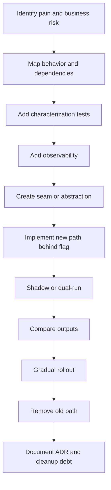
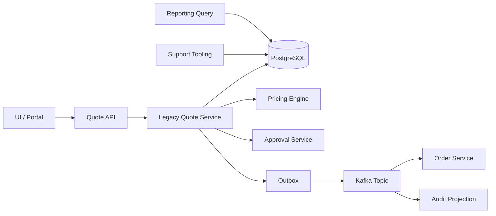
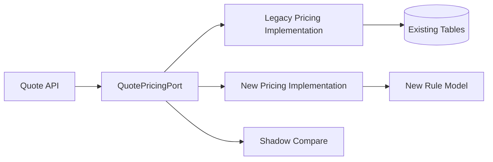
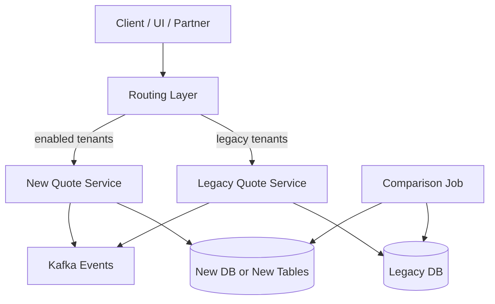

# Part 064 — Refactoring Legacy Enterprise Systems Safely

## 1. Source notes and scope boundary

This part uses public refactoring and modernization patterns plus the production-grade material from earlier parts.

Public references to verify independently:

- Martin Fowler describes the Strangler Fig Application pattern as a way to gradually create a new system around the edges of an old system, reducing risk compared with a big cut-over rewrite.
- Fowler's original Strangler Fig discussion emphasizes reduced risk, steady value delivery, frequent releases, and monitoring progress.
- Branch by Abstraction is described as a technique for making large-scale change gradually while continuing to release regularly.
- Legacy displacement patterns emphasize incremental replacement, seams, abstraction, and operational continuity.

This part does **not** assume CSG has a specific legacy modernization program, legacy module, strangler architecture, internal refactoring policy, or migration framework.

Use the `Internal verification checklist` sections to validate the real situation.

---

## 2. Core thesis

Safe refactoring is not code cleanup.

Safe refactoring is controlled risk reduction.

In enterprise Quote & Order systems, refactoring can break:

- pricing correctness,
- quote approval validity,
- order state transitions,
- catalog compatibility,
- customer-specific behavior,
- TMF-compatible API contracts,
- Kafka event schemas,
- database migration safety,
- audit evidence,
- on-prem upgrade behavior.

A senior engineer does not ask:

> Is the new code cleaner?

A senior engineer asks:

> Can we prove the new implementation preserves externally observable business behavior while reducing future change risk?

The proof matters more than the elegance.

---

## 3. What “legacy” means in enterprise systems

Legacy does not mean old.

Legacy means hard to change safely.

A two-month-old module can be legacy if it has:

- unclear ownership,
- hidden business rules,
- no characterization tests,
- unsafe migration path,
- implicit state transitions,
- customer-specific branches,
- unobservable failures,
- schema/event/API coupling,
- manual support dependencies,
- no rollback path.

An old module can be healthy if it has:

- stable contracts,
- clear invariants,
- strong test coverage,
- good observability,
- known failure modes,
- safe extension points,
- documented decisions.

Therefore, legacy assessment must be based on change risk, not age.

---

## 4. Why enterprise refactoring is dangerous

Refactoring a Quote & Order system is dangerous because behavior often lives outside the class you are changing.

Behavior may be encoded in:

- database constraints,
- PL/pgSQL triggers,
- MyBatis dynamic SQL,
- JSONB payload assumptions,
- UI validation,
- Kafka consumers,
- downstream partner mappings,
- customer-specific configuration,
- approval threshold tables,
- support runbooks,
- reporting queries,
- on-prem upgrade scripts.

A local refactor can have non-local effects.

Example:

You rename an order status from `FAILED` to `FALLOUT`.

Potential hidden breakage:

- external API clients do not recognize new enum,
- Kafka consumers reject message,
- BI report filters fail,
- support runbook no longer matches UI,
- migration leaves old rows unmapped,
- customer-specific adapter maps unknown status to terminal failure,
- billing handoff ignores the order.

A safe refactor starts with impact mapping.

---

## 5. Refactoring strategy ladder

Choose the lowest-risk strategy that achieves the goal.

| Strategy | Best for | Risk | Typical control |
|---|---|---:|---|
| Small in-place refactor | Local cleanup with strong tests | Low | Unit/integration tests |
| Characterize then refactor | Hidden behavior but stable interface | Medium | Golden master / characterization tests |
| Branch by abstraction | Replacing implementation behind same interface | Medium | Abstraction seam + feature flag |
| Strangler pattern | Replacing subsystem incrementally | Medium/High | Routing + shadow/dual-run |
| Parallel run | High-risk logic replacement | High | Compare old/new outputs |
| Big-bang rewrite | Almost never ideal | Very high | Rarely defensible |

The goal is not to avoid change.

The goal is to make change observable, reversible, and incremental.

---

## 6. The safe refactoring playbook

Use this sequence for non-trivial refactoring.



Do not skip from B to F.

That is how clean rewrites create production incidents.

---

## 7. Step 1 — Identify pain and business risk

Do not refactor because code looks ugly.

Refactor because the current shape causes a measurable engineering or business problem.

Good refactoring drivers:

- pricing rules are unsafe to change,
- quote lifecycle rules are duplicated,
- order state transitions are implicit,
- MyBatis dynamic SQL is error-prone,
- customer-specific branches are multiplying,
- migration is blocked by schema coupling,
- event publishing is not atomic with state changes,
- tests cannot isolate domain behavior,
- support cannot diagnose failure,
- performance bottleneck is structural.

Bad refactoring drivers:

- preference for a new framework,
- desire to make everything “DDD”,
- dislike of old code style,
- desire to remove all legacy at once,
- assumption that new code is automatically safer.

Refactoring must have a problem statement.

Example:

```md
Problem:
Quote acceptance logic is duplicated across API controller, service method, and batch conversion path.
This creates inconsistent approval invalidation behavior and has already caused two production bugs.

Goal:
Centralize quote acceptance transition guard in a domain-level command handler while preserving current API/event/database behavior.

Non-goal:
Do not redesign the full quote lifecycle in this change.
```

---

## 8. Step 2 — Map behavior and dependencies

Before changing a legacy area, build a behavior map.

### 8.1 Behavior inventory

For a target module, list:

- commands,
- queries,
- lifecycle transitions,
- validations,
- side effects,
- events,
- database writes,
- downstream calls,
- audit records,
- scheduled jobs,
- support scripts,
- customer-specific overrides.

### 8.2 Dependency map



The map should include non-code dependencies.

Examples:

- reporting jobs,
- dashboards,
- manual repair SQL,
- customer adapter transformations,
- on-prem deployment scripts,
- business operation runbooks.

---

## 9. Step 3 — Add characterization tests

Characterization tests capture what the system currently does.

They do not initially judge whether behavior is ideal.

They protect against accidental behavior change.

### 9.1 What to characterize

For Quote & Order systems, characterize:

- quote transition rules,
- approval invalidation rules,
- price calculation edge cases,
- discount stacking behavior,
- catalog compatibility behavior,
- order creation idempotency,
- order item state aggregation,
- amendment behavior,
- cancellation behavior,
- error codes and response shape,
- event payloads,
- audit records,
- database rows created.

### 9.2 Characterization test example

```java
@Test
void acceptingApprovedQuoteCreatesExactlyOneOrderAndPreservesPriceSnapshot() {
    var quote = fixtures.approvedQuote()
        .withCatalogVersion("catalog-v42")
        .withTotalPrice("100.00", "USD")
        .persist();

    var first = quoteApi.accept(quote.id(), idempotencyKey("same-key"));
    var second = quoteApi.accept(quote.id(), idempotencyKey("same-key"));

    assertThat(first.orderId()).isEqualTo(second.orderId());
    assertThat(orderRepository.find(first.orderId()).priceSnapshot())
        .isEqualTo(quote.priceSnapshot());
    assertThat(outboxEventsFor(quote.id(), "QuoteAccepted")).hasSize(1);
}
```

This test protects behavior before refactoring implementation.

### 9.3 Golden master caution

Golden master testing can help for complex pricing/configuration outputs.

But be careful:

- It can lock in incorrect behavior.
- It can become noisy if output contains timestamps or IDs.
- It can hide semantic differences.
- It should be paired with targeted invariant tests.

Use characterization to make refactoring safe, not to preserve bugs forever.

---

## 10. Step 4 — Add observability before changing behavior

If you cannot observe the old path, you cannot safely compare the new path.

Before refactoring, add:

- structured logs with quote/order/customer/tenant IDs,
- command outcome metrics,
- state transition metrics,
- error reason counters,
- outbox publication latency,
- old/new path comparison metrics,
- feature flag tags,
- trace spans around critical calculation.

For high-risk refactors, add a dashboard before rollout.

Example metrics:

```text
quote_acceptance_attempt_total{path="legacy|new", outcome="success|rejected|error"}
quote_acceptance_duplicate_total{path="legacy|new"}
quote_acceptance_price_mismatch_total{comparison="shadow"}
quote_acceptance_latency_seconds{path="legacy|new"}
```

Observability is not post-refactor cleanup.

It is part of the safety mechanism.

---

## 11. Step 5 — Create a seam

A seam is a controlled boundary where you can change implementation without changing callers.

Common seams:

- Java interface,
- command handler boundary,
- repository boundary,
- adapter boundary,
- feature flag router,
- API facade,
- database view,
- Kafka topic bridge,
- anti-corruption layer.

### 11.1 Bad seam

```java
if (customerId.equals("CUSTOMER_A")) {
    return newPricingEngine.calculate(input);
}
return legacyPricingEngine.calculate(input);
```

This couples routing to business identity in random code.

### 11.2 Better seam

```java
public interface QuotePricingPort {
    PriceResult calculate(PriceCommand command);
}

public final class RoutedQuotePricingPort implements QuotePricingPort {
    private final PricingRoutePolicy routePolicy;
    private final QuotePricingPort legacy;
    private final QuotePricingPort next;

    @Override
    public PriceResult calculate(PriceCommand command) {
        if (routePolicy.useNextPricing(command.tenantId(), command.catalogVersion())) {
            return next.calculate(command);
        }
        return legacy.calculate(command);
    }
}
```

The seam is explicit.

The routing policy is testable.

The rollout can be controlled.

---

## 12. Branch by abstraction

Branch by abstraction is useful when replacing an implementation while continuing to release regularly.

The rough sequence:

1. Identify the behavior to replace.
2. Introduce an abstraction over the old implementation.
3. Route all callers through the abstraction.
4. Add the new implementation behind the same abstraction.
5. Test old and new implementations against the same contract.
6. Gradually route traffic to the new implementation.
7. Remove old implementation after confidence is high.
8. Simplify the abstraction if it is no longer needed.

### 12.1 Quote pricing example



The goal is not to create permanent indirection.

The goal is to create a temporary migration boundary.

Long-lived abstractions must earn their keep.

---

## 13. Strangler pattern for subsystem replacement

The strangler pattern is useful when replacing a whole subsystem incrementally.

It works best when you can route by:

- endpoint,
- tenant,
- product family,
- catalog version,
- workflow type,
- feature flag,
- message type.

### 13.1 Good strangler candidates

- extracting catalog read API,
- replacing pricing calculation engine,
- extracting quote approval workflow,
- moving order decomposition to a new process manager,
- replacing legacy customer adapter,
- building new audit projection.

### 13.2 Poor strangler candidates

- tightly coupled transaction without clear boundary,
- shared mutable database tables with undocumented triggers,
- behavior that cannot be observed or compared,
- functionality with no tests and no stable input/output shape,
- change requiring all customers to cut over at once.

### 13.3 Strangler routing example



This pattern requires strong contract discipline.

The new path must preserve external behavior unless the change is intentionally versioned.

---

## 14. Shadow mode and dual-run

Shadow mode runs the new logic without making it authoritative.

Use it for high-risk logic:

- pricing,
- discounting,
- approval eligibility,
- catalog compatibility,
- order decomposition,
- inventory amendment validation.

### 14.1 Shadow pricing example

Request path:

1. API receives quote pricing request.
2. Legacy pricing produces authoritative response.
3. New pricing produces shadow response asynchronously or in bounded synchronous mode.
4. Comparison result is recorded.
5. User sees legacy result.
6. Metrics track divergence.

Comparison dimensions:

- total price,
- recurring charge,
- non-recurring charge,
- discount amount,
- tax handling if in scope,
- approval requirement,
- margin threshold,
- error code,
- explainability trace.

Do not switch authority until divergence is understood.

Not all divergence is a bug.

Some divergence reveals existing legacy bugs.

But every divergence must be classified.

---

## 15. Refactoring Java service code safely

### 15.1 Extract command handlers

Legacy services often combine controller, validation, domain transition, persistence, event publishing, and downstream call.

Target shape:

```java
public final class AcceptQuoteCommandHandler {
    private final QuoteRepository quoteRepository;
    private final ApprovalPolicy approvalPolicy;
    private final OrderCreationPort orderCreationPort;
    private final OutboxPublisher outboxPublisher;

    @Transactional
    public AcceptQuoteResult handle(AcceptQuoteCommand command) {
        Quote quote = quoteRepository.findForUpdate(command.quoteId(), command.tenantId());

        quote.accept(command.actor(), approvalPolicy, command.now());

        quoteRepository.save(quote);
        outboxPublisher.append(quote.pullDomainEvents());

        return AcceptQuoteResult.accepted(quote.id());
    }
}
```

The exact internal pattern must follow the codebase.

But the intent is clear:

- command boundary,
- tenant boundary,
- transactional boundary,
- domain transition boundary,
- outbox boundary.

### 15.2 Avoid “refactor plus behavior change”

Separate changes:

1. Add tests.
2. Move code without behavior change.
3. Introduce seam.
4. Add new behavior behind flag.
5. Remove old behavior after rollout.

Bundling these together makes review nearly impossible.

### 15.3 Preserve error compatibility

Do not accidentally change:

- HTTP status codes,
- machine-readable error codes,
- validation message structure,
- event type names,
- enum values,
- database status values,
- audit event names,
- support workflow expectations.

If error compatibility changes intentionally, treat it as API evolution.

---

## 16. Refactoring MyBatis and SQL safely

MyBatis refactors can be deceptively risky because SQL behavior is often the actual business behavior.

### 16.1 Risks

- missing tenant predicate,
- changed join cardinality,
- changed null semantics,
- changed ordering,
- changed pagination behavior,
- duplicate rows due to join expansion,
- index regression,
- lock behavior change,
- missing `FOR UPDATE`,
- dynamic SQL condition drift.

### 16.2 Safe SQL refactor checklist

For every mapper change:

- capture old query behavior with integration tests,
- compare result sets on representative fixtures,
- inspect `EXPLAIN (ANALYZE, BUFFERS)` for hot queries,
- verify tenant predicate,
- verify ordering/pagination stability,
- verify null/default handling,
- verify lock behavior if transactional,
- verify index support,
- verify migration compatibility.

### 16.3 Example: extracting query object

Bad:

```xml
<select id="findOrders" resultMap="OrderResultMap">
  SELECT * FROM product_order
  WHERE tenant_id = #{tenantId}
  <if test="status != null">
    AND status = #{status}
  </if>
  ORDER BY created_at DESC
</select>
```

Better:

- named query object,
- explicit selected columns,
- stable sort key,
- keyset pagination if needed,
- tested predicate combinations,
- index aligned with access pattern.

---

## 17. Database refactoring and schema evolution

Database refactoring must follow expand-contract discipline.

### 17.1 Rename column safely

Unsafe:

1. Rename column.
2. Deploy app.
3. Hope nothing still reads old column.

Safer:

1. Add new nullable column.
2. Deploy app version that writes both columns.
3. Backfill new column.
4. Deploy app version that reads new column with fallback.
5. Verify comparison metrics.
6. Deploy app version that reads only new column.
7. Stop writing old column.
8. Drop old column in a later release.

### 17.2 Refactoring status values

Changing lifecycle status values requires extra care.

Check:

- API enum compatibility,
- Kafka event compatibility,
- database rows,
- reports,
- dashboards,
- support scripts,
- customer adapters,
- migration/backfill,
- rollback path.

Sometimes the best refactor is to add a new internal normalized state while preserving external status mapping.

---

## 18. Kafka and event refactoring

Event refactoring is contract refactoring.

Never treat event payload as internal implementation detail if another service consumes it.

### 18.1 Safe event evolution

Prefer:

- additive fields,
- optional fields with clear defaults,
- new event version when semantics change,
- schema compatibility checks,
- consumer tolerance for unknown fields,
- replay testing,
- dual publish only with clear deprecation plan,
- documented consumer migration.

Avoid:

- renaming fields without compatibility layer,
- changing enum meaning,
- changing event type semantics,
- changing partition key casually,
- removing fields because “no one should use them”,
- publishing different facts under the same event type.

### 18.2 Event refactor example

If `OrderUpdated` is too vague, do not just rename it in place.

Safer path:

1. Keep `OrderUpdated` temporarily.
2. Add `ProductOrderStateChanged` with clear semantics.
3. Update consumers gradually.
4. Monitor consumption of old event.
5. Deprecate old event.
6. Remove old event after agreed window.

---

## 19. Customer-specific behavior refactoring

Customer-specific branches are often the most dangerous legacy debt.

Common forms:

- `if customer == X`,
- tenant-specific SQL,
- custom adapter transformation,
- special pricing rule,
- special approval threshold,
- hidden feature flag,
- custom deployment override,
- forked package.

### 19.1 Refactoring target

Move customer-specific behavior into one of these controlled forms:

- productized configuration,
- explicit rule model,
- adapter boundary,
- tenant-scoped feature flag,
- versioned extension point,
- documented custom module.

Do not spread customer logic through core lifecycle code.

### 19.2 Review question

> Is this a product capability, tenant configuration, integration adapter, or unmanaged fork?

If the answer is unclear, refactoring may increase support debt.

---

## 20. Refactoring with on-prem constraints

On-prem and customer-hosted deployments make refactoring harder.

Assume:

- upgrades may be delayed,
- versions may drift,
- customer-managed database may have different operational constraints,
- environment may be air-gapped,
- telemetry may be limited,
- rollback may be slower,
- support access may be constrained,
- migration windows may be strict.

Safe refactoring must account for:

- multi-version compatibility,
- offline migration scripts,
- explicit upgrade notes,
- preflight checks,
- post-upgrade validation,
- repair scripts,
- customer support playbooks.

A refactor that only works in a continuously deployed SaaS environment may not be safe for enterprise product reality.

---

## 21. Refactoring PR strategy

Large refactors should be split into reviewable slices.

### 21.1 Good sequence

1. Add characterization tests.
2. Add observability.
3. Introduce seam/interface without behavior change.
4. Move old implementation behind seam.
5. Add new implementation behind disabled flag.
6. Add shadow comparison.
7. Enable for internal/dev tenant.
8. Enable for one controlled tenant/workflow.
9. Expand rollout.
10. Remove old path.
11. Remove temporary abstraction if no longer needed.
12. Record ADR/update docs.

### 21.2 Bad PR shape

One PR that:

- rewrites service layer,
- changes database schema,
- changes API response,
- changes Kafka event,
- changes tests,
- removes old code,
- updates deployment config,
- adds feature flag,
- changes error handling.

This is not reviewable.

Even if it passes CI, it is unsafe.

---

## 22. Refactoring failure modes

| Failure mode | Example | Prevention |
|---|---|---|
| Hidden behavior removed | Legacy SQL filtered cancelled orders implicitly | Characterization tests and query comparison |
| Contract broken | Error code changed during cleanup | Contract tests and OpenAPI diff |
| State machine altered | Invalid transition becomes allowed | Transition table tests |
| Idempotency lost | Retry creates duplicate order | Unique constraints and duplicate tests |
| Audit gap created | Refactored path skips audit write | Audit assertion tests |
| Tenant leak introduced | Shared cache key misses tenant ID | Cross-tenant tests and cache review |
| Performance regression | Cleaner query loses index support | EXPLAIN baseline and load test |
| Migration unsafe | Column rename breaks old app version | Expand-contract migration |
| On-prem upgrade breaks | New app assumes previous migration already ran | Upgrade matrix testing |
| Support tooling breaks | Manual repair script reads old status | Support workflow inventory |

Every refactor proposal should explicitly address likely failure modes.

---

## 23. Safe refactoring design doc template

Use this template for major refactors.

```md
# Refactoring Design: <area>

## Problem

What change risk or production risk exists today?

## Current behavior

What does the system currently do?
What behavior is intentional vs accidental?

## Scope

What will change?
What will not change?

## External contracts

REST APIs:
Kafka events:
DB schema:
Reports:
Support scripts:
Customer adapters:

## Characterization tests

Which current behaviors are locked before refactor?

## Migration strategy

In-place / branch by abstraction / strangler / shadow mode / dual-run.

## Rollout plan

Flags, tenants, environments, metrics, rollback.

## Failure modes

| Failure | Detection | Mitigation | Recovery |
|---|---|---|---|

## Observability

Logs, metrics, traces, comparison dashboards.

## Cleanup plan

When and how old code/config/schema/event is removed.

## Decision record

ADR link or summary.
```

---

## 24. Internal verification checklist

### Codebase discovery

- Which modules are considered legacy or high-risk?
- Which modules have the highest defect rate?
- Which modules have the lowest test confidence?
- Which modules are hard to deploy or upgrade?
- Which modules have customer-specific forks?

### Behavior discovery

- Where are lifecycle transitions implemented?
- Where are pricing rules implemented?
- Where are approval rules implemented?
- Where are customer-specific rules implemented?
- Where are audit records written?
- Where are events published?

### Test discovery

- Are characterization tests used?
- Are golden master tests used for pricing/configuration?
- Are integration tests available for MyBatis/PostgreSQL/Kafka?
- Are contract tests available for APIs/events?
- Are migration tests part of CI?

### Operational discovery

- Which legacy modules have dashboards?
- Which legacy modules appear in incident history?
- Which failure modes require manual repair?
- Which support scripts depend on legacy schema/status?
- Which dashboards/reports depend on legacy behavior?

### Refactoring governance

- Is there a refactoring design doc template?
- What review level is required for large refactors?
- Who approves schema/event/API refactors?
- How are temporary flags tracked?
- How is old code removal enforced?

---

## 25. Exercises

### Exercise 1 — Legacy risk map

Choose one module and create this table:

| Area | Risk | Evidence | Refactoring candidate? |
|---|---|---|---|
| Domain logic | ... | ... | Yes/No |
| SQL/data access | ... | ... | Yes/No |
| API contract | ... | ... | Yes/No |
| Kafka events | ... | ... | Yes/No |
| Tests | ... | ... | Yes/No |
| Observability | ... | ... | Yes/No |
| Support tooling | ... | ... | Yes/No |

### Exercise 2 — Characterize before changing

Pick one function or workflow.

Write tests for:

- happy path,
- invalid state,
- duplicate request,
- authorization failure,
- tenant isolation,
- persistence side effect,
- event/audit side effect.

Only after that, refactor.

### Exercise 3 — Design a branch-by-abstraction plan

Pick one replaceable component:

- pricing calculator,
- quote validator,
- order decomposer,
- customer adapter,
- event publisher.

Define:

- abstraction interface,
- legacy implementation,
- new implementation,
- routing policy,
- comparison metric,
- rollout plan,
- removal criteria.

### Exercise 4 — Write removal criteria

Temporary migration code becomes permanent unless removal is planned.

Define removal criteria:

```md
Old implementation can be removed when:

- new path has been enabled for all target tenants for N release cycles,
- comparison mismatch rate is zero or accepted,
- no consumer uses old event/API/schema,
- support runbook has been updated,
- rollback no longer requires old path,
- ADR has been updated.
```

---

## 26. Summary

Safe refactoring is not about making code beautiful.

It is about making change safer.

For Quote & Order enterprise systems, safe refactoring requires:

- behavior inventory,
- dependency mapping,
- characterization tests,
- observability before change,
- explicit seams,
- incremental rollout,
- shadow/dual-run for high-risk logic,
- contract compatibility,
- migration discipline,
- on-prem upgrade awareness,
- cleanup plan,
- ADR/design record.

The best senior engineers do not avoid legacy systems.

They make legacy systems understandable, observable, and progressively replaceable without betting the business on a rewrite.
