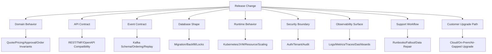

# Part 065 — Operational Readiness Review Before Production Release

## 1. Source notes and scope boundary

This part uses public reliability and release-readiness concepts, especially:

- AWS Well-Architected Operational Excellence and Operational Readiness Review guidance.
- Google SRE material on incident response, postmortems, alerting, release engineering, and production operations.
- Kubernetes documentation on probes, rollouts, resource management, and workload behavior.
- PostgreSQL documentation on backup, transaction safety, schema changes, and point-in-time recovery.
- The previous parts of this series on Quote & Order domain modelling, Kafka, PostgreSQL, security, testing, observability, and CI/CD.

This part does **not** assume CSG has a specific ORR template, release board, deployment tool, GitOps tool, incident process, production environment, or support model.

Use the `Internal verification checklist` sections to validate how release readiness actually works inside your team.

---

## 2. Core thesis

Operational readiness review is not ceremony.

Operational readiness review is the final structured attempt to answer:

> If this change fails in production, will we detect it quickly, contain it safely, recover it predictably, explain it defensibly, and protect the customer?

A release is not ready just because:

- the code compiles,
- unit tests pass,
- a pull request was approved,
- CI is green,
- the image was built,
- Kubernetes accepted the manifest,
- the change worked in one test environment.

A production release is ready when the team can defend:

- the business invariant being changed,
- the blast radius,
- the migration path,
- the observability coverage,
- the rollback or roll-forward path,
- the support path,
- the data correction path,
- the customer communication path,
- the ownership path after deployment.

For enterprise Quote & Order systems, ORR is especially important because a small backend change can affect:

- sales quote generation,
- pricing correctness,
- approval authority,
- enterprise agreement enforcement,
- order capture,
- product order decomposition,
- service ordering,
- fulfillment fallout,
- billing handoff,
- audit evidence,
- tenant isolation,
- on-prem upgrade behavior.

The goal is not to avoid all change.

The goal is to make change survivable.

---

## 3. What ORR is and is not

### 3.1 ORR is not only a checklist

A checklist is useful, but a checklist alone can become cargo cult.

A good ORR has three layers:

1. **Evidence** — facts from tests, dashboards, logs, dry runs, migration reports, and staging validation.
2. **Reasoning** — explanation of why the evidence is enough for this specific risk profile.
3. **Decision** — explicit go, no-go, partial rollout, delayed rollout, or controlled exception.

If a checklist item says "monitoring exists", that is weak.

A stronger item says:

> The quote acceptance success rate, quote-to-order conversion error rate, order fallout rate, outbox relay lag, Kafka consumer lag age, database lock wait time, and API error rate are visible in the release dashboard, have known baseline values, and have alert thresholds or manual watch criteria for the rollout window.

ORR should reduce ambiguity during incident response.

### 3.2 ORR is not a substitute for engineering quality

ORR does not replace:

- design review,
- PR review,
- test strategy,
- contract compatibility,
- migration testing,
- security review,
- performance testing,
- feature flag discipline.

ORR verifies those things are complete enough for this release.

If ORR discovers fundamental design risk, the correct action is not to add one more checkbox.

The correct action is to return to design or implementation.

### 3.3 ORR is not only for infrastructure

A common weak assumption:

> ORR is only for Kubernetes, CPU, memory, autoscaling, and dashboards.

For Quote & Order systems, ORR must also include domain readiness:

- Will quotes created before release still work after release?
- Can accepted quotes be converted after a pricing rule change?
- Can in-flight orders continue after a state machine change?
- Can old event consumers tolerate the new event shape?
- Can the release preserve audit evidence for approval decisions?
- Can on-prem customers upgrade from older supported versions?
- Can support diagnose a stuck order without developer access?

Operational readiness is domain readiness plus technical readiness.

---

## 4. Release-readiness mental model

A release is a change to a socio-technical system.

It changes at least one of these planes:



An ORR asks whether the changed planes are sufficiently controlled.

Not every release needs the same depth.

A typo in internal documentation does not need the same ORR as a quote pricing calculation change.

But a release that changes a business invariant, API contract, event schema, migration, tenant boundary, or state machine needs explicit readiness evidence.

---

## 5. Change classification

Before doing ORR, classify the release.

### 5.1 Low-risk change

Examples:

- internal refactor behind unchanged tests and unchanged behavior,
- log message improvement,
- dashboard addition,
- non-functional code cleanup,
- additive internal validation with no customer impact,
- documentation-only change.

Required readiness:

- normal CI green,
- basic PR review,
- no contract/migration/security impact,
- deployment rollback path unchanged.

### 5.2 Medium-risk change

Examples:

- new optional API field,
- new feature flag default off,
- new query path,
- small UI/API behavior change,
- additive Kafka event field,
- non-blocking DB index,
- new dashboard or alert.

Required readiness:

- targeted test evidence,
- compatibility check,
- deployment verification,
- basic monitoring plan,
- rollback/disable path.

### 5.3 High-risk change

Examples:

- pricing calculation logic,
- approval threshold logic,
- quote acceptance behavior,
- quote-to-order conversion,
- order state machine,
- order decomposition,
- customer/account/agreement model,
- tenant isolation behavior,
- non-trivial migration,
- Kafka partition key or event schema change,
- external integration adapter change,
- on-prem upgrade path change.

Required readiness:

- design doc or ADR,
- domain invariant tests,
- integration tests,
- contract tests,
- migration dry run,
- dashboard/runbook,
- rollback or roll-forward plan,
- data correction strategy,
- explicit go/no-go decision.

### 5.4 Critical-risk change

Examples:

- destructive data migration,
- security boundary change,
- tenant partitioning change,
- authentication/authorization framework change,
- product catalog publish model change,
- order fulfillment orchestration engine change,
- billing handoff contract change,
- cloud/on-prem packaging change affecting many customers,
- change with known irreversible side effect.

Required readiness:

- architecture review,
- security review,
- production-like dry run,
- performance/capacity evidence,
- customer upgrade matrix,
- support escalation plan,
- data backup/PITR verification where applicable,
- staged rollout,
- executive/customer-impact awareness where appropriate.

---

## 6. ORR decision states

Do not reduce ORR to "approved" or "not approved".

Use decision states that encode operational intent.

| Decision | Meaning | Example |
|---|---|---|
| `GO` | Ready for planned rollout. | Additive API field, tests and dashboards ready. |
| `GO_WITH_WATCH` | Release is acceptable but requires active observation during rollout window. | Pricing cache change with clear rollback. |
| `GO_BEHIND_FLAG` | Deploy allowed; feature activation separate. | New order decomposition path disabled by default. |
| `PARTIAL_ROLLOUT` | Roll out to subset of tenants/environments/customers. | Cloud-first release before on-prem package. |
| `NO_GO` | Risk not controlled. | Migration not tested on large table. |
| `DEFER_FOR_DESIGN` | ORR found architectural uncertainty. | Event schema change has no replay strategy. |
| `DEFER_FOR_OPERABILITY` | Behavior may be correct, but operations are not ready. | No dashboard/runbook for new async workflow. |
| `EXCEPTION_ACCEPTED` | Known risk accepted by accountable owners. | Non-critical alert delayed with manual watch plan. |

The strongest engineers make risk explicit.

They do not hide risk behind optimism.

---

## 7. ORR input artifacts

A serious ORR should not rely only on verbal confidence.

Prepare artifacts.

### 7.1 Engineering artifacts

- PR links.
- Design doc or ADR.
- OpenAPI diff.
- Kafka schema diff.
- Database migration diff.
- Dependency diff.
- Kubernetes manifest diff.
- Feature flag/config diff.
- Security review notes.
- Performance/load test summary where relevant.

### 7.2 Test artifacts

- Unit test results.
- Integration test results.
- Contract test results.
- Migration dry-run result.
- E2E journey test result.
- Security test result.
- Manual exploratory result if unavoidable.

### 7.3 Operational artifacts

- Release dashboard.
- Alert list.
- Runbook.
- Rollback or roll-forward plan.
- Data correction plan.
- On-call handoff.
- Support handoff.
- Known risks.
- Go/no-go decision log.

### 7.4 Customer/deployment artifacts

- Release note.
- Upgrade note.
- Compatibility matrix.
- On-prem installation/upgrade instruction.
- Customer-specific configuration impact.
- API/event deprecation note.

---

## 8. Domain readiness checklist

For Quote & Order systems, domain readiness is first-class.

### 8.1 Quote readiness

Check:

- Does the change affect quote creation?
- Does it affect quote versioning?
- Does it affect quote expiry?
- Does it affect quote acceptance?
- Does it affect quote cancellation/rejection?
- Does it affect quote-to-order conversion?
- Does it affect accepted quotes created before the release?
- Does it affect draft quotes created before the release?
- Does it affect quote item hierarchy?
- Does it affect pricing snapshot or catalog snapshot?

Evidence:

- quote lifecycle tests,
- state transition tests,
- backward compatibility tests using pre-release quote fixtures,
- API contract tests,
- audit event verification.

Release question:

> Can a quote created before release safely continue through its lifecycle after release?

### 8.2 Pricing readiness

Check:

- Does the release change base price calculation?
- Does it change recurring/non-recurring charge handling?
- Does it change discount stacking?
- Does it change agreement overlay?
- Does it change approval threshold calculation?
- Does it change tax/fee integration boundary?
- Does it change rounding rules?
- Does it change currency handling?
- Does it change margin checks?
- Does it change recalculation behavior?

Evidence:

- golden pricing test cases,
- before/after comparison,
- approval trigger tests,
- audit snapshot tests,
- known customer agreement examples,
- production-like catalog fixture.

Release question:

> Can we explain why a quote price changed, and can we prove no unintended price movement occurred?

### 8.3 Catalog readiness

Check:

- Does the release change product offering interpretation?
- Does it change characteristic validation?
- Does it change bundle expansion?
- Does it change effective date handling?
- Does it change catalog version selection?
- Does it change cache invalidation?
- Does it change publish pipeline behavior?
- Does it affect old catalog versions still referenced by active quotes/orders?

Evidence:

- catalog compatibility tests,
- old/new catalog fixture tests,
- cache invalidation tests,
- snapshot/reference tests,
- publish/rollback drill where relevant.

Release question:

> Can a quote/order using yesterday's catalog snapshot still be interpreted correctly after the release?

### 8.4 Order readiness

Check:

- Does the release change order capture?
- Does it change validation?
- Does it change decomposition?
- Does it change order item state?
- Does it change cancellation/amendment semantics?
- Does it change retry/resume behavior?
- Does it change fallout handling?
- Does it change fulfillment adapter behavior?
- Does it change completion criteria?

Evidence:

- order state machine tests,
- order item transition tests,
- decomposition tests,
- failure path E2E tests,
- idempotency tests,
- retry/resume tests,
- manual fallout tests.

Release question:

> Can in-flight orders survive the release without being stranded, duplicated, or completed incorrectly?

---

## 9. API readiness checklist

### 9.1 REST/OpenAPI readiness

Check:

- Is the OpenAPI spec updated?
- Is the API change additive or breaking?
- Were nullable/default behaviors reviewed?
- Were enum additions reviewed?
- Are old clients tolerant of new responses?
- Are error codes and error payloads compatible?
- Are pagination/filtering semantics unchanged?
- Are idempotency headers preserved?
- Are ETags/version fields preserved where used?
- Are tenant/auth scopes enforced consistently?

Evidence:

- OpenAPI diff,
- contract tests,
- generated client compile/test,
- old client compatibility test,
- negative auth tests.

### 9.2 TMF-aligned API readiness

If the release touches TMF620, TMF648, TMF622, TMF629, TMF637, or TMF641 aligned APIs, check:

- Which TMF version is targeted?
- Are extension fields namespaced or documented?
- Are standard fields preserved?
- Are resource relationships preserved?
- Are notification events compatible?
- Are lifecycle status mappings still valid?
- Is internal domain divergence intentional and documented?

Evidence:

- TMF mapping table,
- conformance check if applicable,
- consumer integration tests,
- API examples updated.

### 9.3 API rollback consideration

API rollback is harder than code rollback if consumers already observed new behavior.

Before release, decide:

- Can this endpoint behavior be rolled back safely?
- Are new fields harmless if later removed from implementation but still present in documentation?
- Are clients likely to start depending on the new behavior immediately?
- Is a feature flag needed for behavior activation?
- Is a versioned endpoint needed?

---

## 10. Event readiness checklist

Kafka event changes are high-risk because consumers may be invisible.

Check:

- Is the event type new or changed?
- Is the schema change backward compatible?
- Is the partition key unchanged?
- Is event ordering expectation unchanged?
- Is aggregate sequence/version present where needed?
- Are correlation ID and causation ID present?
- Are tenant and security boundaries preserved?
- Are old consumers tolerant of new fields?
- Are new consumers replay-safe?
- Are DLQ/retry paths known?

Evidence:

- schema registry compatibility result,
- consumer contract tests,
- replay test,
- duplicate event test,
- out-of-order test,
- consumer lag dashboard.

Release question:

> If we replay this topic from last week, will the new consumer produce correct, idempotent outcomes?

---

## 11. Database and migration readiness checklist

Database readiness is often the difference between a controlled release and a production incident.

### 11.1 Schema migration readiness

Check:

- Is the migration backward compatible with the currently deployed app?
- Is it forward compatible with the next app version?
- Does it use expand-contract where needed?
- Does it avoid long blocking locks?
- Does it use `CREATE INDEX CONCURRENTLY` where appropriate?
- Does it avoid rewriting large tables unexpectedly?
- Does it introduce non-null columns safely?
- Does it validate constraints safely?
- Does it preserve old read/write paths during rollout?
- Does it work for on-prem upgrades from older versions?

Evidence:

- migration dry run,
- lock analysis,
- runtime measurement on production-like data volume,
- rollback/roll-forward analysis,
- upgrade matrix test.

### 11.2 Backfill readiness

Check:

- Is backfill chunked?
- Is it idempotent?
- Can it resume after failure?
- Does it avoid saturating primary DB?
- Does it have progress tracking?
- Does it have rate limiting?
- Does it preserve tenant isolation?
- Does it emit audit/evidence where needed?
- Can it run while app traffic continues?

Evidence:

- dry-run count,
- sample before/after validation,
- performance measurement,
- progress dashboard,
- abort/resume test.

### 11.3 Data model compatibility readiness

Check:

- Can old code read new rows?
- Can new code read old rows?
- Are default values safe?
- Are enum values compatible?
- Are JSONB shape changes compatible?
- Are indexes sufficient for new query paths?
- Are foreign keys/constraints aligned with lifecycle invariants?

Evidence:

- dual-version compatibility tests,
- integration tests with old fixtures,
- query plan review,
- migration test suite.

---

## 12. Kubernetes and runtime readiness checklist

Check:

- Are startup/readiness/liveness probes correct?
- Is readiness tied to actual serving ability?
- Are resource requests/limits reviewed?
- Are JVM heap and container memory aligned?
- Is graceful shutdown configured?
- Can Kafka consumers stop without duplicate unsafe side effects?
- Can HTTP requests drain safely?
- Is rolling update strategy safe?
- Is PodDisruptionBudget configured where needed?
- Is autoscaling behavior understood?
- Are secrets/config mounted safely?
- Are NetworkPolicies/service mesh policies compatible?

Evidence:

- deployment manifest diff,
- staging rollout result,
- pod restart test,
- graceful shutdown test,
- resource usage baseline,
- startup time measurement.

Release question:

> Can Kubernetes kill and restart this service during the release without corrupting business workflow?

---

## 13. Security readiness checklist

Check:

- Are authentication requirements unchanged or documented?
- Is JWT issuer/audience validation preserved?
- Are service-to-service credentials configured?
- Are RBAC/ABAC checks applied to all new endpoints/commands?
- Are approval authority checks preserved?
- Is tenant scope enforced at API, DB, cache, and event boundaries?
- Are secrets handled through approved mechanisms?
- Are audit logs created for sensitive actions?
- Are PII fields redacted in logs/events?
- Does support/admin tooling require proper authorization?

Evidence:

- negative authorization tests,
- tenant isolation tests,
- security review notes,
- secret scanning result,
- audit test result,
- dependency vulnerability scan.

Release question:

> Does this change create any path for a user, service, tenant, or support actor to see or modify data they should not control?

---

## 14. Observability readiness checklist

A release without observability creates silent risk.

### 14.1 Required identifiers

Check that logs, metrics, traces, events, and audit records carry the identifiers needed to reconstruct:

- tenant ID,
- customer/account ID when safe,
- quote ID,
- quote version,
- order ID,
- order item ID,
- product offering ID,
- catalog version,
- agreement ID where safe,
- correlation ID,
- causation ID,
- request ID,
- event ID,
- idempotency key.

### 14.2 Required dashboards

For a high-risk Quote & Order release, the dashboard should include:

- API request rate,
- API error rate,
- API latency,
- quote creation success/failure,
- pricing calculation latency/error,
- quote acceptance failure rate,
- quote-to-order conversion failure rate,
- order capture rate,
- order validation failure rate,
- order fallout rate,
- order completion rate,
- outbox backlog,
- Kafka producer error rate,
- Kafka consumer lag age,
- DLQ rate,
- PostgreSQL slow queries,
- PostgreSQL lock waits,
- Kubernetes restart count,
- JVM memory/GC,
- downstream adapter failure rate.

### 14.3 Required alerts or manual watch criteria

Not every release needs new alerting.

But every high-risk release needs a watch plan:

- what metric will be watched,
- what baseline is expected,
- what deviation is concerning,
- who watches it,
- for how long,
- what action will be taken.

Release question:

> If this release breaks the main business journey, what signal will tell us first?

---

## 15. Runbook readiness

A runbook is not documentation for perfect conditions.

A runbook is a guide for tired engineers under pressure.

It should be short, direct, and action-oriented.

### 15.1 Minimum runbook structure

Use this shape:

```md
# Runbook: <release/change/failure mode>

## Symptoms
- What alerts or customer reports indicate this failure?

## Scope check
- How to identify affected tenants/customers/orders/quotes?

## Immediate mitigation
- What can be disabled, rolled back, throttled, or paused?

## Diagnosis
- What dashboards, logs, traces, queries, or events should be checked?

## Safe commands
- Approved operational commands or scripts.

## Data correction
- Whether correction is needed and where the repair runbook lives.

## Escalation
- Who owns domain, DB, infra, integration, support, customer comms?

## Recovery verification
- How to prove the system is healthy again?

## Follow-up
- What evidence to collect for postmortem?
```

### 15.2 Runbook quality test

Ask:

- Can a new on-call engineer follow it?
- Does it avoid dangerous ad-hoc SQL?
- Does it state what not to do?
- Does it distinguish diagnosis from mitigation?
- Does it include rollback/disable path?
- Does it include verification after mitigation?
- Does it include escalation boundary?

---

## 16. Rollback and roll-forward readiness

Rollback is not always safe.

Roll-forward is not always possible.

The ORR must explicitly choose.

### 16.1 Code rollback

Safe when:

- schema is backward compatible,
- events are backward compatible,
- config is backward compatible,
- old version can read data written by new version,
- external consumers are not depending on new behavior yet.

Unsafe when:

- new version wrote irreversible data shape,
- migration dropped old column/table,
- event schema changed incompatibly,
- order state transitioned into a state old code cannot interpret,
- downstream side effects already occurred.

### 16.2 Feature flag disable

Useful when:

- risky behavior can be isolated,
- old code path remains available,
- flag state is observable,
- flag changes are audited,
- flag can be changed quickly and safely.

Dangerous when:

- both code paths write incompatible data,
- flag changes affect in-flight workflows unpredictably,
- flag is tenant-specific and untested across matrix,
- cleanup never happens.

### 16.3 Roll-forward

Useful when:

- production issue has clear fix,
- rollback would corrupt or strand data,
- change is small and tested,
- release pipeline can deliver safely,
- mitigation is already in place.

Dangerous when:

- root cause is uncertain,
- fix is speculative,
- test coverage is weak,
- release pressure replaces reasoning.

### 16.4 Data repair

Needed when:

- wrong state was persisted,
- duplicate event caused duplicate side effect,
- quote price snapshot is wrong,
- order state is stuck,
- outbox event is missing or invalid,
- audit evidence is incomplete,
- customer-facing data is inconsistent.

Data repair must have its own approval, dry run, audit, and verification.

Part 066 covers this in detail.

---

## 17. Release rollout patterns

### 17.1 Big-bang rollout

Use only when:

- change is low risk,
- rollback is safe,
- customer impact is minimal,
- deployment topology requires it.

Avoid for:

- pricing engine changes,
- order lifecycle changes,
- schema changes with data migration,
- security boundary changes,
- event schema changes.

### 17.2 Canary rollout

Useful for:

- runtime behavior changes,
- performance-sensitive changes,
- new adapter logic,
- query path changes.

Weakness:

- quote/order workflows may be long-running,
- failures may appear hours later,
- low-volume tenants may not exercise risky paths,
- on-prem deployment may not support canary.

### 17.3 Blue/green rollout

Useful for:

- fast cutover with rollback option,
- minimizing downtime,
- infrastructure-level changes.

Weakness:

- database migration compatibility still matters,
- async consumers may double-process if not coordinated,
- traffic switch does not undo side effects.

### 17.4 Feature-flag rollout

Useful for:

- business behavior activation,
- tenant-specific enablement,
- progressive rollout,
- kill switch.

Weakness:

- permanent flags create complexity,
- matrix explosion,
- data written under flag may be incompatible,
- support must know flag state.

### 17.5 Shadow mode

Useful for:

- new pricing engine comparison,
- new decomposition planner comparison,
- new validation logic comparison,
- new query performance measurement.

Weakness:

- no real side effects means not full proof,
- comparison logic must be carefully designed,
- privacy and cost must be managed.

---

## 18. ORR for common Quote & Order release types

### 18.1 Pricing logic change

Minimum readiness:

- design note explaining rule change,
- golden pricing examples,
- regression suite across representative catalog/agreement/customer cases,
- before/after price diff report,
- approval threshold test,
- audit snapshot validation,
- feature flag or customer-scoped rollout if risk is high,
- dashboard for pricing errors and latency,
- rollback/disable plan,
- support note explaining expected behavior.

Red flags:

- only happy-path pricing test,
- no enterprise agreement fixture,
- no rounding/currency test,
- no approval invalidation test,
- no before/after comparison,
- no way to explain price movement.

### 18.2 Quote state machine change

Minimum readiness:

- transition matrix updated,
- illegal transition tests,
- old quote fixture compatibility,
- audit event verification,
- idempotency tests for repeated commands,
- concurrency tests for accept/expire/cancel race,
- dashboard for transition failures,
- data repair plan for stuck quotes.

Red flags:

- state string added without transition review,
- UI updated but backend guard missing,
- terminal state can be modified,
- accepted quote can be repriced accidentally,
- expired quote can be converted.

### 18.3 Order decomposition change

Minimum readiness:

- decomposition rule diff,
- representative catalog fixture,
- dependency graph validation,
- service order mapping test,
- partial failure/fallout test,
- retry/resume test,
- downstream simulator test,
- dashboard for fallout and task latency,
- rollback/feature flag strategy,
- support runbook for stuck orders.

Red flags:

- no in-flight order compatibility analysis,
- no cancellation/amendment analysis,
- no idempotency guarantee,
- no task uniqueness constraint,
- no fallout visibility.

### 18.4 Kafka event schema change

Minimum readiness:

- schema compatibility result,
- consumer impact list,
- replay test,
- duplicate event test,
- DLQ handling check,
- event metadata check,
- old consumer compatibility check,
- rollout sequencing plan.

Red flags:

- partition key changed casually,
- enum changed without consumer check,
- field removed/renamed,
- consumers unknown,
- replay unsafe.

### 18.5 Database migration change

Minimum readiness:

- expand-contract plan,
- migration dry run,
- lock analysis,
- performance estimate,
- rollback/roll-forward plan,
- backup/PITR assumption verified where needed,
- on-prem upgrade path checked,
- old/new app compatibility tested.

Red flags:

- `ALTER TABLE` on large table without lock analysis,
- non-null column added without staged backfill,
- index created non-concurrently on hot table,
- old code cannot read new data,
- migration not tested with production-like volume.

### 18.6 Tenant isolation/security change

Minimum readiness:

- threat model delta,
- negative authorization tests,
- cross-tenant tests,
- support/admin tool tests,
- audit verification,
- log redaction check,
- security review.

Red flags:

- tenant predicate manually added in some queries but not all,
- authorization only in UI,
- service-to-service path bypasses check,
- cache key lacks tenant ID,
- event lacks tenant scope.

---

## 19. Release-day execution

### 19.1 Before deployment

Confirm:

- artifact version,
- commit SHA,
- config version,
- migration version,
- feature flag default,
- dashboard links,
- runbook links,
- on-call owner,
- rollback owner,
- support contact,
- go/no-go decision.

### 19.2 During deployment

Watch:

- deployment progress,
- pod readiness,
- restart count,
- API error rate,
- API latency,
- DB lock waits,
- DB CPU/IO,
- Kafka producer errors,
- consumer lag age,
- outbox backlog,
- business journey metrics,
- support/customer reports.

### 19.3 After deployment

Verify:

- one quote create/price/accept journey,
- one quote-to-order conversion,
- one order decomposition path,
- one event produced/consumed path,
- one audit reconstruction path,
- dashboards return expected data,
- no unexpected error spike,
- no slow query regression,
- no DLQ growth.

### 19.4 Rollout window closure

Close the rollout only after:

- monitoring window is complete,
- no unresolved high-risk anomalies,
- known anomalies documented,
- support informed,
- release notes updated,
- follow-up tasks captured.

---

## 20. Go/no-go template

Use this template for high-risk releases.

```md
# Go/No-Go Decision: <release name>

## Change summary
- What changed?
- Which domains are affected?

## Risk classification
- Low / Medium / High / Critical
- Why?

## Affected surfaces
- API:
- Kafka:
- DB:
- Kubernetes/runtime:
- Security/tenant:
- Observability:
- On-prem/customer upgrade:

## Evidence
- Unit tests:
- Integration tests:
- Contract tests:
- Migration dry run:
- Performance test:
- Security test:
- Manual validation:

## Rollout plan
- Scope:
- Sequence:
- Feature flags:
- Monitoring window:

## Rollback / roll-forward plan
- Code rollback:
- Config rollback:
- Migration rollback/roll-forward:
- Feature disable:
- Data repair:

## Operational readiness
- Dashboard:
- Alerts/manual watch:
- Runbook:
- On-call owner:
- Support handoff:

## Known risks
- Risk:
- Mitigation:
- Owner:

## Decision
- GO / GO_WITH_WATCH / GO_BEHIND_FLAG / PARTIAL_ROLLOUT / NO_GO / DEFER
- Approvers:
- Timestamp:
```

---

## 21. ORR anti-patterns

### 21.1 "CI is green, therefore ready"

CI green means automated checks passed.

It does not prove:

- production observability,
- rollback safety,
- customer upgrade safety,
- in-flight workflow safety,
- data repair readiness.

### 21.2 "Rollback solves everything"

Rollback does not undo:

- external side effects,
- Kafka events already consumed,
- DB rows already migrated,
- customer-visible state changes,
- downstream fulfillment actions,
- audit evidence gaps.

### 21.3 "This is only an internal change"

Internal changes can break external behavior through:

- DTO mapping,
- query performance,
- event shape,
- timing behavior,
- cache invalidation,
- transaction boundary,
- tenant predicate.

### 21.4 "We can fix data later"

Data correction is not casual.

A data repair requires:

- diagnosis,
- approval,
- dry run,
- audit,
- backup/recovery assumptions,
- verification,
- customer impact assessment.

### 21.5 "The team knows what to do"

During incidents, implicit knowledge fails.

If recovery requires a specific person, the release is not operationally mature.

---

## 22. Internal verification checklist

Verify these inside CSG/team context.

### 22.1 Release governance

- Is there an official ORR template?
- Which changes require ORR?
- Who approves high-risk releases?
- Is there a release calendar?
- Are production changes batched or continuous?
- Are customer maintenance windows required?
- Are on-prem releases governed differently?

### 22.2 Pipeline and deployment

- Which CI/CD system is used?
- Which GitOps/IaC system is used?
- How are artifacts promoted?
- How are environment configs managed?
- How are database migrations sequenced?
- How are rollbacks executed?
- How are feature flags changed?

### 22.3 Observability

- Where are logs stored?
- Where are metrics stored?
- Where are traces stored?
- What is the standard correlation ID?
- Are business metrics available?
- Which dashboards are official?
- Which alerts page someone?

### 22.4 Incident and support

- Who is on call?
- What is the escalation path?
- Where are runbooks stored?
- Where are postmortems stored?
- How does support report production issues?
- How are customer-impacting incidents communicated?

### 22.5 Data and repair

- Is there a data repair policy?
- Who can approve repair scripts?
- Are repair scripts version-controlled?
- Is there a dry-run standard?
- Are backup/PITR assumptions documented?
- Are customer-specific data correction rules documented?

### 22.6 Security and compliance

- Who approves security-sensitive releases?
- What vulnerability gates are mandatory?
- What audit fields are required?
- What PII/logging restrictions apply?
- How is tenant isolation tested?
- What customer/regulatory evidence is required?

---

## 23. Practical exercise: build an ORR for a pricing change

Assume a change modifies discount stacking for enterprise agreements.

Create an ORR packet with:

1. Change summary.
2. Risk classification.
3. Affected quote/pricing/approval invariants.
4. Golden pricing examples.
5. Before/after diff report.
6. API compatibility statement.
7. Event impact statement.
8. Database impact statement.
9. Feature flag strategy.
10. Dashboard/watch plan.
11. Rollback plan.
12. Data repair plan for quotes priced incorrectly.
13. Support note.
14. Go/no-go decision.

Senior-level answer quality:

- clear invariant list,
- no vague "should be fine",
- explicit comparison data,
- rollback limitations acknowledged,
- data correction not hand-waved,
- support/customer impact considered.

---

## 24. Practical exercise: review an ORR

Review this weak ORR statement:

> We changed order decomposition. Tests pass. The release can be rolled back if there is an issue.

A senior review should ask:

- Which decomposition rules changed?
- Which product offerings are affected?
- What happens to in-flight orders?
- Are service orders already emitted rollback-safe?
- Are downstream systems idempotent?
- Is the task graph persisted differently?
- Are duplicate tasks prevented?
- Are fallout dashboards updated?
- Is there a runbook for stuck orders?
- Is the feature flag tenant-scoped?
- Does rollback understand new state/data written by this release?
- Were cancellation/amendment paths tested?

The point is not to block the release.

The point is to force the release to become explainable.

---

## 25. Summary

Operational readiness review is the production-safety layer that connects:

- domain correctness,
- API compatibility,
- event safety,
- database migration safety,
- runtime behavior,
- security and tenant isolation,
- observability,
- support workflow,
- rollout and rollback strategy,
- data correction readiness.

For Quote & Order systems, ORR must reason about the business journey, not only infrastructure.

A release is ready when the team can answer:

1. What can fail?
2. How will we detect it?
3. How will we contain it?
4. How will we recover it?
5. How will we prove what happened?
6. Who owns each action?
7. What customer/business risk remains?

That is the difference between shipping code and operating an enterprise product.
