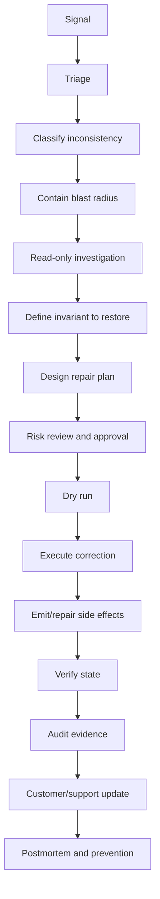

# Part 066 — Data Repair, Reconciliation, and Production Correction Workflows

## 1. Source notes and scope boundary

This part uses public reliability, database, security, and operational principles, especially:

- PostgreSQL documentation on transactions, backups, point-in-time recovery, constraints, and `pg_dump`/restore concepts.
- Google SRE material on incident response, postmortems, and operational discipline.
- NIST log management guidance as a general reference for log/audit management practices.
- Previous parts of this series on consistency, idempotency, outbox/inbox, audit, migration testing, PostgreSQL, Kafka, and operational readiness.

This part does **not** assume CSG has a specific data repair platform, production database access model, approval workflow, runbook format, incident tool, reconciliation framework, or customer communication policy.

Use the `Internal verification checklist` sections to validate the real production correction process.

---

## 2. Core thesis

Data repair is not "running SQL".

Data repair is controlled production correction.

In a Quote & Order system, data repair may affect:

- accepted quotes,
- pricing evidence,
- approval decisions,
- product order state,
- order item state,
- fulfillment tasks,
- service orders,
- product inventory,
- billing handoff,
- customer-visible status,
- audit trail,
- tenant isolation,
- contractual obligations.

A senior engineer does not ask only:

> What update statement fixes the row?

A senior engineer asks:

> What is the smallest safe correction that restores business invariants, preserves evidence, avoids duplicate side effects, and can be audited, tested, and reversed or compensated?

Production data correction is engineering plus governance.

---

## 3. Why data repair is dangerous

Data repair is dangerous because it bypasses normal application guardrails.

Normal application flow may enforce:

- state transition guards,
- authorization checks,
- approval authority,
- pricing validation,
- idempotency checks,
- audit event creation,
- outbox event emission,
- cache invalidation,
- downstream notification,
- tenant scoping,
- optimistic locking.

A direct database update may bypass all of them.

The repair may make the database look correct while leaving the system inconsistent:

- audit trail missing,
- read model stale,
- Kafka event not emitted,
- external system not updated,
- cache still wrong,
- downstream process still stuck,
- support dashboard still misleading,
- billing handoff still incorrect.

Therefore, production correction must be designed as a workflow, not a query.

---

## 4. Data inconsistency taxonomy

Before fixing data, classify the inconsistency.

### 4.1 State inconsistency

Examples:

- quote marked `ACCEPTED` but no acceptance audit event,
- order marked `COMPLETED` while one item is still `IN_PROGRESS`,
- order item in `FULFILLED` but parent order in `VALIDATING`,
- fulfillment task failed but order not moved to fallout,
- cancellation requested but order continues processing.

Primary risk:

- illegal lifecycle behavior,
- wrong customer-visible status,
- duplicate or missing downstream action.

### 4.2 Snapshot inconsistency

Examples:

- quote references catalog version `v10` but item snapshot contains `v11` attributes,
- pricing snapshot total does not equal line totals,
- approval snapshot does not match final quote price,
- order snapshot missing accepted quote version.

Primary risk:

- audit cannot explain business decision,
- accepted commercial terms are ambiguous,
- billing/fulfillment mismatch.

### 4.3 Referential inconsistency

Examples:

- order item references missing quote item,
- fulfillment task references missing order item,
- outbox event references aggregate not found,
- audit record references unknown actor.

Primary risk:

- workflow cannot continue,
- support cannot reconstruct history,
- repair scope expands unexpectedly.

### 4.4 Duplicate side-effect inconsistency

Examples:

- duplicate order created from same accepted quote,
- duplicate service order emitted downstream,
- duplicate outbox event published,
- duplicate billing handoff generated,
- duplicate approval request sent.

Primary risk:

- customer impact,
- revenue leakage,
- downstream operational cost,
- contract breach.

### 4.5 Missing side-effect inconsistency

Examples:

- quote accepted but no order created,
- order accepted but no decomposition task created,
- fulfillment completed but product inventory not updated,
- state changed but no Kafka event emitted,
- approval completed but audit missing.

Primary risk:

- stuck workflows,
- stale downstream systems,
- invisible business failure.

### 4.6 Projection/read-model inconsistency

Examples:

- order table correct but search index stale,
- event stream correct but dashboard read model stale,
- product inventory projection behind source event,
- reporting table missing corrections.

Primary risk:

- wrong operational decisions,
- false customer/support view,
- unnecessary manual intervention.

### 4.7 Security/tenant inconsistency

Examples:

- row has wrong tenant ID,
- audit event has missing tenant scope,
- customer-specific configuration applied to wrong tenant,
- support repair query updated multiple tenants.

Primary risk:

- cross-tenant data leakage,
- unauthorized modification,
- compliance incident.

---

## 5. The production correction lifecycle

A safe correction follows a lifecycle.



Skipping steps creates hidden risk.

A direct jump from signal to update statement is dangerous.

---

## 6. Signal and triage

Data repair often starts from one of these signals:

- customer reports wrong quote/order status,
- support sees stuck order,
- alert fires on fallout backlog,
- reconciliation job reports mismatch,
- Kafka DLQ grows,
- outbox backlog grows,
- billing rejects handoff,
- fulfillment system rejects service order,
- audit report has missing record,
- migration validation fails,
- dashboard shows impossible state.

Triage goals:

1. Confirm whether data is actually wrong.
2. Determine customer/business impact.
3. Determine if the system is still actively making it worse.
4. Stop the bleeding before repairing historical rows.

Example:

If duplicate service orders are being emitted, do not start by deleting duplicates.

First pause or disable the emitter path if safe.

Then repair.

---

## 7. Containment before correction

Containment prevents the repair from racing with ongoing bad behavior.

Possible containment actions:

- disable a feature flag,
- pause a Kafka consumer,
- stop an outbox relay,
- block a problematic tenant-specific configuration,
- disable a scheduler,
- temporarily reject a command path,
- rate-limit a downstream adapter,
- route new cases to manual review,
- roll back code if safe,
- prevent further quote acceptance for affected catalog version if necessary.

Containment must be explicit.

Record:

- what was paused/disabled,
- when,
- by whom,
- why,
- expected side effects,
- how it will be restored.

---

## 8. Read-only investigation

Before writing anything, build a read-only evidence model.

### 8.1 Investigation principles

Use queries that:

- are tenant-scoped,
- are time-bounded,
- are business-key scoped,
- avoid locking production rows unnecessarily,
- do not leak PII into shared documents,
- can be repeated for verification,
- can be reviewed by another engineer.

### 8.2 Investigation questions

Ask:

- Which tenants are affected?
- Which customers/accounts are affected?
- Which quotes/orders/items are affected?
- Which state transition failed?
- Which event or command caused it?
- Which release introduced it?
- Are there duplicate side effects?
- Are downstream systems affected?
- Are audit records complete?
- Is the issue still ongoing?
- What invariant must be restored?

### 8.3 Evidence bundle

Create an evidence bundle containing:

- incident/reference ID,
- affected tenant list,
- affected aggregate IDs,
- timeline,
- relevant logs/traces,
- relevant Kafka events,
- relevant DB rows,
- expected invariant,
- actual violation,
- proposed correction.

Do not rely on memory.

---

## 9. Define the invariant to restore

Bad repair plans often say:

> Set status to COMPLETED.

Good repair plans say:

> Restore the invariant that an order may be `COMPLETED` only when all required order items are terminal-success, all required fulfillment tasks are terminal-success, the product inventory update is observed or explicitly reconciled, and the completion audit event exists.

Repair the invariant, not just the visible field.

Examples of invariants:

### 9.1 Quote invariant

- accepted quote must reference immutable quote version,
- accepted quote must have pricing snapshot,
- accepted quote must have acceptance actor/time,
- accepted quote must not be repriced silently,
- accepted quote must have approval evidence if threshold required approval.

### 9.2 Order invariant

- order total state must be derivable from item states,
- terminal order cannot have active tasks,
- cancellation state must be reflected in downstream tasks,
- quote-to-order conversion must be idempotent,
- order item actions must map to valid product/service actions.

### 9.3 Outbox/event invariant

- every committed business state transition requiring external notification must have an outbox record,
- every event must have event ID, aggregate ID, event type, version, correlation ID, causation ID, tenant scope,
- replaying the event must be idempotent.

### 9.4 Audit invariant

- sensitive business action must have actor, authority, timestamp, before/after, reason or command context,
- repair itself must create audit evidence,
- repair must not rewrite history silently.

---

## 10. Repair strategy selection

There are several ways to repair.

Choose the least dangerous one that restores the invariant.

### 10.1 Application command repair

Use an application command when possible.

Examples:

- retry order decomposition,
- resume fulfillment task,
- cancel order through proper cancellation command,
- re-emit event through approved admin endpoint,
- regenerate projection through application job.

Advantages:

- reuses domain guards,
- emits audit/events,
- respects authorization,
- preserves invariants.

Disadvantages:

- may not support broken states,
- may fail due to the same bug,
- may be unavailable in production tooling.

### 10.2 Admin tool repair

Use a controlled admin tool when available.

Advantages:

- can expose safe operations,
- can enforce tenant scope,
- can require approval,
- can produce audit,
- can support dry run.

Disadvantages:

- must be maintained,
- may lag behind domain changes,
- may be too powerful if poorly designed.

### 10.3 Database script repair

Use direct database repair only when necessary.

Advantages:

- precise,
- useful for broken states application cannot handle,
- can repair large sets with careful batching.

Disadvantages:

- bypasses application guards,
- can miss side effects,
- can corrupt audit,
- can cause locks/performance issues,
- can cross tenant boundaries if poorly scoped.

### 10.4 Event replay/rebuild repair

Use event replay or projection rebuild when source of truth is correct and projection is wrong.

Advantages:

- avoids manual row mutation,
- preserves event-driven model,
- suitable for read models.

Disadvantages:

- consumers must be replay-safe,
- replay can overload downstream,
- old event schema compatibility matters,
- duplicate side effects must be prevented.

### 10.5 Reconciliation-driven repair

Use reconciliation when two systems disagree and neither can be blindly trusted.

Advantages:

- compares source of truth explicitly,
- can produce exception report,
- supports manual review for ambiguous cases.

Disadvantages:

- needs clear ownership and precedence rules,
- can be slow,
- may require customer/support decision.

---

## 11. Approval model

Data repair must have approval appropriate to risk.

### 11.1 Low-risk repair

Examples:

- rebuild derived read model,
- re-run idempotent projection,
- mark internal diagnostic row as processed after verification.

Approval:

- peer review,
- runbook reference,
- audit log.

### 11.2 Medium-risk repair

Examples:

- re-emit missing event,
- retry stuck order task,
- correct non-customer-visible operational state,
- update missing correlation metadata.

Approval:

- domain owner review,
- operations/on-call review,
- dry run evidence,
- post-execution verification.

### 11.3 High-risk repair

Examples:

- modify accepted quote pricing evidence,
- change customer-visible order state,
- remove duplicate order/service order,
- correct tenant ID,
- repair approval records,
- alter billing handoff state.

Approval:

- domain owner,
- senior/principal engineer,
- operations owner,
- security/compliance if applicable,
- support/customer owner if customer-visible,
- explicit rollback/compensation plan.

### 11.4 Critical repair

Examples:

- cross-tenant data correction,
- destructive deletion,
- large-scale migration repair,
- financial/billing correction,
- audit evidence reconstruction,
- repair affecting many customers.

Approval:

- formal incident/change process,
- executive/customer-impact awareness where applicable,
- legal/compliance review if needed,
- backup/PITR validation,
- strong evidence package,
- execution window and communication plan.

---

## 12. Dry-run discipline

Every non-trivial repair needs dry run.

Dry run should answer:

- Which rows would be affected?
- Which tenants would be affected?
- Which aggregate IDs would be affected?
- What before/after values are expected?
- How many rows per table?
- Which indexes are used?
- What locks might be taken?
- How long might it run?
- What validation queries will pass after execution?

### 12.1 Dry-run output shape

Use this format:

```md
# Dry Run: <repair name>

## Scope
- Tenant(s):
- Time range:
- Aggregate IDs:

## Candidate rows
- Table A: <count>
- Table B: <count>
- Table C: <count>

## Sample before state
- <safe, redacted examples>

## Proposed after state
- <safe, redacted examples>

## Expected side effects
- Outbox events:
- Audit records:
- Cache invalidation:
- Downstream reconciliation:

## Performance estimate
- Query plan:
- Batch size:
- Expected duration:
- Lock risk:

## Validation queries
- Query 1:
- Query 2:
- Query 3:
```

### 12.2 Dry run anti-patterns

Avoid:

- dry run only on developer data,
- no tenant filter,
- no count of affected rows,
- no sample inspection,
- no query plan review,
- no post-repair validation query,
- no explanation of side effects.

---

## 13. Database repair design principles

### 13.1 Always scope by tenant and business key

Bad:

```sql
UPDATE orders
SET status = 'COMPLETED'
WHERE status = 'IN_PROGRESS';
```

Better:

```sql
UPDATE orders
SET status = 'COMPLETED',
    updated_at = now(),
    version = version + 1
WHERE tenant_id = :tenant_id
  AND order_id = :order_id
  AND status = 'IN_PROGRESS'
  AND NOT EXISTS (
    SELECT 1
    FROM order_items oi
    WHERE oi.tenant_id = orders.tenant_id
      AND oi.order_id = orders.order_id
      AND oi.status NOT IN ('COMPLETED', 'CANCELLED')
  );
```

This is still simplified.

A real repair must also consider audit, outbox, cache, and downstream state.

### 13.2 Prefer invariant predicates over assumption predicates

Bad predicate:

```sql
WHERE status = 'IN_PROGRESS'
```

Better predicate:

```sql
WHERE status = 'IN_PROGRESS'
  AND all_required_items_are_terminal_success = true
  AND completion_event_missing = true
```

The query should encode why the row is safe to repair.

### 13.3 Make repair idempotent

A repair may be retried.

Design it so re-running does not create duplicate side effects.

Use:

- unique repair ID,
- repair audit table,
- `ON CONFLICT DO NOTHING` for repair markers,
- deterministic outbox event ID where appropriate,
- expected old value in `WHERE` clause,
- version check,
- chunk checkpoint.

### 13.4 Use transactions carefully

A single huge transaction can:

- hold locks too long,
- generate large WAL,
- increase replication lag,
- block application writes,
- make rollback expensive.

A repair should often use small batches with checkpoints.

But batches must preserve invariants.

Do not split a correction across batches if partial correction leaves business state invalid.

### 13.5 Preserve audit

Do not silently rewrite history.

A repair should record:

- repair ID,
- incident/change ID,
- actor,
- approver,
- reason,
- before values,
- after values,
- timestamp,
- affected aggregate IDs,
- validation result.

Audit records may be in an audit table, event stream, incident system, or approved repair log depending on internal process.

Verify the real standard internally.

---

## 14. Repair script structure

A production repair script should be structured.

```text
repair/
  README.md
  001_investigation.sql
  002_dry_run.sql
  003_repair.sql
  004_validation.sql
  005_rollback_or_compensation.sql
  evidence/
    dry-run-result-redacted.md
    approval.md
    execution-result.md
```

### 14.1 Script header

Every script should start with a header:

```sql
-- Repair ID: REPAIR-2026-XXXX
-- Incident/Change ID: INC-XXXX / CHG-XXXX
-- Purpose: Restore order lifecycle invariant for affected orders.
-- Scope: tenant_id = ..., order_id in (...)
-- Author: ...
-- Reviewed by: ...
-- Approved by: ...
-- Dry run completed: yes/no
-- Backup/PITR assumption checked: yes/no/not applicable
-- Expected rows: ...
-- Safe to rerun: yes/no, explanation
-- Rollback/compensation: ...
```

### 14.2 Guard clauses

Use guard clauses.

Examples:

- fail if affected row count differs from expected,
- fail if tenant count differs from expected,
- fail if status is no longer expected,
- fail if version changed since dry run,
- fail if downstream state indicates different reality.

### 14.3 Validation query

Every repair must include validation.

Validation should prove invariant restoration, not just changed row count.

Examples:

- no order has parent completed while child active,
- every accepted quote has pricing snapshot,
- every order state transition has audit record,
- every business event has outbox or published event record,
- no affected order remains in stuck state,
- no cross-tenant row updated.

---

## 15. Outbox and event-side repair

Database state and event state must be reconciled.

### 15.1 Missing outbox event

If a business transition committed but outbox event is missing:

Options:

1. Insert missing outbox event with deterministic event ID.
2. Trigger application-level re-publication command.
3. Rebuild projection from authoritative table if event is only for read model.
4. Manually update downstream system if event cannot be safely emitted.

Questions:

- Would emitting the event now be semantically correct?
- Does event timestamp represent original occurrence or repair time?
- Will consumers treat it as duplicate or new transition?
- Is aggregate sequence still valid?
- Is causation/correlation known?
- Does audit need repair context?

### 15.2 Duplicate outbox event

If duplicate events exist:

Questions:

- Did consumers process both?
- Are downstream side effects duplicated?
- Can duplicate be marked suppressed?
- Is idempotency key stable?
- Should downstream reconciliation run?
- Does DLQ contain related failures?

### 15.3 Replay repair

If replay is used:

Check:

- consumer is replay-safe,
- side effects are disabled or idempotent,
- replay window is bounded,
- schema versions are readable,
- ordering assumptions are preserved,
- replay progress is observable,
- replay result is validated.

Never replay a topic blindly into side-effecting consumers.

---

## 16. Cache, search, and projection repair

Some inconsistencies are not source-of-truth problems.

They are projection problems.

Examples:

- search index stale,
- dashboard read model stale,
- cache contains old catalog version,
- materialized view not refreshed,
- reporting table missing event.

Repair approach:

1. Identify authoritative source.
2. Validate source is correct.
3. Rebuild projection from source.
4. Avoid manual projection edits unless necessary.
5. Verify projection matches source.
6. Investigate why projection diverged.

Projection repair should not mutate business source-of-truth unless source is wrong.

---

## 17. Backup, restore, and PITR assumptions

Do not treat backup as a magic undo button.

Before high-risk repair, verify:

- backup exists,
- backup is recent enough,
- restore process is known,
- point-in-time recovery assumptions are documented,
- restoring one table/tenant is possible or not,
- restore would not overwrite good data created after the repair,
- recovery time objective is acceptable,
- on-prem/customer-managed database constraints are known.

PostgreSQL supports multiple backup/restore strategies, including logical dumps and continuous archiving/PITR, but each has constraints.

A senior engineer does not say:

> We have backups.

A senior engineer says:

> We verified the backup/restore assumptions relevant to this repair and understand whether rollback means restore, compensating script, or roll-forward correction.

---

## 18. Reconciliation design

Reconciliation detects and sometimes repairs divergence.

### 18.1 Source-of-truth map

Before reconciliation, define source of truth per fact.

| Fact | Likely source of truth | Notes |
|---|---|---|
| Quote accepted commercial terms | Quote service/database | Must include immutable version and price snapshot. |
| Product offering definition | Catalog service/database | Version/effective date matters. |
| Customer/account identity | Customer/CRM/master data context | Avoid local mutation unless owning context. |
| Order lifecycle state | Order service/database | Derived from item/task states if designed that way. |
| Fulfillment task execution | Fulfillment/SOM context | May be external. |
| Product inventory | Inventory context | Existing installed base authority. |
| Billing state | Billing context | Do not infer from order alone. |
| Audit evidence | Audit/event store | Must preserve actor/time/reason. |

The actual source-of-truth map must be verified internally.

### 18.2 Reconciliation types

#### Table-to-table reconciliation

Example:

- order parent state vs order item states.
- quote total vs quote line totals.
- outbox published flag vs event publication log.

#### Service-to-service reconciliation

Example:

- order service vs fulfillment system.
- product order vs product inventory.
- quote/order vs billing handoff.

#### Event-to-state reconciliation

Example:

- event stream says order completed but DB state says in progress.
- DB state says quote accepted but no accepted event published.

#### Source-to-projection reconciliation

Example:

- order table vs search index.
- product inventory source vs reporting read model.

### 18.3 Reconciliation output

A good reconciliation job outputs categories:

- `MATCHED` — no action.
- `SOURCE_MISSING` — target exists but source does not.
- `TARGET_MISSING` — source exists but target does not.
- `VALUE_MISMATCH` — both exist but fields differ.
- `AMBIGUOUS` — cannot decide safely.
- `AUTO_REPAIRABLE` — safe automatic fix.
- `MANUAL_REVIEW` — requires domain/support decision.

Avoid binary "valid/invalid" output for complex workflows.

---

## 19. Example repair: duplicate order from accepted quote

### 19.1 Symptom

A customer reports two orders created from one accepted quote.

### 19.2 Possible causes

- quote-to-order endpoint retried without idempotency,
- idempotency key not persisted,
- transaction committed but response timed out,
- duplicate Kafka command processed,
- unique constraint missing,
- concurrent accept/convert race.

### 19.3 Investigation

Read-only checks:

- quote ID and accepted version,
- orders referencing same quote/version,
- idempotency key records,
- audit events,
- outbox events,
- downstream fulfillment/service orders,
- billing handoff state,
- customer-visible status.

### 19.4 Repair strategy

Do not simply delete one order.

Decision depends on side effects:

- If duplicate order has no downstream side effects, cancel/suppress duplicate through domain path if possible.
- If duplicate order emitted service order, coordinate downstream cancellation.
- If billing handoff occurred, coordinate billing reversal/correction.
- If customer saw both orders, support/customer communication may be needed.

### 19.5 Prevention

- enforce unique constraint on quote/version conversion,
- persist idempotency key,
- make quote-to-order command idempotent,
- add concurrency test,
- add duplicate conversion alert,
- update ORR checklist for conversion changes.

---

## 20. Example repair: order stuck in in-progress after fulfillment complete

### 20.1 Symptom

Fulfillment system shows all tasks complete, but order remains `IN_PROGRESS`.

### 20.2 Possible causes

- completion event lost,
- Kafka consumer failed,
- outbox event stuck,
- order item state not updated,
- parent state aggregation bug,
- projection stale,
- task dependency graph missing edge.

### 20.3 Investigation

Check:

- fulfillment task states,
- service order callbacks,
- Kafka event history,
- consumer logs,
- DLQ,
- order item states,
- parent aggregation logic,
- audit events,
- product inventory update.

### 20.4 Repair strategy

Prefer application-level resume/reconcile command.

If direct repair is needed:

- update item states only if fulfillment evidence supports it,
- update parent state only if derived invariant holds,
- insert audit repair record,
- emit missing order completed event if required,
- verify product inventory/billing handoff.

### 20.5 Prevention

- make completion consumer idempotent,
- add reconciliation job,
- add stuck-state alert,
- add aggregate state invariant test,
- improve DLQ runbook.

---

## 21. Example repair: pricing snapshot mismatch

### 21.1 Symptom

Quote total does not equal sum of quote item prices, or approval record references a different total.

### 21.2 Possible causes

- rounding bug,
- partial recalculation,
- catalog version mismatch,
- discount rule changed mid-quote,
- concurrent quote update,
- approval record created before final price update,
- migration/backfill bug.

### 21.3 Investigation

Check:

- quote version,
- quote item prices,
- tax/fee fields,
- discount records,
- agreement overlay,
- approval threshold calculation,
- approval audit record,
- catalog version,
- pricing engine logs/traces.

### 21.4 Repair strategy

Be extremely careful.

Accepted quote pricing evidence may be contractual.

Possible actions:

- if quote is draft, recalculate through application flow,
- if quote is pending approval, invalidate/re-request approval,
- if quote is accepted, do not silently change price; create explicit correction/amendment path if business-approved,
- if display projection is wrong but source snapshot is correct, rebuild projection,
- if audit record is incomplete, add repair evidence rather than rewriting original decision silently.

### 21.5 Prevention

- immutable pricing snapshot on acceptance,
- approval snapshot hash,
- total vs line invariant test,
- pricing before/after comparison in ORR,
- concurrency guard during price acceptance.

---

## 22. Example repair: tenant ID correction

### 22.1 Symptom

A row appears under wrong tenant scope.

### 22.2 Risk

This may be a security incident, not merely a data bug.

Do not repair casually.

### 22.3 Investigation

Check:

- whether any user saw wrong-tenant data,
- audit access logs,
- API responses,
- cache/search projections,
- events emitted with wrong tenant,
- downstream systems that consumed it,
- related child rows,
- support/admin access.

### 22.4 Repair strategy

Needs security/compliance involvement according to internal policy.

Possible actions:

- contain access,
- correct source row and children if safe,
- purge/rebuild projections/caches,
- suppress or correct events,
- notify relevant stakeholders according to policy,
- preserve full evidence.

### 22.5 Prevention

- tenant ID as mandatory part of every aggregate key,
- tenant-scoped unique constraints,
- MyBatis tenant predicate tests,
- cross-tenant security tests,
- cache key includes tenant,
- event envelope includes tenant,
- support tool tenant scoping.

---

## 23. Data repair and audit

Repair must be auditable.

### 23.1 Repair audit record should answer

- What was changed?
- Why was it changed?
- Who executed it?
- Who approved it?
- When was it executed?
- Which incident/change/request authorized it?
- Which tenants/customers/aggregates were affected?
- What before/after values changed?
- Which validation queries passed?
- Were downstream effects triggered?
- Was customer/support communication needed?

### 23.2 Do not destroy original evidence

Avoid:

- overwriting audit rows,
- deleting bad events without replacement evidence,
- changing timestamps to pretend the original event happened correctly,
- losing before values,
- hiding repair reason.

A defensible system records correction as correction.

---

## 24. Data repair security

Production correction tooling is high privilege.

Controls should include:

- least privilege,
- tenant scoping,
- approval workflow,
- MFA/strong identity,
- session logging,
- command logging,
- PII redaction,
- break-glass process,
- separation of duties for high-risk correction,
- review of support/admin scripts,
- secure storage of evidence.

Dangerous patterns:

- shared production DB credentials,
- unreviewed SQL pasted into console,
- support tools with unrestricted tenant access,
- repair scripts stored locally only,
- missing audit of who ran what,
- production exports with PII in Slack/email.

---

## 25. Testing data repair

Repair code is production code.

Test it.

### 25.1 Unit tests

For repair logic implemented in application code:

- invariant classification,
- eligibility check,
- before/after transformation,
- idempotency,
- audit event construction.

### 25.2 Integration tests

Use PostgreSQL/Testcontainers where possible:

- repair query affects expected rows,
- tenant filter works,
- version guard works,
- transaction behavior works,
- outbox/audit records created,
- rerun is safe.

### 25.3 Migration-style tests

For large correction:

- production-like fixture,
- chunking behavior,
- resume behavior,
- performance estimate,
- validation query.

### 25.4 Replay/reconciliation tests

For event/projection repair:

- duplicate events,
- out-of-order events,
- old schema events,
- partial replay window,
- side-effect suppression.

---

## 26. Production execution checklist

Before execution:

- incident/change ID exists,
- scope is defined,
- blast radius is known,
- containment completed if needed,
- dry run reviewed,
- approval recorded,
- backup/PITR assumptions checked if relevant,
- execution window agreed,
- monitoring ready,
- rollback/compensation plan ready,
- support/customer communication plan ready if needed.

During execution:

- run exact reviewed script/tool,
- capture start time,
- monitor row counts,
- monitor DB load/locks,
- monitor application errors,
- monitor Kafka/outbox/DLQ,
- stop if guard condition fails,
- record output.

After execution:

- run validation queries,
- check dashboards,
- verify affected journeys,
- verify audit record,
- verify downstream state,
- re-enable paused components if safe,
- update incident/change record,
- create prevention backlog item,
- communicate closure.

---

## 27. Repair runbook template

```md
# Data Repair Runbook: <title>

## 1. Problem
- What invariant is violated?
- How was it detected?

## 2. Scope
- Tenant(s):
- Customer/account(s):
- Quote/order/item IDs:
- Time range:

## 3. Impact
- Customer-visible impact:
- Financial/billing impact:
- Fulfillment impact:
- Security/audit impact:

## 4. Containment
- What was paused/disabled?
- Who approved containment?

## 5. Investigation evidence
- Queries:
- Logs/traces:
- Events:
- Downstream evidence:

## 6. Invariant to restore
- Expected state:
- Current state:

## 7. Repair method
- Application command / admin tool / DB script / replay / reconciliation:
- Why this method?

## 8. Dry run
- Candidate row count:
- Before/after sample:
- Query plan/lock risk:

## 9. Approval
- Reviewer:
- Approver:
- Timestamp:

## 10. Execution
- Script/tool version:
- Operator:
- Start/end time:
- Output:

## 11. Validation
- Validation query results:
- Dashboard check:
- Downstream check:
- Audit check:

## 12. Follow-up
- Root cause:
- Prevention changes:
- Tests to add:
- ORR checklist updates:
```

---

## 28. Senior review checklist for data repair PR/script

A senior engineer should ask:

### Scope

- Is the repair tenant-scoped?
- Is the affected set explicit?
- Is there an expected row count?
- Is the time range bounded?
- Are PII fields handled safely?

### Invariant

- What invariant is being restored?
- Does the script encode the invariant or just set a field?
- Are parent/child states consistent after repair?
- Are source-of-truth boundaries respected?

### Safety

- Is the repair idempotent?
- Is there a dry run?
- Are there guard conditions?
- Is transaction size safe?
- Is lock risk reviewed?
- Is rollback/compensation realistic?

### Side effects

- Does the repair need audit records?
- Does it need outbox events?
- Does it need cache invalidation?
- Does it need downstream notification?
- Does it need projection rebuild?

### Verification

- Are validation queries included?
- Do they prove invariant restoration?
- Are dashboards/runbooks updated?
- Is there a prevention follow-up?

### Governance

- Is approval recorded?
- Is execution owner clear?
- Is support/customer impact assessed?
- Is security/compliance involved if needed?

---

## 29. Internal verification checklist

Verify these inside CSG/team context.

### 29.1 Access and governance

- Who can access production data?
- Is direct DB access allowed?
- Is break-glass access available?
- What approval is required for data repair?
- Where are repair scripts stored?
- Are repair executions audited?
- Is separation of duties required?

### 29.2 Tooling

- Is there an internal admin repair tool?
- Is there a reconciliation framework?
- Is there a repair job runner?
- Is there a dry-run framework?
- Is there a standard migration/repair repository?
- Is there a standard way to emit repair audit events?

### 29.3 Data model

- What are the authoritative tables for quote/order/catalog/pricing/customer/inventory?
- Which tables are projections?
- Which fields are snapshots?
- Which fields are derived?
- Which states are terminal?
- Which repair operations are forbidden?

### 29.4 Event model

- Can missing outbox events be inserted manually?
- Can events be replayed safely?
- Is there a replay tool?
- Are consumer side effects suppressible?
- How is DLQ reprocessing approved?
- How are duplicate events tracked?

### 29.5 Observability and incident process

- How are data inconsistencies detected today?
- Which reconciliation alerts exist?
- Where are repair runbooks stored?
- Where are postmortems stored?
- How are support/customer impacts tracked?
- How are prevention tasks prioritized?

### 29.6 Backup and recovery

- What backup strategy is used for each deployment model?
- Is PITR available?
- How is restore tested?
- How does on-prem/customer-managed DB backup work?
- Who owns restore execution?
- What is the realistic RTO/RPO?

---

## 30. Practical exercise: design a repair for missing order-completed event

Scenario:

- Order DB state says `COMPLETED`.
- Product inventory was updated.
- Billing did not receive order completion.
- Kafka topic has no `OrderCompleted` event for the order.
- Customer sees order complete in UI.

Design the repair.

Your answer should include:

1. Source-of-truth analysis.
2. Read-only investigation queries.
3. Check for duplicate billing handoff.
4. Decision whether to insert outbox event, call admin endpoint, or manually notify billing.
5. Event metadata reconstruction.
6. Idempotency strategy.
7. Audit record.
8. Validation query.
9. Downstream verification.
10. Prevention change.

Strong answer:

- does not blindly publish event,
- verifies billing did not already process it,
- preserves causation/correlation as best as possible,
- marks event as repair-originated if internal standard requires,
- validates downstream effect.

---

## 31. Practical exercise: review a dangerous repair

Dangerous proposed script:

```sql
UPDATE product_orders
SET status = 'COMPLETED'
WHERE status = 'IN_PROGRESS'
  AND created_at < now() - interval '7 days';
```

Review issues:

- no tenant scope,
- no order ID scope,
- no expected row count,
- no invariant check,
- no item/task state check,
- no downstream fulfillment check,
- no audit record,
- no outbox event,
- no version increment,
- no support/customer impact assessment,
- no dry run,
- no validation,
- no rollback/compensation,
- likely corrupts orders still legitimately in progress.

A safer approach would first classify stuck orders by reason:

- fulfillment complete but parent not updated,
- fulfillment failed but fallout missing,
- callback missing,
- downstream unknown,
- legitimately long-running,
- cancelled but not propagated,
- duplicate order.

Only the first category may be auto-repairable.

---

## 32. Summary

Data repair is one of the highest-leverage and highest-risk engineering activities in enterprise systems.

For Quote & Order, repair must preserve:

- lifecycle invariants,
- commercial correctness,
- quote/pricing evidence,
- approval authority,
- order/fulfillment consistency,
- product inventory alignment,
- billing handoff correctness,
- tenant isolation,
- audit defensibility.

A mature data repair workflow has:

1. signal,
2. containment,
3. read-only investigation,
4. invariant definition,
5. repair design,
6. approval,
7. dry run,
8. controlled execution,
9. side-effect repair,
10. validation,
11. audit evidence,
12. prevention follow-up.

The strongest engineers do not treat production data as something to patch casually.

They treat it as the business memory of the system.
